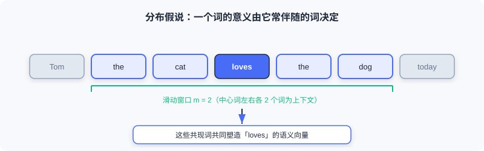
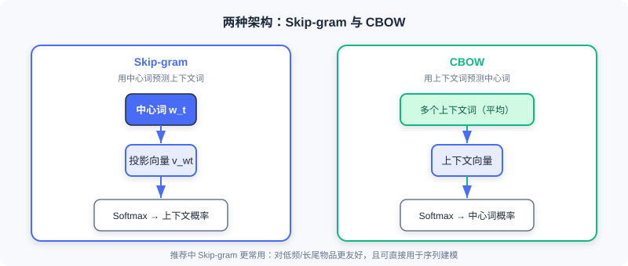
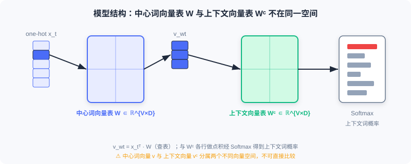

  📖
  ⏱️ ~25 min read
  🎯 Methodology

# Word2Vec 专题附录

> 📝 **为何独立成篇：** [2.2 向量召回 (I2I)](../part2-retrieval/vector-recall-i2i.md) 的 2.2.1 只讲清了 Skip-Gram 的直觉与它在推荐里的迁移。本附录补全被略去的部分——**CBOW 架构、中心词/上下文双向量表的结构细节、负采样的精确数学形式、以及词向量运算（类比）性质**——让你在使用 Item2Vec / EGES / Airbnb 之前，先吃透底层引擎。

Word2Vec 的目标很朴素：用**大量无标注文本**，给每个词学一个**低维稠密向量**，使得：

- 语义相近的词，向量在空间中也相近；
- 词与词之间的关系可以通过**向量运算**反映出来。

这套表示可以直接喂给文本分类、机器翻译、信息检索等下游任务——而在推荐里，它被「结构同构」地迁移成了 Item2Vec。

---

## 1. 动机：从 one-hot 到稠密向量

早期最直接的做法是用 **one-hot 编码**表示词：词表大小为 $V$，第 $i$ 个词就是一个第 $i$ 位为 1、其余为 0 的 $V$ 维向量。它直观，却有三个致命问题：

| 问题 | 说明 |
|------|------|
| 维度灾难 | $V$ 常达百万级，向量又高又稀疏 |
| 无法表达语义 | 任意两个不同词的 one-hot 内积都为 0，「猫」和「狗」被当成毫不相干 |
| 无法表达语法 | 单复数、时态等关系完全丢失 |

我们需要一种**既低维、又能承载语义/语法信息**的表示——这正是 Word2Vec 要解决的。

---

## 2. 分布假说与上下文窗口

Word2Vec 的理论根基是语言学的**分布假说**（Firth, 1957）：

> *「You shall know a word by the company it keeps.」*
> 一个词的意义，由它常伴随出现的词决定。

模型遍历语料中的每个词，通过调整词向量，使「预测的上下文」尽量逼近「语料中真实的上下文」。具体来说，若中心词 $w_t$ 在位置 $t$，其上下文为窗口 $m$ 内的词 $w_{t-m},\dots,w_{t-1},w_{t+1},\dots,w_{t+m}$。

---

## 3. 两种架构：Skip-gram 与 CBOW

Word2Vec 包含两个镜像对称的模型。在 [2.2.1](../part2-retrieval/vector-recall-i2i.md) 里我们只用了 Skip-Gram，这里把 CBOW 也补上。

### 3.1 Skip-gram：用中心词预测上下文

给定一个中心词，模型预测其上下文词出现的概率。对窗口内上下文词 $w_{t+j}$，条件概率为

$$
P(w_{t+j}\mid w_t)=\frac{e^{\mathbf{v}_{w_{t+j}}^\top \mathbf{v}_{w_t}}}{\sum_{k=1}^{V}e^{\mathbf{v}_{w_k}^\top \mathbf{v}_{w_t}}}
$$

其中 $\mathbf{v}_{w_i}$ 是词 $w_i$ 的向量表示，$V$ 是词表大小。遍历整个语料，似然函数为

$$
\prod_{t=1}^{T}\prod_{-m\le j\le m,\;j\ne 0} P(w_{t+j}\mid w_t)
$$

### 3.2 CBOW：用上下文预测中心词

CBOW（Continuous Bag of Words）方向相反：把上下文词**平均**后，预测中心词。

$$
P(w_t\mid w_{t+j})=\frac{e^{\mathbf{v}_{w_t}^\top \mathbf{v}_{w_{t+j}}}}{\sum_{k=1}^{V}e^{\mathbf{v}_{w_k}^\top \mathbf{v}_{w_{t+j}}}}
$$

> 💡 **该用哪个？** 推荐场景几乎都用 **Skip-gram**。原因有二：① 它对低频/长尾词更友好（每个上下文Pair都提供独立监督信号）；② 它天然适配「用户行为序列」这种变长、稀疏的输入，可直接做序列建模。CBOW 因对上下文取平均，在推荐里会抹掉序列顺序信息。

---

## 4. 模型结构与双向量表

上面的条件概率公式里藏着一个**极易误解的细节**：中心词向量 $\mathbf{v}_{w_t}$ 与上下文词向量 $\mathbf{v}_{w_{t+j}}$ **并不在同一个向量空间里**。

以 Skip-gram 为例，设向量维度为 $D$，则存在**两张**向量表：

- 中心词向量表 $\mathbf{W}\in\mathbb{R}^{V\times D}$
- 上下文词向量表 $\mathbf{W}^c\in\mathbb{R}^{V\times D}$

前向计算流程：

1. 输入中心词的 one-hot 表示 $\mathbf{x}_t\in\{0,1\}^V$；
2. 查表得到中心词向量 $\mathbf{v}_{w_t}=\mathbf{x}_t^\top\mathbf{W}$；
3. 与上下文向量表第 $(t+j)$ 行相乘，得到 Softmax 的输入；
4. 经 Softmax 输出上下文词概率。

> ⚠️ **Common Mistakes in Word2Vec**
> 把 $\mathbf{v}_{w_t}$（来自 $\mathbf{W}$）和 $\mathbf{v}_{w_{t+j}}$（来自 $\mathbf{W}^c$）当成同一空间里的向量直接比距离。它们来自两张不同的表，只有**训练完成后通常把两张表相加/平均**得到的「最终词向量」才可用于相似度计算。

---

## 5. 负采样：让 Softmax 变得可计算

直接算第 3/4 节的 Softmax 分母，需要遍历整个词表 $V$（百万级），代价不可接受。Word2Vec 用**负采样（Negative Sampling）** 把多分类问题拆成多个二分类问题。

以 Skip-gram 为例，原目标被替换为：

$$
\log\sigma\!\left(\mathbf{v}_{w_{t+j}}^\top\mathbf{v}_{w_t}\right)
+\sum_{i=1}^{n_{\mathrm{neg}}}\mathbb{E}_{w_i\sim P_n(w)}\big[\log\sigma\!\left(-\mathbf{v}_{w_i}^\top\mathbf{v}_{w_t}\right)\big]
$$

其中 $\sigma(x)=\frac{1}{1+e^{-x}}$ 是 sigmoid，$n_{\mathrm{neg}}$ 为负样本数量，$P_n(w)$ 是负采样分布。原论文取

$$
P_n(w)=\frac{\mathrm{count}(w)^{3/4}}{\sum_{w'}\mathrm{count}(w')^{3/4}}
$$

> 💡 **直觉：** 第一项希望「真实上下文词对」的相似度越来越高（抬高正样本）；第二项希望「随机采样的负样本词对」的相似度越来越低（压低负样本）。由 sigmoid 单调性可知，这与最大化原始似然 $\max P(w_{t+j}\mid w_t)$ 的目标一致，却**避免了对整个词表求和**——复杂度从 $O(V)$ 降到 $O(k)$。

> ⚠️ **Common Mistakes in Word2Vec**
> 以为负采样只是「提速技巧」、不影响语义。事实上，负样本分布 $P_n(w)$ 的 $3/4$ 次方刻意**上抬低频词**成为负样本的概率，让模型对罕见词也能学到区分性向量——这对推荐里的长尾物品尤为关键。

---

## 6. 词向量运算：类比性质

Word2Vec 最迷人的发现是：训练出的向量空间里，**语义关系可以用向量加减表达**。最经典的例子：

$$
\mathbf{v}_{\text{king}}-\mathbf{v}_{\text{man}}+\mathbf{v}_{\text{woman}}\approx\mathbf{v}_{\text{queen}}
$$

这意味着「王 − 男 + 女 ≈ 后」这种类比关系被编码进了几何结构。在推荐里，类似性质表现为「物品 A 与物品 B 的差别，约等于物品 C 与某物品 D 的差别」——这正是后续语义 ID、向量检索能做「可计算类比」的理论底气。

---

## 7. 从 Word2Vec 到推荐：Item2Vec 的桥接

把 Word2Vec 迁移到推荐，只需做一次**结构同构替换**（详见 [2.2.1](../part2-retrieval/vector-recall-i2i.md)）：

| 文本世界 | 推荐世界 |
|----------|----------|
| 词语 | 物品 |
| 句子 | 用户交互序列 |
| 词语共现 | 物品被同一用户交互 |

替换后：

- Skip-gram + 负采样 → 直接成为 Item2Vec 的训练原型；
- 学到的物品向量 → 近邻检索即可实现 I2I 召回；
- 第 4–5 节的双向量表、负采样分布等机制，原封不动地支撑起 EGES、Airbnb 等工业级变体。

> 💡 **一句话收口：** Word2Vec 的引擎（Skip-gram + 双向量表 + 负采样）是 I2I 向量召回的**方法论基石**；推荐领域的所有改进，都只是在「如何构造序列」和「如何定义正负样本」上做文章。

---

## 本章小结

- Word2Vec 用**分布假说**把「共现」学成「稠密语义向量」，解决了 one-hot 高维、稀疏、无语义的三大缺陷。
- 两大架构 **Skip-gram**（中心→上下文）与 **CBOW**（上下文→中心），推荐中几乎总用 Skip-gram。
- 结构上有**两张向量表** $\mathbf{W}$（中心）与 $\mathbf{W}^c$（上下文），分属不同空间，最终向量需合并后使用。
- **负采样**用 $k$ 个二分类近似全词表 Softmax，并通过 $P_n(w)\propto\mathrm{count}^{3/4}$ 上抬低频词，是工业可行性的关键。
- 词向量具备**类比运算**性质，为语义 ID 与向量检索提供理论支撑。
- 通过「词→物品、句子→行为序列」的同构替换，Word2Vec 直接成为 **Item2Vec** 与后续 I2I 方法的引擎。

### 🔗 前后关联

- **前置：** [2.2 向量召回 (I2I)](../part2-retrieval/vector-recall-i2i.md) 的 2.2.1 把本附录作为「序列建模理论基础」简要引用；读完本附录再回看，会更清楚 Item2Vec / EGES / Airbnb 为何那样设计。
- **后继：** [2.3 双塔模型 (U2I)](../part2-retrieval/two-tower.md) 用「用户塔 + 物品塔」的稠密向量做召回，与这里的「物品稠密向量」思路一脉相承；[6.4 Codebook 量化与语义 ID](../part6-gr-basic/codebook-quantization.md) 则是把「离散词 → 连续向量」反过来做成「连续向量 → 离散语义 ID」，可对照理解。

---

## Practice Problems

<b>Problem A.1 — 双向量表误区</b> 🟢 Easy

有人说：「Word2Vec 里中心词 $w_t$ 和上下文词 $w_{t+j}$ 的向量都在同一个 $D$ 维空间，直接算余弦相似度就行。」这句话哪里错了？

**Approach:** 回看第 4 节——$\mathbf{v}_{w_t}$ 来自 $\mathbf{W}$，$\mathbf{v}_{w_{t+j}}$ 来自 $\mathbf{W}^c$。

**答：** 错在认为两者同空间。实际上中心词向量表 $\mathbf{W}$ 与上下文向量表 $\mathbf{W}^c$ 是两张独立参数表，对应的向量分属不同空间；直接比距离是无效的。训练后通常把两表相加/平均得到最终词向量，才能用于相似度计算。

<b>Problem A.2 — 负采样缩放</b> 🟡 Medium

负采样分布用 $P_n(w)\propto \mathrm{count}(w)^{3/4}$ 而非直接用词频。若某词出现 16 次、另一词出现 81 次，分别计算它们在 $3/4$ 次方后的相对权重比（即 $81^{3/4}/16^{3/4}$），并说明这个设计对低频词的影响。

**Approach:** $16^{3/4}=(2^4)^{3/4}=2^3=8$；$81^{3/4}=(3^4)^{3/4}=3^3=27$。

**答：** 相对权重比 $=27/8\approx 3.375$。注意词频比是 $81/16\approx 5.06$，经过 $3/4$ 次方后差距被**压缩**（5.06→3.375），等于**上抬了低频词**成为负样本的概率——让模型对罕见词也学到区分性向量，缓解长尾问题。

<b>Problem A.3 — 同构迁移</b> 🔴 Hard

把 Word2Vec 迁移到推荐做 Item2Vec 时，为什么「用户交互序列 = 句子」这个映射是结构同构、而非简单类比？请从训练目标（Skip-gram + 负采样）的角度说明，并指出一个原书 [2.2.1](../part2-retrieval/vector-recall-i2i.md) 提到的、Item2Vec 相对原版 Word2Vec 的**关键简化**。

**Approach:** 同构指「输入单元 + 共现结构 + 训练目标」三者一一对应；关键简化在 Item2Vec 把用户历史当**无序集合**而非序列。

**答：** 同构体现在：词→物品、句子→用户行为序列、词共现→同用户交互，且 Skip-gram 的 $P(w_{t+j}\mid w_t)$ + 负采样目标函数**形式完全不变**，只是把文本语料换成行为序列语料。关键简化：原书指出 Item2Vec 默认把每个用户的交互历史当成**无序集合**（忽略时间顺序），而原版 Word2Vec 严格依赖滑动窗口内的有序上下文——这是它和文本版最核心的差异。

