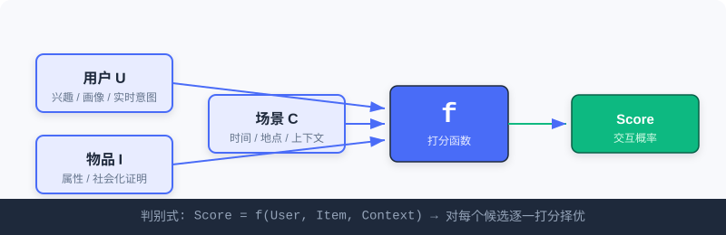
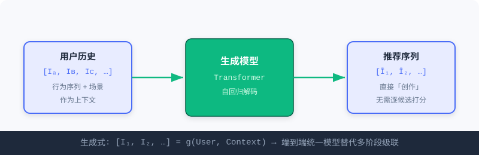
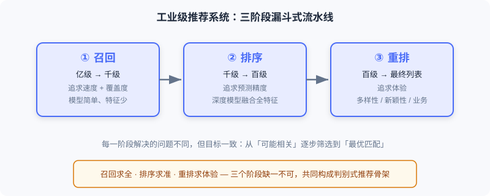

<div class="badge-row">
  <span style="background: #f0f4ff; color: #4A6CF7; padding: 4px 12px; border-radius: 20px; font-size: 0.85em; font-weight: 600; border: 1px solid rgba(74,108,247,0.2);">📖</span>
  <span style="background: #f0fdf4; color: #16a34a; padding: 4px 12px; border-radius: 20px; font-size: 0.85em; border: 1px solid rgba(22,163,74,0.2);">⏱️ ~25 min read</span>
  <span style="background: #f0fdf4; color: #16a34a; padding: 4px 12px; border-radius: 20px; font-size: 0.85em; border: 1px solid rgba(100,100,100,0.15);">🎯 Beginner</span>
</div>

# 推荐系统是什么

> 📝 **Before You Continue:** 本章是基础起点，不需要任何推荐系统前置知识。你只需要知道「机器学习是让模型从数据中学习规律」这一基本事实即可。

当你早晨打开手机刷新闻，或在电商 App 里闲逛时，可能并未意识到：有一套精密的系统正在毫秒之间做出成千上万个判断，决定你看到什么、错过什么。这就是**推荐系统**——现代互联网最底层的基础设施之一。

但「帮用户找到感兴趣的内容」只是表面描述。要真正理解它，我们需要从三个层次去观察：从最微观的**单个预测**，到工业级的**规模流程**，再到宏观的**生态平衡**。只有层层递进，才能把握推荐系统的核心逻辑。

读完本章，你将能够：

- 用**一句话**说清推荐系统要解决的微观问题，并区分其两种根本范式
- 写出**判别式**与**生成式**的核心公式，并解释二者「问的问题」有何不同
- 解释工业级推荐为何采用「召回—排序—重排」**三阶段漏斗**，以及各阶段职责
- 说明**端到端生成式架构**如何消解级联架构的三大痛点
- 从**生态三角**（用户/创作者·内容·平台）理解推荐系统的长期价值
- 完成 4 道分层练习题，巩固三种视角

---

## 1.1.0 三种视角：从微观到宏观

理解推荐系统，最忌「只看到算法」。同样一套系统，放在不同尺度下看到的东西完全不同：

| 视角 | 观察对象 | 核心问题 |
|------|----------|----------|
| 🔬 微观 | 一次「用户—物品」判断 | 两种根本范式如何定义推荐？ |
| 🏭 工业 | 亿级物品 → 一份列表 | 如何在毫秒内完成规模化筛选？ |
| 🌍 宏观 | 多方参与的生态 | 技术上「准确」的系统就是好系统吗？ |

接下来我们逐一拆解。

---

## 1.1.1 微观视角：推荐问题的两种根本范式

让我们从最基本的单元想起。推荐系统面临的核心问题看似简单——**如何为用户找到最有价值的内容？** 但对这个问题的回答，存在两种截然不同的思路。

无论哪种思路，系统都需要先深入理解三个关键要素：

- **理解用户（User）**——你是谁、兴趣如何。历史行为是最重要的信号；显式反馈（如「不感兴趣」按钮）和画像信息（年龄、地域）提供线索；实时意图（刚搜了什么）同样关键。
- **理解物品（Item）**——它的内容属性（品类、时长、质量）与统计属性（观看数、评分、互动趋势）。
- **理解场景（Context）**——工作日早晨还是周末深夜？地铁通勤还是居家休闲？细微差别显著影响偏好。

> 💡 **Key Insight:** 两种范式的**输入相同**（都要理解用户、物品、场景），但它们**提出的问题截然不同**。这一点决定了后续所有的架构与优化目标差异。

### 第一种思路：判别式推荐（Discriminative）

它将推荐定义为：给定一个具体的「用户—物品—场景」三元组，预测用户会对该物品产生正面行为的概率。核心是**打分函数**：

$$Score = f(User, Item, Context)$$

系统对每个候选物品逐一评估、计算分数、再择优推荐。这就像一位评委，面对所有选手逐一打分，最后选出高分者。



判别式推荐通过整合用户特征 $U$、物品特征 $I$ 与场景特征 $C$，对每个候选物品逐一打分，预测「有价值连接」的可能性。

### 🧠 Mental Model: 评委打分

> 把推荐想成「选秀评委」。台上站满选手（候选物品），评委（模型）对**每一个**选手单独打分，最后按分数高低发通行证。评委从不「直接报出名单」，他只负责打分。

### 第二种思路：生成式推荐（Generative）

它从根本上重新定义了问题：不再逐一评估候选，而是让模型根据用户与场景的理解，**直接「创作」推荐结果**。核心是**生成函数**：

$$[I_1, I_2, \ldots, I_k] = g(User, Context)$$

模型以用户的历史交互序列和当前场景为输入，通过自回归解码直接生成推荐物品序列。这就像一位了解你品味的朋友，不需要翻遍所有选项，而是直接说「你接下来该看这几个」。



生成式推荐以用户历史交互与场景为输入，通过生成模型直接输出推荐物品序列，无需逐一评估候选。

> 🤔 **Why 两种范式共存？** 判别式在「有限候选中择优」上极其成熟稳定；生成式在「开放空间中创造」上潜力巨大。前者问「用户会喜欢这个物品吗？」，后者问「用户接下来想看什么？」——前者是**择优**，后者是**创造**。

### 能力演进的四个阶段

从更纵深的时间线看，推荐算法呈现出一条清晰的能力演进轨迹，它同时贯穿两种范式：

1. **纯 ID 的记忆**——协同过滤将物品视为不透明符号，记忆「看过 A 的人也看了 B」的共现模式。
2. **深度学习的泛化**——深度网络通过特征交叉与序列建模，把知识泛化到未见过的用户—物品组合，但物品仍是原子 ID。
3. **语义 ID 的理解**——当物品被编码为携带语义的结构化 Token，系统开始真正「理解」内容含义，新物品无需积累行为数据即可被推荐。
4. **大模型的推理**——模型不再隐式算分，而是显式分析意图、评估匹配、给出理由，从「模式匹配器」进化为「能解释决策的推理者」。

> 💡 **Key Insight:** 这四个阶段**并非线性替代**，而是层层叠加、彼此共存。今天的工业系统里，基于 ID 的协同过滤仍是召回要道，深度泛化支撑着召回到排序各环节，语义 ID 与大模型推理则在最前沿崭露头角。

---

## 1.1.2 工业视角：规模化的两条技术路线

理解了两种基本范式，我们立刻面临共同的现实挑战：**规模**。一个典型视频平台拥有数亿用户、上亿物品，推荐要在毫秒级延迟内完成从海量物品到个性化列表的全过程——页面加载超过几秒，大部分用户就会离开。

> ⚠️ **Warning:** 推荐系统工程化的核心矛盾是——**如何在极有限时间内，从海量候选中找到最优结果？** 两种范式给出了截然不同的解法。

### 判别式的解法：多阶段流水线

判别式范式的核心困难在于：若为每个用户计算他与所有物品的匹配分数，再强的服务器也会瞬间崩溃。工业界的答案是**分阶段的漏斗式架构**，用「召回—排序—重排」三层流水线逐步缩小候选，在效率与效果间找平衡。



- **① 召回（Recall）**——快速从全量物品库筛出几千个可能相关的候选。奉行「宁可错杀一千，不可放过一个」，不求精准但求全面；模型简单、特征有限（如用协同过滤找相似用户，或基于内容相似性召回）。
- **② 排序（Ranking）**——预测函数 $f$ 真正发威的地方。动用最复杂的深度模型，融合用户/物品/场景全特征，为每个候选算精确分数；追求预测精度最大化。
- **③ 重排（Re-ranking）**——对排序结果做最终优化。解决「分数最高的列表 ≠ 体验最佳的列表」问题：引入多样性、新颖性，避免前十全是同类内容造成审美疲劳，同时处理广告、运营等业务规则。

> 💡 **Key Insight:** 三阶段流水线的精髓是——**在不同阶段用不同策略，逐步从「可能相关」筛到「最优匹配」**。召回求全、排序求准、重排求体验，三者缺一不可。

### 生成式的解法：端到端生成

生成式提出一种截然不同的思路：既然模型能直接「生成」结果，为何还需要多阶段筛选？生成式推荐把用户历史交互序列当作「上下文」，通过 Transformer 等自回归模型直接解码出物品 Token 序列——**整个过程在一个统一模型里端到端完成**，无需召回/排序/重排的级联。

> 💡 **Key Insight:** 端到端架构消除了级联架构的三个核心痛点：
> - **目标不一致**——召回优化相关性、排序优化点击率、重排优化多样性，各自为战；
> - **信息损失**——召回过滤掉的优质物品，后续阶段永远看不到；
> - **计算碎片化**——不同阶段用不同模型，难以充分利用现代 GPU 算力。

下面用交互演示直观感受「亿级 → 一份列表」的漏斗过程：

<iframe src="../viz/part1-pipeline.html?embed&vizId=part1-pipeline" style="width:100%; height:520px; border:none; display:block;" loading="lazy"></iframe>

点击「下一步」或「自动播放」，观察候选池如何从亿级逐步收缩到最终 10 条列表，以及每一阶段所承担的不同职责。

> 📊 **Data Point:** 目前两种架构在工业界**并行发展**：判别式流水线以「分而治之」在成熟场景中稳定服务；生成式架构以「端到端优化」在前沿探索中展现巨大潜力。

---

## 1.1.3 宏观视角：构建多方共赢的生态系统

把推荐系统放在更大视野中，会浮现一个更深层的问题：**一个技术上完美的推荐系统，是否就是一个真正优秀的推荐系统？** 答案往往是否定的。

经典的**「准确率陷阱」**：用户刚把一部手机加入购物车，此时系统向他推荐这部手机，点击率与转化率可能接近 100%。从指标看极其「准确」，但它创造了什么价值？几乎没有——用户本来就要买，推荐只是重复了他已知的信息，没有增量价值。

> 💡 **Key Insight:** 推荐系统的最终目标**不是单纯最大化技术指标，而是构建一个让所有参与方长期受益的健康生态**。生态中有三个基本支点：**用户与创作者、内容、平台**，三者相互依存。


- **用户与创作者**——分处内容消费与供给两端。用户是最终服务对象，系统应帮其发现「尚未接触但真正感兴趣」的内容，而非困在「越看越窄」的过滤气泡；创作者是内容供给核心，分发能力直接决定其生存空间与动力。供给端正从专业团队（PGC）为主，走向普通用户自发创作（UGC）为主体，并涌现出 AI 辅助生成（AIGC），模糊消费者与生产者边界。
- **内容**——连接用户与创作者的媒介，是真正分发的「原子单位」。健康系统不仅要分发受欢迎内容，还要持续发掘潜力内容，避免「头部集中、长尾沉没」。
- **平台**——生态协调者。既要优化效果、提升满意度与时长，又要关注长期健康（多样性、抑制低质、保护创作者积极性），有时需牺牲短期指标换取长期信任。

> ⚡ **Pro Tip:** 真正优秀的推荐系统是一个**精巧的平衡器**——在用户、创作者、内容质量与平台发展间找动态平衡点。这要求设计者不仅是技术专家，更需具备**生态思维**。

---

## ⚠️ Common Mistakes in 1.1

| # | Mistake | Example | Why It's Wrong | Fix |
|---|---------|---------|---------------|-----|
| 1 | 把推荐等同于「排序」 | 「推荐系统就是个点击率预估模型」 | 排序只是三阶段之一，前面还有召回、后面还有重排 | 始终用「召回→排序→重排」全景理解推荐 |
| 2 | 混淆两种范式问的问题 | 以为生成式也是「对每个候选打分」 | 生成式直接产出序列，不做逐候选评估 | 记住：判别式**择优**，生成式**创造** |
| 3 | 唯指标论 | 用 100% 转化率的「加购后推荐」证明系统优秀 | 没有增量价值，落入准确率陷阱 | 追问：推荐是否创造了用户本不会获得的价值？ |
| 4 | 忽视生态长期性 | 为短期时长无脑推标题党 | 损害信任与创作者生态，长期崩塌 | 用生态三角评估取舍，敢牺牲短期指标 |

---

## 本章小结

### 📌 Key Takeaways

| Concept | Key Points | Why It Matters |
|---------|-----------|----------------|
| 判别式推荐 | $Score=f(U,I,C)$，对候选逐一打分择优 | 工业级推荐的主干，成熟稳定 |
| 生成式推荐 | $[I_1..I_k]=g(U,C)$，直接生成序列 | 端到端、潜力大，是前沿方向 |
| 三阶段流水线 | 召回(全)→排序(准)→重排(体验) | 在毫秒延迟内平衡效率与效果 |
| 端到端生成 | 单模型替代多阶段级联 | 解决目标不一致、信息损失、算力碎片化 |
| 生态三角 | 用户/创作者·内容·平台 | 跳出指标，理解系统的长期价值 |

### ❓ FAQ

**Q1: 判别式和生成式，哪个更好？**
> A: 没有绝对优劣。判别式在成熟场景稳定高效，生成式在前沿探索潜力大。当前工业界两者**并行发展**，应按业务阶段选择。

**Q2: 为什么不能直接给用户展示全量物品让他挑？**
> A: 上亿物品中，用户只会看极少数。推荐的价值正是**替用户在亿级空间里做减法**，且要在毫秒级完成——这是工程现实，不是设计偏好。

**Q3: 召回阶段为什么可以用「简单模型」？**
> A: 召回奉行「宁可错杀不可放过」，目标是**覆盖**而非精准。候选集随后会被排序精筛，所以召回侧可用轻量模型换速度。

### 前后关联

- **1.2**（本书概览）把本节三种视角落到全书技术地图，定位每章在能力演进曲线上的位置。
- **2.1–2.5**（召回）展开三阶段中「召回」的具体算法家族。
- **3.1–3.5**（排序）深入判别式打分函数 $f$ 的工程实现。
- **5.3**（生成式范式演进）回头呼应本节，系统梳理从判别式到生成式的跃迁。

---

## Practice Problems

Work through all problems in order — they get progressively harder. Each has a complete solution you can reveal after trying it yourself.

---

**Problem 1.1.1 — 区分范式** 🟢 Easy

给定以下两个系统描述，判断它们更接近**判别式**还是**生成式**范式，并说明理由。

- (a) 系统为每个候选广告计算「用户点击概率」，按概率排序展示前 5 个。
- (b) 系统读取用户近 20 次播放记录，直接输出「接下来你可能想看的 3 个视频 ID」。

<details>
<summary>💡 Solution (click to reveal)</summary>

**Approach:** 抓住两种范式「问的问题」差异——是逐候选打分，还是直接产出序列。

- **(a) 判别式**：对每个候选广告单独算点击概率再排序，正是 $Score=f(U,I,C)$ 的「逐一打分择优」。
- **(b) 生成式**：直接由历史序列解码出推荐 ID 序列，不做逐候选评估，对应 $[I_1,I_2,I_3]=g(U,C)$。

**Key points:**
- 判别式 = 候选已知、逐一打分；生成式 = 直接「创作」序列。
- 判断关键是看系统是否枚举并评估了每一个候选。

</details>

---

**Problem 1.1.2 — 补全流水线** 🟢 Easy

一个推荐系统面对 1 亿物品，最终展示 10 条。请在括号中填入正确的阶段名，使其符合工业级漏斗：

`全量物品 (1亿) → [ ① ] → 候选 (约2000) → [ ② ] → 候选 (约200) → [ ③ ] → 最终列表 (10条)`

<details>
<summary>💡 Solution (click to reveal)</summary>

**Approach:** 回忆三阶段漏斗的「职责递进」。

```
全量物品 (1亿) → [ 召回 Recall ] → 候选 (约2000)
               → [ 排序 Ranking ] → 候选 (约200)
               → [ 重排 Re-ranking ] → 最终列表 (10条)
```

**Key points:**
- 召回求**全**（覆盖），排序求**准**（精度），重排求**体验**（多样性/业务）。
- 量级从亿 → 千 → 百 → 十，逐级收缩。

</details>

---

**Problem 1.1.3 — 准确率陷阱分析** 🟡 Medium

某新闻 App 发现：向刚读完一篇「世界杯决赛」报道的用户，立即推荐另一篇「世界杯决赛」报道，点击率高达 95%。产品经理据此认为推荐「非常精准」。请指出这个结论的问题，并给出更合理的评估角度。

<details>
<summary>💡 Solution (click to reveal)</summary>

**Approach:** 用「准确率陷阱」框架审视指标与价值的错位。

**答：** 95% 点击率只是「重复用户已知信息」，没有创造增量价值——用户本来就会点开同主题后续报道。这落入准确率陷阱：指标高 ≠ 系统好。

更合理的评估角度：
1. **增量价值**：推荐是否让用户发现了「本不会主动找」的内容（多样性、探索性）？
2. **生态健康**：是否陷入「越看越窄」的过滤气泡，损害长期留存？
3. **多目标平衡**：除点击率外，是否兼顾时长、分享、关注等长期指标？

**Key points:**
- 技术指标高不等于用户价值高。
- 评估应跳出单点准确率，看长期与生态。

</details>

---

**🏆 Challenge: 设计权衡论证**

假设你要为一款日活千万的新App从零搭建推荐系统。请写一段 150 字内的论证，说明：在初期数据稀疏、算力有限时，为何应**优先采用判别式三阶段流水线**而非端到端生成式架构？并指明当业务进入成熟期后，可在哪类场景尝试引入生成式。

<details>
<summary>💡 Hint</summary>

从「数据需求、算力成本、可解释性、迭代可控性」四个维度对比两种架构；成熟期可优先在**候选生成/召回**或**重排多样性**等环节做生成式试点。

</details>
