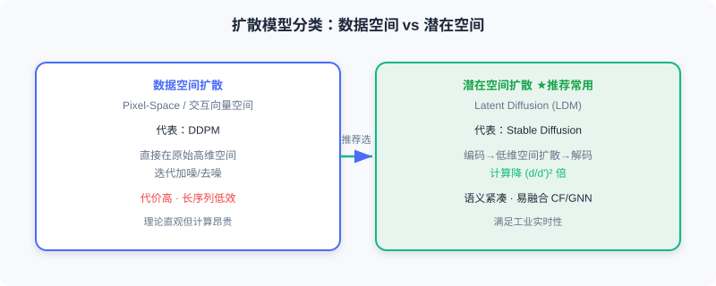
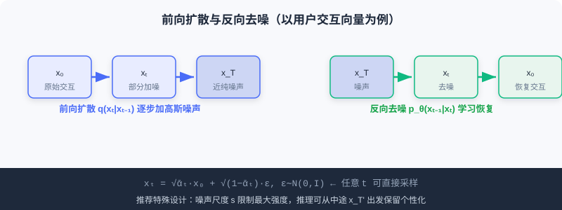

  📖
  ⏱️ ~34 min read
  🎯 Advanced

# 推荐中的扩散模型基础

> 📝 **Before You Continue:** 建议先读 [1.1](./../part1-introduction/what-is-recommender.md) 的两种范式、[5.3](./../part5-trends/generative-trend.md) 的生成式范式演进。本章是扩散模型在推荐落地的「技术铺垫」，后续 10.2/10.3 的具体方法都建立在此。

在 [5.3](./../part5-trends/generative-trend.md) 我们已从架构层面讨论过扩散模型与 Transformer 的互补关系。本节系统回顾扩散模型的**核心技术原理**，并重点讨论将其用于推荐时的**特殊考量与设计选择**。理论基础主要来自 **DDPM**，而推荐应用以 **DiffRec** 为代表性工作。

扩散模型的核心思想可以概括为两个互逆的马尔可夫过程：**前向扩散**逐步向数据添加噪声，**反向去噪**学习从噪声中恢复原始数据。读完本节，你将理解这套机制，以及它为何能成为推荐系统的「生成工具」。

读完本节，你将能够：

- **写出**前向扩散的单步转移与任意 t 直接采样公式（重参数化）
- **区分**数据空间扩散与潜在空间扩散，并说明推荐为何偏好后者
- **描述**ELBO 训练目标，以及 ε-prediction 与 x₀-prediction 两种参数化
- **解释**推荐的噪声尺度控制、推理起点选择、条件生成与两种引导策略
- 完成 4 道分层练习题，并体验结尾的「前向/反向」交互演示

---

## 10.1.0 扩散模型的两类操作空间

扩散模型按操作空间主要分为两大类：

**数据空间扩散（Pixel-Space Diffusion）**——直接在原始数据空间（图像像素、推荐中的交互向量）进行扩散与去噪。代表是 **DDPM**。理论上更直接，但因在高维原始空间迭代操作，计算成本高，处理高分辨率数据或长序列时效率尤低。

**潜在空间扩散（Latent Diffusion Models, LDM）**——先用编码器（VAE/自编码器）把原始数据压缩到低维**潜在表示空间**，在该空间扩散去噪，最后解码还原。代表是 **Stable Diffusion**。流程：编码 $\boldsymbol{z}=\mathcal{E}(\boldsymbol{x})$ → 在 $\boldsymbol{z}$ 上扩散 → 解码 $\hat{\boldsymbol{x}}=\mathcal{D}(\boldsymbol{z}_0)$。若维度从 $d$ 降到 $d'$（$\ll d$），计算量可减 $(d/d')^2$ 倍。

> 💡 **Key Insight:** 在推荐场景中，**潜在空间扩散应用更普遍**，原因有三：① **效率**——推荐处理大规模行为序列/物品特征，原始空间操作不可接受；② **语义**——潜在空间提供更紧凑、语义化的表示，契合用户兴趣/物品属性建模；③ **灵活性**——易与 CF、GNN 等现有架构融合。故本章后续方法多在物品嵌入或用户特征空间扩散，而非直接操作稀疏交互矩阵。

---

## 10.1.1 前向加噪与反向去噪过程

### 前向扩散过程

给定数据样本 $\boldsymbol{x}_0 \sim q(\boldsymbol{x}_0)$，前向过程通过 $T$ 步逐步加高斯噪声，构建潜在变量 $\boldsymbol{x}_{1:T}$。每步转移：

$$q(\boldsymbol{x}_t | \boldsymbol{x}_{t-1}) = \mathcal{N}(\boldsymbol{x}_t; \sqrt{1-\beta_t}\boldsymbol{x}_{t-1}, \beta_t\boldsymbol{I})$$

其中 $\beta_t \in (0,1)$ 控制第 $t$ 步噪声强度。当 $T \to \infty$，$\boldsymbol{x}_T$ 趋近标准高斯。利用**重参数化技巧**与高斯可加性，可从 $\boldsymbol{x}_0$ 直接采样任意 $t$ 的加噪数据：

$$q(\boldsymbol{x}_t | \boldsymbol{x}_0) = \mathcal{N}(\boldsymbol{x}_t; \sqrt{\bar{\alpha}_t}\boldsymbol{x}_0, (1-\bar{\alpha}_t)\boldsymbol{I})$$

等价地：

$$\boldsymbol{x}_t = \sqrt{\bar{\alpha}_t}\boldsymbol{x}_0 + \sqrt{1-\bar{\alpha}_t}\boldsymbol{\epsilon}, \quad \boldsymbol{\epsilon} \sim \mathcal{N}(\boldsymbol{0}, \boldsymbol{I})$$

其中 $\alpha_t = 1-\beta_t$，$\bar{\alpha}_t = \prod_{i=1}^{t}\alpha_i$。这使得训练时可高效采样任意时间步，无需逐步执行前向。

### 反向去噪过程

反向过程从 $\boldsymbol{x}_T$ 出发，通过学习到的去噪网络逐步恢复原始数据。每步去噪转移：

$$p_\theta(\boldsymbol{x}_{t-1} | \boldsymbol{x}_t) = \mathcal{N}(\boldsymbol{x}_{t-1}; \boldsymbol{\mu}_\theta(\boldsymbol{x}_t, t), \boldsymbol{\Sigma}_\theta(\boldsymbol{x}_t, t))$$

均值 $\boldsymbol{\mu}_\theta$ 与协方差 $\boldsymbol{\Sigma}_\theta$ 由神经网络参数化；实践中协方差常设为固定值 $\sigma^2(t)\boldsymbol{I}$，重点学习均值。

下面用交互演示直观感受「用户交互向量」如何逐步被加噪为噪声、又如何被去噪恢复：

<iframe src="../viz/part10-diffusion.html?embed&vizId=part10-diffusion" style="width:100%; height:520px; border:none; display:block;" loading="lazy"></iframe>

点击「下一步」或「自动播放」，观察信号格从前向的清晰交互模式，逐步被噪声淹没，再经反向去噪恢复——这正是扩散模型「雕刻」目标数据的全过程。

---

## 10.1.2 训练目标与两种参数化

### 从 ELBO 到简化损失

扩散模型通过最大化 $\boldsymbol{x}_0$ 的对数似然下界（ELBO）训练：

$$\log p(\boldsymbol{x}_0) \geq \underbrace{\mathbb{E}_{q(\boldsymbol{x}_1|\boldsymbol{x}_0)}[\log p_\theta(\boldsymbol{x}_0|\boldsymbol{x}_1)]}_{\text{重建项}} - \sum_{t=2}^{T}\underbrace{\mathbb{E}[D_{\text{KL}}(q(\boldsymbol{x}_{t-1}|\boldsymbol{x}_t,\boldsymbol{x}_0) \| p_\theta(\boldsymbol{x}_{t-1}|\boldsymbol{x}_t))]}_{\text{去噪匹配项}}$$

重建项衡量从 $\boldsymbol{x}_1$ 恢复 $\boldsymbol{x}_0$ 的能力；去噪匹配项约束学到的反向转移 $p_\theta$ 与真实后验 $q(\boldsymbol{x}_{t-1}|\boldsymbol{x}_t,\boldsymbol{x}_0)$ 对齐。推理时我们不知道 $\boldsymbol{x}_0$，故需训练网络 $p_\theta$ 近似这个理想过程。

### 两种参数化方式

去噪网络可采用两种参数化：

**1. 预测噪声 $\boldsymbol{\epsilon}$**（DDPM 标准）：

$$\mathcal{L}_{\epsilon} = \mathbb{E}_{t, \boldsymbol{x}_0, \boldsymbol{\epsilon}}[\|\boldsymbol{\epsilon} - \boldsymbol{\epsilon}_\theta(\boldsymbol{x}_t, t)\|^2]$$

**2. 预测原始数据 $\boldsymbol{x}_0$**：

$$\mathcal{L}_{x_0} = \mathbb{E}_{t, \boldsymbol{x}_0, \boldsymbol{\epsilon}}[\|\boldsymbol{x}_0 - \hat{\boldsymbol{x}}_\theta(\boldsymbol{x}_t, t)\|^2]$$

两者数学等价（$\boldsymbol{x}_t = \sqrt{\bar{\alpha}_t}\boldsymbol{x}_0 + \sqrt{1-\bar{\alpha}_t}\boldsymbol{\epsilon}$），但**推荐场景常用 x₀-prediction**。原因：推荐目标是从加噪交互向量恢复原始交互 $\boldsymbol{x}_0$，并直接以 $\hat{\boldsymbol{x}}_0$ 作为交互预测分数排序；且随机噪声 $\boldsymbol{\epsilon}$ 方差大，迫使网络估计不稳定目标会增加训练难度。

### 采样过程

训练完成后：① 从 $\boldsymbol{x}_T \sim \mathcal{N}(0,I)$ 采样；② 对 $t=T,\ldots,1$ 迭代去噪：

$$\boldsymbol{x}_{t-1} = \frac{1}{\sqrt{1-\beta_t}}\left(\boldsymbol{x}_t - \frac{\beta_t}{\sqrt{1-\bar{\alpha}_t}}\boldsymbol{\epsilon}_\theta(\boldsymbol{x}_t, t)\right) + \sigma_t \boldsymbol{z}$$

③ 得到生成样本 $\boldsymbol{x}_0$。

### 🧠 Mental Model: 雕塑家与石块

> 前向扩散像把一块完好的大理石逐渐敲成碎石堆（加噪）；反向去噪像雕塑家对照「残影」，一锤一锤把碎石重新雕回人像（去噪）。x₀-prediction 相当于雕塑家每次都直接想象「最终人像长什么样」，比盯着「刚敲掉的那堆碎石」更易上手——这正是推荐偏好它的原因。

---

## 10.1.3 推荐场景的特殊设计

与图像生成不同，推荐扩散有两项特殊设计：

**噪声尺度控制**——标准 DDPM 会把数据扩散至纯高斯（$\bar{\alpha}_T \to 0$），但推荐中完全丢失历史偏好会增加生成难度。故用噪声尺度参数 $s$ 限制最大强度，使 $t=T$ 时仍保留部分原始信号：

$$1 - \bar{\alpha}_t = s \cdot \left[\alpha_{\min} + \frac{t-1}{T-1}(\alpha_{\max} - \alpha_{\min})\right]$$

**推理起点选择**——推理可从部分加噪状态 $\boldsymbol{x}_{T'}$（$T'<T$）出发反向去噪，既利用去噪纠错处理原始交互噪声，又保留足够个性化信息。

### 条件生成与可控性

推荐希望生成受用户历史/上下文控制。条件信息可注入去噪网络：直接拼接、加性融合、或 Transformer 的 **cross-attention**。条件损失：

$$\mathcal{L}_{\text{cond}} = \mathbb{E}_{t, \boldsymbol{x}_0, \boldsymbol{\epsilon}, \boldsymbol{c}}[\|\boldsymbol{\epsilon} - \boldsymbol{\epsilon}_\theta(\boldsymbol{x}_t, t, \boldsymbol{c})\|^2]$$

推理阶段控制生成方向主要有两策略：

**1. Classifier-Guided（分类器引导）**——用预训练分类器 $p_\phi(y|\boldsymbol{x}_t)$ 梯度推离目标类：

$$\hat{\boldsymbol{\epsilon}} = \boldsymbol{\epsilon}_\theta(\boldsymbol{x}_t, t) - \gamma \cdot \sqrt{1-\bar{\alpha}_t} \nabla_{\boldsymbol{x}_t} \log p_\phi(y|\boldsymbol{x}_t)$$

推荐中可用序列推荐模型当「分类器」，引导生成与历史一致的交互序列。

**2. Classifier-Free Guidance（无分类器引导）**——训练时以概率 $p_u$ 把条件 $\boldsymbol{c}$ 替换为空占位符 $\Phi$，推理时：

$$\hat{\boldsymbol{\epsilon}} = (1 + \gamma) \cdot \boldsymbol{\epsilon}_\theta(\boldsymbol{x}_t, t, \boldsymbol{c}) - \gamma \cdot \boldsymbol{\epsilon}_\theta(\boldsymbol{x}_t, t, \Phi)$$

$\gamma$ 大→更个性化但可能损质量；$\gamma$ 小→更多样但个性化低。推荐中**更常用**。

**条件设计示例（序列推荐）**：以用户历史交互序列为条件，用 Transformer 编码器编码为 $\boldsymbol{c}_{n-1} = \text{T-enc}(\boldsymbol{e}_{1:n-1})$，引导扩散生成目标物品嵌入——把序列建模（Transformer）与生成建模（Diffusion）结合，DreamRec 即采用此架构。

> **Analysis:** 扩散模型在推荐中**不以端到端替代判别式**为主要目标，而是以其**生成能力 + 随机采样**为两个实际问题提供工具：数据稀疏性与推荐多样性。这是理解 10.2/10.3 的主线。

---

## ⚠️ Common Mistakes in 10.1

| # | Mistake | Example | Why It's Wrong | Fix |
|---|---------|---------|---------------|-----|
| 1 | 在原始交互矩阵上直接扩散 | 「用 DDPM 在稀疏矩阵上加噪」 | 高维稀疏，计算不可接受 | 用潜在空间扩散（LDM） |
| 2 | 推荐硬套 ε-prediction | 「扩散推荐默认预测噪声」 | 推荐要恢复 x₀ 并排序，x₀ 更贴合 | 用 x₀-prediction 直接输出 |
| 3 | 忽略推荐噪声尺度 | 完全扩散到纯高斯再生成 | 丢失历史偏好，生成更难 | 用尺度 s 保留部分信号 |
| 4 | 把无分类器引导当更复杂 | 「引导都需要额外分类器」 | Classifier-Free 无需分类器 | 区分两类引导，推荐常用 Free |

---

## 本章小结

### 📌 Key Takeaways

| Concept | Key Points | Why It Matters |
|---------|-----------|----------------|
| 前向/反向 | q 加噪 ↔ p_θ 去噪，马尔可夫互逆 | 扩散模型核心机制 |
| 潜在空间扩散 | 编码→扩散→解码，计算降 (d/d')² | 推荐因高维稀疏而常用 |
| 两种参数化 | ε-pred vs x₀-pred（等价） | 推荐常用 x₀-pred 更贴合 |
| 推荐特殊设计 | 噪声尺度 s、中途起点 | 保留个性化、降生成难度 |
| 条件+引导 | 拼接/交叉注意力；两类引导 | 用历史/文本控制生成方向 |

### ❓ FAQ

**Q1: 为什么推荐偏好潜在空间扩散而非数据空间？**
> A: 推荐交互向量高维稀疏，原始空间迭代去噪计算不可接受；潜在空间更紧凑、语义化，且易与 CF/GNN 融合，满足工业实时性。

**Q2: 推荐为什么常用 x₀-prediction？**
> A: 推荐目标就是恢复用户原始交互并用 $\hat{x}_0$ 排序；x₀-pred 比估计高方差噪声 ε 更稳定、更贴合任务。

**Q3: Classifier-Free Guidance 的 γ 怎么调？**
> A: γ 大→更贴合条件（个性化强）但可能损生成质量/多样性；γ 小→更多样但个性化弱。按业务在「相关性 vs 多样性」间权衡。

### 🔗 前后关联

- **1.1 / 5.3**（范式与生成式）扩散是生成式家族中「连续空间去噪」一支，与自回归生成互补。
- **10.2**（数据增强）DiffuASR / Diff-MSR 把本节基础用于生成伪交互。
- **10.3**（应用）AsymDiffRec / DMSG 把去噪能力用于特征补全与多样性。

---

## Practice Problems

Work through all problems in order — they get progressively harder. Each has a complete solution you can reveal after trying it yourself.

---

**Problem 10.1.1 — 直接采样公式** 🟢 Easy

已知 $\boldsymbol{x}_0$，第 $t$ 步的 $\bar{\alpha}_t = 0.6$，采样噪声 $\boldsymbol{\epsilon} \sim \mathcal{N}(0,I)$。请写出 $\boldsymbol{x}_t$ 的表达式，并说明信号项与噪声项的相对大小。

💡 Solution (click to reveal)

**Approach:** 套用重参数化公式。

$$\boldsymbol{x}_t = \sqrt{\bar{\alpha}_t}\boldsymbol{x}_0 + \sqrt{1-\bar{\alpha}_t}\boldsymbol{\epsilon} = \sqrt{0.6}\,\boldsymbol{x}_0 + \sqrt{0.4}\,\boldsymbol{\epsilon}$$

信号项系数 $\sqrt{0.6}\approx 0.775$，噪声项系数 $\sqrt{0.4}\approx 0.632$。此时信号略强于噪声（t 较小）。

**Key points:**
- 系数平方和为 1，保证方差守恒。
- $\bar{\alpha}_t$ 越小噪声占比越大，t 越大越接近纯噪声。

---

**Problem 10.1.2 — 空间选择判断** 🟢 Easy

下列场景应优先用数据空间扩散还是潜在空间扩散？简述理由。
- (a) 对 1024×1024 高清图像去噪
- (b) 对百万维稀疏用户-物品交互矩阵做推荐增强

💡 Solution (click to reveal)

**Approach:** 按维度与效率判断。

- (a) 数据空间扩散（DDPM 直接在像素空间，图像场景经典）。
- (b) 潜在空间扩散（LDM）——百万维稀疏矩阵直接扩散计算不可接受，应先编码到低维潜在空间再扩散。

**Key points:**
- 高维/稀疏 → 潜在空间。
- 推荐几乎都用 LDM。

---

**Problem 10.1.3 — 参数化对比** 🟡 Medium

某扩散推荐模型用 ε-prediction 训练，但在排序时发现预测分数波动大、效果不稳。请解释可能原因，并说明改用 x₀-prediction 为何更合适（引用方差与任务目标）。

💡 Solution (click to reveal)

**Approach:** 从参数化差异分析。

**原因：** ε-prediction 让网络估计所加高斯噪声 $\boldsymbol{\epsilon}$，而 $\boldsymbol{\epsilon}\sim\mathcal{N}(0,I)$ 方差大，目标不稳定，导致恢复出的 x₀ 排序分数波动。

**改用 x₀-pred：** 推荐目标是恢复原始交互 $\boldsymbol{x}_0$ 并直接以 $\hat{\boldsymbol{x}}_0$ 作为交互预测分数排序——x₀-pred 的损失 $\|\boldsymbol{x}_0 - \hat{\boldsymbol{x}}_0\|^2$ 直接优化这个任务目标，且避开高方差噪声估计，训练更稳定、更贴合推荐。

**Key points:**
- 两者数学等价，但任务适配性不同。
- 推荐「恢复 x₀ 即打分」→ 选 x₀-pred。

---

**Problem 10.1.4 — 设计条件引导** 🔴 Hard

你要为序列推荐设计条件扩散：用 Transformer 编码用户历史为条件 $\boldsymbol{c}$，引导扩散生成下一个物品嵌入。请写出：① 条件如何注入去噪网络（至少两种方式）；② Classifier-Free Guidance 的训练与推理公式；③ 若想「更个性化但接受略低多样性」，γ 应调大还是调小。

💡 Solution (click to reveal)

**Approach:** 套用本节条件生成与引导。

1. **注入方式**：直接拼接 $[\boldsymbol{x}_t; \boldsymbol{c}]$；或加性融合（时间步嵌入相加注入各层）；或在 Transformer 中去噪网络用 cross-attention 融合 $\boldsymbol{c}$。
2. **Classifier-Free**：训练时以概率 $p_u$ 把 $\boldsymbol{c}$ 替换为空 $\Phi$；推理 $\hat{\boldsymbol{\epsilon}} = (1+\gamma)\boldsymbol{\epsilon}_\theta(\boldsymbol{x}_t,t,\boldsymbol{c}) - \gamma\boldsymbol{\epsilon}_\theta(\boldsymbol{x}_t,t,\Phi)$。
3. **γ 调大** → 更偏向条件（个性化强），但多样性略降——符合「更个性化、接受略低多样性」。

**Key points:**
- 条件注入要贯穿去噪各层。
- γ 是相关性 vs 多样性的旋钮。

---

**🏆 Challenge: 推荐延迟论证**

扩散模型推理需多步迭代去噪，而工业推荐常要求百毫秒级延迟。请写一段 200 字内，论证：在「数据增强（离线）」与「在线排序」两种用途中，扩散的延迟开销分别是否可接受？并指出 10.3 会用到的一种加速采样技术。

💡 Hint

离线数据增强（如 DiffuASR 生成前序序列）可承受多步去噪，延迟无关紧要；在线排序若每请求多步迭代则难达标——故扩散多用于离线增强/生成，在线慎用。加速技术：DDIM（去确定性少步采样），10.3 的 DMSG 即用其把步数从上千减到 50、毫秒级。呼应 10.3 的延迟设计。

