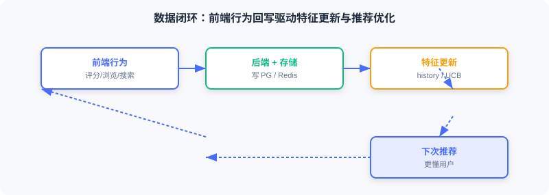

<div class="badge-row">
  <span style="background: #f0f4ff; color: #4A6CF7; padding: 4px 12px; border-radius: 20px; font-size: 0.85em; font-weight: 600; border: 1px solid rgba(74,108,247,0.2);">📖</span>
  <span style="background: #f0fdf4; color: #16a34a; padding: 4px 12px; border-radius: 20px; font-size: 0.85em; border: 1px solid rgba(22,163,74,0.2);">⏱️ ~26 min read</span>
  <span style="background: #fef9ec; color: #d97706; padding: 4px 12px; border-radius: 20px; font-size: 0.85em; border: 1px solid rgba(100,100,100,0.15);">🎯 Intermediate</span>
</div>

# 前端与交互

> 📝 **Before You Continue:** 请先读完 [11.4](./online-pipeline.md) 的推荐 API。本节展示前端如何调用该 API，并把用户行为反馈回系统形成闭环。

前端是用户与推荐系统的入口：浏览、查看推荐、搜索、评分。这些行为被采集反馈到后端，影响未来推荐——所以前端不仅是展示层，也是**数据采集层**。

读完本章，你将能够：

- 列出前端技术栈（Vue 3 / Tailwind / Pinia / Vue Router / Axios）与五类核心页面
- 用路由 `meta` + `beforeEach` 守卫实现登录/游客权限控制
- 描述 MovieCard / MovieRow / StarRating 三个核心组件的设计要点
- 解释首页如何按登录状态条件渲染「For You」、登录后自动加载推荐
- 用 Pinia 集中管理认证状态、用防抖（debounce）控制搜索请求频率
- 说明注册页偏好类型如何驱动冷启动策略
- 完成 4 道分层练习题

---

## 11.5.0 前端概述

本项目前端技术栈：

| 技术 | 用途 |
|------|------|
| Vue.js 3 | 渐进式 JS 框架，用 Composition API |
| Tailwind CSS | CSS 框架，类名快速写样式 |
| Pinia | 状态管理库，管用户认证状态 |
| Vue Router | 路由管理，处理页面导航 |
| Axios | HTTP 客户端，与后端 API 通信 |

核心页面：首页（个性化推荐/热门/分类）、电影详情页（信息+评分）、认证页（登录/注册）、个人中心（历史/偏好）、搜索（全局实时搜索）。


> 💡 **Key Insight:** 前端不只是「把推荐结果画出来」——用户的评分、浏览、搜索经前端采集回后端，构成「用户行为 → 特征更新 → 推荐优化」闭环。这是系统能持续变好的关键。

---

## 11.5.1 项目结构与路由配置

目录结构：`components/`（可复用）、`views/`（页面级）、`services/`（API）、`stores/`（状态）。

```javascript
const routes = [
  { path: '/', name: 'Home', component: Home },
  { path: '/movie/:id', name: 'MovieDetail', component: MovieDetail, props: true },
  { path: '/auth', name: 'Auth', component: Auth, meta: { guest: true } },
  { path: '/profile', name: 'Profile', component: Profile, meta: { requiresAuth: true } },
]
```

`meta` 标记访问权限，导航守卫 `beforeEach` 在跳转前检查：

```javascript
router.beforeEach((to, from, next) => {
  const token = localStorage.getItem('token')
  if (to.meta.requiresAuth && !token) {
    next('/auth')                              // ← KEY LINE: 未登录 → 跳登录
  } else if (to.meta.guest && token) {
    next('/')                                  // ← KEY LINE: 已登录不能访问登录页
  } else {
    next()
  }
})
```

权限逻辑集中在路由层，页面组件无需各自检查登录。

---

## 11.5.2 核心组件设计

**电影卡片 MovieCard**：最基础单元，接收 `movie` 与 `width`，显示海报/标题/年份/评分。设计要点：整卡用 `<router-link>` 可点击；`loading="lazy"` 懒加载图；`@error` 监听失败显示占位；`group-hover` 悬停显详情。

**电影横向列表 MovieRow**：把多个卡片组织成可横滚列表（类 Netflix）。用 `ref` 引用 DOM 滚动容器，据滚动位置动态显箭头：

```javascript
import { ref } from 'vue'
const scrollContainer = ref(null)
const showLeftArrow = ref(false)
const showRightArrow = ref(true)
const updateArrows = () => {
  const { scrollLeft, scrollWidth, clientWidth } = scrollContainer.value
  showLeftArrow.value = scrollLeft > 0
  showRightArrow.value = scrollLeft < scrollWidth - clientWidth - 10   // ← KEY LINE: 据滚动位置控制箭头
}
```

**评分组件 StarRating**：10 分制星级。维护 `hoverRating`（悬停位）与 `userRating`（已存分），星色按二者决定：

```javascript
const hoverRating = ref(0)
const userRating = ref(0)
const getStarClass = (star) => {
  const currentRating = hoverRating.value || userRating.value          // ← KEY LINE: 悬停优先于已存分
  return star <= currentRating ? 'text-yellow-400' : 'text-gray-600'
}
```

---

## 11.5.3 首页

首页分 Hero Banner + 多个电影行。按登录状态决定是否加载个性化推荐，用 `watch` 监听状态变化：

```javascript
import { ref, watch, onMounted } from 'vue'
import { useAuthStore } from '../stores/auth'
import { movieApi } from '../services/api'

const authStore = useAuthStore()
const forYouMovies = ref([])
const loadingForYou = ref(false)

const fetchRecommendations = async () => {
  if (!authStore.isAuthenticated) return
  loadingForYou.value = true
  try {
    const response = await movieApi.getRecommendations(authStore.user.user_id)
    forYouMovies.value = response.data
  } finally {
    loadingForYou.value = false
  }
}

watch(() => authStore.isAuthenticated, (isAuthenticated) => {
  if (isAuthenticated) {
    fetchRecommendations()                  // ← KEY LINE: 登录后自动加载推荐
  } else {
    forYouMovies.value = []                 // ← KEY LINE: 登出清空列表
  }
})
```

要点：①「For You」行仅对登录用户显示；②响应式——登录自动加载、登出清空；③Hero Banner 优先用个性化推荐首部，否则用热门。

---

## 11.5.4 电影详情页

展示单部电影完整信息。`useRoute` 取 URL 参数（`/movie/123` → `route.params.id`）。数据加载容错：基本信息必需，演员可选：

```javascript
import { useRoute } from 'vue-router'
const route = useRoute()
const fetchMovieDetails = async () => {
  const movieId = route.params.id                                  // ← KEY LINE: 从路由取电影 ID
  const movieResponse = await movieApi.getMovie(movieId)
  movie.value = movieResponse.data
  try {
    const castResponse = await movieApi.getMovieCast(movieId)
    cast.value = castResponse.data.cast
  } catch (error) {
    // 静默处理：无演员数据不影响显示
  }
}
const handleRated = (rating) => {
  fetchMovieDetails()                          // ← KEY LINE: 评分后刷新以更新平均评分
}
```

用户评分被后端记录，影响该用户未来推荐。



---

## 11.5.5 API 集成与状态管理

**API 服务封装**——通信统一在 `src/services/api.js`，用 Axios 实例：

```javascript
import axios from 'axios'
const API_BASE_URL = import.meta.env.VITE_API_URL || 'http://localhost:8000'
const api = axios.create({ baseURL: `${API_BASE_URL}/api`, timeout: 10000 })   // ← KEY LINE: 统一定时与 baseURL

export const movieApi = {
  getRecommendations(userId, topK = 20) {
    const token = localStorage.getItem('token')
    return api.post('/recommendations/recommend',
      { user_id: userId },
      { headers: { 'Authorization': `Bearer ${token}` }, params: { top_k: topK } }
    ).then(response => ({ ...response, data: response.data.items }))          // ← KEY LINE: 取 items 数组
  },
}
```

需认证的 API 从 localStorage 读 token 加请求头，认证逻辑集中在 API 层。

**用户状态管理**——登录态需跨组件共享（首页决定显隐、详情页判能否评分、导航栏显信息）。用 Pinia `Store`：

```javascript
import { defineStore } from 'pinia'
import { ref, computed } from 'vue'
export const useAuthStore = defineStore('auth', () => {
  const user = ref(JSON.parse(localStorage.getItem('user') || 'null'))   // ← KEY LINE: 从 localStorage 恢复
  const token = ref(localStorage.getItem('token'))
  const isAuthenticated = computed(() => !!token.value && !!user.value)  // ← KEY LINE: 计算属性驱动响应式
  async function login(email, password) {
    const response = await axios.post(`${API_BASE_URL}/api/auth/login`, { email, password })
    token.value = response.data.access_token
    localStorage.setItem('token', token.value)
    await fetchProfile()
    return { success: true }
  }
  function logout() {
    user.value = null; token.value = null
    localStorage.removeItem('token'); localStorage.removeItem('user')
  }
  return { user, token, isAuthenticated, login, logout }
})
```

设计要点：①**持久化**——token/user 存 localStorage，刷新后保持登录；②**响应式**——`isAuthenticated` 变化自动触发依赖组件重渲染；③**集中**——登录/登出逻辑统一。

---

## 11.5.6 搜索功能实现

搜索入口在导航栏，支持点击或 `Ctrl+K` 打开。实时搜索若每字符都请求会刷爆 API——用**防抖（debounce）**：停输 300ms 再发请求。

```javascript
import { ref, watch } from 'vue'
import { searchApi } from '../services/api'
const searchQuery = ref('')
const searchResults = ref([])
let searchTimeout = null
watch(searchQuery, (newQuery) => {
  if (searchTimeout) clearTimeout(searchTimeout)
  if (!newQuery.trim()) { searchResults.value = []; return }
  isSearching.value = true
  searchTimeout = setTimeout(async () => {                 // ← KEY LINE: 停输 300ms 才真正请求
    const results = await searchApi.searchMovies(newQuery.trim())
    searchResults.value = results
    isSearching.value = false
  }, 300)
})
```

连续输入每次重置定时器，仅停输 300ms 后发起——既响应快又省请求。搜索调后端 Elasticsearch，支持标题/类型/简介模糊匹配。

---

## 11.5.7 用户认证与冷启动

认证页含登录/注册表单，`isSignup` 切换。注册表单有「偏好类型」字段——与冷启动相关：新用户无历史，系统优先按偏好类型推荐。用 `reactive` 管多字段表单：

```javascript
import { reactive, ref } from 'vue'
const isSignup = ref(false)
const signupForm = reactive({
  email: '', password: '', gender: '', age: '',
  preferred_genres: [],                                // ← KEY LINE: 偏好类型列表，驱动冷启动
})
const toggleGenre = (genreName) => {
  const index = signupForm.preferred_genres.indexOf(genreName)
  if (index === -1) signupForm.preferred_genres.push(genreName)
  else signupForm.preferred_genres.splice(index, 1)
}
```

用户注册选的偏好类型存入数据库，供在线冷启动模块的 `PreferredGenreStrategy` 使用（见 [11.4](./online-pipeline.md)）。

> **Analysis:** 前端的价值超越「画图」。它通过 Pinia 统一状态、防抖控流、路由守卫控权限、评分采集闭环，把「用户」真正接入推荐系统的反馈回路——这正是离线模型「活」成在线系统的最后一环。

---

## ⚠️ Common Mistakes in 11.5

| # | Mistake | Example | Why It's Wrong | Fix |
|---|---------|---------|---------------|-----|
| 1 | 登录态用 props 层层传 | 每页单独传 user | 繁琐易漏、不同步 | Pinia 集中管理 |
| 2 | 搜索无防抖 | 每字符发请求 | 刷爆 API、卡顿 | 300ms 防抖 |
| 3 | 路由无守卫 | 未登录能进 /profile | 越权、空数据报错 | beforeEach 校验 meta |
| 4 | 偏好类型不入库 | 注册完即丢 | 冷启动无个性化 | 存库供 PreferredGenreStrategy |
| 5 | 评分后不刷新 | 平均分不更新 | 用户困惑 | handleRated 重拉详情 |

---

## 本章小结

### 📌 Key Takeaways

| Concept | Key Points | Why It Matters |
|---------|-----------|----------------|
| 技术栈 | Vue3/Tailwind/Pinia/Router/Axios | 贴近工业的轻量前端 |
| 路由守卫 | meta + beforeEach | 权限集中、页面解耦 |
| 核心组件 | Card/Row/StarRating | 可复用、响应式 |
| 条件渲染 | 登录才显 For You | 个性化 vs 游客 |
| Pinia | 状态持久化 + 响应式 | 跨组件共享登录态 |
| 防抖 | 停输 300ms 才请求 | 控搜索请求频率 |
| 数据闭环 | 评分/浏览/搜索回写 | 系统持续变好 |

### ❓ FAQ

**Q1: 为什么用 Pinia 而不是 props 传登录态？**
> A: 登录态跨多组件（首页、详情、导航栏），props 层层传繁琐且易不同步。Pinia 单一 Store + 计算属性，任意组件 `useAuthStore()` 即用，自动响应式。

**Q2: 防抖 300ms 会不会让用户觉得慢？**
> A: 不会——300ms 远小于人感知阈值，且只在「停止输入」后才请求，用户仍在打字时不打断。相比每字符请求，省了大量无效调用。

**Q3: 前端怎么影响推荐？**
> A: 评分写回后端 → 更新 Redis 行为序列与 UCB 统计 → 下次请求召回/排序/冷启动读新特征。前端是闭环的采集端。

### 🔗 前后关联

- **11.4** 的 `/recommend` 接口即本节 `movieApi.getRecommendations` 调用对象。
- **11.4** 的 `PreferredGenreStrategy` 消费本节注册时存的 `preferred_genres`。
- **11.1** 的技术选型在此落地为前端栈。
- **11.6** 把前端（Nginx 多阶段构建）容器化部署。

---

## Practice Problems

Work through all problems in order — they get progressively harder. Each has a complete solution you can reveal after trying it yourself.

---

**Problem 11.5.1 — 路由守卫** 🟢 Easy

用户已登录（有 token），直接访问 `/auth` 登录页，路由守卫会怎样？若未登录访问 `/profile` 呢？

<details>
<summary>💡 Solution (click to reveal)</summary>

**答：** 已登录访问 `/auth`（guest 页）→ `to.meta.guest && token` 命中 → `next('/')` 跳首页。未登录访问 `/profile`（requiresAuth）→ `to.meta.requiresAuth && !token` 命中 → `next('/auth')` 跳登录。

**Key points:**
- meta 标记权限，守卫统一裁决。
- 已登录不重复看登录页，未登录先认证。

</details>

---

**Problem 11.5.2 — 防抖行为** 🟢 Easy

用户输入「蜘蛛侠」三字，每字间隔 50ms，防抖 300ms。实际发几次搜索请求？若每字间隔 400ms 呢？

<details>
<summary>💡 Solution (click to reveal)</summary>

**答：** 每字 50ms：每次输入重置定时器，从未停满 300ms，仅在最后停 300ms 后发 1 次。每字 400ms：每次停够 300ms，发 3 次（每字一次）。

**Key points:**
- 防抖只在「停止输入」后触发。
- 输入越连续，请求越少。

</details>

---

**Problem 11.5.3 — Pinia 响应式** 🟡 Medium

`useAuthStore` 中 `isAuthenticated` 是 `computed(() => !!token.value && !!user.value)`。用户登录后 `token.value` 被赋值，哪些依赖 `isAuthenticated` 的组件会怎样？

<details>
<summary>💡 Solution (click to reveal)</summary>

**答：** 赋值时 `token.value` 变 → `isAuthenticated` 重算为 true → 所有 `watch`/`computed` 依赖它的组件（首页 For You、导航栏）自动重渲染，首页 `watch` 触发 `fetchRecommendations` 加载个性化推荐。

**Key points:**
- 计算属性驱动响应式更新。
- 一处改、处处同步，无需手动通知。

</details>

---

**🏆 Challenge: 补全数据闭环** 🔴 Hard

从「用户在详情页给电影打 4 分」出发，列出该行为经前端→后端→存储→下一次推荐的完整链路环节（含涉及的具体组件/键），说明闭环如何形成（150 字内）。

<details>
<summary>💡 Hint</summary>

前端 StarRating 调 `movieApi` → 后端写评分表 + 更新 Redis `user:{id}:history`（rpush）与 `genre_ucb` 统计 → 下次首页请求经 `pipeline.recommend`：冷启动检测（行为已增）、多路召回（I2I 用新历史）、排序（DeepFM 用新特征）、重排 → 返回更新后的列表。前端评分即闭环采集端。

</details>
