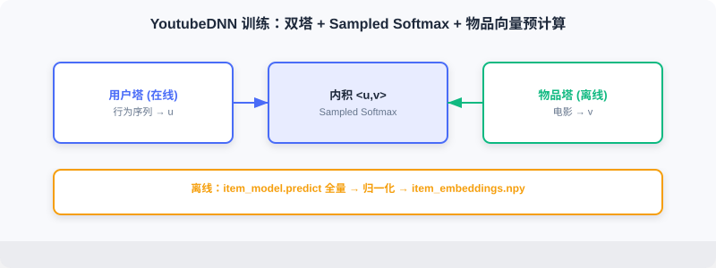
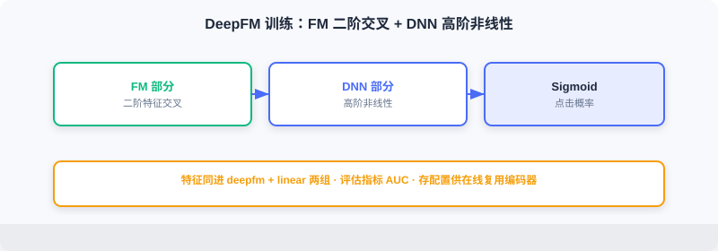
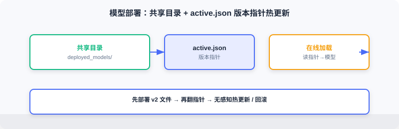

<div class="badge-row">
  <span style="background: #f0f4ff; color: #4A6CF7; padding: 4px 12px; border-radius: 20px; font-size: 0.85em; font-weight: 600; border: 1px solid rgba(74,108,247,0.2);">📖</span>
  <span style="background: #f0fdf4; color: #16a34a; padding: 4px 12px; border-radius: 20px; font-size: 0.85em; border: 1px solid rgba(22,163,74,0.2);">⏱️ ~30 min read</span>
  <span style="background: #fef2f2; color: #dc2626; padding: 4px 12px; border-radius: 20px; font-size: 0.85em; border: 1px solid rgba(100,100,100,0.15);">🎯 Advanced</span>
</div>

# 离线流水线

> 📝 **Before You Continue:** 请先读完 [11.2](./project-architecture.md) 的离线数据流与组件边界。本节把这五个环节落成代码：特征工程 → 模型训练 → 向量生成 → 特征上线 → 模型部署。

离线流水线承担推荐系统的「生产」职责，把原始数据变成在线服务所需的模型与特征。整个流程由**特征工程、模型训练、存储部署**三个环节组成，通过统一命令行入口管理，支持按需运行单步或完整流程。

读完本章，你将能够：

- 描述离线目录结构与 `pipeline.py` 的模块化编排方式
- 用**滑动窗口**构建 YoutubeDNN 时序样本，并理解左填充与编码从 1 起始的细节
- 说明排序模型如何用「相对个人均值」定义点击标签、如何混合困难/随机负样本
- 写出 YoutubeDNN 训练后**物品向量预计算 + 归一化**的代码，并解释其意义
- 描述 Redis 特征写入（Hash/List + Pipeline）与模型部署（版本指针）的实现
- 完成 5 道分层练习题，巩固工程要点

---

## 11.3.0 代码结构

离线代码位于 `web_project/backend/offline/`：

```
offline/
├── pipeline.py                     # 流水线入口
├── config.py                       # 配置管理
├── feature/                        # 特征工程
│   ├── preprocess_retrieval.py     # 召回模型特征处理
│   └── preprocess_ranking.py       # 排序模型特征处理
├── training/                       # 模型训练
│   ├── train_retrieval.py          # 召回模型训练
│   └── train_ranking.py            # 排序模型训练
└── storage/                        # 存储部署
    ├── redis_ingest.py             # 特征上线
    └── local_deploy.py             # 模型部署
```


整个流程由 `pipeline.py` 统一编排，支持按需运行指定步骤：

```python
# offline/pipeline.py
def main():
    parser = argparse.ArgumentParser(description="FunRec Offline Pipeline")
    parser.add_argument("--steps", type=str, default="all")
    args = parser.parse_args()

    steps = args.steps.split(",")
    if "all" in steps:
        steps = ["retrieval_preprocess", "ranking_preprocess",
                 "retrieval_training", "ranking_training",
                 "ingest", "deploy"]

    if "retrieval_preprocess" in steps:
        run_retrieval_preprocessing()
    if "ranking_preprocess" in steps:
        run_ranking_preprocessing()
    if "retrieval_training" in steps:
        run_retrieval_training()
    if "ranking_training" in steps:
        run_ranking_training()
    if "ingest" in steps:
        ingest_to_redis(flush=args.flush_redis)
    if "deploy" in steps:
        deploy_local()
```

这种模块化设计便于调试：可只重训排序模型而不动召回。配置集中在 `config.py`，用环境变量切换数据路径与服务地址：

```python
class Config:
    # 数据路径
    TEMP_DIR = Path(os.getenv("FUNREC_PROCESSED_DATA_PATH")) / "web_project"
    DATASET_DIR = Path(os.getenv("FUNREC_RAW_DATA_PATH"))

    # 特征工程参数
    MAX_SEQ_LEN = 10      # 历史序列最大长度
    EMB_DIM = 16          # Embedding 维度
    NEG_SAMPLE_SIZE = 20  # 负采样数量

    # 训练参数
    BATCH_SIZE = 128
    EPOCHS = 3
    LEARNING_RATE = 0.001

    # 存储服务配置
    DEPLOY_DIR = TEMP_DIR / "deployed_models"  # 模型部署目录
    REDIS_URL = os.getenv("REDIS_URL", "redis://localhost:6379/0")
```

---

## 11.3.1 特征工程

特征工程最耗时也最关键。好特征大幅提升效果，特征错误常导致模型完全失效。本项目为召回与排序分别构建样本。

### 原始数据加载

MovieLens-1M 含三张核心表：`users.pkl`（6040 用户：性别/年龄/职业/邮编）、`movies.pkl`（3883 电影：标题/类型/年份）、`ratings.pkl`（约 100 万评分：用户ID/电影ID/评分/时间戳）。

```python
def load_raw_data():
    df_movies = pd.read_pickle(config.DATASET_DIR / "movies.pkl")
    df_ratings = pd.read_pickle(config.DATASET_DIR / "ratings.pkl")
    df_users = pd.read_pickle(config.DATASET_DIR / "users.pkl")
    return df_movies, df_ratings, df_users
```

### 召回模型的特征处理

**类别特征编码**：推荐特征多为类别型（user_id、movie_id、gender、genres），需编码为整数输入 Embedding。

```python
def process_features(df_movies, df_ratings, df_users):
    user_sparse_feature_columns = ["user_id", "gender", "age", "occupation", "zip_code"]
    user_vocab = {}
    for feat_name in user_sparse_feature_columns:
        label_encoder = LabelEncoder()
        new_user_feature_df[feat_name + "_encode"] = (
            label_encoder.fit_transform(new_user_feature_df[feat_name]) + 1
        )                                                                 # ← KEY LINE: 编码从 1 开始，0 预留未知/填充
        user_vocab[feat_name] = label_encoder.classes_
    # 电影侧类似，genres 为列表需逐元素 transform
    ...
```

> 💡 **Key Insight:** 所有编码值从 **1** 开始，0 预留给未知值与填充。Embedding 第 0 行专门表示「不存在/未知」，避免把未知特征误当有效 ID。

**行为序列构建**：YoutubeDNN 核心是「预测用户下一个会看的电影」，故用滑动窗口构建样本——给定前 $k$ 次观影，预测第 $k+1$ 次。

```python
def generate_train_eval_samples(data_df, user_columns, item_columns,
                                 max_hist_seq_len=10, padding_value=0):
    data_df.sort_values("timestamp", inplace=True)                       # ← KEY LINE: 严格按时间排序，杜绝未来泄露
    ...
    for user_id, grouped_feats in data_df.groupby("user_id"):
        if len(grouped_feats["movie_id"]) < 2:
            continue
        len_hist_seq = len(grouped_feats["movie_id"])
        # 测试集：用最后一条
        ...
        # 训练集：滑动窗口
        for i in range(1, len_hist_seq - 1):
            train_data_dict["user_id"].append(user_id)
            for col in item_columns:
                train_data_dict["hist_" + col].append(
                    add_padding(grouped_feats[col].tolist()[:i],
                                padding_value, max_hist_seq_len))        # ← KEY LINE: 前 i 条作为历史，第 i 条作目标
                train_data_dict[col].append(grouped_feats[col].tolist()[i])
```

时序划分模拟真实场景：模型只能用过去信息预测未来。随机划分会造成未来信息泄露，离线指标虚高、线上失效。

**序列填充**：不同用户历史长度不同，模型需定长输入。采用**左填充**，短序列左侧补零：

```python
def add_padding(val, padding_value, max_seq_len):
    if isinstance(val, (list, tuple, np.ndarray)):
        if len(val) > 0 and isinstance(val[0], (list, tuple, np.ndarray)):
            val = list(itertools.chain(*val))[-max_seq_len:]
        else:
            val = list(val)[-max_seq_len:]
        return [padding_value] * (max_seq_len - len(val)) + val           # ← KEY LINE: 左侧补零，最近行为在右
    else:
        return val
```

左填充让最近行为总在序列右侧，符合时间顺序，对 RNN/Transformer 更自然。


### 排序模型的特征处理

排序模型（DeepFM）是 CTR 预估：输入用户-物品对，输出点击概率，需构造正负样本。

**标签定义**：MovieLens 只有评分无点击信号，按评分相对个人均值定义：

```python
user_avg_ratings = df_ratings.groupby("user_id")["rating"].mean().reset_index()
df_ratings = df_ratings.merge(user_avg_ratings, on="user_id", how="left")
df_ratings['is_click'] = (
    df_ratings['rating'] >= df_ratings['user_avg_rating'] - 1
).astype(int)                                                          # ← KEY LINE: 高于个人均值-1 视为正样本
```

这种方式考虑用户评分偏好差异（有人普遍高分、有人严格），用相对偏移减少个体差异。

**负样本采样**：正样本来自评分，负样本需构造。混合两种策略：

1. **困难负样本（Hard Negatives）**：用户曝光但未正向交互的物品——「难」分。
2. **随机负样本（Random Negatives）**：从未交互物品随机采样——扩充数量。

本项目用 **1:3** 正负比例（1 困难 + 2 随机）。`generate_negative_samples` 先建每用户困难负样本池，再从未交互集中随机采样。比例需权衡：过多导致不平衡、过少模型难分辨。

**训练/测试集划分**：同样用**时序划分**：

```python
def split_train_test(df_final, test_ratio=0.2, by_time=True):
    if by_time and "timestamp" in df_final.columns:
        df_final = df_final.sort_values("timestamp")
        split_idx = int(len(df_final) * (1 - test_ratio))
        train_df = df_final.iloc[:split_idx]
        test_df = df_final.iloc[split_idx:]                            # ← KEY LINE: 较早样本训练、较晚样本测试
    else:
        from sklearn.model_selection import train_test_split
        train_df, test_df = train_test_split(df_final, test_size=test_ratio)
    return train_df, test_df
```

---

## 11.3.2 召回模型训练（YoutubeDNN）

召回从全库快速筛候选。本项目用 YoutubeDNN 双塔（见 [2.3](./project-architecture.md)）：用户塔编码用户、物品塔编码物品，内积表匹配。

**模型配置**要点：

```python
model_config_dict = {
    "features": {
        "emb_dim": 16, "max_seq_len": 10, "task_names": ["movie_id"],
        "features": [
            {"name": "user_id", "group": ["user_dnn"], "vocab_size": ...},
            {"name": "movie_id", "group": ["target_item"], "vocab_size": ...},
            {"name": "hist_movie_id", "emb_name": "movie_id",           # ← KEY LINE: 历史与目标共享 Embedding
             "group": ["raw_hist_seq"], "combiner": "mean", "vocab_size": ...},
        ]
    },
    "training": {
        "build_function": "funrec.models.youtubednn.build_youtubednn_model",
        "model_params": {"emb_dim": 16, "neg_sample": 20, "dnn_units": [64, 32]},
        "loss": "sampledsoftmaxloss", "batch_size": 128, "epochs": 3,  # ← KEY LINE: Sampled Softmax 应对大词表
    },
}
```

三点要点：① **Embedding 共享**——历史电影 ID 与目标电影同表，减参数且同空间；② **序列聚合**——`mean` 把变长序列压成定维（注意力更优但更贵）；③ **Sampled Softmax**——物品 3000+，完整 Softmax 太贵，只对正负样本算损失。

**训练流程**封装在 `run_retrieval_training`：

```python
def run_retrieval_training():
    train_eval_samples = pickle.load(open(config.TRAIN_DATA_PATH, "rb"))
    feature_dict = pickle.load(open(config.FEATURE_DICT_PATH, "rb"))
    ...
    models = train_model(cfg.training, feature_columns, processed_data)
    metrics = evaluate_model(models, processed_data, cfg.evaluation, feature_columns)
    print(build_metrics_table(metrics))
    user_model = models[1]
    item_model = models[2]
    user_model.save(config.SAVED_MODELS_DIR / "user_model")
    item_model.save(config.SAVED_MODELS_DIR / "item_model")          # ← KEY LINE: 分别保存用户塔与物品塔
```

YoutubeDNN 返回三模型：完整、用户塔、物品塔。在线只需用户塔（实时算用户向量）+ 预计算物品向量（物品塔生成）。

**物品向量生成**——离线预计算全量物品向量：

```python
vocab_dict = pickle.load(open(config.VOCAB_DICT_PATH, "rb"))
all_movie_ids = sorted(list(vocab_dict["movie_id"]))
encoded_ids = np.arange(1, len(all_movie_ids) + 1)
item_inputs = {"movie_id": encoded_ids}
embeddings = item_model.predict(item_inputs, verbose=0)
embeddings = embeddings / np.linalg.norm(embeddings, axis=1, keepdims=True)  # ← KEY LINE: 归一化，内积≡余弦相似度
np.save(config.ITEM_EMB_PATH, embeddings)
np.save(config.MOVIE_IDS_PATH, np.array(all_movie_ids))
```

归一化后内积等价于余弦相似度，取值 $[-1,1]$，解释直观、便于设阈值。



---

## 11.3.3 排序模型训练（DeepFM）

排序对召回候选精确打分。本项目用 **DeepFM**（见 [3.x](./project-architecture.md)），结合 FM 二阶交叉与 DNN 高阶非线性。

**模型配置**不需要区分塔，所有特征同输入：

```python
model_config_dict = {
    "features": {
        "emb_dim": 16, "task_names": ["is_click"],
        "features": [
            {"name": "user_id", "group": ["deepfm", "linear"], "vocab_size": ...},  # ← KEY LINE: 同特征进两组
            {"name": "movie_id", "group": ["deepfm", "linear"], "vocab_size": ...},
            {"name": "genres", "group": ["deepfm", "linear"], "vocab_size": ...},
            ...
        ]
    },
    "training": {
        "build_function": "funrec.models.deepfm.build_deepfm_model",
        "model_params": {"dnn_units": [128, 64, 32], "dropout_rate": 0.1},
        "loss": ["binary_crossentropy"], "metrics": ["binary_accuracy", "AUC"],
        "batch_size": 128, "epochs": 3, "validation_split": 0.1,
    },
}
```

`group` 字段指定特征归属：`deepfm` 参与 FM 二阶交叉，`linear` 参与一阶线性。两者都放，模型同时学一阶效应与二阶交互。

**训练流程**与召回类似，但保存主模型与配置（供在线推理复用编码器）：

```python
def run_ranking_training():
    ...
    models = train_model(cfg.training, feature_columns, processed_data)
    main_model = models[0]
    metrics = evaluate_model(models, processed_data, cfg.evaluation, feature_columns)
    print(build_metrics_table(metrics))
    main_model.save(config.RANKING_MODEL_PATH)
    pickle.dump({
        "feature_dict": feature_dict,
        "feature_columns": [fc.name for fc in feature_columns],
        "model_config": model_config_dict,
    }, open(config.TEMP_DIR / "ranking_model_config.pkl", "wb"))     # ← KEY LINE: 存配置供在线复用编码器
```

排序评估常用 **AUC**（ROC 曲线下面积），衡量区分正负样本能力，不受正负比例影响——反映把用户喜欢的排在前的能力。



---

## 11.3.4 特征上线与模型部署

训练完需把产出部署到在线可访问的存储：Redis 存用户特征，共享目录存模型文件。

### Redis 特征写入

```python
def ingest_to_redis(flush: bool = False):
    r = redis.Redis.from_url(config.REDIS_URL, decode_responses=True)
    if flush:
        r.flushdb()
    df_movies, df_ratings, df_users = load_raw_data()

    pipeline = r.pipeline()
    for _, row in df_users.iterrows():
        user_id = row['user_id']
        key = f"user:{user_id}:profile"
        profile_data = {"gender": row["gender"], "age": row["age"],
                        "occupation": row["occupation"], "zip_code": row["zip_code"]}
        pipeline.hset(key, mapping=profile_data)                     # ← KEY LINE: 用户画像存 Hash
        if _ % 1000 == 0:
            pipeline.execute()                                       # ← KEY LINE: 批量执行，减少网络往返
    pipeline.execute()

    # 行为历史（List）+ 偏好类目（Top3，写回 profile）
    df_ratings.sort_values("timestamp", inplace=True)
    grouped = df_ratings.groupby("user_id")
    for user_id, group in grouped:
        history_key = f"user:{user_id}:history"
        movie_ids = group["movie_id"].tolist()
        pipeline.delete(history_key)
        for i in range(0, len(movie_ids), 1000):
            chunk = movie_ids[i:i+1000]
            pipeline.rpush(history_key, *chunk)                      # ← KEY LINE: 行为序列存 List，保时序
        ...
        top_3 = [g for g, c in Counter(all_genres).most_common(3)]
        pipeline.hset(f"user:{user_id}:profile", "frequent_genres", ",".join(top_3))
    pipeline.execute()
```

用户画像用 Hash（键 `user:{id}:profile`），行为历史用 List（保时间序），偏好类目统计 Top3 存回 profile。**Pipeline 批量执行**是关键优化：Redis 命令快，但每次网络往返有开销，打包发送显著提升写入速度。

### 本地模型部署

模型文件大（几十~几百 MB），不适存 Redis，用共享目录管理。召回部署含用户塔模型、物品向量、词表，并用 `active.json` 版本指针支持热更新：

```python
def deploy_recall_models(deploy_dir: Path):
    recall_dir = deploy_dir / "recall"
    recall_dir.mkdir(parents=True, exist_ok=True)
    shutil.copy2(config.VOCAB_DICT_PATH, recall_dir / "vocab_dict.pkl")
    shutil.copy2(config.ITEM_EMB_PATH, recall_dir / "item_embeddings.npy")
    user_model_path = config.SAVED_MODELS_DIR / "user_model"
    model_deploy_dir = deploy_dir / "model" / "user_recall" / "v1"
    model_deploy_dir.mkdir(parents=True, exist_ok=True)
    shutil.copytree(user_model_path, model_deploy_dir / "user_model")
    version_info = {"version": "v1", "path": "model/user_recall/v1/user_model"}
    with open(deploy_dir / "model" / "user_recall" / "active.json", "w") as f:
        json.dump(version_info, f)                                  # ← KEY LINE: 版本指针，在线据此加载
```



版本管理是生产重要功能：通过 `active.json` 指针，在线服务知道该加载哪个版本；更新时先部署新版本文件、再更新指针，实现**无感知热更新**。排序部署同理（写入 `ranking/active.json`）。

> **Analysis:** 离线的「部署」本质是**产出物治理**——不仅要算对模型，还要以在线可加载、可热更、可回滚的方式落地。版本指针 + 共享目录是轻量却工业标准的做法。

---

## ⚠️ Common Mistakes in 11.3

| # | Mistake | Example | Why It's Wrong | Fix |
|---|---------|---------|---------------|-----|
| 1 | 随机划分代替时序 | `train_test_split` 不按时间 | 未来信息泄露，离线虚高、线上垮 | 严格按 timestamp 时序划分 |
| 2 | 编码从 0 起 | LabelEncoder 默认从 0 | 0 与「未知/填充」冲突，Embedding 误用 | 编码统一 +1，0 留未知 |
| 3 | 物品向量不归一化 | 直接存原始向量 | 内积非余弦，阈值难设、解释差 | 离线归一化，内积≡余弦 |
| 4 | 负样本全随机 | 只用随机负样本 | 缺困难样本，模型分辨力弱 | 困难:随机=1:2，总比例 1:3 |
| 5 | 模型部署忘存配置 | 只存权重不存编码器/特征列 | 在线无法复原输入编码 | 同存 feature_dict/配置 pkl |
| 6 | 逐条写 Redis | 循环 hset 不批量 | 网络往返爆炸，写入极慢 | 用 pipeline 批量执行 |

---

## 本章小结

### 📌 Key Takeaways

| Concept | Key Points | Why It Matters |
|---------|-----------|----------------|
| 模块化流水线 | pipeline.py 按步编排、可单跑 | 便于调试与增量更新 |
| 滑动窗口样本 | 前 k 预测 k+1，左填充定长 | 模拟真实「预测下一部」 |
| 时序划分 | 按 timestamp 训练/测试切分 | 防未来泄露 |
| 物品向量预计算 | 离线 predict + 归一化 | 在线毫秒级向量检索 |
| 负样本 1:3 | 困难+随机混合 | 平衡分辨力与数量 |
| Redis + 版本指针 | Hash/List + active.json | 在线快取 + 无感知热更 |

### ❓ FAQ

**Q1: 为什么召回要单独存用户塔和物品塔？**
> A: 在线只需用户塔（实时算用户向量）和预计算物品向量（离线批量生成）。物品塔本身不在线用，但用于离线产出向量，故都存档以备重训。

**Q2: 为什么标签用「相对个人均值-1」而不是绝对阈值？**
> A: 用户评分尺度不同（有人爱打 4-5，有人爱打 2-3）。相对个人均值的定义把「对这个人而言算高」作为正样本，消除个体差异，标签更稳。

**Q3: 版本指针 active.json 解决了什么？**
> A: 在线服务加载模型时读它决定版本，离线重训后先部署 v2 再改指针，实现不停服热更新与一键回滚。

### 🔗 前后关联

- **2.3（双塔）** 解释 YoutubeDNN 结构与 Sampled Softmax 原理。
- **3.x（DeepFM）** 解释 FM+DNN 结构与 AUC 评估。
- **11.2** 给出离线数据流与组件边界。
- **11.4** 消费本节产出的物品向量、编码器与模型。
- **11.6** 的离线流程命令 `make run-offline-pipeline` 即跑本节全部步骤。

---

## Practice Problems

Work through all problems in order — they get progressively harder. Each has a complete solution you can reveal after trying it yourself.

---

**Problem 11.3.1 — 时序划分的意义** 🟢 Easy

为何排序模型要用时序划分而非随机划分？若用随机划分，离线 AUC 与线上效果会怎样？

<details>
<summary>💡 Solution (click to reveal)</summary>

**答：** 随机划分会把未来行为混入训练，模型「偷看」了答案，离线 AUC 偏高但线上失效（真实只能看历史）。时序划分保证训练只用过去、测试用未来，评估结果贴近线上。

**Key points:**
- 未来信息泄露是离线-线上落差的主因之一。
- 任何带时间属性的推荐数据都应时序划分。

</details>

---

**Problem 11.3.2 — 左填充的作用** 🟢 Easy

为何采用左填充而非右填充？若某用户历史为 [A,B,C]（时间序），`MAX_SEQ_LEN=5`，左填充后序列是什么？

<details>
<summary>💡 Solution (click to reveal)</summary>

**答：** 左填充使最近行为在序列右侧，符合时间顺序，对 RNN/Transformer 更自然。填充后 = [0,0,A,B,C]（左侧补两个 0）。

**Key points:**
- 0 是填充位，模型学其「无信息」。
- 最近行为靠右，注意力/池化更聚焦近期。

</details>

---

**Problem 11.3.3 — 物品向量归一化** 🟡 Medium

物品向量归一化后，用户向量 $u$ 与物品向量 $v$ 的内积取值范围是多少？若未归一化，设阈值过滤相似候选会遇到什么困难？

<details>
<summary>💡 Solution (click to reveal)</summary>

**答：** 归一化后 $\|u\|=\|v\|=1$，内积 $\langle u,v\rangle=\cos\theta\in[-1,1]$，解释直观、阈值好设（如 >0.5）。未归一化时内积受模长影响，同方向但模不同的向量内积可能差异巨大，阈值无统一意义，且无法直接当余弦用。

**Key points:**
- 归一化让内积 ≡ 余弦相似度。
- 在线检索（ANN）也依赖此一致性（见 2.3.4）。

</details>

---

**Problem 11.3.4 — 负样本比例** 🟡 Medium

本项目正负比 1:3（1 困难 + 2 随机）。若改成 1:10（主要靠随机），模型可能有什么问题？若改成 1:0（无负样本）会怎样？

<details>
<summary>💡 Solution (click to reveal)</summary>

**答：** 1:10 过度靠简单随机负样本，模型只学「区分明显不相关」，对困难样本的辨别力下降，CTR 预估偏粗。1:0 即无负样本，Sampled Softmax/二分类失去学习目标，模型无法学到「什么是负」，完全失效。

**Key points:**
- 负样本是分类学习的必要一半。
- 困难负样本提升分辨边界，随机负样本保证数量。

</details>

---

**🏆 Challenge: 设计一次热更新** 🔴 Hard

假设线上 DeepFM 模型要升级到 v2，且不能停服、要能回滚。请基于 active.json 机制，描述离线侧与在线侧各自需要做什么（150 字内）。

<details>
<summary>💡 Hint</summary>

离线：训练 v2 → 部署到 `model/ranking/v2/`，暂不改指针。在线：服务加载时读 `ranking/active.json`；切换时先改指针指向 v2（热更新），观察指标；若异常，把指针改回 v1 即回滚。关键是「先部署新文件、后翻指针」，全程在线只读指针，无需重启。

</details>
