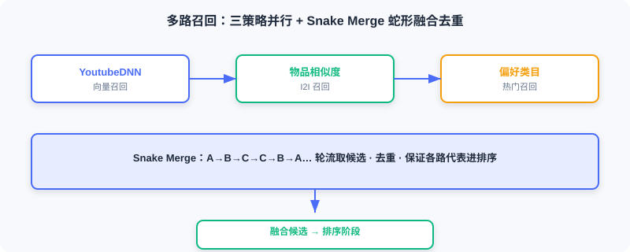

<div class="badge-row">
  <span style="background: #f0f4ff; color: #4A6CF7; padding: 4px 12px; border-radius: 20px; font-size: 0.85em; font-weight: 600; border: 1px solid rgba(74,108,247,0.2);">📖</span>
  <span style="background: #f0fdf4; color: #16a34a; padding: 4px 12px; border-radius: 20px; font-size: 0.85em; border: 1px solid rgba(22,163,74,0.2);">⏱️ ~34 min read</span>
  <span style="background: #fef2f2; color: #dc2626; padding: 4px 12px; border-radius: 20px; font-size: 0.85em; border: 1px solid rgba(100,100,100,0.15);">🎯 Advanced</span>
</div>

# 在线流水线

> 📝 **Before You Continue:** 请先读完 [11.3](./offline-pipeline.md)，理解离线产出了什么（物品向量、编码器、用户塔/排序模型）。本节消费这些产出，把请求变成推荐列表。

在线流水线要在百毫秒级延迟内完成从用户请求到推荐结果的全链路。整个流程封装在统一推荐管线中，按「冷启动检测 → 多路召回 → 精准排序 → 多样性重排」顺序执行，各阶段候选数量与启停开关由配置集中控制。

读完本章，你将能够：

- 描述 `RecommendationPipeline` 与 `PipelineConfig` 如何串起全链路
- 解释冷启动检测阈值与 UCB 探索-利用公式，并写出分数计算与状态更新代码
- 描述三路召回（YoutubeDNN / I2I / 偏好类目）与 **Snake Merge** 融合
- 写出 DeepFM 批量排序、特征编码复用、异步执行与降级策略
- 解释连续打散（Consecutive Dispersion）如何保序地提升多样性
- 完成 5 道分层练习题

---

## 11.4.0 代码结构

在线代码位于 `web_project/backend/online/`：

```
online/
├── pipeline.py               # 推荐主流程
├── cold_start/               # 冷启动处理
│   ├── detector.py           # 冷启动检测
│   ├── service.py            # 冷启动服务
│   ├── ucb_genre.py          # UCB 类型探索
│   └── preferred_genre.py    # 偏好类型策略
├── recall/                   # 多路召回
│   ├── service.py            # 召回服务与融合
│   ├── youtubednn.py         # YoutubeDNN 召回
│   ├── item_based.py         # 物品相似度召回
│   └── trending.py           # 热门召回
├── ranking/                  # 排序模型
│   ├── service.py            # 排序服务
│   └── deepfm.py             # DeepFM 排序
└── reranking/                # 重排策略
    ├── service.py            # 重排服务
    └── dispersion.py         # 打散策略
```

离线产出物（共享目录模型、Redis 特征、物品向量）是在线基础。在线需 200ms 内完成，要求推理快、访问高效、阶段协同。

主流程封装在 `RecommendationPipeline`：

下面用交互演示走完一次推荐请求的完整链路：从用户请求到达，经冷启动检测、多路召回、Snake Merge 融合、DeepFM 排序、多样性重排，到结果组装返回。点击「下一步」观察候选规模如何逐级缩小。

<iframe src="../viz/part11-request-flow.html?embed&vizId=part11-request-flow" style="width:100%; height:520px; border:none; display:block;" loading="lazy"></iframe>

注意漏斗右侧的候选计数：全库候选经召回缩到 100、排序缩到 20，整个过程目标延迟 < 200ms——这正是工业漏斗架构的工程意义。

```python
class RecommendationPipeline:
    def __init__(self):
        self.recall_service = get_recall_service()
        self.ranking_service = get_ranking_service()
        self.reranking_service = get_reranking_service()
        self.cold_start_service = get_cold_start_service()

    async def recommend(self, user_features, item_features_provider=None, config=None):
        config = config or PipelineConfig()
        if config.enable_cold_start and self._is_cold_start(user_features, config):
            return await self._cold_start_recommend(user_features, item_features_provider, config)
        candidates = await self._recall(user_features, config.recall_top_k)
        ranked_items, ranking_strategy = await self._rank(
            user_features, candidates, item_features_provider, config.ranking_top_k)
        reranked_items, reranking_strategies = await self._rerank(
            ranked_items, user_features, item_features_provider)
        return RecommendationResult(items=reranked_items, ...)
```

`PipelineConfig` 集中控制各阶段行为：

```python
@dataclass
class PipelineConfig:
    recall_top_k: int = 100        # 召回阶段返回候选数
    ranking_top_k: int = 20        # 排序阶段返回结果数
    enable_ranking: bool = True    # 是否启用排序模型
    enable_reranking: bool = True  # 是否启用重排
    enable_cold_start: bool = True
    cold_start_threshold: int = 5  # 交互少于此值视为冷启动用户
    cold_start_top_k: int = 20
```

---

## 11.4.1 冷启动检测与处理

冷启动是经典难题：新用户无行为数据，协同过滤与向量召回都失效。本项目用独立冷启动模块处理。

**冷启动检测**很简单——历史交互少于阈值即冷启动用户：

```python
class ColdStartDetector:
    def __init__(self, threshold: int = 5):
        self.threshold = threshold
    def is_cold_start(self, user_features: Dict[str, Any]) -> bool:
        hist_movie_ids = user_features.get("hist_movie_ids", [])
        if not hist_movie_ids:
            return True
        return len(hist_movie_ids) < self.threshold             # ← KEY LINE: 交互次数 < 阈值 → 冷启动
```

阈值需权衡：太低用户偏好未稳就进正常流；太高用户久等不到个性化。默认 **5 次**。

**三种策略**由 `ColdStartService` 统一管理：

```python
class ColdStartService:
    def __init__(self):
        self.detector = ColdStartDetector(threshold=5)
        self.strategies = [
            UCBGenreStrategy(),        # 优先级 1：UCB 探索
            PreferredGenreStrategy(),  # 优先级 2：用户偏好
            PopularRecentStrategy(),   # 优先级 3：热门兜底
        ]
    async def recommend(self, user_features, top_k=20):
        applicable = [s for s in self.strategies if s.can_handle(user_features)]
        if has_ucb_data:
            allocations = self._get_ucb_weighted_allocation(applicable, top_k)
        elif has_preferences:
            allocations = self._get_preference_weighted_allocation(applicable, top_k)
        else:
            allocations = self._get_fallback_allocation(applicable, top_k)
        results = await asyncio.gather(*[self._run_strategy(s, user_features, k)
                                          for s, k in allocations if k > 0])
        return self._merge_results(results, top_k)
```

配额随用户状态动态分配：有评分记录时 UCB 获 70%；只有偏好设置时偏好策略获 80%；什么都没有则全用热门。


**UCB 类型探索**解决探索-利用（Exploration vs Exploitation）问题：

$$\text{UCB}(g) = \bar{r}_g + c \cdot \sqrt{\frac{\ln N}{n_g}}$$

其中 $\bar{r}_g$ 是类型 $g$ 的历史平均评分，$N$ 是总推荐次数，$n_g$ 是类型 $g$ 被推荐次数，$c$ 是探索系数。第一项**利用**（平均分越高越好），第二项**探索**（推荐越少的不确定越大、奖励越高）。

```python
class UCBGenreStrategy(ColdStartStrategy):
    def _calculate_ucb_scores(self, stats, total_n):
        scores = {}
        for genre in self.available_genres:
            if genre in stats and stats[genre]["n"] > 0:
                n = stats[genre]["n"]
                avg_reward = stats[genre]["reward"] / n
                exploration_bonus = self.exploration_c * math.sqrt(
                    math.log(total_n + 1) / (n + 1e-6))            # ← KEY LINE: 探索奖励随被推荐次数递减
                scores[genre] = avg_reward + exploration_bonus
            else:
                scores[genre] = 1.0 + self.exploration_c * 2       # ← KEY LINE: 未探索类型给最高探索分
        return scores
```

UCB 统计存 Redis（键 `user:{user_id}:genre_ucb`），用户评分时更新：

```python
def update_ucb_genre_stats(user_id, movie_genres, rating):
    normalized_reward = rating / 10.0
    key = f"user:{user_id}:genre_ucb"
    for genre in movie_genres:
        current_raw = redis_client.hget(key, genre)
        if current_raw:
            current = json.loads(current_raw)
            current["n"] = current.get("n", 0) + 1
            current["reward"] = current.get("reward", 0) + normalized_reward
        else:
            current = {"n": 1, "reward": normalized_reward}
        redis_client.hset(key, genre, json.dumps(current))        # ← KEY LINE: 增量更新类型统计
```

优点：随评分增多，UCB「利用」成分增加；对未接触类型仍给机会，避免信息茧房。

**偏好类型策略**若有 `preferred_genres`，用 Elasticsearch 查这些类型的高评分电影（`avg_rating>=6.0`、`rating_count>=20`）。

---

## 11.4.2 多路召回

有足够历史行为的用户进入正常流程。第一阶段召回，从全库快速筛候选。

**为何多路召回**：单一策略有局限——向量召回可能漏掉模型未捕捉的相关性（如新上映小众片样本少、表征不准）；协同过滤对小众覆盖不足；热门缺乏个性化。思路是「别把鸡蛋放一个篮子」，多策略并行再合并。

```python
class RecallService:
    def __init__(self):
        self.strategies = [
            UserPreferenceRecallStrategy(),  # 用户偏好类目召回
            ItemEmbeddingRecallStrategy(),   # 物品相似度召回
            YouTubeDNNRecallStrategy(),      # 向量召回
        ]
```

**YoutubeDNN 向量召回**：在线算用户向量，再在物品向量空间检索最相似电影。

```python
class YouTubeDNNRecallStrategy(RecallStrategy):
    def preprocess_user(self, user_features, max_hist_len=10):
        inputs = {}
        encoders = self.resource_manager.encoders
        for feat in ["user_id", "gender", "age", "occupation", "zip_code"]:
            raw_val = user_features.get(feat)
            if raw_val is not None and feat in encoders:
                try:
                    val = encoders[feat].transform([str(raw_val)])[0] + 1   # ← KEY LINE: 复用离线编码器，+1 对齐
                except:
                    val = 0
            else:
                val = 0
            inputs[feat] = np.array([val])
        # 历史序列：编码电影ID + 展开类型，左填充定长
        ...
        return inputs

    def _recall_sync(self, user_context, k):
        model_inputs = self.preprocess_user(user_context)
        user_emb = self.resource_manager.user_model.predict(model_inputs, verbose=0)
        user_emb = user_emb / np.linalg.norm(user_emb, axis=1, keepdims=True)
        scores = np.dot(user_emb, self.resource_manager.item_embedding_matrix.T)[0]  # ← KEY LINE: 内积≡余弦
        top_indices = np.argsort(scores)[::-1][:k]
        ...
```

用户与物品向量都归一化，内积等价于余弦。库仅 3000+ 时直接内积即可；超百万时用 FAISS 加速。

**物品相似度召回（I2I）**：用户刚看什么就推相似的——捕捉即时兴趣，复用 YoutubeDNN 物品向量（向量本身蕴含协同过滤信息）。

```python
class ItemEmbeddingRecallStrategy(RecallStrategy):
    async def recall(self, user_context, k):
        hist_movie_ids = user_context.get("hist_movie_ids", [])
        if not hist_movie_ids:
            return []
        last_movie_id = hist_movie_ids[0]                            # ← KEY LINE: 取最近观看的电影作种子
        enc_idx = movie_le.transform([last_movie_id])[0] + 1
        target_emb = self.resource_manager.item_embedding_matrix[enc_idx]
        target_emb = target_emb / np.linalg.norm(target_emb)
        scores = np.dot(self.resource_manager.item_embedding_matrix, target_emb)
        top_indices = np.argsort(scores)[::-1][:k+2]
        ...
```

**用户偏好类目召回**：统计用户偏好类型（离线算 Top3 存 Redis），从这些类型召回热门。优点稳定——即使用户最近偶尔偏差，仍推长期喜欢类型。

**Snake Merge 多路融合**：简单按分合并会让某路霸榜。Snake Merge 从各路轮流取候选，确保每路有代表进排序：

```python
def _merge_results_round_robin(self, results_list, top_k):
    merged_candidates = []
    seen_movie_ids = set()
    sources = [r if r else [] for r in results_list]
    source_pointers = [0] * len(sources)
    direction = 1
    current_idx = 0
    while len(merged_candidates) < top_k:
        all_exhausted = all(source_pointers[i] >= len(sources[i])
                             for i in range(len(sources)))
        if all_exhausted:
            break
        src_list = sources[current_idx]
        ptr = source_pointers[current_idx]
        if ptr < len(src_list):
            item = src_list[ptr]
            source_pointers[current_idx] += 1
            mid = item["movie_id"]
            if mid not in seen_movie_ids:                          # ← KEY LINE: 去重，避免跨路重复
                merged_candidates.append(item)
                seen_movie_ids.add(mid)
        current_idx += direction
        if direction == 1 and current_idx >= len(sources):
            direction = -1
            current_idx = len(sources) - 1
        elif direction == -1 and current_idx < 0:
            direction = 1
            current_idx = 0
    return merged_candidates
```

名称来自遍历顺序：三路 A、B、C 合并顺序 A→B→C→C→B→A→A→B→C…，像蛇来回穿梭。



---

## 11.4.3 精准排序（DeepFM）

召回筛约 100 候选，但其顺序由召回分决定、不够精准。排序用 DeepFM 对候选做 CTR 预估、重排。

**在线推理核心是特征构造**——每用户-候选对编码成模型输入：

```python
class DeepFMRankingStrategy(RankingStrategy):
    def _prepare_batch_inputs(self, user_features, candidates):
        rm = self.resource_manager
        batch_size = len(candidates)
        inputs = {}
        for feat in rm.user_features:                               # ← KEY LINE: 用户特征所有候选共享，复制
            raw_val = user_features.get(feat)
            encoded_val = rm.encode_feature(feat, raw_val)
            inputs[feat] = np.full(batch_size, encoded_val, dtype=np.int32)
        for feat in rm.item_features:                               # ← KEY LINE: 物品特征每候选不同
            encoded_values = [rm.encode_feature(feat, c.get(feat)) for c in candidates]
            inputs[feat] = np.array(encoded_values, dtype=np.int32)
        return inputs
```

特征编码复用离线保存的 LabelEncoder，**编码从 1 起、0 留未知**，与训练一致：

```python
def encode_feature(self, feat_name, raw_value):
    if raw_value is None:
        return 0
    encoder = self.encoders.get(feat_name)
    if encoder is None:
        return 0
    try:
        if isinstance(encoder.classes_[0], str) and not isinstance(raw_value, str):
            raw_value = str(raw_value)
        if raw_value in encoder.classes_:
            return int(encoder.transform([raw_value])[0]) + 1       # ← KEY LINE: 与离线编码严格一致
        else:
            return 0
    except Exception:
        return 0
```

准备好输入后批量预测：

```python
def _rank_sync(self, user_features, candidates):
    inputs = self._prepare_batch_inputs(user_features, candidates)
    predictions = self.resource_manager.ranking_model.predict(
        inputs, verbose=0, batch_size=min(len(candidates), 256))   # ← KEY LINE: 批量预测，利用向量化
    if predictions.ndim > 1:
        predictions = predictions.flatten()
    ranked_results = []
    for i, candidate in enumerate(candidates):
        ranked_results.append({
            "movie_id": candidate["movie_id"],
            "score": float(predictions[i]),                        # CTR 预测分
            "recall_score": candidate.get("score", 0.0),
            "recall_type": candidate.get("recall_type"),
        })
    ranked_results.sort(key=lambda x: x["score"], reverse=True)    # ← KEY LINE: 按 CTR 分重排
    return ranked_results
```

批量预测对 100 候选通常 10–30ms。模型推理是 CPU 密集，放线程池避免阻塞事件循环；模型不可用时**降级**到 `FallbackRankingStrategy`，直接用召回分排序，保证高可用。

---

## 11.4.4 多样性重排

召回排序后列表可能多样性不足（如动作片占比高，排序把动作片全排前）。适度多样性提升满意度与留存。

**连续打散（Consecutive Dispersion）**：不允许超过 $N$ 个相同属性连续出现。如 $N=2$，[动作,动作,动作,喜剧] → [动作,动作,喜剧,动作]。

```python
class ConsecutiveDispersionStrategy(RerankingStrategy):
    def _can_add(self, item, result):
        if len(result) < self._max_consecutive:
            return True
        item_key = self._feature_extractor(item)
        if item_key is None:
            return True
        recent_keys = [self._feature_extractor(r)
                       for r in result[-(self._max_consecutive - 1):]]
        return not all(k == item_key for k in recent_keys)         # ← KEY LINE: 最近 N-1 全同则不可加
    async def rerank(self, items, user_features=None):
        if len(items) <= self._max_consecutive:
            return items
        result, deferred = [], []
        for item in items:
            if self._can_add(item, result):
                result.append(item)
                self._try_insert_deferred(result, deferred)         # ← KEY LINE: 优先插可加入的候选
            else:
                deferred.append(item)
        result.extend(deferred)                                     # 剩余追加末尾
        return result
```

预定义两类：**类型打散**（取首类型）与**年代打散**（按 10 年分桶，如 1990s）。

```python
class GenreDispersionStrategy(ConsecutiveDispersionStrategy):
    def __init__(self, max_consecutive=2):
        super().__init__(_extract_genre, max_consecutive, "genre_dispersion")

class DecadeDispersionStrategy(ConsecutiveDispersionStrategy):
    def __init__(self, max_consecutive=2):
        super().__init__(_extract_decade, max_consecutive, "decade_dispersion")
```

**策略链组合**——按顺序执行，输出作下一输入：

```python
class RerankingService:
    def __init__(self):
        self._strategies = [
            GenreDispersionStrategy(max_consecutive=2),
            DecadeDispersionStrategy(max_consecutive=2),
        ]
    async def rerank(self, items, user_features=None):
        if not items or not self._enabled:
            return items
        result = items
        for strategy in self._strategies:
            if strategy.is_ready:
                result = await strategy.rerank(result, user_features)
        return result
```

重要特性是**保序性**：满足连续约束前提下尽量保原序，高分仍靠前、仅微调位置——既保相关性又增多样性。


---

## 11.4.5 API 集成与服务启动

组件开发完后整合进 FastAPI，对外提供 HTTP 接口。

**推荐 API**核心逻辑：

```python
@router.post("/recommend")
async def get_recommendations(request, db=Depends(get_db), current_user=Depends(get_current_user)):
    pipeline = get_pipeline()
    if not pipeline.is_ready:
        raise HTTPException(status_code=503, detail="Recommendation service not ready")
    user_features = await build_user_features(current_user, db)
    async def item_features_provider(movie_ids):
        movies = await get_movies_by_ids(db, movie_ids)
        return {m.id: {"movie_id": m.id, "genres": m.genres.split("|") if m.genres else [],
                       "year": m.year, "isAdult": m.is_adult} for m in movies}
    config = PipelineConfig(recall_top_k=request.recall_top_k or 100,
                             ranking_top_k=request.top_k or 20, enable_cold_start=True)
    result = await pipeline.recommend(user_features=user_features,
                                       item_features_provider=item_features_provider, config=config)
    movie_ids = [item.movie_id for item in result.items]
    movies = await get_movies_by_ids(db, movie_ids)
    movie_map = {m.id: m for m in movies}
    return {
        "recommendations": [{
            "movie_id": item.movie_id, "title": movie_map[item.movie_id].title,
            "poster_url": movie_map[item.movie_id].poster_url,
            "genres": movie_map[item.movie_id].genres, "year": movie_map[item.movie_id].year,
            "score": item.score, "recall_type": item.recall_type,
        } for item in result.items if item.movie_id in movie_map],
        "is_cold_start": result.is_cold_start, "ranking_strategy": result.ranking_strategy,
    }
```

要点：①用户特征从 DB+Redis 组装；②`item_features_provider` 回调**惰性加载**物品特征，避免召回阶段加载用不到的数据；③流程返回 ID+分，需查库补标题/海报。

**资源加载与单例模式**——模型大，应在进程级共享，`RecallResourceManager` 用单例 + 惰性加载：

```python
class RecallResourceManager:
    _instance = None
    def __new__(cls):
        if cls._instance is None:
            cls._instance = super().__new__(cls)
            cls._instance._initialized = False
        return cls._instance
    def __init__(self):
        if self._initialized:
            return
        self.user_model = None
        self.item_embedding_matrix = None
        self.encoders = {}
        self._initialized = True
    def _ensure_resources_loaded(self):
        if self.user_model is not None:
            return
        self._load_from_local()                                    # ← KEY LINE: 首次使用才加载
    def _load_from_local(self):
        deploy_dir = Path(os.getenv("MODEL_DEPLOY_DIR"))
        with open(deploy_dir / "model" / "user_recall" / "active.json") as f:
            version_info = json.load(f)                            # ← KEY LINE: 读版本指针决定加载哪版
        self.user_model = tf.keras.models.load_model(deploy_dir / version_info["path"])
        self.item_embedding_matrix = np.load(deploy_dir / "item_embeddings.npy")
        with open(deploy_dir / "vocab_dict.pkl", "rb") as f:
            self.encoders = pickle.load(f)
```

**健康检查** `/health` 暴露各组件状态，便于监控：

```python
def get_health_status(self):
    return {
        "cold_start": {"available": ..., "ready": self.is_cold_start_ready, ...},
        "recall": {"available": ..., "strategies": len(self.recall_service.strategies)},
        "ranking": {"available": ..., "ready": self.is_ranking_ready, ...},
        "reranking": {"available": ..., "ready": self.is_reranking_ready, ...},
    }
```

> **Analysis:** 在线链路的工程价值在「毫秒级 + 高可用」——批量预测、线程池异步、模型降级、单例缓存、版本指针热加载，每一处都为这两点服务。这也是论文里永远不会写、却决定系统能否上线的细节。

---

## ⚠️ Common Mistakes in 11.4

| # | Mistake | Example | Why It's Wrong | Fix |
|---|---------|---------|---------------|-----|
| 1 | 编码与离线不一致 | 在线用默认 LabelEncoder | 输入空间错位，预测全乱 | 复用同一编码器/词表 |
| 2 | 冷启动阈值乱设 | 阈值=50 | 用户久等不到个性化 | 默认 5，按业务调 |
| 3 | 单路召回不融合 | 只用向量召回 | 覆盖/多样性不足 | 多路 + Snake Merge |
| 4 | 排序无降级 | 模型挂就 503 | 可用性崩 | FallbackRankingStrategy |
| 5 | 打散破坏保序 | 全局重排 | 高分被挤后 | 连续约束下保序 |
| 6 | 每请求重载模型 | 无单例 | 内存爆炸、延迟高 | 单例 + 惰性加载 |

---

## 本章小结

### 📌 Key Takeaways

| Concept | Key Points | Why It Matters |
|---------|-----------|----------------|
| 管线编排 | Pipeline + Config 串全链路 | 各阶段可控、可关 |
| 冷启动 UCB | 利用+探索公式，Redis 增量统计 | 解决零样本探索-利用 |
| 多路召回 | 向量/I2I/偏好 + Snake Merge | 覆盖与多样性兼得 |
| 排序 | DeepFM 批量 CTR 预估 + 降级 | 精准且高可用 |
| 多样性重排 | 连续打散 + 保序 | 相关性与多样性平衡 |
| 资源单例 | 版本指针 + 惰性加载 | 毫秒级 + 热更新 |

### ❓ FAQ

**Q1: 冷启动阈值 5 是怎么定的？**
> A: 经验值。太低用户偏好未稳就进正常流（召回/排序仍弱），太高用户久等不到个性化。按业务交互密度调，高频场景可降、低频可升。

**Q2: Snake Merge 和直接拼接去重有何不同？**
> A: 直接拼接按分排序再截前 K，强路易霸榜；Snake Merge 轮流取，结构性保证每路都有代表进排序，多样性更好。

**Q3: 排序模型挂了为什么不直接报错？**
> A: 推荐系统可用性优先。降级用召回分排序，用户仍能拿到（质量略降的）结果，远比 503 好。这是「优雅降级」原则。

### 🔗 前后关联

- **11.3** 提供物品向量、编码器、模型，是在线所有召回/排序的输入。
- **2.3（双塔）** 与 **3.x（DeepFM）** 是召回、排序模型的算法依据。
- **4.2（多样性重排）** 解释打散策略的理论动机；本项目是其实例。
- **11.5** 的推荐 API 即调用本节 `pipeline.recommend`。
- **11.6** 讨论如何让这整套在线服务容器化稳定运行。

---

## Practice Problems

Work through all problems in order — they get progressively harder. Each has a complete solution you can reveal after trying it yourself.

---

**Problem 11.4.1 — 冷启动判定** 🟢 Easy

某用户历史观影 `[101, 202, 303]`（3 部），`cold_start_threshold=5`。`is_cold_start` 返回什么？若他又评了 3 部（共 6 部）呢？

<details>
<summary>💡 Solution (click to reveal)</summary>

**答：** 3 < 5 → 返回 True（冷启动）。共 6 部时 6 >= 5 → 返回 False（走正常流程）。

**Key points:**
- 阈值比较是「少于阈值即冷启动」。
- 随行为积累自然过渡到正常流。

</details>

---

**Problem 11.4.2 — UCB 探索项** 🟢 Easy

UCB 公式中，类型 A 被推荐 100 次、类型 B 被推荐 2 次，其余相同（$N$ 大）。仅看探索项 $c\sqrt{\frac{\ln N}{n_g}}$，哪类得分更高？

<details>
<summary>💡 Solution (click to reveal)</summary>

**答：** B 的探索项 = $c\sqrt{\ln N/2}$，A 的 = $c\sqrt{\ln N/100}$。分母小则值大，故 B 探索奖励更高。这正是「推荐少的类型给更高探索机会」，避免信息茧房。

**Key points:**
- 探索项随 $n_g$ 增大而减小。
- 未探索类型（n=0）给最高探索分。

</details>

---

**Problem 11.4.3 — Snake Merge 顺序** 🟡 Medium

三路召回 A、B、C 各返回候选 [a1,a2]、[b1,b2]、[c1,c2]，top_k=4，且所有 movie_id 不重复。Snake Merge 合并的前 4 个（去重后）依次是什么？

<details>
<summary>💡 Solution (click to reveal)</summary>

**答：** 顺序 A→B→C→C→B→A…。取 a1,b1,c1，再返回 C 取 c2。前 4 个 = [a1, b1, c1, c2]。

**Key points:**
- 蛇形在末端反向，保证各路轮流。
- 去重避免跨路重复进排序。

</details>

---

**Problem 11.4.4 — 编码一致性** 🟡 Medium

离线 LabelEncoder 对 gender 类别为 `["F","M"]`（transform 得 0/1，+1 后 1/2）。在线收到原始值 `"M"`，`encode_feature` 返回什么？若收到训练未见过的 `"X"` 呢？

<details>
<summary>💡 Solution (click to reveal)</summary>

**答：** `"M"` → transform 得 1，+1 后返回 2（与离线一致）。`"X"` 不在 classes_ → 返回 0（未知值），与离线 padding 语义一致，模型不会崩。

**Key points:**
- 在线必须复用离线同一编码器，+1 对齐。
- 未知值统一编 0，保证鲁棒。

</details>

---

**🏆 Challenge: 设计降级链** 🔴 Hard

若某次请求中召回正常、但排序模型加载失败、且用户非冷启动。请描述系统应走哪条路径、返回质量如何，并指出一个可能比「直接召回分排序」更好的降级方案（150 字内）。

<details>
<summary>💡 Hint</summary>

路径：冷启动检测 False → 多路召回得候选 → 排序失败触发 FallbackRankingStrategy（按召回分排序）→ 重排 → 返回。质量：相关性下降（无 CTR 精排）但可用。更好方案：用 I2I/偏好召回分作粗排权重，或对未失败的小模型（如逻辑回归）兜底，而非纯召回分，提升个性化。

</details>
