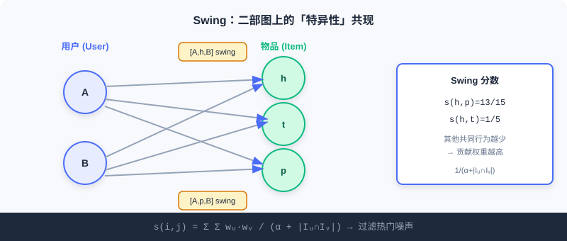
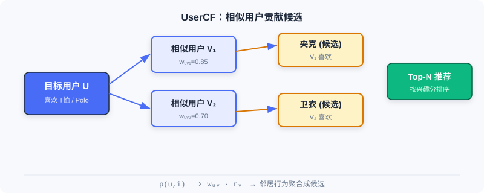

  📖
  ⏱️ ~35 min read
  🎯 Intermediate

# 协同过滤

> 📝 **Before You Continue:** 请先读完 [Part 1 的 1.1](./../part1-introduction/what-is-recommender.md) 关于「召回是三阶段漏斗起点」的论述，以及 [1.2](./../part1-introduction/book-overview.md) 中「召回：从亿到千」的脉络。本章是召回层最经典的方法家族。

当你打开电商 App，系统如何判断「你还可能喜欢什么」？最朴素也最强大的直觉来自**协同过滤（Collaborative Filtering, CF）**：利用「人」与「物」群体的集体行为来推断个人偏好——喜欢同一个东西的人，口味往往相似；被同一群人喜欢的东西，性质往往相近。

协同过滤的思想几乎与推荐系统同龄，但它远不止「找相似」这么简单。从基于邻域的 ItemCF / UserCF，到为工业鲁棒性而生的 Swing，再到把用户与物品映射为隐向量的矩阵分解，本章带你走完这条从**统计共现**到**向量表示**的演进之路。

读完本章，你将能够：

- 用**余弦相似度 / 皮尔逊相关系数**计算物品与用户之间的相似度，并说清二者差异
- 解释 **Swing** 如何通过二部图结构过滤随机噪声，以及 **Surprise** 如何挖掘互补商品
- 说明 **UserCF 与 ItemCF** 在用户冷启动、可解释性上的取舍
- 描述 **矩阵分解（FunkSVD / BiasSVD）** 如何用低秩隐向量缓解数据稀疏性
- 完成 5 道分层练习题，巩固从共现到向量化的全链路

---

## 2.1.0 协同过滤的两大视角

协同过滤可以沿两个方向切分：**基于物品（ItemCF）** 关注「和你喜欢的物品相似的还有什么」；**基于用户（UserCF）** 关注「和你相似的人还喜欢什么」。前者更贴合工业场景（物品集合稳定、可离线预计算），后者在社交属性强的场景下更自然。

无论哪种视角，核心都绕不开一个概念——**共现（co-occurrence）**：两个物品被同一批用户交互过，或两个用户交互过同一批物品。共现越频繁，相似度越高。后面三节我们会看到，所有 CF 方法不过是对「如何定义与利用共现」的不同回答。

---

## 2.1.1 ItemCF：基于物品相似度的协同过滤

ItemCF 的核心想法是：用户的兴趣具有连贯性，喜欢某物品的人往往也对相似物品感兴趣。当我们要给用户推荐时，系统先找出他**最近交互过的物品**（种子物品），再为每个种子找最相似的候选，最后汇总打分。

### 物品相似度计算

大多数真实场景只有隐式反馈（点击、购买），没有评分。ItemCF 用**余弦相似度**量化物品间相似程度：

$$w_{ij} = \frac{\boldsymbol{C}[i][j]}{\sqrt{|\mathcal{N}(i)| \cdot |\mathcal{N}(j)|}}$$

其中 $|\mathcal{N}(i)|$ 是与物品 $i$ 交互过的用户总数，$\boldsymbol{C}[i][j]$ 是两个物品的共现次数（同时交互过两者的用户数）。分母对共现次数做了标准化，**防止热门商品凭借庞大交互量占据绝对优势**——这正是朴素共现的最大陷阱。

### 候选物品推荐

有了相似度矩阵，线上流程分三步：① 取用户最近交互的几百个物品作种子；② 为每个种子找 Top-10 相似物品，快速生成大量候选；③ 计算用户对候选物品 $i$ 的兴趣分数：

$$p(u, i) = \sum_{j \in \mathcal{N}(u)} w_{ij} \cdot r_{uj}$$

$\mathcal{N}(u)$ 是用户交互过的物品集合，$r_{uj}$ 是用户对物品 $j$ 的兴趣强度（简单取 1，或按交互时间/类型加权）。最后对所有候选按分数排序取 Top-N。

### 🧠 Mental Model: 借书人的书单

> 把物品想成「书」，用户想成「借书人」。ItemCF 的逻辑是：如果 Alice 借过《三体》和《球状闪电》，而 Bob 也借过《三体》，那么系统推测 Bob 大概率也会喜欢《球状闪电》——因为这两本书总是被同一批人借阅。重点不在书的内容，而在「谁在读它们」。

### 计算效率优化

暴力计算所有物品对相似度是 $O(|\mathcal{I}|^2 \cdot |\mathcal{U}|)$，但绝大多数物品对没有共同用户，相似度必为 0。基于**用户-物品倒排表**可大幅提速：为每个用户维护物品交互列表，遍历时把列表内物品两两配对，累加共现矩阵 $\boldsymbol{C}[i][j]$，再除以标准化项。优化后复杂度约 $O(R \cdot \bar{m})$（$R$ 为总交互数，$\bar{m}$ 为用户平均交互物品数），在稀疏场景下远低于暴力计算。

### 处理评分数据的相似度（皮尔逊相关系数）

当系统有显式评分（如 5 星）时，**皮尔逊相关系数**比余弦更稳健，因为它通过中心化消除了物品间评分分布的差异：

$$w_{ij} = \frac{\sum_{u \in \mathcal{U}_{ij}}(r_{ui} - \bar{r}_i)(r_{uj} - \bar{r}_j)}{\sqrt{\sum_{u \in \mathcal{U}_{ij}}(r_{ui} - \bar{r}_i)^2}\sqrt{\sum_{u \in \mathcal{U}_{ij}}(r_{uj} - \bar{r}_j)^2}}$$

基于它可预测用户对未接触物品的评分：

$$\hat{r}_{u,j} = \bar{r}_{j} + \frac{\sum_{k \in \mathcal{S}_j} w_{jk}\,\left( r_{u,k} - \bar{r}_{k} \right)}{\sum_{k \in \mathcal{S}_j} w_{jk}}$$

在大规模系统中，出于计算与稀疏性考虑，多数仍用余弦相似度辅以加权归一化。

> **Analysis:** ItemCF 离线可预计算全量物品相似度矩阵，线上只需取种子物品的 Top-N 相似项，延迟极低、可解释性强；但对**物品冷启动**无能为力（新物品没有共现），且相似度固定、难以融入上下文特征。适合物品集合稳定、交互密集的场景。

---

## 2.1.2 Swing：面向工业场景的相似度优化

ItemCF 朴素有效，但工业中暴露明显问题：热门物品因共现多而主导结果；随机误点击等噪声被一视同仁。Swing 给出优雅回答——**分析用户-物品二部图的子结构来过滤噪声**。

其核心洞察是：**如果多个用户在其他共同购买行为很少的情况下，同时购买了同一对物品，那么这对物品的关联更可信。** 也就是说，共同购买行为的「特异性」越高，相似度贡献越大。

### 物品相似度计算

设 $U_i$、$U_j$ 为与物品 $i$、$j$ 交互的用户集合。对每一对共同用户 $(u, v)$，若他们其他共同购买越少（$|I_u \cap I_v|$ 越小），说明共同选择这对物品越具特异性，应贡献更高分数：

$$s(i, j) = \sum_{u \in U_i \cap U_j} \sum_{v \in U_i \cap U_j} \frac{1}{\alpha + |I_u \cap I_v|}$$

$\alpha$ 是平滑系数，防止分母过小导致数值不稳定。为降低活跃用户过度影响，引入用户权重 $w_u = 1/\sqrt{|I_u|}$：

$$s(i, j) = \sum_{u \in U_i \cap U_j} \sum_{v \in U_i \cap U_j} w_u \cdot w_v \cdot \frac{1}{\alpha + |I_u \cap I_v|}$$

如图，用户 A、B 之间有 4 个 swing 子图 $[A,h,B]$、$[A,t,B]$、$[A,r,B]$、$[A,p,B]$。若 $\alpha=1$，且 A、B 其他共同行为数为 4，则用户对 $[A,B]$ 贡献 $1/5$；h 与 p 之间因还共享 t、r 而额外贡献两个 $1/3$，最终 $s(h,p)=13/15$ 高于 $s(h,t)=1/5$。**共现少但「独家」的组合得分更高**，这正是 Swing 过滤热门噪声的机制。

### Surprise：互补商品推荐

Swing 分数已能捕捉关联，但处理互补商品（先买手机后买手机壳）仍吃力——互补关系有时序性与方向性。Surprise 算法从**类别、商品、聚类**三个层面衡量互补相关性：

- **类别层面**：用 user-category 矩阵算类别间条件概率 $\theta_{i,j} = N(c_{i,j})/N(c_j)$，并用最大相对落点自适应截断长尾。
- **商品层面**：考虑购买顺序与时间间隔，越近互补性越强：

$$s_{1}(i, j) = \frac{\sum_{u \in U_i \cap U_j} \frac{1}{1 + |t_{ui} - t_{uj}|}}{\lVert U_i \rVert \times \lVert U_j \rVert}$$

- **聚类层面**：用标签传播算法在数十亿商品图（边权为 Swing 分数）上聚类，缓解稀疏性，最终线性组合：

$$s(i, j) = \omega \cdot s_{1}(i, j) + (1 - \omega) \cdot s_{2}(i, j)$$

> **Analysis:** Swing 在保持 ItemCF 高效性的同时显著提升鲁棒性，是工业级 I2I 召回的常青树；代价是需构建与遍历二部图、计算量较朴素 ItemCF 更高。Surprise 进一步针对互补场景，但引入了多层面超参与聚类步骤，工程复杂度上升。

---

## 2.1.3 UserCF：基于用户相似度的协同过滤

与 ItemCF 镜像相对，UserCF 假设：**有相似历史行为的用户，未来偏好也相似**。它先找与目标用户最像的「邻居」，再基于邻居行为预测目标用户兴趣。

### 用户相似度计算

给定用户 $u$、$v$ 的物品集合 $N(u)$、$N(v)$，三种常用度量：

- **杰卡德系数**（仅隐式反馈）：

$$w_{uv} = \frac{|N(u) \cap N(v)|}{|N(u) \cup N(v)|}$$

- **余弦相似度**（考虑活跃度差异）：

$$w_{uv} = \frac{|N(u) \cap N(v)|}{\sqrt{|N(u)|\cdot|N(v)|}}$$

- **皮尔逊相关系数**（有评分时，中心化消除评分习惯差异）：

$$w_{uv} = \frac{\sum_{i \in I}(r_{ui} - \bar{r}_u)(r_{vi} - \bar{r}_v)}{\sqrt{\sum_{i \in I}(r_{ui} - \bar{r}_u)^2}\sqrt{\sum_{i \in I}(r_{vi} - \bar{r}_v)^2}}$$

### 候选物品推荐

选相似度最高的 $K$ 个用户作邻居集合 $\mathcal{S}_u$。简单加权平均预测评分：

$$\hat{r}_{u,p} = \frac{\sum_{v \in S_u} w_{uv} \, r_{v,p}}{\sum_{v \in S_u} w_{uv}}$$

考虑评分偏置的版本进一步消除个人习惯：

$$\hat{r}_{u,p} = \bar{r}_{u} + \frac{\sum_{v \in S_u} w_{uv} \, (r_{v,p} - \bar{r}_{v})}{\sum_{v \in S_u} w_{uv}}$$

线上推荐时，为目标用户找最相似的 $K$ 个用户，收集其交互物品作候选，计算兴趣分数 $p(u, i) = \sum_{v \in S_u \cap N(i)} w_{uv} \cdot r_{vi}$，排序取 Top-N。优化后复杂度约 $O(R \cdot \bar{n})$，远低于 $O(|U|^2)$。

> **Analysis:** UserCF 在「新闻热点」「突发事件」等用户兴趣趋同的场景表现出色，且天然利于「发现相似人群」的社交推荐；但用户数远大于物品数时计算与存储压力大，且**用户冷启动**困难（新用户没有行为）。工业中 ItemCF 更常用，因其物品集合稳定、可离线全量预计算。

---

## 2.1.4 矩阵分解：从相似度到向量表示

UserCF 与 ItemCF 都面临根本性挑战：**数据稀疏性**。真实交互矩阵极度稀疏，难有足够共同评分算可靠相似度。矩阵分解换了个思路——不再显式算相似度，而是学习用户与物品的**隐向量表示**，让向量空间的距离自然反映偏好。这标志着 CF 从统计方法转向机器学习方法。

### 隐向量时代的开端

矩阵分解建立在两个假设上：**低秩假设**——看似复杂的评分矩阵其实只受少数隐含因子（如「面向男性 vs 面向女性」「严肃 vs 轻松」）支配；**隐向量假设**——每个用户/物品都能用一个包含这些因子的向量表示。

### FunkSVD：基础模型

FunkSVD 把评分矩阵分解成用户特征矩阵与物品特征矩阵。用户 $u$ 用 $K$ 维向量 $p_u$ 表示，物品 $i$ 用 $q_i$ 表示，预测评分为二者内积：

$$\hat{r}_{ui} = p_u^T q_i = \sum_{k=1}^{K} p_{u,k} \cdot q_{i,k}$$

优化目标让预测尽量逼近真实评分（仅对已知评分）：

$$\min_{P,Q} \frac{1}{2} \sum_{(u,i)\in \mathcal{K}} \left( r_{ui} - p_u^T q_i \right)^2$$

用梯度下降更新，误差 $e_{ui} = r_{ui} - p_u^T q_i$：

$$p_{u,k} \leftarrow p_{u,k} + \eta \cdot e_{ui} \cdot q_{i,k}, \quad q_{i,k} \leftarrow q_{i,k} + \eta \cdot e_{ui} \cdot p_{u,k}$$

实践中加 L2 正则防过拟合：$\min \frac{1}{2}\sum(\dots)^2 + \lambda(\lVert p_u\rVert^2 + \lVert q_i\rVert^2)$。

### 🧠 Mental Model: 口味坐标轴

> 把每个用户和每部电影画到一张二维图里：横轴是「男性向 ↔ 女性向」，纵轴是「严肃 ↔ 轻松」。喜欢《公主日记》的用户与这部电影的向量都落在「女性向、轻松」角落，内积自然大。即使两个用户没看过同一部电影，只要他们在隐因子上相近，就能互推——这就是向量表示破解稀疏性的关键。

### BiasSVD：改进模型

基础模型忽略了一个事实：有人天生给高分（「老好人」），有人很严格；有的电影因明星云集普遍高分。BiasSVD 引入偏置项：

$$\hat{r}_{ui} = \mu + b_u + b_i + p_u^T q_i$$

$\mu$ 是全局平均分，$b_u$ 是用户偏置，$b_i$ 是物品偏置。优化目标同步更新偏置：

$$\min_{P,Q,b_u,b_i} \frac{1}{2} \sum_{(u,i)\in \mathcal{K}} \left( r_{ui} - \mu - b_u - b_i - p_u^T q_i \right)^2 + \lambda(\lVert p_u\rVert^2 + \lVert q_i\rVert^2 + b_u^2 + b_i^2)$$

$$b_u \leftarrow b_u + \eta(e_{ui} - \lambda b_u), \quad b_i \leftarrow b_i + \eta(e_{ui} - \lambda b_i)$$

> **Analysis:** 矩阵分解能自然处理稀疏数据（两个用户无需共同评分也能通过隐因子关联），且内积检索高效；但它仍是线性模型，难以融入side information与复杂特征交叉。这恰好引出了后续章节的双塔与深度模型。

---

## ⚠️ Common Mistakes in 2.1

| # | Mistake | Example | Why It's Wrong | Fix |
|---|---------|---------|---------------|-----|
| 1 | 直接用原始共现数当相似度 | 热门物品与所有物品都「高相似」 | 分母未标准化，热门品靠交互量霸榜 | 用余弦相似度除以 $\sqrt{|N(i)||N(j)|}$ 标准化 |
| 2 | ItemCF / UserCF 混用不加区分 | 用户冷启动场景硬上 UserCF | 新用户无历史行为，UserCF 无法找邻居 | 用户冷启用 ItemCF；物品冷启用属性/向量法 |
| 3 | 把皮尔逊当余弦用 | 隐式反馈场景硬套皮尔逊 | 无评分则无均值可中心化 | 隐式反馈用余弦；有评分再用皮尔逊 |
| 4 | 忽略矩阵分解的稀疏前提 | 认为 MF 总能算准相似 | 交互极少时隐向量学不准 | 稀疏时结合 side info（见 2.2 EGES）或双塔 |
| 5 | 以为 CF 能融入上下文 | 「加时间/地点特征进 ItemCF」 | 邻域法无特征交叉通道 | 需表示学习（MF/双塔）才能融特征 |

---

## 本章小结

### 📌 Key Takeaways

| Concept | Key Points | Why It Matters |
|---------|-----------|----------------|
| ItemCF | $w_{ij}=C[i][j]/\sqrt{|N(i)||N(j)|}$，种子物品扩散候选 | 工业 I2I 召回要道，可离线预计算 |
| Swing | 二部图特异性共现 + 用户权重 | 过滤热门噪声，提升相似度鲁棒性 |
| UserCF | 按用户相似度聚合邻居行为 | 热点/社交场景好，但用户冷启动难 |
| 矩阵分解 | $\hat{r}_{ui}=p_u^Tq_i$，低秩隐向量 | 破解稀疏性，开启向量化先河 |
| BiasSVD | 加 $\mu+b_u+b_i$ 偏置 | 分离系统性偏差，精度显著提升 |

### ❓ FAQ

**Q1: 什么时候用 ItemCF，什么时候用 UserCF？**
> A: 物品集合稳定、需可解释「为什么推荐这个相似物」时用品 ItemCF（工业主流）；用户兴趣高度趋同（如突发新闻）或需做社交「相似人群」推荐时用 UserCF。用户冷启动场景 ItemCF 更稳。

**Q2: 余弦相似度和皮尔逊相关系数到底差在哪？**
> A: 余弦只看交互向量夹角，受物品绝对热度影响；皮尔逊先中心化（减去各自均值），消除「老好人 vs 严师」的评分习惯差异，关注相对趋势。有评分数据首选皮尔逊，隐式反馈用余弦。

**Q3: 矩阵分解为什么比 ItemCF 更能应对稀疏数据？**
> A: ItemCF 需要两物品有共同交互用户才能算相似；矩阵分解通过共享的隐因子空间，让两个无共同评分的用户也能因隐向量相近而互推，泛化到未见组合。

### 前后关联

- **2.2（向量召回 I2I）** 把序列建模（Word2Vec）迁移进相似度学习，并用品注意力解决 MF 难融 side info 的问题。
- **2.3（双塔模型）** 将 MF 的内积思想升级为深度网络编码，实现高效 U2I 检索。
- **2.4（序列召回）** 进一步捕捉 ItemCF/MF 忽略的时序兴趣动态。
- **3.x（排序）** 后续用复杂深度模型对本章召回的千级候选精排。

---

## Practice Problems

Work through all problems in order — they get progressively harder. Each has a complete solution you can reveal after trying it yourself.

---

**Problem 2.1.1 — 相似度标准化** 🟢 Easy

用户 A 交互过 100 个物品，用户 B 交互过 10 个物品，他们共同交互了 5 个物品。请计算杰卡德系数，并说明若改用「原始共现数 = 5」作相似度会有什么问题。

💡 Solution (click to reveal)

**Approach:** 杰卡德用交集除以并集。

$$|N(A)\cap N(B)| = 5,\quad |N(A)\cup N(B)| = 100+10-5 = 105$$

$$w_{AB} = \frac{5}{105} \approx 0.0476$$

**Key points:**
- 若用原始共现数 5 作相似度，A 与任何共同交互 5 个物品的人都被判为「同样相似」，忽略了 A 极活跃（100 物品）的事实。
- 标准化（杰卡德/余弦）让「相对重叠比例」而非「绝对共现数」决定相似度，避免活跃用户/热门物品霸榜。

---

**Problem 2.1.2 — ItemCF 打分** 🟢 Easy

用户 $u$ 交互过物品 $\{j_1, j_2\}$，对它们的兴趣强度 $r_{uj_1}=1$、$r_{uj_2}=0.5$。物品 $i$ 与 $j_1$ 相似度 $0.8$、与 $j_2$ 相似度 $0.3$。求用户对候选物品 $i$ 的兴趣分数 $p(u,i)$。

💡 Solution (click to reveal)

**Approach:** 套用 ItemCF 兴趣公式 $p(u,i)=\sum_{j\in\mathcal{N}(u)} w_{ij}\cdot r_{uj}$。

$$p(u,i) = w_{i,j_1}\cdot r_{uj_1} + w_{i,j_2}\cdot r_{uj_2} = 0.8\times 1 + 0.3\times 0.5 = 0.8 + 0.15 = 0.95$$

**Key points:**
- 分数随相似度与兴趣强度线性叠加；种子物品越多、相似度越高，候选得分越高。
- 这正是 ItemCF「取种子 → 扩相似 → 汇总打分」的核心。

---

**Problem 2.1.3 — Swing 的特异性直觉** 🟡 Medium

考虑两对物品 $(h,p)$ 与 $(h,t)$。用户 A、B 都交互过它们，且 A、B 的其他共同行为数分别为 4（对 h,p）和 2（对 h,t）。设 $\alpha=1$，且 $(h,p)$ 只有这一对共同用户、$(h,t)$ 除此之外还被另一对共同用户 C、D 以相同结构贡献。请比较 $s(h,p)$ 与 $s(h,t)$，并解释 Swing 想过滤什么。

💡 Solution (click to reveal)

**Approach:** 按 Swing 公式，每对共同用户贡献 $1/(\alpha+|I_u\cap I_v|)$。

- $s(h,p)$：仅 A、B 一对，$1/(1+4)=0.2$。
- $s(h,t)$：A、B 贡献 $1/(1+2)\approx0.333$，另 C、D（同样 $|I\cap I|=2$）再贡献 $0.333$，共 $\approx0.667$。

咦，这里 $(h,t)$ 反而更高？注意：Swing 的「特异性」指**这对用户相对其他共同行为少**。若 A、B 仅在 h、t 上重叠（其他共同少），而他们在 h、p 上还共享更多物品（共同行为多=4），则 h、p 的关联「不够独家」。题中 h,t 的共同行为数(2)小于 h,p(4)，所以 per-pair 贡献 h,t 更大——说明 h、t 的共现更特异、更可信。

**Key points:**
- Swing 通过 $|I_u\cap I_v|$ 惩罚「什么都一起买」的泛用户，抬高「独家共现」权重。
- 它过滤的是随机误点击/泛热门带来的虚假强关联。

---

**Problem 2.1.4 — FunkSVD 梯度更新** 🔴 Hard

给定已知评分 $r_{ui}=4$，当前 $p_u=[0.5, 0.2]^T$、$q_i=[1.0, 0.5]^T$，$\eta=0.1$，无正则。请手算一步梯度下降后的 $p_u$、$q_i$（保留 3 位小数）。

💡 Solution (click to reveal)

**Approach:** 先算预测与误差。

$$\hat{r}_{ui}=p_u^Tq_i = 0.5\times1.0 + 0.2\times0.5 = 0.5+0.1 = 0.6$$

$$e_{ui}=r_{ui}-\hat{r}_{ui}=4-0.6=3.4$$

更新规则：$p_{u,k}\leftarrow p_{u,k}+\eta e_{ui} q_{i,k}$，$q_{i,k}\leftarrow q_{i,k}+\eta e_{ui} p_{u,k}$。

- $p_{u,1}=0.5+0.1\times3.4\times1.0=0.5+0.34=0.840$
- $p_{u,2}=0.2+0.1\times3.4\times0.5=0.2+0.17=0.370$
- $q_{i,1}=1.0+0.1\times3.4\times0.5=1.0+0.17=1.170$
- $q_{i,2}=0.5+0.1\times3.4\times0.2=0.5+0.068=0.568$

**Key points:**
- 误差为正（预测偏低），参数整体上调，使内积增大逼近 4。
- 每维更新量正比于「对方向量分量」，体现了内积的对称性。

---

**🏆 Challenge: 设计一个召回组合**

某短视频平台日增千万物品，长尾内容极多。请写一段约 150 字，说明你会如何**组合**本章的 ItemCF、Swing 与矩阵分解作为多路召回（各路负责什么、如何互补），并指出长尾新物品应由哪路兜底、为什么。

💡 Hint

ItemCF/Swing 负责「行为相似扩散」，Swing 抑制热门噪声更适合挖掘长尾关联；矩阵分解负责「隐向量泛化」覆盖稀疏用户。新物品无共现，CF 路必然漏召，应由能融入 side info 的向量路（思考 2.2 EGES）或双塔兜底——本章 MF 本身也难处理纯新物品，需外部属性。

