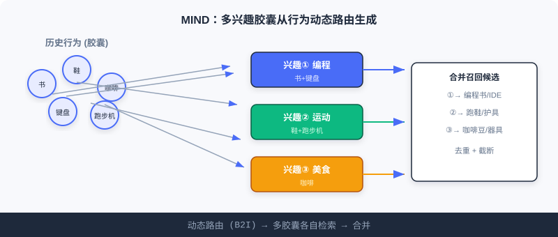
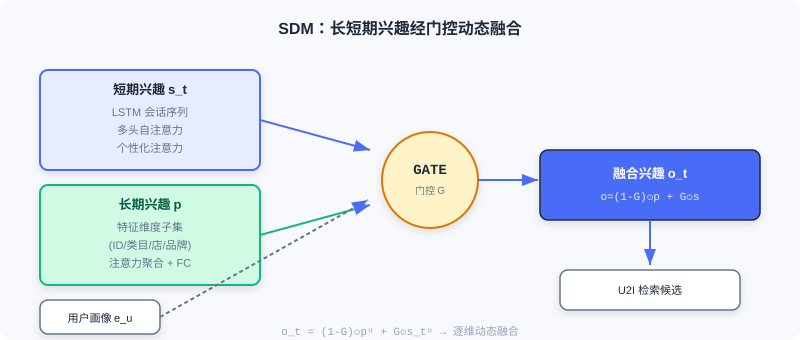

  📖
  ⏱️ ~35 min read
  🎯 Advanced

# 序列召回

> 📝 **Before You Continue:** 请先读完 [2.3](./two-tower.md) 的双塔模型。本章的 MIND / SDM 仍做 U2I 召回，但用户表示从「单一向量」升级为「多向量 / 长短期融合」——弥补双塔丢掉的**兴趣广度与时序动态**。

[2.3](./two-tower.md) 的双塔把用户压成一个向量。但这有两个隐患：用户兴趣是**多元**的（你既看编程书也买运动鞋），且是**动态演化**的（此刻的会话比一个月前更能预示下一刻需求）。用一个向量概括「一个人的全部」，就像用一句话标签概括一个人——不够。

序列召回正是冲着这两点来的。MIND 用**多个兴趣向量**（多兴趣胶囊）分别代言不同兴趣；SDM 则显式分离**长短期兴趣**并用门控动态融合。配合交互演示，你会看清「多向量检索」相比单向量的优势。

读完本章，你将能够：

- 描述 **MIND** 的动态路由（B2I）如何把行为软聚类成多个兴趣胶囊
- 解释 **squash 函数**与**标签感知注意力**在 MIND 中的作用
- 说明 **SDM** 如何用 LSTM + 多头注意力建模短期、用特征维度注意力建模长期，并以门控融合
- 用交互演示理解「多兴趣向量分别检索再合并」的流程
- 完成 5 道分层练习题，巩固序列召回

---

## 2.4.0 为什么单向量不够：兴趣的广度与时序

想象你的淘宝历史：今天买编程书、昨天买运动鞋、上周买咖啡豆。若只用单向量，这些异质兴趣会互相抵消、平均成一个「四不像」。更糟的是，短期会话里的即时意图（刚搜了「跑步鞋」）被长期偏好淹没。

序列召回的两大命题：**广度**（MIND：多向量）与**时序**（SDM：长短期分离）。下面逐一拆解。

---

## 2.4.1 MIND：用多个向量捕捉用户的多元兴趣

MIND（Multi-Interest Network with Dynamic Routing）借鉴**胶囊网络**的动态路由：把历史行为按兴趣类型软聚类，每类生成一个专门的兴趣向量。核心组件是**多兴趣提取层**与**标签感知注意力层**。

### 多兴趣提取（B2I 动态路由）

把历史行为视为「行为胶囊」，多重兴趣视为「兴趣胶囊」，通过动态路由把相关行为聚到对应兴趣维度。MIND 对原始动态路由做三处改进：

1. **共享变换矩阵** $S\in\mathbb{R}^{d\times d}$：所有兴趣向量在同一表示空间，便于后续相似度计算。路由连接强度 $b_{ij} = u_j^T S e_i$（$e_i$ 行为向量，$u_j$ 兴趣胶囊）。
2. **随机初始化**路由系数 $b_{ij}$：避免所有兴趣胶囊收敛到相同状态（类似 K-Means 随机中心初始化）。
3. **自适应兴趣数量** $K_u' = \max(1, \min(K, \log_2(|\mathcal{I}_u|)))$：行为少的用户用更少兴趣向量，省算力；活跃用户更丰富。

### 路由迭代四步

1. **计算路由权重**：对 $b_{ij}$ 做 Softmax 得行为 $i$ 属兴趣 $j$ 的软分配：

$$w_{ij} = \frac{\exp{b_{ij}}}{\sum_{k=1}^{K_u'} \exp{b_{ik}}}$$

2. **聚合行为**：按权重对所有行为向量经共享矩阵 $S$ 变换后加权求和，得初步兴趣向量：

$$\boldsymbol{z}_j = \sum_{i\in \mathcal{I}_u} w_{ij} \boldsymbol{S} \boldsymbol{e}_i$$

3. **非线性压缩（squash）**：把模长压到 $[0,1)$，方向不变；模长解释为兴趣存在概率，方向编码属性：

$$\boldsymbol{u}_j = \text{squash}(\boldsymbol{z}_j) = \frac{\lVert \boldsymbol{z}_j \rVert ^ 2}{1 + \lVert \boldsymbol{z}_j \rVert ^ 2} \frac{\boldsymbol{z}_j}{\lVert \boldsymbol{z}_j \rVert}$$

4. **更新路由系数**：按新胶囊与行为的一致性（点积）更新：

$$b_{ij} \leftarrow b_{ij} + \boldsymbol{u}_j^T \boldsymbol{S} \boldsymbol{e}_i$$

四步重复约 3 次，输出兴趣胶囊集合 $\{u_j\}$。

### 🧠 Mental Model: 给兴趣配「代言人」

> 把 MIND 想成给一个人的每个兴趣派一个「代言人」。编程相关行为聚到一个代言人、运动相关聚到另一个、美食再一个。检索时，每个代言人各自去物品库找「自己负责的那类」候选，再把所有代言人找来的合并——覆盖面远胜单个「平均人格」。

### 标签感知注意力

训练时有「正确答案」（用户实际点的下一物品），用目标物品向量作查询，从多兴趣中挑最相关的：

$$v_u = V_u \cdot \text{Softmax}(\text{pow}(V_u^T e_i, p))$$

$V_u$ 是兴趣胶囊矩阵，$e_i$ 目标物品向量，$p$ 控制集中度：$p\to0$ 各兴趣均等；$p$ 增大趋于聚焦；$p\to\infty$ 退化为硬注意力（只选最相似）。训练用 Sampled Softmax 最大化正样本相似度。

> **Analysis:** MIND 用多向量自然表达多元兴趣，检索覆盖面优于单向量；但兴趣间无明确时序区分（各胶囊平行），且头数增多会带来冗余检索。这恰好引出 SDM 对「时序」的显式建模。

---

## 2.4.2 SDM：融合长短期兴趣，捕捉动态变化

SDM（Sequential Deep Matching）的核心是分别建模**短期即时兴趣**与**长期稳定偏好**，再智能融合。

### 捕捉短期兴趣（三层结构）

1. **LSTM** 处理当前会话序列，学时序依赖，门控机制能抑制随机误点击：
$$\boldsymbol{h}_t^u = \boldsymbol{o}_t^u \tanh(\boldsymbol{c}_t^u),\quad \boldsymbol{X}^u=[\boldsymbol{h}_1^u,\ldots,\boldsymbol{h}_t^u]$$
2. **多头自注意力** 捕捉序列内多重兴趣：
$$\text{head}_i^u = \text{Attention}(W_i^Q X^u, W_i^K X^u, W_i^V X^u)$$
$$\hat{X}^u = \text{MultiHead}(X^u) = W^O \text{concat}(\text{head}_1^u,\ldots,\text{head}_h^u)$$
3. **个性化注意力** 用用户画像 $e_u$ 作查询对多头输出加权：
$$\alpha_k = \frac{\exp(\hat{h}_k^{uT} e_u)}{\sum_{k=1}^t \exp(\hat{h}_k^{uT} e_u)},\quad \boldsymbol{s}_t^u = \sum_{k=1}^t \alpha_k \hat{h}_k^u$$

### 捕捉长期兴趣（特征维度聚合）

长期行为按特征分成多个子集：商品 ID、叶子类目、一级类目、商店、品牌 $\mathcal{L}^u=\{\mathcal{L}_f^u\mid f\in\mathcal{F}\}$。对每个子集用用户画像做注意力：

$$\alpha_k = \frac{\exp(g_k^{uT} e_u)}{\sum_k \exp(g_k^{uT} e_u)},\quad \boldsymbol{z}_f^u = \sum_k \alpha_k g_k^u$$

拼接各维度表示经全连接得长期兴趣：

$$\boldsymbol{z}^u = \text{concat}(\{\boldsymbol{z}_f^u\}),\quad \boldsymbol{p}^u = \tanh(W^p \boldsymbol{z}^u + \boldsymbol{b})$$

### 长短期兴趣融合（门控）

门控网络接收用户画像、短期 $\boldsymbol{s}_t^u$、长期 $\boldsymbol{p}^u$，输出 0~1 的门控向量，逐维决定长短期贡献：

$$\boldsymbol{G}_t^u = \text{sigmoid}(W^1 e_u + W^2 \boldsymbol{s}_t^u + W^3 \boldsymbol{p}^u + \boldsymbol{b})$$

$$\boldsymbol{o}_t^u = (1-\boldsymbol{G}_t^u)\odot \boldsymbol{p}^u + \boldsymbol{G}_t^u \odot \boldsymbol{s}_t^u$$

### 🧠 Mental Model: 长期口味 vs 此刻心情

> 把长期兴趣想成「你一贯的口味」（爱科幻、偏平价），短期兴趣想成「此刻的心情」（正急着买双跑步鞋）。门控就像个调酒师：面对不同维度，有的多放长期、有的多放短期——既不是简单平均，也不是谁压谁，而是**逐维动态调配**。

> **Analysis:** SDM 显式区分并融合长短期，对时序动态建模能力强于 MIND；代价是结构复杂（LSTM + 多头 + 多特征维度注意力 + 门控），训练与 serving 成本更高。它与 MIND 构成序列召回的两条互补路线：广度 vs 时序。

---

## 2.4.3 交互演示：多兴趣向量检索

下面用交互演示感受 MIND 式「多兴趣向量分别检索再合并」的流程：用户的历史行为经动态路由聚成数个兴趣胶囊，每个胶囊各自去物品库检索 Top-K，最后合并去重得到召回候选。点击「下一步」观察路由如何把行为分到不同兴趣。

<iframe src="../viz/part2-sequence-mind.html?embed&vizId=part2-sequence-mind" style="width:100%; height:520px; border:none; display:block;" loading="lazy"></iframe>

注意：单向量双塔只做一次检索、易平均掉异质兴趣；多兴趣胶囊各自检索再合并，能同时覆盖「编程」「运动」「美食」多条线索——这正是 MIND 召回长尾多样内容的关键。

> 📊 **Data Point:** 在 funrec 评测集上，MIND hit_rate@10≈0.0058、SDM≈0.0555。SDM 显著更高，部分因其显式长短期融合更贴合该数据集的会话模式；二者都展示了序列召回相比单向量的多样性收益。

---

## ⚠️ Common Mistakes in 2.4

| # | Mistake | Example | Why It's Wrong | Fix |
|---|---------|---------|---------------|-----|
| 1 | 把 MIND 胶囊当独立模型 | 「每个胶囊单独训练」 | 路由是共享迭代，端到端联合 | 理解动态路由的软聚类本质 |
| 2 | 忽略 squash 的模长含义 | 以为方向随便定 | 模长=兴趣存在概率 | 用 squash 约束到 [0,1) |
| 3 | SDM 简单拼接长短 | 「拼起来过个层就行」 | 丢信息，难提取相关部分 | 用门控逐维动态融合 |
| 4 | 混淆 MIND 与多向量 DSSM | 「MIND 就是多个双塔」 | 路由软聚类、训练时标签感知 | 区分「静态多塔」与「动态路由」 |
| 5 | 兴趣数 K 设死 | 所有用户都用 K=4 | 行为少的用户浪费算力 | 用自适应 $K_u'$ |

---

## 本章小结

### 📌 Key Takeaways

| Concept | Key Points | Why It Matters |
|---------|-----------|----------------|
| MIND 多兴趣 | B2I 动态路由 + squash + 标签感知 | 多向量表达多元兴趣，覆盖长尾 |
| SDM 长短融合 | LSTM+多头(短) / 特征注意力(长) / 门控 | 显式建模兴趣时序动态 |
| 自适应 K | $K_u'=\max(1,\min(K,\log_2|\mathcal{I}_u|))$ | 按需分配算力 |
| 多向量检索 | 各胶囊分别检索再合并 | 互补于双塔单向量 |

### ❓ FAQ

**Q1: MIND 和双塔最根本的区别是什么？**
> A: 双塔给每个用户一个向量（单向量检索）；MIND 给每个用户多个兴趣向量（多向量分别检索再合并）。前者易把异质兴趣平均掉，后者能同时覆盖多条兴趣线索。

**Q2: squash 函数为什么要压模长到 [0,1)？**
> A: 胶囊网络约定「模长=该兴趣存在的概率」，方向=兴趣属性。压到 [0,1) 让模型用长度表达「这个兴趣有多强」，避免向量无限增长导致数值不稳定。

**Q3: SDM 的门控和 LSTM 的门控是一回事吗？**
> A: 思路同源（都用 sigmoid 门控），但作用不同：LSTM 门控管「序列内部信息流」，SDM 的门控管「长短期兴趣之间逐维的融合比例」。

### 前后关联

- **2.5（流式索引）** 从另一角度解决「多元/长尾兴趣」——用聚类统计保留全量历史，可与多向量检索互补。
- **3.x（排序）** 序列建模（DIN/DIEN）在排序侧进一步用注意力激活历史，与本章召回呼应。
- **2.3（双塔）** 是序列召回的「单向量基线」，理解它才能体会多向量的增益。

---

## Practice Problems

Work through all problems in order — they get progressively harder. Each has a complete solution you can reveal after trying it yourself.

---

**Problem 2.4.1 — 自适应兴趣数** 🟢 Easy

某用户历史行为数 $|\mathcal{I}_u|=32$，最大兴趣数 $K=4$。按 MIND 自适应公式 $K_u'=\max(1,\min(K,\log_2|\mathcal{I}_u|))$ 计算该用户实际兴趣向量数。另一用户仅有 3 条行为，其 $K_u'$ 又是多少？

💡 Solution (click to reveal)

**Approach:** 逐分量代入。

用户1：$\log_2 32 = 5$，$\min(4,5)=4$，$\max(1,4)=4$ → $K_u'=4$。

用户2：$\log_2 3\approx1.58$，$\min(4,1.58)=1.58$，取整后通常取 floor → $\min$ 得 1.58，$\max(1,1.58)=1.58$→ 实际取 1（或 2，依实现 floor/round）。按公式下界保护至少 1。

**Key points:**
- 活跃用户封顶到 K，行为少的用户自动减少兴趣数。
- 自适应避免给稀疏用户浪费多个头。

---

**Problem 2.4.2 — squash 模长** 🟢 Easy

给定向量 $\boldsymbol{z}=[3,4]$（模长 5）。用 squash 公式计算 $\boldsymbol{u}=\text{squash}(\boldsymbol{z})$，给出模长与方向，并说明模长代表的含义。

💡 Solution (click to reveal)

**Approach:** 套 squash。

$$\lVert z\rVert=5,\quad \frac{\lVert z\rVert^2}{1+\lVert z\rVert^2}=\frac{25}{26}\approx0.962$$

$$\boldsymbol{u}=0.962 \cdot \frac{[3,4]}{5} = 0.962\cdot[0.6,0.8]=[0.577,0.769]$$

模长≈0.962，方向同 $[3,4]$（即 $[0.6,0.8]$）。

**Key points:**
- 模长被压到 [0,1)，此处 0.962 表示「该兴趣存在概率很高」。
- 方向保留原属性编码，仅长度被非线性压缩。

---

**Problem 2.4.3 — 门控融合** 🟡 Medium

SDM 门控 $\boldsymbol{o}_t=(1-G)\odot \boldsymbol{p}^u + G\odot \boldsymbol{s}_t^u$。设某维度门控值 $G=0.8$，长期向量该维 $p=0.2$，短期向量该维 $s=0.9$。求该维融合结果，并解释其含义。

💡 Solution (click to reveal)

**Approach:** 代入。

$$o = (1-0.8)\times0.2 + 0.8\times0.9 = 0.2\times0.2 + 0.72 = 0.04 + 0.72 = 0.76$$

**答：** 融合后该维为 0.76，接近短期值 0.9。因 $G=0.8$ 偏向短期，说明在这一维度上「此刻心情」比「一贯口味」更重要（如该维度对应即时品类意图）。

**Key points:**
- 门控是逐维的，不同维度可偏长或偏短。
- 比例由用户画像+长短向量共同决定，非全局固定。

---

**Problem 2.4.4 — 标签感知注意力** 🔴 Hard

MIND 标签感知 $v_u = V_u\cdot\text{Softmax}(\text{pow}(V_u^T e_i, p))$。设用户三兴趣胶囊与目标物品相似度为 $[0.9, 0.3, 0.1]$。分别取 $p=1$ 与 $p=10$，计算 Softmax 权重（公式 $\text{softmax}(x)_j=e^{x_j}/\sum e^{x_k}$），说明 $p$ 如何聚焦。

💡 Solution (click to reveal)

**Approach:** 先算 $s^p$。

p=1：$s=[0.9,0.3,0.1]$，$e^s=[2.46,1.35,1.105]$，和=4.915 → $w=[0.500,0.275,0.225]$。

p=10：$s^{10}=[0.9^{10},0.3^{10},0.1^{10}]=[0.3487, 5.9e-6, 1e-10]$，$e$ 后和≈$e^{0.3487}=1.417$ → $w\approx[0.99998, 0.00002, \approx0]$。

**答：** p=1 时三兴趣都参与（权重 0.5/0.275/0.225）；p=10 时几乎全压到最相似兴趣（0.99998）。p 越大越聚焦，p→∞ 退化为硬选择。

**Key points:**
- pow 放大差异，使 Softmax 更「尖」。
- 训练时大 p 加快收敛（明确选最相关兴趣）。

---

**🏆 Challenge: 组合召回设计**

某内容平台既要「覆盖用户多元兴趣」又要「紧跟此刻会话意图」。请写约 150 字，说明如何**组合** MIND（多兴趣）与 SDM（长短期）作为双路序列召回：各自负责什么、结果如何合并去重，并指出哪路更适合推「用户从没表现过但此刻想看」的内容。

💡 Hint

MIND 多兴趣胶囊负责「广度覆盖」（编程/运动/美食各自检索），SDM 门控融合后的单向量负责「此刻意图精准」。两路 Top-K 合并后按物品去重、再按相似度/多样性截断。SDM 的短期兴趣更贴合「此刻想看」的即时内容，尤其会话内新兴意图；MIND 更适合唤醒长期多元但被平均掉的兴趣。

