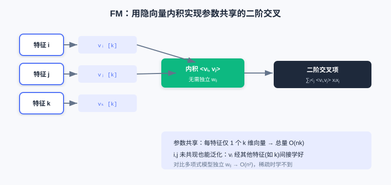
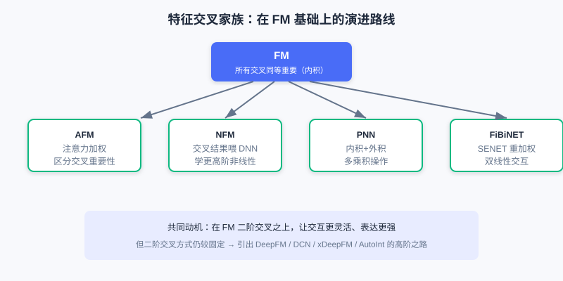
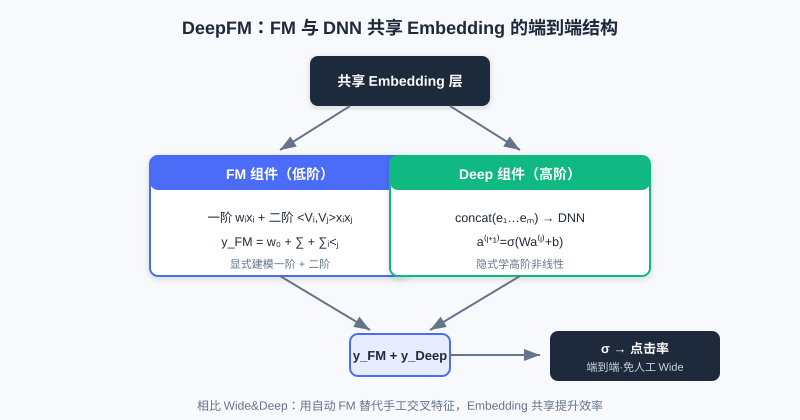
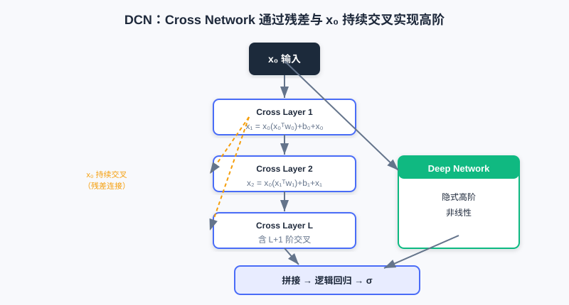
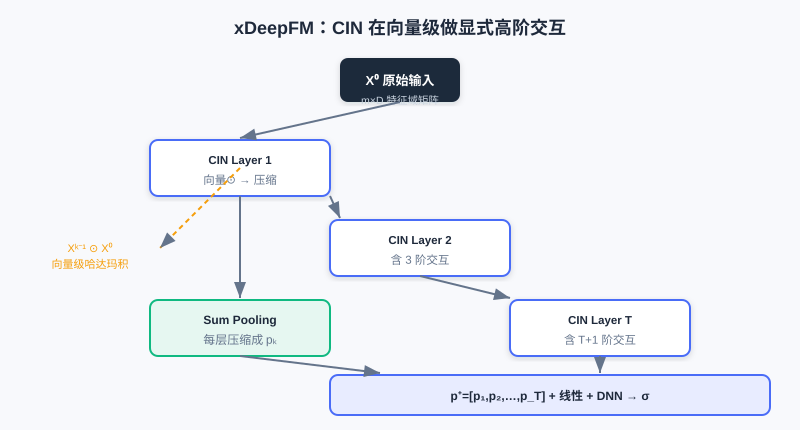

  📖
  ⏱️ ~55 min read
  🎯 Advanced

# 特征交叉

> 📝 **Before You Continue:** 请先读完 [3.1 Wide & Deep](./wide-and-deep.md)。本章正是为了解决 3.1 中"Wide 部分需人工设计交叉特征"这一短板而生——理解 Wide 的局限，才能体会 FM 的动机。

[3.1](./wide-and-deep.md) 的 Wide 部分用**人工交叉特征**记住强规则，但手工设计特征既麻烦又无法穷尽。一个自然的追问随之而来：**能不能让机器自己学会特征之间的交互关系？** 这正是特征交叉（Feature Crossing）要解决的问题。

最直接的想法是自动捕捉所有特征对之间的交互——但推荐系统动辄成千上万特征，若每对都学一个参数，参数量会爆炸；而且数据高度稀疏，大多数组合根本没有样本可学。本章我们从 FM 的精妙因子分解出发，一路走到 xDeepFM、AutoInt 等自动高阶交叉，并配一个交互演示，让你"看见"高阶组合如何逐步生成。

读完本章，你将能够：

- 解释 **FM** 如何用隐向量内积把 $O(n^2)$ 参数降到 $O(nk)$，并缓解稀疏问题
- 区分 **AFM / NFM / PNN / FiBiNET** 各自在 FM 基础上的增强点
- 说明 **DeepFM** 如何用"共享 Embedding"替代人工 Wide 部分，做到端到端
- 对比 **DCN（元素级）/ xDeepFM（向量级）/ AutoInt（自适应）** 三种高阶交叉的动机差异
- 完成 4 道分层练习题，并用交互演示理解高阶组合的生成

---

## 3.2.0 动机：从手工交叉到自动交叉

Wide & Deep 的 Wide 部分依赖专家手工设计交叉特征，这有两个痛点：(1) 组合空间太大，人工难以穷尽；(2) 新出现的组合没有现成特征。我们想要的，是一个能**自动学习任意特征对交互、又不让参数爆炸**的机制。

回想 Part 2 召回里的 FM：它把用户和物品分解为向量、用内积做高效召回。到了精排阶段，FM 换了一副面孔——它的核心思想"给每个特征学一个向量，再用向量内积捕捉交互"正好能解决上面的痛点。这是同一个技术在不同阶段的两次亮相。

### 🧠 Mental Model: 给每个特征发一张"名片"

> 把 **FM 的隐向量** 想成给每个特征发的一张"名片"，上面写着它的兴趣偏好。想知道特征 A 和特征 B 是否合拍？不用为每对 A×B 单独记一本账，只要把两张名片的内积算一下——合拍度高，内积就大。更重要的是：即使 A 和 B 从未在同一条样本里同时出现，只要它们各自和其他特征的"名片"学得好，照样能推断 A×B 的效果。这就是参数共享的威力。

---

## 3.2.1 FM：因子分解机（二阶交叉）

为了捕捉特征交互，一个直白的想法是在线性模型上加所有特征的二阶组合项（多项式模型）：

$$y = w_0 + \sum_{i=1}^n w_i x_i + \sum_{i=1}^{n-1}\sum_{j=i+1}^n w_{ij} x_i x_j$$

它有两个致命缺陷：(1) 参数量 $O(n^2)$，特征多时承受不起；(2) 在稀疏数据里，绝大多数交叉项 $x_i x_j$ 从未共现，对应权重 $w_{ij}$ 学不到。

FM 的精髓是**参数共享**：把交互权重分解为两个低维隐向量的内积 $w_{ij} = \langle \boldsymbol{v}_i, \boldsymbol{v}_j \rangle$。于是：

$$y = w_0 + \sum_{i=1}^n w_i x_i + \sum_{i=1}^{n-1}\sum_{j=i+1}^n \langle \boldsymbol{v}_i, \boldsymbol{v}_j \rangle x_i x_j$$

其中 $\boldsymbol{v}_i, \boldsymbol{v}_j$ 是特征 $i,j$ 的 $k$ 维 Embedding（$k \ll n$）。原本要学 $O(n^2)$ 个独立 $w_{ij}$，现在只需每个特征一个 $k$ 维向量，总参数量降到 **$O(nk)$**。更关键的是：即使 $i,j$ 从未共现，只要它们各自与其他特征（如 $k$）的共现学好，$\boldsymbol{v}_i, \boldsymbol{v}_j$ 就有效，从而泛化预测 $x_i \times x_j$ 的效果。此外，借助代数变换，FM 二阶项计算可从 $O(kn^2)$ 降到线性的 **$O(kn)$**：

$$\sum_{i=1}^{n-1}\sum_{j=i+1}^n \langle\boldsymbol{v}_i,\boldsymbol{v}_j\rangle x_i x_j = \frac{1}{2}\left[\left(\sum_{i=1}^n x_i\boldsymbol{v}_i\right)^2 - \sum_{i=1}^n x_i^2\boldsymbol{v}_i^2\right]$$

每个特征学一个 $k$ 维隐向量；任意两特征交互由内积给出，无需为每对单独记权重，参数从 $O(n^2)$ 降到 $O(nk)$。

> **Analysis:** FM 用参数共享同时解决"参数爆炸"和"稀疏难学"两大问题，是工业界广泛使用的二阶交叉基线。局限在于它只建模**二阶**两两交互，更高阶组合仍需依赖上层 DNN 隐式学习，且交互方式是固定的"内积"，无法区分不同交叉的重要性。

---

## 3.2.2 FM 家族的增强：AFM / NFM / PNN / FiBiNET

FM 对所有交叉"一视同仁"，但实际中不同交叉的重要性不同。研究者们在此基础上做了多种增强：

- **AFM（Attention FM）** 引入注意力机制，为每对交叉分配权重 $a_{ij}$（Softmax 归一化），让模型聚焦重要交互，且注意力权重可可视化、提升可解释性。其交互层先算元素积 $(v_i \odot v_j)x_i x_j$，再注意力池化：$\hat{y}_{afm} = w_0 + \sum_i w_i x_i + \boldsymbol{p}^T\sum_{i<j} a_{ij}(v_i\odot v_j)x_i x_j$。
- **NFM（Neural FM）** 把 FM 的二阶交叉结果（向量形式）当作"原料"喂给 DNN，学习更高阶非线性。关键是 **Bi-Interaction 池化层**：$f_{BI} = \sum_{i<j} x_i v_i \odot x_j v_j$，同样可优化到 $O(kn)$，再送入 MLP。FM 可看作 NFM 无隐藏层的特例。
- **PNN（Product-based NN）** 认为内积/元素积各有局限，于是在"乘积层"同时用**内积（IPNN）与外积（OPNN）**捕捉更丰富交互，并用矩阵分解/叠加近似把复杂度从 $O(N^2M)$ 降到 $O(NM)$。
- **FiBiNET** 先学**特征重要性**（借鉴视觉的 SENET：Squeeze→Excitation→Re-weight），再用**双线性交互** $p_{ij}=v_i\cdot W \odot v_j$ 打破对称交互限制，兼顾"重要特征"与"灵活交互"。

从"所有交叉同等重要"（FM）到"注意力加权"（AFM）、"喂给 DNN"（NFM）、"多乘积操作"（PNN）、"先重加权再双线性"（FiBiNET），演进始终围绕"更灵活、更强表达"。

> 💡 **Key Insight:** 这些模型都在回答"如何在 FM 的二阶交叉之上做得更好"——有的加注意力（AFM）、有的接深度网络（NFM）、有的换乘积方式（PNN）、有的先挑重要特征（FiBiNET）。但它们的二阶交叉方式仍较固定。

---

## 3.2.3 DeepFM：低阶高阶统一建模

[3.1](./wide-and-deep.md) 的 Wide 部分需要大量人工特征工程。DeepFM 直接把 Wide 换成**无需人工的 FM**，并让 FM 与 Deep **共享同一份 Embedding**。这带来两大好处：(1) 同时学低阶与高阶交互；(2) 共享 Embedding 让训练更高效。

DeepFM 由 FM 与 DNN 两个**并行**组件构成，输入共享：

- **FM 组件**捕捉一阶 + 二阶交叉：$y_{FM} = \langle w,x\rangle + \sum_{i<j}\langle V_i,V_j\rangle x_i x_j$。
- **Deep 组件**把所有 Embedding 拼接后送入 DNN，学高阶非线性：$a^{(0)}=[e_1,\ldots,e_m]$，$a^{(l+1)}=\sigma(W^{(l)}a^{(l)}+b^{(l)})$。

最终把两者 logit 相加再过 Sigmoid：$\hat{y}=\sigma(y_{FM}+y_{Deep})$。

FM 与 DNN 共享同一组 Embedding：FM 学低阶（一阶+二阶），DNN 学高阶，相加得最终预测，彻底免去人工 Wide 特征。

> **Analysis:** DeepFM 相比 Wide&Deep 的最大改进是**用自动学习的 FM 替代手工 Wide 部分**，实现真正端到端。复杂度主要来自并行 FM + DNN，但 Embedding 共享避免了参数翻倍。局限：FM 只能显式建模二阶，更高阶仍靠 DNN 隐式学，且交互方式固定。

---

## 3.2.4 高阶交叉：DCN（残差高阶）

FM 家族明确建模二阶，更高阶主要靠 DNN 隐式学，而我们不清楚 DNN 到底学到了什么阶。DCN（Deep & Cross Network）用 **Cross Network** 替代 Wide 部分，每一层都与原始输入 $\boldsymbol{x}_0$ 交叉，从而**明确**学到高阶交互：

$$\boldsymbol{x}_{l+1} = \boldsymbol{x}_0 \boldsymbol{x}_l^T \boldsymbol{w}_l + \boldsymbol{b}_l + \boldsymbol{x}_l$$

这就是一个**残差结构**：第 $l$ 层在上一层输出上加一个"与原始输入交叉"的项。层数越深，交叉阶数越高——第 1 层含二阶、第 2 层含三阶……且参数量只与输入维度**成正比**。Cross Network 与 Deep Network 并行，最后拼接过逻辑回归：

$$\boldsymbol{p} = \sigma([\boldsymbol{x}_{L_1}^T, \boldsymbol{h}_{L_2}^T]\boldsymbol{w}_{\text{logits}})$$

每层 $x_{l+1}=x_0(x_l^T w_l)+b_l+x_l$：残差连接保留原信息，与 $x_0$ 持续交叉使阶数随层数增长，参数仅线性增长。

> **Analysis:** DCN 明确可控地学到任意高阶交叉，参数高效（线性于维度）。但它是**元素级（bit-wise）**交叉——Embedding 每个元素单独交互，把向量拆散，没有把 Embedding 当完整特征看。这正是 xDeepFM 要修正的。

---

## 3.2.5 xDeepFM：向量级 CIN 交互

DCN 在元素级做交叉，xDeepFM 提出**压缩交互网络（CIN）**，改为**向量级（vector-wise）**交互，更符合直觉。xDeepFM 含三部分：线性 + DNN（隐式高阶）+ CIN（显式高阶向量级），最后合并。

CIN 的核心：第 $k$ 层输出 $\boldsymbol{X}_k$ 由上一层 $\boldsymbol{X}_{k-1}$ 与原始输入 $\boldsymbol{X}_0$ 的所有成对**哈达玛积**加权求和得到：

$$\boldsymbol{X}_{h,*}^k = \sum_{i=1}^{H_{k-1}}\sum_{j=1}^m \boldsymbol{W}_{i,j}^{k,h}(\boldsymbol{X}_{i,*}^{k-1}\circ\boldsymbol{X}_{j,*}^0)$$

其中 $\circ$ 是向量级哈达玛积，保留 $D$ 维向量结构。第 $k$ 层输出包含**所有 $k+1$ 阶**向量级交互。各层特征图经 Sum Pooling 拼接后，与线性、DNN 输出合并过 Sigmoid：

$$\hat{y}=\sigma(\boldsymbol{w}_{\text{linear}}^T\boldsymbol{a}+\boldsymbol{w}_{\text{dnn}}^T\boldsymbol{x}_{\text{dnn}}^k+\boldsymbol{w}_{\text{cin}}^T\boldsymbol{p}^+ + b)$$

CIN 每层把"上一层特征图 × 原始输入"做向量哈达玛积，再加权压缩成新特征图；逐层累积，得到二阶到 T+1 阶的向量级交叉。

> **Analysis:** xDeepFM 把"向量级显式交互"与"元素级隐式交互"结合，表达更强且交互可解释（哪层对应哪阶）。代价是 CIN 的 $H_{k-1}\times m$ 个向量加权求和带来额外计算，需谨慎设特征图数量。

---

## 3.2.6 AutoInt：自注意力自适应交互

DCN 每层固定与 $x_0$ 交叉，xDeepFM 的 CIN 也按固定方式交互。AutoInt 换思路：**让模型自己决定哪些特征交互、强度多大**——用 Transformer 的自注意力机制自适应学任意阶交互。

对于特征 $m,k$，第 $h$ 个注意力头的相关性得分：

$$\alpha_{m,k}^{(h)} = \frac{\exp(\psi^{(h)}(\boldsymbol{e}_m,\boldsymbol{e}_k))}{\sum_{l=1}^M \exp(\psi^{(h)}(\boldsymbol{e}_m,\boldsymbol{e}_l))},\quad \psi^{(h)} = \langle W_Q^{(h)}\boldsymbol{e}_m, W_K^{(h)}\boldsymbol{e}_k\rangle$$

用得分对 Value 加权求和得新表示 $\tilde{e}_m^{(h)}$，多头拼接后加残差连接。堆叠多层，第一层含二阶、第二层含三阶……交互模式**完全由注意力权重动态决定**。最终拼接所有层表示过逻辑回归。

> 💡 **Key Insight:** 三种高阶交叉的动机差异一目了然——**DCN** 用残差固定交叉（元素级）、**xDeepFM** 用 CIN 固定交叉（向量级）、**AutoInt** 用注意力**自适应**交叉。前两者交互模式写死，AutoInt 把"选谁交互、多强"交给数据学，更灵活、也可解释（看注意力矩阵）。

---

## 3.2.7 交互演示：高阶交叉如何逐层生成

下面用交互演示直观感受"二阶 → 三阶 → 更高阶"的组合是如何从底层特征逐步构造出来的。点击「下一步」观察每一层新增了哪些交叉组合。

<iframe src="../viz/part3-feature-crossing.html?embed&vizId=part3-feature-crossing" style="width:100%; height:520px; border:none; display:block;" loading="lazy"></iframe>

演示用 4 个基础特征（如 性别、城市、品类、价格档），逐层展示：第 1 层产出所有二阶组合，第 2 层把二阶再与基础特征交叉得到三阶，依此类推——这正是 DCN / CIN 显式高阶交叉的直觉来源。

---

## ⚠️ Common Mistakes in 3.2

| # | Mistake | Example | Why It's Wrong | Fix |
|---|---------|---------|---------------|-----|
| 1 | 以为 FM 给每对特征学独立权重 | "FM 有 $O(n^2)$ 个交叉权重" | FM 用隐向量内积**共享**参数，仅 $O(nk)$ | 记住：$w_{ij}=\langle v_i,v_j\rangle$，参数量随 $n$ 线性 |
| 2 | 忽略 FM 缓解稀疏的意义 | "特征没共现就学不到" | 隐向量通过与其他特征共现间接学得，可泛化 | 参数共享是 FM 解决稀疏的核心 |
| 3 | 把 DeepFM 当 Wide&Deep 同款 | "DeepFM 也要人工交叉特征" | DeepFM 用 FM **替代**手工 Wide，端到端 | 区分：Wide&Deep=人工交叉，DeepFM=自动 FM |
| 4 | 混淆 DCN 与 xDeepFM 的交叉粒度 | "两者都是高阶交叉，没区别" | DCN 是**元素级**、xDeepFM 是**向量级** | 看交叉发生在标量还是完整 Embedding 向量 |
| 5 | 认为高阶交叉越多越好 | "堆 10 层 Cross 肯定更强" | 过高阶易过拟合、计算贵，且业务未必需要 | 按数据复杂度与验证集选层数 |

---

## 本章小结

### 📌 Key Takeaways

| Concept | Key Points | Why It Matters |
|---------|-----------|----------------|
| FM 因子分解 | $w_{ij}=\langle v_i,v_j\rangle$，参数 $O(nk)$ | 自动二阶交叉，解决参数爆炸+稀疏 |
| FM 家族 | AFM 注意力 / NFM 接 DNN / PNN 多乘积 / FiBiNET 重加权 | 在二阶交叉上做增强 |
| DeepFM 共享 Embedding | FM(低阶)+DNN(高阶) 共享输入 | 端到端替代人工 Wide |
| DCN 残差高阶 | $x_{l+1}=x_0 x_l^T w_l+b_l+x_l$（元素级） | 明确可控的高阶交叉，参数线性 |
| xDeepFM CIN | 向量级哈达玛积逐层压缩 | 向量级显式高阶，可解释 |
| AutoInt 自适应 | 自注意力决定交互与强度 | 最灵活，交互由数据学 |

### ❓ FAQ

**Q1: 为什么不直接用 DNN 学高阶交叉，还要 FM/DCN 这些？**
> A: DNN 能隐式学高阶，但我们不知道它学的是几阶、哪些组合，也难保证稀疏组合学好。FM/DCN/xDeepFM 做**显式**交叉，可控、可解释、对稀疏更友好。

**Q2: DCN 和 xDeepFM 该选哪个？**
> A: 若特征交互更宜当作"整体向量"关系（如语义 Embedding），xDeepFM 的向量级更贴合；若追求简单高效、元素级足够，DCN 更轻量。实践中看验证集与算力。

**Q3: AutoInt 的注意力权重能当特征重要性用吗？**
> A: 可以。注意力矩阵 $\alpha^{(h)}$ 直接显示哪些特征对交互贡献大，是可解释性的重要来源，这也是它相对 DCN/xDeepFM 的优势之一。

### 前后关联

- **3.3（序列建模）** 跳出"静态特征袋"，引入时间维度；DIN 的注意力与 AFM/AutoInt 的注意力思想同源。
- **3.4（多目标）** 的底层共享结构（Shared-Bottom/MMoE）常以 DeepFM 类结构作 backbone。
- **Part 2 召回** 中 FM 用于双塔召回，与本章精排用法是同一技术的两端。

---

## Practice Problems

Work through all problems in order — they get progressively harder. Each has a complete solution you can reveal after trying it yourself.

---

**Problem 3.2.1 — FM 参数共享** 🟢 Easy

某推荐场景有 $n=1000$ 个特征，FM 隐向量维度 $k=8$。请回答：

1. 若用原始多项式模型，二阶交叉权重 $w_{ij}$ 有多少个（约）？
2. FM 用隐向量方案，参数量约多少？相比降低了几个数量级？

💡 Solution (click to reveal)

**Approach:** 直接套数量级公式。

1. 多项式模型二阶项约 $n^2/2 = 1000^2/2 = 5\times 10^5$ 个权重。
2. FM 只需每个特征一个 $k$ 维向量，共 $n \times k = 1000 \times 8 = 8000$ 个参数。

**Key points:**
- 从 $5\times 10^5$ 降到 $8\times 10^3$，约降低 **2 个数量级**（百倍）。
- 随 $n$ 增大差距更夸张，这正是 FM 在工业界可用的关键。

---

**Problem 3.2.2 — 区分交叉类型** 🟢 Easy

把下列描述对应到 FM / DeepFM / DCN / xDeepFM / AutoInt 中的正确模型：

- (a) 和原始输入逐层做残差交叉，但拆散了 Embedding 的每个元素。
- (b) FM 与 DNN 共用一份特征 Embedding，分别学低阶与高阶。
- (c) 用多头自注意力让模型自己决定哪些特征该交互、强度多大。
- (d) 把上一层特征图与原始输入做向量级哈达玛积再压缩。

💡 Solution (click to reveal)

**Approach:** 抓每类交叉的"粒度"与"是否自适应"。

- (a) **DCN**（元素级 / bit-wise 残差交叉）
- (b) **DeepFM**（共享 Embedding 的并行 FM+DNN）
- (c) **AutoInt**（自注意力自适应交互）
- (d) **xDeepFM**（CIN 向量级交互）

**Key points:**
- 元素级 vs 向量级：DCN vs xDeepFM。
- 自适应 vs 固定：AutoInt 独一份。

---

**Problem 3.2.3 — 动机追问** 🟡 Medium

为什么 FM 能在"特征 $i$ 与 $j$ 从未在训练集中共现"时，仍给出合理的 $x_i\times x_j$ 交叉预测？请结合参数共享说明。

💡 Solution (click to reveal)

**Approach:** 从隐向量的"间接学习"角度解释。

FM 中交互权重是 $w_{ij}=\langle v_i, v_j\rangle$。即使 $i,j$ 从未同现，$v_i$ 可通过 $i$ 与其他特征（如 $k$）的共现学好，$v_j$ 也可通过 $j$ 与 $k$ 的共现学好。只要这些隐向量学得充分，它们的内积就能推断 $i\times j$ 的倾向——无需 $i,j$ 直接样本。

**Key points:**
- 参数共享让"没直接见过的组合"也能被泛化估计。
- 这是 FM 相比"每个组合独立权重"在稀疏场景下的根本优势。

---

**Problem 3.2.4 — 推导 FM 线性复杂度** 🔴 Hard

从 FM 二阶项 $\sum_{i<j}\langle v_i,v_j\rangle x_i x_j$ 出发，证明它可化为 $\frac{1}{2}[(\sum_i x_i v_i)^2 - \sum_i x_i^2 v_i^2]$，从而计算复杂度为 $O(kn)$。并说明：当某特征 $x_k=0$ 时，它与所有其他特征的交互如何被自然忽略。

💡 Solution (click to reveal)

**Approach:** 展开平方并消项。

$(\sum_i x_i v_i)^2 = \sum_i x_i^2 v_i^2 + 2\sum_{i<j} x_i x_j \langle v_i,v_j\rangle$。移项得 $\sum_{i<j} x_i x_j\langle v_i,v_j\rangle = \frac{1}{2}[(\sum_i x_i v_i)^2 - \sum_i x_i^2 v_i^2]$。两项都只需先对 $n$ 个特征做 $O(k)$ 的向量加法/平方，再求和，总 $O(kn)$ 而非 $O(kn^2)$。

当 $x_k=0$，它在 $\sum_i x_i v_i$ 中贡献为 0，且 $x_k^2 v_k^2=0$，故所有含 $k$ 的交互项自动消失——无需显式跳过，稀疏特征天然被忽略，零计算浪费。

**Key points:**
- 代数变换是 FM 能用于高维稀疏的关键。
- $x_k=0$ 时交互自动归零，与稀疏性完美契合。

---

**🏆 Challenge: 设计交叉方案**

某新闻 App 有 500 维稀疏特征，既要捕捉"年龄×品类"这类二阶强规则，又希望模型自动发现三阶以上模式，且要求结构可解释（能看出哪些交叉重要）。请你从 FM / AFM / DCN / xDeepFM / AutoInt 中选 **2 个组合** 并说明理由（150 字内）。

💡 Hint

二阶+可解释权重 → AFM（注意力可视化）；高阶+可解释阶数 → xDeepFM（CIN 每层对应固定阶）或 AutoInt（注意力矩阵）。DCN 元素级且不可直接看交叉重要性，可不选。组合如 "AFM + xDeepFM" 兼顾低阶可解释与高阶向量级可解释。

