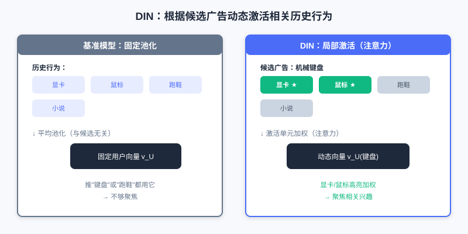
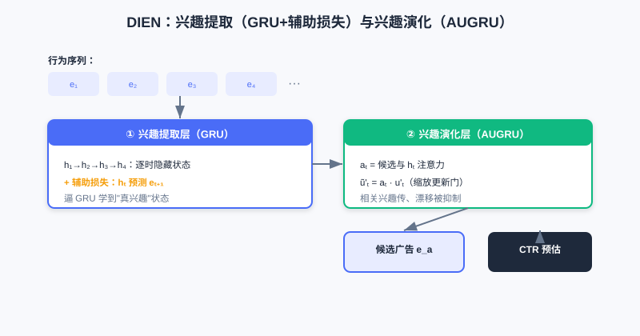
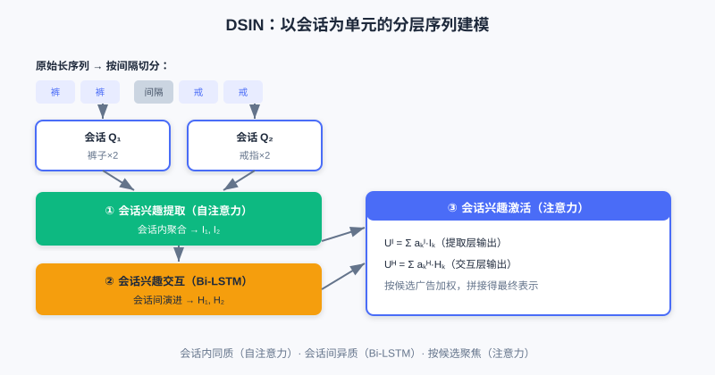

  📖
  ⏱️ ~45 min read
  🎯 Advanced

# 序列建模

> 📝 **Before You Continue:** 建议先读完 [3.2 特征交叉](./feature-crossing.md)。特征交叉把用户历史当作"静态特征袋"，本章则引入**时间维度**——理解这个视角切换，是读本章的关键。

[3.2](./feature-crossing.md) 的各种交叉模型，核心目标是从一个**静态特征集合**里挖掘价值。但它们普遍有个局限：把用户历史行为看作一个无序的"物品袋"（bag of items）。然而用户兴趣不是静止的，它具有明显的**时序性**与**动态演化**。

想想这个区别：一个用户先浏览"鼠标"再浏览"显示器"，与先浏览"小说"再浏览"显示器"，背后购买意图截然不同——前者可能是组装电脑的数码党，后者或许只是随性浏览。传统交叉模型抓不住这种蕴含在顺序里的意图。本章我们把用户历史从"静态袋子"升级为"动态序列"，看工业界三个代表模型 **DIN / DIEN / DSIN** 如何驯服时间。

读完本章，你将能够：

- 解释 **DIN 的局部激活**如何突破"固定长度用户向量"瓶颈，及为何注意力权重**不**做 Softmax
- 说明 **DIEN** 如何用辅助损失 + AUGRU 显式建模兴趣的时序演化
- 描述 **DSIN** 如何用"会话"作为基本单元做分层建模（会话内自注意力、会话间 Bi-LSTM）
- 用交互演示观察 DIN 如何根据候选广告动态激活不同历史行为
- 完成 4 道分层练习题，巩固序列建模的"动态 / 序列 / 聚焦"三要素

---

## 3.3.0 动机：从静态特征袋到动态序列

在大型电商平台，用户兴趣是**多样**的：同一用户可能既关注数码、又看运动、还买日用。传统 Embedding&MLP 范式把用户所有历史行为 Embedding 池化成**一个固定长度向量**来代表用户——问题来了：无论给他推"跑鞋"还是"手机"，代表他的都是同一个向量。它想"一视同仁"地塞下所有兴趣，既困难，又对具体任务不够聚焦。

> 💡 **Key Insight:** 用户的一次具体点击，通常只被历史兴趣中的**一部分**激活。给数码爱好者推"机械键盘"时，真正起作用的是他最近看"游戏鼠标""显卡"的行为，而非上个月买的"跑鞋"。兴趣表示应当**随候选不同而动态变化**。

### 🧠 Mental Model: 不是一份简历，而是一束聚光灯

> 把传统"固定用户向量"想成一份**静态简历**——所有经历挤在一页，谁来看都一样。把 DIN 的"局部激活"想成**一束聚光灯**：来了一个候选广告，灯只打在与之相关的几段历史上，其余暗下去。候选人没变，但"被照亮的样子"随面试官（候选）而变。

---

## 3.3.1 DIN：局部激活的注意力机制

深度兴趣网络（DIN）的核心是**局部激活（Local Activation）**：用户兴趣表示不应固定，而应随候选广告 $A$ 动态变化。为此 DIN 引入**局部激活单元**（注意力机制），对用户 $U$ 的历史行为 Embedding 做"加权求和"：

$$\boldsymbol{v}_U(A) = \sum_{j=1}^{H} a(\boldsymbol{e}_j, \boldsymbol{v}_A)\boldsymbol{e}_j = \sum_{j=1}^{H} w_j \boldsymbol{e}_j$$

其中 $\boldsymbol{e}_j$ 是历史行为 Embedding，$\boldsymbol{v}_A$ 是候选广告 Embedding，激活单元 $a(\cdot)$ 通常是一个小前馈网络，接收 $(\boldsymbol{e}_j, \boldsymbol{v}_A)$ 输出权重 $w_j$。与广告越相关的历史，权重越大，在最终兴趣向量里占主导。

一个关键细节：**DIN 的注意力权重 $w_j$ 不做 Softmax 归一化**，即 $\sum w_j$ 不一定等于 1。这是为了保留兴趣的**绝对强度**——若用户大部分历史都与某广告高度相关，加权和向量模长就大；反之则小。这样模型既能感知兴趣"方向"，也能感知"强度"。

左：基准模型对所有历史池化为固定向量（与候选无关）。右：DIN 用激活单元按候选算注意力，相关历史（显卡、鼠标）被高亮加权，无关历史（跑鞋）被压低，得到随候选变化的兴趣向量。

> **Analysis:** DIN 用轻量注意力突破固定向量瓶颈，显著提升多样兴趣下的表达能力，且计算开销小（仅加一个激活单元）。局限：它仍把历史当**无序集合**，忽略了行为间的**时序依赖**——兴趣是演化的，而非静止的。复杂度主要在注意力打分的前馈网络，随序列长度线性增长。

---

## 3.3.2 DIEN：兴趣的演化建模

DIN 抓住了"多样性 + 局部激活"，但把历史当无序集合，忽略**时序依赖**。深度兴趣演化网络（DIEN）要回答：光知道用户过去喜欢什么不够，还得搞清兴趣**怎么变化**，才能更好预测下一步。DIEN 用一个两阶段结构实现。

**第一阶段：兴趣提取层（Interest Extractor Layer）。** 用 GRU 按时间处理行为 Embedding 序列 $\boldsymbol{e}_1,\ldots,\boldsymbol{e}_T$。但 GRU 隐状态是否真能表示"兴趣"？DIEN 加了一个**辅助损失（Auxiliary Loss）**：让 $t$ 时刻隐状态 $\boldsymbol{h}_t$ 去预测 $t+1$ 时刻真实行为 $\boldsymbol{e}_{t+1}$（正样本）与负采样行为（负样本）：

$$L_{aux} = -\frac{1}{N}\sum_{i=1}^N\sum_{t=1}^T\left[\log\sigma(\boldsymbol{h}_t^i,\boldsymbol{e}_{b[t+1]}^i) + \log(1-\sigma(\boldsymbol{h}_t^i,\hat{\boldsymbol{e}}_{b[t+1]}^i))\right]$$

它与最终 CTR 损失相加：$L = L_{target} + \alpha L_{aux}$。这个额外监督逼着 GRU 学到更有意义的兴趣表示。

**第二阶段：兴趣演化层（Interest Evolving Layer）。** 得到兴趣状态序列后，用带注意力更新门的 GRU（**AUGRU**）建模演化。注意力得分 $a_t$ 由 $t$ 时刻兴趣状态 $\boldsymbol{h}_t$ 与候选广告 $\boldsymbol{e}_a$ 决定：$a_t = \frac{\exp(\boldsymbol{h}_t W \boldsymbol{e}_a)}{\sum_j \exp(\boldsymbol{h}_j W \boldsymbol{e}_a)}$，并用它缩放 GRU 更新门 $\tilde{u}'_t = a_t \cdot u'_t$。这样，与候选相关的兴趣顺利传递，不相关的"兴趣漂移"被削弱。

兴趣提取层用 GRU 配合"预测下一行为"的辅助损失学到真实兴趣状态；兴趣演化层用 AUGRU（注意力缩放更新门）让与候选相关的兴趣路径顺畅传递，抑制兴趣漂移。

> **Analysis:** DIEN 显式建模兴趣时序演化，比 DIN 更贴合"兴趣会变"的事实，对序列长、兴趣漂移明显的场景更优。代价是结构更复杂、GRU + 辅助损失 + AUGRU 带来更高训练与推理成本；且 GRU 序列计算难以高度并行。

---

## 3.3.3 DSIN：从行为序列到会话序列

从 DIN 到 DIEN，兴趣理解从"静态相关"走向"动态演化"，但二者都把行为看成一条连续序列。现实中用户行为常是**间断**的：在一个**会话（Session）**内意图集中，不同会话间兴趣可能剧变。DSIN（深度会话兴趣网络）把"会话"作为基本单元，分层建模。

DSIN 分四层：

1. **会话划分层**：按时间间隔（如 >30 分钟）把长序列切成多个会话短序列 $Q_1,\ldots,Q_K$。
2. **会话兴趣提取层**：对每个会话用**自注意力**（Transformer 思想）捕捉会话内关系，聚合成会话兴趣向量 $I_k$。
3. **会话兴趣交互层**：用 **Bi-LSTM** 对会话序列 $[I_1,\ldots,I_K]$ 建模，捕捉会话间演进。
4. **会话兴趣激活层**：根据候选广告，用注意力对会话兴趣加权求和（与 DIN 一脉相承）：

$$\boldsymbol{U}^I = \sum_{k=1}^K a_k^I \boldsymbol{I}_k,\quad \boldsymbol{U}^H = \sum_{k=1}^K a_k^H \boldsymbol{H}_k$$

DSIN 把长序列切成会话：会话内用自注意力聚合（同质），会话间用 Bi-LSTM 传递（异质），最后按候选注意力激活相关会话，实现"会话内聚合 + 会话间传递"的精细刻画。

> 💡 **Key Insight:** 序列建模三模型体现了三条递进思想——**动态性**（DIN：兴趣随任务变）、**序列性**（DIEN：利用时间顺序演化）、**聚焦性**（DSIN：按会话分层、按候选激活）。它们共同把"静态物品袋"升级为"可被任务聚焦的动态序列"。

---

## 3.3.4 交互演示：DIN 注意力激活

下面用交互演示感受 DIN 的核心：给定同一个用户（固定历史行为），换一个候选广告，被高亮激活的历史行为会**完全不同**。点击「下一步」切换候选，观察聚光灯打在不同历史上。

<iframe src="../viz/part3-din-attention.html?embed&vizId=part3-din-attention" style="width:100%; height:520px; border:none; display:block;" loading="lazy"></iframe>

演示中用户历史包含"显卡、鼠标、跑鞋、小说"等行为。候选为「机械键盘」时，显卡/鼠标被激活；候选切到「跑步袜」时，聚光灯转而打在跑鞋上——这正是"局部激活"的直观体现。

---

## ⚠️ Common Mistakes in 3.3

| # | Mistake | Example | Why It's Wrong | Fix |
|---|---------|---------|---------------|-----|
| 1 | 认为 DIN 用固定用户向量 | "DIN 把历史池化成一个向量" | DIN 用注意力**动态**生成随候选变化的向量 | 区分基准池化（固定）vs 局部激活（动态） |
| 2 | 给 DIN 注意力加 Softmax | "权重和为 1 才规范" | DIN 刻意**不**归一化以保留兴趣强度 | 理解：保留模长=保留强度信息 |
| 3 | 以为 DIEN 只用 GRU | "DIEN = GRU 堆两层" | 还有关键的**辅助损失**与 **AUGRU** | 两阶段缺一不可：提取+演化 |
| 4 | 把 DSIN 当长序列 RNN | "DSIN 直接用一个 RNN 处理全序列" | DSIN 先按会话切分，再分层（自注意力+BiLSTM） | 会话是基本单元，分层建模 |

---

## 本章小结

### 📌 Key Takeaways

| Concept | Key Points | Why It Matters |
|---------|-----------|----------------|
| DIN 局部激活 | $v_U(A)=\sum w_j e_j$，权重不做 Softmax | 兴趣随候选动态变化，突破固定向量瓶颈 |
| DIEN 演化 | GRU+辅助损失提取兴趣，AUGRU 演化 | 显式建模兴趣时序变化，抗漂移 |
| DSIN 会话 | 会话划分→自注意力→BiLSTM→激活 | 会话内同质、会话间异质的分层刻画 |
| 三要素 | 动态性 / 序列性 / 聚焦性 | 序列建模的核心思想递进 |

### ❓ FAQ

**Q1: 注意力权重不做 Softmax，模型不就"不稳定"了吗？**
> A: 恰恰相反。Softmax 会把权重压成概率分布（和为 1），丢失"这个用户整体有多相关"的信息。DIN 保留模长，让向量既能表示方向也能表示强度，更贴合业务直觉。

**Q2: DIEN 的辅助损失有什么用？**
> A: 它给 GRU 每一步隐状态加"预测下一行为"的监督，逼着隐状态真正编码"兴趣"而非噪声，否则 GRU 隐状态不一定代表有意义的兴趣状态。

**Q3: 什么时候该用 DSIN 而不是 DIN/DIEN？**
> A: 当用户行为明显呈"会话式"（如短时间内集中浏览、间隔长）且跨会话兴趣差异大时，DSIN 的分层建模更贴合实际行为模式。

### 前后关联

- **3.4（多目标）** 中 ESMM 等常以序列模型（如 DIN）作底层 backbone。
- **Part 4 重排** 在排序输出基础上优化列表级体验；序列建模的"用户意图"理解对重排多样性同样重要。
- **生成式推荐（下篇）** 的序列生成思想，与本章"把历史当序列"一脉相承，只是走向自回归解码。

---

## Practice Problems

Work through all problems in order — they get progressively harder. Each has a complete solution you can reveal after trying it yourself.

---

**Problem 3.3.1 — 区分模型思想** 🟢 Easy

把下列描述对应到 DIN / DIEN / DSIN：

- (a) 用自注意力在每个会话内聚合，再用 Bi-LSTM 在会话间传递，最后按候选激活。
- (b) 对历史行为算注意力权重得到随候选变化的兴趣向量，且权重不归一化。
- (c) 用 GRU 配辅助损失提取兴趣，再用注意力更新门（AUGRU）建模演化。

💡 Solution (click to reveal)

**Approach:** 抓每模型最标志性的结构。

- (a) **DSIN**（会话划分 + 自注意力 + Bi-LSTM + 激活）
- (b) **DIN**（局部激活注意力，权重不 Softmax）
- (c) **DIEN**（兴趣提取层 + 兴趣演化层 AUGRU）

**Key points:**
- DIN=动态激活；DIEN=时序演化；DSIN=会话分层。

---

**Problem 3.3.2 — DIN 为何不 Softmax** 🟢 Easy

DIN 的注意力权重 $w_j$ 不做 Softmax 归一化。请简述这一设计保留了对模型有用的什么信息，并举例说明。

💡 Solution (click to reveal)

**Approach:** 从"强度"而非"分布"的角度想。

不做 Softmax，$\sum w_j$ 不一定为 1，加权和向量的**模长**保留了用户兴趣与候选的**绝对相关强度**。例如：若用户 80% 的历史都与"机械键盘"相关，向量模长大，表示"强兴趣"；若仅 10% 相关，模长小。Softmax 会把两者都压成"和为 1"，丢失这种强度差异。

**Key points:**
- 保留模长 = 保留兴趣强度信息。
- 模型同时感知"方向"与"强度"。

---

**Problem 3.3.3 — 动机追问** 🟡 Medium

为什么 DIEN 要在 GRU 之外额外引入"辅助损失"？如果只用最终 CTR 损失训练 GRU，会有什么问题？

💡 Solution (click to reveal)

**Approach:** 从"GRU 隐状态是否真代表兴趣"切入。

GRU 的隐状态 $h_t$ 理论应包含到 $t$ 时刻的全部信息，但单靠最终 CTR 损失，模型可能让隐状态编码进与"兴趣"无关的噪声或捷径特征。辅助损失强制 $h_t$ 能预测 $t+1$ 真实行为（正样本）而非负样本，等于给每一步隐状态加了"兴趣预测"的监督，使其更精准表达潜在兴趣，进而让下游 AUGRU 演化更可靠。

**Key points:**
- 辅助损失 = 每步的兴趣监督，防隐状态跑偏。
- 是 DIEN"兴趣提取"有效的关键。

---

**Problem 3.3.4 — 辅助损失与负采样** 🔴 Hard

DIEN 的辅助损失 $L_{aux}$ 同时用了正样本（真实下一步行为 $e_{t+1}$）与负采样样本 $\hat{e}_{t+1}$。若去掉负采样、只用正样本让 $h_t$ 预测 $e_{t+1}$，会有什么问题？从 GRU 隐状态表征的角度分析。

💡 Solution (click to reveal)

**Approach:** 从"监督信号是否足够区分兴趣"入手。

只用正样本时，$h_t$ 只需与 $e_{t+1}$ 内积大即可，但没有任何"不该像什么"的约束——模型可学到一个退化解（如把所有 $h_t$ 推向固定方向、或 Embedding 坍缩），仍能让正样本得分高却丧失区分度。负采样提供"对比"信号：逼 $h_t$ 既接近真下一步、又远离随机行为，使隐状态真正编码"兴趣"而非平凡解。

**Key points:**
- 负样本 = 对比监督，防表征坍缩。
- 无负采样时辅助损失约束太弱，兴趣表示质量下降，下游 AUGRU 受影响。

---

**🏆 Challenge: 选模型论证**

某短视频 App 用户行为特点：(1) 兴趣极多样（游戏/美食/知识）；(2) 行为密集但常因热点突然切换主题（兴趣漂移强）；(3) 一天内多次短时刷不同内容。请据此在 DIN / DIEN / DSIN 中选一个并说明理由（150 字内），并指出不选另外两个的主因。

💡 Hint

"(3) 多次短时刷不同内容"强烈暗示会话结构 → 优先 **DSIN**：会话内自注意力聚合、会话间 Bi-LSTM 处理主题切换（漂移）。DIN 忽略时序与漂移；DIEN 把全序列当连续、对"断层式"切换建模不如分层会话自然。

