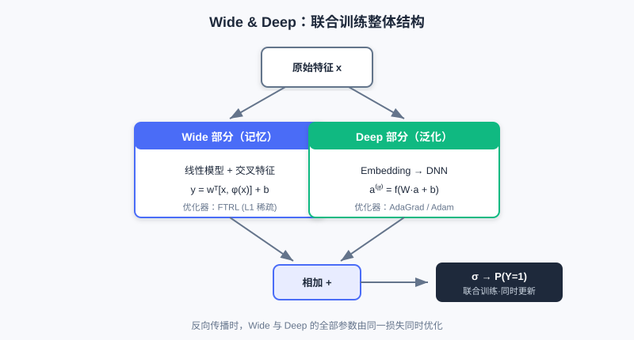

<div class="badge-row">
  <span style="background: #f0f4ff; color: #4A6CF7; padding: 4px 12px; border-radius: 20px; font-size: 0.85em; font-weight: 600; border: 1px solid rgba(74,108,247,0.2);">📖</span>
  <span style="background: #f0fdf4; color: #16a34a; padding: 4px 12px; border-radius: 20px; font-size: 0.85em; border: 1px solid rgba(22,163,74,0.2);">⏱️ ~30 min read</span>
  <span style="background: #fef9ec; color: #d97706; padding: 4px 12px; border-radius: 20px; font-size: 0.85em; border: 1px solid rgba(100,100,100,0.15);">🎯 Intermediate</span>
</div>

# Wide & Deep

> 📝 **Before You Continue:** 请先读完 [1.3 特征与 Embedding 入门](../part1-introduction/feature-embedding-basics.md)，理解 Sparse / Dense 特征与查表向量；同时建议读完 **Part 2** 的召回章节，明确“候选已就绪、排序要精准打分”的工程位置。

当你在 App 里搜索一件商品，系统给你推荐了它——这背后是排序模型在毫秒之间对成百上千个候选算出的分数。但在 2016 年之前，工业排序模型面临一个尴尬的取舍：**要么记住历史规律，要么学会归纳推广，很难两者兼得**。

Wide & Deep 模型（Google, 2016）给出了一个朴素却影响深远的答案：既然两种能力都需要，那就设计两个部分，让它们**联合训练**，各司其职。它至今仍是无数推荐业务的基线模型，也是后续所有精排深度模型的起点。读完本章，你不仅能讲清它的结构，更能理解"为什么要这样分"。

读完本章，你将能够：

- 用**一句话**区分**记忆（Memorization）**与**泛化（Generalization）**，并各举一个推荐场景的例子
- 写出 **Wide 部分**的线性公式，并说明**交叉特征（Cross-product Features）**如何体现记忆
- 解释 **Deep 部分**如何通过 Embedding + DNN 实现泛化，以及与 Wide 的本质差异
- 复述 **Wide & Deep 联合训练**的预测公式，并说明 Wide/Deep 为何常用不同优化器
- 完成 4 道分层练习题，巩固"记忆 + 泛化"的设计思想

---

## 3.1.0 一对看似矛盾的目标：记忆与泛化

构建推荐模型时，我们常常同时追求两个目标：**记忆**与**泛化**。

- **记忆能力**指模型学习并记住历史数据中频繁共同出现的特征组合。例如"买了 A 的用户通常也会买 B"。它能精准捕捉显性、高频的关联，给用户高度相关的推荐——但一旦遇到没见过的组合就无能为力。
- **泛化能力**指模型学到特征间的深层关系，能处理训练时罕见的组合。例如"物品 A 和物品 C 同类，喜欢 A 的用户也可能喜欢 C"，即使从未见过该用户与 C 的交互，也能合理推荐。

> 💡 **Key Insight:** 记忆让推荐"准"，泛化让推荐"广"。单用记忆会陷入信息茧房、无法应对新物品；单用泛化会丢失那些高价值的历史强规则。Wide & Deep 的精髓，就是**用一个模型同时拥有两种能力**。


左侧记忆路径捕捉"买 A 的人也买 B"这种高频强规则；右侧泛化路径把物品映射到向量空间，让模型能推荐未见过的相似物品（如《三体》附近的新书）。

### 🧠 Mental Model: 老员工 vs 新人

> 把 **Wide（记忆）** 想成一位在公司干了二十年的老员工：他记得每一条历史"规矩"（交叉特征），谁和谁总一起出现，门儿清。把 **Deep（泛化）** 想成一位受过系统训练的新人：他没背过所有规矩，但懂得举一反三，遇到没见过的组合也能推理。一个好团队，两者都要。

---

## 3.1.1 记忆的捷径：Wide 部分

Wide 部分本质是一个**广义线性模型**（如逻辑回归）。它结构简单、可解释性强，擅长"记忆"那些显而易见的关联规则。其数学形式如下：

$$y = \boldsymbol{w}^T \boldsymbol{x} + b$$

其中 $y$ 是预测值，$\boldsymbol{w}$ 是权重，$\boldsymbol{x}$ 是特征向量，$b$ 是偏置。

Wide 部分的关键在于输入特征 $\boldsymbol{x}$ 不仅含原始特征，更包含大量**人工设计的交叉特征（Cross-product Features）**。交叉特征把多个独立特征组合成新特征，用来捕捉特定共现模式。例如在应用商店推荐中，我们可以构造：

```
AND(installed_app=photo_editor, impression_app=filter_pack)
```

它代表"用户已装照片编辑器、且当前看到滤镜包推荐"。通过这种交叉特征，Wide 部分能直接、快速地学到"照片编辑器用户对滤镜包有更高安装意愿"这类强关联——这正是记忆能力的直接体现。


左侧原始特征（已装 App、曝光 App）经交叉函数组合成一个新特征，再查一个独立的权重表，直接"记住"这对组合的共现强度。

| 组件 | 作用 | 类比 |
|------|------|------|
| 原始特征 $\boldsymbol{x}$ | 用户/物品基础属性 | 员工档案 |
| 交叉特征 $\phi(\boldsymbol{x})$ | 人工组合的共现模式 | 老员工脑中的"规矩" |
| 权重 $\boldsymbol{w}_{wide}$ | 每个组合的强/弱记忆 | 规矩的信任程度 |

> 💡 **Key Insight:** Wide 部分"记忆"的本质，是**为每个特征组合分配一个独立权重，通过查表直接记住历史共现**。代价是这些特征需要专家手工设计，且无法泛化到未出现过的组合。

---

## 3.1.2 学习复杂关系：Deep 部分

Deep 部分是一个**标准前馈神经网络（DNN）**，负责模型的"泛化能力"。与 Wide 依赖人工特征工程不同，Deep 部分能**自动**学习特征之间的高阶、非线性关系。

它的工作流程分两步。首先，对高维稀疏的类别特征（用户 ID、物品 ID）通过 **Embedding 层** 映射为低维稠密向量——这些向量能捕捉潜在语义。例如《流浪地球》和《三体》的 ID 在嵌入空间中会比《流浪地球》和《熊出没》更近。随后，嵌入向量与其他数值特征拼接，送入多层网络前向传播：

$$a^{(l+1)} = f(W^{(l)}a^{(l)} + b^{(l)})$$

其中 $a^{(l)}$ 是第 $l$ 层激活值，$W^{(l)}$、$b^{(l)}$ 是权重与偏置，$f$ 是激活函数（如 ReLU）。逐层抽象让 DNN 能发掘隐藏的复杂模式，对未见过特征组合做出合理预测。


稀疏类别特征先经 Embedding 变为稠密向量（相似物品在向量空间靠近），再拼接数值特征送入多层 DNN，自动学到高阶非线性关系。

> **Analysis:** Deep 部分擅长泛化、自动学习特征交互，但**可解释性弱**——它学到的高阶组合难以直观解读；且对极高频率的强规则，可能不如 Wide 的显式交叉记得"牢"。复杂度主要来自深层 MLP，参数量随层宽层数增长；Embedding 查找开销小。

---

## 3.1.3 两者结合：联合训练

Wide & Deep 把两部分**联合训练（Joint Training）**，输出结合进行最终预测：

$$P(Y=1|\boldsymbol{x}) = \sigma(\boldsymbol{w}_{wide}^T[\boldsymbol{x},\phi(\boldsymbol{x})] + \boldsymbol{w}_{deep}^T a^{(lf)} + b)$$

这里 $\sigma$ 是 Sigmoid 函数，$[\boldsymbol{x}, \phi(\boldsymbol{x})]$ 是 Wide 的输入（原始 + 交叉特征），$a^{(lf)}$ 是 Deep 最后一层的输出向量。反向传播时，梯度**同时更新** Wide 和 Deep 的全部参数——这是"联合训练"，区别于分别训练再集成。

一个值得注意的工程细节：由于两部分处理的参数性质不同，通常**用不同优化器**。

- **Wide 部分**输入稀疏，常用带 L1 正则的 **FTRL** 优化器。L1 产生稀疏权重，相当于自动特征选择，只"记住"重要规则。
- **Deep 部分**参数稠密，更适合 **AdaGrad / Adam** 这类优化器。



Wide（线性 + 交叉特征）与 Deep（Embedding + DNN）共享输入，各自产出 logit，相加后经 Sigmoid 输出最终点击概率。两部分在训练时联合优化。

> 💡 **Key Insight:** Wide & Deep 的意义不止于一个新结构，更在于给出了一个**范式**——如何把"记忆"和"泛化"组合进同一个端到端模型。它成为众多精排模型的基线，也为后续章节（用 FM 替代手工交叉、用注意力替代固定用户向量）埋下伏笔。

---

## ⚠️ Common Mistakes in 3.1

| # | Mistake | Example | Why It's Wrong | Fix |
|---|---------|---------|---------------|-----|
| 1 | 把 Wide 当成"另一个小 DNN" | "Wide 和 Deep 都是神经网络，只是深浅不同" | Wide 是**线性 + 交叉特征**，靠查表记忆，不是非线性网络 | 记住：Wide=记忆（显式规则），Deep=泛化（隐式学习） |
| 2 | 认为交叉特征能自动发现 | "把原始特征丢进去就行" | 交叉特征需**专家手工设计**，Wide 不会自动组合 | 理解 Wide 的局限，这正是后续 FM/DeepFM 要解决的 |
| 3 | 混淆联合训练与集成 | "先训 Wide 再训 Deep，最后平均" | 联合训练是**同一损失、同时更新**所有参数 | 区分 Joint Training（端到端）与 Ensemble（分别训练） |
| 4 | 忽略优化器差异 | "两部分用同一个 Adam 就行" | Wide 稀疏适合 FTRL（L1 稀疏化），Deep 稠密适合 AdaGrad | 按参数性质选优化器：稀疏→FTRL，稠密→AdaGrad/Adam |

---

## 本章小结

### 📌 Key Takeaways

| Concept | Key Points | Why It Matters |
|---------|-----------|----------------|
| 记忆 vs 泛化 | Wide 记高频规则，Deep 学归纳推广 | 排序模型需两种能力兼得 |
| Wide 部分 | $y=\boldsymbol{w}^T\boldsymbol{x}+b$，靠交叉特征查表记忆 | 可解释、强关联精准，但需人工设计、不泛化 |
| Deep 部分 | Embedding + DNN 自动学高阶非线性 | 泛化强、免手工，但可解释弱 |
| 联合训练 | $P=\sigma(w_{wide}^T[\boldsymbol{x},\phi]+w_{deep}^T a^{(lf)}+b)$ | 端到端同时优化两部分，奠定精排范式 |
| 优化器分治 | Wide→FTRL(L1)，Deep→AdaGrad/Adam | 匹配稀疏/稠密参数性质 |

### ❓ FAQ

**Q1: 既然 Deep 这么强，能不能只用 Deep 不要 Wide？**
> A: 纯 Deep 在高频强规则上往往"记不牢"——它把规则隐式编码进权重，不像 Wide 直接查表。对历史高频共现，显式记忆更稳定、更可解释。因此保留 Wide 仍有价值。

**Q2: 交叉特征一定要人工设计吗？**
> A: Wide 部分的交叉特征是人工的，这正是它的短板。后续 3.2 节的 FM / DeepFM 正是为了**自动**学习特征交叉、摆脱人工特征工程而提出的。

**Q3: 联合训练为什么比"先训 Wide、再训 Deep"好？**
> A: 联合训练用**同一个损失**同时更新两部分，Wide 和 Deep 在训练中互相校准；分别训练再集成（ensemble）是两个独立模型，无法端到端协同优化。

### 前后关联

- **3.2（特征交叉）** 用 FM 自动替代 Wide 的手工交叉特征，演进到 DeepFM 共享 Embedding。
- **3.3（序列建模）** 进一步突破"固定用户向量"，引入注意力动态激活历史。
- **3.4（多目标）** 在 Wide&Deep 的"双塔/共享底座"思想上扩展为多任务共享结构。
- **Part 2 召回** 中 FM 的双塔用法，与本章 FM 用于交叉是同一技术的两条脉络。

---

## Practice Problems

Work through all problems in order — they get progressively harder. Each has a complete solution you can reveal after trying it yourself.

---

**Problem 3.1.1 — 区分记忆与泛化** 🟢 Easy

判断下列推荐行为主要依赖"记忆"还是"泛化"，并说明理由：

- (a) 系统向"昨天刚买婴儿奶粉"的用户，再次推荐同品牌奶粉 —— 因为历史数据里"买过奶粉的人 7 天内复购同款"频率极高。
- (b) 系统向喜欢《三体》的用户，推荐了一本他从未见过、但与《三体》同属"硬科幻"标签的新书。

<details>
<summary>💡 Solution (click to reveal)</summary>

**Approach:** 看该行为是"记住历史高频共现"（记忆）还是"归纳推广到未见组合"（泛化）。

- **(a) 记忆**：依赖"买奶粉→短期内复购同款"这种高频历史规则，是显式共现的直接套用，正是 Wide 部分做的事。
- **(b) 泛化**：用户从未见过这本新书，模型靠"硬科幻"语义相似（Embedding 空间邻近）做归纳推广，是 Deep 部分的能力。

**Key points:**
- 记忆 = 高频共现的直接复用；泛化 = 未见组合的归纳推理。
- 两者互补，Wide & Deep 同时拥有。

</details>

---

**Problem 3.1.2 — 补全交叉特征** 🟢 Easy

某外卖 App 想用 Wide 部分记忆一类强规则："在工作日中午（12:00–14:00）浏览过快餐的用户，更可能点击下午茶优惠券"。请用 `AND(...)` 形式写出对应的交叉特征。

<details>
<summary>💡 Solution (click to reveal)</summary>

**Approach:** 交叉特征把多个独立特征组合成一个新布尔特征，捕捉共现。

```
AND(time_slot=weekday_lunch, browse_cate=fast_food, impression=afternoon_tea_coupon)
```

**Key points:**
- 交叉特征是**人工设计**的，需专家定义哪些组合有意义。
- 这正是 Wide 部分的短板，也是后续 FM 想自动化的对象。

</details>

---

**Problem 3.1.3 — 联合训练公式** 🟡 Medium

Wide & Deep 的最终预测为 $P(Y=1|\boldsymbol{x}) = \sigma(\boldsymbol{w}_{wide}^T[\boldsymbol{x},\phi(\boldsymbol{x})] + \boldsymbol{w}_{deep}^T a^{(lf)} + b)$。请回答：

1. 公式中 $[\boldsymbol{x},\phi(\boldsymbol{x})]$ 与 $a^{(lf)}$ 分别来自哪一部分？
2. 为什么 Wide 和 Deep 通常用不同优化器？各举一个。

<details>
<summary>💡 Solution (click to reveal)</summary>

**Approach:** 对照 3.1.3 的联合训练公式与优化器分工。

1. $[\boldsymbol{x},\phi(\boldsymbol{x})]$ 是 **Wide 部分**的输入（原始特征 + 交叉特征）；$a^{(lf)}$ 是 **Deep 部分**最后一层隐藏层的输出向量。
2. 两部分参数性质不同：Wide 输入**稀疏**（大量 0/1 交叉特征），用 **FTRL**（L1 正则产生稀疏权重，自动特征选择）更合适；Deep 参数**稠密**，用 **AdaGrad / Adam** 收敛更稳。

**Key points:**
- 联合训练 = 同一损失、同时更新两部分参数。
- 优化器按"稀疏 vs 稠密"分治，是工程经验而非理论强制。

</details>

---

**Problem 3.1.4 — 新组合下的记忆失效** 🔴 Hard

Wide&Deep 输出 $P=\sigma(w_{wide}^T[x,\phi]+w_{deep}^T a^{(lf)}+b)$。假设线上出现一个**全新特征组合** $(a,b)$（两个高基数 ID 的交叉），训练集中从未出现。请分析：(1) Wide 部分对此组合贡献什么；(2) Deep 部分能否给出非零泛化；(3) 若要提升该组合的预估质量，改 Wide 还是 Deep 更划算？

<details>
<summary>💡 Solution (click to reveal)</summary>

**Approach:** 分别看两部分对"未见过组合"的行为。

1. Wide 的交叉特征 $(a,b)$ 在训练中无共现，其查表权重 $w_{ab}\approx 0$（或随机初始化未更新），故 Wide 对此组合**几乎没有记忆信号**，只剩一阶线性项。
2. Deep 部分中 $a,b$ 的 Embedding 各自通过与其他特征共现学好，DNN 可借语义邻近给出**非零泛化**预估。
3. 该组合属"未见过"，应优先靠 **Deep（泛化）** 兜底；若它高频重要、值得显式记忆，再补 Wide 交叉特征。改 Wide 对新组合无效（查不到权重），故 Deep 更划算。

**Key points:**
- 记忆失效 = 查表权重未学；泛化兜底 = Embedding 语义。
- 印证"记忆+泛化互补"，也点出 Wide 手工交叉的冷启动短板。

</details>

---

**🏆 Challenge: 设计取舍论证**

假设你负责一个日活千万电商的精排，业务方要求"既要抓住历史高频爆款组合，又要给新上架长尾商品机会"。请用不超过 150 字，论证 Wide & Deep 是否合适，并指出若只用其中一半会损失什么。

<details>
<summary>💡 Hint</summary>

Wide 抓高频爆款（记忆），Deep 给长尾新物品泛化机会；只留 Wide 会困于信息茧房、冷启动差，只留 Deep 会"记不牢"强规则、可解释弱。论证围绕"两种能力缺一不可"展开。

</details>
