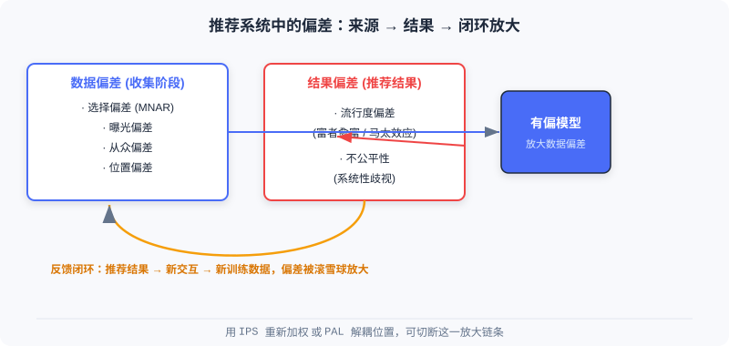
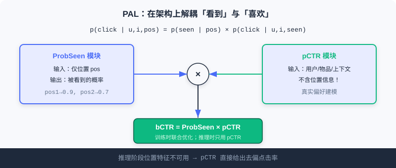

  📖
  ⏱️ ~28 min read
  🎯 Intermediate

# 模型去偏

> 📝 **Before You Continue:** 请先读完 [1.1](./../part1-introduction/what-is-recommender.md) 的两种范式与三阶段漏斗，以及 [Part 3 排序](./../part3-ranking/) 的打分函数 $f$。本章要在这些「理想假设」上加一层现实校正：你用来训练模型的数据，本身并不干净。

当你准备用海量交互数据训练一个推荐模型时，有一个温柔却致命的错觉：**「数据越多，模型越准」**。真实推荐系统的数据来自用户在产品里的自由行为，而不是实验室的受控实验。用户的点击、评分、停留，都受到系统自己怎么展示、用户自己什么习惯、物品本身多热门等无数因素的影响。

更微妙的是，推荐系统存在一个**反馈闭环**：今天的推荐决定用户明天看到什么，用户明天的点击又变成后天训练模型的样本。这个环一旦转起来，初始的一点点偏差会被像滚雪球一样不断放大。本章就带你认识这些偏差，并给出两套经得起因果推断检验的纠偏工具——**IPS** 与 **PAL**。

读完本章，你将能够：

- **区分**数据偏差（选择/曝光/从众/位置）与结果偏差（流行度/不公平）两类来源
- **解释**反馈闭环如何把微小偏差放大成「推荐单一化」的马太效应
- **写出**IPS 估计量，说清它为什么是真实风险的无偏估计，以及权重爆炸时如何截断
- **用 PAL** 的双模块架构，在结构上把「看到」与「喜欢」解耦
- 完成 4 道分层练习题，巩固纠偏的数学与工程直觉

---

## 5.1.0 数据天生有偏：反馈闭环的陷阱

要理解偏差，先要接受一个事实：**我们观测到的交互，不等于用户的真实偏好**。实验室里你可以随机给用户展示任意物品并记录反应，但工业系统里，用户只能看到系统「选择」展示给他的那部分内容。

推荐系统的偏差按产生阶段可分成两大类：

- **数据偏差**：发生在**数据收集阶段**，是后续一切问题的根。模型看到的就是「被系统筛选过的世界」。
- **结果偏差**：体现在**推荐结果**里，是数据偏差经过模型训练后「加工并放大」的产物。

两者之间并非孤立，而是通过反馈闭环互相喂养。热门物品被推荐得多 → 获得更多交互 → 在下一轮训练数据中占比更大 → 模型更偏向它。这就是「富者愈富」的马太效应。

上图把「数据偏差 → 结果偏差 → 反馈闭环」串成一条链：有偏模型既是偏差的产物，又反过来生产更偏的数据。

> 💡 **Key Insight:** 偏看到的不等于偏好的。纠偏的本质，不是「多喂数据」，而是**重新理解数据背后的生成机制**——这正是 IPS 与 PAL 共同的出发点。

---

## 5.1.1 数据偏差：收集阶段埋下的种子

数据偏差有四种典型面孔，它们分别来自用户习惯、系统曝光策略与社会心理。

**选择偏差（Selection Bias）** 出现在显式反馈（评分）场景。用户倾向于只给**自己感兴趣**的内容打分，于是我们观测到的评分并不能代表他对所有物品的真实态度。大量中性或负面的潜在评分根本没被记录——研究称之为**非随机缺失（MNAR, Missing Not At Random）**。它会让模型**高估用户的整体满意度**。

**曝光偏差（Exposure Bias）** 是隐式反馈（点击/观看）的核心挑战。用户只能看到系统推荐给他的物品；那些没交互的物品有两种可能：要么真不感兴趣（真负样本），要么**压根没见过**（潜在正样本）。若朴素地把所有「没交互」都当负样本，模型就会学到错误的偏好——长尾物品受害最深，因为它们本就缺乏曝光机会。

**从众偏差（Conformity Bias）** 来自社会心理学的群体效应。当用户看到某商品海量好评，常常为了寻求群体认同而附和给出正面评价；反之亦然。于是收集到的反馈未必是用户独立、真实的偏好，而是被舆论热度污染过的表达。

**位置偏差（Position Bias）** 在列表推荐中格外明显。用户天然更关注排在**前面**的物品，无论相关性如何。数据显示点击率随位置下降而急剧衰减——「点击」这件事，既反映偏好，也强烈受位置摆布。

### 🧠 Mental Model: 带滤镜的望远镜

> 把训练数据想成一台**自带滤镜的望远镜**。你透过它观察宇宙（用户真实偏好），但滤镜只让「系统展示过的、用户凑巧点了的、位置靠前的、大家都说好的」那部分光线通过。你看到的星图越密，不代表那片天区星星真的越多——可能只是滤镜bias。纠偏，就是给望远镜**校准滤镜**。

> **Analysis:** 这四类偏差并非都需要同样处理。选择/曝光偏差本质是「观测概率不均」，适合用 **IPS 加权**在损失层面补偿；位置偏差则有清晰的结构——它只影响「看没看到」，所以用 **PAL** 在架构层面解耦更干净。先判断偏差类型，再选工具。

---

## 5.1.2 结果偏差：模型把偏差「学」了进去

当上述有偏数据流经模型，偏差不会消失，反而常常被强化并体现在结果里。

**流行度偏差（Popularity Bias）** 是最常见的结果偏差。热门物品贡献了训练数据里绝大多数交互，模型学到「推热门就能拿点击」的惯性，结果推荐频率甚至**超过物品本身的流行度**。这既稀释了个性化，也让长尾物品彻底失去被发现的机会。

**不公平性（Unfairness）** 指系统对某些用户群体或物品类别产生**系统性歧视**。若历史数据里某群体长期拿到劣质推荐，模型会学习并延续这种偏见，在未来的推荐中持续不公。

> ⚠️ **Warning:** 流行度偏差与反馈闭环是「共生」的。热门物品因曝光多而交互多，在下一轮数据里占比更大，进一步推高流行度偏差——除非在模型或训练环节主动切断这条链，否则它会持续恶化到推荐极度单一化。

---

## 5.1.3 用逆倾向得分（IPS）纠正选择偏差

**逆倾向得分（Inverse Propensity Score, IPS）** 源自因果推断。它把推荐系统里的「物品展示」看作一种**干预（Intervention）**，通过重新加权来消除选择偏差。

核心思想非常直觉：一个样本如果**本来就很容易被观测到**（比如热门商品、排首位的物品），它在训练中的贡献应当被适当压低；反之，一个样本**很难被观测到**、却被用户发现并产生交互（比如长尾商品、低位置物品），那它很可能携带更强的真实偏好信号，应当获得更高权重。

**倾向得分（Propensity Score）** 是关键概念，定义为用户 $u$ 与物品 $i$ 的交互被观测到的概率 $P(O_{u,i}=1)$。IPS 的核心操作就是用它的**倒数**作权重，实现「逆向加权」：高倾向得分 → 低权重，低倾向得分 → 高权重。

### 一个具体例子

考虑一个电影推荐系统，有两类用户：恐怖片爱好者与爱情片爱好者。恐怖片爱好者**很少**主动给爱情片评分（观测概率 $P=0.1$），但偶尔评了往往给真实低分（1–2 分）；他们**频繁**给恐怖片评分（$P=0.8$）并给高分（4–5 分）。

若用朴素方法直接统计观测数据，会发现恐怖片平均评分远高于爱情片，误导模型高估两类电影的偏好差距。但用 IPS 加权后：罕见的「恐怖迷给爱情片低分」获得 $1/0.1=10$ 倍权重，常见的「恐怖迷给恐怖片高分」只获 $1/0.8=1.25$ 倍权重——模型便能更准确地还原真实偏好分布。

右侧 IPS 加权把「来之不易」的少数低分样本放大，把「唾手可得」的高分样本压低，最终逼近真实差距。

### 🧠 Mental Model: 给稀有样本发「加权券」

> 想象你在做民意调查，但只有爱说话的人愿意接受采访，沉默者极少发声。若直接按采访人数统计，沉默群体的意见就被淹没了。IPS 相当于给**每一位沉默受访者的发言**发一张 10 倍权重的「加权券」——让他们的声音按真实人口比例被听见。

### IPS 的数学原理

传统评估方法直接在观测数据上计算平均损失：

$$\hat{R}_{naive}(\hat{Y}) = \frac{1}{|D_O|} \sum_{(u,i) \in D_O} \delta_{u,i}(Y, \hat{Y})$$

其中 $D_O=\{(u,i):O_{ui}=1\}$ 是观测数据集，$Y$ 是真实评分，$\hat{Y}$ 是预测评分，$\delta_{u,i}$ 是损失或评价指标。当选择偏差存在时，$\mathbb{E}_{O}[\hat{R}_{naive}(\hat{Y})] \neq R(\hat{Y})$——朴素估计量**有偏**。

IPS 估计量引入倾向得分加权：

$$\hat{R}_{IPS}(\hat{Y}) = \frac{1}{|U||I|} \sum_{(u,i) \in D_O} \frac{1}{P(O_{ui}=1)} \delta_{u,i}(Y, \hat{Y})$$

可以证明它是真实风险的无偏估计：$\mathbb{E}_{O}[\hat{R}_{IPS}(\hat{Y}|P)] = R(\hat{Y})$。

IPS 不仅能用于评估，也能直接用于训练。矩阵分解的传统目标：

$$\arg\min_{U,V} \sum_{(u,i) \in D_O} \big(Y_{u,i} - (u_u^T v_i + a_u + b_i + c)\big)^2 + \lambda(\|U\|^2 + \|V\|^2)$$

加入 IPS 权重后只是把每个样本的损失乘上 $1/P(O_{ui}=1)$：

$$\arg\min_{U,V} \sum_{(u,i) \in D_O} \frac{1}{P(O_{ui}=1)} \big(Y_{u,i} - (u_u^T v_i + a_u + b_i + c)\big)^2 + \lambda(\|U\|^2 + \|V\|^2)$$

改动极小，却可无缝集成进现有优化器。

> ⚠️ **Warning:** 当某些样本倾向得分极小（如 $P=0.01$），其倒数会大到 $100$ 倍，导致估计方差爆炸、训练不稳定。工程上通常对权重做**截断（clipping）或归一化**来缓解——在「无偏」与「低方差」之间取折中。

### 倾向得分怎么来：估计而非已知

IPS 的关键挑战是倾向得分通常未知，需额外模型估计。**朴素贝叶斯方法**假设观测概率只与评分值相关（如 5 分被观测到的概率远高于 1 分）；**逻辑回归方法**则利用用户/物品特征建立「是否被观测」的分类模型，捕捉更复杂的观测模式，估计更准。

### 如何验证纠偏真的有效：半合成实验

一个经典做法是**半合成实验**，既保留真实数据的复杂性，又允许我们控制偏差严重程度：

1. **构建真实评分矩阵**：用 MovieLens 100K（94.4 万条评分，但矩阵仅 6% 有值），以矩阵分解补全为完整 $R_{true}$ 作为 ground truth。
2. **设计偏差模型**：对评分为 $r$ 的用户-物品对，若 $r \ge 4$ 观测概率为 $k$（基础概率）；若 $r<4$ 则为 $k \times \alpha^{4-r}$（递减）。$\alpha=1$ 无偏差，$\alpha$ 越小偏差越重；$k$ 调至总体观测率约 5% 模拟稀疏。
3. **生成有偏观测数据**：按概率随机决定是否观测，得到含偏训练集。
4. **比较估计量**：真实 MAE 在 $R_{true}$ 上计算；朴素估计量直接在观测数据上算平均误差；IPS 用 $1/P(观测)$ 作权重算加权平均误差。

实验显示，当 $\alpha=0.25$ 时，IPS 估计量的误差比朴素估计量**小 2–3 个数量级**。这种「已知答案」的测试环境，让不同纠偏方法的效果可被精确量化，成为验证纠偏的标准做法。

下面用交互演示直观感受「朴素 → IPS」的差距还原过程：

<iframe src="../viz/part5-ips.html?embed&vizId=part5-ips" style="width:100%; height:520px; border:none; display:block;" loading="lazy"></iframe>

点击「下一步」或「自动播放」，观察恐怖片与爱情片的观测均分如何从「朴素掩盖差距」逐步变成「IPS 还原真实差距」。

> **Analysis:** IPS 的优势在**简洁与通用**——一行权重改动就能嵌入任意推荐模型，且有无偏性的理论保证。但它的代价是**方差**：权重越极端，训练越抖动，所以生产环境几乎总要配合截断。此外，IPS 只补偿「观测概率不均」类偏差（选择/曝光），对位置偏差这类结构化问题并非最优解——那需要 PAL。

---

## 5.1.4 用 PAL 解耦位置偏差与用户偏好

当用户刷手机时，是否会更容易点排在前面的内容？答案是肯定的。位置偏差看似简单，却给系统设计出了道难题：位置在**训练时可知，推理时不可知**——线上你没法预先知道一个新候选会被摆在哪个坑位。

**位置感知学习（Position-bias Aware Learning, PAL）** 的妙处，不是像 IPS 那样重新加权数据，而是**重新设计模型架构**，把位置影响与真实偏好在结构层面强行分开。

PAL 的关键洞察是：用户点击一个物品，其实包含两个**连续事件**——用户先得「看到」它，然后才「决定是否点击」。而位置主要影响的是「看到」的概率，不是「喜欢」的程度。据此把点击概率在数学上分解：

$$p(click|user, item, position) = p(seen|position) \times p(click|user, item, seen)$$

这个分解基于两个合理假设：① 用户看到物品的概率主要由位置决定，与内容关系不大；② 看到之后是否点击，主要由用户偏好决定，与位置关系不大。

### 双模块架构

基于上述分解，PAL 设计两个模块，在架构层面强制实现这种分离：

- **ProbSeen 模块**：只输入**位置**信息，输出该位置被用户看到的概率（如位置 1 可见性 0.9、位置 2 为 0.7、位置 3 为 0.5）。可以用简单查找表，也可以用浅层网络。
- **pCTR 模块**：输入用户特征、物品特征、上下文，但**完全不含位置信息**，用 DeepFM 等复杂深度模型学习真实偏好。

离线训练时，两模块输出相乘得到最终点击率预测：

$$bCTR = ProbSeen(position) \times pCTR(user, item, context)$$

预测值再与真实标签算损失，**反向传播同时优化两个模块**。

### 训练与推理的分离机制

PAL 的核心技巧在于**训练与推理用不同模块组合**：

- **训练时**：两模块联合优化。模型自动学会分配责任——位置靠前的物品被点击，一部分功劳归位置效应（ProbSeen），一部分归内容质量（pCTR）。这避免了我们需事先知道每个样本「看到概率」的困难。
- **推理时**：只使用 **pCTR 模块**。由于它在训练时就被设计为不依赖位置，能直接给出**消除位置偏差**的点击率预测。推理时根本不需要为位置特征假设一个值。

> 💡 **Key Insight:** PAL 的本质是**信息分离**——位置相关信息被 ProbSeen 处理，内容相关信息被 pCTR 保留；推理时只取后者，自然得到去偏偏好。它巧妙绕开了「位置推理时不可用」的根本矛盾。

### 🧠 Mental Model: 把「灯亮」和「菜香」分开

> 想象餐馆把招牌菜摆在最亮的灯下（位置好），你点了它，可能因为菜真的香，也可能只是因为灯太亮先看见了。PAL 的做法是：用一个专人记录「每个灯位被看见的概率」（ProbSeen），再用另一个专人纯粹评价「菜本身好不好吃」（pCTR）。最后打分时两者相乘；但当你问「这菜到底香不香」时，只问后者——灯的位置不再干扰判断。

> **Analysis:** IPS 与 PAL 代表了两条纠偏路线：**通用数据加权**（IPS，改损失）vs **专门结构设计**（PAL，改架构）。IPS 灵活但受方差困扰、对位置偏差不直接；PAL 精准处理位置、训练推理分离优雅，但只解耦单一偏差源。实践中二者可叠加——先 IPS 补偿观测偏差，再 PAL 处理位置。无论哪种，前提都是**先理解偏差的产生机制**，而非盲目拟合。

---

## ⚠️ Common Mistakes in 5.1

| # | Mistake | Example | Why It's Wrong | Fix |
|---|---------|---------|---------------|-----|
| 1 | 把「没交互」当「负样本」 | 长尾物品无点击，直接标 0 参与训练 | 没交互可能是没曝光（潜在正样本），朴素标负引入曝光偏差 | 用 IPS/曝光模型校正观测概率 |
| 2 | 以为 IPS 越极端越好 | 不截断权重，小倾向得分样本权重上千倍 | 方差爆炸，训练发散不稳定 | 对权重截断/归一化，平衡无偏与低方差 |
| 3 | 把 PAL 的 pCTR 当普通 CTR | 推理时仍把位置特征塞进 pCTR | pCTR 设计上不含位置，塞位置会重新引入位置偏差 | 推理只用 pCTR，位置留给 ProbSeen |
| 4 | 忽略反馈闭环 | 纠偏一次就以为万事大吉 | 闭环会持续放大残留偏差，单一措施不够 | 多环节（数据+模型）持续纠偏，监控马太效应 |
| 5 | 混淆两类偏差解法 | 用 IPS 处理位置偏差 | IPS 补偿观测不均，对结构化位置偏差不对症 | 位置偏差优先用 PAL 解耦 |

---

## 本章小结

### 📌 Key Takeaways

| Concept | Key Points | Why It Matters |
|---------|-----------|----------------|
| 数据偏差 | 选择/曝光/从众/位置，收集阶段产生 | 一切结果偏差的根，需用对工具 |
| 结果偏差 | 流行度/不公平，经模型放大 | 直接伤害个性化与公平性 |
| 反馈闭环 | 推荐→交互→训练 互相喂养 | 不切断会让偏差雪球式恶化 |
| IPS | $w=1/P(观测)$，无偏但高方差 | 通用纠偏，需截断稳定 |
| PAL | 分解 $p(click)=p(seen)\times p(click\|seen)$ | 结构上解耦位置与偏好，推理只用 pCTR |

### ❓ FAQ

**Q1: 既然数据有偏，为什么不干脆多采集无偏数据？**
> A: 工业环境无法像实验那样随机曝光（会严重伤害用户体验与指标）。只能在「观测到的有偏数据」上做纠偏，IPS/PAL 正是为这种受限场景设计。

**Q2: IPS 和 PAL 该用哪个？**
> A: 偏差来自「观测概率不均」（选择/曝光）优先 IPS；偏差是结构化的位置效应优先 PAL。二者也可叠加，分别处理不同偏差源。

**Q3: 为什么 PAL 训练要联合优化两个模块？**
> A: 因为没人预先知道每个样本的「真实看到概率」和「看到后点击概率」。联合训练让模型自己学会如何在这两件事间分配责任，免去人工标注位置标签。

### 前后关联

- **5.2**（冷启动）偏差与冷启动常叠加：新物品曝光少，更易被流行度偏差淹没，去偏与冷启动需协同。
- **5.3**（生成式范式）端到端生成用单一模型统一优化，天然弱化级联架构带来的目标不一致偏差。
- **Part 3 排序**（Ch3.x）打分函数 $f$ 是 IPS/PAL 最直接的作用对象——纠偏多在损失或 CTR 模块落地。

---

## Practice Problems

Work through all problems in order — they get progressively harder. Each has a complete solution you can reveal after trying it yourself.

---

**Problem 5.1.1 — 偏差分类** 🟢 Easy

下面四个场景分别属于「数据偏差」中的哪一类（选择/曝光/从众/位置）？

- (a) 用户只对喜欢的视频打星标，差评从不标记。
- (b) 新上架的小众纪录片几乎没被推荐过，自然没什么播放。
- (c) 某商品有上万条好评，用户跟风给了 5 星。
- (d) 排在第 1 位的普通内容比第 8 位优质内容点击率高 3 倍。

💡 Solution (click to reveal)

**Approach:** 对照四类数据偏差的定义，看偏差来自「用户习惯 / 系统曝光 / 群体心理 / 列表位置」哪一种。

- (a) **选择偏差**（MNAR）：用户只评分感兴趣内容，中性/负面评分未被记录。
- (b) **曝光偏差**：无播放可能源于没被展示（潜在正样本），而非真不感兴趣。
- (c) **从众偏差**：评分被群体热度舆论影响，非独立真实偏好。
- (d) **位置偏差**：点击受排名位置强烈影响，与内容相关性无关。

**Key points:**
- 先判断偏差「发生在哪个环节」，再归类。
- (b) 与流行度偏差不同：流行度是**结果**，曝光是**数据收集**阶段的因。

---

**Problem 5.1.2 — 计算 IPS 权重** 🟢 Easy

某用户-物品对观测概率 $P(O=1)=0.2$。请写出它在 IPS 下的权重 $w$，并说明若朴素方法把它当普通样本（权重 1）会怎样。

💡 Solution (click to reveal)

**Approach:** 直接套用 IPS 权重公式 $w = 1/P(O=1)$。

$$w = \frac{1}{0.2} = 5$$

该样本获得 **5 倍权重**。若朴素方法给权重 1，则这一个「难得被观测到的交互」只按 1 份贡献计算，其携带的强偏好信号被低估——尤其当大多数样本 $P$ 接近 1 时，这个稀有样本的真实信息几乎被淹没。

**Key points:**
- 低倾向得分 → 高权重（逆向加权）。
- IPS 的目标不是「平等对待每个样本」，而是「按观测难易还原真实分布」。

---

**Problem 5.1.3 — 解释无偏性为什么成立** 🟡 Medium

证明 $\mathbb{E}_{O}[\hat{R}_{IPS}(\hat{Y}|P)] = R(\hat{Y})$ 的核心思路是什么？为什么朴素估计量 $\hat{R}_{naive}$ 做不到？并说明生产环境为何通常还要截断 IPS 权重。

💡 Solution (click to reveal)

**Approach:** 从「期望值校正观测分布」的角度理解。

**无偏性思路：** 观测数据 $D_O$ 的分布由观测概率 $P(O=1)$ 扭曲。IPS 用 $1/P$ 作权重，恰好把「被过度采样的样本」调低、「被欠采样的样本」调高，使加权的经验分布**重新对齐到真实分布**。于是期望上 $\hat{R}_{IPS}$ 等于在全部 $(u,i)$ 上的真实风险 $R$。

**朴素估计量为何失败：** $\hat{R}_{naive}$ 直接在扭曲的观测分布上平均，等价于用 $P(O=1)$ 本身作权重（隐式），期望天然偏离 $R(\hat{Y})$。

**为何截断：** 当某些 $P(O=1)$ 极小（如 0.01），倒数达 100，单个样本就能把梯度剧烈拉偏，估计**方差爆炸**、训练不稳定。截断（如 $w\leftarrow\min(w, c)$）或归一化在「无偏」与「低方差」间取折中，是有偏-方差权衡的工程必需。

**Key points:**
- IPS 用倒数权重「反扭曲」观测分布 → 期望对齐真实分布。
- 理论无偏 ≠ 实践稳定，故需截断控方差。

---

**Problem 5.1.4 — 设计一个 PAL 改造** 🔴 Hard

你负责的排序模型用一个 DeepFM 预测点击率，训练时把「展示位置」作为特征之一。上线后发现：排在前面的低质内容点击率被高估。请说明如何用 PAL 思路改造，并指出改造后**训练和推理**分别该用哪些模块、位置特征放哪。

💡 Solution (click to reveal)

**Approach:** 按 PAL 的「分解 + 双模块 + 训练推理分离」三步改造。

1. **分解**：把现有 CTR 拆成 $p(click)=p(seen|pos)\times p(click|u,i,seen)$。
2. **双模块**：新增轻量的 **ProbSeen** 模块，仅输入位置，输出「被看到的概率」；原 DeepFM 改造为 **pCTR** 模块，**移除其中的位置特征**，只保留用户/物品/上下文。训练时两者输出相乘得 $bCTR$ 再算损失。
3. **分离**：
   - **训练时**：联合优化 ProbSeen 与 pCTR，让模型自学习责任分配。
   - **推理时**：**只用 pCTR**（不含位置），位置特征完全不进入 pCTR，也不需为位置假设值——pCTR 直接给出去偏点击率。位置信息只在训练期的 ProbSeen 里使用。

这样，排在前面的低质内容不再因「灯太亮」被高估——它的 pCTR 只反映内容本身的真实吸引力。

**Key points:**
- 位置特征从 pCTR 中**剥离**，交给 ProbSeen。
- 推理只用 pCTR，是 PAL 解决「位置推理时不可用」的关键。

---

**🏆 Challenge: 偏差叠加的攻防推演**

假设一个短视频 App：新创作者内容（长尾）曝光极少，且系统默认把高热内容排前面。请写一段 200 字内的分析，说明**反馈闭环**如何在此同时放大「流行度偏差」与「位置偏差」，并给出至少两种可叠加的纠偏手段及其分别针对哪种偏差。

💡 Hint

闭环逻辑：高热内容排前 → 点击多 → 训练样本更多 → 模型更推高热 → 长尾更无曝光。流行度偏差由「交互分布倾斜」放大，可用 **IPS**（按曝光/观测概率加权）补偿；位置偏差由「排名摆位」引入，可用 **PAL** 把位置效应从 pCTR 解耦。两者叠加分别打在不同偏差源上；同时监控马太效应，避免单一措施被闭环抵消。

