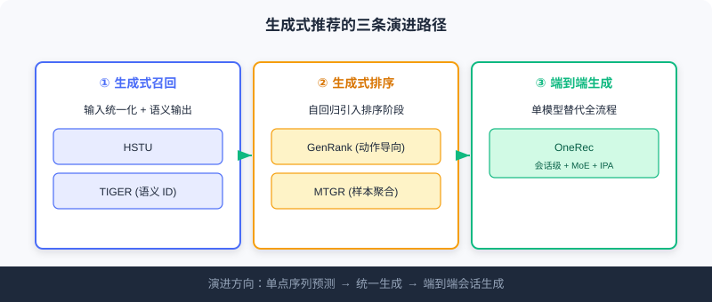
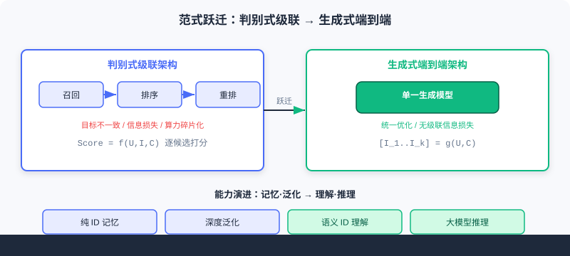

  📖
  ⏱️ ~32 min read
  🎯 Advanced

# 生成式范式演进

> 📝 **Before You Continue:** 请先读完 [1.1](./../part1-introduction/what-is-recommender.md) 的两种范式与能力演进四阶段，以及 [5.2](./cold-start.md) 的语义/冷启动基础。本章是 Part 1 双范式的「落地版」——把抽象概念变成具体模型。

在 [1.1](./../part1-introduction/what-is-recommender.md) 里我们埋下一根线：推荐能从「判别式打分」转向「生成式序列生成」，就像把自然语言当成一种特殊「语言」来理解和产出。本篇前几章沿着判别式三阶段流水线走完了工业实践；现在，是时候回到这根线，看清**生成式范式如何具体演进**。

它的核心是对三个要素的重新设计：**输入如何组织**（从物品 ID 序列到异构事件流）、**输出生成什么**（从原子 ID 到语义化表示）、**目标与架构如何取舍**（表达能力 vs 计算效率）。沿这三问，生成式推荐走出三条清晰路径——**生成式召回、生成式排序、端到端统一生成**。

读完本章，你将能够：

- **串起**「记忆·泛化 → 理解·推理」的能力跃迁，并对照 Part 1 的两种范式
- **解释**HSTU 如何把异构信息统一为事件流、TIGER 如何用语义 ID 重塑输出
- **区分**生成式排序（GenRank / MTGR）与判别式排序的本质不同
- **描述**OneRec 端到端生成的四项关键创新，尤其迭代偏好对齐（IPA）
- 完成 4 道分层练习题，巩固从范式到模型的映射

---

## 5.3.0 从「择优」到「创作」：一次范式跃迁

回头看 Part 1 的两条主线：判别式问「用户会喜欢这个候选吗？」——**择优**；生成式问「用户接下来想看什么？」——**创作**。生成式召回（如 SASRec）已验证：把用户行为序列当「语言」，自回归预测下一个物品是可行的。

但真正的变化不止于「换成生成目标」，而是系统性地重塑输入、输出与架构。下表对照三条路径各自的着力点：

| 路径 | 重塑的要素 | 代表模型 |
|------|------------|----------|
| 生成式召回 | 输入统一化 + 输出语义化 | HSTU、TIGER |
| 生成式排序 | 把自回归引入排序阶段 | GenRank、MTGR |
| 端到端统一生成 | 单模型替代召回到排序全流程 | OneRec |

> 💡 **Key Insight:** 这三条路径不是互相替代，而是**层层递进**——先在召回上证明生成可行，再把生成思想推进排序，最后用一个模型吞掉整条流水线。每一步都在回答「输入/输出/架构」中的某一问。

---

## 5.3.1 生成式召回的深化：重做输入与输出

生成式召回在 SASRec 基础上沿两个方向深化：**HSTU** 代表对「输入」理解的深化，**TIGER** 代表对「输出」定义的根本重塑。

### HSTU：把一切统一为事件流

**HSTU** 不再满足于简单的物品 ID 序列，而是把用户所有异构信息——属性、行为类型、时间戳——**统一编码为一个复杂「事件流」**。它学习条件分布 $p(\Phi_{i+1}|u_i)$，其中 $u_i$ 是用户当前时刻的综合表示，$\Phi_{i+1}$ 是下一个候选物品。

两项技术创新尤其关键：

1. **特征统一化处理**：类别特征按时间戳拉平成统一序列，如 `[(特征:年龄,值:30), (行为:登录), (行为:浏览,物品:A)]`；数值特征则隐式建模让模型自动推断。
2. **点向聚合机制**：摒弃传统 Transformer 的 softmax 归一化，改用点向聚合 $A(X)V(X) = \phi_2(Q(X)K(X)^T + \text{rab}^{p,t})V(X)$。动机是：推荐中用户兴趣的**「强度」是关键信号**，而 softmax 会强制把所有历史注意权重归一化，扭曲真实偏好强度。

HSTU 还通过切换预测目标与训练头，可从召回转换为排序任务——体现了生成式架构的灵活性。

### 🧠 Mental Model: 从「流水账」到「事件流」

> 判别式把用户历史当作「候选物品清单」逐个打分；HSTU 则把它当成一部**带时间戳、带行为类型、带上下文的「生活流水账」**。它不把「浏览 A」「登录」「年龄 30」割裂，而是按时间串成一串事件，模型由此读到「强度」与「顺序」的完整信息——就像你读朋友的日记，比只看他的购物小票更懂他。

### TIGER：用「语义 ID」重塑输出

**TIGER** 认为预测无语义的**原子 ID** 效率低下且有泛化问题，转而生成结构化的**「语义 ID」**代表物品。流程分两阶段：

**第一阶段——生成语义 ID**：用残差量化变分自编码器（RQ-VAE）。对物品内容特征向量 $\boldsymbol{x}$，编码器映射为潜在表示 $\boldsymbol{z} := \mathcal{E}(\boldsymbol{x})$；再经 $m$ 层量化，每层 $d$ 在码本中找最接近当前残差 $\boldsymbol{r}_d$ 的码字：

$$c_d = \arg\min_{k} \|\boldsymbol{r}_d - \boldsymbol{e}_k\|^2, \quad \boldsymbol{r}_{d+1} := \boldsymbol{r}_d - \boldsymbol{e}_{c_d}$$

最终得到语义 ID 元组 $(c_0, c_1, \ldots, c_{m-1})$。

**第二阶段——序列到序列生成**：用户历史交互转为对应的语义 ID 序列，训练 Encoder-Decoder Transformer **自回归生成**下一个物品的语义 ID。优势在于：

- **语义共享**：内容相似物品拥有相似语义 ID，实现知识共享；
- **冷启动优势**：可直接为新物品生成语义 ID 并推荐（呼应 [5.2](./cold-start.md) 内容冷启动）；
- **结构化表示**：多层码字高效表示大规模物品库。

代价是可能生成**无效 ID**、推理代价较高——在表达力与计算效率间做权衡。

> **Analysis:** HSTU 与 TIGER 分别攻坚「输入」与「输出」，恰好对应 Part 1 能力演进中的**「泛化」（深度理解异构信号）到「理解」（物品被编码为携带语义的 Token）**。TIGER 的语义 ID 更是冷启动的天然解药——新物品无需行为积累即被理解。但二者仍属「召回层」生成，尚未动摇排序与重排。

---

## 5.3.2 生成式排序：把自回归推进排序阶段

生成式排序把自回归思想引入传统排序阶段，主要两条技术路径。

### GenRank：动作导向的序列组织

**GenRank** 采用「动作导向」设计，把排序重定义为预测用户对给定候选的**动作概率** $p(a_{i+1} | \text{历史}, \Phi_{i+1})$。核心洞察：预测**行为动作**（点击、喜欢）比预测下一个物品 ID 计算更高效——动作空间远小于物品空间。

架构上，GenRank 把物品视作已知的位置上下文，专注预测每个位置上的动作；输入是五种嵌入之和（物品、动作——候选用特殊 `[MASK]` 嵌入、位置、请求索引、时间）。它用 **ALiBi（线性偏置注意力）** 替代可学习相对注意力偏置——一种无参数静态惩罚，降低约 **75% 注意力计算成本**、提升 **94.8% 训练速度**。

### MTGR：用户样本聚合

**MTGR** 试图在保留传统 DLRM 丰富特征的同时，获得生成式架构的可扩展性。核心创新是**用户样本聚合**：把用户全部 $K$ 个候选聚为单个样本 `[用户特征, [候选1特征, ..., 候选K特征]]`，用户相关特征只算一次并在所有候选间共享。

为处理这种异构序列，MTGR 引入：**组层归一化（GLN）**——对不同语义空间的 token（用户画像、物品特征）分别归一化；**动态掩码策略**——静态用户特征对所有 token 可见、动态用户特征遵循因果、候选 token 互相不可见以防信息泄露。

> ⚠️ **Warning:** 尽管叫「生成式」，MTGR 本质仍是**排序模型**——其「生成式」主要体现在架构风格（用 Transformer 处理 token 序列），最终目标仍是判别式打分排序。不要被名字误导：它是「披着生成式外衣的判别式」。

### 🧠 Mental Model: 评委换了一种读题方式

> 判别式排序这位「评委」原本挨个翻选手简历打分。GenRank/MTGR 给评委换了种**读题方式**——把一堆候选并排摊开、用注意力一次性扫读（生成式架构的算力优势）。但评委**最终仍是在打分择优**，没变成「直接报名单」的朋友。这就是生成式排序与端到端生成的根本分野。

---

## 5.3.3 端到端统一生成：OneRec 的最高形态

**OneRec** 代表生成式推荐的最高形态——**端到端统一生成**，用单一模型完成从召回到排序的全流程。其核心创新是**会话级生成**：不再预测单一下一个物品，而是直接生成一组有序推荐列表（通常 5–10 个），定义为一个「会话」。

OneRec 用标准 Encoder-Decoder，但在三方面重要扩展：

1. **语义化物品表示**：用多级向量量化把每个物品转为语义 token 序列，让模型理解内容含义而非仅 ID。
2. **稀疏专家混合（MoE）**：在解码器前馈网络引入 MoE 层，激活少数专家子网络，显著增加容量而不成比例增加算力。
3. **迭代偏好对齐（IPA）**：最具创新性的组件，解决推荐难以获得显式偏好对比数据的问题。

IPA 机制：先训练奖励模型预测会话质量（观看时长、点赞等）；用当前 OneRec 为样本生成多个候选会话（通常 128 个）；奖励模型评分，选最高分为「选择」响应 $S_w$、最低分为「拒绝」响应 $S_l$；最后用 **DPO（Direct Preference Optimization）** 损失更新模型。

OneRec 线上部署取得 **1.68% 用户总观看时长提升**，证明端到端统一生成的实用价值。代价是训练流程复杂：需依次训练量化模型、基础生成模型、奖励模型，再做迭代 IPA-DPO 循环，对工程要求高。

### 🧠 Mental Model: 从「层层筛简历」到「一次写名单」

> 判别式级联像 HR 招人：先海量海选（召回），再精面排名（排序），最后定编制（重排）——三拨人各管一段，信息传递有损耗、目标各想各的。OneRec 像一个**既懂业务又有权力的主管**，直接写出一份完整录用名单（会话级生成），一气呵成、目标统一。这就是 Part 1 说的「端到端消解级联三痛点」。

> **Analysis:** 端到端生成的收益是**统一优化、无级联信息损失、算力集中**；成本是**训练复杂度与推理代价**陡增，且需要 DPO/奖励模型等配套。它并非「免费午餐」，而是把复杂度从「多阶段协调」转移到「单模型训练工程」。与 Part 1 呼应：生成式用「创作」替代判别式「择优」，把记忆·泛化一路推到**理解·推理**。

下面用交互演示直观对比「判别式级联」与「生成式端到端」的架构差异：

<iframe src="../viz/part5-generative.html?embed&vizId=part5-generative" style="width:100%; height:520px; border:none; display:block;" loading="lazy"></iframe>

点击「下一步」或「自动播放」，观察三阶段级联如何被单一生成模型替代，以及范式跃迁如何对应能力演进的「理解·推理」阶段。

---

## ⚠️ Common Mistakes in 5.3

| # | Mistake | Example | Why It's Wrong | Fix |
|---|---------|---------|---------------|-----|
| 1 | 把 MTGR 当真生成式 | 「MTGR 端到端生成推荐」 | 它最终仍是判别式打分，仅架构风格生成式 | 认清政府目标：生成式排序 ≠ 端到端生成 |
| 2 | 以为语义 ID 一定优于原子 ID | 无脑用 TIGER 替换所有召回 | 语义 ID 可能生成无效 token、推理更贵 | 在表达力/效率间权衡，必要时混合 |
| 3 | 混淆 HSTU 的输入与输出创新 | 「HSTU 用语义 ID 做输出」 | HSTU 攻输入统一化，语义 ID 是 TIGER 的 | 区分：HSTU=输入，TIGER=输出 |
| 4 | 忽视 OneRec 工程成本 | 照搬端到端却无 DPO 配套 | 缺奖励模型/IPA，训练无法对齐偏好 | 端到端需量化+生成+奖励+DPO 全链路 |

---

## 本章小结

### 📌 Key Takeaways

| Concept | Key Points | Why It Matters |
|---------|-----------|----------------|
| HSTU | 异构信息统一为事件流 + 点向聚合保强度 | 生成式召回对「输入」的深化 |
| TIGER | RQ-VAE 生成语义 ID，自回归生成 | 对「输出」的根本重塑，天然解冷启动 |
| GenRank / MTGR | 动作导向 / 样本聚合 | 生成式思想进排序，MTGR 仍判别式 |
| OneRec | 会话级 + MoE + IPA(DPO) | 端到端统一生成，吞掉整条流水线 |
| 范式跃迁 | 判别式择优 → 生成式创作 | 对应能力演进：理解·推理 |

### ❓ FAQ

**Q1: 生成式召回（HSTU/TIGER）和端到端生成（OneRec）差在哪？**
> A: 前者只在「召回」层把候选生成取代逐一打分；后者用一个模型直接生成整份会话列表，吞掉召回到排序全流程。跨度从「单点预测」到「统一生成」。

**Q2: 为什么 TIGER 能缓解冷启动？**
> A: 语义 ID 由内容特征（RQ-VAE）生成，新物品无需行为积累即可获得结构化 Token 并被生成推荐——正是 [5.2](./cold-start.md) 内容冷启动想要的「借内容」。

**Q3: OneRec 的 IPA 为什么用 DPO 而不是直接监督？**
> A: 推荐难获「显式偏好对比数据」。IPA 用奖励模型从 128 个候选里挑最高/最低分作「选择/拒绝」对，再用 DPO 对齐——绕开缺标注的困境。

### 前后关联

- **1.1 / 1.2**（范式与地图）本章是那两根线在模型层的落地：判别式→生成式、记忆泛化→理解推理。
- **5.2**（冷启动）TIGER 语义 ID 与 CB2CF 殊途同归，都让新物品借内容被理解。
- **后续版本下篇（Ch6–Ch10）** 在本章 OneRec 基础上展开 Scaling Law（HSTU 架构）、会思考的推荐（OneRec-Think）、扩散模型等。

---

## Practice Problems

Work through all problems in order — they get progressively harder. Each has a complete solution you can reveal after trying it yourself.

---

**Problem 5.3.1 — 归类生成式模型** 🟢 Easy

把下列模型归入三条演进路径之一（生成式召回 / 生成式排序 / 端到端生成）：
- (a) HSTU　(b) OneRec　(c) GenRank　(d) TIGER　(e) MTGR

💡 Solution (click to reveal)

**Approach:** 对照每条路径的着力要素与代表模型。

- (a) HSTU → **生成式召回**（重塑输入：事件流）
- (d) TIGER → **生成式召回**（重塑输出：语义 ID）
- (c) GenRank → **生成式排序**（动作导向）
- (e) MTGR → **生成式排序**（用户样本聚合，但本质判别式）
- (b) OneRec → **端到端生成**（单模型吞掉全流程）

**Key points:**
- HSTU/TIGER 在召回层；GenRank/MTGR 在排序层；OneRec 跨全流程。
- MTGR 虽称生成式，目标仍是判别式打分。

---

**Problem 5.3.2 — TIGER 语义 ID 计算** 🟢 Easy

给定物品内容特征 $\boldsymbol{x}$，RQ-VAE 编码得 $\boldsymbol{z}$，第一层残差 $\boldsymbol{r}_0=\boldsymbol{z}$。码本 $\{\boldsymbol{e}_k\}$ 中，与 $\boldsymbol{r}_0$ 最近的码字索引为 $c_0=3$、对应 $\boldsymbol{e}_3$。请写出 $c_0$ 的选取公式，以及更新残差 $\boldsymbol{r}_1$ 的表达式。

💡 Solution (click to reveal)

**Approach:** 直接套用 TIGER 的量化公式。

码字选取：

$$c_d = \arg\min_{k} \|\boldsymbol{r}_d - \boldsymbol{e}_k\|^2$$

故 $c_0 = \arg\min_k \|\boldsymbol{r}_0 - \boldsymbol{e}_k\|^2 = 3$。

残差更新：

$$\boldsymbol{r}_{d+1} := \boldsymbol{r}_d - \boldsymbol{e}_{c_d} \;\Rightarrow\; \boldsymbol{r}_1 = \boldsymbol{r}_0 - \boldsymbol{e}_3$$

**Key points:**
- 每层在码本中找最近码字，再从残差里减掉它。
- 多层迭代得到语义 ID 元组 $(c_0,c_1,\ldots)$。

---

**Problem 5.3.3 — 辨析「真/假」生成式** 🟡 Medium

有人说：「MTGR 用 Transformer 处理 token 序列，所以是端到端生成式推荐。」请指出该说法的错误，并说明 GenRank 与 OneRec 在「是否真生成式」上的关键区别。

💡 Solution (click to reveal)

**Approach:** 从「最终目标」而非「架构风格」判断生成式。

**错误所在：** MTGR 虽用 Transformer/注意力（生成式架构风格），但其**最终目标仍是判别式打分排序**——候选已知、逐候选算分。它只是「披着生成式外衣的判别式」，并非端到端生成。

**GenRank vs OneRec：** GenRank 仍属生成式**排序**——把动作概率自回归化，但候选集合已知、输出是动作/分数，未吞掉召回与重排。OneRec 才是**端到端生成**——单一模型直接生成有序会话列表（5–10 个物品），替代从召回到排序的全流程，目标从「打分」变为「创作序列」。

**Key points:**
- 判据是「目标：打分择优 or 创作序列」，不是「是否用 Transformer」。
- 生成式排序 ≠ 端到端生成，跨度差一个量级。

---

**Problem 5.3.4 — 设计 OneRec 对齐流程** 🔴 Hard

你要在 OneRec 上做偏好对齐。请写出 IPA 的完整步骤（含候选数量、选择/拒绝响应定义），说明为何用 DPO 而非直接监督，并指出该流程依赖哪三个前置模型。

💡 Solution (click to reveal)

**Approach:** 按 IPA 机制逐步展开。

**步骤：**
1. 训练**奖励模型**预测会话质量（观看时长、点赞等）。
2. 用当前 OneRec 为训练样本生成 **128 个**候选会话。
3. 奖励模型对所有候选评分，选**最高分**为「选择」响应 $S_w$，**最低分**为「拒绝」响应 $S_l$。
4. 用 **DPO 损失**更新 OneRec 参数。

**为何 DPO 而非直接监督：** 推荐难以获得「显式偏好对比数据」（用户不会标「这两个列表哪个更好」）。IPA 用奖励模型从模型自生成的候选里**构造**「选择/拒绝」对，绕开缺标注困境；DPO 无需训练独立 critic，直接以此对比对优化策略，稳定高效。

**依赖的三个前置模型：** ① 多级向量量化的**语义表示模型**（物品→token）；② OneRec **基础生成模型**；③ **奖励模型**。三者须先就位，IPA-DPO 循环才能跑。

**Key points:**
- IPA = 自生成候选 → 奖励打分 → 选/拒对 → DPO。
- DPO 解决了「无显式偏好标注」的核心障碍。
- 端到端工程成本高：量化+生成+奖励+DPO 全链路。

---

**🏆 Challenge: 范式迁移论证**

假设贵司现有判别式三阶段系统（召回+排序+重排），指标进入瓶颈。请写一段 200 字内的论证：在哪些**信号**出现时，应优先尝试「生成式排序（如 GenRank）」而非一步到位「端到端生成（OneRec）」？并说明这样分步走的风险与收益。

💡 Hint

优先生成式排序的信号：排序阶段算力碎片化严重、注意力计算成本高（GenRank 的 ALiBi 可降 75% 算力）、且已有成熟召回/重排不愿动。分步走的**收益**是风险可控、局部收益快、不推翻全链路；**风险**是仍受级联信息损失与目标不一致制约，未触及根本。待排序验证生成式价值、且工程具备量化+奖励+DPO 能力后，再上 OneRec 做端到端。呼应 Part 1「级联三痛点」与本章三条路径的递进逻辑。

