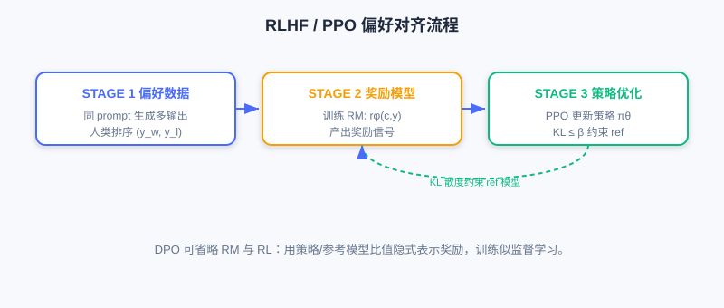
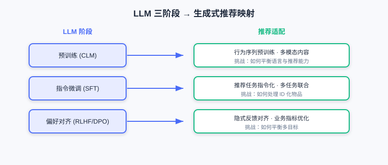

<div class="badge-row">
  <span style="background: #f0f4ff; color: #4A6CF7; padding: 4px 12px; border-radius: 20px; font-size: 0.85em; font-weight: 600; border: 1px solid rgba(74,108,247,0.2);">📖</span>
  <span style="background: #fef9ec; color: #d97706; padding: 4px 12px; border-radius: 20px; font-size: 0.85em; border: 1px solid rgba(100,100,100,0.15);">⏱️ ~40 min read</span>
  <span style="background: #fef9ec; color: #d97706; padding: 4px 12px; border-radius: 20px; font-size: 0.85em; border: 1px solid rgba(100,100,100,0.15);">🎯 Intermediate</span>
</div>

# 大语言模型（LLM）基础

> 📝 **Before You Continue:** 建议先读完 [6.2](./gr-architecture.md) 的 Decoder-Only 架构与自注意力机制。本节聚焦「LLM 怎么训练出来的」，为后续把这套流程迁移到推荐打基础。

从 Transformer 到 LLM 的演进，不只是参数规模的增长，更重要的是**训练范式的系统化**。现代 LLM（GPT-3/4、LLaMA 等）发展出一套完整的「**预训练—指令微调—偏好对齐**」三阶段训练流程，让模型既能生成流畅文本，又能理解指令、遵循人类意图。

但把 LLM 用到推荐，**并非简单「套用」现成语言模型**，而要理解其建模原理、针对推荐场景做改造优化。本节系统介绍 LLM 建模基本流程，重点放在与生成式推荐紧密相关的技术环节。

读完本章，你将能够：

- 解释 LLM 三阶段范式（预训练/指令微调/偏好对齐）各自的目标与损失
- 区分 **RLHF**（含奖励模型与 PPO）与 **DPO** 的流程差异
- 说明 **Scaling Law** 与涌现能力对生成式推荐的启示
- 把三阶段范式**映射**到推荐场景，并指出物品 Token 化等特有挑战
- 完成 4 道分层练习题，巩固 LLM→推荐的知识链条

---

## 6.3.0 LLM 三阶段范式总览

当前主流 LLM 遵循「预训练—指令微调—偏好对齐」三阶段范式，最早在 InstructGPT 系统化，被 GPT-4、Claude、LLaMA 广泛采用。三者目标递进，共同构成完整的能力构建体系。


- **Step 1（SFT）**：收集人类示范数据做监督微调，让模型初步学会遵循指令。
- **Step 2（RM）**：收集对比数据训练奖励模型，自动评估输出质量。
- **Step 3（PPO）**：以奖励模型为反馈，用强化学习持续优化生成策略，并以 KL 散度约束防止偏离参考模型过远。

### 🧠 Mental Model: 从「续写器」到「助手」

> 预训练后的 LLM 只是个「文本续写器」——给它一段开头，它自然往下写，但不懂「你要它做什么」。指令微调像**上岗培训**（教它理解任务指令）；偏好对齐像**价值观校准**（教它什么是更好的回答）。三步之后，它才从「补全工具」变成「可靠助手」。

---

## 6.3.1 预训练与指令微调

### 预训练：语言能力基础

**预训练（Pre-training）** 是第一阶段，也是最耗算力的阶段。目标是在**大规模无标注文本**上学习通用语言表示与生成能力，完全依赖**自监督学习**（数据自身构造信号，无需人工标注）。

**训练目标：因果语言建模（CLM）**，也称**下一个 token 预测（Next Token Prediction）**：

$$\mathcal{L}_{\text{CLM}}=-\sum_{i=1}^{n}\log p_\theta(x_i\mid x_{<i})$$

其中 $x_{<i}=(x_1,\dots,x_{i-1})$。模型最大化该似然，掌握语言统计规律、语法、语义乃至常识推理。

当模型规模与数据规模达到一定程度，会涌现 **Scaling Law（规模化效应）**：性能随参数量、数据量、计算量持续提升，甚至出现零样本/少样本等**涌现能力（Emergent Abilities）**。

> **Analysis:** 现代 LLM 多为 **Decoder-Only** 架构（GPT/LLaMA），简洁高效、适合大规模训练。参数从数十亿到数万亿（GPT-3 175B、PaLM 540B、LLaMA-2 7B–70B、GPT-4 估计超 1T）。预训练需数千到数万 GPU/TPU、数周至数月，成本极高——多数团队直接在开源预训练模型（LLaMA、Mistral）上微调。

### 指令微调：遵循指令

预训练模型只会「文本补全」，不等于「理解并执行指令」。**指令微调（Instruction Tuning）** 又称**监督微调（SFT）**，解决「让模型理解任务指令并按要求生成」。

核心是构造「指令—输入—输出」三元组，例如：

```
指令：总结下面这段文字的主要内容。
输入：[一段关于人工智能发展历史的文字]
输出：[人工智能从1950年代……经历了多个发展阶段……]
```

**训练目标：条件语言建模损失**，仅对输出部分计算：

$$\mathcal{L}_{\text{SFT}}=-\sum_{i=1}^{m}\log p_\theta(y_i\mid y_{<i},\boldsymbol{c})$$

其中 $\boldsymbol{c}$ 是条件信息（指令+输入），$y$ 是目标输出。**关键：损失只在输出 token 上算**，指令与输入不参与梯度更新。可采用全参数微调或参数高效方法（如 LoRA）。经 SFT 的模型在零样本/少样本任务上显著超越纯预训练模型——它学会了「理解指令」这一元能力。

---

## 6.3.2 偏好对齐与从 LLM 到推荐

### 偏好对齐：RLHF 与 DPO

即便经指令微调，LLM 输出仍可能有用性不足、幻觉、安全风险。根源是 SFT 只学「人类会怎么答」，未优化「什么回答更好」。**偏好对齐（Preference Alignment）** 让输出更符合人类价值观与偏好。

**RLHF（基于人类反馈的强化学习）** 三步走：

1. **收集偏好数据**：同一 prompt 让模型生成多个输出，人类标注者排序，得偏好对 $\mathcal{D}=\{(\boldsymbol{c},y_w,y_l)\}$（$y_w$ chosen，$y_l$ rejected）。
2. **训练奖励模型（RM）**：

$$\mathcal{L}_{\text{RM}}=-\mathbb{E}_{(\boldsymbol{c},y_w,y_l)\sim\mathcal{D}}\left[\log\sigma\big(r_\phi(\boldsymbol{c},y_w)-r_\phi(\boldsymbol{c},y_l)\big)\right]$$

3. **策略优化（PPO）**：最大化奖励、同时用 KL 散度约束防偏离参考模型：

$$\mathcal{L}_{\text{RL}}=\mathbb{E}_{\boldsymbol{c},y\sim p_\theta}\big[r_\phi(\boldsymbol{c},y)\big]-\beta\,\mathbb{E}_{\boldsymbol{c}}\big[D_{\text{KL}}(p_\theta(\cdot\mid\boldsymbol{c})\|p_{\text{ref}}(\cdot\mid\boldsymbol{c}))\big]$$



**DPO（直接偏好优化）** 更简洁：核心思想是「奖励模型可用策略模型自身隐式表示」，无需显式训练 RM、无需强化学习：

$$\mathcal{L}_{\text{DPO}}=-\mathbb{E}_{(\boldsymbol{c},y_w,y_l)\sim\mathcal{D}}\left[\log\sigma\left(\beta\log\frac{p_\theta(y_w\mid\boldsymbol{c})}{p_{\text{ref}}(y_w\mid\boldsymbol{c})}-\beta\log\frac{p_\theta(y_l\mid\boldsymbol{c})}{p_{\text{ref}}(y_l\mid\boldsymbol{c})}\right)\right]$$

DPO 训练类似监督学习，简单稳定，效果常媲美甚至超越 RLHF，近期被广泛采用。

### 三阶段范式向推荐映射

LLM 的三阶段为推荐提供完整能力框架，但每阶段都需重新定位：



| LLM 阶段 | 推荐适配方向 | 核心挑战 |
|----------|--------------|----------|
| 预训练 | 用户行为序列预训练、多模态内容预训练 | 如何表示物品？如何平衡语言能力与推荐能力？ |
| 指令微调 | 推荐任务指令化、多任务联合训练 | 如何设计推荐指令？如何处理 ID 化物品？ |
| 偏好对齐 | 隐式反馈对齐、业务指标优化 | 如何构造偏好数据？如何平衡多目标？ |

- **预训练**：核心是「让模型同时掌握语言理解与推荐建模」。过度强调语言会忽视协同信号，过度聚焦行为会削弱语义——需权衡：内容型物品（新闻/视频）语言能力更重要，协同丰富型（电商/音乐）行为建模更重要。
- **指令微调**：难点是**物品以 ID 形式存在**，对语言模型是完全陌生符号。必须把这些 ID「翻译」成模型能懂的语义表示——这正是 **物品 Token 化** 的核心，也是连接传统推荐数据与生成式模型的关键桥梁（见 6.4）。
- **偏好对齐**：推荐反馈多为**隐式**（点击、时长、跳过），目标常**多维度**（点击率、留存、生态健康）。如何从隐式反馈构造有效偏好信号、在多重指标间权衡，比 LLM 更微妙。

### 推荐场景的特殊挑战

除三阶段适配，生成式推荐还要直面 LLM 领域少有的四类挑战：

1. **物品 Token 化**：自然语言 token 自带语义，推荐物品 ID 是抽象数字、对模型无意义。如何注入语义、刻画 ID 间相似？—— 第 6.4 节核心议题。
2. **协同信号融合**：「买 A 的用户也买 B」无法从文本描述获得，需精心设计把协同信号注入生成式架构。
3. **冷启动**：新物品/新用户缺乏交互，生成式可借 LLM 语义理解从内容特征快速建立能力，但需培养模型「有交互靠协同、无交互靠内容」的自适应切换。
4. **实时性**：在线服务常要求数十毫秒内完成；自回归逐 token 生成延迟可能数百毫秒。需推理优化（量化、KV Cache、推测解码）与系统级创新（混合架构、离在线结合、缓存）。

> 💡 **Key Insight:** 生成式推荐不是「把语言模型套到推荐上」，而是把推荐问题**重新概念化为序列生成问题**，并针对推荐独特性深度适配。它借鉴 LLM 成功范式，又创造性解决推荐特有挑战——这串知识链正是后续章节（Scaling 架构、端到端生成、会思考的推荐、扩散模型）的基础。

---

## ⚠️ Common Mistakes in 6.3

| # | Mistake | Example | Why It's Wrong | Fix |
|---|---------|---------|---------------|-----|
| 1 | 把 SFT 损失算在全部 token 上 | 指令也参与梯度 | SFT 只对输出算损失，输入/指令是条件 | 损失仅在 $y$ 上 |
| 2 | 以为 RLHF 不需要参考模型 | 直接最大化奖励 | 易「欺骗」奖励模型、质量退化 | 加 KL 约束到 $p_{\text{ref}}$ |
| 3 | 混淆 RLHF 与 DPO 复杂度 | 「两者都要训奖励模型」 | DPO 隐式表示奖励，无需显式 RM/RL | DPO 训练似监督学习 |
| 4 | 直接套用 LLM 词表到物品 | 「用现成 tokenizer 编码商品」 | 物品 ID 对 LLM 是陌生符号 | 需物品 Token 化（见 6.4） |
| 5 | 忽视推荐偏好对齐的多目标 | 「用点击率当奖励就行」 | 隐式反馈+多目标需精细构造 | 显式处理多目标与隐式信号 |

---

## 本章小结

### 📌 Key Takeaways

| Concept | Key Points | Why It Matters |
|---------|-----------|----------------|
| 预训练 CLM | $\mathcal{L}_{\text{CLM}}=-\sum\log p(x_i\mid x_{<i})$ | 通用生成能力基础，Scaling Law 涌现 |
| 指令微调 SFT | 条件语言建模，仅输出算损失 | 从「补全」到「遵循指令」 |
| RLHF | RM + PPO + KL 约束 | 价值观对齐，但流程复杂 |
| DPO | 隐式奖励，似监督训练 | 简单稳定，近期主流 |
| 推荐映射 | 三阶段→行为预训练/任务指令化/隐式对齐 | 每阶段需重新定位 |
| 四类挑战 | Token 化/协同/冷启动/实时性 | 决定能否从研究走向落地 |

### ❓ FAQ

**Q1: DPO 为什么比 RLHF 更简单却常更有效？**
> A: DPO 把「训练奖励模型 + 强化学习」合并为一步——奖励由策略与参考模型的比值隐式表示，训练像普通监督学习，避免了 RL 的不稳定与额外 RM。

**Q2: 推荐里为什么偏好对齐更难？**
> A: LLM 有显式人类偏好排序；推荐的反馈多为隐式行为（点击/跳过），目标多维且常冲突，构造「什么是更好」的信号更微妙。

**Q3: Scaling Law 对推荐意味着什么？**
> A: 与 LLM 类似，生成式推荐模型的性能随参数/数据/算力提升而持续提升，这正支撑了 [6.2] 中「堆叠即规模化」与后续 Scaling 章节。

### 🔗 前后关联

- **6.2**（架构基础）的 Decoder-Only 正是 LLM 预训练的主架构。
- **6.4**（Codebook 量化）解决本节反复提及的「物品 Token 化」桥梁问题。
- **8.x**（端到端生成）落地三阶段范式到推荐的训练管线。
- **9.x**（会思考的推荐）深化偏好对齐与推理式生成的结合。

---

## Practice Problems

Work through all problems in order — they get progressively harder. Each has a complete solution you can reveal after trying it yourself.

---

**Problem 6.3.1 — SFT 损失范围** 🟢 Easy

指令微调样本：指令「翻译为英文」、输入「你好世界」、输出「Hello world」。若输出分词为 2 个 token，训练时损失应覆盖哪些 token？指令与输入 token 是否参与梯度更新？

<details>
<summary>💡 Solution (click to reveal)</summary>

**答：** 损失仅覆盖输出 token `Hello` 与 `world`（2 个），逐位算 $-\log p(y_i\mid y_{<i},\boldsymbol{c})$。指令「翻译为英文」与输入「你好世界」作为条件 $\boldsymbol{c}$ **不参与梯度更新**——模型只学「给定指令+输入，如何生成正确输出」。

**Key points:**
- 条件语言建模：条件固定，仅输出算损失。
- 这是 SFT 与预训练 CLM 的关键区别。

</details>

---

**Problem 6.3.2 — 奖励模型损失** 🟢 Easy

偏好对 $(\boldsymbol{c},y_w,y_l)$，奖励模型给出 $r(y_w)=2.0,\; r(y_l)=0.5$。写出 RM 损失项 $\log\sigma(r(y_w)-r(y_l))$ 的计算，并说明它鼓励什么。

<details>
<summary>💡 Solution (click to reveal)</summary>

**Approach:** 代入。

$r(y_w)-r(y_l)=2.0-0.5=1.5$；$\sigma(1.5)=1/(1+e^{-1.5})\approx 0.818$；损失项 $-\log(0.818)\approx 0.20$。

**答：** 该损失小（接近 0）说明奖励模型已正确给 $y_w$ 更高分。RM 损失整体鼓励「对更优输出给更高奖励分」，使 RM 能自动评估任意输出质量。

**Key points:**
- $\sigma$ 把分差压成概率。
- RM 学的是「相对优劣」而非绝对分数。

</details>

---

**Problem 6.3.3 — RLHF vs DPO** 🟡 Medium

简述 RLHF 与 DPO 在「是否需要显式奖励模型」「是否使用强化学习」「训练稳定性」三方面的差异。

<details>
<summary>💡 Solution (click to reveal)</summary>

**答：**

| 维度 | RLHF | DPO |
|------|------|-----|
| 显式奖励模型 | 需要（单独训 RM） | 不需要（策略与参考模型比值隐式表示奖励） |
| 是否用 RL | 用 PPO 强化学习 | 不用，训练似监督学习 |
| 训练稳定性 | 较低（RL 易不稳、易骗 RM） | 较高（无 RL、无独立 RM） |

**Key points:**
- DPO 用参考模型 $p_{\text{ref}}$ 替代 RM + RL。
- DPO 近期更受青睐，因简单稳定且效果可比。

</details>

---

**🏆 Challenge: 推荐偏好对齐设计**

某音乐 App 想用偏好对齐优化推荐，但其只有隐式信号（播放完成率、收藏、跳过）。请写约 150 字说明：如何从隐式行为构造偏好对 $(y_w,y_l)$？需兼顾哪些业务目标（至少列 2 个）？并点明与 LLM 显式排序的本质差异。

<details>
<summary>💡 Hint</summary>

构造：对同一用户同一上下文生成多个候选序列，用隐式信号定义优劣——如完成率高且收藏的 $y_w$，跳过多/完成率低的 $y_l$。兼顾目标：用户留存、内容生态健康（多样性/长尾）。本质差异：LLM 有人类显式排序，推荐靠行为 proxies 推断偏好，噪声大、且多目标常冲突需加权，非单纯「好坏二分类」。

</details>
