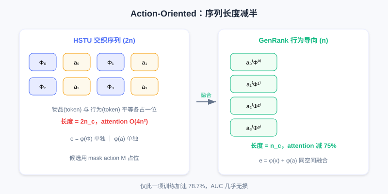

  📖
  ⏱️ ~50 min read
  🎯 Advanced

# 生成式排序总体范式

> 📝 **Before You Continue:** 请先读完 [7.1 HSTU](./hstu.md)。本章是 HSTU 的「追本溯源」——它会反复回到 HSTU 的设计决策，追问哪些是必需的、哪些可优化。理解 7.1 的架构与工程，才能体会 GenRank 的取舍逻辑。

HSTU 用万亿参数模型证明了推荐也能遵循 Scaling Law，但这建立在 Meta 的巨型算力之上：万亿参数、数千 GPU、每天数十亿用户数据。这个门槛对绝大多数公司过高。

这就引出一个关键问题：**HSTU 的设计中，哪些是必需的？哪些可以优化？** 小红书团队在实践中面临这个挑战——他们想为服务数亿用户的系统引入生成式推荐，首先要回答：生成式推荐的有效性究竟来自哪里？

---

## 7.2.0 追本溯源：什么才是本质

要优化 HSTU，先理解其有效性来源。HSTU 是复杂系统：生成式架构、自回归训练、序列化组织、统一特征空间共同作用。但工程上需明确每个因素的真实贡献——若某设计只贡献 0.1% 性能却带来 10 倍开销，资源受限时就该放弃。

小红书团队在数千亿真实曝光日志上，以 HSTU 为基准、每次改动一个设计决策做对照实验。第一个要验证的是：**自回归机制是否必要？**

回顾 HSTU：用 causal mask 训练，但只在候选物品位置算 loss，历史位置不参与——类似 LLM 的 SFT（用户历史+候选构成 prompt，模型预测行为反馈）。LLM 中 SFT 保持自回归是为延续预训练能力；但推荐通常没有预训练阶段，自回归会不会只是个可选 trick？

两组对照实验：

**第一组**：在历史位置也算 loss。若自回归只是可选技巧，更多监督信号应提升性能——但 AUC **显著下降**。这可用「one-epoch 问题」解释：用户/物品 ID 等稀疏特征占绝大部分参数，长尾分布下大量 ID 只出现一两次。历史位置算 loss 让模型倾向「记住」每个交互细节，却难以泛化（如小明历史「看科技 A→点赞」，测试时看科技 C，模型没见过此组合）。且推荐常只训一个 epoch，没机会纠正这种过拟合。

**第二组**：历史位置用全可见 mask（双向 attention）。从特征交互看应增强表达，但性能仍下降，且随模型增大降幅扩大。全可见 mask 破坏了关键归纳偏置——**用户兴趣演化的因果性**。Causal mask 强制学因果结构而非任意统计相关。例如允许双向 attention，模型在处理「看科技 A」时能看到后面「点赞」和「看美食 B」，可能学到虚假关联（「因为后面看了美食，所以给科技点赞」）——但现实中 $t$ 时刻行为不可能被未来影响。

两组实验指向同一结论：**自回归机制是生成式推荐的本质特征**。它通过架构约束引入有益归纳偏置，帮模型学行为因果结构，同时抑制对稀疏特征的过拟合。

### 🧠 Mental Model: 自回归是「因果眼镜」

> 把 causal mask 想成给模型戴上一副**因果眼镜**：它只能朝前看，被迫学「过去如何导致现在」。摘掉眼镜（双向 attention）模型会偷看答案、学虚假关联。这副眼镜不是性能负担，而是**防止作弊的正则化**——这正是自回归本质的来源。

相比之下，样本组织方式影响较小。传统 DLRM 用 point-wise 训练（每样本一次交互），HSTU 用 user-level 组织成序列。但实验显示：保持序列化组织、只在最后位置算 loss（模拟 point-wise），性能几乎没降。说明 **user-level 组织主要带来工程便利（高吞吐、易实现 KV Caching），而非性能根本来源**。

团队还测了工业常用模块兼容性：SIM、PPNet、PLE 在生成式架构下仍有效；大部分历史聚合特征价值大幅降低（序列建模能自动学统计规律），但**实时特征依然重要**（捕捉训练窗口外新信息）。特征工程简化还释放了系统资源，为处理更大候选集创造可能。

---

## 7.2.1 Action-Oriented：重新理解任务本质

HSTU 核心是 **interleaving（交织）** 公式：$[\Phi_0, a_0, \Phi_1, a_1, \ldots]$，建模为马尔可夫链。但分析计算开销会发现问题：用户 $n_c$ 次交互 + $m$ 候选，序列长 $2n_c + m$，attention 复杂度 $O(4n_c^2 d)$。$n_c$ 数千时，$4n_c^2$ 负担沉重。

核心问题：**给定用户历史和候选，我们真正要预测什么？** 答案是用户对物品会产生什么**行为反馈** $a$（点击率、观看时长、点赞概率）。在排序任务中，物品是给定 context，行为才是预测目标——物品更像上下文或位置标识符。

仍以小红书排序 100 个候选为例：对每个笔记预测「会不会点 / 看多久 / 会不会赞」。笔记本身（标题、图片、作者）是已知输入，行为反馈才是输出。既然如此，把「笔记」和「行为」平等对待（各占一个 token 位置）是否必要？

基于此，GenRank 演进：**将行为作为序列主体，物品作为行为的属性**：

$$[a_0^{(x_0)}, a_1^{(x_1)}, \ldots]$$

其中 $a_i^{(x_i)}$ 表示「用户对物品 $x_i$ 产生的行为 $a_i$」——这就是 **Action-Oriented Organization（行为导向组织）**。

上：HSTU 交织序列每个交互占 2 个 token；下：GenRank 把物品作为行为的属性融合进同一 token，序列长度从 $2n_c$ 降到 $n_c$。

技术上每个 token 表示为：

$$e_i = \varphi(x_i) + \phi(a_i)$$

物品 embedding 与行为 embedding 在同一空间直接融合；候选物品用特殊 mask action embedding：$e_j = \varphi(x_j) + M$。

直接好处：**序列长度减半**（从 $2n_c$ 到 $n_c$），带来 attention 计算减 75%、线性投影减 50%、激活内存减约 50%、KV cache 减半。实验显示仅此一项就带来 **78.7% 训练加速**。

这会损失信息吗？从信息论看，用户行为受物品内容强烈影响，二者互信息很强。加法让 embedding 在表示空间「对齐」：重要维度信号增强，独特维度信息保留。例如某维度编码「娱乐性」，搞笑视频物品 embedding 0.8、「点赞」行为 embedding 0.6，相加 1.4 信号增强；维度编码「视频时长」只与物品相关，行为 embedding 近 0，保留物品信息；「完播率」只与行为相关，保留行为信息。既然 HSTU 中物品/行为 token 在 attention 中最频繁交互，不如在 token 级就融合，反而减轻 attention 层负担。

Action-oriented 还带来更灵活的 mask：排序对一批候选评分有两个冲突需求——候选评分要独立（真实展示时用户一次只看一个），但都要看完整历史。GenRank 用特定 mask 平衡：历史 token 间 causal mask，候选可 attend 所有历史，但候选间相互屏蔽。这既保证独立性，又为未来扩展到 sequential re-ranking 留空间。

---

## 7.2.2 位置与时间：该学习什么、该编码什么

Action-oriented 解决了序列长度，但还有另一瓶颈：位置与时间信息的编码。

HSTU 用相对注意力偏置（RAB）：

$$\text{score}_{i,j} = \frac{q_i \cdot k_j}{\sqrt{d}} + \text{rab}_{p,t}(i,j)$$

同时考虑位置差、时间差甚至 token 类型，能让模型学时间衰减等模式。但问题是**计算/存储开销是 $O(N^2)$**：对长度 $N$ 序列，$\text{rab}_{p,t}$ 是 $N\times N$ 矩阵，前向要读、反向要算梯度。当 $N$ 数千时 $N^2$ 达数百万，现代训练中内存带宽是瓶颈，$O(N^2)$ 内存访问大量耗在数据传输，GPU 利用率下降。

GenRank 的替代方案：**用轻量级 embeddings 编码绝对信息，用无参数 bias 编码相对信息**。

核心思想：位置/时间可分解为两部分——绝对信息（「第几个交互」「何时发生」）用 $O(N)$ embedding；相对信息（「两交互相隔多远」）用简单无参数规则。GenRank 用三种轻量级 embeddings：

- **Position Embeddings**：$E_{pe,i} = \Omega_{pe}(i)$，记录序列索引；同请求内候选共享位置索引，保证训练/推理一致。
- **Request Index Embeddings**：$E_{ri,i} = \Omega_{ri}(|\{t_1,\ldots,t_i\}|)$，捕捉行为 burst 模式（用户常一次打开连续交互后离开，帮模型区分同 session 内与跨 session 兴趣）。
- **Pre-Request Time Embeddings**：$E_{rt,i} = \Omega_{rt}(\text{bucket}(t_i - \max_{t_j<t_i} t_j))$，编码距上次请求的间隔，实现自适应衰减（高频用户短间隔就有意义，低频用户几小时不算什么）。

三种 embedding 加到 token 表示：$e_i^{(p,t)} = \varphi(x_i) + \phi(a_i) + E_{pe,i} + E_{ri,i} + E_{rt,i}$。参数量仅几百万，I/O 复杂度 $O(N)$。

对相对信息，GenRank 借鉴 **ALiBi（Attention with Linear Biases）**：给距离远的 query-key 对施加与距离成正比的惩罚：

$$\text{score}_{i,j} = \frac{q_i \cdot k_j}{\sqrt{d}} - m \cdot (i - j)$$

ALiBi 三优点：符合直觉（越远影响越小）、无参数（$m$ 预定义）、可融合进 FlashAttention kernel。GenRank 扩展到同时考虑位置与时间：

$$\text{bias}_{i,j} = -m_p \cdot (p_i - p_j) - m_t \cdot \text{bucket}(t_i - t_j)$$

### 🧠 Mental Model: 参数 vs 规则

> 把编码策略想成一个分工：**复杂的、非线性的模式**（如「第几个交互」「属于哪次打开」）交给可学习 embeddings；**普适的、近似线性的规律**（如「越远越不重要」）直接写进规则。这就像公司里——奇葩个案交给专家处理，通用流程写成 SOP 自动跑，不必事事上会。

历史 token 间用 causal mask（左下三角可见），候选可 attend 全部历史，候选之间对角线屏蔽（相互独立）。

实验显示：action-oriented 加速 78.7%，新 position & time biases 额外加速 25.0%，合计 **94.8% 总加速，且 AUC 略升**。更简单的设计获得更好效果，验证原则：**好的归纳偏置比纯粹的参数容量更重要**。

> 💡 **Key Insight:** 从 HSTU 到 GenRank，是推荐从「工程驱动」到「原理驱动」的转变。自回归机制是核心，训练范式等细节可灵活优化。但 GenRank 保持生成式 formulation 的纯粹性——这意味着必须放弃传统 DLRM 中那些需要同时观察历史统计与候选属性的交叉特征。这引出 7.3 的灵魂一问：用户粒度建模的效率优势，是否必然绑定完整生成式 formulation？

---

## ⚠️ Common Mistakes in 7.2

| # | Mistake | Example | Why It's Wrong | Fix |
|---|---------|---------|---------------|-----|
| 1 | 以为自回归只是训练 trick | 「去掉 causal mask 加双向 attention 应该更强」 | 破坏因果归纳偏置，学到虚假关联，AUC 下降 | 记住自回归是生成式本质特征 |
| 2 | 以为 user-level 组织是性能来源 | 「按用户聚合序列才让 HSTU 变强」 | 实验：只最后位置算 loss（模拟 point-wise）性能几乎不降 | 它主要带来工程便利（吞吐/KV Cache） |
| 3 | 以为 Action-Oriented 会丢信息 | 「物品行为融成一个 token 肯定丢东西」 | 二者互信息强，加法在对齐维度增强、独特维度保留 | 理解 token 级融合反而减负 |
| 4 | 以为 RAB 的 $O(N^2)$ 无所谓 | 「相对位置偏置直接学就行」 | 数千长度时 $N^2$ 成内存带宽瓶颈，GPU 利用率降 | 用轻量 embedding + ALiBi 无参数 bias |
| 5 | 混用绝对/相对编码 | 「时间信息全用可学习矩阵」 | 普适规律不必学，过度参数化易过拟合 | 复杂用 embedding，线性规律用规则 |

---

## 本章小结

### 📌 Key Takeaways

| Concept | Key Points | Why It Matters |
|---------|-----------|----------------|
| 自回归是本质 | 两组对照实验证因果归纳偏置不可弃 | 区分「手段」与「目的」的分水岭 |
| user-level 组织 | 主要工程便利，非性能来源 | 可灵活调整而不伤本质 |
| Action-Oriented | 行为作主体、物品作属性，序列减半 | 训练加速 78.7%，性能几乎无损 |
| 轻量位置/时间编码 | 3 种 embedding + ALiBi 无参数 bias | 再加速 25%，总 94.8% |
| 归纳偏置 > 参数容量 | 更简设计更好 | 指导资源受限下的优化方向 |

### ❓ FAQ

**Q1: 为什么自回归不能去掉换成双向 attention？**
> A: 双向 attention 让模型偷看「未来」行为，学到虚假统计关联，破坏用户兴趣演化的因果结构；且随模型增大性能降幅扩大。自回归的 causal mask 是防止过拟合稀疏特征的有益正则化。

**Q2: Action-Oriented 把物品融进行为 token，排序时还能区分不同候选吗？**
> A: 能。每个候选有独立 token $e_j=\varphi(x_j)+M$，物品信息通过 $\varphi(x_j)$ 区分；候选间 mask 相互屏蔽，保证评分独立。序列减半只减少位置，不混淆候选身份。

**Q3: 为什么相对距离衰减用 ALiBi 而非学习？**
> A: 「越远越不重要」是普适近似线性的规律，直接编码更高效稳定、可融进 FlashAttention kernel；过度参数化反而降训练效率、增过拟合。复杂非线性模式才交给可学习 embedding。

### 🔗 前后关联

- **7.1（HSTU）** 本章所有「追本溯源」都建立在其架构/工程之上，直接回应「哪些因素 essential」。
- **7.3（MTGR）** 承接末尾的灵魂一问：效率优势是否必绑定完整生成式 formulation？MTGR 用混合范式给出否定答案。
- **3.4（多目标/MMoE）** 文中提到 PLE 在生成式架构下仍兼容，是判别多目标模块的延续。

---

## Practice Problems

Work through all problems in order — they get progressively harder. Each has a complete solution you can reveal after trying it yourself.

---

**Problem 7.2.1 — 自回归必要性判断** 🟢 Easy

以下两个改动哪个预期会**提升**性能、哪个会**下降**？说明原因。
- (a) 历史位置也计算 loss（更多监督信号）
- (b) 保持 user-level 序列，但只在最后候选位置算 loss

💡 Solution (click to reveal)

**Approach:** 对应正文两组实验结论。

- (a) **下降**：历史位置算 loss 让模型记细节、难泛化（one-epoch 过拟合），AUC 显著降。
- (b) **几乎不变**：这正是 GenRank 验证的——user-level 组织主要带来工程便利，非性能来源。

**Key points:**
- 自回归（causal）是本质，加双向监督反而伤。
- 组织方式灵活，架构约束才是核心。

---

**Problem 7.2.2 — Action-Oriented 序列长度** 🟢 Easy

HSTU 交织序列对 $n_c=800$ 次历史交互，序列 token 数是多少？GenRank 的 Action-Oriented 下是多少？attention 计算量（正比于长度平方）相对降低多少？

💡 Solution (click to reveal)

**Approach:** 直接套公式。

- HSTU：$2n_c = 1600$ 个 token。
- GenRank：$n_c = 800$ 个 token（行为作主体，物品作属性融合）。
- attention 计算量正比于长度平方：$(800/1600)^2 = 1/4$，即**降低 75%**。

**Key points:**
- 序列减半 → 平方级计算大降。
- 这与正文「attention 减 75%」一致。

---

**Problem 7.2.3 — 编码分工** 🟡 Medium

GenRank 对「用户第几次打开 App（request index）」和「两个交互相隔多久（相对时间）」分别用什么方式编码？为什么这样分工？

💡 Solution (click to reveal)

**Approach:** 区分绝对信息 vs 相对信息。

- request index（第几次打开）= 绝对、结构化、不同位置语义不同 → 用**可学习 Request Index Embedding** $E_{ri}$。
- 相对时间衰减（越远越不重要）= 普适近似线性规律 → 用**无参数 ALiBi bias** $-m_t\cdot\text{bucket}(t_i-t_j)$。

**Key points:**
- 原则：复杂非线性用参数，普适线性用规则。
- 避免过度参数化导致的过拟合与 $O(N^2)$ 内存瓶颈。

---

**Problem 7.2.4 — 加速归因** 🔴 Hard

某团队复现 GenRank：仅做 Action-Oriented 得 78.7% 加速，再加新位置/时间编码得 94.8% 总加速。问新编码相对「已 Action-Oriented 的基线」贡献了多少额外加速？（提示：加速 78.7% 意味着耗时降到 21.3%）

💡 Solution (click to reveal)

**Approach:** 用耗时比例相乘。

Action-Oriented 后耗时 = $1 - 0.787 = 0.213$。总加速 94.8% 后耗时 = $0.052$。新编码相对 Action-Oriented 基线的加速比 $= 0.213 / 0.052 \approx 4.10$，即额外约 **75.6% 加速**（或说新编码使耗时再降到 $0.052/0.213 \approx 24.4\%$）。

**Key points:**
- 加速是乘性叠加，不是简单相加。
- 这也印证「轻量编码」在 Action-Oriented 之上再省 25% 总耗时。

---

**🏆 Challenge: 设计优化论证**

你要在算力有限的场景落地生成式排序。请写 150 字内论证：应优先保留 HSTU/GenRank 中的哪两项设计，可放弃哪类特征工程？结合「自回归是本质」与「实时特征仍重要」两点。

💡 Hint

必保留：(1) 自回归 causal mask（本质，提供因果归纳偏置）；(2) user-level 序列组织 + Action-Oriented（工程红利，训练近 80% 加速）。可放弃：大部分历史聚合特征（序列建模自动学），但保留实时特征（训练窗口外新信息）。这正呼应 7.2 的实验结论。

