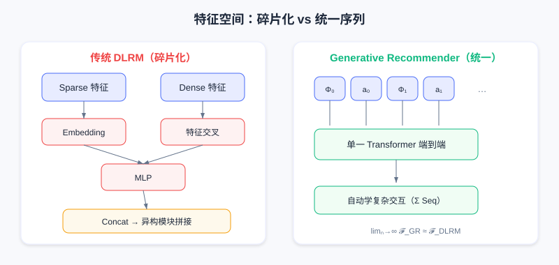
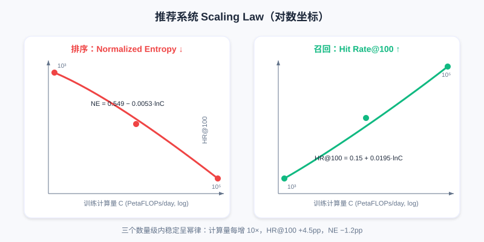

  📖
  ⏱️ ~55 min read
  🎯 Advanced

# HSTU：Scaling Law 的首次探索

> 📝 **Before You Continue:** 请先建立 [3.1 Wide & Deep](./../part3-ranking/wide-and-deep.md) 的判别式排序认知。本章会反复对比「传统 DLRM 逐候选打分」与「生成式序列建模」的差异——理解前者的瓶颈，才能体会 HSTU 的动机。也建议先读 [6.1 生成式推荐范式](./../part6-gr-basic/) 了解语义 ID 与生成式检索的背景。

过去十年，深度学习在 CV 与 NLP 领域疯狂 Scaling：ResNet 把网络深度推到上千层，Transformer 参数量突破万亿，并涌现出惊人的智能行为。它们背后有一个共同规律——**只要架构合适，模型性能会随计算量、数据量、参数量的增加而持续提升，且遵循可预测的幂律关系**，这就是著名的 **Scaling Law（缩放定律）**。

但推荐系统长期是这个规律的反例。工业界投入巨资精心设计数千个特征、搭建复杂的 DLRM 架构、每天处理数十亿用户数据，性能却很快触顶。增加参数、扩大数据，往往只换来微小甚至为零的收益。问题出在哪？本章将带你从传统 DLRM 的三大瓶颈出发，走到 Meta 用 HSTU 首次验证「推荐也能 Scaling」的完整故事。

读完本章，你将能够：

- 说出传统 **DLRM（Deep Learning Recommendation Model）** 难以 Scaling 的三个根本性限制
- 解释 **Generative Recommender（GR）** 如何把行为历史当作「语言」来建模，并实现 `user-level` 的序列训练
- 描述 **HSTU** 针对推荐场景的三大架构创新（Pointwise Aggregation、相对时间偏置、门控前馈）
- 说明 **Stochastic Length** 与 **M-FALCON** 如何分别解决超长序列训练与多候选推理的工程难题
- 复述推荐界 Scaling Law 的实验结论 $L = L_0 + \beta\ln C$，并理解其对推荐基础模型的启示
- 完成 4 道分层练习题，巩固从范式到工程的完整链条

---

## 7.1.0 传统 DLRM 的三个根本性限制

要理解 HSTU 为什么是突破，先要看清它突破的是什么。传统 DLRM 在推荐效果上已极其成熟，却有三个让 Scale 失效的硬伤：

首先是**特征瓶颈**。DLRM 依赖手工设计的数值型特征（点击率、平均观看时长等统计特征）来压缩历史信息。当模型容量增加时，这些预聚合的特征成为信息瓶颈——模型能力上去了，输入信息的丰富度却没上去。

其次是**架构碎片化**。DLRM 由 FM、DCN、DIN、MMoE 等异构模块拼成，每个模块只针对特定交互优化。扩大某个模块容量往往只带来局部改善，难以产生系统性提升。

最后是**训练范式限制**。传统 DLRM 采用 **item-level（物品级）建模**：对每个候选项独立计算评分 $\text{score}(u, i_j)$，每个训练样本只对应一个 $(user, item, action)$ 三元组。这意味着模型每次只能从一个交互中学到一个监督信号，且计算成本随候选规模**线性增长**，独立评分机制也无法捕捉候选之间的关联。

> 💡 **Key Insight:** 这三个限制共同作用，让传统 DLRM 的「算力增长曲线」几乎停滞。要突破，需要的不是工程修补，而是**范式的转变**。

---

## 7.1.1 范式转变：从物品序列到行为序列

Meta 团队获得了一个关键洞察：**如果把用户的行为历史看作一种特殊的「语言」，会发生什么？**

在 NLP 中，GPT 等语言模型的成功建立在一个简洁强大的范式上：给定前文 $[w_1, w_2, \ldots, w_t]$，自回归地预测下一个词 $w_{t+1}$。统一序列表示让所有信息编码进 token 序列，自回归训练让每个样本提供多个监督信号，Transformer 则提供强大的序列建模能力与参数效率。

但推荐不是直接照搬语言建模。GRU4Rec、SASRec 早已把用户交互历史建模为序列，却只关注**物品**序列 $[\Phi_0, \Phi_1, \ldots, \Phi_{i-1}]$，预测下一个物品 $\Phi_i$，忽略了推荐系统最关键的信息——**用户的行为反馈**。

Meta 提出的 **Generative Recommender（GR，生成式推荐）** 范式，把推荐视为两个交织的随机过程：系统展示内容 $\Phi_i$，用户产生行为反馈 $a_i$（点击、点赞、观看时长等）。完整的数据流是交替出现的内容—行为序列：

$$[\Phi_0, a_0, \Phi_1, a_1, \ldots, \Phi_{n_c-1}, a_{n_c-1}]$$

这个看似简单的改变影响深远。要建模的不再是 $p(\Phi_i | \Phi_0, \ldots, \Phi_{i-1})$，而是完整联合分布 $p(\Phi_0, a_0, \Phi_1, a_1, \ldots, \Phi_{n_c-1}, a_{n_c-1})$。按概率链式法则分解后，立刻揭示两个核心任务：

- **排序任务（Ranking）** 对应 $p(a_i | \Phi_0, a_0, \ldots, \Phi_i)$——给定用户历史与当前候选 $\Phi_i$，预测用户会产生什么行为 $a_i$。注意这是 **target-aware（目标感知）** 的：模型先看到候选，再预测行为。
- **召回任务（Retrieval）** 对应 $p(\Phi_i | \Phi_0, a_0, \ldots, a_{i-1})$——给定历史交互，预测下一个该推荐的物品，更接近传统序列推荐。

### 🧠 Mental Model: 把推荐写成「日记」

> 传统 DLRM 像是给每件事单独打分：「小明对视频 A 打 0.8 分，对视频 B 打 0.6 分」。GR 则把推荐写成一篇**日记**：「看了科技博主 A（点赞）→ 看了美食博主 B（收藏）→ …」。模型读完整篇日记，就能预测「接下来你会做什么、想看什么」——而且每读一句，它都同时学到了一个监督信号。

---

## 7.1.2 统一异构特征空间

传统 DLRM 的特征是高度异构且碎片化的：类别型（Sparse）特征如用户 ID、物品 ID、创作者 ID，基数可达数十亿；数值型（Dense）特征如点击率、平均时长，是精心设计的聚合统计。它们通过 embedding lookup、特征交叉、MLP 等不同模块处理后再拼接。

GR 要把这些异构特征统一进序列，需要巧妙设计。对类别型特征，核心思路是**时间轴对齐与压缩合并**：

- 找出变化最频繁的「主时间线」（通常是用户交互历史）。
- 对变化慢的特征（关注列表、城市等），采用**段压缩**：把连续相同值只保留首次出现。如 `[张三,张三,张三,李四,李四,王五,...]` 压缩为 `[张三,李四,王五]`。
- 将压缩后的序列按时间戳合并到主时间线，得到统一的类别型特征序列。

对数值型特征，洞察更深：它们通常是对类别型特征的**聚合统计**（「科技话题点击率」本质是「历史中科技物品点击行为」的统计），而基础信号已在类别型序列里。这意味着**若序列模型足够强、序列足够长，理论上可从原始序列自动学出这些聚合特征**——用模型容量换特征工程。

形式化地说，传统 DLRM 特征空间 $\mathcal{F}_{\text{DLRM}} = \{\text{sparse}\} \cup \{\text{dense}\}$，GR 统一为 $\mathcal{F}_{\text{GR}} = \text{Seq}(\text{sparse})$。当序列长度 $n \to \infty$ 时：$\lim_{n \to \infty} \mathcal{F}_{\text{GR}} \approx \mathcal{F}_{\text{DLRM}}$。

左：DLRM 把稀疏/稠密特征分流到不同模块，拼接前信息彼此隔离；右：GR 把所有信息编码进一条统一序列，由单一 Transformer 端到端学习交互。

> ⚠️ **Warning:** 完全放弃数值型特征并非免费。论文消融显示：给 DLRM baseline 也用「仅类别型」配置时，性能显著下降。说明**低算力场景下，精心设计的数值特征仍有价值**。GR 的优势在于用更大容量和更长序列自动学出这些信号——这是「用算力换特征工程」的取舍。

---

## 7.1.3 训练效率的飞跃

统一序列表示不仅带来建模优势，更**从根本上改变了训练的计算复杂度**。

传统 DLRM：每个样本对应一次交互 $(u,i,a)$，需一次前向传播。若有 $M$ 个交互，就要 $M$ 次前向传播，总计算量 $O(M \cdot C_{\text{forward}})$。

GR 下，一个用户序列 $[\Phi_0, a_0, \ldots, \Phi_{n_c-1}, a_{n_c-1}]$ 总长 $n = 2n_c$。在自回归训练中，它提供 **$n_c$ 个监督信号**（位置 0 后预测 $a_0$，位置 2 后预测 $a_1$……）。关键是：**这 $n_c$ 个预测能在一次前向传播中并行完成**。

Transformer 的 causal mask（下三角掩码）确保位置 $i$ 只能看 $0$ 到 $i-1$；一次前向传播隐式完成所有前缀编码，每个内容 token 后的位置都用于预测对应行为，它们共享同一次前向的中间结果。

总计算量从 $O(M \cdot C_{\text{forward}})$ 降为 $O((M/n_c) \cdot C_{\text{forward}})$——**训练效率提升约 $n_c$ 倍**。用户平均 500 次历史交互时，就提升 500 倍。这意味着**用同样算力预算，可训练复杂度高一到两个数量级的模型**。

> 💡 **Key Insight:** 这是 GR 突破 Scaling 瓶颈的第一个关键因素——它提供了足够的计算空间去尝试更深的网络、更大的容量。但还不够，还需要一个为推荐场景量身设计的高效架构。

---

## 7.1.4 HSTU 架构：为推荐优化的序列模型

直接用标准 Transformer 行不行？在 NLP 已证明强大，但推荐场景有独特性。Meta 设计的 **HSTU（Hierarchical Sequential Transduction Unit，层级序列变换单元）** 做了三个关键架构创新。

### 创新一：Pointwise Aggregation 取代 Softmax Attention

标准 Transformer：$\text{Attention}(Q,K,V) = \text{softmax}(QK^T/\sqrt{d_k})V$。Softmax 归一化让注意力权重和为 1，学习的是历史 token 的**相对重要性**。

但推荐里我们不仅要知道「哪些历史重要」，还要知道「**它们有多重要**」。例如：用户 A 科技点 10 次、娱乐点 1 次；用户 B 科技点 100 次、娱乐点 10 次。Softmax 下二者分布可能都是 90%/10%——抹去了用户 B 对科技**绝对强度**更高的信息。

HSTU 用 pointwise aggregation 替代 softmax：

$$A(X)V(X) = \varphi_2\left(Q(X)K(X)^T + \text{rab}_{p,t}\right) \odot V(X)$$

其中 $\varphi_2$ 是 SiLU 激活（Swish），$\text{rab}_{p,t}$ 是相对注意力偏置，$\odot$ 是逐元素乘。完整输出：$\text{Output} = \text{LayerNorm}(A(X)V(X)) \odot U(X)$，$U(X)$ 是门控投影。关键在于 SiLU 把相似度映射到连续值域但**不做全局归一化**，每个位置权重独立，累加和可以大于 1——模型能学到「这用户对某类内容兴趣很强烈」的绝对强度。

### 创新二：相对位置编码的重新设计

推荐序列的时间特性与语言序列本质不同：语言位置离散均匀（第 3 与第 5 词距离恒为 2）；推荐时间连续且不均匀（两次交互可能相隔几秒或几个月）。

HSTU 引入增强的相对位置偏置 $\text{rab}_{p,t}$，不仅考虑位置差 $p_i-p_j$，还考虑实际时间差 $t_i-t_j$，并区分 token 类型（内容 $\Phi$ / 行为 $a$）：

$$\text{bias}_{i,j} = f(p_i-p_j, t_i-t_j, \text{type}_i, \text{type}_j)$$

这让模型学到：最近行为更重要、某些行为衰减更快（浏览 vs 点赞）、内容 token 与行为 token 的关系不同于内容 token 之间。

### 创新三：简化的前馈网络与门控机制

标准 Transformer 在 attention 后接两层 FFN（中间维度是隐藏的 4 倍），占据大部分参数与算力。HSTU 受 GLU 变体启发，用逐元素门控替代显式 FFN：

$$\text{HSTU-Block}(X) = \text{LayerNorm}(X + \text{Gate}(X) \odot \text{Attention}(X))$$

门控函数 $\text{Gate}(X)$ 是轻量变换。好处：(1) 避免 4 倍隐层的 FFN，减少参数量与算力；(2) 降低激活值内存。后者在工业界极重要——超大 batch size（数万到数十万）下激活内存常成瓶颈。HSTU 把每层激活内存从标准 Transformer 的 33 倍隐层维度降到 14 倍，可在同内存预算下训练更深的网络。

> 📝 **Note:** HSTU 名字里的「Hierarchical」指可用分层 token 表示超高基数类别特征（如物品 ID 拆成多个 sub-token）。但后续研究发现大多数场景 flat 表示已够用，**真正价值在前述三个架构创新**。

一个 HSTU Block：Query/Key/Value 投影后，用 SiLU 逐元素聚合（非 Softmax 归一化）引入相对时间偏置，再由门控投影做残差融合。

> **Analysis:** HSTU 三项创新都围绕「推荐场景的特殊性」——绝对兴趣强度（pointwise）、非均匀时间（rab）、大 batch 内存（门控 FFN）。相比直接套标准 Transformer，在效率与效果上都有显著提升，是能部署万亿参数模型的工程基础。

下面用交互演示直观感受 HSTU 如何把「行为历史」逐步变换为「行为预测」：交织序列组织 → causal mask → pointwise aggregation → 候选位置 target-aware 预测 → 一次前向产出多个监督信号。

<iframe src="../viz/part7-hstu-sequence.html?embed&vizId=part7-hstu-sequence" style="width:100%; height:520px; border:none; display:block;" loading="lazy"></iframe>

点击「下一步」或「自动播放」，观察每一步序列如何变化，以及为什么这能带来训练效率的跃升。

---

## 7.1.5 训练与推理的工程优化

有了高效架构，超长序列训练与多候选推理仍是难题。HSTU 用两项工程创新分别破解。

### Stochastic Length：利用行为的多尺度冗余

自注意力复杂度 $O(n^2)$，序列数千上万时难以承受。但用户行为在**不同时间尺度有重复模式**：长期稳定偏好、中期兴趣演化、短期场景需求。基于这个观察，HSTU 提出 **Stochastic Length（随机长度）**：对长度 $n$ 的序列，不总用完整序列，而以一定概率随机截取较短子序列。

具体地，若 $n$ 超过阈值 $N_{\alpha/2}$，以概率 $p = 1 - N_\alpha/n^2$ 采样长度 $N_{\alpha/2}$ 的子序列，否则用完整序列。$\alpha$ 控制截断激进度：$\alpha$ 小（如 1.6–1.7）截断更激进、训练更快；$\alpha=2$ 时退化为不截断。子序列采样基于特征加权，确保覆盖不同时间尺度。

这带来双重好处：(1) 自注意力复杂度从 $O(n^2)$ 降到 $O(N_\alpha)$，序列稀疏度可达 80%+，训练数倍提速；(2) 随机子序列起类似 dropout 的正则化作用，迫使模型学更鲁棒的表示，泛化反而更好。实验表明在很大 $\alpha$ 范围内对质量几乎无负面影响。

### M-FALCON：全局成本分摊的推理算法

推理延迟同样关键。排序要对成百上千候选逐一评分，朴素做法需 $m$ 次前向传播，总计算量 $O(mn^2d + mnd^2)$，累积延迟不可接受。HSTU 的 **M-FALCON（Microbatched-Fast Attention Leveraging Cacheable OperatioNs）** 用三层递进优化解决：

**第一层：Batched Inference**——把 $b_m$ 个候选拼在一起，修改 attention mask 使候选间不能互看（候选 $i$ 只能 attend 用户历史），于是 $b_m$ 个候选评分可在一次前向并行完成。设 $b_m = m$（全部 batch），复杂度降为 $O((n+m)^2d + (n+m)d^2)$，消除对 $m$ 的线性依赖。

**第二层：Microbatching**——当 $m$ 很大时，$b_m=m$ 会让 $(n+m)^2$ 过大。把 $m$ 个候选分成 $\lceil m/b_m\rceil$ 个 microbatch（如 $b_m$ 与 $n$ 同量级），在「全并行」与「全串行」间找甜点。

**第三层：KV Caching**——Microbatching 解锁跨 microbatch 的 KV 缓存：用户历史部分的 $K,V$ 在所有 microbatch 相同，首个 microbatch 算完整 $K,V$，后续只需算新增候选的 $K,V$。后续 microbatch 复杂度降到 $O(b_m d^2 + b_m nd)$，获 $2\sim4$ 倍加速。KV cache 还可跨请求复用（同用户短时多次刷新）。

三层组合：Batched inference 带来数十倍加速，Microbatching + KV Caching 再带来 $2\sim4$ 倍加速，综合可达数百倍——让同等延迟预算下能用复杂数百倍的模型。

> **Analysis:** M-FALCON 是 HSTU 能部署万亿参数模型的工程基石。它把「历史表征计算」与候选数量解绑，每次请求用户侧只算一次，这正是后续 7.5 OneTrans Cross-Request KV Caching 思想的源头。

---

## 7.1.6 推荐系统的 Scaling Law

所有技术积木就位后，回到最初的问题：**推荐模型能否像语言模型一样持续 Scale？**

Meta 做了系统性 scaling 实验：序列长度从 512 扩到 8192，隐藏维度从 256 到 1024，深度从几层到 24 层。因推荐是流式训练，训练计算量归一化到 365 天，便于与 GPT-3、LLaMA-2 公平对比。指标用召回的 Hit Rate@100/@500 与排序的 Normalized Entropy（越低越好）。

把结果画在对数坐标上，**所有指标呈现清晰的幂律关系**：

$$L = L_0 + \beta \ln C$$

其中 $L$ 是性能指标，$C$ 是总训练计算量（PetaFLOPs/day），$L_0,\beta$ 是拟合参数。拟合结果：

- 召回：$\text{HR@100} = 0.15 + 0.0195 \ln C$
- 排序：$\text{NE} = 0.549 - 0.0053 \ln C$

即**计算量每增 10 倍（一个数量级），HR@100 约提升 4.5 个百分点，NE 约下降 1.2 个百分点**。更惊人的是，这个关系在**三个数量级的计算量范围内稳定成立**。

左：排序 NE 指标随算力持续下降；右：召回 HR@100 随算力持续上升。两条曲线在三个数量级内稳定，与 LLM 的 Scaling Law 同构。

这个发现意义深远：(1) **首次证明**推荐模型的 Scaling Law，推荐不再是深度学习例外；(2) 可用小规模实验预测大规模性能，**为研发指明方向**、降低盲目性与碳排放；(3) 打开了**推荐基础模型（Foundation Model）** 的可能——预训练大模型再跨场景微调。最大配置（8192 序列、1024 维、24 层）达 **1.5 万亿参数**，并成功部署到 Meta 多个场景服务数十亿用户，线上 A/B 排序指标提升达双位数百分比。

下面用交互曲线亲自验证 Scaling Law：拖动滑块调节训练计算量，观察 Hit Rate@100 与 Normalized Entropy 如何沿幂律曲线移动；也可点「下一步」看从小规模到万亿参数部署的几个关键场景。

<iframe src="../viz/part7-scaling-law.html?embed&vizId=part7-scaling-law" style="width:100%; height:520px; border:none; display:block;" loading="lazy"></iframe>

每一步计算量增 10 倍，HR@100 约 +4.5pp、NE 约 −1.2pp——这种可预测性，正是推荐模型能像 LLM 一样 Scale 的根本保证。

---

## 7.1.7 为什么 HSTU 能够突破？

回顾整个技术体系，四个层面的创新相互支撑：

1. **范式转变是根本**——从 item-level 到 user-level，从独立评分到序列生成，解除了计算成本与候选数量的线性绑定。
2. **架构创新是关键**——attention、位置编码、前馈网络针对性设计，比直接套标准 Transformer 显著提升。
3. **工程优化是保障**——Stochastic Length 让超长序列训练可行，M-FALCON 让复杂模型推理高效，激活内存优化让大 batch 不再是瓶颈。
4. **统一特征空间是基础**——异构特征进统一序列，简化特征工程，更让模型端到端学复杂交互、提升参数效率。

这四者缺一不可。HSTU 的成功证明了推荐模型可以 Scale，也留下新问题：哪些因素真正 essential？完全生成式训练是否必需？如何推广到多任务多场景？这些将由后续研究回答——首先是 7.2 的 GenRank，去追问「自回归机制到底是不是本质」。

---

## ⚠️ Common Mistakes in 7.1

| # | Mistake | Example | Why It's Wrong | Fix |
|---|---------|---------|---------------|-----|
| 1 | 以为推荐天生不能 Scale | 「DLRM 加参数没用，推荐就是例外」 | 不是推荐不能 Scale，是 item-level 范式 + 碎片化架构绑住了算力 | 理解 HSTU 的 user-level 序列解绑 |
| 2 | 把 GR 当成普通序列推荐 | 「GR 就是 SASRec 加长序列」 | GR 建模内容—行为**交织**序列，且 target-aware 预测行为 $a_i$ | 区分物品序列 vs 行为序列 |
| 3 | 以为 Softmax Attention 够用 | 「直接拿标准 Transformer 当 HSTU」 | Softmax 归一化抹去兴趣**绝对强度**信息 | 记住 pointwise aggregation 的关键区别 |
| 4 | 忽略训练效率的来源 | 「序列建模只是效果更好」 | 一次前向产 $n_c$ 个监督信号，训练提速 $n_c$ 倍 | 理解 user-level 聚合的算力红利 |
| 5 | 以为 Scaling Law 只对大模型成立 | 「只有万亿参数才谈 Scaling」 | 幂律在三个数量级都成立，小规模即可外推 | 用小实验预测大规模性能 |

---

## 本章小结

### 📌 Key Takeaways

| Concept | Key Points | Why It Matters |
|---------|-----------|----------------|
| DLRM 三限制 | 特征瓶颈 / 架构碎片化 / item-level 训练 | 解释推荐为何长期不 Scale |
| GR 范式 | $[\Phi_0,a_0,\ldots]$ 交织序列，user-level 自回归 | 统一序列 + 多监督信号，训练提速 $n_c$ 倍 |
| HSTU 三创新 | Pointwise Agg / 相对时间偏置 / 门控 FFN | 为推荐场景定制的序列架构 |
| Stochastic Length | 随机截断超长序列 | 训练数倍提速 + 正则化 |
| M-FALCON | Batched→Microbatch→KV Cache | 推理数百倍加速，万亿参数可部署 |
| Scaling Law | $L=L_0+\beta\ln C$，三数量级稳定 | 首次证明推荐可 Scale，开启基础模型 |

### ❓ FAQ

**Q1: 为什么 Pointwise Aggregation 比 Softmax 更适合推荐？**
> A: Softmax 强制权重和为 1，只学「相对重要性」；推荐还需「绝对强度」（用户 B 比 A 更爱科技）。SiLU 逐元素聚合不做全局归一化，权重可累加超 1，保留绝对兴趣强度——对预测点击后深度行为至关重要。

**Q2: 为什么 GR 训练比 DLRM 快这么多？**
> A: DLRM 每个交互一次前向，M 个样本 M 次前向。GR 把用户序列一次前向同时预测 $n_c$ 个行为（causal mask 下共享计算），总前向数降到 $M/n_c$，提速约 $n_c$ 倍。

**Q3: 推荐基础模型为什么现在可能了？**
> A: Scaling Law 证明性能随算力可预测提升，意味着可预训练大规模通用推荐模型再跨场景微调——这是 HSTU 1.5 万亿参数部署后最令人兴奋的方向。

### 🔗 前后关联

- **7.2（生成式排序/GenRank）** 追问自回归是否本质，并用 Action-Oriented 进一步提速——直接延续本章「哪些因素 essential」的设问。
- **7.3（MTGR）** 在混合范式下保留交叉特征，回应「完全生成式训练是否必需」。
- **6.1–6.4（生成式基础）** 给出语义 ID、RQ-VAE 等前置，理解 item 如何变成 token。
- **3.1–3.5（判别排序）** 是本章反复对比的「旧范式」，看清瓶颈才能体会突破。

---

## Practice Problems

Work through all problems in order — they get progressively harder. Each has a complete solution you can reveal after trying it yourself.

---

**Problem 7.1.1 — 识别 DLRM 瓶颈** 🟢 Easy

某团队把 DLRM 的 embedding 维度翻倍、加深 MLP，但线上 CTR 预估 AUC 几乎没变。请结合 7.1.0 的三个限制，指出最可能的原因（选一个并说明）。

💡 Solution (click to reveal)

**Approach:** 从「增加容量 ≠ 增加信息」角度判断。

最可能的是**特征瓶颈**：DLRM 用预聚合的数值特征（点击率、平均时长）压缩历史，模型容量涨了，但输入信息丰富度没涨。其次是 item-level 训练——每个样本只一个监督信号，加容量不增加每样本信息量。架构碎片化也可能（单模块扩容只局部改善）。

**Key points:**
- 算力增长曲线停滞，往往不是参数不够，而是信息/范式被绑住。
- 这正引出 HSTU 的 user-level 序列解法。

---

**Problem 7.1.2 — GR 序列组织** 🟢 Easy

传统序列推荐建模物品序列 $[\Phi_0, \Phi_1, \ldots]$，HSTU 的 GR 建模 $[\Phi_0, a_0, \Phi_1, a_1, \ldots]$。请回答：

1. GR 序列长度（按 token 数）是物品交互次数 $n_c$ 的几倍？
2. 排序任务 $p(a_i | \ldots, \Phi_i)$ 是 target-aware 还是 target-agnostic？

💡 Solution (click to reveal)

**Approach:** 直接对应正文定义。

1. GR 序列总长 $n = 2n_c$（内容、行为交替），是 $n_c$ 的 **2 倍**。
2. $p(a_i | \Phi_0, a_0, \ldots, \Phi_i)$ 中模型先看到候选 $\Phi_i$ 再预测行为 $a_i$，是 **target-aware**。

**Key points:**
- 交织序列牺牲长度换取行为反馈信号。
- target-aware 是后续生成式排序预测深度行为的基础。

---

**Problem 7.1.3 — 训练效率倍数** 🟡 Medium

设用户平均历史交互 $n_c = 500$，训练集有 $M = 10^8$ 条交互记录。对比 DLRM（每条一次前向）与 GR（按用户序列组织，序列长 $2n_c$）所需的「前向传播次数」数量级。GR 提速约多少倍？

💡 Solution (click to reveal)

**Approach:** DLRM 前向次数 = $M = 10^8$。GR 把 $M$ 条交互组成 $M/n_c$ 个序列，每个序列一次前向。

$M/n_c = 10^8 / 500 = 2 \times 10^5$ 次前向。提速倍数 $= 10^8 / (2\times10^5) = 500$ 倍。

**Key points:**
- 加速比 ≈ 平均序列长度 $n_c$，因为一次前向产 $n_c$ 个监督信号。
- 这解释了「同样算力可训复杂数百倍的模型」。

---

**Problem 7.1.4 — Scaling Law 外推** 🔴 Hard

已知召回 HR@100 $= 0.15 + 0.0195 \ln C$（$C$ 单位 PetaFLOPs/day）。若算力从 $C_1=10^3$ 增到 $C_2=10^4$（一个数量级），HR@100 提升多少个百分点？并说明为何这比「盲目堆参数」更可控。

💡 Solution (click to reveal)

**Approach:** 用对数差值。

$\Delta = 0.0195 (\ln 10^4 - \ln 10^3) = 0.0195 \ln 10 \approx 0.0195 \times 2.303 \approx 0.0449$。即约 **4.5 个百分点**，与正文一致。

**Key points:**
- Scaling Law 给出可预测的幂律，小实验可外推大模型性能。
- 相比盲目堆参数（可能触顶），它把研发变成「按算力预算规划性能」的可控工程。

---

**🏆 Challenge: 设计取舍论证**

假设你是某中型公司推荐团队负责人，算力仅为 Meta 的 1%。请写一段 150 字内论证：你应直接照搬 HSTU 万亿参数方案，还是先借鉴其「范式转变 + 工程优化」思路做轻量落地？并指出哪两项 HSTU 技术对你最实用。

💡 Hint

算力有限时，万亿参数不可行；但「user-level 序列训练提速 $n_c$ 倍」与「M-FALCON 的 KV Caching/批处理」是算力无关的架构红利，最值得借鉴。Stochastic Length 的截断也可直接降训练成本。重点是把范式红利而非参数规模搬过来。

