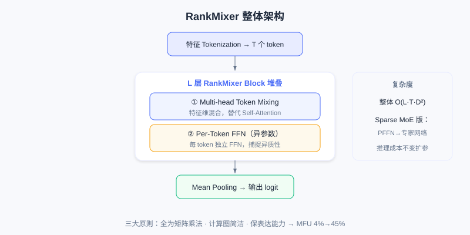
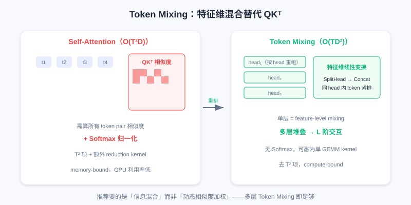
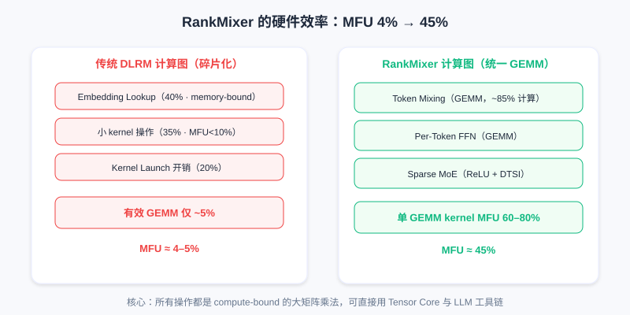

  📖
  ⏱️ ~50 min read
  🎯 Advanced

# RankMixer：硬件效率优化

> 📝 **Before You Continue:** 已读 [7.3 MTGR](./mtgr.md)（关注特征兼容性）与 [3.2 特征交叉](./../part3-ranking/feature-crossing.md)（关注交叉表达）。本章换一个角度——不从「能不能建模」而从「GPU 算得值不值」看 Scaling，核心是 hardware-aware 架构设计。

传统 DLRM 在 GPU 上的 **MFU（Model FLOPs Utilization，模型浮点利用率）** 通常只有 4–5%，而大语言模型可达 40–60%。这十倍效率差距，直接导致推荐模型无法享受 Scaling Law 红利——即使加参数量，大部分新增计算也浪费在低效内存访问上。

根源在于传统 DLRM 继承自 CPU 时代的架构，在 GPU 上暴露三个根本问题：(1) 核心操作以 **memory-bound（访存受限）** 为主，embedding lookup、特征交叉、序列建模访存量远大于计算量；(2) 计算图**高度碎片化**，多个独立手工模块串联，kernel launch 开销与 global memory 传输累积成瓶颈；(3) **无法充分利用 Tensor Core**，大部分是小向量运算或不规则访存，发挥不了矩阵乘法加速单元。

**RankMixer** 通过 hardware-aware 架构设计从根本上解决。核心原则：**从硬件特性反推架构设计**，把推荐模型重构为统一的、GPU 友好的计算图——用 **Token Mixing** 替代 Self-Attention 降复杂度，用 **Per-Token FFN** 捕捉特征异质性，用 **Sparse MoE** 实现参数高效扩展。

---

## 7.4.0 RankMixer 整体架构

模型核心是 $L$ 层堆叠的 RankMixer Block，每个 block 含 Multi-head Token Mixing（替代 Self-Attention）与 Per-Token FFN（捕捉特征异质性）两个模块。输入特征经 tokenization 转为 $T$ 个统一维度 token，经 $L$ 层 block 后通过 mean pooling 产生输出。

输入特征 token 化后，经多层 RankMixer Block（每层 = Token Mixing + Per-Token FFN），最后 mean pooling 输出 logit。所有核心操作均为矩阵乘法。

每个 RankMixer Block 前向：

$$\begin{aligned}
\boldsymbol{S}_{n-1} &= \text{LN}(\text{TokenMixing}(\boldsymbol{X}_{n-1}) + \boldsymbol{X}_{n-1}) \\
\boldsymbol{X}_n &= \text{LN}(\text{PFFN}(\boldsymbol{S}_{n-1}) + \boldsymbol{S}_{n-1})
\end{aligned}$$

整体复杂度 $O(LTD^2)$。Sparse MoE 版本中 Per-Token FFN 可替换为专家网络，在保持推理成本下扩展参数量。设计遵循三原则：(1) 所有核心操作为矩阵乘法，充分利用 Tensor Core；(2) 计算图尽量简洁，减少 kernel launch 开销；(3) 保持推荐任务所需表达能力。

---

## 7.4.1 Token Mixing 机制

Self-Attention 复杂度 $O(T^2D)$（来自计算所有 token pair 相似度矩阵 $QK^T$）。推荐场景特征数可达数百上千，这个 $T^2$ 项成显著瓶颈。RankMixer 的核心洞察：**推荐任务需要的是 token 间信息混合（mixing），而非基于相似度的动态加权（attention）**。例如学「年轻用户在一线城市更爱科技类物品」这类高阶交互，本质是让多个 token 信息融合成新表示，不一定需显式算 token pair 相似度。

Token Mixing 核心思想：**在特征维度而非 token 维度混合**。给定输入 $\boldsymbol{X} \in \mathbb{R}^{T\times D}$，含两步：

**第一步 Multi-head decomposition**——每个 token 分解为 $H$ 个 head：$[\boldsymbol{x}_t^{(1)} \| \cdots \| \boldsymbol{x}_t^{(H)}] = \text{SplitHead}(\boldsymbol{x}_t)$，$\boldsymbol{x}_t^{(h)} \in \mathbb{R}^{D/H}$ 是第 $t$ 个 token 第 $h$ 个 head。

**第二步 Token-wise mixing**——每个 head 内把所有 token 的该 head 部分拼接：$\boldsymbol{s}^{(h)} = \text{Concat}(\boldsymbol{x}_1^{(h)}, \ldots, \boldsymbol{x}_T^{(h)}) \in \mathbb{R}^{TD/H}$。

关键：**改变数据组织，从「按 token」变「按 head」**。原 $\boldsymbol{X}$ 是 $T$ 个长度 $D$ 向量，经 SplitHead+Concat 后变 $H$ 个长度 $TD/H$ 向量，每 head 内不同 token 特征紧密排列，为混合创造条件。实际设 $H=T$，每「head」含所有 token 一部分特征。混合后 token 数不变，便于残差连接。

左：Self-Attention 算全 $T\times T$ 相似度矩阵（$O(T^2D)$）；右：Token Mixing 按 head 重排后在特征维度线性变换（$O(TD)$），无 softmax。

复杂度看，Token Mixing 计算量 $O(TD)$（主要是内存重排）。相比 self-attention 的 $O(T^2D+TD^2)$，当 $T$ 较大（推荐中 $T$ 几百上千）时避免 $T^2$ 项，显著降低。且 Token Mixing 无 softmax normalize（需额外 reduction kernel），进一步减 kernel 开销。

关键问题：**不显式算 token pair 相似度，如何保证捕捉交互？** 答案在**多层堆叠**。单层 Token Mixing 是「feature-level mixing」——不同 token 同维特征相互影响（因 concat 到同一向量）。堆叠多层时，第 1 层每 token 输出融合所有 token 一阶信息，第 2 层输入已是 mixed 结果，每 token 已含他 token 信息，第 2 层再 mixing 实现二阶交互：

$$\boldsymbol{X}_1 = f(\boldsymbol{X}_0),\quad \boldsymbol{X}_2 = f(f(\boldsymbol{X}_0)),\quad \ldots,\quad \boldsymbol{X}_L = \underbrace{f\circ\cdots\circ f}_{L\text{ 次}}(\boldsymbol{X}_0)$$

每层 Token Mixing 在特征维度做线性变换（经后续 FFN），堆叠 $L$ 层可建模 token 间 $L$ 阶多项式交互。实际 $L$ 通常 6–12 层，足以捕捉所需高阶交叉。

从硬件看，Token Mixing 核心是数据重排（SplitHead、Concat），可用高效 kernel 实现，设计为连续内存读写（coalesced memory access）充分利用带宽。相比 attention 需算 softmax（全局归一化），Token Mixing 局部、可并行。更重要的是 SplitHead、Concat、FFN 可融合成一个 kernel，减 kernel launch overhead——这是 MFU 提升的关键。

> **Analysis:** Token Mixing 用「特征维混合 + 多层堆叠」替代「token 对相似度 + softmax」，把 $O(T^2D)$ 降到 $O(TD^2)$（整体），且所有操作可融为矩阵乘法 kernel。牺牲的是 attention 的「动态相似度路由」，换来的是 GPU 利用率——在推荐这种特征多、交互模式相对固定的场景，这笔交易很划算。

---

## 7.4.2 Per-Token FFN

标准 Transformer 的 FFN 对所有 token 用相同权重：$\text{FFN}(\boldsymbol{x}) = \boldsymbol{W}_2\cdot\text{GELU}(\boldsymbol{W}_1\boldsymbol{x}+\boldsymbol{b}_1)+\boldsymbol{b}_2$。这在 LLM 合理（所有 token 同语义空间）。但推荐特征语义空间完全不同：用户 ID 表隐式偏好、物品类目是粗粒度分类、点击率服从长尾、时间戳有周期性。强行同 FFN 处理导致参数效率损失。

RankMixer 核心设计：**每个 token 有独立 FFN 参数**。第 $t$ 个 token：

$$\boldsymbol{v}_t = \boldsymbol{W}_{\text{pffn}}^{t,2}\cdot\text{GELU}(\boldsymbol{W}_{\text{pffn}}^{t,1}\boldsymbol{s}_t + \boldsymbol{b}_{\text{pffn}}^{t,1}) + \boldsymbol{b}_{\text{pffn}}^{t,2}$$

每 token 的 $\boldsymbol{W}_{\text{pffn}}^{t,i}$ 独立，使：(1) 每 token 学特定语义空间变换；(2) 高信息量 token 自动分配更大参数容量；(3) 避免不同语义空间相互干扰。

Per-Token FFN 与 MMoE 本质不同。MMoE 多 expert 共享同输入，gating 动态加权输出 expert 组合：$\boldsymbol{y}=\sum_i g_i(\boldsymbol{x})\cdot\text{Expert}_i(\boldsymbol{x})$（所有 expert 看相同 $\boldsymbol{x}$）。Per-Token FFN 每 token 有独立输入与独立 FFN：$\boldsymbol{v}_t=\text{FFN}_t(\boldsymbol{s}_t)$（每 FFN 看不同 $\boldsymbol{s}_t$）。参数隔离确保不同特征空间学习相互独立，避免高频特征 dominate 低频特征。

参数效率看，设 $T$ 个 token，Per-Token FFN 总参数 $\text{Param}=2TkD^2$，相比 shared FFN（$2kD^2$）增 $T$ 倍。但**计算复杂度不变**：$\text{FLOPs}=2TkD^2$，与 shared FFN 相同（shared 也需对 $T$ 个 token 分别计算）。增加的参数是「专门化」的，每块只服务特定 token，学习效率更高。

跨特征空间交互通过 Token Mixing 层实现。Per-Token FFN 专注各自空间深度建模，Token Mixing 确保不同 token 信息混合。这种「mixing + per-token processing」组合，在保持参数隔离的同时，通过多层堆叠实现充分跨空间交互。

---

## 7.4.3 Sparse MoE 扩展

有了 Token Mixing 与 Per-Token FFN，如何扩到十亿甚至百亿参数？直接加深度/宽度会线性增计算量，推理延迟同比增，工业不可接受。**Sparse MoE（稀疏专家混合）** 提供方案：不是所有参数都参与每样本计算，而是按样本特性动态选部分 expert。模型参数量可很大，但每样本计算量固定（只激活少数 expert）。

MoE 理想模式是每个 expert 专门化到某种样本模式。但推荐场景实现有效 expert specialization 面临三大挑战：(1) 输入是高维稀疏特征，组合空间指数级，representation 散布高维各角落，缺清晰 cluster 结构，gating 难学稳定路由；(2) 数据极度不均衡，头部用户占 50% 样本，若 gating 早期把大量头部样本路由到某 expert，该 expert 获更多梯度，后续 gating 继续发它，导致少数 expert 处理大部分样本（expert overload），其余几乎不用（expert underutilization）；(3) 即使训练负载均衡，推理时请求分布可能不同，某些 expert 成瓶颈，增延迟方差。

RankMixer 用两种互补训练策略应对。首先是 **ReLU Routing**——标准 MoE 用 Top-$k$ + Softmax routing，每 token 固定激活 $k$ 个 expert。RankMixer 用 ReLU Routing 允许每 token 激活不同数量 expert：

$$G_{i,j} = \text{ReLU}(h(\boldsymbol{s}_i)),\quad \boldsymbol{v}_i = \sum_{j=1}^{N_e} G_{i,j}\cdot e_{i,j}(\boldsymbol{s}_i)$$

ReLU 使输出可为 0（不激活）或正值（激活），高信息量 token 可能激活更多 expert。为控稀疏度加正则：$\mathcal{L} = \mathcal{L}_{\text{task}} + \lambda\mathcal{L}_{\text{reg}}$，$\mathcal{L}_{\text{reg}} = \sum_{i,j} G_{i,j}$，$\lambda$ 控平均激活 expert 数。

其次是 **Dense-Training / Sparse-Inference（DTSI-MoE）**——Per-Token FFN 已增参数 $T$ 倍，加 MoE 再扩 expert 数，易致 expert under-training。DTSI-MoE 用两个 router：训练时 dense router $h_{\text{train}}$ 激活所有或大部分 expert 确保充分训练，推理时 sparse router $h_{\text{infer}}$ 只激活少数 expert 降计算成本。两 router 同时训练，仅 $h_{\text{infer}}$ 受 $\mathcal{L}_{\text{reg}}$ 约束：

$$G_{i,j}^{\text{train}} = \text{ReLU}(h_{\text{train}}(\boldsymbol{s}_i)),\quad G_{i,j}^{\text{infer}} = \text{ReLU}(h_{\text{infer}}(\boldsymbol{s}_i))$$

训练时前向用 $G^{\text{train}}$，同时算 $G^{\text{infer}}$ 并对其施加稀疏正则；推理时只用 $h_{\text{infer}}$。实现训练充分、推理高效、策略一致。

负载均衡通过 $\mathcal{L}_{\text{reg}}$ 软约束实现。expert $j$ 在 batch 总激活量 $A_j = \sum_i G_{i,j}$，正则可重写 $\mathcal{L}_{\text{reg}} = \sum_j A_j$。当某 expert $A_j$ 过大，梯度 $\partial\mathcal{L}_{\text{reg}}/\partial h_{\text{infer}}$ 抑制其激活概率，实现负载均衡。相比硬约束（capacity 限制），软约束不会因 expert 满载强制分配次优 expert，保持路由灵活。

左：传统 DLRM 计算图碎片化（embedding lookup 访存受限、小 kernel、launch 开销），有效 GEMM 仅 5%；右：RankMixer 核心操作全为 GEMM，Token Mixing + PFFN 占 ~85% 计算，MFU 达 45%。

RankMixer 实现高 MFU 的关键：**所有核心操作都是 compute-bound 的大矩阵乘法**。Token Mixing 和 PFFN 占约 85% 计算时间，全是 GEMM，可高效用 Tensor Core（单 GEMM kernel MFU 达 60–80%）。相比之下传统 DLRM 中 embedding lookup（40% 时间，memory-bound）、小 kernel（35% 时间，MFU<10%）、launch 开销（20% 时间）主导，有效 GEMM 仅 5%——这正是 DLRM 的 MFU 只有 4–5%、RankMixer 达 45% 的原因。

> 💡 **Key Insight:** RankMixer 把推荐模型从碎片化设计转为统一架构范式。算法上 Token Mixing 把复杂度从 $O(T^2D)$ 降到 $O(TD^2)$，Per-Token FFN 捕捉特征异质性，Sparse MoE 通过 ReLU Routing 和 DTSI-MoE 实现参数高效扩展。系统上把所有核心操作统一为矩阵乘法，MFU 从 4–5% 升到 45%，让推荐模型成为 GPU 的「第一类公民」，可直接用 Tensor Core 和 LLM 成熟工具链，打开可持续 Scaling 路径。但 RankMixer 聚焦模型内部计算效率，pipeline 仍有其他碎片化——序列建模与特征交互分离、召回排序分离、多任务碎片化。下一节 OneTrans 进一步突破这些壁垒。

---

## ⚠️ Common Mistakes in 7.4

| # | Mistake | Example | Why It's Wrong | Fix |
|---|---------|---------|---------------|-----|
| 1 | 以为 MFU 低只是参数少 | 「加 GPU 就能解决利用率」 | 是架构碎片化+访存受限，非算力不足 | 用 hardware-aware 统一为 GEMM |
| 2 | 以为 Token Mixing 丢交互 | 「不算子对相似度就无交叉」 | 多层堆叠实现 $L$ 阶多项式交互 | 看 $f\circ f\circ\cdots$ 的堆叠 |
| 3 | 把 Per-Token FFN 当 MMoE | 「每个 token 一个 expert 就是 MoE」 | MMoE 共享输入加权组合，PFFN 每 token 独立输入/参数 | 区分参数隔离 vs 路由加权 |
| 4 | 用 Top-k Softmax routing | 「MoE 都该固定激活 k 个」 | 推荐稀疏难稳定路由，且不均容易 overload | 用 ReLU Routing 动态激活 |
| 5 | 忽略 DTSI-MoE 的必要性 | 「直接 sparse 训练就行」 | PFFN 已增参数 T 倍，纯 sparse 易 under-training | 训练 dense、推理 sparse 双 router |

---

## 本章小结

### 📌 Key Takeaways

| Concept | Key Points | Why It Matters |
|---------|-----------|----------------|
| MFU 瓶颈 | DLRM 仅 4–5%，LLM 40–60% | 推荐难 Scale 的硬件根因 |
| Token Mixing | 特征维混合替代 $QK^T$，复杂度 $O(TD^2)$ | 去 $T^2$ 项 + 可融 kernel |
| Per-Token FFN | 每 token 独立 FFN 参数，复杂度不变 | 捕捉特征异质性，参数隔离 |
| Sparse MoE | ReLU Routing + DTSI-MoE | 参数高效扩展到十亿级 |
| 统一为 GEMM | 核心操作全矩阵乘法 | MFU 升到 45%，成 GPU 一类公民 |

### ❓ FAQ

**Q1: Token Mixing 不计算相似度，真能替代 Self-Attention 吗？**
> A: 能。推荐的高阶交叉本质是「多 token 信息融合成新表示」，单层在特征维 mixing，多层堆叠实现 $L$ 阶多项式交互。代价是不再有动态相似度路由，但推荐特征多、模式相对固定，换来的 GPU 利用率提升更划算。

**Q2: Per-Token FFN 参数量增 T 倍，为什么 FLOPs 不变？**
> A: Shared FFN 也要对 T 个 token 分别计算（每 token 一次 FFN），FLOPs 本就是 $2TkD^2$；Per-Token 只是把共享权重换成 T 份独立权重，每 token 仍算一次，FLOPs 相同。增加的是「专门化」参数，学习效率更高。

**Q3: 为什么推荐 MoE 用 ReLU Routing 而非 Top-k？**
> A: 推荐输入高维稀疏、分布不均，Top-k 固定激活数易使少数 expert overload、其余 underutilization；ReLU 让每 token 按信息量动态激活不同数量 expert，配合正则实现软负载均衡，更适配推荐数据。

### 🔗 前后关联

- **7.3（MTGR）** 同样处理异构特征，但用 GLN + Dynamic Masking；可对照 RankMixer 的 Per-Token FFN（异参数）思路。
- **7.5（OneTrans）** 进一步打破「序列建模与特征交互分离」的碎片化，是 RankMixer 硬件思路在统一架构上的延伸。
- **3.2（特征交叉）** 中 DCN/xDeepFM 的高阶交叉，在 RankMixer 中以 Token Mixing 多层堆叠重新实现，且更 GPU 友好。

---

## Practice Problems

Work through all problems in order — they get progressively harder. Each has a complete solution you can reveal after trying it yourself.

---

**Problem 7.4.1 — MFU 根因** 🟢 Easy

传统 DLRM 的 MFU 约 4–5%，LLM 约 40–60%。请指出导致 DLRM 低 MFU 的三个架构层面原因。

💡 Solution (click to reveal)

**Approach:** 对应正文三个根本问题。

1. 核心操作 memory-bound（embedding lookup、特征交叉访存量 >> 计算量）；
2. 计算图高度碎片化（多独立模块串联，kernel launch + global memory 传输开销）；
3. 无法充分利用 Tensor Core（小向量/不规则访存，非 GEMM）。

**Key points:**
- 不是算力不够，是算得「不值」。
- RankMixer 统一为 GEMM 把 MFU 拉到 45%。

---

**Problem 7.4.2 — Token Mixing 复杂度** 🟢 Easy

Self-Attention 复杂度 $O(T^2D)$，Token Mixing 约 $O(TD)$（重排）。当 $T=1000, D=256$ 时，两者数量级相差约多少倍？

💡 Solution (click to reveal)

**Approach:** 代入估算（忽略常数）。

- Self-Attention：$T^2D = 10^6 \times 256 = 2.56\times10^8$。
- Token Mixing：$TD = 1000 \times 256 = 2.56\times10^5$。
- 相差 $\approx 1000$ 倍（即 $T$ 倍）。

**Key points:**
- Token Mixing 去除了 $T^2$ 项，随 token 数线性。
- 推荐中 $T$ 数百上千，收益显著。

---

**Problem 7.4.3 — Per-Token FFN vs MMoE** 🟡 Medium

为什么说 Per-Token FFN 与 MMoE「本质不同」？各用一句话概括它们的参数组织方式。

💡 Solution (click to reveal)

**Approach:** 区分「参数隔离」与「路由加权」。

- MMoE：多个 expert 共享同一输入 $\boldsymbol{x}$，gating 动态加权组合输出 $\boldsymbol{y}=\sum_i g_i(\boldsymbol{x})\text{Expert}_i(\boldsymbol{x})$——所有 expert 看相同输入。
- Per-Token FFN：每个 token 有独立输入 $\boldsymbol{s}_t$ 与独立 FFN $\boldsymbol{v}_t=\text{FFN}_t(\boldsymbol{s}_t)$——参数隔离，避免高频特征 dominate 低频。

**Key points:**
- 一个是「同输入、加权选 expert」；一个是「异输入、各自独立 FFN」。
- 目的都是处理异构特征，机制不同。

---

**Problem 7.4.4 — DTSI-MoE 设计** 🔴 Hard

解释 DTSI-MoE 为何需要两个 router（$h_{\text{train}}$ 与 $h_{\text{infer}}$），并说明若只用 $h_{\text{infer}}$ 做训练会发生什么。

💡 Solution (click to reveal)

**Approach:** 从「充分训练 vs 高效推理」矛盾切入。

Per-Token FFN 已把参数增 T 倍，再加 MoE 扩 expert 数，若训练时也稀疏激活，很多 expert 收不到足够梯度 → expert under-training。DTSI-MoE 用 $h_{\text{train}}$ 在训练时激活多数 expert（充分训练），仅 $h_{\text{infer}}$ 受稀疏正则约束用于推理。若只用 $h_{\text{infer}}$ 训练，expert 会 under-training，部署后效果差。

**Key points:**
- 训练 dense 保质量，推理 sparse 保效率。
- 两 router 同时训练、策略一致。

---

**🏆 Challenge: hardware-aware 重构**

你要把一个碎片化 DLRM（embedding lookup + 手工交叉 + DIN + MLP）重构成 GPU 友好架构。请写 150 字内，说明你会用 RankMixer 的哪三个组件替代现有模块，并点明重构后 MFU 预期变化与前提。

💡 Hint

用 Token Mixing 替代 Self-Attention/手工交叉（去 $T^2$、可融 kernel）、Per-Token FFN 替代共享 FFN（捕捉特征异质性）、Sparse MoE 扩展参数。前提是先把所有特征 token 化、统一为矩阵乘法计算图；预期 MFU 从 ~5% 升到 ~45%。这正对应 RankMixer 的 hardware-aware 重构思路。

