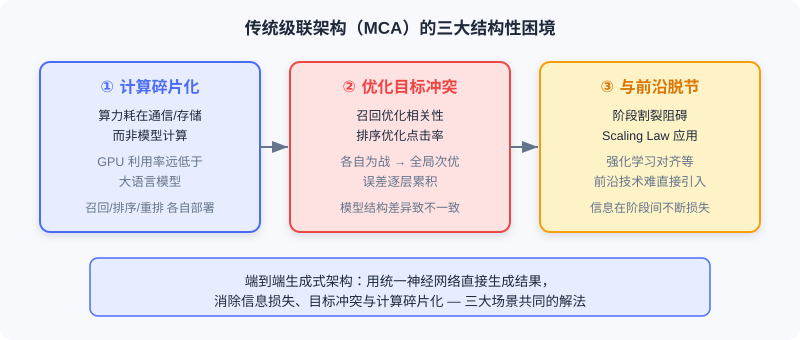

<h2 style="color: white; margin: 0 0 8px 0;">📦 Part 8: 端到端生成式应用</h2>

把推荐、搜索、广告三大业务，统一为「用户输入 → 直接生成结果」的端到端生成式系统。

📚 3 节 · ⏱️ Estimated 2 weeks · 🎯 Target: 掌握工业级端到端生成式推荐/搜索/广告的架构与对齐方法

过去十余年，推荐、搜索、广告几乎都建立在**多阶段级联架构（Multi-stage Cascading Architecture, MCA）**之上：召回、预排序、排序、重排……数据像漏斗一样层层筛选。这种设计在历史上平衡了效率与复杂度，但随着数据规模爆炸与用户体验要求提高，其结构性缺陷日益凸显——目标冲突、信息损失、计算碎片化。

本部分不再把各子任务割裂处理，而是沿**生成式范式**主线，看工业界如何用统一神经网络**直接从用户输入生成最终结果**，彻底颠覆「级联漏斗」。我们聚焦三个核心业务场景的真实落地：快手的 **OneRec**（端到端生成式推荐）、电商搜索的 **OneSug + OneSearch**（端到端生成式搜索）、在线广告的 **EGA + GPR**（端到端生成式广告）。

> 💡 **Key Insight:** 三个场景的端到端实践呈现出一条共同主线——**语义 ID 是连接生成模型与业务数据的桥梁；Encoder-Decoder 是融合上下文的主力架构；强化学习是对齐生成过程与线上业务目标的关键工具**。

---

## 本章涵盖

| 章节 | Topic | The Big Idea |
|---------|-------|--------------|
| **8.1** | 端到端生成式推荐 | OneRec-V1/V2 用语义 ID + Encoder-Decoder + 强化学习，把推荐重定义为「用户上下文 → 语义 ID 序列」的生成任务 |
| **8.2** | 端到端生成式搜索 | OneSug 做查询补全、OneSearch 做商品检索，以统一生成式架构覆盖电商搜索全链路 |
| **8.3** | 端到端生成式广告 | EGA 把竞价机制嵌入生成、GPR 用预训练统一多场景超长序列，让机制约束与生成模型深度统一 |

---

## What You'll Be Able to Do After This Part

- 🟢 **解释** 传统 MCA 的三大结构性缺陷，及其如何催生端到端生成式范式
- 🟢 **描述** 语义 ID（Semantic ID）如何把亿级物品压缩到有限词表，使生成式推荐在数学上可行
- 🟡 **对比** OneRec-V1 的 Encoder-Decoder 与 V2 的 Lazy Decoder-Only 在算力分配上的根本差异
- 🟡 **辨析** 搜索场景「先相关性、后个性化」与推荐场景优化目标的本质区别
- 🔴 **说明** EGA 如何在生成过程中内嵌激励相容（IC）与个体理性（IR）约束
- 🔴 **概述** GPR 的异构层次化解码器与价值引导 Beam Search 如何解决跨场景与超长序列难题
- 🏆 完成各节分层练习题，亲手推演语义 ID 编码、奖励建模与约束解码过程

---

## 核心概念

| Concept | 章节 | Relevance |
|----------|---------|-----------|
| 多阶段级联架构 MCA | 8.1 | 被端到端范式颠覆的传统工业骨架 |
| 语义 ID（Semantic ID） | 8.1 | 连接生成模型与离散物品/商品/广告的核心桥梁 |
| Encoder-Decoder 生成架构 | 8.1 / 8.2 / 8.3 | 融合上下文、自回归生成序列的主力结构 |
| Lazy Decoder-Only | 8.1 | 把算力集中到目标 Token，解码成本降 94% |
| 强化学习对齐（ECPO/GBPO/DPO） | 8.1 / 8.2 / 8.3 | 让生成过程对齐线上多目标业务信号 |
| 激励相容 IC 与个体理性 IR | 8.3 | 广告场景下机制设计的经济学约束 |
| 价值引导 Trie Beam Search | 8.3 | 在解码中内嵌约束、提升推理效率 |

---

## 前置知识

- 已读完 **1.1**（两种范式、端到端生成的动机）与 **2.x**（双塔、语义 ID 的初步概念）
- 了解 Transformer 的基本结构（自注意力、交叉注意力、编码器/解码器）
- 对强化学习基础概念（策略、奖励、优势）有初步认识（本部分会结合案例逐步展开）

> 本部分是生成式主线的工业落地篇，难度偏 Advanced——公式较多，但请记住：**宁可多配图，也不要死抠公式**。重点在于理解架构选择的「为什么」。

---

## Tips for This Part

1. **抓住「语义 ID」这条暗线。** 推荐、搜索、广告三节都在反复解决同一个问题——如何把离散业务对象变成生成模型能「说出」的 Token 序列。先理解语义 ID，后面水到渠成。
2. **对比着读三节。** 每节都是「MCA 的痛点 → 生成式解法 → 对齐线上目标」，但业务约束各不相同：推荐追求兴趣、搜索先保相关性、广告还要满足经济学机制。
3. **关注算力与约束的工程权衡。** OneRec-V2 的 Lazy 架构、GPR 的 Trie 约束解码，都是用架构换效率与合规的典型思路。

---

Let's dive in! 🚀
