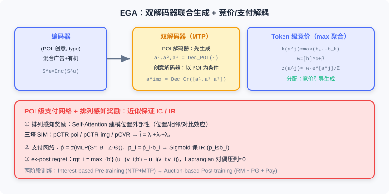
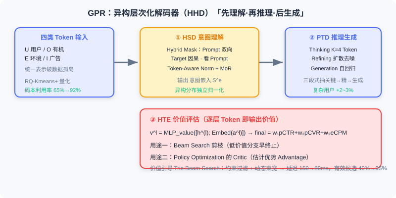
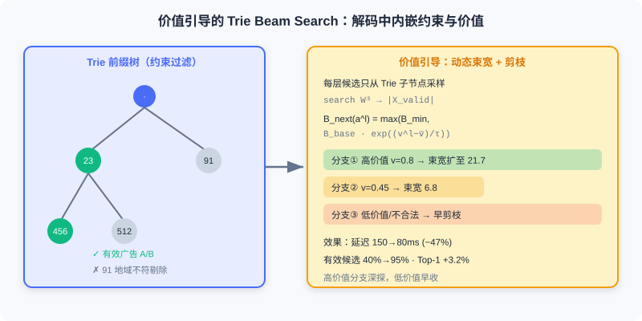

  📖
  ⏱️ ~50 min read
  🎯 Advanced

# 端到端生成式广告

> 📝 **Before You Continue:** 建议先读 [8.1](./e2e-recommendation.md) 的语义 ID / Enc-Dec / 强化学习对齐，以及 [8.2](./e2e-search.md) 的强约束检索——广告场景同时叠加了二者的技术挑战，再额外背负**经济学约束**。

[8.1](./e2e-recommendation.md) 与 [8.2](./e2e-search.md) 通过端到端生成架构解决了级联系统的性能瓶颈。但**在线广告**面临更复杂的约束：系统不仅要优化用户体验，还要平衡平台收益与广告主利益，满足竞价机制的经济学约束。传统广告系统「召回→排序→创意选择→竞价→位置分配」的多阶段架构，目标碎片化、难适应快速变化的市场。

端到端生成式广告要突破三个核心挑战：**如何把竞价机制深度融入生成过程**、**如何保证广告主的激励相容性（Incentive Compatibility, IC）**、**如何在超长异构序列中高效建模用户意图**。本节介绍两个工业方案：**EGA** 把竞价机制与生成模型统一，通过 Token 级竞价与 POI 级支付的双层设计内嵌 IC/IR 约束；**GPR** 通过异构层次化解码器与预训练，在微信生态超长异构序列中实现多场景统一建模。

读完本章，你将能够：

- 解释广告场景相对推荐/搜索的**三重约束**（IC/IR、POI+创意联合、分配支付解耦）
- 描述 **EGA** 的双模态语义 ID、概率分解生成与 Token 级竞价机制
- 说明 **ex-post regret** 与 **Lagrangian 优化** 如何近似保证激励相容
- 概述 **GPR** 的四类 Token、RQ-Kmeans+、异构层次化解码器与价值引导 Trie Beam Search
- 完成 5 道分层练习题，巩固竞价聚合、支付网络与层次化策略优化

---

## 8.3.0 广告生成的三重约束

通过一个场景理解广告与推荐、搜索的本质差异：用户在本地生活平台刷 feed，系统要在第 3 位插一条广告，候选是附近餐厅、健身房、美容院，每个商户提交不同竞价 $b_i$，且各有若干创意图。一次前向传播要完成四个决策——展示哪个商户（POI）、用哪张创意、如何计算支付、如何保证公平。这揭示三重重约束：

**约束一：激励相容性（IC）与个体理性（IR）。** 广告主是独立博弈方，会依规则调竞价。IC 要求如实出价是最优策略：对真实估值 $v_i$ 与申报 $b_i$，$b_i=v_i$ 时效用最大：

$$u_i(v_i; v_i, \boldsymbol{b}_{-i}) \geq u_i(v_i; b_i, \boldsymbol{b}_{-i}), \quad \forall b_i \in \mathbb{R}^+$$

效用 $u_i = (v_i - p_i) \cdot \text{pCTR}_i$（点击收益减支付）。IR 要求支付不超竞价 $p_i \leq b_i$。传统 GSP 拍卖按「下一位价格支付」保 IC，但假设广告相互独立、无法处理位置外部性。

**约束二：POI 与创意的联合生成。** 一个 POI（餐厅）可关联多张创意图，不同用户偏好不同创意。系统须联合决定「展示哪个 POI」与「用哪张创意」——POI 定内容主体，创意优化呈现方式。

**约束三：分配与支付的解耦设计。** 若直接把竞价当生成概率权重，会导致「赢家诅咒」：高竞价广告按自己竞价支付，广告主倾向压价。EGA 分离**分配**（竞价引导生成概率）与**支付**（独立网络学 IC 支付函数）两模块解决矛盾。

> 💡 **Key Insight:** 广告的端到端难点，是生成模型要「顺便」满足一套经济学机制——这不只影响目标函数，更要求架构上把「分配」与「支付」解耦，才可能用数学保证 IC/IR。

---

## 8.3.1 EGA：统一竞价与生成

### 双模态语义 ID 与概率分解

EGA 用 **RQ-VAE** 把 POI 与创意的连续表示离散为多层语义 ID（两套独立语义空间）。POI 原始表示含类目、地理位置、统计特征、文本描述；创意表示含视觉特征、OCR 文案、创意类型。用 $C=3$ 层残差量化、码本 $W=1024$，每个 POI 编码为 3 个 Token：

$$\boldsymbol{a}_i^{\text{poi}} = (a_i^{1}, a_i^{2}, a_i^{3}), \quad a_i^{j} \in \{1, 2, \ldots, 1024\}$$

创意同理得 $\boldsymbol{a}_i^{\text{img}}$。用户历史交互表示为 (POI, 创意) 对序列。

**概率分解策略。** 直观想法是把 POI 与创意的 6 个 Token 拼接自回归生成，但 EGA 发现这会导致 POI 与创意不匹配（「餐厅 A 的 POI + 健身房 B 的创意」）。于是分解为：

$$P(\boldsymbol{a}_{t+1}^{\text{poi}}, \boldsymbol{a}_{t+1}^{\text{img}} \mid \mathcal{S}^u_{1:t}) = P(\boldsymbol{a}_{t+1}^{\text{poi}} \mid \mathcal{S}^u_{1:t}) \cdot P(\boldsymbol{a}_{t+1}^{\text{img}} \mid \boldsymbol{a}_{t+1}^{\text{poi}}, \mathcal{S}^u_{1:t})$$

直觉：POI 定「展示什么」，创意定「如何呈现」。先据兴趣生成 POI，再据 POI 特性与用户偏好选创意。

### Encoder-Decoder 双解码器

EGA 用经典 Enc-Dec，但用**两个解码器**分别生成 POI 与创意。编码器处理混合了广告与有机内容的历史序列 $\mathcal{S}^u$（每项标 type∈{ad, organic}），输出 $\mathcal{S}^e = \text{Encoder}(\mathcal{S}^u)$。**POI 解码器** 自回归生成 3 层语义 ID；**创意解码器** 以生成的 POI Token 为条件生成创意 ID——输入含 POI Token 序列，使模型据 POI 语义选匹配创意。

**MTP 模块。** 标准解码器每步只预测下一 Token；EGA 用 **MTP（Multi-Token Prediction）** 每步同时监督两解码器，让它们共享底层表示、加速收敛并提升一致性：

$$\mathcal{L}_{\text{pre-train}} = \mathcal{L}_{\text{NTP}}^{\text{POI}} + \mathcal{L}_{\text{MTP}}^{\text{Creative}}$$

### 排列感知奖励模型：处理位置外部性

预训练模型不知「哪个广告更好」。竞价微调需要奖励模型，但广告场景必须处理**位置外部性**——广告非独立：位置效应（位置 1 的 CTR 远高于位置 5）、相邻效应（两个相邻餐饮广告相互抑制）、对比效应（高质量后跟低质量 CTR 下降）。数学上：

$$\text{pCTR}_i = f(\text{user}, \text{item}_i, \mathcal{Y}_{-i}, \text{pos}_i)$$

传统 point-wise 模型（DeepFM、Wide&Deep）无法建模序列级依赖。EGA 用 **permutation-aware（排列感知）** 设计，通过 Self-Attention 让每个广告「看到」序列中其他广告：

$$\boldsymbol{h}_i = [\text{Embed}(\boldsymbol{a}_i^{\text{poi}}); \text{Embed}(\boldsymbol{a}_i^{\text{img}}); \boldsymbol{e}_i^{\text{poi}}], \quad \boldsymbol{h}_f = \text{SelfAttention}(\boldsymbol{h} W^Q, \boldsymbol{h} W^K, \boldsymbol{h} W^V)$$

三个独立塔分别预测 **POI-CTR / Creative-CTR / CVR**，综合奖励：

$$\hat{r}_i = \lambda_1 \hat{r}_i^{\text{pctr-poi}} + \lambda_2 \hat{r}_i^{\text{pctr-img}} + \lambda_3 \hat{r}_i^{\text{pcvr}}$$

> **Analysis:** 排列感知奖励模型是 EGA 相对 OneRec P-Score 的关键差异——它把「序列级位置外部性」建模进奖励，而非 point-wise 预估。代价是 Self-Attention 在序列长度上 $O(K^2)$，且需额外训练三塔奖励模型。

### Token 级竞价：最大值聚合

生成式框架输出 Token 序列，而 Token 与广告是**多对多**关系（一个广告编成多个 Token；一个 Token 可能对应多个广告），传统 item-level bid 不可用。EGA 用两层设计：

**Token 级竞价聚合（最大值）。** 对第 $j$ 层 Token $a_i^j$ 对应的广告集 $\{x_1,\ldots,x_{N_i}\}$，用**最大值**聚合竞价：

$$b(a_i^j) = \max(b_1, b_2, \ldots, b_{N_i})$$

为何 max 而非 avg？若某 Token 对应高竞价广告，生成它有高商业价值，应提升概率；avg 会被低竞价稀释。基于此定义分配概率：

$$z(a_i^j) = \frac{w(a_i^j) \cdot e^{a_i^j}}{\sum_{k=1}^W [w(a^{j,k}) \cdot e^{a^{j,k}}]}, \quad w(a_i^j) = [b(a_i^j)]^\alpha + \beta$$

- $\alpha$：竞价影响权重。$\alpha=0$ 退化为纯兴趣推荐，$\alpha\to\infty$ 变纯竞价排序。
- $\beta$：广告与有机内容比例。$\beta$ 越大，有机内容（竞价 0）生成概率越高。

### POI 级支付网络：学习满足 IC 的支付

直接按生成概率 $z$ 支付有问题：生成概率不可微且难保 IC。EGA **解耦分配与支付**：分配用竞价引导，支付用独立神经网络学 IC 支付函数。支付网络输入含 POI 序列表示、自排除竞价矩阵（仅依赖他人竞价与自己分配，是 IC 关键）、期望价值（分配概率 × pCTR）。Sigmoid 输出支付率：

$$\hat{p} = \sigma(\text{MLP}(\mathcal{S}^*; \mathcal{B}^-; \mathcal{Z} \cdot \Theta)), \quad p_i = \hat{p}_i \cdot b_i$$

Sigmoid 保证 $\hat{p}_i \in [0,1]$，从而满足 IR $p_i \leq b_i$。

**Ex-post Regret 约束。** 借鉴机制设计量化 IC 违反：对广告主 $i$，如实出价效用 $u_i(v_i; v_i, \boldsymbol{b}_{-i}) = (v_i - p_i)\cdot\text{pCTR}_i$，谎报最大收益为 regret：

$$\text{rgt}_i = \max_{b'_i} \{u_i(v_i; b'_i, \boldsymbol{b}_{-i}) - u_i(v_i; v_i, \boldsymbol{b}_{-i})\}$$

$\text{rgt}_i=0$ 时如实出价最优。实践中采样候选竞价近似。EGA 用 **Lagrangian 对偶** 求解约束优化（最大化收益、regret 约束近 0）：

$$\mathcal{L}_{\text{Pay}} = -\frac{1}{|\mathcal{D}|}\sum_{d} \left( \sum_i p_i \hat{r}_i^{\text{pctr}} - \sum_i \lambda_i \widehat{\text{rgt}}_i - \frac{\rho}{2} \sum_i (\widehat{\text{rgt}}_i)^2 \right)$$

交替更新：固定 $\lambda$ 优化支付网络；固定网络更新 $\lambda_i^{\text{new}} = \lambda_i^{\text{old}} + \rho \cdot \widehat{\text{rgt}}_i$。regret 高的广告主，其 $\lambda$ 增大，迫使损失更关注降其 regret。

### 两阶段联合训练

**阶段一 Interest-based Pre-training**：忽略竞价，用曝光序列训 NTP+MTP 联合损失，得基础生成模型 $\mathcal{F}$。

**阶段二 Auction-based Post-training**：引入竞价、奖励模型、支付网络，三子任务交替：(1) 奖励模型用真实反馈训多任务 BCE，冻结构成评估器；(2) **Policy Gradient** —— 非自回归策略梯度，边际贡献奖励 $r_{y_i} = \sum b_j \hat{r}_j^{\text{pctr}} - \sum_{y_j \in \mathcal{S}^*_{-i}} b_j \hat{r}_j^{\text{pctr}}$，损失 $-\sum r_{y_i} \log z_{y_i}$；(3) 支付网络用 Lagrangian 最小化 ex-post regret。

> **Analysis:** EGA 的核心价值是把「竞价机制」从外部规则变成生成模型内部可微的一部分——Token 级竞价引导分配、POI 级支付网络保证 IC。相对 OneRec 的差异在于引入竞价信号、IC 约束与排列感知。局限：RQ-VAE 与 Enc-Dec 针对单一场景，难统一跨场景；标准 Transformer 输入受限 $O(L^2)$ 难处理数万长序列；Beam Search 生成大量无效候选增延迟。这催生了 GPR。

---

## 8.3.2 GPR：预训练驱动的广告生成

EGA 强调「竞价驱动」；**GPR（Generative Pre-trained Recommender）** 采用「预训练 + 微调」范式，先在海量无监督数据上学通用兴趣表示，再经价值感知微调与 RL 对齐业务目标。它在微信生态（视频号/朋友圈/公众号/小程序）应对跨场景、超长序列、100ms 实时性挑战。

### 统一输入表示：四类 Token

GPR 把用户完整行为旅程编码为四类 Token 的混合序列：

1. **U-Token（User）**——静态属性与长期偏好（人口统计、消费力、兴趣标签）
2. **O-Token（Organic）**——浏览的有机内容（短视频 RQ-VAE 语义 ID、文章文本表示、好友动态多模态表示）
3. **E-Token（Environment）**——即时环境（时间、地理位置、设备、场景标识）
4. **I-Token（Item）**——交互过的广告 item（RQ-VAE 语义 ID，含 POI+创意）

这种表示：场景统一（不同场景内容同一套 Token）、时序连贯（跨场景形成时间线）、上下文丰富（每个 I-Token 周围有 O/E-Token 提供上下文）。

### RQ-Kmeans+：解决 Codebook Collapse

O/I-Token 量化时传统 RQ-VAE 面临 **codebook collapse**：随机初始化码本中某些码字从未激活，利用率仅 60–70%。**RQ-Kmeans+** 结合 RQ-Kmeans 高质量初始化与 RQ-VAE 端到端优化：

**步骤 1** RQ-Kmeans 在残差上 K-means 构建初始码本（保证每码字至少分配到样本，避免死码字）。
**步骤 2** 用其作 RQ-VAE 初始权重，编码器侧加残差连接 $\boldsymbol{z} = \text{Encoder}(\boldsymbol{e}) + \alpha \cdot \boldsymbol{e}$（$\alpha\in[0,1]$ 可学），再用标准 RQ-VAE 损失端到端训练。效果：码本利用率从 65% 升至 92%，重构误差降 15%。

### 异构层次化解码器（HHD）

EGA 的 Enc-Dec 把编码器解码器紧耦合，数万长序列会显存/算力瓶颈。GPR 提出 **HHD（Heterogeneous Hierarchical Decoder）**，三层解耦实现「先理解、再推理、后生成」：

**第一层 HSD（Sequence-wise Decoder）——意图理解。** 用改进 HSTU 架构，含三设计：
- **Hybrid Attention Mask**——U/O/E-Token（Prompt）区域双向注意力、充分交互；I-Token（Target）区域因果注意力、保证自回归；Target 可看完整 Prompt。
- **Token-Aware Normalization**——U/O/E/I 四类 Token 分布差异巨大，各分配独立 LayerNorm 与 FFN，投影到各自语义子空间。
- **MoR（Mixture-of-Recursions）**——同层递归调用自身 $R$ 次（可学权重 $w_r$），不增参却增加推理深度，类似「多轮思考」。

HSD 输出**意图嵌入** $\mathcal{S}^e$。

**第二层 PTD（Token-wise Decoder）——推理与生成。** 设计「Thinking-Refining-Generation」三段式：
- **Thinking**：生成 $K=4$ 个 Thinking Tokens（可学查询向量经 Cross-Attention 从意图嵌入提取关键信号，过滤无关）。
- **Refining**：借鉴 Self-Reflection，对 Thinking Tokens 加高斯噪声后条件去噪 Transformer 迭代优化（类似 Stable Diffusion），提升复杂用户生成质量 2–3%。
- **Generation**：基于 refined 表示自回归生成目标广告语义 ID（3 层 RQ）。

**第三层 HTE（Token-wise Evaluator）——价值评估。** 在**每一层 Token 生成时就输出价值估计** $v^l = \text{MLP}_{\text{value}}([\boldsymbol{h}^{(l)}; \text{Embed}(a^l)])$，最终广告价值 $final\_value = w_1\cdot\text{pCTR}+w_2\cdot\text{pCVR}+w_3\cdot\text{eCPM}$。HTE 用于 Beam Search 剪枝与 Policy Optimization 的 Critic。

### 价值引导的 Trie Beam Search

EGA 标准 Beam Search 生成大量无效候选（预算耗尽、定向不匹配、地域限制）。GPR 提出 **Value-Guided Trie-based Beam Search**，把价值估计与约束过滤集成进解码：

**Trie 树约束。** 依用户画像与广告投放约束（年龄/定向/预算/地域）过滤出有效广告子集 $\mathcal{X}_{\text{valid}}$，提取各自 3 层语义 ID 构建 Trie 前缀树。解码第 $l$ 层时只从 Trie 当前节点子集合采样，而非全码本（$W=1024$），搜索空间从 $W^3$ 缩到 $|\mathcal{X}_{\text{valid}}|$。

**价值动态调整束宽。** 标准 Beam Search 固定束宽 $B$；GPR 依 HTE 价值动态调整：

$$B_{\text{next}}(a^l) = \max\left(B_{\text{min}}, B_{\text{base}} \times \exp\left(\frac{v^l - \bar{v}}{\tau}\right)\right)$$

价值远高于均值的分支获更宽束宽探索更多，低价值分支提前收缩。实际效果：推理延迟从 150ms 降至 80ms（降 47%）、有效候选占比从 40% 升至 95%、Top-1 准确率提升 3.2%。

左：Trie 前缀树按用户画像与投放约束过滤出有效广告子集，解码只在合法子节点上展开，搜索空间从 $W^3$ 缩到 $|\mathcal{X}_{\text{valid}}|$；右：每层用 HTE 价值估计动态调整束宽——高价值分支被保留、低价值被剪枝。

下面用交互演示感受生成式检索的 Beam Search 解码：从根节点出发，每层在（受 Trie 约束的）候选 Token 间展开分支，HTE 价值高的分支被保留、低价值被剪枝，最终输出有效广告语义 ID 序列。点击「下一步」观察逐层展开。

<iframe src="../viz/part8-beamsearch.html?embed&vizId=part8-beamsearch" style="width:100%; height:520px; border:none; display:block;" loading="lazy"></iframe>

注意每一步的「剪枝」：未通过 Trie 约束（如地域不符）或 HTE 价值过低的候选在生成早期就被丢弃，这正是 GPR 把「合法性」与「价值」做成解码硬约束、把延迟砍掉近一半的关键。

### 多阶段训练策略

**阶段一 MTP 预训练**：海量微信全场景行为日志（视频号/朋友圈/公众号/广告），目标 $\mathcal{L}_{\text{pre-train}} = \mathcal{L}_{\text{NTP}}^{\text{POI}} + \mathcal{L}_{\text{MTP}}^{\text{Creative}}$，数十亿用户、数千亿交互，最大 8B 参数。

**阶段二 Value-Aware Fine-tuning**：冻结 HSD/PTD，只用真实反馈训 HTE 多任务塔（BCE 损失），引入点击/转化业务监督。

**阶段三 HEPO（Hierarchy Enhanced Policy Optimization）**：同时在 token 级与 item 级做策略梯度。Token 级优势 $A_{\text{token}}^l = v^l - \bar{v}^l$（方差远小于 item 级）；Item 级奖励 $R_{\text{item}} = b_i \cdot \hat{r}_i^{\text{pctr}} + \lambda \cdot \hat{r}_i^{\text{pcvr}}$；层次化聚合 $A_{\text{item}} = \sum_{l=1}^{C} \gamma^l A_{\text{token}}^l$。损失：

$$\mathcal{L}_{\text{HEPO}} = -\mathbb{E} \left[ \sum_{l=1}^C A_{\text{token}}^l \log \pi_\theta(a^l) + \beta \cdot A_{\text{item}} \log \pi_\theta(\text{item}) \right]$$

好处：低方差（token 空间小）、精细控制（定位哪层 token 致低价值）、快速收敛（密集 token 梯度信号）。

### 设计权衡

GPR 全量上线微信视频号广告，相对级联系统：GMV 与 CTCVR 提升、推理延迟从 200ms+ 降至 80ms、模型从 5 个独立模型简化为 1 个。权衡在于：
- **架构复杂度 vs 场景通用性**：HHD 三层 + Thinking-Refining-Generation 代码量为 EGA 2 倍以上，但换来跨场景统一（视频号/朋友圈/公众号共用一模型）。
- **预训练成本 vs 零样本迁移**：预训练耗数千 GPU 卡数周，但新场景上线只需少量微调。
- **端到端优化 vs 可解释性**：黑盒难定位异常，靠 Thinking Tokens 可视化、HTE 分层价值输出部分缓解。

---

## ⚠️ Common Mistakes in 8.3

| # | Mistake | Example | Why It's Wrong | Fix |
|---|---------|---------|---------------|-----|
| 1 | 忽略广告的经济学约束 | 「广告也只优化点击率」 | 广告主会博弈出价，需 IC/IR | 用支付网络 + ex-post regret 保 IC |
| 2 | POI 与创意拼接生成 | 「6 个 Token 拼一起自回归」 | 易生成 POI-创意不匹配组合 | 概率分解为先 POI 后创意 |
| 3 | Token 竞价用 avg 聚合 | 「取广告集平均竞价」 | 高竞价信号被低竞价稀释 | 用 max 聚合突出高价值 Token |
| 4 | 直接按生成概率支付 | 「p_i ∝ z(a_i^j)」 | 不可微且难保 IC | 分配/支付解耦，独立支付网络 |
| 5 | 全用 RQ-VAE 致码本坍塌 | 「随机初始化码本端到端」 | 死码字使利用率仅 65% | RQ-Kmeans+ 先高质量初始化 |
| 6 | Beam Search 不约束 | 「全码本 W^3 解码」 | 生成大量无效候选增延迟 | Trie 约束 + HTE 价值引导剪枝 |

---

## 本章小结

### 📌 Key Takeaways

| Concept | Key Points | Why It Matters |
|---------|-----------|----------------|
| 三重约束 | IC/IR、POI+创意联合、分配支付解耦 | 广告相对推荐/搜索独有的经济学挑战 |
| EGA | 双解码器 + Token 级 max 竞价 + POI 级支付网络 | 竞价机制与生成模型深度统一 |
| ex-post regret + Lagrangian | 采样近似 regret，对偶更新 λ | 近似保证 IC、平衡收益 |
| 排列感知奖励 | Self-Attention 建模位置外部性 | 广告非独立，point-wise 预估失效 |
| GPR | 四类 Token + RQ-Kmeans+ + HHD + 价值引导 Trie Beam Search | 跨场景、超长序列的统一广告生成 |
| HEPO | token 级 + item 级层次化策略梯度 | 低方差、精细控制、快速收敛 |

### ❓ FAQ

**Q1: 为什么 EGA 的 Token 竞价用 max 而非 avg？**
> A: 一个语义 Token 可能对应多个广告，其中若有高竞价者，生成该 Token 就有高商业价值，应提升其概率。avg 会把高竞价信号被同组低竞价广告稀释，max 突出价值峰。

**Q2: 分配与支付为何必须解耦？**
> A: 若直接按生成概率支付，概率不可微、且「赢家诅咒」使广告主压价。解耦后，分配用竞价引导生成（可微 Softmax），支付用独立网络学 IC 函数（Sigmoid 保 IR），才可能用数学约束近似保证 IC。

**Q3: GPR 的 Trie Beam Search 相比标准 Beam Search 好在哪？**
> A: 标准 Beam Search 在完整码本 $W^3$ 上展开，生成大量无效候选（预算耗尽/定向不符/地域限制）需后处理。Trie 依约束预过滤有效广告，解码早期就只走合法分支；再依 HTE 价值动态调束宽，延迟降 47%、有效候选占比升至 95%。

### 🔗 前后关联

- **8.1**（端到端生成式推荐）的语义 ID / Enc-Dec / RL 对齐是 EGA、GPR 的方法基础。
- **8.2**（端到端生成式搜索）的强约束检索（KHQE、约束 Beam Search）与 GPR 的 Trie 约束解码一脉相承。
- **6.x**（生成式基础）的 RQ-VAE 量化，在本节以 EGA 的 RQ-VAE 与 GPR 的 RQ-Kmeans+ 两种形态出现。
- **9.1–9.3**（生成式思考/推理）将进一步讨论 Thinking Tokens 类「推理步骤」如何提升生成质量，与 GPR 的 PTD Thinking-Refining 阶段互补。

---

## Practice Problems

Work through all problems in order — they get progressively harder. Each has a complete solution you can reveal after trying it yourself.

---

**Problem 8.3.1 — Token 级竞价聚合** 🟢 Easy

某语义 Token $a^j$ 对应 3 个广告，竞价分别为 $b_1=2.0, b_2=0.5, b_3=3.0$。求 (a) max 聚合下的 Token 竞价 $b(a^j)$；(b) 若改用 avg 聚合结果是多少；(c) 为何 max 更合理？

💡 Solution (click to reveal)

**Approach:** 直接套聚合公式。

- (a) $b(a^j) = \max(2.0, 0.5, 3.0) = 3.0$。
- (b) avg = $(2.0+0.5+3.0)/3 = 5.5/3 \approx 1.83$。
- (c) 该 Token 含一个高竞价广告（$b=3.0$），生成它商业价值高，max 把概率质量集中到这个价值峰；avg 被 $b=0.5$ 稀释，弱化了高竞价信号——这正是 max 的设计动机。

**Key points:**
- max 突出价值峰，avg 平滑掉极端值。
- 生成式广告的竞价聚合本质是「多对多」映射的处理策略。

---

**Problem 8.3.2 — 支付率与 IR 约束** 🟢 Easy

某广告主申报竞价 $b_i=5.0$，支付网络输出支付率 $\hat{p}_i=0.6$。求实际支付 $p_i$，并判断是否满足个体理性（IR）约束 $p_i \leq b_i$。

💡 Solution (click to reveal)

**Approach:** $p_i = \hat{p}_i \cdot b_i$。

$p_i = 0.6 \times 5.0 = 3.0$。因 Sigmoid 保证 $\hat{p}_i \in [0,1]$，有 $p_i = 0.6 \times 5.0 \leq 5.0 = b_i$，满足 IR 约束。

**Key points:**
- 支付率经 Sigmoid 天然落在 [0,1]，故 $p_i \leq b_i$ 自动成立。
- IR 是广告主参与拍卖的基本前提（不会付超过出价）。

---

**Problem 8.3.3 — ex-post regret 直觉** 🟡 Medium

广告主 $i$ 真实估值 $v_i=10$，如实出价 $b_i=10$ 时支付 $p_i=4$、pCTR=0.5，效用 $u=(10-4)\times0.5=3$。若谎报 $b'_i=6$，新支付 $p'_i=2$、pCTR 不变，效用 $u'=(10-2)\times0.5=4$。求 ex-post regret $\text{rgt}_i$，并说明该机制是否近似满足 IC。

💡 Solution (click to reveal)

**Approach:** regret = 谎报最大收益 − 如实收益。

$\text{rgt}_i = \max_{b'_i}\{u_i(v_i; b'_i, \boldsymbol{b}_{-i}) - u_i(v_i; v_i, \boldsymbol{b}_{-i})\} = 4 - 3 = 1 > 0$。

该机制**不满足** IC：广告主通过谎报（压低出价）获得了更高效用（4 > 3），存在正 regret。EGA 的目标正是通过 Lagrangian 优化把 $\widehat{\text{rgt}}_i$ 压到接近 0——本例中支付网络需调整，使如实出价成为最优策略。

**Key points:**
- $\text{rgt}_i=0$ 是 IC 成立的判据。
- 正 regret 意味着机制可被博弈，需支付网络学习修正。

---

**Problem 8.3.4 — 价值引导束宽** 🔴 Hard

Beam Search 第 $l$ 层某 Token 价值 $v^l=0.8$，当前所有分支平均价值 $\bar{v}=0.5$，温度 $\tau=0.3$，基础束宽 $B_{\text{base}}=8$，最小束宽 $B_{\text{min}}=2$。求该分支下一层束宽 $B_{\text{next}}$。若另一分支 $v^l=0.45$（低于均值），其束宽又是多少？

💡 Solution (click to reveal)

**Approach:** 套价值动态调整公式。

分支 1（$v^l=0.8$）：
$\exp((0.8-0.5)/0.3) = \exp(1.0) \approx 2.718$
$B_{\text{next}} = \max(2, 8 \times 2.718) = \max(2, 21.7) = 21.7$

分支 2（$v^l=0.45$）：
$\exp((0.45-0.5)/0.3) = \exp(-0.167) \approx 0.846$
$B_{\text{next}} = \max(2, 8 \times 0.846) = \max(2, 6.77) = 6.77$

**答：** 高价值分支束宽扩大到约 21.7（探索更多），低价值分支收缩到约 6.77（但仍保 $B_{\text{min}}=2$ 不被完全抛弃）。

**Key points:**
- 价值越高分支束宽越宽，实现「高价值深探、低价值早收」。
- $B_{\text{min}}$ 保证即使低价值也保留少量探索，避免过早错过。

---

**🏆 Challenge: 设计广告端到端落地论证**

某本地生活平台广告系统当前是「召回→排序→创意→竞价→分配」五级级联，跨视频/信息流/搜索三场景各训一模型。请写约 170 字论证：引入 GPR 类端到端生成式架构时，(1) 四类 Token 如何统一三场景；(2) 相比 EGA，GPR 在超长序列与推理效率上靠哪两个设计突破；(3) 需警惕什么新风险？

💡 Hint

(1) 四类 Token（U/O/E/I）把视频、信息流、搜索的内容与广告都用同一套语义体系表示，跨场景行为形成连贯时间线，破数据孤岛与模型碎片化。(2) 超长序列靠 HSD 的 Hybrid Mask + MoR 递归推理与 Q-Former 式压缩；推理效率靠价值引导 Trie Beam Search 在解码早期过滤无效候选，延迟降近半。(3) 新风险：HHD 架构与 Thinking-Refining 范式代码量为 EGA 2 倍以上、训练成本高；端到端黑盒可解释性差，bad case 难定位（需 Thinking Tokens 可视化、HTE 分层价值输出缓解）。

