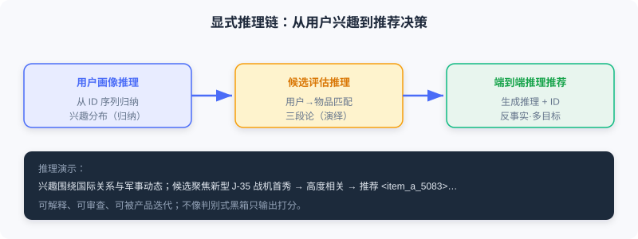
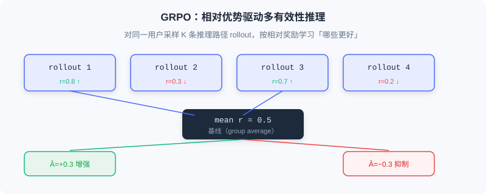

<div class="badge-row">
  <span style="background: #f0f4ff; color: #4A6CF7; padding: 4px 12px; border-radius: 20px; font-size: 0.85em; font-weight: 600; border: 1px solid rgba(74,108,247,0.2);">📖</span>
  <span style="background: #fef9ec; color: #d97706; padding: 4px 12px; border-radius: 20px; font-size: 0.85em; border: 1px solid rgba(100,100,100,0.15);">⏱️ ~36 min read</span>
  <span style="background: #fef2f2; color: #dc2626; padding: 4px 12px; border-radius: 20px; font-size: 0.85em; border: 1px solid rgba(100,100,100,0.15);">🎯 Advanced</span>
</div>

# OneRec-Think 的思考框架

> 📝 **Before You Continue:** 先读完 [9.1](./semantic-alignment.md) 的语义对齐——OneRec-Think 的整套推理建立在「模型已认识物品」之上。也建议回顾 [5.3](./../part5-trends/generative-trend.md) 的 OneRec 端到端生成，本章是它从「会生成」到「会思考」的升级。

当 PLUM 在 YouTube 上验证了协同语义与语言语义可在工业规模统一时，推荐与 LLM 的融合似乎水到渠成。但一个关键问题浮现：这些模型虽然能高效生成推荐，其推理过程仍是**隐式的黑箱**——模型推荐一个视频时，我们无法知道它依据了哪些历史行为，也不清楚它如何权衡内容相似性与协同信号。更重要的是，它们无法像 ChatGPT 那样通过 **Chain-of-Thought（思维链）** 做显式推理——而后者正是 LLM 在复杂任务上突破的核心能力。

**OneRec-Think** 正是为填补这一空白而生。它不满足于让 LLM 仅仅「认识」物品，而是要让 LLM **先思考再推荐**。本章我们剖析它如何让模型从「隐式预测器」变为「显式推理者」。

读完本章，你将能够：

- **描述**OneRec-Think 的三阶段训练框架（物品对齐 → 推理激活 → 推理增强）
- **解释**推理脚手架如何用渐进任务「激活」模型的归纳/演绎/反事实推理
- **复述**推荐特定奖励如何应对「多有效性」挑战，以及 GRPO 的相对优势机制
- **说明**Think-Ahead 架构如何把密集推理从在线关键路径剥离、满足实时延迟
- 完成 4 道分层练习题，巩固从对齐到增强的推理范式

---

## 9.2.0 从「认识物品」到「学会思考」

传统模型直接输出物品 ID，而 OneRec-Think 会先生成一段推理：

```
用户的观看历史主要围绕国际关系和军事动态展开，
表现出对军事装备和技术进步的强烈兴趣……
因此推荐聚焦中国军事技术进步的视频，
特别是新型 J-35 战斗机首次亮相的内容……
```

这种显式推理不仅提升可解释性，更重要的是**推理过程本身为决策提供了结构化思考路径**，让模型更准确捕捉用户意图的多个层次。OneRec-Think 把**自然语言交互、显式推理生成、端到端推荐**统一在同一框架中——用户可对话表达需求，模型基于历史与上下文生成推理，最后直接生成物品语义 ID，无需预定义候选集。

### 🧠 Mental Model: 从「直觉型评委」到「会写批注的导师」

> 判别式模型像凭直觉打分的评委，给个分就完事；OneRec-Think 像一位会在卷面上写满批注的导师——先分析学生（用户）的特点，再评价每份答案（候选）的契合度，最后给出推荐并附理由。批注（推理）本身就是决策的一部分，而非事后装饰。

---

## 9.2.1 三阶段训练框架

OneRec-Think 的核心是精心设计的**三阶段训练框架**：物品对齐（Itemic Alignment）、推理激活（Reasoning Activation）、推理增强（Reasoning Enhancement）。


### 物品对齐：让模型「认识」物品

OneRec-Think 继承 LC-Rec/OneRec 的语义 ID 思路，并针对短视频（内容碎片化、行为极快）做优化。它采用**分层表征融合**：文本塔、视觉塔、音频塔、协同塔分别提取特征，再用**注意力加权**动态融合（不同视频各模态重要性差异巨大——美食靠视觉、脱口秀靠音频）：

$$\boldsymbol{e}_{\text{content}} = \sum_{m \in \{\text{text, visual, audio, cf}\}} \alpha_m \cdot \boldsymbol{e}_m$$

关键创新是 **Item-Textual Alignment（物品-文本对齐）**：给定不同长度 ID 前缀，生成相应粒度描述：

```
输入: <item_a_8121>                     → 输出: 这是一个街头美食类视频
输入: <item_a_8121><item_b_3259>        → 输出: 繁华街头市场的美食视频,含各种小吃摊位
输入: <item_a_8121><item_b_3259><item_c_6391> → 输出: 街头市场,小贩叫卖烤串、炒饭...
```

这种逐层细化训练让**语义 ID 被「锚定」到 LLM 原有语言语义网络中**——看到 `<item_a_8121>` 的神经元激活模式与看到「街头美食」高度相似，为推理激活奠定神经基础。对齐目标结合双向任务：

$$\mathcal{L}_{\text{align}} = \mathcal{L}_{\text{ID2Text}} + \mathcal{L}_{\text{Text2ID}} = -\mathbb{E}_{(i,t)}\left[\log P(t|i;\theta) + \log P(i|t;\theta)\right]$$

### 推理激活：用脚手架「激活」思考

完成对齐后，模型「认识」了物品，但还不会「思考」。类比人类：学生认识了所有公式，不代表会解复杂题——后者需要学会分解问题、选公式、逐步推导。**推理脚手架（Reasoning Scaffolding）** 扮演「思维训练」角色，分三层渐进激活：

**用户画像推理（归纳）**——给定历史交互序列，生成结构化兴趣总结：

```
主要兴趣:幽默短剧、影视解说(>60%)和轻松娱乐;次要兴趣:宠物、传统文化、地方美食
```

模型需从离散 ID 识别内容主题、统计占比、组织成连贯画像，训练**归纳推理**。

**候选评估推理（演绎）**——给定用户画像与候选物品，生成匹配度推理：

```
候选聚焦中国军事技术进步(J-35首秀),与用户对军事装备的强烈兴趣高度相关→高度相关
```

训练**演绎推理**：建立「用户兴趣→物品内容→匹配判断」的三段论链条。

**端到端推理式推荐**——无候选集下直接从历史生成推荐 ID 与完整推理，额外引入**反事实推理**（当用户需求与历史冲突时如何调整）与**多目标权衡**（相关性 vs 情感需求）。



训练目标为加权三层次损失 $\mathcal{L}_{\text{scaffold}} = \lambda_1 \mathcal{L}_{\text{profile}} + \lambda_2 \mathcal{L}_{\text{eval}} + \lambda_3 \mathcal{L}_{\text{e2e}}$。其精髓是**渐进性**——像教育学的脚手架教学法：先给明确结构支撑，待模型掌握后逐步撤去，让其独立完成。

### 推理增强：用强化学习精炼路径

模型能生成推理后，新挑战出现：**如何评价推理质量好坏？** 数学题答案非对即错；但推荐中同一用户可能有数十个「正确」选择（科幻、纪录片、搞笑都有效）。这种**多有效性（Multi-Validity）**是推荐区别于传统 NLP 的根本特性——若简单套用监督/强化学习，模型可能因推荐了「不在标签里但用户会喜欢」的物品而受罚，变得过度保守。

OneRec-Think 用**推荐特定奖励函数**综合四维信号：

$$r(s, a) = \lambda_1 \cdot r_{\text{cf}}(a, \mathcal{H}_u) + \lambda_2 \cdot r_{\text{sem}}(a, p_u) + \lambda_3 \cdot r_{\text{coh}}(s, a) + \lambda_4 \cdot r_{\text{feedback}}(a)$$

- $r_{\text{cf}}$：推荐与历史的协同相似度（即使不在标签中，只要协同空间近就给正奖）
- $r_{\text{sem}}$：推荐内容与用户画像的语义匹配度
- $r_{\text{coh}}$：推理文本与最终物品的连贯性（用 NLI 模型判，脱节要罚）
- $r_{\text{feedback}}$：真实用户反馈（完播+点赞=1.0，快速划过=-0.5）

典型权重 $\lambda_1{=}0.3, \lambda_2{=}0.2, \lambda_3{=}0.2, \lambda_4{=}0.3$。基于该奖励，OneRec-Think 用 **GRPO** 优化：对同一用户采样 $K$ 条 rollout $\{(s_k, a_k)\}$，计算相对优势：

$$\hat{A}_k = r(s_k, a_k) - \frac{1}{K}\sum_{j=1}^{K}r(s_j, a_j)$$

$$\mathcal{L}_{\text{GRPO}} = -\frac{1}{K}\sum_{k=1}^{K} \hat{A}_k \cdot \log \pi_\theta(s_k, a_k | \mathcal{H}_u)$$



> 💡 **Key Insight:** GRPO 的精妙在于——模型**不需要知道「绝对正确」的推荐是什么，只需学会识别哪些推理相对更好**。这特别适合多有效性场景：允许模型同时学习多种有效推理模式，而非收敛到唯一「标准答案」。

训练后涌现三行为：**推理深度自适应**（简单场景简洁、复杂场景细致）、**反事实推理出现**（识别需求与历史的冲突）、**推理多样性保持**（不同采样角度不同，但都导向合理推荐）。

> **Analysis:** 推理增强的成本是引入奖励模型与 GRPO 循环，工程更复杂；收益是推理更准确、更多样、可解释。它把「多有效性」从障碍变成了优势——只要相对更好就强化。

---

## 9.2.2 Think-Ahead：把推理搬离关键路径

OneRec-Think 展现强大能力，但部署难题尖锐：短视频要求 100ms 内返回，而生成完整推理（数十到上百 token）再生成 ID，即使高性能 GPU 也需数百毫秒。

**Think-Ahead 架构**的核心理念：**推理可提前在用户行为更新时异步计算，不必等请求到来才思考。** 流程：

1. **异步推理预计算**：用户产生新行为时，后台触发推理引擎，生成 $M$ 条推理路径（每条对应候选集 $\mathcal{C}_i$），缓存在实时特征存储。预算可放宽到 ~500ms。
2. **轻量在线选择**：请求到来时，从预计算候选集快速打分择优，用轻量 ranking 模型（基于实时上下文）在 10–20ms 完成。
3. **增量推理更新**：新行为与已有路径一致时，仅追加简短更新；显著改变画像时才全量重算。


> 🧠 Mental Model: 日常决策的类比
> 你不会每次做决定都从头思考，而是平时积累「我喜欢什么类型的电影」这类结论，决策时快速选用。Think-Ahead 把「平时想」与「当场选」分离，既保思考深度，又满足延迟。

Think-Ahead 在快手全面上线，P99 延迟 < 150ms，APP 停留时长提升 **0.159%**。相比同步方案：**P50 延迟降 73%**（320→86ms）、**P99 降 68%**（480→153ms）、推理质量保持率 98.5%、缓存命中率 92.3%。

> 💡 **Key Insight:** 对话场景中 OneRec-Think 还能上下文感知——用户表达负面情绪时，模型检测到情感信号，把推荐从一般兴趣转向放松积极内容。这标志着推荐从「被动响应」变「主动理解」。

OneRec-Think 的成功是范式跃迁：从「隐式预测器」到「显式推理者」。但它仍依赖**人工设计的推理模板与任务**——这引出了 9.3 的自主推理范式。

---

## ⚠️ Common Mistakes in 9.2

| # | Mistake | Example | Why It's Wrong | Fix |
|---|---------|---------|---------------|-----|
| 1 | 把 OneRec-Think 当纯生成模型 | 「它和 OneRec 一样只是生成 ID」 | 它先生成显式推理链再输出 ID，可解释 | 记住：推理是决策的一部分，非装饰 |
| 2 | 忽视「多有效性」直接套监督学习 | 用 0-1 标签惩罚不在标签中的好推荐 | 推荐无唯一正确答案，会逼模型保守 | 用推荐特定奖励 + GRPO 相对优势 |
| 3 | 以为 GRPO 需要绝对正确答案 | 「GRPO 要标出标准推理」 | GRPO 只比组内相对好坏，无需绝对标准 | 同用户采样 K 条 rollout 比相对优势 |
| 4 | 忘记推理的延迟代价 | 线上同步生成完整推理链 | 数百 ms 远超 100ms 实时要求 | 用 Think-Ahead 异步预计算 + 轻量选择 |

---

## 本章小结

### 📌 Key Takeaways

| Concept | Key Points | Why It Matters |
|---------|-----------|----------------|
| 三阶段框架 | 对齐→激活→增强 | 从「认识物品」到「学会思考」再到「精进推理」 |
| 推理脚手架 | 画像(归纳)/评估(演绎)/端到端 | 渐进激活显式推理，可审查可解释 |
| 多有效性 + 奖励 | cf/sem/coh/feedback 四维 | 适配「无唯一正确答案」的推荐 |
| GRPO | 相对优势，无需绝对标准 | 允许多种有效推理模式共存 |
| Think-Ahead | 异步预计算 + 轻量在线选择 | 实时延迟下保留深度推理 |

### ❓ FAQ

**Q1: OneRec-Think 和 [5.3](./../part5-trends/generative-trend.md) 的 OneRec 差在哪？**
> A: OneRec 直接生成会话列表（会生成但不解释）；OneRec-Think 先生成结构化推理链再输出 ID，把「思考」变成决策的一部分，可解释、可审查。

**Q2: 为什么 GRPO 比「标标准答案」更适合推荐？**
> A: 推荐有多有效性——同一用户多个推荐都合理，没有唯一标准答案。GRPO 同用户采样多条 rollout，只比组内相对好坏，避免把「不在标签里的好推荐」误罚成坏。

**Q3: Think-Ahead 牺牲了推理质量吗？**
> A: 几乎不——异步预计算可用更大预算（~500ms）生成更深入推理，在线只做轻量选择。实测推理质量保持率 98.5%，P99 仍 < 150ms。

### 🔗 前后关联

- **9.1**（语义对齐）物品对齐阶段直接建立在 9.1 的语义索引之上——模型先「认识」才能「思考」。
- **9.3**（自主推理）OneRec-Think 依赖人工模板，RecZero/RecOne 把它解放为自主探索。
- **5.3**（OneRec）本章是 OneRec 端到端生成的「会思考」升级版。

---

## Practice Problems

Work through all problems in order — they get progressively harder. Each has a complete solution you can reveal after trying it yourself.

---

**Problem 9.2.1 — 归类三阶段** 🟢 Easy

把下列训练活动归入 OneRec-Think 三阶段（物品对齐 / 推理激活 / 推理增强）之一：
- (a) 给定 ID 前缀生成对应粒度描述
- (b) 用 GRPO 按相对奖励更新推理路径
- (c) 从用户历史生成结构化兴趣总结
- (d) 注意力加权融合多模态嵌入得到语义 ID

<details>
<summary>💡 Solution (click to reveal)</summary>

**Approach:** 对照三阶段职责。

- (a) 物品对齐（Item-Textual Alignment）
- (d) 物品对齐（分层表征融合）
- (c) 推理激活（用户画像推理，归纳）
- (b) 推理增强（GRPO 强化学习）

**Key points:**
- 对齐=认识物品；激活=学会思考；增强=精炼推理。
- 三者顺序不可颠倒。

</details>

---

**Problem 9.2.2 — 多有效性判断** 🟢 Easy

某用户历史爱看科幻电影，模型推荐了一部纪录片（用户也喜欢），但该纪录片不在训练标签（标签只记录了用户实际点击的那部喜剧）。若用标准 0-1 监督，会发生什么？GRPO 为何不会？

<details>
<summary>💡 Solution (click to reveal)</summary>

**Approach:** 用「多有效性」框架分析。

**标准监督：** 纪录片不在标签中 → 被当作「错误」惩罚 → 模型变保守，不敢推荐训练集外的合理内容。

**GRPO：** 同一用户采样多条 rollout，比**组内相对**奖励。若纪录片 rollout 的奖励（cf/sem/feedback 综合）高于组平均，相对优势为正，被**强化**——它不在乎是否「在标签里」，只在乎相对更好。

**Key points:**
- 多有效性 = 多个合理推荐并存。
- GRPO 用相对优势绕开「无绝对标准」困境。

</details>

---

**Problem 9.2.3 — GRPO 相对优势计算** 🟡 Medium

对某一用户采样 4 条推理 rollout，奖励分别为 $r = [0.8, 0.3, 0.7, 0.2]$。请计算组平均与每条的相对优势 $\hat{A}_k$，并指出应增强/抑制哪些。

<details>
<summary>💡 Solution (click to reveal)</summary>

**Approach:** 先算均值，再逐条减。

组平均：$\bar{r} = (0.8+0.3+0.7+0.2)/4 = 0.5$

$$\hat{A}_1 = 0.8-0.5 = +0.3 \quad \hat{A}_2 = 0.3-0.5 = -0.2$$
$$\hat{A}_3 = 0.7-0.5 = +0.2 \quad \hat{A}_4 = 0.2-0.5 = -0.3$$

**增强**：rollout 1、3（相对优势为正）；**抑制**：rollout 2、4（为负）。

**Key points:**
- 绝对高低不重要，相对组平均才重要。
- GRPO 同时保留多种有效推理（1 与 3 角度可能不同）。

</details>

---

**Problem 9.2.4 — 设计 Think-Ahead 部署** 🔴 Hard

你在设计短视频推荐的 Think-Ahead 架构。请写出异步预计算、在线选择、增量更新三环节各自「输入/输出/延迟预算」，并说明缓存命中率 92.3% 意味着什么工程收益。

<details>
<summary>💡 Solution (click to reveal)</summary>

**Approach:** 按三环节拆解。

- **异步预计算**：输入=用户新行为后的历史 $\mathcal{H}_u$；输出=$M$ 条推理路径 + 对应候选集 $\mathcal{C}_i$；预算~500ms（后台，不阻塞请求）。
- **在线选择**：输入=预计算候选并集 + 实时上下文；输出=最终推荐 ID；预算 10–20ms（轻量 ranking）。
- **增量更新**：输入=新行为；输出=追加更新或全量重算；仅在画像显著变化时全量重算。

**命中率 92.3% 的收益：** 绝大多数请求直接用已缓存的推理候选，无需触发全量重算，既省算力又保 P99 < 150ms——把「深度思考」的成本摊到异步空闲时段。

**Key points:**
- 关键思路：把密集推理移出关键路径。
- 命中率高 = 在线几乎只做轻量选择。

</details>

---

**🏆 Challenge: 推理忠实性论证**

OneRec-Think 的推理是「先生成」再推荐，存在推理可能为「事后合理化」的风险。请写一段 200 字内，说明你会用哪两类证据（结合本章提到的束搜索一致性 / 交错推理）来验证推理**确实指导**了推荐，而非装饰。

<details>
<summary>💡 Hint</summary>

证据一：**束搜索一致性**——对中间推理步骤施加束搜索，若推理文本与最终物品保持强对齐（而非发散），说明推理真在指导生成。证据二：**ID-文本交错推理**——若物品 token 的内容锚定能稳定约束文本因果阐述的方向，且替换锚定会改变推荐，则证明推理链与生成相互耦合，而非独立事后生成。呼应原文「推理过程真正指导推荐生成，而非事后合理化」。
</details>
