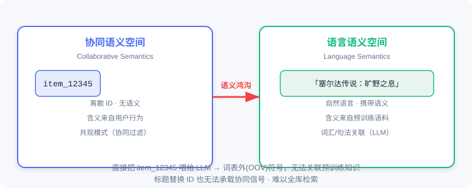
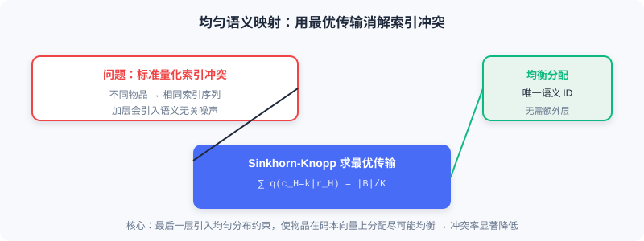

<div class="badge-row">
  <span style="background: #f0f4ff; color: #4A6CF7; padding: 4px 12px; border-radius: 20px; font-size: 0.85em; font-weight: 600; border: 1px solid rgba(74,108,247,0.2);">📖</span>
  <span style="background: #fef9ec; color: #d97706; padding: 4px 12px; border-radius: 20px; font-size: 0.85em; border: 1px solid rgba(100,100,100,0.15);">⏱️ ~34 min read</span>
  <span style="background: #fef2f2; color: #dc2626; padding: 4px 12px; border-radius: 20px; font-size: 0.85em; border: 1px solid rgba(100,100,100,0.15);">🎯 Advanced</span>
</div>

# 协同语义与语言语义的统一

> 📝 **Before You Continue:** 请先读完 [1.1](./../part1-introduction/what-is-recommender.md) 的两种范式与能力演进、[5.3](./../part5-trends/generative-trend.md) 的 TIGER 语义 ID 与 OneRec 端到端生成。本章是那根「语义 ID」线索的深化——不止「生成」，还要让 LLM **理解**这些 ID。

当推荐系统遇上大语言模型（LLM），表面看是「天作之合」：LLM 强大的语言理解与生成能力，似乎天然适合做推荐。但现实泼了一盆冷水——这二者说着**两种完全不同的「语言」**。推荐系统靠用户行为数据构建**协同语义**（collaborative semantics），而 LLM 理解的是文本中的**语言语义**（language semantics）。这道鸿沟不跨过去，再强的 LLM 也只是一个看不懂推荐世界的「外行」。

本章我们要解决的核心问题是：**如何构建一种既能被 LLM 理解、又能承载协同语义的物品表示？** 答案不是「直接把标题丢给 LLM」，而是一套系统性的语义索引 + 语义对齐方案。

读完本章，你将能够：

- 用**一句话**说清协同语义与语言语义的鸿沟，并指出「标题替换 ID」的两个根本缺陷
- **描述**LC-Rec 如何用层次化 RQ-VAE 构建语义索引，并解释「均匀语义映射」如何消解索引冲突
- **复述**LC-Rec 三层对齐训练（序列预测 / 索引-语言对齐 / 推荐导向）如何把协同语义注入 LLM
- **说明**PLUM 如何把这套思路推进到工业规模（多模态融合 + 持续预训练 + 任务微调）
- 完成 4 道分层练习题，巩固从学术原型到工业落地的语义对齐主线

---

## 9.1.0 两种「语言」的隔阂

推荐系统把每个物品表示为一个离散的 **ID**（如 `item_12345`）。这个 ID 本身不携带任何语义信息——它的含义完全来自用户行为数据中学习到的**协同模式**。通过分析「用户—物品」交互矩阵，模型能捕捉物品间隐含的相似性与关联，这种通过行为学到的表示，就是**协同语义**。

而 LLM 理解的是**语言语义**：它从预训练语料中学会了词汇、短语、句子之间的语义关联。当我们把物品 ID 直接喂给 LLM 时，这些离散标识符对它而言是**词表外（Out-of-Vocabulary, OOV）**的符号，无法与任何预训练知识产生关联。



> 💡 **Key Insight:** 一种直觉解法是用物品**标题替换 ID**（让 LLM 读标题）。但这有两个根本问题：第一，LLM 虽能理解标题字面含义，却**无法感知该物品在推荐系统中的协同特征**（用户群体的集体行为模式）；第二，基于候选集的文本生成方式**无法扩展到全库检索**场景，限制了模型的应用范围。

### 🧠 Mental Model: 两个说不同语言的人

> 把推荐系统想象成一位只看「会员编号」的资深店长——他闭着眼知道编号 12345 和 67890 的顾客总一起买东西（协同语义），却说不清编号长什么样。LLM 则是位满腹经纶的图书管理员，能和你聊「塞尔达传说」的剧情（语言语义），却对店长的会员编号一头雾水。要让两人合作，得先造一本「编号 ↔ 内容」的翻译词典——这正是语义索引要做的事。

---

## 9.1.1 LC-Rec：层次化语义索引与对齐

**LC-Rec**（Language-Collaborative Recommendation）提出了一套系统性方案：为每个物品学习一组离散的**语义索引**（Semantic Index），使其同时具备语言可理解性与协同表达能力。它包含两个关键技术模块：**物品索引学习**与**语义对齐训练**。

### 物品索引学习：层次化残差量化

LC-Rec 延续 [5.3](./../part5-trends/generative-trend.md) 介绍的语义 ID 思路，采用**层次化残差向量量化（Residual Vector Quantization, RQ）**构建物品索引。具体而言：

1. 先用 LLM 对物品标题与描述编码，得到初始文本嵌入 $\boldsymbol{e} \in \mathbb{R}^d$——保证索引构建起点是基于语言语义的。
2. 训练一个 RQ-VAE，将连续嵌入映射为离散索引序列。编码器把 $\boldsymbol{e}$ 映射为潜在表示 $\boldsymbol{z}$，随后进行 $H$ 层残差量化。在第 $i$ 层，码本 $C^i = \{\boldsymbol{v}^i_k\}_{k=1}^K$ 包含 $K$ 个可学习的聚类中心：

$$c_i = \arg\min_k \|\boldsymbol{r}_i - \boldsymbol{v}^i_k\|^2, \quad \boldsymbol{r}_{i+1} = \boldsymbol{r}_i - \boldsymbol{v}^i_{c_i}$$

最终物品被表示为索引序列 $[c_1, c_2, \ldots, c_H]$，例如 `<a_5><b_2><c_6><d_7>`。


这种层次化设计带来两个重要特性：**语义的逐层细化**（从粗粒度类别到精细个体特征）与**相似物品的索引前缀共享**（内容相似的物品倾向共享更多前缀）。这为后续自回归生成提供了结构化先验。

### 均匀语义映射：用最优传输消解索引冲突

LC-Rec 的关键创新在于**均匀语义映射（Uniform Semantic Mapping）**。标准向量量化存在**索引冲突**：多个不同物品可能被映射到相同索引序列——在推荐中这是不可接受的，每个物品必须有唯一标识。现有方法（如 TIGER）通常靠增加索引层解决冲突，但会引入语义无关的噪声。

LC-Rec 从根源上缓解这一问题：在最后一层量化时引入**均匀分布约束**，确保物品在码本向量上的分配尽可能均衡。这被形式化为一个**最优传输（Optimal Transport）**问题：

$$\min \sum_{\boldsymbol{r}_H \in \mathcal{B}} \sum_{k=1}^K q(c_H=k|\boldsymbol{r}_H) \|\boldsymbol{r}_H - \boldsymbol{v}^H_k\|^2$$

$$\text{s.t.} \quad \sum_{k=1}^K q(c_H=k|\boldsymbol{r}_H) = 1, \quad \sum_{\boldsymbol{r}_H \in \mathcal{B}} q(c_H=k|\boldsymbol{r}_H) = \frac{|\mathcal{B}|}{K}$$

其中 $\mathcal{B}$ 为一个批次的残差向量，$q(c_H=k|\boldsymbol{r}_H)$ 表示把残差 $\boldsymbol{r}_H$ 分配给第 $k$ 个码本向量的概率。该优化通过 **Sinkhorn-Knopp 算法**求解，在保持语义连续性的同时显著降低索引冲突率。



> **Analysis:** 均匀语义映射的代价是多了一个最优传输求解步骤（Sinkhorn 迭代），但换来「不增加额外索引层即可为绝大多数物品分配唯一语义 ID」——避免了 TIGER 式加层带来的语义噪声。这是表达力与唯一性之间的精巧权衡。

### 语义对齐训练：三层渐进注入协同语义

获得物品索引后，需要通过**指令微调（Instruction Tuning）**让 LLM 理解这些索引。LC-Rec 设计了三个层次的对齐任务：

**第一层·序列物品预测**——给定用户历史交互的索引序列，预测下一个物品的索引。由于索引有层次结构，LLM 在自回归生成时可逐层细化（先粗类别、再精细个体），与文本生成机制天然契合。

**第二层·显式索引-语言对齐**——建立索引与物品的双向对应：
- *索引到文本*：给定索引，生成对应标题与描述（如看到 `<a_66><b_197><c_236><d_223>` 生成「Pokémon Moon - Nintendo 3DS」）。
- *文本到索引*：给定标题描述，生成对应索引序列。

这种双向对齐类似多模态学习的交叉重建，在两种表示间建立紧密语义桥梁。

**第三层·推荐导向的隐式对齐**——进一步强化协同语义融合，包含三类任务：
- *非对称预测*：打破「输入输出均为索引」的对称，如输入索引、输出标题，迫使模型在协同模式与文本语义间建立深层关联。
- *基于意图的物品预测*：从用户评论提取意图（如「寻找开放世界的多人冒险游戏」），预测推荐索引——让模型学会把自然语言需求与协同过滤模式结合。
- *个性化偏好推理*：给定交互索引序列，生成对用户偏好的自然语言总结，为可解释推荐打基础。

> 💡 **Key Insight:** 经过三层对齐，协同语义与语言语义在 LLM 内部形成统一表示空间，具备**层次化语义组织**（索引越长描述越精细）、**协同-语言融合**（比纯文本检索更贴合推荐）、**生成式全库检索能力**（索引已入词表，无需候选集即可自回归检索）三大特性。

---

## 9.1.2 工业级对齐：PLUM 框架

LC-Rec 在学术数据集验证了可行性，但从学术到工业仍有巨大鸿沟。YouTube 每天产生数百万新视频、数十亿交互，面临多模态内容融合、实时增量更新、十亿级检索等挑战。**PLUM**（Pre-trained Language Models for Recommendations）正是为应对这些挑战而生，通过三阶段（增强型语义 ID 构建 → 领域持续预训练 → 生成式检索微调）实现工业级语义对齐。

### 多模态与协同信号的融合

LC-Rec 只用文本嵌入，但视频内容的丰富性远超纯文本（游戏直播的吸引力可能更多来自主播声音与画面流畅度）。PLUM 采用**多模态嵌入拼接**融合异构信息：文本编码器、视觉编码器、音频编码器分别提取 $\boldsymbol{e}_{\text{text}}$、$\boldsymbol{e}_{\text{visual}}$、$\boldsymbol{e}_{\text{audio}}$，简单拼接：

$$\boldsymbol{e}_{\text{content}} = [\boldsymbol{e}_{\text{text}} \oplus \boldsymbol{e}_{\text{visual}} \oplus \boldsymbol{e}_{\text{audio}}]$$

更关键的是，PLUM 显式引入**协同过滤嵌入** $\boldsymbol{e}_{\text{cf}}$ 弥补内容语义的不足——编码「哪些用户倾向一起观看」的协同模式，再与内容嵌入拼接：

$$\boldsymbol{e}_{\text{final}} = [\boldsymbol{e}_{\text{text}} \oplus \boldsymbol{e}_{\text{visual}} \oplus \boldsymbol{e}_{\text{audio}} \oplus \boldsymbol{e}_{\text{cf}}]$$


这让语义 ID 不再只是内容标识，而是融合「内容是什么」与「用户如何感知」的双重语义。PLUM 还用**多分辨率码本**（128/256/512/1024）与**渐进式掩码训练**保证层次正确组织。

### 持续预训练：建立协同-语言双向映射

PLUM 把全部语义 ID token 加入 LLM 词表（4 层 RQ-VAE × 256 = 1024 个新 token），并用**语义引导初始化**为它们赋予有意义的起点（取最近的若干视频标题 LLM 嵌入均值）。随后用三类数据训练：

- **纯语义 ID 序列**（50%）：从行为序列采样，预测下一个 ID，学纯粹协同模式。
- **纯领域文本数据**：视频标题/描述/评论/字幕，防语言能力退化并学领域表达。
- **ID-文本交错序列**（占元数据语料 60–70%）：如「视频 `<A37><B12><C5><D8>` 的标题是：Minecraft 建筑教程」，建立双向桥梁。

一个收获是模型展现出**零样本跨模态理解**：

```
<A37> → "任天堂相关内容"
<A37><B12> → "任天堂 Switch 游戏"
<A37><B12><C5> → "塞尔达传说系列"
<A37><B12><C5><D8> → "塞尔达传说旷野之息武器收集攻略"
```

这种能力完全通过大量交错序列隐式学习涌现，证明语义对齐已内化为模型的表示结构。

### 任务微调与生产验证

任务微调把推荐重定义为**条件生成**：给定用户多模态上下文（历史语义 ID 序列、文本、离散化数值如「完播率:高」），自回归生成推荐视频的语义 ID。PLUM 引入**奖励加权对齐**：

$$\mathcal{L}_{\text{SFT}} = -\sum_{(u,v) \in \mathcal{D}} r(u,v) \cdot \sum_{t=1}^{4} \log P(\text{sid}_t | \text{Context}_u, \text{sid}_{<t})$$

即高奖励交互（长时观看、点赞）代表「强语义关联」，值得深度编码；低奖励（误点、快速退出）可能是噪声，不应过拟合。

PLUM 在 YouTube 长/短视频全面上线，关键收益：语义 ID **唯一性 96.7%**（高于 LC-Rec 的 94.0%）；有效词汇量覆盖 95% 曝光所需视频数在长视频提升 2.6 倍、短视频提升 13.2 倍；样本效率极高——900M MoE 模型仅需 2.5 亿样本，总训练成本（FLOPs）仅为传统大嵌入表模型（LEM）的 **0.55 倍**。

> 📊 **Data Point:** PLUM 证明即使在十亿级规模、多模态、实时推理的严苛约束下，协同语义与语言语义的统一也完全可行。但它仍是个端到端生成模型——能高效生成推荐，却**无法解释为什么**。这正是 9.2 要解决的问题。

---

## ⚠️ Common Mistakes in 9.1

| # | Mistake | Example | Why It's Wrong | Fix |
|---|---------|---------|---------------|-----|
| 1 | 以为「标题替换 ID」就解决了语义对齐 | 直接把物品标题当 token 喂 LLM 做推荐 | 标题无协同语义，且无法全库检索 | 用语义索引（RQ-VAE）同时承载协同+语言 |
| 2 | 混淆协同语义与语言语义 | 认为 LLM 读懂标题就等于理解推荐 | 标题不含用户群体行为模式（协同信号） | 区分两种语义，靠对齐训练融合二者 |
| 3 | 以为加层总能解决索引冲突 | TIGER 式无限加 RQ 层 | 加层引入语义无关噪声，污染索引含义 | 用均匀语义映射（最优传输）均衡分配 |
| 4 | 把 PLUM 的拼接当注意力融合 | 「PLUM 用跨模态注意力融合」 | PLUM 用简单拼接，让码本自然发现重要模态 | 拼接给予各模态平等机会，更可解释 |

---

## 本章小结

### 📌 Key Takeaways

| Concept | Key Points | Why It Matters |
|---------|-----------|----------------|
| 语义鸿沟 | 协同语义（ID）vs 语言语义（文本），ID 对 LLM 是 OOV | 跨不过鸿沟，LLM 看不懂推荐世界 |
| LC-Rec 语义索引 | 层次化 RQ-VAE + 均匀语义映射（最优传输） | 物品同时被 LLM 理解且承载协同信号 |
| 三层对齐 | 序列预测 / 索引-语言 / 推荐导向 | 渐进把协同语义注入 LLM 表示空间 |
| PLUM | 多模态+CF 融合、CPT、奖励加权微调 | 工业级验证，唯一性 96.7%、成本 0.55× |
| 统一表示空间 | 层次组织 / 协同-语言融合 / 全库检索 | 为 9.2 的「会思考」奠定理解基础 |

### ❓ FAQ

**Q1: 为什么不直接用物品标题，非要搞语义索引？**
> A: 标题只携带语言语义，没有协同信号（用户群体的集体行为）；且基于候选集文本生成无法扩展到全库检索。语义索引把两种语义统一到一个可被 LLM 生成/检索的 token 序列里。

**Q2: 均匀语义映射和 TIGER 加层有什么区别？**
> A: TIGER 靠增加 RQ 层避免冲突，但新层带来语义无关噪声；LC-Rec 的均匀语义映射在最后一层加均匀分布约束（Sinkhorn 最优传输），不增层也能给绝大多数物品唯一 ID，更干净。

**Q3: PLUM 为什么用「拼接」而不是注意力融合多模态？**
> A: 拼接给予文本/视觉/音频/协同各模态平等表达机会，让 RQ-VAE 码本自然发现哪种模态对区分视频类别最重要（如音乐视频靠音频、教程靠文本），且更可解释、更省算力。

### 🔗 前后关联

- **1.1 / 5.3**（范式与生成式演进）语义索引是 TIGER 思路的深化，本章解决「LLM 如何*理解*索引」。
- **9.2**（OneRec-Think）在「认识物品」的语义对齐基础上，进一步让模型「学会思考」。
- **9.3**（自主推理）RecZero/RecOne 延续语义索引表示，把推理从人工模板解放为自主探索。

---

## Practice Problems

Work through all problems in order — they get progressively harder. Each has a complete solution you can reveal after trying it yourself.

---

**Problem 9.1.1 — 辨析两种语义** 🟢 Easy

判断以下描述属于**协同语义**还是**语言语义**：
- (a) 物品 `item_8842` 与 `item_1190` 常被同一批用户购买。
- (b) 视频标题「塞尔达传说：旷野之息」描述的是开放世界冒险游戏。
- (c) 用户看完 A 后 80% 会看 B（行为共现）。
- (d) 评论区高频词是「治愈」「画风」。

<details>
<summary>💡 Solution (click to reveal)</summary>

**Approach:** 看信息来自「用户行为」还是「文本内容」。

- (a) 协同语义（共现行为）
- (b) 语言语义（标题文本含义）
- (c) 协同语义（行为转移概率）
- (d) 语言语义（评论文本语义）

**Key points:**
- 协同语义源于交互矩阵，语言语义源于文本/预训练语料。
- 语义索引的目标是把两者统一进一个表示。

</details>

---

**Problem 9.1.2 — RQ-VAE 量化计算** 🟢 Easy

已知物品文本嵌入 $\boldsymbol{e}$，RQ-VAE 编码得 $\boldsymbol{z}$，初始残差 $\boldsymbol{r}_1 = \boldsymbol{z}$。第一层码本 $\{\boldsymbol{v}^1_k\}$ 中离 $\boldsymbol{r}_1$ 最近的码字索引为 $c_1=2$。请写出 $c_1$ 的选取公式与残差更新式。

<details>
<summary>💡 Solution (click to reveal)</summary>

**Approach:** 直接套用层次化量化公式。

$$c_i = \arg\min_k \|\boldsymbol{r}_i - \boldsymbol{v}^i_k\|^2 \;\Rightarrow\; c_1 = \arg\min_k \|\boldsymbol{r}_1 - \boldsymbol{v}^1_k\|^2 = 2$$

$$\boldsymbol{r}_{i+1} = \boldsymbol{r}_i - \boldsymbol{v}^i_{c_i} \;\Rightarrow\; \boldsymbol{r}_2 = \boldsymbol{r}_1 - \boldsymbol{v}^1_2$$

**Key points:**
- 每层在码本中找最近码字，再从残差里减掉它。
- 多层迭代得到索引序列 $(c_1, c_2, \ldots, c_H)$。

</details>

---

**Problem 9.1.3 — 索引冲突分析** 🟡 Medium

某推荐系统用 TIGER 式 3 层 RQ-VAE 构建语义 ID，但发现两个不同的游戏视频被映射到完全相同的 `<a_3><b_1><c_7>`。工程师决定加到 5 层解决。请指出这种做法的隐患，并说明 LC-Rec 的均匀语义映射为何是更优解。

<details>
<summary>💡 Solution (click to reveal)</summary>

**Approach:** 对比「加层」与「均匀映射」两种消冲突思路。

**加层隐患：** 增加 RQ 层会引入更多码字维度，其中部分层学习到的只是「为了区分而区分」的语义无关噪声，污染索引的层次语义含义，且增加了生成长度与推理成本。

**均匀语义映射更优：** 它在最后一层引入均匀分布约束（最优传输），用 Sinkhorn-Knopp 让物品在码本向量上分配尽量均衡，从根源降低冲突率，而**不增加额外索引层**——保持了索引的语义纯净度与生成效率。

**Key points:**
- 冲突的本质是码本分配不均，不是层数不够。
- 均衡分配比堆层数更干净、更高效。

</details>

---

**Problem 9.1.4 — 设计对齐训练组合** 🔴 Hard

你要为一家图书电商的 LLM 推荐系统设计语义对齐训练。请列出你采用的**三类对齐任务**（对应 LC-Rec 三层），并各写一条样本（输入→输出），说明它们分别注入哪类语义。

<details>
<summary>💡 Solution (click to reveal)</summary>

**Approach:** 套用 LC-Rec 三层对齐，落到图书场景。

1. **序列物品预测（协同）**：输入用户历史索引序列 `<a_2><b_5><c_1> ... <a_2><b_5><c_9>`，输出下一个索引 `<a_2><b_6><c_3>`——学协同共现模式。
2. **显式索引-语言对齐（双向）**：
   - 索引→文本：输入 `<a_2><b_5><c_3>`，输出「《人类简史》— 宏观历史科普」。
   - 文本→索引：输入「《人类简史》」，输出 `<a_2><b_5><c_3>`。
3. **推荐导向隐式对齐（意图+偏好）**：输入意图「想读轻松的历史读物」+ 历史索引，输出推荐索引；或输入历史索引，输出偏好总结「偏好宏观历史、轻学术」。

**Key points:**
- 三层由浅入深：共现 → 双向语义桥 → 意图/偏好推理。
- 每层都在把协同语义更深层地注入 LLM 表示空间。

</details>

---

**🏆 Challenge: 工业落地论证**

假设你要为日活千万的短视频平台引入 PLUM 式语义对齐。请写一段 200 字内论证：相比传统大嵌入表模型（LEM），语义对齐方案在**样本效率、长尾覆盖、可解释性**三个维度上为何更优？并指出一个必须前置解决的基础设施问题。

<details>
<summary>💡 Hint</summary>

论据：① 语义对齐的表示空间泛化更好，训练数据需求远低于 LEM（PLUM 仅 2.5 亿 vs LEM 数十亿/天），FLOPs 仅 0.55×；② 语义 ID 区分度更高，长尾内容覆盖率显著提升（短视频 13.2×）；③ 索引-文本对齐使推荐可解释。前置问题：必须先把「物品→语义 ID」的量化/对齐基础设施建好（类似 5.3 的语义 ID 流水线），否则 LLM 无 token 可用。
</details>
