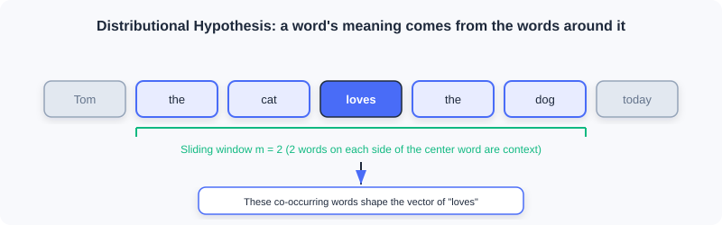
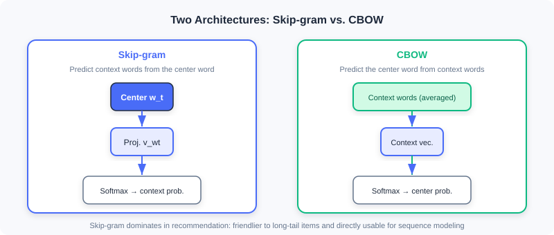

  📖
  ⏱️ ~25 min read
  🎯 Methodology

# Word2Vec Deep Dive

> 📝 **Why this is a separate appendix:** Section 2.2.1 of [2.2 Vector Retrieval (I2I)](../part2-retrieval/vector-recall-i2i.md) covers only the Skip-Gram intuition and its transfer to recommendation. This appendix fills in what was left out — **the CBOW architecture, the structural details of the two center/context embedding tables, the precise mathematical form of negative sampling, and the arithmetic (analogy) properties of word vectors** — so that you thoroughly understand the underlying engine before using Item2Vec / EGES / Airbnb.

The goal of Word2Vec is plain: from **large amounts of unlabeled text**, learn a **low-dimensional dense vector** for every word such that:

- semantically similar words end up close to each other in the vector space;
- relations between words are reflected through **vector arithmetic**.

These representations can be fed directly into downstream tasks such as text classification, machine translation, and information retrieval — and in recommendation, the method was transferred "structurally isomorphically" into Item2Vec.

---

## 1. Motivation: From One-Hot to Dense Vectors

The earliest and most direct approach encodes words with **one-hot encoding**: with a vocabulary size of $V$, the $i$-th word is a $V$-dimensional vector with a 1 in position $i$ and 0s elsewhere. It is intuitive but has three fatal flaws:

| Flaw | Explanation |
|------|------|
| Curse of dimensionality | $V$ often reaches the millions; the vectors are huge and sparse |
| No semantics | The one-hot inner product of any two different words is 0, so "cat" and "dog" are treated as unrelated |
| No syntax | Relations such as singular/plural and tense are lost entirely |

What we need is a representation that is **both low-dimensional and able to carry semantic/syntactic information** — exactly the problem Word2Vec solves.

---

## 2. The Distributional Hypothesis and the Context Window

The theoretical foundation of Word2Vec is the linguistic **distributional hypothesis** (Firth, 1957):

> *"You shall know a word by the company it keeps."*
> The meaning of a word is determined by the words that appear around it.

The model walks through every word in the corpus and adjusts the word vectors so that the "predicted context" matches the "actual context in the corpus" as closely as possible. Concretely, if the center word $w_t$ sits at position $t$, its context is the words within the window $m$: $w_{t-m},\dots,w_{t-1},w_{t+1},\dots,w_{t+m}$.

---

## 3. Two Architectures: Skip-gram and CBOW

Word2Vec comprises two mirror-symmetric models. In [2.2.1](../part2-retrieval/vector-recall-i2i.md) we used only Skip-Gram; here we add CBOW as well.

### 3.1 Skip-gram: Predict the Context from the Center Word

Given a center word, the model predicts the probability of its context words appearing. For a context word $w_{t+j}$ inside the window, the conditional probability is

$$
P(w_{t+j}\mid w_t)=\frac{e^{\mathbf{v}_{w_{t+j}}^\top \mathbf{v}_{w_t}}}{\sum_{k=1}^{V}e^{\mathbf{v}_{w_k}^\top \mathbf{v}_{w_t}}}
$$

where $\mathbf{v}_{w_i}$ is the vector representation of word $w_i$ and $V$ is the vocabulary size. Walking through the whole corpus, the likelihood is

$$
\prod_{t=1}^{T}\prod_{-m\le j\le m,\;j\ne 0} P(w_{t+j}\mid w_t)
$$

### 3.2 CBOW: Predict the Center Word from the Context

CBOW (Continuous Bag of Words) goes the other way: it **averages** the context words and predicts the center word.

$$
P(w_t\mid w_{t+j})=\frac{e^{\mathbf{v}_{w_t}^\top \mathbf{v}_{w_{t+j}}}}{\sum_{k=1}^{V}e^{\mathbf{v}_{w_k}^\top \mathbf{v}_{w_{t+j}}}}
$$

> 💡 **Which one should you use?** Recommendation scenarios almost always use **Skip-gram**, for two reasons: ① it is friendlier to low-frequency/long-tail words (every context pair provides an independent supervision signal); ② it naturally fits variable-length, sparse inputs like user behavior sequences and can be used for sequence modeling directly. CBOW averages the context and would wipe out sequence-order information in recommendation.

---

## 4. Model Structure and the Two Embedding Tables

The conditional probability formulas above hide a **detail that is very easy to get wrong**: the center-word vector $\mathbf{v}_{w_t}$ and the context-word vector $\mathbf{v}_{w_{t+j}}$ **do not live in the same vector space**.

Taking Skip-gram as an example, let the vector dimension be $D$; there are **two** embedding tables:

- the center-word table $\mathbf{W}\in\mathbb{R}^{V\times D}$
- the context-word table $\mathbf{W}^c\in\mathbb{R}^{V\times D}$

The forward computation proceeds as follows:

1. Input the one-hot representation $\mathbf{x}_t\in\{0,1\}^V$ of the center word;
2. Look up the center-word vector $\mathbf{v}_{w_t}=\mathbf{x}_t^\top\mathbf{W}$;
3. Multiply with row $(t+j)$ of the context-word table to get the input to the Softmax;
4. Apply the Softmax to output context-word probabilities.

> ⚠️ **Common Mistakes in Word2Vec**
> Treating $\mathbf{v}_{w_t}$ (from $\mathbf{W}$) and $\mathbf{v}_{w_{t+j}}$ (from $\mathbf{W}^c$) as vectors in the same space and directly computing distances. They come from two different tables; only the "final word vectors" obtained by **adding/averaging the two tables after training** are valid for similarity computation.

---

## 5. Negative Sampling: Making Softmax Computable

Computing the Softmax denominator from Sections 3/4 directly requires iterating over the entire vocabulary $V$ (millions of entries), which is unaffordable. Word2Vec uses **negative sampling** to decompose the multi-class problem into many binary-class problems.

Taking Skip-gram as an example, the original objective is replaced with:

$$
\log\sigma\!\left(\mathbf{v}_{w_{t+j}}^\top\mathbf{v}_{w_t}\right)
+\sum_{i=1}^{n_{\mathrm{neg}}}\mathbb{E}_{w_i\sim P_n(w)}\big[\log\sigma\!\left(-\mathbf{v}_{w_i}^\top\mathbf{v}_{w_t}\right)\big]
$$

where $\sigma(x)=\frac{1}{1+e^{-x}}$ is the sigmoid, $n_{\mathrm{neg}}$ is the number of negative samples, and $P_n(w)$ is the negative sampling distribution. The original paper takes

$$
P_n(w)=\frac{\mathrm{count}(w)^{3/4}}{\sum_{w'}\mathrm{count}(w')^{3/4}}
$$

> 💡 **Intuition:** The first term pushes the similarity of "true context word pairs" higher (lifting positive samples); the second pushes the similarity of "randomly sampled negative word pairs" lower (suppressing negatives). By the monotonicity of the sigmoid, this is consistent with maximizing the original likelihood $\max P(w_{t+j}\mid w_t)$, yet it **avoids summing over the entire vocabulary** — the complexity drops from $O(V)$ to $O(k)$.

> ⚠️ **Common Mistakes in Word2Vec**
> Assuming that negative sampling is just a "speed trick" with no semantic effect. In fact, the 3/4 power in the negative sampling distribution $P_n(w)$ deliberately **lifts the probability of low-frequency words** being drawn as negatives, so that the model learns discriminative vectors for rare words too — which is especially critical for long-tail items in recommendation.

---

## 6. Vector Arithmetic: The Analogy Property

The most fascinating discovery about Word2Vec is that in the trained vector space, **semantic relations can be expressed through vector addition and subtraction**. The classic example:

$$
\mathbf{v}_{\text{king}}-\mathbf{v}_{\text{man}}+\mathbf{v}_{\text{woman}}\approx\mathbf{v}_{\text{queen}}
$$

This means that analogies like "king − man + woman ≈ queen" are encoded into the geometric structure. In recommendation, the analogous property reads as "the difference between item A and item B roughly equals the difference between item C and some item D" — exactly the theoretical grounding that later lets semantic IDs and vector retrieval perform "computable analogies".

---

## 7. From Word2Vec to Recommendation: The Item2Vec Bridge

Transferring Word2Vec to recommendation takes just one **structural isomorphic substitution** (details in [2.2.1](../part2-retrieval/vector-recall-i2i.md)):

| Text world | Recommendation world |
|----------|----------|
| Word | Item |
| Sentence | User interaction sequence |
| Word co-occurrence | Items interacted with by the same user |

After the substitution:

- Skip-gram + negative sampling → becomes the training prototype of Item2Vec directly;
- the learned item vectors → enable I2I retrieval through nearest-neighbor search;
- the two-table structure and the negative sampling distribution from Sections 4–5 intact underpin industrial variants such as EGES and Airbnb.

> 💡 **One-sentence takeaway:** The Word2Vec engine (Skip-gram + two embedding tables + negative sampling) is the **methodological cornerstone** of I2I vector retrieval; every improvement in the recommendation domain only plays with "how to construct sequences" and "how to define positive and negative samples".

---

## Chapter Summary

- Word2Vec uses the **distributional hypothesis** to turn "co-occurrence" into "dense semantic vectors", fixing the three flaws of one-hot: high dimensionality, sparsity, and no semantics.
- Two architectures: **Skip-gram** (center → context) and **CBOW** (context → center); recommendation almost always uses Skip-gram.
- Structurally there are **two embedding tables**, $\mathbf{W}$ (center) and $\mathbf{W}^c$ (context), belonging to different spaces; the final vectors must be merged before use.
- **Negative sampling** approximates the full-vocabulary Softmax with $k$ binary classifications and lifts low-frequency words via $P_n(w)\propto\mathrm{count}^{3/4}$ — the key to industrial feasibility.
- Word vectors support **analogical arithmetic**, providing the theoretical underpinning for semantic IDs and vector retrieval.
- Through the isomorphic substitution "word → item, sentence → behavior sequence", Word2Vec becomes the engine of **Item2Vec** and the subsequent I2I methods directly.

### 🔗 Connections to Later Chapters

- **Prerequisite:** Section 2.2.1 of [2.2 Vector Retrieval (I2I)](../part2-retrieval/vector-recall-i2i.md) cites this appendix briefly as the "theoretical basis of sequence modeling"; after reading the appendix, revisiting that section will make it clearer why Item2Vec / EGES / Airbnb are designed the way they are.
- **What follows:** [2.3 Two-Tower Models (U2I)](../part2-retrieval/two-tower.md) retrieves with dense vectors from a "user tower + item tower", carrying forward the "dense item vectors" idea here; [6.4 Codebook Quantization and Semantic IDs](../part6-gr-basic/codebook-quantization.md) inverts "discrete words → continuous vectors" into "continuous vectors → discrete semantic IDs" — worth reading side by side.

---

## Practice Problems

<b>Problem A.1 — The two-table misconception</b> 🟢 Easy

Someone says: "In Word2Vec, the vectors of the center word $w_t$ and the context word $w_{t+j}$ live in the same $D$-dimensional space, so you can just compute the cosine similarity directly." What is wrong with this claim?

**Approach:** Revisit Section 4 — $\mathbf{v}_{w_t}$ comes from $\mathbf{W}$, while $\mathbf{v}_{w_{t+j}}$ comes from $\mathbf{W}^c$.

**Answer:** The mistake is assuming the two share one space. In reality, the center-word table $\mathbf{W}$ and the context-word table $\mathbf{W}^c$ are two independent parameter tables, and their vectors belong to different spaces; comparing distances directly is invalid. After training, the two tables are usually added/averaged into the final word vectors, and only those are valid for similarity computation.

<b>Problem A.2 — Negative-sampling scaling</b> 🟡 Medium

The negative sampling distribution uses $P_n(w)\propto \mathrm{count}(w)^{3/4}$ rather than raw word frequency. If one word appears 16 times and another appears 81 times, compute their relative weight ratio after the $3/4$ power (i.e., $81^{3/4}/16^{3/4}$), and explain the effect of this design on low-frequency words.

**Approach:** $16^{3/4}=(2^4)^{3/4}=2^3=8$; $81^{3/4}=(3^4)^{3/4}=3^3=27$.

**Answer:** The relative weight ratio is $27/8\approx 3.375$. Note that the frequency ratio is $81/16\approx 5.06$; after the $3/4$ power the gap gets **compressed** (5.06 → 3.375), which effectively **lifts the probability of low-frequency words** being drawn as negative samples — so the model learns discriminative vectors for rare words too, easing the long-tail problem.

<b>Problem A.3 — Isomorphic transfer</b> 🔴 Hard

When transferring Word2Vec to recommendation as Item2Vec, why is the mapping "user interaction sequence = sentence" a structural isomorphism rather than a loose analogy? Explain from the perspective of the training objective (Skip-gram + negative sampling), and point out one **key simplification** of Item2Vec relative to the original Word2Vec mentioned in [2.2.1](../part2-retrieval/vector-recall-i2i.md).

**Approach:** Isomorphism means a one-to-one correspondence across "input units + co-occurrence structure + training objective"; the key simplification is that Item2Vec treats user history as an **unordered set** rather than a sequence.

**Answer:** The isomorphism shows up as: word → item, sentence → user behavior sequence, word co-occurrence → same-user interactions, while the Skip-gram $P(w_{t+j}\mid w_t)$ + negative-sampling objective is **unchanged in form** — only the text corpus is swapped for a behavior-sequence corpus. Key simplification: as noted in the book, Item2Vec by default treats each user's interaction history as an **unordered set** (ignoring temporal order), whereas the original Word2Vec strictly depends on ordered context within the sliding window — this is the most essential difference from the text version.

