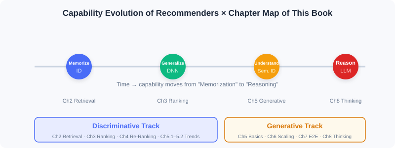

  📖
  ⏱️ ~20 min read
  🎯 Intermediate

# Book Overview and Technology Map

> 📝 **Before You Continue:** Please read the three perspectives in [1.1](./recommender-system-basics.md) first. This chapter unfolds that "three-dimensional understanding" into a navigable **technology map**, helping you locate every chapter that follows.

Once you understand the core logic of recommender systems, the real challenge is turning that understanding into actionable technical solutions. Researchers and engineers have proposed hundreds of algorithms, and beginners often feel lost: how do these models relate to each other? Which one for which scenario? How do you assemble a complete system?

This chapter gives you a map. The book is organized along two main storylines — **discriminative** and **generative** — while also threading together the capability evolution from "memorization and generalization" to "understanding and reasoning."

After reading this chapter, you will be able to:

- State the logic behind the book's **two halves** and where each lands
- Map every chapter of the **fundamentals half (Ch0–Ch4)** onto the three-stage pipeline or frontier trends
- Explain why "retrieval → ranking → re-ranking" is the organizing thread of the discriminative storyline
- Anticipate how the **generative storyline** will unfold in later versions (Ch5–Ch10)
- Complete 4 leveled practice problems to verify your grasp of the technology map

---

## 1.2.0 One Map, Two Storylines

The book's organization can be summarized in one diagram: the horizontal axis is **time/capability evolution** (from pure-ID memorization to LLM reasoning), and the vertical axis is **the two paradigm storylines** (discriminative vs generative).

- **First half: industrial practice of discriminative recommendation** — progressively deepening along the "retrieval → ranking → re-ranking" pipeline; the main battlefield of memorization and generalization capabilities.
- **Second half: the technology landscape of generative recommendation** — starting from the foundational paradigm, through Scaling Laws, end-to-end modeling, and reasoning capability to diffusion models; the exploration ground of understanding and reasoning capabilities.

> 💡 **Key Insight:** The two storylines **are not isolated**. Generative architectures often "end-to-end-ify" mature discriminative modules; meanwhile, discriminative techniques such as semantic IDs and feature crossing provide the representational foundation for generative approaches.

---

## 1.2.1 First Half: Industrial Practice of Discriminative Recommendation (Covered in This Edition)

This edition (the fundamentals half) fully covers the first half plus the bridging trends chapter — 5 parts in total:

| Part | Theme | Position in the Pipeline | Core Content |
|------|------|----------------|----------|
| **Part 1** | Introduction and Overview | — | Two paradigms, three-stage funnel, ecosystem triangle, feature and Embedding basics |
| **Part 2** | Fast Candidate Retrieval | ① Retrieval | Collaborative filtering / vector retrieval / two-tower / sequence retrieval / streaming index |
| **Part 3** | Accurate Preference Prediction | ② Ranking | Wide&Deep / feature crossing / sequence modeling / multi-objective / multi-scenario |
| **Part 4** | Re-ranking and Diversity Modeling | ③ Re-ranking | Greedy re-ranking (MMR/DPP) / personalized re-ranking (PRM) |
| **Part 5** | Frontier Trends | Cross-stage | Model debiasing / cold start / evolution of the generative paradigm |

### Retrieval: From 100 Million to Thousands (Part 2)

Retrieval is the pipeline's starting point: it must filter from hundreds of millions of items down to thousands of candidates within milliseconds. Its technical evolution unfolds across five sections:

- **Collaborative filtering** — the classic starting point: from ItemCF's item similarity, through Swing's industrial optimization and UserCF's user perspective, to matrix factorization mapping users/items into latent vectors, pioneering vectorization.
- **I2I vector retrieval** — transplanting Word2Vec's sequence-modeling ideas into recommendation: from Item2Vec's direct transfer, to EGES fusing side attributes, to Airbnb embedding business objectives into sequence construction.
- **Two-tower models (U2I)** — encoding users and items separately as vectors, represented by FM, DSSM, and YoutubeDNN, enabling efficient vector retrieval.
- **Sequence retrieval** — attending to the temporal information earlier methods ignored: MIND uses multiple vectors to represent diverse interests; SDM separates long- and short-term preferences and fuses them dynamically with gating.
- **Streaming index retrieval** — stepping outside model-internal compression: Trinity uses clustering statistics to preserve full historical interests; Streaming VQ lets the index structure adapt to data distribution in real time.

### Ranking: From Thousands to Hundreds (Part 3)

Ranking scores thousands of candidates precisely — the main battlefield of deep generalization:

- **Wide & Deep** — jointly training a linear model and a deep network, establishing the foundational "memorization + generalization" framework.
- **Feature crossing** — from FM's second-order crossing, through DeepFM and xDeepFM, toward automatic high-order crossing.
- **Sequence modeling** — DIN uses attention to dynamically activate history based on the candidate; DIEN explicitly models the temporal evolution of interests.
- **Multi-objective / multi-scenario** — MMoE and ESMM balance multiple objectives; multi-tower and dynamic weights adapt to cross-scenario differences.

### Re-ranking: From Hundreds to One Screen (Part 4)

Ranking output is often highly homogeneous; re-ranking optimizes the whole-list experience while preserving relevance:

- **Greedy re-ranking** — MMR linearly combines relevance and diversity; DPP uses a determinant framework to control diversity more precisely.
- **Personalized re-ranking** — PRM uses a Transformer to model mutual influence among items, achieving end-to-end personalized list generation.

---

## 1.2.2 Preview of the Second Half: Generative Recommendation (Covered in Later Versions, Ch5–Ch10)

To help you build a complete picture, here is a brief preview of the second half, so you know where the road leads after this edition:

| Chapter | Theme | In One Sentence |
|----|------|--------|
| **Ch5** | Generative foundations | Transformer / diffusion models / LLM workflows / item tokenization (semantic IDs) |
| **Ch6** | Scaling Law architectures | HSTU turns per-candidate scoring into user-level sequence modeling; RankMixer builds a hardware-aware unified architecture |
| **Ch7** | End-to-end generation | OneRec (recommendation) / OneSug·OneSearch (search) / EGA (ads) replace the pipeline with a single model |
| **Ch8** | Recommenders that think | Semantic alignment (LC-Rec) → reasoning activation (OneRec-Think) → autonomous reasoning (RecZero) |
| **Ch9** | Diffusion-model recommendation | DiffuASR data augmentation / AsymDiffRec·DMSG feature and diversity optimization |
| **Ch10** | Production-grade project | Full-stack movie recommendation: offline training + online serving + frontend + Docker deployment |

> 📝 **Note:** This edition focuses on the fundamentals half (Ch0–Ch4). The second half will be continued in later editions under the same book-writer conventions.

---

## ⚠️ Common Mistakes in 1.2

| # | Mistake | Example | Why It's Wrong | Fix |
|---|---------|---------|---------------|-----|
| 1 | Treating chapters as isolated algorithms | "This chapter covers DIN, the next covers DIEN — they're unrelated" | Chapters are consecutive stages on one pipeline; each chapter's output feeds the next | Always understand each chapter through its "pipeline position" |
| 2 | Memorizing model names without motivations | Reciting FM/DeepFM but unable to explain why high-order crossing is needed | Models exist to solve specific limitations; learning without motivation doesn't stick | For every model, first ask "what shortcoming of the previous method does it solve" |
| 3 | Mistakenly believing generative replaces discriminative | "Now that I've studied generative, I can skip the first half" | The two develop in parallel; generative approaches often build on discriminative representations | Treat the two storylines as complementary, not substitutes |

---

## Chapter Summary

### 📌 Key Takeaways

| Concept | Key Points | Why It Matters |
|---------|-----------|----------------|
| Two storylines | Discriminative (first half) / generative (second half) | The book's organizational skeleton — it determines how you categorize every model |
| Three-stage thread | Retrieval→ranking→re-ranking runs through the first half | Understand each chapter's position in the pipeline |
| Capability evolution | Memorization→generalization→understanding→reasoning | Explains why the technology keeps iterating rather than simply being replaced |
| Edition boundary | Covers Ch0–Ch4 (fundamentals half) | Clarifies this edition's scope and avoids misplaced expectations |

### ❓ FAQ

**Q1: Why does the fundamentals half stop at Ch4 instead of including Ch5's generative content?**
> A: Ch5 is the cornerstone of the generative storyline, and its conceptual density rises sharply (semantic IDs, Transformers, diffusion models). First solidifying the industrial practice of discriminative recommendation, then moving into generative, makes for steadier learning.

**Q2: Must retrieval, ranking, and re-ranking all use deep learning?**
> A: No. Retrieval often uses lightweight methods (collaborative filtering, two-tower); only ranking deploys the most complex deep models; re-ranking can use rules or lightweight models. Complexity increases as candidates shrink.

**Q3: What order should I read in?**
> A: Strictly in Part 1→5 order. Later chapters often presuppose earlier ones (e.g., sequence modeling builds on feature crossing).

### 🔗 Connections to Later Chapters

- **Part 2 Retrieval (Ch2.1–2.5)** expands this chapter's "Retrieval: from 100 million to thousands" into five algorithm families.
- **Part 3 Ranking (Ch3.1–3.5)** dives into the industrial implementation of the discriminative scoring function $f$.
- **Part 4 Re-ranking (Ch4.1–4.2)** wraps up the three-stage pipeline and connects to the trends chapter.
- **Part 5 Trends (Ch5.1–5.3)** bridges with "debiasing / cold start / generative," pointing toward the second half in later editions.

---

## Practice Problems

---

**Problem 1.2.1 — Locating Chapters** 🟢 Easy

Place each of the following algorithms into its correct position in the pipeline (write the corresponding Part/chapter):
(a) DPP re-ranking　(b) YoutubeDNN two-tower　(c) DeepFM feature crossing　(d) Swing collaborative filtering

💡 Solution (click to reveal)

**Approach:** Recall the three stages and the representative models of each.

| Algorithm | Position |
|------|------|
| (a) DPP re-ranking | Part 4 Re-ranking (Ch4.1 greedy re-ranking) |
| (b) YoutubeDNN two-tower | Part 2 Retrieval (Ch2.3 two-tower U2I) |
| (c) DeepFM feature crossing | Part 3 Ranking (Ch3.2 feature crossing) |
| (d) Swing collaborative filtering | Part 2 Retrieval (Ch2.1 collaborative filtering) |

**Key points:**
- Retrieval-side methods are lightweight and coverage-oriented; ranking-side methods deploy complex deep models.
- Re-ranking happens after ranking and optimizes list-level experience.

---

**Problem 1.2.2 — Classifying Capability Stages** 🟢 Easy

Classify the following techniques into one of the four capability stages — "memorization / generalization / understanding / reasoning":
(a) Collaborative-filtering co-occurrence　(b) Deep feature crossing　(c) Semantic IDs (RQ-VAE)　(d) OneRec-Think explicit reasoning

💡 Solution (click to reveal)

**Approach:** Check against the capability-evolution curve.

- (a) Memorization (pure-ID co-occurrence)
- (b) Generalization (deep networks extrapolating to unseen combinations)
- (c) Understanding (items encoded as semantics-carrying tokens)
- (d) Reasoning (the model explicitly analyzes intent and gives reasons)

**Key points:**
- The four stages stack rather than replace; the same evolution curve threads the whole book.

---

**Problem 1.2.3 — Probing Motivations** 🟡 Medium

Why did "feature crossing" evolve from FM's second order to xDeepFM's automatic high order? Use a concrete example to illustrate: what kind of pattern would second-order crossing alone miss?

💡 Solution (click to reveal)

**Approach:** Start from "what limitation is the model trying to solve." FM's second-order crossing only models **pairwise feature** combinations (e.g., gender×category). But in real businesses, value often comes from **higher-order interactions** — for example, the three-way combination "tier-1 city × young female × beauty category" is what triggers strong interest.

With only second-order crossing, the model cannot explicitly capture such third-order (and higher) synergy signals; it can only approximate them implicitly, limiting expressiveness. xDeepFM and its kin use vectors/neural networks to learn arbitrary-order crossings **automatically**, escaping manual feature engineering and covering high-order patterns.

**Key points:**
- Second-order crossing = pairwise combinations; high-order crossing = multi-feature joint patterns.
- Evolution motive: insufficient expressiveness → automated high-order interaction.

---

**🏆 Challenge: Designing Your Reading Route**

Suppose a colleague "only knows SQL and basic logistic regression, has never touched deep learning," but urgently needs to get up to speed on your company's recommendation ranking module within two weeks. Based on this chapter's technology map, design a **two-week learning route** for them (listing which chapters to read per day/phase, what to skip, and why), and explain your reasoning (within 150 words).

💡 Hint

Prioritize the "pipeline mainline": Part1 → Part2 retrieval → Part3 ranking (Wide&Deep, feature crossing, sequence modeling); re-ranking and trends can be deferred; generative (Ch5+) can be skipped for now. The reasoning: the ranking module depends most on Part3, and the deep-learning foundation can be approached smoothly through Wide&Deep.

