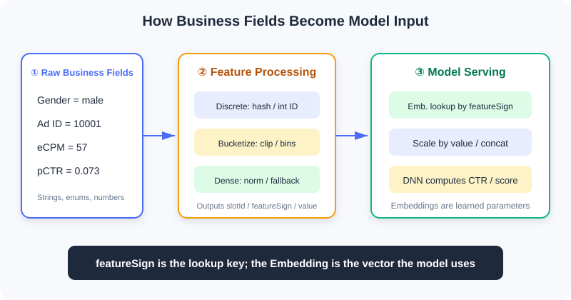
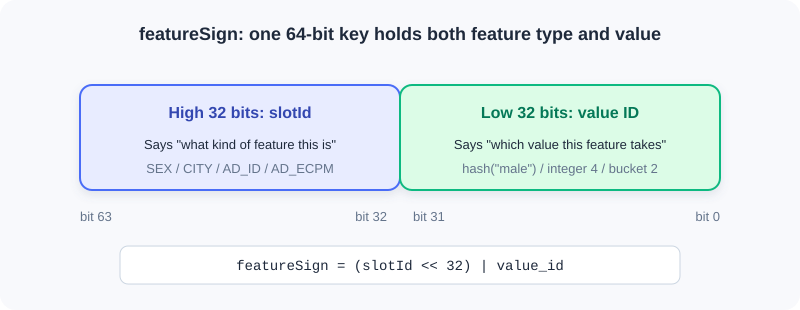
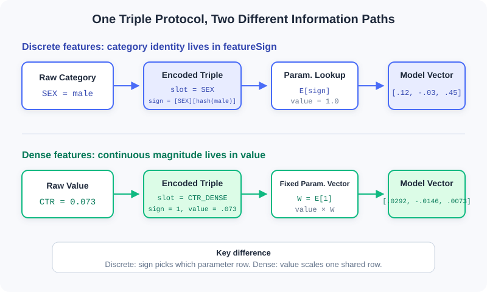

<div class="badge-row">
  <span style="background: #f0f4ff; color: #4A6CF7; padding: 4px 12px; border-radius: 20px; font-size: 0.85em; font-weight: 600; border: 1px solid rgba(74,108,247,0.2);">📖</span>
  <span style="background: #f0fdf4; color: #16a34a; padding: 4px 12px; border-radius: 20px; font-size: 0.85em; border: 1px solid rgba(22,163,74,0.2);">⏱️ ~65 min read</span>
  <span style="background: #fef9ec; color: #d97706; padding: 4px 12px; border-radius: 20px; font-size: 0.85em; border: 1px solid rgba(100,100,100,0.15);">🎯 Intermediate</span>
</div>

# Feature and Embedding Basics

> 📝 **Before You Continue:** Please first read the user—item—context triple in [1.1](./recommender-system-basics.md) and the technology map in [1.2](./book-overview.md). You need to be able to read basic C++ and know that a hash function can map a string to an integer deterministically; no machine learning background is required.

What a recommender system ultimately processes is not an abstract "user interest," but a set of concrete fields: `gender=male`, `city=Beijing`, `ad_id=10001`, `estimated_ctr=0.073`. Business code understands these fields, but a neural network only accepts numeric tensors. A bridge is missing between the two.

That bridge is **feature processing**. It turns raw business fields into `slotId + featureSign + value`, and the model service then looks up the meaningless IDs to obtain learnable **Embedding vectors**. This pipeline looks like nothing more than a data-format conversion, yet it determines what the model can see, how it generalizes, and whether training and online serving stay consistent.

---

## 1.3.0 From Business Fields to Model Input

A ranking request typically carries four kinds of information at once:

| Category | Typical Fields | Question Answered |
|------|----------|------------|
| **User information** | User ID, gender, age, city | Who is this person? What are their long-term preferences? |
| **Item information** | Ad ID, video ID, category, author | What is the current candidate? |
| **Context information** | Time, network, device, candidate position | In what situation does this request occur? |
| **Continuous values** | Estimated CTR, eCPM, quality score, duration | Exactly how strong is a given signal? |

All of this model-usable information is collectively called a **feature**. But raw values cannot be fed into the model as-is: strings cannot participate in matrix multiplication; the numeric magnitude of a business ID carries no semantics; and the scales of different continuous values can differ by a factor of billions.



The figure above shows the full division of responsibilities: the business service generates features, while the model service looks up Embeddings, combines features, and performs the network computation. The two are connected by a stable feature protocol.

> 💡 **Key Insight:** Feature processing is not just "turning things into numbers." It must simultaneously preserve **categorical identity, numeric magnitude, and engineering stability**, while ensuring that offline training and online prediction see the same representation.

---

## 1.3.1 The Triple: `slotId / featureSign / value`

Industrial systems typically organize a feature as the following record:

```cpp
struct FeatureInfo {
  int slotId;              // which field or feature group this feature belongs to
  int64_t featureSign;     // lookup key for the specific value
  float value;             // numeric value or weight
};
```

Each of the three fields manages one thing:

| Field | Meaning | Library Analogy |
|------|------|------------|
| `slotId` | What type of feature this is | Which shelf |
| `featureSign` | The ID of this specific value | The index number of a book on that shelf |
| `value` | The numeric value or weight for this occurrence | How strongly the book is used this time |

For example, when the user's gender is male, it can be expressed as:

```cpp
FeatureInfo sex_feature{
  .slotId = SEX,
  .featureSign = gen_feasign_string(SEX, "male"),
  .value = 1.0F
};
```

This reads as: "Go to the `SEX` shelf, find the entry for the value 'male', with weight `1.0` for this occurrence."

Continuous features divide the labor differently. If the estimated click-through rate is `0.073`:

```cpp
FeatureInfo ctr_feature{
  .slotId = AD_ETR_DENSE,
  .featureSign = 1,
  .value = 0.073F
};
```

Here `featureSign=1` is just a fixed placeholder; the real information lives in `value`. Keep this contrast in mind:

| Feature Representation | What Goes in `featureSign` | What Goes in `value` | Where the Information Lives |
|----------|----------------------|----------------|------------------|
| Sparse / bucketed | The ID of the category or bucket | Usually `1.0` | `featureSign` |
| Dense continuous | A fixed key, commonly `1` | The true normalized value | `value` |

> ⚠️ **Warning:** `featureSign` should be treated as an opaque 64-bit key. If it is generated as `uint64_t` and then stored in an `int64_t`, values with the highest bit set will appear negative under common two's-complement implementations. As long as downstream lookups use the same bit pattern, this is usually harmless — but never perform magnitude comparisons, `abs()`, or signed modulo on it.

---

## 1.3.2 How `featureSign` Is Generated

One common design places `slotId` in the high 32 bits and the ID of the specific value in the low 32 bits:



This way, even if the low-bit IDs of two fields happen to coincide, as long as their `slotId`s differ, the final keys still differ.

### String Values: Hash First, Then Combine

```cpp
static uint64_t gen_feasign_string(
    uint64_t slot_id,
    const std::string& value) {
  const uint32_t value_hash = gen_hash_new(value.data(), value.size());
  const uint64_t slot_bits = (slot_id << 32) & 0xffffffff00000000ULL;
  return slot_bits | value_hash;
}
```

This code works in three steps:

1. `gen_hash_new` deterministically maps the string to a 32-bit integer.
2. `slot_id << 32` moves the feature type into the high 32 bits.
3. A bitwise OR `|` combines the high-bit type and the low-bit value into one key.

For example, even if the low-bit hashes of `SEX=male` and `AGE_BUCKET=20` both equal `111`, the final keys remain `[SEX][111]` and `[AGE_BUCKET][111]` respectively. **Slot segmentation isolates different fields from each other.**

> 💡 **Key Insight:** `featureSign` works like "class number + student number." The student number only distinguishes students within a class; the class number in the high bits keeps identical student numbers from different classes from colliding.

### Integer Values: Encode Directly When Possible, Skip the Hash

If the value is already a small integer — for example network type `4`, weekday `2`, or bucket ID `7` — it can go directly into the low 32 bits:

```cpp
static uint64_t gen_feasign_int32(
    uint64_t slot_id,
    uint32_t value) {
  const uint64_t slot_bits = (slot_id << 32) & 0xffffffff00000000ULL;
  return slot_bits | value;
}
```

As long as the value can be fully represented by a 32-bit unsigned integer, this encoding introduces no extra hash collisions. Therefore, small enums and bucket IDs should prefer the integer version.

### Hash Collisions Are a Trade-off, Not an Error

Once strings are compressed into a 32-bit space, collisions are unavoidable. The low 32 bits offer only $2^{32}$ positions; by the birthday paradox, once a slot has about **77,000 distinct values**, the probability of at least one collision exceeds 50%.

| Example Slot | Cardinality | Collision Impact |
|-----------|------------|----------|
| `SEX` | $10^0$ | Negligible |
| `CITY` | $10^3$ | Usually negligible |
| `AD_ID` | $10^5 \sim 10^6$ | A few collisions appear |
| `GUID` | $10^8 \sim 10^9$ | Massive collisions are unavoidable |

After two distinct values collide, they share one Embedding, and the model can no longer tell them apart. So why do industrial systems still commonly use this **Feature Hashing**? Because it buys stateless, scalable feature generation: no giant string vocabulary needs to be maintained, and new values get a key immediately.

> **Analysis:**
> - **Benefit:** No central vocabulary needed; new values are handled naturally; online services scale horizontally.
> - **Cost:** Some semantic confusion; the original value cannot be recovered from the key; high-cardinality features are harder to debug.
> - **Mitigation:** Enlarge the hash space, use double hashing, filter low-frequency values, or maintain an independent vocabulary for critical high-cardinality slots.

---

## 1.3.3 Why Embeddings Are Needed

This is the most easily confused — and most critical — point of the chapter:

> 💡 **Key Insight:** **`featureSign` is the key for looking up an Embedding; it is not the Embedding itself.** It is responsible for stably indicating "which category this is," but not for expressing how this category relates to other categories.

The difference between the two:

| Object | Example | Trained? | Essence |
|------|------|----------|------|
| `featureSign` | `500111` | No | A stable, discrete index key |
| Embedding | `[0.12, -0.03, 0.88, 0.21]` | Yes | Vector parameters learned by the model from data |
| Embedding Table | `key → vector` | Yes | A parameter table that stores and updates vectors by key |

### From One-Hot to Embedding

Suppose `CITY` has only three values: Beijing, Shanghai, and Shenzhen. The most direct encoding is One-Hot:

```text
Beijing    -> [1, 0, 0]
Shanghai   -> [0, 1, 0]
Shenzhen   -> [0, 0, 1]
```

One-Hot has two properties: first, it never falsely creates magnitude relations; second, all categories are equidistant from each other. But when an ad ID has 10 million values, a single sample must logically occupy a 10-million-dimensional space, with only one position in the vector set to 1. Feeding such ultra-high-dimensional sparse vectors directly into the network makes both parameter count and computation prohibitive.

The Embedding layer can be viewed as a large matrix $E \in \mathbb{R}^{N \times d}$. Multiplying a One-Hot vector by the matrix is essentially selecting one row from $E$:

$$\underbrace{[0,\ldots,1,\ldots,0]}_{N\text{-dim One-Hot}} E = E_i \in \mathbb{R}^{d}$$

So in practice you never actually construct the One-Hot. Just pass in the `featureSign` of the category and directly look up $E_i$. This saves computation and lets the model, through training, pull categories with similar behavior into nearby regions of the vector space.

### Why You Can't Use `featureSign` Directly as an Embedding

Suppose there are three ads:

```text
Sneaker ad    -> featureSign = 105
Basketball ad -> featureSign = 980001
Baby formula  -> featureSign = 106
```

If the sign were used directly as a scalar input, the model would be handed absurd geometric relationships: the distance between sneakers `105` and baby formula `106` is only 1, while the semantically closer basketball ad `980001` is nearly a million away. This distance is determined entirely by chance of numbering or hashing, and represents nothing about behavioral similarity.

Using the sign directly has four further problems:

1. **Spurious ordering.** `500222 > 500111` does not mean one category is "bigger" or "better."
2. **Spurious distances.** Two hash values being close does not mean the two categories are similar; being far apart does not mean dissimilar.
3. **No way to learn category semantics.** The sign is a fixed integer; it will never move toward "more like basketball" or "more like sneakers" during backpropagation.
4. **Numeric precision risk.** If a 64-bit sign is converted to `float32`, beyond $2^{24}$ many adjacent integers can no longer be distinguished exactly, and different keys may be rounded to the same float.

An Embedding instead provides a set of **trainable parameters** for each key. If users who watch basketball content often click sneaker ads, training will gradually pull the two categories' vectors together; the baby-formula vector may end up in a different region. Distances between categories are learned from data, not dictated by hash values.

> ⚠️ **Warning:** "Converting the sign into 8 binary digits, splitting it by decimal digit, or normalizing it" is still not an Embedding. These operations merely expose an arbitrary ID in another way and cannot produce learnable category semantics. The correct approach is to treat the sign as an index and look up an independent, trainable vector.

### A Complete Lookup

Suppose `SEX=male` generates `featureSign=500111`, and the Embedding table currently stores:

```text
E[500111] = [ 0.12, -0.03, 0.45]
E[500222] = [-0.21,  0.34, 0.08]
```

During the forward pass, the model uses `500111` to look up the first row `[0.12, -0.03, 0.45]`. If this prediction's error back-propagates to this feature, only `E[500111]` and the related network parameters are updated — the integer `500111` itself is never modified.

This shows the strict separation of responsibilities:

```text
featureSign: stably locates parameters; unchanged before and after training
Embedding:   carries learnable semantics; continuously updated during training
```

### Why the Same Value Shares One Embedding

Two users who both have `SEX=male` generate the same `featureSign` and therefore look up the same Embedding. This does not make the two users indistinguishable, because the model sees a combination of many slots:

| User | Gender | Age Bucket | City | GUID |
|------|------|--------|------|------|
| A | Male | 20–24 | Beijing | `abc` |
| B | Male | 35–39 | Shenzhen | `xyz` |

Sharing actually brings generalization: the samples of all male users jointly update the "male" parameter, while other features — age, city, identity — continue to preserve individual differences.

### What Determines the Embedding Dimension

The dimension is not decided by the C++ feature-generation code, but by the model configuration, usually set per slot or per feature group:

| Slot | Possible Cardinality | Typical Dimension Guidance |
|------|------------|--------------|
| `SEX` | 3 | 2–4 dimensions usually suffice |
| `CITY` | $10^3$ | Start experimenting from 8 |
| `AD_ID` | $10^6$ | Commonly a trade-off within 8–32 |
| `GUID` | $10^9$ | Dimension times cardinality becomes a memory black hole — be careful |

The larger the dimension, the stronger the representational capacity, but the higher the memory, communication, and compute costs; with insufficient data it is also more prone to overfitting. It is a hyperparameter balancing model capacity against system cost — not "cardinality grows, so keep adding dimensions."

---

## 1.3.4 How Sparse and Dense Features Are Encoded

Both sparse and dense features fit into `slotId + featureSign + value`, but the field that "actually carries the information" is completely different on the two paths:



A sparse feature uses `featureSign` to select "which row of parameters"; a dense feature usually fixes the sign and uses `value` to determine "how much to scale the same set of parameters."

| Aspect | Sparse Features (Categorical) | Dense Features (Continuous / Numerical) |
|--------|---------------------------------|--------------------------------------|
| Question answered | Which category is it? | Exactly how much? |
| Typical values | Beijing, male, ad 10001, network type 4 | CTR 0.073, duration 3600 seconds, amount 57 yuan |
| Arithmetic relations | Magnitude and distance usually meaningless | Addition/subtraction, magnitude, and differences usually meaningful |
| Location of information | `featureSign` | `value` |
| Typical model handling | Look up Embedding by sign | Fed in directly or projected into a vector |

### Sparse Features: Encoding "Which Category"

**Sparse features** take values from a finite or enumerable set. Their numeric form is mere identity and should not be interpreted as continuous magnitude. Network type `4` does not mean it is twice network type `2`; ad ID `10002` is not "better" than `10001`.

A sparse feature typically goes through five steps:

1. **Normalize the raw value.** Unify encoding, casing, whitespace, and missing values — for example, map an empty city to `__UNKNOWN__`.
2. **Choose the slot.** `CITY`, `SEX`, and `AD_ID` each have their own `slotId`.
3. **Generate the sign.** Strings are hashed first; small integers can be encoded directly into the low 32 bits.
4. **Set the weight.** Single-valued categories usually use `value=1.0`.
5. **Look up the Embedding.** The model uses the sign to select one row in the parameter table.

#### Example 1: String Category `SEX=male`

Suppose `SEX` has `slotId=12`, and assume `hash("male")=0x3A91F20B`. Then:

```text
High 32 bits: slotId = 12       -> 0x0000000C00000000
Low 32 bits:  hash("male")      -> 0x000000003A91F20B
Final sign                      -> 0x0000000C3A91F20B
```

The business service generates:

```cpp
const std::string normalized_sex = user.sex.empty()
    ? "__UNKNOWN__"
    : user.sex;

features.emplace_back(
    SEX,
    gen_feasign_string(SEX, normalized_sex),
    1.0F);
```

The model-side handling can be written as:

```text
embedding = E_SEX[0x0000000C3A91F20B]
          = [0.12, -0.03, 0.45]
output    = 1.0 × embedding
          = [0.12, -0.03, 0.45]
```

Here `value=1.0` merely states "this category occurs in this instance." What actually distinguishes male, female, and unknown are the different signs, and the Embeddings each of them maps to.

#### Example 2: Integer Enum `APN_TYPE=4`

The network type is already a small integer; there is no need to convert it to a string and hash it first:

```cpp
features.emplace_back(
    APN_TYPE,
    gen_feasign_int32(APN_TYPE, 4),
    1.0F);
```

This generates `[APN_TYPE][4]`. Compared with the string version, it is more intuitive and introduces no additional 32-bit hash collisions.

#### How Multi-Value Sparse Features Are Handled

"User interest tags" may simultaneously include `basketball, running, photography`. In this case one slot yields multiple signs:

```text
[INTEREST][hash(basketball)]  value=1.0
[INTEREST][hash(running)]     value=1.0
[INTEREST][hash(photography)] value=1.0
```

After looking up the three Embeddings, the model usually applies `sum`, `mean`, weighted pooling, or attention-based aggregation. If the number of tags varies a lot, `mean` avoids the bias of "more tags, larger vector norm"; if different tags carry different importance, you can put business weights into `value`.

> **Analysis:**
> - **Strengths:** No spurious ordering; parameters learned independently per category; behavioral patterns shared through the vector space.
> - **Costs:** High-cardinality slots produce large tables; low-frequency categories get under-trained vectors.
> - **Key check:** The same business value must produce exactly the same sign offline and online.

### Dense Features: Encoding "Exactly How Much"

**Dense features** are numbers with continuous magnitude semantics. `CTR=0.08` is genuinely larger than `CTR=0.02`; watching 100 seconds is usually longer than watching 10. Encoding should preserve this numeric relationship rather than creating a separate Embedding for every decimal value.

Dense features have two common implementations across frameworks:

1. **Direct scalar input.** Concatenate the normalized $x$ with other vectors and feed it into the MLP.
2. **Unified slot protocol.** Use a fixed `featureSign=1` to look up a parameter vector $W$, and output $xW$.

This chapter's engineering uses the second. It is mathematically equivalent to projecting a one-dimensional scalar into $d$ dimensions through a bias-free linear layer:

$$\text{dense\_vector} = x \times W, \quad W = E_{slot}[1]$$

A dense feature typically goes through four steps:

1. **Validate and fall back.** Handle missing values, `NaN`, `inf`, and illegal negatives.
2. **Transform and normalize.** Depending on the distribution, use it directly, `log1p`, Min-Max, Z-Score, or quantile transformation.
3. **Fix the sign.** The slot uniformly uses `featureSign=1`, meaning only one set of projection parameters is needed.
4. **Put the number into value.** `value=x`; the model computes `x × E[1]`.

#### Example 1: Already-Normalized `CTR=0.073`

CTR itself lies in $[0,1]$, so it can be used directly at first:

```cpp
double ctr = ad.estimated_ctr;
if (!std::isfinite(ctr)) ctr = 0.0;
ctr = std::clamp(ctr, 0.0, 1.0);

features.emplace_back(
    AD_ETR_DENSE,
    1,
    static_cast<float>(ctr));
```

Suppose this slot's fixed parameter vector is:

```text
W = E_AD_ETR_DENSE[1] = [0.40, -0.20, 0.10]
```

Then the vector this sample passes to the upper network is:

```text
0.073 × W = [0.0292, -0.0146, 0.0073]
```

Another sample with `CTR=0.20` still looks up the same $W$, but the output becomes `[0.08, -0.04, 0.02]`. The dense path thus preserves the continuous relationship "0.20 is larger than 0.073."

#### Example 2: Long-Tailed Watch Duration `watch_seconds=3600`

Duration usually follows a long-tailed distribution. Putting `3600` directly into `value` would make its magnitude dwarf features like CTR. You can apply `log1p` first:

```cpp
double seconds = watch_seconds;
if (!std::isfinite(seconds) || seconds < 0.0) seconds = 0.0;
seconds = std::min(seconds, 86400.0);  // cap the top at 24 hours

const float encoded = static_cast<float>(std::log1p(seconds));
features.emplace_back(WATCH_TIME_DENSE, 1, encoded);
```

`3600` seconds is compressed to about `8.19`, preserving the monotonic "longer" relation while reducing the dominance of extreme values over gradients and other features.

> 📝 **Note:** The `E[1]` in a dense slot is sometimes colloquially called an "Embedding" too, but its role differs from a sparse categorical Embedding. A sparse Embedding is "one row per category"; a dense slot has only a single fixed row, essentially a set of learnable projection weights.

> ⚠️ **Warning:** Dense features cannot be stuffed into `value` unchecked. Large-magnitude values like timestamps, amounts, and counts will drown out other features and amplify gradients. Scale compression and outlier handling must come first.

Common processing methods:

| Method | Form | Suitable Scenarios |
|------|------|----------|
| `log1p` | $\log(1+x)$ | Long-tailed positive values: counts, durations, amounts, eCPM |
| Min-Max | $(x-min)/(max-min)$ | Stable and known value range |
| Z-Score | $(x-\mu)/\sigma$ | Approximately normal distribution |
| Quantile normalization | Map to the empirical CDF | Irregular distributions with many outliers |
| Use directly | Unchanged | Already in $[0,1]$, e.g., probability values |

Whichever method you choose, you must specify fallback rules for `NaN`, `inf`, missing values, and abnormal negatives. The `min/max/\mu/\sigma` values, quantile points, and truncation thresholds must also be shared between offline training and online serving.

### Bucketing: Which Interval Does It Fall In

**Bucketed features** first cut a continuous value into intervals, then treat the bucket ID as a category:

```cpp
static uint32_t cut_bucket(double value, uint32_t width) {
  return static_cast<uint32_t>(value / width);
}
```

If `eCPM=57` and the bucket width is `20`, the bucket ID is `2`. The final expression is `[AD_ECPM][2]` with `value=1.0`.

This is not a dense feature. It expresses "which interval it falls in"; each bucket has its own Embedding, so non-monotonic interval effects can be learned.

The raw `cut_bucket` still has three engineering traps:

1. **Negative values:** values in $(-width,0)$ may silently truncate into bucket 0; more negative values may exceed the representable range when converted to an unsigned integer — do not rely on that result.
2. **`NaN` / `inf`:** converting to an integer has no usable semantics and may trigger undefined behavior.
3. **Zero bucket width:** division by zero yields an invalid result.

A safer implementation should validate parameters first, clamp abnormal values, and set a top bucket:

```cpp
#include <algorithm>
#include <cmath>
#include <cstdint>
#include <stdexcept>

uint32_t safe_cut_bucket(
    double value,
    double width,
    uint32_t max_bucket) {
  if (!std::isfinite(width) || width <= 0.0) {
    throw std::invalid_argument("bucket width must be positive");
  }
  if (!std::isfinite(value) || value < 0.0) {
    value = 0.0;  // ← KEY LINE: unified fallback for abnormal inputs
  }

  const double raw_bucket = std::floor(value / width);
  const double capped = std::min(raw_bucket,
                                 static_cast<double>(max_bucket));
  return static_cast<uint32_t>(capped);
}
```

> **Analysis:**
> - **Equal-width bucketing:** simple to implement, but long-tailed distributions often cram most samples into the first few buckets.
> - **Equal-frequency bucketing:** more balanced samples per bucket, but depends on stable quantile statistics.
> - **Logarithmic bucketing:** suits positive values spanning several orders of magnitude, balancing head and tail.
> - **Top-bucket capping:** prevents extreme values from creating hordes of sparse buckets that appear only once or twice.

### Why Bucketing and Dense Are Often Used Together

| Aspect | Bucketed Sparse | Dense Continuous |
|------|----------|------------|
| `featureSign` | Bucket ID | Fixed key |
| `value` | `1.0` | The true normalized value |
| Number of parameter rows | One per bucket | One for the whole slot |
| Good at | Non-linearity, interval effects | Exact magnitude, continuous variation |
| Limitations | No resolution within a bucket; discontinuous boundaries | A single linear scaling struggles with complex non-monotonic relations |

Using both is not pointless duplication. Bucketing tells the model "which interval it's in"; dense tells the model "exactly how much." They express the same business quantity from different angles.

---

## 1.3.5 The Embedding Table and Engineering Boundaries

### Table Size Is Determined by the Number of Unique Values

The main memory of an Embedding table can be roughly estimated as:

$$\text{Memory} \approx \sum_{slot} \left(|V_{slot}| \times d_{slot} \times 4\text{ bytes}\right)$$

where $|V_{slot}|$ is the number of unique `featureSign`s in that slot, and $d_{slot}$ is the Embedding dimension. Real systems must also account for hash-table metadata, keys, pointers, and optimizer states; optimizers like Adam may additionally store one or two same-sized copies of state.

Table size does not directly depend on request volume. If a billion users have only three genders, the `SEX` slot still needs only a handful of entries; but `GUID` is nearly "one value per user," so its scale grows with the user base.

### Admission, Eviction, and OOV

High-cardinality slots keep producing new keys, so production systems must constrain table growth:

| Mechanism | Typical Strategy | Problem Solved |
|------|----------|------------|
| **Admission** | Create an entry only after the count reaches a threshold | Filters one-off noise and ultra-long-tail values |
| **Eviction** | Delete after being absent for several consecutive days | Cleans up inactive users and offline ads |
| **OOV** | Zero vector, default bucket, or deferred entry creation | Handles new keys not yet in the table |

"What happens when a key is not found" must be confirmed before adding any new feature. If downstream defaults to "randomly initialize and write immediately," a high-cardinality feature can bloat the parameter table in a short time; if a zero vector is returned, that feature contributes nothing during cold start, and the model must rely on other generalizable features.

### How Embeddings Are Trained

Embeddings are part of the recommendation model, trained jointly with the upper network:

1. The forward pass looks up vectors by `featureSign`.
2. Multiple vectors are concatenated or pooled with dense features.
3. The DNN outputs click-through rate, conversion rate, or a ranking score.
4. Prediction error back-propagates, updating both the Embeddings and the network parameters.

Only keys covered by training samples receive effective updates. Long-tail features that appear only once or twice have vectors close to their random initialization — occupying memory while injecting noise. This is exactly why frequency-based admission exists.

### Offline/Online Consistency

This is the most hidden and most common source of incidents in feature engineering. Training samples and online requests must be strictly aligned:

- Hash algorithm, seeds, and string encoding;
- `slotId` enum values and candidate-position offsets;
- Bucket boundaries, bucket widths, and top buckets;
- Normalization statistics;
- Missing-value, outlier, and casing rules;
- String `trim`, concatenation order, and separators.

These bugs often do not crash. The service still returns scores, monitoring may be all green — the model just looks up "wrong but legal" parameters, and online performance quietly degrades.

> ⚡ **Pro Tip:** Treat changing the hash, changing slots, or changing bucket boundaries as "swapping the model," not a routine code hotfix. Prioritize sharing one feature library between offline and online; before launch, sample real requests and compare the triples generated on both sides field by field.

---

## 1.3.6 Complete Case Study: Adding an eCPM Feature to Ads

Suppose the business already has `ad.ecpm`, and we want to preserve both its exact magnitude and its non-linear interval effects. The sound approach is to create two different slots:

```cpp
#include <algorithm>
#include <cmath>
#include <cstdint>
#include <vector>

struct FeatureInfo {
  uint32_t slot_id;
  uint64_t feature_sign;
  float value;
};

enum Slot : uint32_t {
  AD_ECPM_BUCKET = 101,
  AD_ECPM_DENSE = 102
};

uint64_t make_int_sign(uint32_t slot_id, uint32_t value_id) {
  return (static_cast<uint64_t>(slot_id) << 32) | value_id;
}

uint32_t safe_bucket(double value,
                     double width,
                     uint32_t max_bucket) {
  if (!std::isfinite(value) || value < 0.0) value = 0.0;
  if (!std::isfinite(width) || width <= 0.0) return 0;
  const double bucket = std::floor(value / width);
  return static_cast<uint32_t>(
      std::min(bucket, static_cast<double>(max_bucket)));
}

void append_ecpm_features(double raw_ecpm,
                          std::vector<FeatureInfo>& output) {
  const double clean_ecpm =
      (!std::isfinite(raw_ecpm) || raw_ecpm < 0.0) ? 0.0 : raw_ecpm;

  const uint32_t bucket = safe_bucket(clean_ecpm, 20.0, 100);
  output.push_back({
      AD_ECPM_BUCKET,
      make_int_sign(AD_ECPM_BUCKET, bucket),
      1.0F
  });

  const float dense_value =
      static_cast<float>(std::log1p(clean_ecpm));
  output.push_back({
      AD_ECPM_DENSE,
      1,
      dense_value
  });
}
```

With input `raw_ecpm=57`, the two features express:

| Slot | `featureSign` | `value` | Information the Model Gets |
|------|---------------|---------|------------------|
| `AD_ECPM_BUCKET` | `[slot][2]` | `1.0` | eCPM falls in bucket 2 |
| `AD_ECPM_DENSE` | `1` | `log1p(57)` | The compressed exact magnitude |

> **Analysis:**
> - **Expressiveness:** bucketing captures non-linearity; dense preserves continuous variation — the two complement each other.
> - **Parameter cost:** the bucket slot has at most 101 parameter rows; the dense slot has a single vector.
> - **Consistency requirement:** the offline side must use the same bucket width, top bucket, `log1p`, and abnormal-value fallback.
> - **Launch check:** snapshot-test the triple for normal values, negatives, `NaN`, and extreme values respectively.

When adding a real feature, confirm each item on this checklist:

- [ ] Is it a category, a continuous value, or does it need the dual "bucketed + dense" representation?
- [ ] Are the string encoding, casing, `trim`, and concatenation rules fixed?
- [ ] Can small integers be encoded directly, avoiding unnecessary hashing?
- [ ] Are the dense value's magnitude, normalization, and abnormal-value fallback clearly specified?
- [ ] Should bucketing use equal-width, equal-frequency, or logarithmic boundaries? Is a top bucket set?
- [ ] Is the scale of unique values and the Embedding memory acceptable?
- [ ] Are high-cardinality slots governed by admission and eviction rules?
- [ ] What does the model service return for OOV?
- [ ] Do offline training and online serving reuse the same logic and configuration?
- [ ] Has a field-by-field consistency comparison been completed before launch?

---

## ⚠️ Common Mistakes in 1.3

| # | Mistake | Example | Why It's Wrong | Fix |
|---|---------|---------|----------------|-----|
| 1 | Treating `featureSign` as an Embedding | "Convert the hash value to a float and feed it to the DNN" | IDs create spurious ordering and distances; converting a 64-bit integer to `float32` also loses key precision | Use the sign to look up an independent, trainable vector |
| 2 | Believing hashes never collide | Using a 32-bit hash for high-cardinality GUIDs without monitoring | Distinct values end up sharing parameters | Estimate cardinality and collisions; widen or filter if needed |
| 3 | Feeding raw dense values into the model | Writing a timestamp into `value` | The magnitude overwhelms other features and amplifies gradients | Normalize, clamp, and unify statistics |
| 4 | Not validating before bucketing | Casting negatives, `NaN`, `inf` directly to `uint32_t` | Produces wrong buckets or unreliable behavior | Check finiteness, non-negativity, and bucket width |
| 5 | Not setting a top bucket | Extreme values keep creating new buckets | Sparse parameters and uncontrolled table growth | `min(bucket, MAX_BUCKET)` |
| 6 | Writing separate logic online and offline | Python and C++ bucket boundaries differ | Looks up wrong-but-legal Embeddings, hard to alert on | Share a library/config and run feature diffs |
| 7 | Ignoring OOV behavior | New keys auto-insert into the table without admission | High-cardinality features quickly bloat memory | Confirm OOV, admission, and eviction before launch |
| 8 | Doing arithmetic on signed signs | Calling `abs()` on a negative `featureSign` for sharding | Changes the bit pattern or triggers boundary issues | Treat as unsigned keys/byte strings |

---

## Chapter Summary

### 📌 Key Takeaways

| Concept | Key Points | Why It Matters |
|---------|------------|----------------|
| Feature triple | `slotId` manages the type, `featureSign` manages the value, `value` manages the number/weight | The protocol between business services and model services |
| Feature Hashing | Strings map deterministically into a finite key space; collisions are unavoidable | Buys vocabulary-free, scalable online processing |
| Embedding | The sign only indexes; the Embedding is a vector trained on supervised signal | Lets category relations be learned from data, not dictated by hash IDs |
| Sparse | Normalize category → generate sign → `value=1.0` → look up an independent vector | Expresses "which category" without spurious magnitude |
| Dense | Validate/transform the number → fix the sign → write the number into `value` → project | Preserves "exactly how much" and continuous variation |
| Bucketing | Cut a continuous value into intervals first, then look it up as a category | Captures non-linear interval effects |
| Table scale | Determined by unique key count × dimension | High-cardinality features require memory governance |
| Engineering consistency | Hash, slots, buckets, normalization, and missing-value rules must be aligned | Prevents "service healthy, performance degraded" silent incidents |

### ❓ FAQ

**Q1: Why can't we just use `featureSign` as the Embedding?**
> A: Because the sign is an arbitrary ID — its magnitude and distances carry no business semantics, and converting a 64-bit sign to `float32` may also lose precision. An Embedding is a set of independent trainable parameters looked up by sign; similarity between categories is learned from data such as clicks and conversions, not determined by hash values.

**Q2: Why do dense features also need a `featureSign`?**
> A: Under the unified slot protocol, it still has to locate the slot's set of weights. The fixed key means all samples share that set of parameters, scaled by different `value`s.

**Q3: Should a continuous value be bucketed or dense?**
> A: Use dense when you need exact magnitude and continuous variation; use bucketing when the relation is clearly non-linear or you need interval effects. Important features often use both representations at once.

**Q4: Why doesn't the Embedding table grow linearly with request volume?**
> A: Repeated occurrences of the same sign reuse the same parameter. The table grows with "the number of unique values"; only high-cardinality slots like GUID and ad ID can approach user- or item-level scale.

**Q5: Why does changing the bucket width usually require retraining the model?**
> A: After the width changes, the same business value maps to a different key, and the old Embeddings' semantics no longer line up. Rule changes must ship together with a new model.

### 🔗 Connections to Later Chapters

- **Section 2.3** (two-tower models) aggregates multiple groups of user and item Embeddings into the two side vectors, then uses them for large-scale retrieval.
- **Section 3.1** (Wide & Deep) feeds sparse Embeddings and continuous features into the Deep part, establishing the ranking model's generalization capability.
- **Section 3.2** (feature crossing) further studies how second- and higher-order interactions occur among different features' Embeddings.
- **Section 6.4** (codebook quantization and semantic IDs) presents another discrete representation: making item IDs themselves carry hierarchical semantics.
- **Part 11** (generative recommender systems in practice) chains offline feature generation, online feature serving, and model deployment into a complete engineering loop.

---

## Practice Problems

Work through them in order. Later problems progressively add scale, outliers, and consistency constraints.

---

**Problem 1.3.1 — Dividing Labor in the Triple** 🟢 Easy

Given `CITY=Beijing` and `estimated_ctr=0.08`, explain for each whether the key information should go in `featureSign` or `value`.

<details>
<summary>💡 Suggested Answer (click to reveal)</summary>

**Reasoning:** City is a category; CTR is a continuous value — the two have different representation goals.

**Answer:** The categorical identity of `CITY=Beijing` goes in `featureSign`, with `value` usually `1.0`; CTR uses a fixed sign, with `0.08` placed in `value`.

**Key points:**
- Sparse answers "which category."
- Dense answers "exactly how much."
</details>

---

**Problem 1.3.2 — Telling Keys from Vectors** 🟢 Easy

Suppose `hash("male") = hash("20") = 111`. Would `SEX=male` and `AGE_BUCKET=20` get the same `featureSign`? And can the final sign be used directly as a model vector?

<details>
<summary>💡 Suggested Answer (click to reveal)</summary>

**Reasoning:** The full key is jointly determined by the high-32-bit slot and the low-32-bit value ID; the key only locates parameters and does not express category semantics.

**Answer:** The two signs are not the same — they are `[SEX][111]` and `[AGE_BUCKET][111]` respectively, because the high-bit slots differ. Neither can serve directly as a model vector; each must look up a trainable Embedding in its own slot's parameter table.

**Key points:**
- Slots isolate different fields.
- Hash collisions only need to be discussed within the same slot.
- Numeric distances between signs have no business meaning and cannot replace Embeddings.
</details>

---

**Problem 1.3.3 — Choosing a Representation** 🟡 Medium

You need to add "purchase amount over the last 30 days," with an extremely long-tailed distribution. You want to preserve the magnitude, but also suspect non-monotonic effects across spending intervals. Design the feature representation.

<details>
<summary>💡 Suggested Answer (click to reveal)</summary>

**Reasoning:** A single representation cannot simultaneously achieve continuous precision and free interval effects.

**Answer:** Create two slots: one applies `log1p` to the amount and treats it as dense; the other uses logarithmic bucketing or offline equal-frequency boundaries as a sparse bucket feature. Both sides unify the outlier, boundary, and top-bucket configuration.

**Key points:**
- Dense preserves continuous magnitude.
- Bucketing captures non-linearity.
- Check: offline and online should output exactly identical triples for the same amount.
</details>

---

**Problem 1.3.4 — Tracking Down a Silent Failure** 🔴 Hard

A new model's offline AUC is normal, and the online service reports no errors, yet performance drops markedly. Investigation finds that offline Python hashes after `value.strip().lower()`, while the online C++ hashes the raw string directly. Explain the cause and design a fix plus a recurrence-prevention plan.

<details>
<summary>💡 Suggested Answer (click to reveal)</summary>

**Reasoning:** The two sides generated different keys for the same business value, so the online service looked up parameters that were never updated during training.

**Answer:** Unify string normalization and the hash implementation, rebuild the training samples, and retrain the model; before launch, run the offline and online feature logic on the same batch of real requests and diff `slotId/featureSign/value` field by field. Put normalization rules and hash seeds in a shared library or a single versioned configuration.

**Key points:**
- This is feature misalignment, not a model-structure problem.
- The old model cannot be directly adapted to the new keys.
- Check: consistency tests should cover whitespace, casing, null values, and non-ASCII characters.
</details>

---

**🏆 Challenge: Estimating the Cost of a High-Cardinality Feature**

An `AD_ID` slot has 50 million active keys, an Embedding dimension of 16, using FP32. How much memory do the vectors alone require? If training additionally keeps two same-sized optimizer states, what is the minimum total? Then explain why actual deployment is even larger.

<details>
<summary>💡 Hint</summary>

First compute $50{,}000{,}000 \times 16 \times 4$ bytes, then multiply by the copies for parameters and optimizer states. Don't forget hash-table keys, pointers, alignment, and load factor.
</details>
