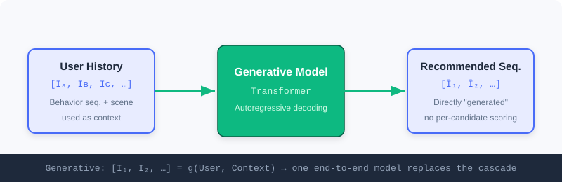
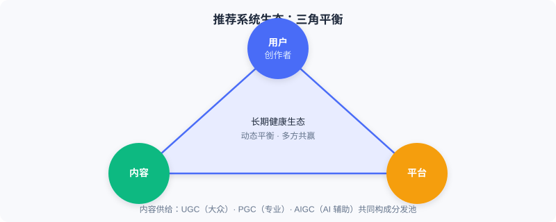

<div class="badge-row">
  <span style="background: #f0f4ff; color: #4A6CF7; padding: 4px 12px; border-radius: 20px; font-size: 0.85em; font-weight: 600; border: 1px solid rgba(74,108,247,0.2);">📖</span>
  <span style="background: #f0fdf4; color: #16a34a; padding: 4px 12px; border-radius: 20px; font-size: 0.85em; border: 1px solid rgba(22,163,74,0.2);">⏱️ ~25 min read</span>
  <span style="background: #f0fdf4; color: #16a34a; padding: 4px 12px; border-radius: 20px; font-size: 0.85em; border: 1px solid rgba(100,100,100,0.15);">🎯 Beginner</span>
</div>

# What Is a Recommender System

> 📝 **Before You Continue:** This chapter is the foundational starting point and requires no prior recommender systems knowledge. You only need to know one basic fact: "machine learning is letting a model learn patterns from data."

When you open your phone in the morning to catch up on news, or browse around an e-commerce app, you may not realize it: a sophisticated system is making thousands of judgments within milliseconds, deciding what you see and what you miss. This is the **recommender system** — one of the most fundamental pieces of infrastructure in the modern internet.

But "helping users find content they're interested in" is only a surface-level description. To truly understand it, we need to observe it from three levels: from the most microscopic **single prediction**, to the industrial-scale **process at scale**, to the macroscopic **ecosystem balance**. Only by moving through these levels in turn can you grasp the core logic of recommender systems.

After reading this chapter, you will be able to:

- Explain in **one sentence** the microscopic problem recommender systems solve, and distinguish its two fundamental paradigms
- Write down the core formulas of **discriminative** and **generative** recommendation, and explain how the questions they ask differ
- Explain why industrial recommendation adopts the **three-stage funnel** of "retrieval—ranking—re-ranking," and what each stage is responsible for
- Describe how **end-to-end generative architectures** dissolve the three major pain points of cascading architectures
- Understand the long-term value of recommender systems from the **ecosystem triangle** (users/creators, content, platform)
- Complete 4 leveled practice problems to consolidate the three perspectives

---

## 1.1.0 Three Perspectives: From Micro to Macro

The biggest mistake in understanding recommender systems is "seeing only the algorithms." The same system looks completely different when viewed at different scales:

| Perspective | Object of Observation | Core Question |
|------|----------|----------|
| 🔬 Micro | A single "user—item" judgment | How do the two fundamental paradigms define recommendation? |
| 🏭 Industrial | Hundreds of millions of items → one list | How to perform large-scale filtering within milliseconds? |
| 🌍 Macro | A multi-party ecosystem | Is a technically "accurate" system necessarily a good system? |

Let's unpack each in turn.

---

## 1.1.1 The Micro Perspective: Two Fundamental Paradigms of the Recommendation Problem

Let's start from the most basic unit. The core problem facing a recommender system seems simple — **how do we find the most valuable content for a user?** But there are two fundamentally different approaches to answering this question.

Whichever approach is taken, the system must first deeply understand three key elements:

- **Understanding the User** — who you are and what your interests are. Historical behavior is the most important signal; explicit feedback (like a "not interested" button) and profile information (age, region) provide clues; real-time intent (what you just searched) is equally critical.
- **Understanding the Item** — its content attributes (category, duration, quality) and statistical attributes (view count, ratings, engagement trends).
- **Understanding the Context** — a weekday morning or a weekend night? Commuting on the subway or relaxing at home? Subtle differences significantly affect preferences.

> 💡 **Key Insight:** The two paradigms share **the same inputs** (both must understand user, item, and context), but they **ask fundamentally different questions**. This point determines all subsequent differences in architecture and optimization objectives.

### The First Approach: Discriminative Recommendation

It defines recommendation as: given a specific "user—item—context" triple, predict the probability that the user will take a positive action on that item. The core is a **scoring function**:

$$Score = f(User, Item, Context)$$

The system evaluates each candidate item one by one, computes a score, and then recommends the best. This is like a judge who scores every contestant one by one and finally selects the top scorers.


Discriminative recommendation integrates user features $U$, item features $I$, and context features $C$ to score each candidate item one by one, predicting the likelihood of a "valuable connection."

### 🧠 Mental Model: The Talent-Show Judge

> Think of recommendation as a "talent-show judge." The stage is full of contestants (candidate items), and the judge (the model) scores **each** contestant individually, then hands out passes by score. The judge never "announces the list directly" — scoring is the judge's only job.

### The Second Approach: Generative Recommendation

It fundamentally redefines the problem: instead of evaluating candidates one by one, the model **directly "creates" the recommendation result** based on its understanding of the user and context. The core is a **generation function**:

$$[I_1, I_2, \ldots, I_k] = g(User, Context)$$

The model takes the user's historical interaction sequence and current context as input, and directly generates a sequence of recommended items through autoregressive decoding. This is like a friend who knows your taste — no need to comb through all the options; they just say "here's what you should watch next."



Generative recommendation takes the user's historical interactions and context as input, and directly outputs a sequence of recommended items through a generative model — no need to evaluate candidates one by one.

> 🤔 **Why do both paradigms coexist?** Discriminative recommendation is extremely mature and stable at "selecting the best from a finite candidate set"; generative recommendation has huge potential for "creating in an open space." The former asks "will the user like this item?", while the latter asks "what does the user want to see next?" — the former **selects**; the latter **creates**.

### Four Stages of Capability Evolution

Looking at a longer timeline, recommendation algorithms show a clear trajectory of capability evolution, one that runs through both paradigms:

1. **Memorization on pure IDs** — collaborative filtering treats items as opaque symbols, memorizing co-occurrence patterns like "people who watched A also watched B."
2. **Generalization through deep learning** — deep networks generalize knowledge to unseen user—item combinations through feature crossing and sequence modeling, but items remain atomic IDs.
3. **Understanding through semantic IDs** — when items are encoded as structured tokens carrying semantics, the system begins to truly "understand" content meaning; new items can be recommended without accumulating behavioral data.
4. **Reasoning with large models** — instead of implicitly computing scores, the model explicitly analyzes intent, evaluates matches, and gives reasons, evolving from a "pattern matcher" into a "reasoner that can explain its decisions."

> 💡 **Key Insight:** These four stages **do not linearly replace one another**; they stack and coexist. In today's industrial systems, ID-based collaborative filtering remains a major retrieval channel, deep generalization supports every stage from retrieval to ranking, while semantic IDs and large-model reasoning are emerging at the frontier.

---

## 1.1.2 The Industrial Perspective: Two Technology Routes at Scale

Having understood the two basic paradigms, we immediately face a shared practical challenge: **scale**. A typical video platform has hundreds of millions of users and over a hundred million items, and recommendation must complete the entire process — from a massive item pool to a personalized list — within millisecond-level latency. If the page takes more than a few seconds to load, most users will leave.

> ⚠️ **Warning:** The core tension in recommender-system engineering is — **how do we find the best result from a massive candidate pool within extremely limited time?** The two paradigms offer fundamentally different answers.

### The Discriminative Answer: A Multi-Stage Pipeline

The core difficulty of the discriminative paradigm is that computing a match score between every user and every item would instantly overwhelm even the strongest servers. Industry's answer is a **staged funnel architecture**, using the three-stage "retrieval—ranking—re-ranking" pipeline to progressively narrow the candidates, balancing efficiency and effectiveness.


- **① Retrieval** — quickly filter a few thousand possibly relevant candidates from the full item pool. Its motto is "better to over-include than to miss," prioritizing coverage over precision; models are simple and features are limited (e.g., using collaborative filtering to find similar users, or retrieving based on content similarity).
- **② Ranking** — where the prediction function $f$ truly shines. It deploys the most complex deep models, fusing the full set of user/item/context features to compute a precise score for each candidate, maximizing prediction accuracy.
- **③ Re-ranking** — the final optimization over the ranked list. It solves the problem that "the highest-scoring list ≠ the best-experience list": introducing diversity and novelty to avoid aesthetic fatigue when the top ten are all similar content, while handling business rules such as ads and operations.

> 💡 **Key Insight:** The essence of the three-stage pipeline is — **use different strategies at different stages, progressively filtering from "possibly relevant" to "best match."** Retrieval pursues coverage, ranking pursues precision, re-ranking pursues experience; all three are indispensable.

### The Generative Answer: End-to-End Generation

Generative recommendation proposes a radically different approach: if the model can directly "generate" results, why do we still need multi-stage filtering? Generative recommendation treats the user's historical interaction sequence as "context," and directly decodes a sequence of item tokens through autoregressive models like Transformers — **the entire process is completed end-to-end within a single unified model**, with no retrieval/ranking/re-ranking cascade.

> 💡 **Key Insight:** The end-to-end architecture eliminates three core pain points of cascading architectures:
> - **Objective misalignment** — retrieval optimizes relevance, ranking optimizes click-through rate, re-ranking optimizes diversity, each fighting its own war;
> - **Information loss** — high-quality items filtered out at retrieval are forever invisible to later stages;
> - **Computational fragmentation** — different stages use different models, making it hard to fully exploit modern GPU capacity.

The interactive demo below lets you experience the funnel process of "hundreds of millions → one list" firsthand:

<iframe src="../viz/part1-pipeline.html?embed&vizId=part1-pipeline" style="width:100%; height:520px; border:none; display:block;" loading="lazy"></iframe>

Click "Next Step" or "Autoplay" to watch the candidate pool shrink step by step from hundreds of millions down to the final list of 10, and observe the different responsibilities each stage carries.

> 📊 **Data Point:** The two architectures currently **develop in parallel** in industry: the discriminative pipeline serves mature scenarios stably through "divide and conquer"; the generative architecture shows huge potential in frontier exploration through "end-to-end optimization."

---

## 1.1.3 The Macro Perspective: Building a Win-Win Ecosystem

Placing recommender systems in a broader view reveals a deeper question: **is a technically perfect recommender system necessarily a truly excellent one?** The answer is often no.

Consider the classic **"accuracy trap"**: a user has just added a phone to their cart, and the system recommends that same phone to them. Click-through and conversion rates may approach 100%. By the metrics this is extremely "accurate," but what value does it create? Almost none — the user was going to buy it anyway; the recommendation merely repeats information the user already knows, with no incremental value.

> 💡 **Key Insight:** The ultimate goal of a recommender system is **not to blindly maximize technical metrics, but to build a healthy ecosystem where all participants benefit long-term**. The ecosystem rests on three pillars: **users and creators, content, and the platform** — the three are interdependent.



- **Users and creators** — sitting at the two ends of content consumption and supply. Users are the ultimate service target; the system should help them discover content they are "genuinely interested in but haven't yet encountered," rather than trapping them in an "ever-narrowing" filter bubble. Creators are the core of content supply; distribution capability directly determines their survival space and motivation. The supply side is shifting from primarily professional teams (PGC) toward ordinary users creating spontaneously (UGC) as the main body, with AI-assisted generation (AIGC) emerging as well, blurring the boundary between consumers and producers.
- **Content** — the medium connecting users and creators, and the true "atomic unit" of distribution. A healthy system must not only distribute popular content, but also continuously surface promising content, avoiding "concentration at the head, drowning of the long tail."
- **The platform** — the ecosystem's coordinator. It must optimize effectiveness — satisfaction and time spent — while also attending to long-term health (diversity, suppressing low quality, protecting creator motivation), sometimes sacrificing short-term metrics in exchange for long-term trust.

> ⚡ **Pro Tip:** A truly excellent recommender system is a **delicate balancer** — finding dynamic equilibrium among users, creators, content quality, and platform development. This requires designers to be not only technical experts, but also to possess an **ecosystem mindset**.

---

## ⚠️ Common Mistakes in 1.1

| # | Mistake | Example | Why It's Wrong | Fix |
|---|---------|---------|---------------|-----|
| 1 | Equating recommendation with "ranking" | "A recommender system is just a click-through-rate prediction model" | Ranking is only one of three stages; retrieval comes before it and re-ranking after | Always understand recommendation through the full "retrieval→ranking→re-ranking" picture |
| 2 | Confusing the questions the two paradigms ask | Assuming generative recommendation also "scores every candidate" | The generative approach directly produces a sequence and does no per-candidate evaluation | Remember: discriminative **selects**, generative **creates** |
| 3 | Metrics-only thinking | Using a 100%-conversion "post-add-to-cart recommendation" to prove the system is excellent | No incremental value — falling into the accuracy trap | Ask: does the recommendation create value the user would not otherwise have gotten? |
| 4 | Ignoring the ecosystem's long-term nature | Mindlessly pushing clickbait for short-term watch time | Destroys trust and the creator ecosystem, collapsing in the long run | Evaluate trade-offs with the ecosystem triangle; dare to sacrifice short-term metrics |

---

## Chapter Summary

### 📌 Key Takeaways

| Concept | Key Points | Why It Matters |
|---------|-----------|----------------|
| Discriminative recommendation | $Score=f(U,I,C)$, scoring and selecting among candidates one by one | The backbone of industrial recommendation — mature and stable |
| Generative recommendation | $[I_1..I_k]=g(U,C)$, directly generating a sequence | End-to-end with huge potential — the frontier direction |
| Three-stage pipeline | Retrieval (coverage) → ranking (precision) → re-ranking (experience) | Balances efficiency and effectiveness within millisecond latency |
| End-to-end generation | A single model replaces the multi-stage cascade | Solves objective misalignment, information loss, and compute fragmentation |
| Ecosystem triangle | Users/creators, content, platform | Look beyond metrics to understand the system's long-term value |

### ❓ FAQ

**Q1: Which is better, discriminative or generative?**
> A: Neither is absolutely superior. Discriminative approaches are stable and efficient in mature scenarios; generative approaches have great potential in frontier exploration. The two currently **develop in parallel** in industry — choose based on your business stage.

**Q2: Why not just show users the entire item pool and let them pick?**
> A: Among hundreds of millions of items, users will only look at a tiny fraction. The value of recommendation is precisely **doing subtraction on the user's behalf within a space of hundreds of millions**, and doing so within milliseconds — this is an engineering reality, not a design preference.

**Q3: Why can the retrieval stage use "simple models"?**
> A: Retrieval's motto is "better to over-include than to miss"; its goal is **coverage**, not precision. The candidate set will be finely filtered by ranking afterward, so the retrieval side can trade lightweight models for speed.

### 🔗 Connections to Later Chapters

- **1.2** (book overview) maps this section's three perspectives onto the book's technology map, locating each chapter on the capability-evolution curve.
- **2.1–2.5** (retrieval) expands the concrete algorithm families of "retrieval" within the three stages.
- **3.1–3.5** (ranking) dives into the engineering implementation of the discriminative scoring function $f$.
- **5.3** (evolution of the generative paradigm) echoes this section, systematically tracing the leap from discriminative to generative.

---

## Practice Problems

Work through all problems in order — they get progressively harder. Each has a complete solution you can reveal after trying it yourself.

---

**Problem 1.1.1 — Distinguishing Paradigms** 🟢 Easy

Given the following two system descriptions, determine whether each is closer to the **discriminative** or **generative** paradigm, and explain why.

- (a) The system computes a "probability the user clicks" for each candidate ad, ranks by probability, and shows the top 5.
- (b) The system reads the user's last 20 plays and directly outputs "the 3 video IDs you might want to watch next."

<details>
<summary>💡 Solution (click to reveal)</summary>

**Approach:** Grasp the difference in the "questions asked" by the two paradigms — is it per-candidate scoring, or directly producing a sequence?

- **(a) Discriminative:** computing a click probability separately for each candidate ad and then ranking is exactly the "score one by one, select the best" of $Score=f(U,I,C)$.
- **(b) Generative:** directly decoding a sequence of recommended IDs from the history, with no per-candidate evaluation, corresponds to $[I_1,I_2,I_3]=g(U,C)$.

**Key points:**
- Discriminative = candidates known, scored one by one; generative = directly "creates" a sequence.
- The key to judging is whether the system enumerates and evaluates every single candidate.

</details>

---

**Problem 1.1.2 — Completing the Pipeline** 🟢 Easy

A recommender system faces 100 million items and finally shows 10. Fill in the correct stage names in the brackets so it matches the industrial funnel:

`Full item pool (100M) → [ ① ] → Candidates (~2000) → [ ② ] → Candidates (~200) → [ ③ ] → Final list (10 items)`

<details>
<summary>💡 Solution (click to reveal)</summary>

**Approach:** Recall the "progression of responsibilities" in the three-stage funnel.

```
Full item pool (100M) → [ Retrieval ] → Candidates (~2000)
                      → [ Ranking ] → Candidates (~200)
                      → [ Re-ranking ] → Final list (10 items)
```

**Key points:**
- Retrieval pursues **coverage**, ranking pursues **precision**, re-ranking pursues **experience** (diversity/business).
- The scale shrinks level by level: 100M → thousands → hundreds → ten.

</details>

---

**Problem 1.1.3 — Analyzing the Accuracy Trap** 🟡 Medium

A news app finds that immediately recommending another "World Cup final" story to a user who just finished reading one achieves a 95% click-through rate. The product manager concludes the recommendation is "highly precise." Point out what's wrong with this conclusion, and propose a more reasonable evaluation perspective.

<details>
<summary>💡 Solution (click to reveal)</summary>

**Approach:** Use the "accuracy trap" framework to examine the mismatch between metrics and value.

**Answer:** The 95% click-through rate merely "repeats information the user already knows," creating no incremental value — the user would have opened follow-up stories on the same topic anyway. This falls into the accuracy trap: high metrics ≠ a good system.

More reasonable evaluation perspectives:
1. **Incremental value:** does the recommendation lead the user to discover content they "would not have sought out on their own" (diversity, exploration)?
2. **Ecosystem health:** is the system sinking into an "ever-narrowing" filter bubble that damages long-term retention?
3. **Multi-objective balance:** beyond CTR, does the system also weigh long-term metrics like watch time, shares, and follows?

**Key points:**
- High technical metrics do not equal high user value.
- Evaluation should look beyond single-point accuracy to the long term and the ecosystem.

</details>

---

**🏆 Challenge: Making the Design Trade-off**

Suppose you need to build a recommender system from scratch for a new app with 10 million daily active users. Write an argument of no more than 150 words explaining: given sparse early-stage data and limited compute, why should you **prioritize the discriminative three-stage pipeline** over an end-to-end generative architecture? Also indicate which kinds of scenarios could pilot generative approaches once the business matures.

<details>
<summary>💡 Hint</summary>

Compare the two architectures across "data requirements, compute cost, interpretability, and iteration controllability"; in the mature stage, start generative pilots in components such as **candidate generation/retrieval** or **re-ranking diversity**.

</details>
