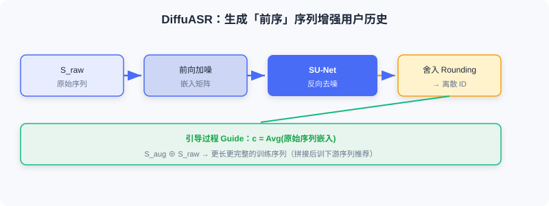

  📖
  ⏱️ ~32 min read
  🎯 Advanced

# Diffusion-Based Data Augmentation

> 📝 **Before You Continue:** Finish the forward/reverse processes, conditional generation, and guidance in [10.1](./diffusion-basics.md) first — both DiffuASR and Diff-MSR in this section use "denoising generation" as an augmentation tool.

The core challenge facing recommender systems is **data sparsity**: interaction data follows a naturally long-tailed distribution — a few popular items accumulate massive interactions while the vast majority of items have very few records. For new users (cold start) and low-activity users, scarce history makes preference modeling difficult. Traditional augmentations (random cropping, reordering) produce limited-quality samples and struggle to capture latent interest patterns.

The generative capability of diffusion models offers a new angle: after learning the data distribution, the model can generate high-quality pseudo-interaction sequences to expand the training data. This section covers two representative methods: **DiffuASR**, which generates "prequel" sequences of a user's history, and **Diff-MSR**, which leverages cross-scenario knowledge transfer to solve cold start.

After reading this section, you will be able to:

- **Describe** DiffuASR's three-component framework (forward / reverse / guidance) and the SU-Net's sequence handling
- **Explain** how rounding maps continuous embeddings back to discrete item IDs
- **Recount** Diff-MSR's "a dog looks like a cat" cross-scenario transfer intuition and its four-stage pipeline
- **Compare** the two guidance types (classifier-guided / classifier-free) as applied in DiffuASR
- Complete 4 tiered practice problems to consolidate the through-line of diffusion for data augmentation

---

## 10.2.0 Why Use Diffusion for Augmentation

Sequential recommendation predicts the next item by modeling a user's historical interactions, but it faces **data sparsity** (most user-item pairs have very few interactions) and the **long-tail user problem** (most users have histories shorter than 10 items, and performance drops sharply). Traditional augmentation struggles to generate pseudo-sequences that are "semantically consistent."

The advantage of diffusion models: they do not merely transform existing samples — they **learn the distribution and then generate new samples**. The generated pseudo-interactions are semantically consistent with the real history while filling in the missing "prequel" information.

### 🧠 Mental Model: Writing Missing Memoir Chapters

> A short-history user is like a diary whose owner remembers only the last few pages. Rather than photocopying those pages a few times, DiffuASR reads the style and themes of those pages and helps **write the preceding pages that might have happened** — the new content coheres with the existing diary while making the biography more complete.

---

## 10.2.1 Sequence Augmentation: DiffuASR

DiffuASR's core idea: given an original interaction sequence $S_{\text{raw}}$, generate the corresponding "prequel" sequence $S_{\text{aug}}$ (interactions the user might have had before $S_{\text{raw}}$). Concatenating them yields a longer, more complete history for training downstream sequential recommendation models.

### Overall Framework

DiffuASR has three key components:

1. **Forward process** — gradually noises the item embeddings of the target augmentation sequence. The data is an embedding matrix $\boldsymbol{x}_0 = [\boldsymbol{e}_{-M}, \ldots, \boldsymbol{e}_{-1}] \in \mathbb{R}^{M \times d}$, where $M$ is the augmentation length and $d$ the embedding dimension.
2. **Reverse process** — recovers the embedding sequence $\hat{\boldsymbol{x}}_0$ from noise, then maps it back to discrete item IDs via **rounding**:

$$v_j = \arg\max_{v_i \in \mathcal{V}} \text{sim}(\hat{\boldsymbol{e}}_j, \boldsymbol{e}_i)$$

(cosine similarity; the nearest item is the output). This step turns continuous generation into an interpretable item sequence.
3. **Guidance process** — ensures the generated sequence is semantically consistent with the original. The guidance signal comes from an aggregated representation of the original sequence, $\boldsymbol{c} = \text{Avg}(\boldsymbol{e}_1, \ldots, \boldsymbol{e}_{n_u})$.

### Sequential U-Net

The standard U-Net is designed for images; applying it directly to sequence embeddings loses sequence-dimension information. DiffuASR proposes the **SU-Net**:

1. **Treat the sequence dimension as channels**: view $\boldsymbol{x}_t \in \mathbb{R}^{M \times d}$ as an "image" with $M$ channels.
2. **Reshape the embedding dimension**: reshape each $d$-dimensional embedding into a $\sqrt{d} \times \sqrt{d}$ matrix.

The input then becomes an $M$-channel, $\sqrt{d} \times \sqrt{d}$ tensor that convolutions handle naturally; each channel is processed independently, preserving sequence position information. The SU-Net body consists of downsampling, intermediate attention layers, and upsampling; the timestep $t$ and condition $\boldsymbol{c}$ are injected into each ResNet block via additive fusion:

$$\boldsymbol{z} = \boldsymbol{c} + \boldsymbol{t}$$

where $\boldsymbol{t}$ is the sinusoidal positional encoding of $t$; $\boldsymbol{z}$ is passed through a linear transform and added to each layer's input to steer the denoising direction.

### Guidance Strategies

DiffuASR offers two guidance options, corresponding to the two conditional generation methods in [10.1](./diffusion-basics.md):

**1. Classifier-guided** — a pretrained sequential recommendation model serves as the "classifier." Since $S_{\text{aug}}$ precedes $S_{\text{raw}}$, the first item $v_1$ of $S_{\text{raw}}$ can be viewed as the "next item" of $S_{\text{aug}}$; the guidance objective is to make the generated sequence correctly predict $v_1$:

$$\hat{\boldsymbol{\epsilon}} = \boldsymbol{\epsilon}_\theta(\boldsymbol{x}_t, t, \boldsymbol{c}) - \gamma \cdot \sqrt{1-\bar{\alpha}_t} \nabla_{\boldsymbol{x}_t} \log p_\phi(v_1 | S_{\text{aug}})$$

**2. Classifier-free** — randomly drop the condition vector during training, then linearly combine at inference:

$$\hat{\boldsymbol{\epsilon}} = (1 + \gamma) \cdot \boldsymbol{\epsilon}_\theta(\boldsymbol{x}_t, t, \boldsymbol{c}) - \gamma \cdot \boldsymbol{\epsilon}_\theta(\boldsymbol{x}_t, t, \boldsymbol{e}_{\text{padding}})$$

This is cleaner and more efficient, and is the more common choice in practice.

### Training and Augmentation Pipeline

**Training**: from the original dataset, select sequences longer than $M$; the first $M$ items serve as the augmentation target and the rest as $S_{\text{raw}}$, with the real prequel supervising the diffusion learning. **Augmentation**: run guided reverse denoising on each user's sequence to generate a prequel $\hat{S}_{\text{aug}}$, and concatenate it with the original sequence to form the augmented training data $\mathcal{D}_A$. Sequences generated by DiffuASR can directly train any sequential recommendation model without architectural changes — strong generality.

> **Analysis:** DiffuASR's value lies in "high quality + generality" — the generated pseudo-sequences are semantically consistent and decoupled from the downstream model. The cost: training diffusion + rounding, and generation quality depends on the guidance strength γ.

---

## 10.2.2 Cross-Scenario Augmentation: Diff-MSR

In multi-scenario recommendation (MSR), data volume varies drastically across scenarios: popular scenarios have massive interactions, while emerging / vertical (cold-start) scenarios are data-scarce. As a result, cold-start scenario parameters are hard to learn well, and joint training is prone to **negative transfer** from popular scenarios.

Diff-MSR's insight comes from CV: **a blurry photo of a dog may look like a cat**. In the recommendation embedding space, user-item embeddings from data-rich scenarios, after appropriate noising, may resemble samples from the cold-start scenario in "outline." This lets us "borrow" knowledge from rich scenarios to augment cold-start ones.

### Overall Framework (Four Stages)

1. **Pretraining** — train a multi-scenario backbone (e.g., MMoE) on all-scenario data to obtain a shared embedding layer (cross-scenario general representations).
2. **Diffusion** — for each cold-start scenario, train two diffusion models (positive / negative samples); the input is the concatenation of user feature and item attribute embeddings $\boldsymbol{e} = [\boldsymbol{e}_1 \| \cdots \| \boldsymbol{e}_M]$, learning that scenario's data distribution.
3. **Classification** — train a binary classifier to judge whether a (noised) embedding comes from the cold-start or a rich scenario. Noise rich-scenario samples to varying degrees; those misclassified as cold-start have a similar "outline" and can be exploited.
4. **Fine-tuning** — fine-tune the cold-start model with three kinds of data: pseudo-samples obtained by denoising misclassified rich samples, pseudo-samples generated from pure Gaussian noise, and real cold-start data.

The classification stage is the key: noise a rich-scenario embedding $\boldsymbol{z}_0$ to varying degrees to get $\boldsymbol{z}_t$; if it is misclassified as cold-start, this "blurry" sample is similar to the cold-start scenario in embedding space — denoising $\boldsymbol{z}_t$ with the cold-start diffusion model yields a high-quality cold-start sample. Diff-MSR designs a **piecewise noise schedule**: keep $\beta_t$ small for the first steps to preserve structure, then grow linearly — light noising still preserves scenario features for classification, while heavy noising ensures convergence to a Gaussian.

> 💡 **Key Insight:** The two methods share a common core — use diffusion to generate high-quality pseudo-interaction data, and use **conditional control** to guarantee semantic consistency. DiffuASR borrows the history condition to generate prequels; Diff-MSR borrows scenario distributions for cross-domain leverage. The next section looks at diffusion applied to features and diversity.

---

## ⚠️ Common Mistakes in 10.2

| # | Mistake | Example | Why It's Wrong | Fix |
|---|---------|---------|---------------|-----|
| 1 | Thinking diffusion augmentation = copying samples | "Copy a short sequence a few times as augmentation" | Copying adds no information and can't fill in prequels | Use diffusion to generate semantically consistent new prequels |
| 2 | Skipping the rounding step | Feed continuous embeddings directly as recommendations | Downstream models need discrete item IDs | Use rounding to map to the nearest item |
| 3 | Confusing the two guidance types | "DiffuASR must use classifier guidance" | Classifier-free is more common and cleaner | Either works; Free is the usual choice |
| 4 | Misusing Diff-MSR across domains | "Cold start can directly use raw rich-scenario samples" | Distributions differ; negative transfer follows | Noise → misclassify → denoise to generate pseudo-samples |

---

## Chapter Summary

### 📌 Key Takeaways

| Concept | Key Points | Why It Matters |
|---------|-----------|----------------|
| DiffuASR | Forward / reverse / guidance components + SU-Net + rounding | Generates prequel sequences to extend short-history users |
| SU-Net | Sequence as multi-channel image + additive fusion of condition / timestep | Preserves sequence-dimension information |
| Two guidance types | Classifier / classifier-free | Guarantees semantic consistency with the original |
| Diff-MSR | Four stages + piecewise noise + "dog looks like cat" transfer | Cross-scenario leverage eases cold start |
| Common thread | Generate pseudo-interactions + condition-controlled semantics | Data-augmentation-style diffusion application |

### ❓ FAQ

**Q1: What's the use of the "prequel" generated by DiffuASR?**
> A: Short-history users lack data, making next-item prediction hard. The semantically consistent prequel $S_{\text{aug}}$ concatenates with the original sequence into a longer history, improving downstream sequential recommendation — without coupling to the downstream model.

**Q2: Why is rounding necessary?**
> A: Diffusion denoises in a continuous embedding space, but recommendation needs discrete item IDs to feed downstream models. Rounding takes the nearest item in embedding space, converting continuous results back to interpretable IDs.

**Q3: Why does Diff-MSR filter by "misclassification"?**
> A: If a rich-scenario sample, after noising, is misclassified as cold-start, its outline resembles that scenario — only such samples yield high-quality cold-start pseudo-samples after denoising, avoiding the negative transfer of direct cross-domain use.

### 🔗 Connections to Later Chapters

- **10.1** (basics) DiffuASR's guidance, the SU-Net's conditional injection, and Diff-MSR's diffusion all build on 10.1's mechanisms.
- **10.3** (applications) shifts from "augmenting data" to "augmenting features and diversity."
- **5.3 / 9.x** (generative through-line) Diffusion is the continuous-space branch of the generative family, complementary to autoregressive generation and explicit reasoning.

---

## Practice Problems

Work through all problems in order — they get progressively harder. Each has a complete solution you can reveal after trying it yourself.

---

**Problem 10.2.1 — Framework Classification** 🟢 Easy

Assign each component below to one of DiffuASR's three components (forward / reverse / guidance):
- (a) Gradually noising the item embedding matrix
- (b) Using Avg(original sequence embeddings) as the condition c
- (c) Rounding that maps back to discrete item IDs

💡 Solution (click to reveal)

**Approach:** Check against the three components' responsibilities.

- (a) Forward process
- (b) Guidance process (the condition comes from aggregation of the original sequence)
- (c) Reverse process (rounding after denoising)

**Key points:**
- Forward = noising; reverse = denoising + rounding; guidance = controlling semantic consistency.

---

**Problem 10.2.2 — Rounding Computation** 🟢 Easy

After denoising, the continuous embedding at some position is $\hat{\boldsymbol{e}}_j$; the cosine similarities with three candidates in the item vocabulary $\mathcal{V}$ are: $\text{sim}(\hat{\boldsymbol{e}}_j, \boldsymbol{e}_A)=0.91$, $\text{sim}(\hat{\boldsymbol{e}}_j, \boldsymbol{e}_B)=0.62$, $\text{sim}(\hat{\boldsymbol{e}}_j, \boldsymbol{e}_C)=0.78$. Which item does rounding select?

💡 Solution (click to reveal)

**Approach:** Take the candidate with the highest similarity.

$$v_j = \arg\max_{v_i} \text{sim}(\hat{\boldsymbol{e}}_j, \boldsymbol{e}_i)$$

The maximum, 0.91, corresponds to $\boldsymbol{e}_A$ → output item A.

**Key points:**
- Rounding = nearest-neighbor lookup in the vocabulary.
- It "decodes" continuous embeddings into discrete IDs.

---

**Problem 10.2.3 — SU-Net Design** 🟡 Medium

What is lost when a standard U-Net is applied directly to sequence embeddings? How does the SU-Net solve this via "sequence as channels" and "embedding reshaping"? Explain how the condition and timestep are injected.

💡 Solution (click to reveal)

**Approach:** Check against the SU-Net design.

**Problem:** The U-Net is designed for images; feeding it sequence embeddings $\boldsymbol{x}_t\in\mathbb{R}^{M\times d}$ directly loses sequence (position) dimension information.

**Solution:**
1. Treat the $M$ positions as $M$ **channels**, turning the sequence dimension into the channel dimension;
2. Reshape each $d$-dimensional embedding into a $\sqrt{d}\times\sqrt{d}$ matrix, forming an $M$-channel $\sqrt{d}\times\sqrt{d}$ tensor that convolutions can process while each channel (position) is preserved independently.

**Injection:** the sinusoidal positional encoding $\boldsymbol{t}$ of timestep $t$ and the condition $\boldsymbol{c}$ fuse additively as $\boldsymbol{z}=\boldsymbol{c}+\boldsymbol{t}$, then pass through a linear transform and are added to each ResNet block's input to steer the denoising direction.

**Key points:**
- The core is "preserving the sequence dimension."
- Additive fusion of condition / timestep runs through all layers.

---

**Problem 10.2.4 — Designing Cross-Scenario Augmentation** 🔴 Hard

A platform has a "popular e-commerce" scenario and a "newly launched used-car" scenario; the used-car data is extremely sparse. Following the Diff-MSR approach, write the four-stage pipeline, explain why the "piecewise noise schedule" matters, and state which kinds of pseudo-samples are used to fine-tune the cold-start model.

💡 Solution (click to reveal)

**Approach:** Apply Diff-MSR's four stages.

1. **Pretraining**: train MMoE on all scenarios to get a shared embedding layer.
2. **Diffusion**: train two diffusion models (positive / negative samples) for the used-car scenario; the input is the concatenated user + item attribute embeddings.
3. **Classification**: train a binary classifier to tell whether an embedding comes from used-car or e-commerce; noise e-commerce samples to varying degrees — those misclassified as used-car have a "similar outline" and can be exploited.
4. **Fine-tuning**: use three kinds of data — pseudo-samples from denoising misclassified e-commerce samples, pseudo-samples generated from pure Gaussian noise, and real used-car data.

**Why piecewise noise matters:** small β early preserves structure so the classifier can judge the "outline"; linear growth later ensures eventual convergence to a Gaussian — otherwise light noising yields no transferable samples, or heavy noising destroys the structure.

**Key points:**
- "A dog looks like a cat": e-commerce samples noised and misjudged as used-car can be leveraged.
- Pseudo-samples + real data fine-tuned together prevent negative transfer.

---

**🏆 Challenge: Evaluating Augmentation Quality**

If the guidance strength γ for DiffuASR is too large, the generated pseudo-sequences may over-fit $S_{\text{raw}}$ and lack diversity; too small, and they become semantically inconsistent. In 200 words or fewer, design two computable metrics to evaluate augmentation data quality (one for semantic consistency, one for diversity), and explain how to tune γ accordingly.

💡 Hint

Consistency: similarity between the generated prequel and $S_{\text{raw}}$ in embedding space (e.g., average cosine), or the downstream model's accuracy gain on "original + augmented" vs "original only." Diversity: pairwise differences among augmented sequences (e.g., deduplication rate, embedding variance), or the proportion of generated prequels that differ from existing prequels in the training set. γ too large → high consistency but low diversity; γ too small → the reverse; pick a γ at a balance point on the Pareto front of the two.

