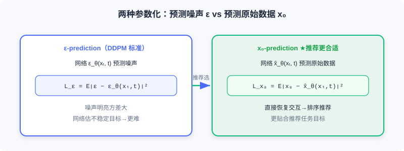
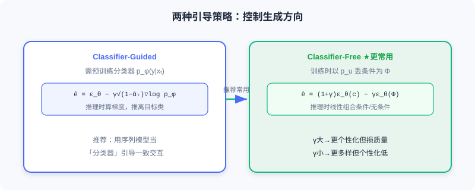

  📖
  ⏱️ ~34 min read
  🎯 Advanced

# Diffusion Model Basics for Recommendation

> 📝 **Before You Continue:** Read the two paradigms in [1.1](./../part1-introduction/recommender-system-basics.md) and the generative paradigm evolution in [5.3](./../part5-trends/generative-trend.md) first. This chapter is the "technical groundwork" for deploying diffusion in recommendation; the concrete methods in 10.2/10.3 all build on it.

In [5.3](./../part5-trends/generative-trend.md) we discussed, at the architecture level, how diffusion models and Transformers complement each other. This section systematically reviews the **core technical principles** of diffusion models, with emphasis on the **special considerations and design choices** when applying them to recommendation. The theoretical foundation comes mainly from **DDPM**, while **DiffRec** is the representative work for recommendation applications.

The core idea of diffusion models can be summarized as two inverse Markov processes: **forward diffusion** gradually adds noise to data, and **reverse denoising** learns to recover the original data from noise. After reading this section, you will understand this mechanism and why it can serve as a "generative tool" for recommender systems.

After reading this section, you will be able to:

- **Write** the single-step transition of forward diffusion and the direct sampling formula for any t (reparameterization)
- **Distinguish** data-space diffusion from latent-space diffusion, and explain why recommendation prefers the latter
- **Describe** the ELBO training objective and the two parameterizations: ε-prediction and x₀-prediction
- **Explain** noise scale control in recommendation, inference starting-point selection, conditional generation, and the two guidance strategies
- Complete 4 tiered practice problems, and try the interactive "forward/reverse" demo at the end

---

## 10.1.0 Two Operating Spaces of Diffusion Models

By operating space, diffusion models fall into two main families:

**Data-space diffusion (pixel-space diffusion)** — diffusion and denoising happen directly in the raw data space (image pixels; interaction vectors in recommendation). The representative work is **DDPM**. It is theoretically more direct, but iterating in a high-dimensional raw space is computationally expensive, and it is especially inefficient for high-resolution data or long sequences.

**Latent diffusion models (LDM)** — an encoder (VAE / autoencoder) first compresses the raw data into a low-dimensional **latent representation space**; diffusion and denoising happen there, followed by decoding back to the original space. The representative work is **Stable Diffusion**. Pipeline: encode $\boldsymbol{z}=\mathcal{E}(\boldsymbol{x})$ → diffuse on $\boldsymbol{z}$ → decode $\hat{\boldsymbol{x}}=\mathcal{D}(\boldsymbol{z}_0)$. If the dimension drops from $d$ to $d'$ ($\ll d$), the computation can shrink by a factor of $(d/d')^2$.

> 💡 **Key Insight:** In recommendation, **latent diffusion is far more common**, for three reasons: ① **efficiency** — recommendation deals with large-scale behavior sequences and item features, so operating in the raw space is unacceptable; ② **semantics** — the latent space offers a more compact, semantic representation that fits user interest / item attribute modeling; ③ **flexibility** — it integrates easily with existing architectures such as CF and GNN. Hence the methods in this part mostly diffuse in item embedding or user feature spaces rather than operating directly on the sparse interaction matrix.

---

## 10.1.1 Forward Noising and Reverse Denoising

### The Forward Diffusion Process

Given a data sample $\boldsymbol{x}_0 \sim q(\boldsymbol{x}_0)$, the forward process adds Gaussian noise over $T$ steps, building latent variables $\boldsymbol{x}_{1:T}$. Each step transitions as:

$$q(\boldsymbol{x}_t | \boldsymbol{x}_{t-1}) = \mathcal{N}(\boldsymbol{x}_t; \sqrt{1-\beta_t}\boldsymbol{x}_{t-1}, \beta_t\boldsymbol{I})$$

where $\beta_t \in (0,1)$ controls the noise strength at step $t$. As $T \to \infty$, $\boldsymbol{x}_T$ approaches a standard Gaussian. Using the **reparameterization trick** and the additivity of Gaussians, we can sample the noised data at any $t$ directly from $\boldsymbol{x}_0$:

$$q(\boldsymbol{x}_t | \boldsymbol{x}_0) = \mathcal{N}(\boldsymbol{x}_t; \sqrt{\bar{\alpha}_t}\boldsymbol{x}_0, (1-\bar{\alpha}_t)\boldsymbol{I})$$

Equivalently:

$$\boldsymbol{x}_t = \sqrt{\bar{\alpha}_t}\boldsymbol{x}_0 + \sqrt{1-\bar{\alpha}_t}\boldsymbol{\epsilon}, \quad \boldsymbol{\epsilon} \sim \mathcal{N}(\boldsymbol{0}, \boldsymbol{I})$$

where $\alpha_t = 1-\beta_t$ and $\bar{\alpha}_t = \prod_{i=1}^{t}\alpha_i$. This allows efficient sampling of any timestep during training, without executing the forward process step by step.

### The Reverse Denoising Process

The reverse process starts from $\boldsymbol{x}_T$ and gradually recovers the original data through a learned denoising network. Each denoising step transitions as:

$$p_\theta(\boldsymbol{x}_{t-1} | \boldsymbol{x}_t) = \mathcal{N}(\boldsymbol{x}_{t-1}; \boldsymbol{\mu}_\theta(\boldsymbol{x}_t, t), \boldsymbol{\Sigma}_\theta(\boldsymbol{x}_t, t))$$

The mean $\boldsymbol{\mu}_\theta$ and covariance $\boldsymbol{\Sigma}_\theta$ are parameterized by a neural network; in practice the covariance is often fixed as $\sigma^2(t)\boldsymbol{I}$, and the mean is the focus of learning.

The interactive demo below lets you see how a "user interaction vector" is gradually noised into static and then recovered by denoising:

<iframe src="../viz/part10-diffusion.html?embed&vizId=part10-diffusion" style="width:100%; height:520px; border:none; display:block;" loading="lazy"></iframe>

Click "Next step" or "Autoplay" and watch the signal cells — a clear interaction pattern in the forward pass — get progressively drowned in noise, then recovered by reverse denoising. This is the full process of a diffusion model "sculpting" the target data.

---

## 10.1.2 Training Objective and Two Parameterizations

### From ELBO to the Simplified Loss

Diffusion models are trained by maximizing the evidence lower bound (ELBO) of the log-likelihood of $\boldsymbol{x}_0$:

$$\log p(\boldsymbol{x}_0) \geq \underbrace{\mathbb{E}_{q(\boldsymbol{x}_1|\boldsymbol{x}_0)}[\log p_\theta(\boldsymbol{x}_0|\boldsymbol{x}_1)]}_{\text{reconstruction term}} - \sum_{t=2}^{T}\underbrace{\mathbb{E}[D_{\text{KL}}(q(\boldsymbol{x}_{t-1}|\boldsymbol{x}_t,\boldsymbol{x}_0) \| p_\theta(\boldsymbol{x}_{t-1}|\boldsymbol{x}_t))]}_{\text{denoising matching term}}$$

The reconstruction term measures the ability to recover $\boldsymbol{x}_0$ from $\boldsymbol{x}_1$; the denoising matching term forces the learned reverse transition $p_\theta$ to align with the true posterior $q(\boldsymbol{x}_{t-1}|\boldsymbol{x}_t,\boldsymbol{x}_0)$. At inference time we do not know $\boldsymbol{x}_0$, so we must train the network $p_\theta$ to approximate this ideal process.

### Two Parameterizations

The denoising network can adopt two parameterizations:

**1. Predicting the noise $\boldsymbol{\epsilon}$** (the DDPM standard):

$$\mathcal{L}_{\epsilon} = \mathbb{E}_{t, \boldsymbol{x}_0, \boldsymbol{\epsilon}}[\|\boldsymbol{\epsilon} - \boldsymbol{\epsilon}_\theta(\boldsymbol{x}_t, t)\|^2]$$

**2. Predicting the original data $\boldsymbol{x}_0$**:

$$\mathcal{L}_{x_0} = \mathbb{E}_{t, \boldsymbol{x}_0, \boldsymbol{\epsilon}}[\|\boldsymbol{x}_0 - \hat{\boldsymbol{x}}_\theta(\boldsymbol{x}_t, t)\|^2]$$

The two are mathematically equivalent ($\boldsymbol{x}_t = \sqrt{\bar{\alpha}_t}\boldsymbol{x}_0 + \sqrt{1-\bar{\alpha}_t}\boldsymbol{\epsilon}$), but **recommendation often uses x₀-prediction**. The reason: the goal in recommendation is to recover the original interactions $\boldsymbol{x}_0$ from the noised interaction vector and directly use $\hat{\boldsymbol{x}}_0$ as the interaction prediction score for ranking; moreover, the random noise $\boldsymbol{\epsilon}$ has high variance, and forcing the network to estimate such an unstable target makes training harder.

### The Sampling Process

After training: ① sample $\boldsymbol{x}_T \sim \mathcal{N}(0,I)$; ② iterate denoising for $t=T,\ldots,1$:

$$\boldsymbol{x}_{t-1} = \frac{1}{\sqrt{1-\beta_t}}\left(\boldsymbol{x}_t - \frac{\beta_t}{\sqrt{1-\bar{\alpha}_t}}\boldsymbol{\epsilon}_\theta(\boldsymbol{x}_t, t)\right) + \sigma_t \boldsymbol{z}$$

③ obtain the generated sample $\boldsymbol{x}_0$.

### 🧠 Mental Model: The Sculptor and the Block of Stone

> Forward diffusion is like gradually hammering an intact marble block into a pile of rubble (noising); reverse denoising is like a sculptor who, guided by an "afterimage," chisel by chisel carves the rubble back into a human figure (denoising). x₀-prediction means the sculptor always imagines directly "what the final figure looks like," which is easier than staring at "the pile of rubble just knocked off" — this is exactly why recommendation prefers it.

---

## 10.1.3 Special Designs for Recommendation

Unlike image generation, diffusion in recommendation involves two special designs:

**Noise scale control** — standard DDPM diffuses data to a pure Gaussian ($\bar{\alpha}_T \to 0$), but in recommendation completely losing historical preference makes generation harder. So a noise scale parameter $s$ limits the maximum strength, keeping part of the original signal even at $t=T$:

$$1 - \bar{\alpha}_t = s \cdot \left[\alpha_{\min} + \frac{t-1}{T-1}(\alpha_{\max} - \alpha_{\min})\right]$$

Here $s\in(0,1)$ controls the upper bound of the overall noise strength, and $\alpha_{\min},\alpha_{\max}$ delimit the interval over which the noise ratio grows linearly with $t$ (this design comes from DiffRec and has been widely adopted by subsequent diffusion recommender works).

**Inference starting-point selection** — inference can start reverse denoising from a partially noised state $\boldsymbol{x}_{T'}$ ($T'<T$), which both leverages denoising to fix noise in the raw interactions and preserves enough personalization information.

### Conditional Generation and Controllability

Recommendation wants generation controlled by user history / context. Conditional information can be injected into the denoising network: direct concatenation, additive fusion, or **cross-attention** in a Transformer. The conditional loss:

$$\mathcal{L}_{\text{cond}} = \mathbb{E}_{t, \boldsymbol{x}_0, \boldsymbol{\epsilon}, \boldsymbol{c}}[\|\boldsymbol{\epsilon} - \boldsymbol{\epsilon}_\theta(\boldsymbol{x}_t, t, \boldsymbol{c})\|^2]$$

At inference, two main strategies steer the generation direction:

**1. Classifier-guided** — use gradients of a pretrained classifier $p_\phi(y|\boldsymbol{x}_t)$ to push toward the target class:

$$\hat{\boldsymbol{\epsilon}} = \boldsymbol{\epsilon}_\theta(\boldsymbol{x}_t, t) - \gamma \cdot \sqrt{1-\bar{\alpha}_t} \nabla_{\boldsymbol{x}_t} \log p_\phi(y|\boldsymbol{x}_t)$$

In recommendation, a sequential recommendation model can serve as the "classifier," guiding generation toward interaction sequences consistent with the history.

**2. Classifier-free guidance** — during training, replace the condition $\boldsymbol{c}$ with an empty placeholder $\Phi$ with probability $p_u$; at inference:

$$\hat{\boldsymbol{\epsilon}} = (1 + \gamma) \cdot \boldsymbol{\epsilon}_\theta(\boldsymbol{x}_t, t, \boldsymbol{c}) - \gamma \cdot \boldsymbol{\epsilon}_\theta(\boldsymbol{x}_t, t, \Phi)$$

Large $\gamma$ → more personalized but potentially lower quality; small $\gamma$ → more diverse but less personalized. **More commonly used** in recommendation.

**Example conditional design (sequential recommendation):** condition on the user's historical interaction sequence, encode it with a Transformer encoder into $\boldsymbol{c}_{n-1} = \text{T-enc}(\boldsymbol{e}_{1:n-1})$, and guide diffusion to generate the target item embedding — combining sequence modeling (Transformer) with generative modeling (diffusion). DreamRec adopts exactly this architecture.

> **Analysis:** In recommendation, diffusion does **not** primarily aim to end-to-end replace discriminative models; instead, its **generative capability + random sampling** provides tools for two concrete problems: data sparsity and recommendation diversity. This is the through-line for understanding 10.2/10.3.

---

## ⚠️ Common Mistakes in 10.1

| # | Mistake | Example | Why It's Wrong | Fix |
|---|---------|---------|---------------|-----|
| 1 | Diffusing directly on the raw interaction matrix | "Apply DDPM noise to the sparse matrix" | High-dimensional and sparse; computationally unacceptable | Use latent diffusion (LDM) |
| 2 | Forcing ε-prediction into recommendation | "Diffusion recommenders predict noise by default" | Recommendation must recover x₀ and rank on it; x₀ fits better | Use x₀-prediction and output directly |
| 3 | Ignoring the recommendation noise scale | Diffuse all the way to a pure Gaussian before generating | Loses historical preference; generation gets harder | Use scale s to keep part of the signal |
| 4 | Treating classifier-free guidance as more complex | "All guidance needs an extra classifier" | Classifier-free needs no classifier | Distinguish the two types; recommendation usually uses Free |

---

## Chapter Summary

### 📌 Key Takeaways

| Concept | Key Points | Why It Matters |
|---------|-----------|----------------|
| Forward / reverse | q adds noise ↔ p_θ denoises; inverse Markov pair | The core mechanism of diffusion models |
| Latent diffusion | Encode → diffuse → decode; computation drops by (d/d')² | Common in recommendation due to high dimensionality and sparsity |
| Two parameterizations | ε-pred vs x₀-pred (equivalent) | x₀-pred fits recommendation better and is the usual choice |
| Special designs for recommendation | Noise scale s, mid-way starting point | Preserves personalization and eases generation |
| Condition + guidance | Concatenation / cross-attention; two guidance types | Steer generation with history / text |

### ❓ FAQ

**Q1: Why does recommendation prefer latent diffusion over data-space diffusion?**
> A: Interaction vectors in recommendation are high-dimensional and sparse; iterative denoising in the raw space is computationally unacceptable. The latent space is more compact and semantic, integrates easily with CF/GNN, and meets industrial real-time requirements.

**Q2: Why does recommendation often use x₀-prediction?**
> A: The goal of recommendation is to recover the user's original interactions and rank on $\hat{x}_0$; x₀-pred is more stable and better matched to the task than estimating the high-variance noise ε.

**Q3: How should the γ of classifier-free guidance be tuned?**
> A: Large γ → better adherence to the condition (strong personalization) but potentially lower generation quality / diversity; small γ → more diverse but less personalized. Balance "relevance vs diversity" according to business needs.

### 🔗 Connections to Later Chapters

- **1.1 / 5.3** (paradigms and generative models) Diffusion is the "continuous-space denoising" branch of the generative family, complementary to autoregressive generation.
- **10.2** (data augmentation) DiffuASR / Diff-MSR apply this section's foundations to generating pseudo-interactions.
- **10.3** (applications) AsymDiffRec / DMSG apply denoising capability to feature completion and diversity.

---

## Practice Problems

Work through all problems in order — they get progressively harder. Each has a complete solution you can reveal after trying it yourself.

---

**Problem 10.1.1 — Direct Sampling Formula** 🟢 Easy

Given $\boldsymbol{x}_0$, at step $t$ we have $\bar{\alpha}_t = 0.6$ and sampled noise $\boldsymbol{\epsilon} \sim \mathcal{N}(0,I)$. Write the expression for $\boldsymbol{x}_t$ and state the relative magnitudes of the signal and noise terms.

💡 Solution (click to reveal)

**Approach:** Apply the reparameterization formula.

$$\boldsymbol{x}_t = \sqrt{\bar{\alpha}_t}\boldsymbol{x}_0 + \sqrt{1-\bar{\alpha}_t}\boldsymbol{\epsilon} = \sqrt{0.6}\,\boldsymbol{x}_0 + \sqrt{0.4}\,\boldsymbol{\epsilon}$$

The signal coefficient is $\sqrt{0.6}\approx 0.775$ and the noise coefficient is $\sqrt{0.4}\approx 0.632$. The signal is slightly stronger than the noise (t is small).

**Key points:**
- The squared coefficients sum to 1, preserving variance.
- Smaller $\bar{\alpha}_t$ means a larger noise share; larger t approaches pure noise.

---

**Problem 10.1.2 — Choosing the Space** 🟢 Easy

For each scenario below, should you prefer data-space or latent-space diffusion? Briefly justify.
- (a) Denoising 1024×1024 high-resolution images
- (b) Recommendation augmentation on a million-dimensional sparse user-item interaction matrix

💡 Solution (click to reveal)

**Approach:** Judge by dimensionality and efficiency.

- (a) Data-space diffusion (DDPM works directly in pixel space; the classic image setting).
- (b) Latent diffusion (LDM) — diffusing a million-dimensional sparse matrix directly is computationally unacceptable; encode to a low-dimensional latent space first.

**Key points:**
- High-dimensional / sparse → latent space.
- Recommendation almost always uses LDM.

---

**Problem 10.1.3 — Comparing Parameterizations** 🟡 Medium

A diffusion recommender trained with ε-prediction shows large fluctuations in prediction scores and unstable ranking performance. Explain the likely cause, and why switching to x₀-prediction is more appropriate (cite variance and the task objective).

💡 Solution (click to reveal)

**Approach:** Analyze the difference between the parameterizations.

**Cause:** ε-prediction forces the network to estimate the added Gaussian noise $\boldsymbol{\epsilon}$, but $\boldsymbol{\epsilon}\sim\mathcal{N}(0,I)$ has high variance — an unstable target — which makes the recovered x₀ ranking scores fluctuate.

**Switch to x₀-pred:** The recommendation goal is to recover the original interactions $\boldsymbol{x}_0$ and directly rank on $\hat{\boldsymbol{x}}_0$ as interaction prediction scores — the x₀-pred loss $\|\boldsymbol{x}_0 - \hat{\boldsymbol{x}}_0\|^2$ directly optimizes this objective and avoids estimating high-variance noise, giving more stable training and a better fit for recommendation.

**Key points:**
- The two are mathematically equivalent but differ in task fit.
- In recommendation, "recovering x₀ is the scoring" → choose x₀-pred.

---

**Problem 10.1.4 — Designing Conditional Guidance** 🔴 Hard

You need to design a conditional diffusion for sequential recommendation: use a Transformer to encode the user history as the condition $\boldsymbol{c}$, guiding diffusion to generate the next item embedding. Write down: ① how the condition is injected into the denoising network (at least two ways); ② the training and inference formulas of classifier-free guidance; ③ whether γ should be larger or smaller if you want "more personalization while accepting slightly lower diversity."

💡 Solution (click to reveal)

**Approach:** Apply this section's conditional generation and guidance.

1. **Injection methods:** direct concatenation $[\boldsymbol{x}_t; \boldsymbol{c}]$; or additive fusion (timestep embedding added into each layer); or the denoising network fuses $\boldsymbol{c}$ via cross-attention in a Transformer.
2. **Classifier-free:** during training, replace $\boldsymbol{c}$ with the empty $\Phi$ with probability $p_u$; at inference $\hat{\boldsymbol{\epsilon}} = (1+\gamma)\boldsymbol{\epsilon}_\theta(\boldsymbol{x}_t,t,\boldsymbol{c}) - \gamma\boldsymbol{\epsilon}_\theta(\boldsymbol{x}_t,t,\Phi)$.
3. **Increase γ** → leans more toward the condition (strong personalization) but slightly lower diversity — matching "more personalization, accept slightly lower diversity."

**Key points:**
- Conditional injection should run through every denoising layer.
- γ is the relevance-vs-diversity knob.

---

**🏆 Challenge: Arguing About Recommendation Latency**

Diffusion inference requires multi-step iterative denoising, while industrial recommendation often demands sub-second (hundred-millisecond) latency. In 200 words or fewer, argue: for the two use cases "data augmentation (offline)" and "online ranking," is the latency cost of diffusion acceptable in each? Point out one accelerated sampling technique that 10.3 will use.

💡 Hint

Offline data augmentation (e.g., DiffuASR generating prequel sequences) can tolerate multi-step denoising, so latency hardly matters; online ranking with multi-step iteration per request can hardly meet the bar — hence diffusion is mostly used for offline augmentation/generation, and used cautiously online. Acceleration technique: DDIM (deterministic few-step sampling); DMSG in 10.3 uses it to cut steps from over a thousand to 50, reaching millisecond level. This echoes the latency design in 10.3.

