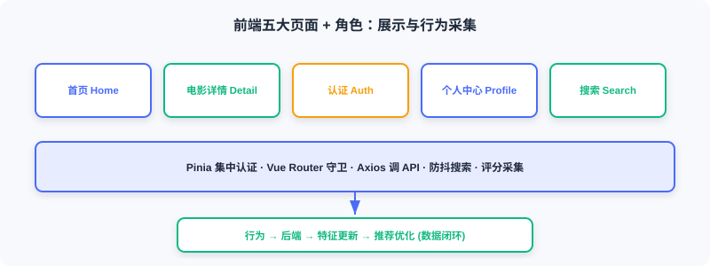

<div class="badge-row">
  <span style="background: #f0f4ff; color: #4A6CF7; padding: 4px 12px; border-radius: 20px; font-size: 0.85em; font-weight: 600; border: 1px solid rgba(74,108,247,0.2);">📖</span>
  <span style="background: #f0fdf4; color: #16a34a; padding: 4px 12px; border-radius: 20px; font-size: 0.85em; border: 1px solid rgba(22,163,74,0.2);">⏱️ ~26 min read</span>
  <span style="background: #fef9ec; color: #d97706; padding: 4px 12px; border-radius: 20px; font-size: 0.85em; border: 1px solid rgba(100,100,100,0.15);">🎯 Intermediate</span>
</div>

# Frontend and Interaction

> 📝 **Before You Continue:** Read the recommendation API in [11.4](./online-pipeline.md) first. This section shows how the frontend calls that API and feeds user behavior back into the system, closing the loop.

The frontend is the user's entry point to the recommender system: browsing, viewing recommendations, searching, rating. These behaviors are collected and fed back to the backend, shaping future recommendations — so the frontend is not just a presentation layer but also a **data collection layer**.

After reading this chapter, you will be able to:

- List the frontend stack (Vue 3 / Tailwind / Pinia / Vue Router / Axios) and the five core page types
- Implement logged-in/guest access control with route `meta` + `beforeEach` guards
- Describe the design essentials of the three core components: MovieCard / MovieRow / StarRating
- Explain how the home page conditionally renders "For You" based on login state and auto-loads recommendations after login
- Manage authentication state centrally with Pinia and control search request frequency with debounce
- Explain how the signup page's preferred genres drive the cold start strategy
- Work through 4 tiered practice problems

---

## 11.5.0 Frontend Overview

This project's frontend stack:

| Technology | Purpose |
|------|------|
| Vue.js 3 | Progressive JS framework, uses the Composition API |
| Tailwind CSS | CSS framework, utility classes for fast styling |
| Pinia | State management library, manages auth state |
| Vue Router | Routing, handles page navigation |
| Axios | HTTP client, talks to the backend API |

Core pages: Home (personalized recommendations / trending / categories), Movie Detail (info + rating), Auth (login/signup), Profile (history / preferences), and Search (global real-time search).



> 💡 **Key Insight:** The frontend doesn't just "draw the recommendation results" — ratings, views, and searches are collected by the frontend and sent back to the backend, forming the "user behavior → feature update → recommendation improvement" loop. This is what allows the system to keep getting better.

---

## 11.5.1 Project Structure and Routing

Directory layout: `components/` (reusable), `views/` (page-level), `services/` (API), `stores/` (state).

```javascript
const routes = [
  { path: '/', name: 'Home', component: Home },
  { path: '/movie/:id', name: 'MovieDetail', component: MovieDetail, props: true },
  { path: '/auth', name: 'Auth', component: Auth, meta: { guest: true } },
  { path: '/profile', name: 'Profile', component: Profile, meta: { requiresAuth: true } },
]
```

`meta` flags access requirements, and the navigation guard `beforeEach` checks them before each transition:

```javascript
router.beforeEach((to, from, next) => {
  const token = localStorage.getItem('token')
  if (to.meta.requiresAuth && !token) {
    next('/auth')                              // ← KEY LINE: not logged in → redirect to login
  } else if (to.meta.guest && token) {
    next('/')                                  // ← KEY LINE: logged-in users can't visit the login page
  } else {
    next()
  }
})
```

Access logic is centralized in the routing layer; page components don't need to check login state individually.

---

## 11.5.2 Core Component Design

**MovieCard**: the most basic unit. It takes `movie` and `width` and displays the poster/title/year/rating. Design essentials: the whole card is a clickable `<router-link>`; images lazy-load with `loading="lazy"`; `@error` listens for load failures and shows a placeholder; `group-hover` reveals details on hover.

**MovieRow**: organizes cards into a horizontally scrollable row (Netflix-style). A `ref` points at the DOM scroll container, and arrows appear dynamically based on scroll position:

```javascript
import { ref } from 'vue'
const scrollContainer = ref(null)
const showLeftArrow = ref(false)
const showRightArrow = ref(true)
const updateArrows = () => {
  const { scrollLeft, scrollWidth, clientWidth } = scrollContainer.value
  showLeftArrow.value = scrollLeft > 0
  showRightArrow.value = scrollLeft < scrollWidth - clientWidth - 10   // ← KEY LINE: control arrows based on scroll position
}
```

**StarRating**: a 10-point star widget. It maintains `hoverRating` (hovered position) and `userRating` (saved score); star color follows whichever is active:

```javascript
const hoverRating = ref(0)
const userRating = ref(0)
const getStarClass = (star) => {
  const currentRating = hoverRating.value || userRating.value          // ← KEY LINE: hover takes precedence over the saved score
  return star <= currentRating ? 'text-yellow-400' : 'text-gray-600'
}
```

---

## 11.5.3 Home Page

The home page consists of a hero banner plus multiple movie rows. Whether to load personalized recommendations depends on login state, watched via `watch`:

```javascript
import { ref, watch, onMounted } from 'vue'
import { useAuthStore } from '../stores/auth'
import { movieApi } from '../services/api'

const authStore = useAuthStore()
const forYouMovies = ref([])
const loadingForYou = ref(false)

const fetchRecommendations = async () => {
  if (!authStore.isAuthenticated) return
  loadingForYou.value = true
  try {
    const response = await movieApi.getRecommendations(authStore.user.user_id)
    forYouMovies.value = response.data
  } finally {
    loadingForYou.value = false
  }
}

watch(() => authStore.isAuthenticated, (isAuthenticated) => {
  if (isAuthenticated) {
    fetchRecommendations()                  // ← KEY LINE: auto-load recommendations after login
  } else {
    forYouMovies.value = []                 // ← KEY LINE: clear the list on logout
  }
})
```

Key points: (1) the "For You" row shows only for logged-in users; (2) reactive — auto-load on login, clear on logout; (3) the hero banner prefers the head of personalized recommendations, falling back to trending.

---

## 11.5.4 Movie Detail Page

Shows complete information for a single movie. `useRoute` reads the URL parameter (`/movie/123` → `route.params.id`). Data loading is fault-tolerant: basic info is required, cast is optional:

```javascript
import { useRoute } from 'vue-router'
const route = useRoute()
const fetchMovieDetails = async () => {
  const movieId = route.params.id                                  // ← KEY LINE: get the movie ID from the route
  const movieResponse = await movieApi.getMovie(movieId)
  movie.value = movieResponse.data
  try {
    const castResponse = await movieApi.getMovieCast(movieId)
    cast.value = castResponse.data.cast
  } catch (error) {
    // Silent handling: missing cast data doesn't affect display
  }
}
const handleRated = (rating) => {
  fetchMovieDetails()                          // ← KEY LINE: refresh after rating to update the average score
}
```

User ratings are recorded by the backend and influence that user's future recommendations.


---

## 11.5.5 API Integration and State Management

**API service wrapper** — all communication is centralized in `src/services/api.js` via an Axios instance:

```javascript
import axios from 'axios'
const API_BASE_URL = import.meta.env.VITE_API_URL || 'http://localhost:8000'
const api = axios.create({ baseURL: `${API_BASE_URL}/api`, timeout: 10000 })   // ← KEY LINE: unified timeout and baseURL

export const movieApi = {
  getRecommendations(userId, topK = 20) {
    const token = localStorage.getItem('token')
    return api.post('/recommendations/recommend',
      { user_id: userId },
      { headers: { 'Authorization': `Bearer ${token}` }, params: { top_k: topK } }
    ).then(response => ({ ...response, data: response.data.items }))          // ← KEY LINE: take the items array
  },
}
```

APIs requiring authentication read the token from localStorage and attach it to request headers — auth logic is centralized in the API layer.

**User state management** — login state must be shared across components (the home page decides visibility, the detail page checks rating permission, the navbar shows user info). Use a Pinia `Store`:

```javascript
import { defineStore } from 'pinia'
import { ref, computed } from 'vue'
export const useAuthStore = defineStore('auth', () => {
  const user = ref(JSON.parse(localStorage.getItem('user') || 'null'))   // ← KEY LINE: restore from localStorage
  const token = ref(localStorage.getItem('token'))
  const isAuthenticated = computed(() => !!token.value && !!user.value)  // ← KEY LINE: computed property drives reactivity
  async function login(email, password) {
    const response = await axios.post(`${API_BASE_URL}/api/auth/login`, { email, password })
    token.value = response.data.access_token
    localStorage.setItem('token', token.value)
    await fetchProfile()
    return { success: true }
  }
  function logout() {
    user.value = null; token.value = null
    localStorage.removeItem('token'); localStorage.removeItem('user')
  }
  return { user, token, isAuthenticated, login, logout }
})
```

Design essentials: (1) **persistence** — token/user live in localStorage, so login survives a refresh; (2) **reactivity** — changes to `isAuthenticated` automatically re-render dependent components; (3) **centralization** — login/logout logic is unified.

---

## 11.5.6 Search Implementation

The search entry sits in the navbar, opened by click or `Ctrl+K`. If real-time search fired a request per keystroke, it would flood the API — so use **debounce**: wait 300ms after typing stops before sending.

```javascript
import { ref, watch } from 'vue'
import { searchApi } from '../services/api'
const searchQuery = ref('')
const searchResults = ref([])
let searchTimeout = null
watch(searchQuery, (newQuery) => {
  if (searchTimeout) clearTimeout(searchTimeout)
  if (!newQuery.trim()) { searchResults.value = []; return }
  isSearching.value = true
  searchTimeout = setTimeout(async () => {                 // ← KEY LINE: only fire the request 300ms after typing stops
    const results = await searchApi.searchMovies(newQuery.trim())
    searchResults.value = results
    isSearching.value = false
  }, 300)
})
```

Each keystroke resets the timer, and the request fires only after 300ms of stillness — responsive yet frugal with requests. Search hits the backend's Elasticsearch and supports fuzzy matching on title, genre, and overview.

---

## 11.5.7 Authentication and Cold Start

The auth page hosts both login and signup forms, toggled by `isSignup`. The signup form includes a "preferred genres" field — relevant to cold start: new users have no history, so the system recommends by preferred genres first. Use `reactive` for the multi-field form:

```javascript
import { reactive, ref } from 'vue'
const isSignup = ref(false)
const signupForm = reactive({
  email: '', password: '', gender: '', age: '',
  preferred_genres: [],                                // ← KEY LINE: preferred genre list, drives cold start
})
const toggleGenre = (genreName) => {
  const index = signupForm.preferred_genres.indexOf(genreName)
  if (index === -1) signupForm.preferred_genres.push(genreName)
  else signupForm.preferred_genres.splice(index, 1)
}
```

The preferred genres chosen at signup are stored in the database for the online cold start module's `PreferredGenreStrategy` (see [11.4](./online-pipeline.md)).

> **Analysis:** The frontend's value goes beyond "rendering UI". Through unified Pinia state, debounced request flow, route guards for access control, and rating collection that closes the loop, it plugs real users into the recommender's feedback circuit — the final step in turning offline models into a living online system.

---

## ⚠️ Common Mistakes in 11.5

| # | Mistake | Example | Why It's Wrong | Fix |
|---|---------|---------|---------------|-----|
| 1 | Passing login state via props | Each page receives user separately | Tedious, error-prone, out of sync | Centralize with Pinia |
| 2 | Search without debounce | Request per keystroke | Floods the API, jank | 300ms debounce |
| 3 | No route guards | Unauthenticated users reach /profile | Unauthorized access, empty-data errors | Validate meta in beforeEach |
| 4 | Preferred genres not persisted | Lost right after signup | No cold start personalization | Store for PreferredGenreStrategy |
| 5 | No refresh after rating | Average score doesn't update | Users get confused | handleRated refetches details |

---

## Chapter Summary

### 📌 Key Takeaways

| Concept | Key Points | Why It Matters |
|---------|-----------|----------------|
| Stack | Vue3/Tailwind/Pinia/Router/Axios | Lightweight, industry-flavored frontend |
| Route guards | meta + beforeEach | Centralized access, decoupled pages |
| Core components | Card/Row/StarRating | Reusable, reactive |
| Conditional rendering | For You only when logged in | Personalized vs guest |
| Pinia | Persisted + reactive state | Login state shared across components |
| Debounce | Request only 300ms after typing stops | Controls search request rate |
| Data loop | Ratings/views/searches written back | System keeps improving |

### ❓ FAQ

**Q1: Why Pinia instead of passing login state via props?**
> A: Login state spans many components (home, detail, navbar); threading props through the tree is tedious and easily desynchronized. Pinia's single store + computed properties let any component call `useAuthStore()` and get automatic reactivity.

**Q2: Does a 300ms debounce feel slow to users?**
> A: No — 300ms is well below the human perception threshold, and the request only fires after typing stops, so users who keep typing are never interrupted. Compared to a request per keystroke, it saves a huge number of wasted calls.

**Q3: How does the frontend influence recommendations?**
> A: Ratings are written back to the backend → Redis behavior sequences and UCB statistics update → the next request's retrieval/ranking/cold start reads the new features. The frontend is the collection end of the loop.

### 🔗 Connections to Later Chapters

- The `/recommend` endpoint in **11.4** is what this section's `movieApi.getRecommendations` calls.
- `PreferredGenreStrategy` in **11.4** consumes the `preferred_genres` stored at signup in this section.
- **11.1**'s technology choices land here as the frontend stack.
- **11.6** deploys the frontend in containers (Nginx multi-stage build).

---

## Practice Problems

Work through all problems in order — they get progressively harder. Each has a complete solution you can reveal after trying it yourself.

---

**Problem 11.5.1 — Route Guard** 🟢 Easy

A logged-in user (with token) navigates directly to the `/auth` login page — what does the route guard do? What if an unauthenticated user visits `/profile`?

<details>
<summary>💡 Solution (click to reveal)</summary>

**Answer:** Logged-in visit to `/auth` (a guest page) → `to.meta.guest && token` matches → `next('/')` redirects to home. Unauthenticated visit to `/profile` (requiresAuth) → `to.meta.requiresAuth && !token` matches → `next('/auth')` redirects to login.

**Key points:**
- meta flags permissions; the guard adjudicates uniformly.
- Logged-in users skip the login page; unauthenticated users authenticate first.

</details>

---

**Problem 11.5.2 — Debounce Behavior** 🟢 Easy

A user types a three-character query with 50ms between characters, and the debounce is 300ms. How many search requests actually fire? What if the gap between characters is 400ms?

<details>
<summary>💡 Solution (click to reveal)</summary>

**Answer:** At 50ms per character: every keystroke resets the timer, the 300ms stillness is never reached until the end, so exactly 1 request fires after the final pause. At 400ms per character: each pause exceeds 300ms, so 3 requests fire (one per character).

**Key points:**
- Debounce fires only after typing stops.
- The more continuous the typing, the fewer the requests.

</details>

---

**Problem 11.5.3 — Pinia Reactivity** 🟡 Medium

In `useAuthStore`, `isAuthenticated` is `computed(() => !!token.value && !!user.value)`. After login, `token.value` is assigned — what happens to components that depend on `isAuthenticated`?

<details>
<summary>💡 Solution (click to reveal)</summary>

**Answer:** The assignment changes `token.value` → `isAuthenticated` recomputes to true → every component with a `watch`/`computed` depending on it (home For You, navbar) re-renders automatically, and the home page's `watch` triggers `fetchRecommendations` to load personalized recommendations.

**Key points:**
- Computed properties drive reactive updates.
- Change one place, everything syncs — no manual notification needed.

</details>

---

**🏆 Challenge: Complete the Data Loop** 🔴 Hard

Starting from "a user rates a movie 4 stars on the detail page", list the complete chain this behavior travels — frontend → backend → storage → next recommendation (including the specific components/keys involved) — and explain how the loop closes (within 150 words).

<details>
<summary>💡 Hint</summary>

Frontend StarRating calls `movieApi` → backend writes the ratings table + updates Redis `user:{id}:history` (rpush) and `genre_ucb` statistics → the next home page request goes through `pipeline.recommend`: cold start detection (interaction count has grown), multi-route retrieval (I2I uses the new history), ranking (DeepFM uses new features), re-ranking → an updated list returns. The frontend's rating widget is the collection end of the loop.

</details>
