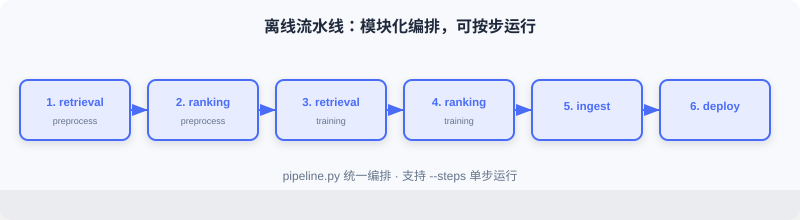
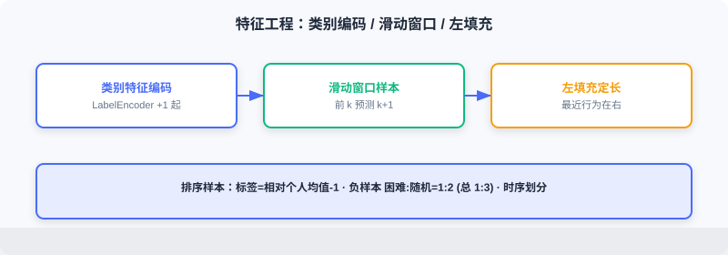

<div class="badge-row">
  <span style="background: #f0f4ff; color: #4A6CF7; padding: 4px 12px; border-radius: 20px; font-size: 0.85em; font-weight: 600; border: 1px solid rgba(74,108,247,0.2);">📖</span>
  <span style="background: #f0fdf4; color: #16a34a; padding: 4px 12px; border-radius: 20px; font-size: 0.85em; border: 1px solid rgba(22,163,74,0.2);">⏱️ ~30 min read</span>
  <span style="background: #fef2f2; color: #dc2626; padding: 4px 12px; border-radius: 20px; font-size: 0.85em; border: 1px solid rgba(100,100,100,0.15);">🎯 Advanced</span>
</div>

# Offline Pipeline

> 📝 **Before You Continue:** Finish [11.2](./project-architecture.md) first — the offline data flow and component boundaries. This section turns those five stages into code: feature engineering → model training → embedding generation → feature ingestion → model deployment.

The offline pipeline carries the recommender's "production" duty, turning raw data into the models and features the online service needs. The whole flow consists of three stages — **feature engineering, model training, and storage/deployment** — managed through a unified command-line entry that supports running individual steps on demand or the full pipeline.

After reading this chapter, you will be able to:

- Describe the offline directory layout and how `pipeline.py` orchestrates the modules
- Build YoutubeDNN sequential samples with a **sliding window**, and understand the details of left-padding and 1-based encoding
- Explain how the ranking model defines click labels via "relative to the personal mean," and how it mixes hard/random negatives
- Write the code for **item embedding precomputation + normalization** after YoutubeDNN training, and explain why it matters
- Describe the Redis feature writes (Hash/List + Pipeline) and the model deployment (version pointer) implementations
- Work through 5 tiered practice problems to consolidate the engineering essentials

---

## 11.3.0 Code Structure

The offline code lives in `web_project/backend/offline/`:

```
offline/
├── pipeline.py                     # pipeline entry point
├── config.py                       # configuration management
├── feature/                        # feature engineering
│   ├── preprocess_retrieval.py     # feature processing for the retrieval model
│   └── preprocess_ranking.py       # feature processing for the ranking model
├── training/                       # model training
│   ├── train_retrieval.py          # retrieval model training
│   └── train_ranking.py            # ranking model training
└── storage/                        # storage & deployment
    ├── redis_ingest.py             # feature ingestion
    └── local_deploy.py             # model deployment
```



The whole flow is orchestrated by `pipeline.py`, which supports running selected steps on demand:

```python
# offline/pipeline.py
def main():
    parser = argparse.ArgumentParser(description="FunRec Offline Pipeline")
    parser.add_argument("--steps", type=str, default="all")
    args = parser.parse_args()

    steps = args.steps.split(",")
    if "all" in steps:
        steps = ["retrieval_preprocess", "ranking_preprocess",
                 "retrieval_training", "ranking_training",
                 "ingest", "deploy"]

    if "retrieval_preprocess" in steps:
        run_retrieval_preprocessing()
    if "ranking_preprocess" in steps:
        run_ranking_preprocessing()
    if "retrieval_training" in steps:
        run_retrieval_training()
    if "ranking_training" in steps:
        run_ranking_training()
    if "ingest" in steps:
        ingest_to_redis(flush=args.flush_redis)
    if "deploy" in steps:
        deploy_local()
```

This modular design makes debugging easy: you can retrain only the ranking model without touching retrieval. Configuration is centralized in `config.py`, using environment variables to switch data paths and service addresses:

```python
class Config:
    # data paths
    TEMP_DIR = Path(os.getenv("FUNREC_PROCESSED_DATA_PATH")) / "web_project"
    DATASET_DIR = Path(os.getenv("FUNREC_RAW_DATA_PATH"))

    # feature engineering parameters
    MAX_SEQ_LEN = 10      # max length of the history sequence
    EMB_DIM = 16          # embedding dimension
    NEG_SAMPLE_SIZE = 20  # number of negative samples

    # training parameters
    BATCH_SIZE = 128
    EPOCHS = 3
    LEARNING_RATE = 0.001

    # storage service configuration
    DEPLOY_DIR = TEMP_DIR / "deployed_models"  # model deployment directory
    REDIS_URL = os.getenv("REDIS_URL", "redis://localhost:6379/0")
```

---

## 11.3.1 Feature Engineering

Feature engineering is the most time-consuming and most critical part. Good features boost results dramatically; faulty features often break the model entirely. This project builds samples separately for retrieval and ranking.

### Loading the Raw Data

MovieLens-1M has three core tables: `users.pkl` (6,040 users: gender/age/occupation/zip code), `movies.pkl` (3,883 movies: title/genres/year), and `ratings.pkl` (~1 million ratings: user ID/movie ID/rating/timestamp).

```python
def load_raw_data():
    df_movies = pd.read_pickle(config.DATASET_DIR / "movies.pkl")
    df_ratings = pd.read_pickle(config.DATASET_DIR / "ratings.pkl")
    df_users = pd.read_pickle(config.DATASET_DIR / "users.pkl")
    return df_movies, df_ratings, df_users
```

### Feature Processing for the Retrieval Model

**Categorical feature encoding**: recommender features are mostly categorical (user_id, movie_id, gender, genres) and must be encoded as integers to feed an Embedding layer.

```python
def process_features(df_movies, df_ratings, df_users):
    user_sparse_feature_columns = ["user_id", "gender", "age", "occupation", "zip_code"]
    user_vocab = {}
    for feat_name in user_sparse_feature_columns:
        label_encoder = LabelEncoder()
        new_user_feature_df[feat_name + "_encode"] = (
            label_encoder.fit_transform(new_user_feature_df[feat_name]) + 1
        )                                                                 # ← KEY LINE: encodings start at 1; 0 is reserved for unknown/padding
        user_vocab[feat_name] = label_encoder.classes_
    # the movie side is similar; genres is a list and needs element-wise transform
    ...
```

> 💡 **Key Insight:** All encoded values start from **1**; 0 is reserved for unknowns and padding. Row 0 of the Embedding specifically means "absent/unknown," preventing unknown features from being mistaken for valid IDs.

**Behavior sequence construction**: the heart of YoutubeDNN is "predict the next movie the user will watch," so samples are built with a sliding window — given the previous $k$ watches, predict the $k+1$-th.

```python
def generate_train_eval_samples(data_df, user_columns, item_columns,
                                 max_hist_seq_len=10, padding_value=0):
    data_df.sort_values("timestamp", inplace=True)                       # ← KEY LINE: sort strictly by time to prevent future leakage
    ...
    for user_id, grouped_feats in data_df.groupby("user_id"):
        if len(grouped_feats["movie_id"]) < 2:
            continue
        len_hist_seq = len(grouped_feats["movie_id"])
        # test set: use the last record
        ...
        # training set: sliding window
        for i in range(1, len_hist_seq - 1):
            train_data_dict["user_id"].append(user_id)
            for col in item_columns:
                train_data_dict["hist_" + col].append(
                    add_padding(grouped_feats[col].tolist()[:i],
                                padding_value, max_hist_seq_len))        # ← KEY LINE: the first i records are the history, record i is the target
                train_data_dict[col].append(grouped_feats[col].tolist()[i])
```

A temporal split simulates the real world: the model may only use past information to predict the future. Random splitting leaks future information — inflated offline metrics, failure online.

**Sequence padding**: users have different history lengths, but the model needs fixed-length inputs. We use **left padding**, zero-filling short sequences on the left:

```python
def add_padding(val, padding_value, max_seq_len):
    if isinstance(val, (list, tuple, np.ndarray)):
        if len(val) > 0 and isinstance(val[0], (list, tuple, np.ndarray)):
            val = list(itertools.chain(*val))[-max_seq_len:]
        else:
            val = list(val)[-max_seq_len:]
        return [padding_value] * (max_seq_len - len(val)) + val           # ← KEY LINE: pad zeros on the left; the most recent behavior sits on the right
    else:
        return val
```

Left padding keeps the most recent behavior on the right side of the sequence — consistent with chronological order and more natural for RNNs/Transformers.



### Feature Processing for the Ranking Model

The ranking model (DeepFM) does CTR estimation: given a user-item pair, output a click probability — which requires positive and negative samples.

**Label definition**: MovieLens has only ratings, no click signal, so labels are defined relative to each user's mean rating:

```python
user_avg_ratings = df_ratings.groupby("user_id")["rating"].mean().reset_index()
df_ratings = df_ratings.merge(user_avg_ratings, on="user_id", how="left")
df_ratings['is_click'] = (
    df_ratings['rating'] >= df_ratings['user_avg_rating'] - 1
).astype(int)                                                          # ← KEY LINE: ratings at or above (personal mean − 1) count as positive
```

This approach accounts for differences in rating habits (some people rate high across the board, others harshly); a relative offset reduces individual variance.

**Negative sampling**: positives come from ratings; negatives must be constructed. Two strategies are mixed:

1. **Hard negatives**: items the user was exposed to but did not interact with positively — "hard" to distinguish.
2. **Random negatives**: sampled randomly from un-interacted items — to expand the volume.

This project uses a **1:3** positive-to-negative ratio (1 hard + 2 random). `generate_negative_samples` first builds a per-user hard-negative pool, then samples randomly from the un-interacted set. The ratio is a trade-off: too many negatives cause imbalance; too few and the model struggles to discriminate.

**Train/test split**: again a **temporal split**:

```python
def split_train_test(df_final, test_ratio=0.2, by_time=True):
    if by_time and "timestamp" in df_final.columns:
        df_final = df_final.sort_values("timestamp")
        split_idx = int(len(df_final) * (1 - test_ratio))
        train_df = df_final.iloc[:split_idx]
        test_df = df_final.iloc[split_idx:]                            # ← KEY LINE: earlier samples for training, later samples for testing
    else:
        from sklearn.model_selection import train_test_split
        train_df, test_df = train_test_split(df_final, test_size=test_ratio)
    return train_df, test_df
```

---

## 11.3.2 Retrieval Model Training (YoutubeDNN)

Retrieval quickly filters candidates from the full catalog. This project uses the YoutubeDNN two-tower (see [2.3](./project-architecture.md)): the user tower encodes users, the item tower encodes items, and the inner product expresses the match.

**Model configuration** highlights:

```python
model_config_dict = {
    "features": {
        "emb_dim": 16, "max_seq_len": 10, "task_names": ["movie_id"],
        "features": [
            {"name": "user_id", "group": ["user_dnn"], "vocab_size": ...},
            {"name": "movie_id", "group": ["target_item"], "vocab_size": ...},
            {"name": "hist_movie_id", "emb_name": "movie_id",           # ← KEY LINE: history and target share the embedding
             "group": ["raw_hist_seq"], "combiner": "mean", "vocab_size": ...},
        ]
    },
    "training": {
        "build_function": "funrec.models.youtubednn.build_youtubednn_model",
        "model_params": {"emb_dim": 16, "neg_sample": 20, "dnn_units": [64, 32]},
        "loss": "sampledsoftmaxloss", "batch_size": 128, "epochs": 3,  # ← KEY LINE: Sampled Softmax handles the large vocabulary
    },
}
```

Three points matter: (1) **Embedding sharing** — historical movie IDs and the target movie share one table, saving parameters and keeping a single space; (2) **sequence aggregation** — `mean` compresses variable-length sequences into a fixed dimension (attention is better but costlier); (3) **Sampled Softmax** — with 3,000+ items, a full Softmax is too expensive, so the loss is computed only over the sampled positives and negatives.

**The training flow** is wrapped in `run_retrieval_training`:

```python
def run_retrieval_training():
    train_eval_samples = pickle.load(open(config.TRAIN_DATA_PATH, "rb"))
    feature_dict = pickle.load(open(config.FEATURE_DICT_PATH, "rb"))
    ...
    models = train_model(cfg.training, feature_columns, processed_data)
    metrics = evaluate_model(models, processed_data, cfg.evaluation, feature_columns)
    print(build_metrics_table(metrics))
    user_model = models[1]
    item_model = models[2]
    user_model.save(config.SAVED_MODELS_DIR / "user_model")
    item_model.save(config.SAVED_MODELS_DIR / "item_model")          # ← KEY LINE: save the user tower and the item tower separately
```

YoutubeDNN returns three models: the full model, the user tower, and the item tower. Online you need only the user tower (to compute user vectors in real time) plus the precomputed item vectors (produced by the item tower).

**Item embedding generation** — precompute all item vectors offline:

```python
vocab_dict = pickle.load(open(config.VOCAB_DICT_PATH, "rb"))
all_movie_ids = sorted(list(vocab_dict["movie_id"]))
encoded_ids = np.arange(1, len(all_movie_ids) + 1)
item_inputs = {"movie_id": encoded_ids}
embeddings = item_model.predict(item_inputs, verbose=0)
embeddings = embeddings / np.linalg.norm(embeddings, axis=1, keepdims=True)  # ← KEY LINE: normalize so the inner product ≡ cosine similarity
np.save(config.ITEM_EMB_PATH, embeddings)
np.save(config.MOVIE_IDS_PATH, np.array(all_movie_ids))
```

After normalization the inner product equals cosine similarity, taking values in $[-1,1]$ — intuitive to interpret and easy to threshold.


---

## 11.3.3 Ranking Model Training (DeepFM)

Ranking scores the retrieval candidates precisely. This project uses **DeepFM** (see [3.x](./project-architecture.md)), combining FM second-order crossings with DNN high-order nonlinearity.

**Model configuration** needs no tower separation — all features feed the same input:

```python
model_config_dict = {
    "features": {
        "emb_dim": 16, "task_names": ["is_click"],
        "features": [
            {"name": "user_id", "group": ["deepfm", "linear"], "vocab_size": ...},  # ← KEY LINE: the same feature feeds both groups
            {"name": "movie_id", "group": ["deepfm", "linear"], "vocab_size": ...},
            {"name": "genres", "group": ["deepfm", "linear"], "vocab_size": ...},
            ...
        ]
    },
    "training": {
        "build_function": "funrec.models.deepfm.build_deepfm_model",
        "model_params": {"dnn_units": [128, 64, 32], "dropout_rate": 0.1},
        "loss": ["binary_crossentropy"], "metrics": ["binary_accuracy", "AUC"],
        "batch_size": 128, "epochs": 3, "validation_split": 0.1,
    },
}
```

The `group` field assigns each feature: `deepfm` participates in FM second-order crossings, `linear` in first-order linear terms. Putting a feature in both lets the model learn both first-order effects and second-order interactions.

**The training flow** resembles retrieval's, but saves the main model and its configuration (so online inference can reuse the encoders):

```python
def run_ranking_training():
    ...
    models = train_model(cfg.training, feature_columns, processed_data)
    main_model = models[0]
    metrics = evaluate_model(models, processed_data, cfg.evaluation, feature_columns)
    print(build_metrics_table(metrics))
    main_model.save(config.RANKING_MODEL_PATH)
    pickle.dump({
        "feature_dict": feature_dict,
        "feature_columns": [fc.name for fc in feature_columns],
        "model_config": model_config_dict,
    }, open(config.TEMP_DIR / "ranking_model_config.pkl", "wb"))     # ← KEY LINE: save the config so the online side can reuse the encoders
```

Ranking evaluation typically uses **AUC** (area under the ROC curve), which measures the ability to separate positives from negatives independently of the class balance — reflecting the ability to rank what a user likes higher.


---

## 11.3.4 Feature Ingestion and Model Deployment

After training, the outputs must be deployed to storage the online side can reach: Redis for user features, the shared directory for model files.

### Writing Features to Redis

```python
def ingest_to_redis(flush: bool = False):
    r = redis.Redis.from_url(config.REDIS_URL, decode_responses=True)
    if flush:
        r.flushdb()
    df_movies, df_ratings, df_users = load_raw_data()

    pipeline = r.pipeline()
    for _, row in df_users.iterrows():
        user_id = row['user_id']
        key = f"user:{user_id}:profile"
        profile_data = {"gender": row["gender"], "age": row["age"],
                        "occupation": row["occupation"], "zip_code": row["zip_code"]}
        pipeline.hset(key, mapping=profile_data)                     # ← KEY LINE: user profile stored as a Hash
        if _ % 1000 == 0:
            pipeline.execute()                                       # ← KEY LINE: batch execution to reduce network round trips
    pipeline.execute()

    # behavior history (List) + preferred genres (top 3, written back to the profile)
    df_ratings.sort_values("timestamp", inplace=True)
    grouped = df_ratings.groupby("user_id")
    for user_id, group in grouped:
        history_key = f"user:{user_id}:history"
        movie_ids = group["movie_id"].tolist()
        pipeline.delete(history_key)
        for i in range(0, len(movie_ids), 1000):
            chunk = movie_ids[i:i+1000]
            pipeline.rpush(history_key, *chunk)                      # ← KEY LINE: behavior sequence stored as a List, preserving time order
        ...
        top_3 = [g for g, c in Counter(all_genres).most_common(3)]
        pipeline.hset(f"user:{user_id}:profile", "frequent_genres", ",".join(top_3))
    pipeline.execute()
```

User profiles use Hashes (key `user:{id}:profile`), behavior history uses Lists (preserving time order), and the top-3 preferred genres are counted and written back to the profile. **Pipeline batching** is the key optimization: Redis commands are fast, but every network round trip costs — batching sends significantly speeds up writes.

### Local Model Deployment

Model files are large (tens to hundreds of MB) — a poor fit for Redis, so they are managed in the shared directory. The retrieval deployment includes the user-tower model, the item embeddings, and the vocabularies, with an `active.json` version pointer supporting hot updates:

```python
def deploy_recall_models(deploy_dir: Path):
    recall_dir = deploy_dir / "recall"
    recall_dir.mkdir(parents=True, exist_ok=True)
    shutil.copy2(config.VOCAB_DICT_PATH, recall_dir / "vocab_dict.pkl")
    shutil.copy2(config.ITEM_EMB_PATH, recall_dir / "item_embeddings.npy")
    user_model_path = config.SAVED_MODELS_DIR / "user_model"
    model_deploy_dir = deploy_dir / "model" / "user_recall" / "v1"
    model_deploy_dir.mkdir(parents=True, exist_ok=True)
    shutil.copytree(user_model_path, model_deploy_dir / "user_model")
    version_info = {"version": "v1", "path": "model/user_recall/v1/user_model"}
    with open(deploy_dir / "model" / "user_recall" / "active.json", "w") as f:
        json.dump(version_info, f)                                  # ← KEY LINE: the version pointer; the online side loads based on it
```


Version management is an essential production capability: through the `active.json` pointer, the online service knows which version to load; to update, deploy the new version's files first and flip the pointer afterwards — a **transparent hot update**. Ranking deployment works the same way (writing `ranking/active.json`).

> **Analysis:** Offline "deployment" is essentially **artifact governance** — not just training the model right, but landing it in a way the online side can load, hot-update, and roll back. Version pointer + shared directory is a lightweight yet industry-standard approach.

---

## ⚠️ Common Mistakes in 11.3

| # | Mistake | Example | Why It's Wrong | Fix |
|---|---------|---------|---------------|-----|
| 1 | Random split instead of temporal | `train_test_split` ignoring time | Future leakage — inflated offline, broken online | Split strictly by timestamp |
| 2 | Encoding from 0 | LabelEncoder defaults to 0 | 0 collides with "unknown/padding"; the Embedding misuses it | Add 1 to all encodings; leave 0 for unknowns |
| 3 | Not normalizing item vectors | Saving the raw vectors directly | The inner product isn't cosine; thresholds get arbitrary and interpretation suffers | Normalize offline so the inner product ≡ cosine |
| 4 | All-random negatives | Using only random negatives | No hard examples; the model's discrimination is weak | hard:random = 1:2, overall ratio 1:3 |
| 5 | Deploying without the config | Saving weights but not the encoders/feature columns | Online cannot reproduce the input encoding | Save feature_dict/config pkl alongside |
| 6 | Row-by-row Redis writes | hset in a loop without batching | Network round trips explode; writes crawl | Batch with a pipeline |

---

## Chapter Summary

### 📌 Key Takeaways

| Concept | Key Points | Why It Matters |
|---------|-----------|----------------|
| Modular pipeline | pipeline.py orchestrates by step; each runs individually | Easy debugging and incremental updates |
| Sliding-window samples | first $k$ predict $k+1$; left padding fixes length | Simulates the real "predict the next one" task |
| Temporal split | train/test split by timestamp | Prevents future leakage |
| Item embedding precomputation | offline predict + normalization | Millisecond-level online vector search |
| 1:3 negatives | hard + random mix | Balances discrimination and volume |
| Redis + version pointer | Hash/List + active.json | Fast online reads + transparent hot updates |

### ❓ FAQ

**Q1: Why save the user tower and the item tower separately for retrieval?**
> A: Online needs only the user tower (real-time user vectors) and the precomputed item vectors (generated offline in batch). The item tower itself isn't used online, but it produces the vectors offline — so both are archived for retraining.

**Q2: Why define labels as "personal mean − 1" instead of an absolute threshold?**
> A: Rating scales differ across users (some live at 4–5, others at 2–3). A relative-to-personal-mean definition treats "high for this person" as positive, removing individual variance and stabilizing labels.

**Q3: What does the active.json version pointer solve?**
> A: The online service reads it at load time to decide the version; after offline retraining you deploy v2 first, then flip the pointer — giving no-downtime hot updates and one-step rollback.

### 🔗 Connections to Later Chapters

- **2.3 (two-tower)** explains the YoutubeDNN structure and Sampled Softmax.
- **3.x (DeepFM)** explains the FM+DNN structure and AUC evaluation.
- **11.2** gives the offline data flow and component boundaries.
- **11.4** consumes this section's item vectors, encoders, and models.
- **11.6**'s offline command `make run-offline-pipeline` runs every step of this section.

---

## Practice Problems

Work through all problems in order — they get progressively harder. Each has a complete solution you can reveal after trying it yourself.

---

**Problem 11.3.1 — Why the Temporal Split Matters** 🟢 Easy

Why must the ranking model use a temporal rather than a random split? If you used a random split, what would happen to offline AUC versus online performance?

<details>
<summary>💡 Solution (click to reveal)</summary>

**Answer:** A random split mixes future behavior into training; the model "peeks" at the answers. Offline AUC runs high while online performance collapses (in reality the model can only see the past). A temporal split guarantees that training uses only the past and testing uses the future, so the evaluation tracks online behavior.

**Key points:**
- Future leakage is a leading cause of the offline-online gap.
- Any recommendation data with timestamps should be split temporally.

</details>

---

**Problem 11.3.2 — The Role of Left Padding** 🟢 Easy

Why left padding rather than right padding? If a user's history is [A,B,C] (chronological) and `MAX_SEQ_LEN=5`, what is the sequence after left padding?

<details>
<summary>💡 Solution (click to reveal)</summary>

**Answer:** Left padding puts the most recent behavior on the right side of the sequence — consistent with time order and more natural for RNNs/Transformers. Padded = [0,0,A,B,C] (two zeros on the left).

**Key points:**
- 0 is the pad position; the model learns that it carries "no information."
- Recent behavior sits rightmost, so attention/pooling focuses on the recent past.

</details>

---

**Problem 11.3.3 — Normalizing Item Vectors** 🟡 Medium

After normalization, what is the range of the inner product between user vector $u$ and item vector $v$? Without normalization, what difficulty would threshold-filtering similar candidates run into?

<details>
<summary>💡 Solution (click to reveal)</summary>

**Answer:** After normalization $\|u\|=\|v\|=1$ and the inner product $\langle u,v\rangle=\cos\theta\in[-1,1]$ — intuitive to interpret and easy to threshold (e.g., > 0.5). Unnormalized inner products are dominated by vector norms: vectors in the same direction but with different norms can score wildly differently, so no threshold has uniform meaning, and the value cannot double as cosine.

**Key points:**
- Normalization makes the inner product ≡ cosine similarity.
- Online retrieval (ANN) also depends on this consistency (see Section 2.3.4).

</details>

---

**Problem 11.3.4 — The Negative Ratio** 🟡 Medium

This project uses a 1:3 positive-to-negative ratio (1 hard + 2 random). If you switched to 1:10 (mostly random), what could go wrong with the model? What about 1:0 (no negatives at all)?

<details>
<summary>💡 Solution (click to reveal)</summary>

**Answer:** 1:10 leans too hard on easy random negatives; the model only learns to separate "obviously unrelated" pairs, discrimination on hard examples drops, and CTR estimates get coarse. 1:0 means no negatives — Sampled Softmax / binary classification loses its learning signal; the model cannot learn "what is negative" and fails completely.

**Key points:**
- Negatives are the necessary other half of classification learning.
- Hard negatives sharpen the decision boundary; random negatives supply volume.

</details>

---

**🏆 Challenge: Design a Hot Update** 🔴 Hard

Suppose the online DeepFM model must be upgraded to v2 — no downtime allowed, and rollback must be possible. Based on the active.json mechanism, describe what the offline side and the online side each need to do (within 150 words).

<details>
<summary>💡 Hint</summary>

Offline: train v2 → deploy to `model/ranking/v2/` without touching the pointer yet. Online: the service reads `ranking/active.json` at load time; to switch, point the pointer at v2 first (hot update) and watch the metrics; if anything goes wrong, point it back at v1 to roll back. The key is "deploy the new files first, flip the pointer second" — the online side only ever reads the pointer, so no restart is needed.

</details>
