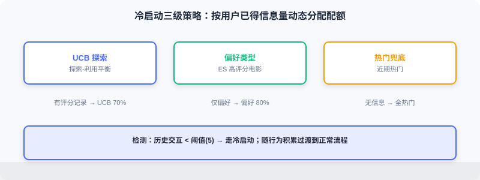
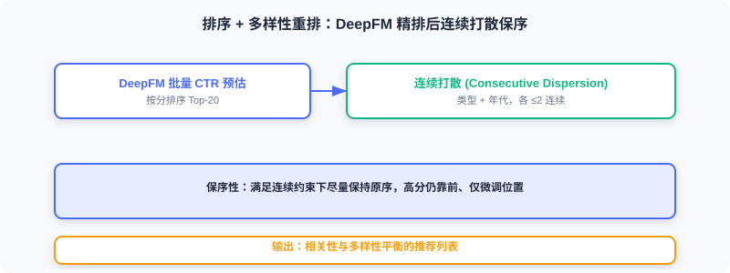

<div class="badge-row">
  <span style="background: #f0f4ff; color: #4A6CF7; padding: 4px 12px; border-radius: 20px; font-size: 0.85em; font-weight: 600; border: 1px solid rgba(74,108,247,0.2);">📖</span>
  <span style="background: #f0fdf4; color: #16a34a; padding: 4px 12px; border-radius: 20px; font-size: 0.85em; border: 1px solid rgba(22,163,74,0.2);">⏱️ ~34 min read</span>
  <span style="background: #fef2f2; color: #dc2626; padding: 4px 12px; border-radius: 20px; font-size: 0.85em; border: 1px solid rgba(100,100,100,0.15);">🎯 Advanced</span>
</div>

# The Online Pipeline

> 📝 **Before You Continue:** Read [11.3](./offline-pipeline.md) first and make sure you understand what the offline stage produces (item embeddings, encoders, user tower / ranking model). This section consumes those artifacts and turns requests into recommendation lists.

The online pipeline must complete the full path from user request to recommendation results within a few hundred milliseconds. The entire flow is encapsulated in a unified recommendation pipeline that executes in the order "cold start detection → multi-route retrieval → precise ranking → diversity re-ranking"; candidate counts and on/off switches for each stage are controlled centrally through configuration.

After reading this chapter, you will be able to:

- Describe how `RecommendationPipeline` and `PipelineConfig` wire the full pipeline together
- Explain the cold start detection threshold and the UCB exploration-exploitation formula, and write the score computation and state update code
- Describe the three retrieval routes (YoutubeDNN / I2I / preferred genres) and **Snake Merge** fusion
- Write DeepFM batch ranking, feature encoding reuse, async execution, and fallback strategies
- Explain how Consecutive Dispersion improves diversity while preserving ordering
- Work through 5 tiered practice problems

---

## 11.4.0 Code Structure

The online code lives in `web_project/backend/online/`:

```
online/
├── pipeline.py               # Main recommendation flow
├── cold_start/               # Cold start handling
│   ├── detector.py           # Cold start detection
│   ├── service.py            # Cold start service
│   ├── ucb_genre.py          # UCB genre exploration
│   └── preferred_genre.py    # Preferred-genre strategy
├── recall/                   # Multi-route retrieval
│   ├── service.py            # Retrieval service and fusion
│   ├── youtubednn.py         # YoutubeDNN retrieval
│   ├── item_based.py         # Item similarity retrieval
│   └── trending.py           # Trending retrieval
├── ranking/                  # Ranking models
│   ├── service.py            # Ranking service
│   └── deepfm.py             # DeepFM ranking
└── reranking/                # Re-ranking strategies
    ├── service.py            # Re-ranking service
    └── dispersion.py         # Dispersion strategy
```

The offline artifacts (models in the shared directory, Redis features, item embeddings) are the foundation of the online stage. The online path must finish within 200ms, which demands fast inference, efficient access, and coordinated stages.

The main flow is encapsulated in `RecommendationPipeline`:

The interactive walkthrough below traces one complete recommendation request: from the moment a user request arrives, through cold start detection, multi-route retrieval, Snake Merge fusion, DeepFM ranking, and diversity re-ranking, to result assembly and return. Click "Next" to watch the candidate pool shrink stage by stage.

<iframe src="../viz/part11-request-flow.html?embed&vizId=part11-request-flow" style="width:100%; height:520px; border:none; display:block;" loading="lazy"></iframe>

Note the candidate counts on the right side of the funnel: the full catalog shrinks to 100 after retrieval and to 20 after ranking, with a target end-to-end latency under 200ms — this is precisely the engineering point of the industrial funnel architecture.

```python
class RecommendationPipeline:
    def __init__(self):
        self.recall_service = get_recall_service()
        self.ranking_service = get_ranking_service()
        self.reranking_service = get_reranking_service()
        self.cold_start_service = get_cold_start_service()

    async def recommend(self, user_features, item_features_provider=None, config=None):
        config = config or PipelineConfig()
        if config.enable_cold_start and self._is_cold_start(user_features, config):
            return await self._cold_start_recommend(user_features, item_features_provider, config)
        candidates = await self._recall(user_features, config.recall_top_k)
        ranked_items, ranking_strategy = await self._rank(
            user_features, candidates, item_features_provider, config.ranking_top_k)
        reranked_items, reranking_strategies = await self._rerank(
            ranked_items, user_features, item_features_provider)
        return RecommendationResult(items=reranked_items, ...)
```

`PipelineConfig` centrally controls each stage's behavior:

```python
@dataclass
class PipelineConfig:
    recall_top_k: int = 100        # Number of candidates returned by retrieval
    ranking_top_k: int = 20        # Number of results returned by ranking
    enable_ranking: bool = True    # Whether to enable the ranking model
    enable_reranking: bool = True  # Whether to enable re-ranking
    enable_cold_start: bool = True
    cold_start_threshold: int = 5  # Fewer interactions than this → cold start user
    cold_start_top_k: int = 20
```

---

## 11.4.1 Cold Start Detection and Handling

Cold start is a classic problem: new users have no behavioral data, so both collaborative filtering and embedding-based retrieval fail. This project handles it with a dedicated cold start module.

**Cold start detection** is straightforward — a user whose interaction history is shorter than the threshold counts as a cold start user:

```python
class ColdStartDetector:
    def __init__(self, threshold: int = 5):
        self.threshold = threshold
    def is_cold_start(self, user_features: Dict[str, Any]) -> bool:
        hist_movie_ids = user_features.get("hist_movie_ids", [])
        if not hist_movie_ids:
            return True
        return len(hist_movie_ids) < self.threshold             # ← KEY LINE: interaction count < threshold → cold start
```

The threshold is a trade-off: too low, and users enter the normal flow before their preferences have stabilized; too high, and users wait too long for personalization. The default is **5 interactions**.

**Three strategies** are managed uniformly by `ColdStartService`:

```python
class ColdStartService:
    def __init__(self):
        self.detector = ColdStartDetector(threshold=5)
        self.strategies = [
            UCBGenreStrategy(),        # Priority 1: UCB exploration
            PreferredGenreStrategy(),  # Priority 2: user preferences
            PopularRecentStrategy(),   # Priority 3: trending fallback
        ]
    async def recommend(self, user_features, top_k=20):
        applicable = [s for s in self.strategies if s.can_handle(user_features)]
        if has_ucb_data:
            allocations = self._get_ucb_weighted_allocation(applicable, top_k)
        elif has_preferences:
            allocations = self._get_preference_weighted_allocation(applicable, top_k)
        else:
            allocations = self._get_fallback_allocation(applicable, top_k)
        results = await asyncio.gather(*[self._run_strategy(s, user_features, k)
                                          for s, k in allocations if k > 0])
        return self._merge_results(results, top_k)
```

Quotas are allocated dynamically based on user state: with rating history, UCB gets 70%; with only preference settings, the preferred-genre strategy gets 80%; with neither, everything goes to trending.



**UCB genre exploration** solves the exploration-vs-exploitation problem:

$$\text{UCB}(g) = \bar{r}_g + c \cdot \sqrt{\frac{\ln N}{n_g}}$$

where $\bar{r}_g$ is the historical average rating of genre $g$, $N$ is the total number of recommendations, $n_g$ is the number of times genre $g$ has been recommended, and $c$ is the exploration coefficient. The first term is **exploitation** (higher average rating is better); the second is **exploration** (the less a genre has been recommended, the higher the uncertainty and the bonus).

```python
class UCBGenreStrategy(ColdStartStrategy):
    def _calculate_ucb_scores(self, stats, total_n):
        scores = {}
        for genre in self.available_genres:
            if genre in stats and stats[genre]["n"] > 0:
                n = stats[genre]["n"]
                avg_reward = stats[genre]["reward"] / n
                exploration_bonus = self.exploration_c * math.sqrt(
                    math.log(total_n + 1) / (n + 1e-6))            # ← KEY LINE: exploration bonus decays as recommendation count grows
                scores[genre] = avg_reward + exploration_bonus
            else:
                scores[genre] = 1.0 + self.exploration_c * 2       # ← KEY LINE: unexplored genres get the highest exploration score
        return scores
```

UCB statistics are stored in Redis (key `user:{user_id}:genre_ucb`) and updated whenever the user rates a movie:

```python
def update_ucb_genre_stats(user_id, movie_genres, rating):
    normalized_reward = rating / 10.0
    key = f"user:{user_id}:genre_ucb"
    for genre in movie_genres:
        current_raw = redis_client.hget(key, genre)
        if current_raw:
            current = json.loads(current_raw)
            current["n"] = current.get("n", 0) + 1
            current["reward"] = current.get("reward", 0) + normalized_reward
        else:
            current = {"n": 1, "reward": normalized_reward}
        redis_client.hset(key, genre, json.dumps(current))        # ← KEY LINE: incrementally update genre statistics
```

Benefit: as ratings accumulate, the "exploitation" component of UCB grows, while genres the user hasn't encountered still get chances — avoiding the filter bubble.

**Preferred-genre strategy**: if `preferred_genres` exists, query Elasticsearch for highly rated movies in those genres (`avg_rating>=6.0`, `rating_count>=20`).

---

## 11.4.2 Multi-Route Retrieval

Users with enough behavioral history enter the normal flow. The first stage is retrieval: quickly narrow candidates down from the full catalog.

**Why multiple routes**: any single strategy has blind spots — embedding retrieval can miss relevance the model failed to capture (e.g., newly released niche films with few training samples and inaccurate representations); collaborative filtering undercovers niche items; trending offers no personalization. The idea is "don't put all your eggs in one basket": run several strategies in parallel, then merge.

```python
class RecallService:
    def __init__(self):
        self.strategies = [
            UserPreferenceRecallStrategy(),  # User preferred-genre retrieval
            ItemEmbeddingRecallStrategy(),   # Item similarity retrieval
            YouTubeDNNRecallStrategy(),      # Embedding retrieval
        ]
```

**YoutubeDNN embedding retrieval**: compute the user embedding online, then retrieve the most similar movies in the item embedding space.

```python
class YouTubeDNNRecallStrategy(RecallStrategy):
    def preprocess_user(self, user_features, max_hist_len=10):
        inputs = {}
        encoders = self.resource_manager.encoders
        for feat in ["user_id", "gender", "age", "occupation", "zip_code"]:
            raw_val = user_features.get(feat)
            if raw_val is not None and feat in encoders:
                try:
                    val = encoders[feat].transform([str(raw_val)])[0] + 1   # ← KEY LINE: reuse the offline encoder, +1 alignment
                except:
                    val = 0
            else:
                val = 0
            inputs[feat] = np.array([val])
        # History sequence: encode movie IDs + expand genres, left-pad to fixed length
        ...
        return inputs

    def _recall_sync(self, user_context, k):
        model_inputs = self.preprocess_user(user_context)
        user_emb = self.resource_manager.user_model.predict(model_inputs, verbose=0)
        user_emb = user_emb / np.linalg.norm(user_emb, axis=1, keepdims=True)
        scores = np.dot(user_emb, self.resource_manager.item_embedding_matrix.T)[0]  # ← KEY LINE: inner product ≡ cosine
        top_indices = np.argsort(scores)[::-1][:k]
        ...
```

Both user and item embeddings are normalized, so the inner product is equivalent to cosine similarity. With a catalog of only 3,000+ items, a direct inner product is fine; beyond a million items, use FAISS to accelerate.

**Item similarity retrieval (I2I)**: recommend items similar to what the user just watched — this captures immediate interests and reuses the YoutubeDNN item embeddings (which themselves encode collaborative filtering signal).

```python
class ItemEmbeddingRecallStrategy(RecallStrategy):
    async def recall(self, user_context, k):
        hist_movie_ids = user_context.get("hist_movie_ids", [])
        if not hist_movie_ids:
            return []
        last_movie_id = hist_movie_ids[0]                            # ← KEY LINE: take the most recently watched movie as the seed
        enc_idx = movie_le.transform([last_movie_id])[0] + 1
        target_emb = self.resource_manager.item_embedding_matrix[enc_idx]
        target_emb = target_emb / np.linalg.norm(target_emb)
        scores = np.dot(self.resource_manager.item_embedding_matrix, target_emb)
        top_indices = np.argsort(scores)[::-1][:k+2]
        ...
```

**User preferred-genre retrieval**: tally the user's preferred genres (computed offline, Top-3 stored in Redis) and retrieve popular movies from those genres. Its strength is stability — even if the user's recent behavior drifts occasionally, it keeps recommending the genres they have liked long-term.

**Snake Merge fusion**: naively merging by score lets one route dominate the list. Snake Merge takes candidates from the routes in rotation, guaranteeing every route sends representatives into ranking:

```python
def _merge_results_round_robin(self, results_list, top_k):
    merged_candidates = []
    seen_movie_ids = set()
    sources = [r if r else [] for r in results_list]
    source_pointers = [0] * len(sources)
    direction = 1
    current_idx = 0
    while len(merged_candidates) < top_k:
        all_exhausted = all(source_pointers[i] >= len(sources[i])
                             for i in range(len(sources)))
        if all_exhausted:
            break
        src_list = sources[current_idx]
        ptr = source_pointers[current_idx]
        if ptr < len(src_list):
            item = src_list[ptr]
            source_pointers[current_idx] += 1
            mid = item["movie_id"]
            if mid not in seen_movie_ids:                          # ← KEY LINE: deduplicate to avoid cross-route repeats
                merged_candidates.append(item)
                seen_movie_ids.add(mid)
        current_idx += direction
        if direction == 1 and current_idx >= len(sources):
            direction = -1
            current_idx = len(sources) - 1
        elif direction == -1 and current_idx < 0:
            direction = 1
            current_idx = 0
    return merged_candidates
```

The name comes from the traversal order: with three routes A, B, and C, the merge order is A→B→C→C→B→A→A→B→C…, like a snake weaving back and forth.


---

## 11.4.3 Precise Ranking (DeepFM)

Retrieval narrows the field to roughly 100 candidates, but their order is determined by retrieval scores and isn't precise enough. Ranking uses DeepFM to estimate CTR for each candidate and reorder them.

**The core of online inference is feature construction** — each (user, candidate) pair must be encoded into model inputs:

```python
class DeepFMRankingStrategy(RankingStrategy):
    def _prepare_batch_inputs(self, user_features, candidates):
        rm = self.resource_manager
        batch_size = len(candidates)
        inputs = {}
        for feat in rm.user_features:                               # ← KEY LINE: user features are shared across all candidates, replicated
            raw_val = user_features.get(feat)
            encoded_val = rm.encode_feature(feat, raw_val)
            inputs[feat] = np.full(batch_size, encoded_val, dtype=np.int32)
        for feat in rm.item_features:                               # ← KEY LINE: item features differ per candidate
            encoded_values = [rm.encode_feature(feat, c.get(feat)) for c in candidates]
            inputs[feat] = np.array(encoded_values, dtype=np.int32)
        return inputs
```

Feature encoding reuses the LabelEncoders saved offline, with **codes starting at 1 and 0 reserved for unknowns**, consistent with training:

```python
def encode_feature(self, feat_name, raw_value):
    if raw_value is None:
        return 0
    encoder = self.encoders.get(feat_name)
    if encoder is None:
        return 0
    try:
        if isinstance(encoder.classes_[0], str) and not isinstance(raw_value, str):
            raw_value = str(raw_value)
        if raw_value in encoder.classes_:
            return int(encoder.transform([raw_value])[0]) + 1       # ← KEY LINE: strictly consistent with offline encoding
        else:
            return 0
    except Exception:
        return 0
```

Once the inputs are ready, predict in batch:

```python
def _rank_sync(self, user_features, candidates):
    inputs = self._prepare_batch_inputs(user_features, candidates)
    predictions = self.resource_manager.ranking_model.predict(
        inputs, verbose=0, batch_size=min(len(candidates), 256))   # ← KEY LINE: batch prediction exploits vectorization
    if predictions.ndim > 1:
        predictions = predictions.flatten()
    ranked_results = []
    for i, candidate in enumerate(candidates):
        ranked_results.append({
            "movie_id": candidate["movie_id"],
            "score": float(predictions[i]),                        # CTR prediction score
            "recall_score": candidate.get("score", 0.0),
            "recall_type": candidate.get("recall_type"),
        })
    ranked_results.sort(key=lambda x: x["score"], reverse=True)    # ← KEY LINE: reorder by CTR score
    return ranked_results
```

Batch prediction on 100 candidates typically takes 10–30ms. Model inference is CPU-intensive, so it runs in a thread pool to avoid blocking the event loop; if the model is unavailable, the system **falls back** to `FallbackRankingStrategy`, which ranks directly by retrieval score to keep availability high.

---

## 11.4.4 Diversity Re-ranking

After retrieval and ranking, the list may lack diversity (e.g., if action movies dominate, ranking pushes them all to the top). Moderate diversity improves satisfaction and retention.

**Consecutive Dispersion**: no more than $N$ consecutive items may share the same attribute. For example, with $N=2$, [action, action, action, comedy] → [action, action, comedy, action].

```python
class ConsecutiveDispersionStrategy(RerankingStrategy):
    def _can_add(self, item, result):
        if len(result) < self._max_consecutive:
            return True
        item_key = self._feature_extractor(item)
        if item_key is None:
            return True
        recent_keys = [self._feature_extractor(r)
                       for r in result[-(self._max_consecutive - 1):]]
        return not all(k == item_key for k in recent_keys)         # ← KEY LINE: reject if the last N-1 all match
    async def rerank(self, items, user_features=None):
        if len(items) <= self._max_consecutive:
            return items
        result, deferred = [], []
        for item in items:
            if self._can_add(item, result):
                result.append(item)
                self._try_insert_deferred(result, deferred)         # ← KEY LINE: prefer inserting candidates that can be added
            else:
                deferred.append(item)
        result.extend(deferred)                                     # append the remainder at the end
        return result
```

Two variants are predefined: **genre dispersion** (uses the first genre) and **decade dispersion** (buckets by 10-year period, e.g., the 1990s).

```python
class GenreDispersionStrategy(ConsecutiveDispersionStrategy):
    def __init__(self, max_consecutive=2):
        super().__init__(_extract_genre, max_consecutive, "genre_dispersion")

class DecadeDispersionStrategy(ConsecutiveDispersionStrategy):
    def __init__(self, max_consecutive=2):
        super().__init__(_extract_decade, max_consecutive, "decade_dispersion")
```

**Strategy chain composition** — strategies run in order, each output feeding the next:

```python
class RerankingService:
    def __init__(self):
        self._strategies = [
            GenreDispersionStrategy(max_consecutive=2),
            DecadeDispersionStrategy(max_consecutive=2),
        ]
    async def rerank(self, items, user_features=None):
        if not items or not self._enabled:
            return items
        result = items
        for strategy in self._strategies:
            if strategy.is_ready:
                result = await strategy.rerank(result, user_features)
        return result
```

The key property is **order preservation**: subject to the consecutive constraint, the original order is kept as much as possible — high-scoring items still come first, with only minor positional adjustments — retaining relevance while adding diversity.



---

## 11.4.5 API Integration and Service Startup

Once the components are built, they are integrated into FastAPI to expose HTTP endpoints.

**Recommendation API** core logic:

```python
@router.post("/recommend")
async def get_recommendations(request, db=Depends(get_db), current_user=Depends(get_current_user)):
    pipeline = get_pipeline()
    if not pipeline.is_ready:
        raise HTTPException(status_code=503, detail="Recommendation service not ready")
    user_features = await build_user_features(current_user, db)
    async def item_features_provider(movie_ids):
        movies = await get_movies_by_ids(db, movie_ids)
        return {m.id: {"movie_id": m.id, "genres": m.genres.split("|") if m.genres else [],
                       "year": m.year, "isAdult": m.is_adult} for m in movies}
    config = PipelineConfig(recall_top_k=request.recall_top_k or 100,
                             ranking_top_k=request.top_k or 20, enable_cold_start=True)
    result = await pipeline.recommend(user_features=user_features,
                                       item_features_provider=item_features_provider, config=config)
    movie_ids = [item.movie_id for item in result.items]
    movies = await get_movies_by_ids(db, movie_ids)
    movie_map = {m.id: m for m in movies}
    return {
        "recommendations": [{
            "movie_id": item.movie_id, "title": movie_map[item.movie_id].title,
            "poster_url": movie_map[item.movie_id].poster_url,
            "genres": movie_map[item.movie_id].genres, "year": movie_map[item.movie_id].year,
            "score": item.score, "recall_type": item.recall_type,
        } for item in result.items if item.movie_id in movie_map],
        "is_cold_start": result.is_cold_start, "ranking_strategy": result.ranking_strategy,
    }
```

Key points: (1) user features are assembled from the DB + Redis; (2) the `item_features_provider` callback **lazily loads** item features, avoiding loading data at the retrieval stage that may never be used; (3) the pipeline returns IDs + scores, so the database must be queried to fill in titles and posters.

**Resource loading and the singleton pattern** — models are large and should be shared at process level; `RecallResourceManager` uses a singleton with lazy loading:

```python
class RecallResourceManager:
    _instance = None
    def __new__(cls):
        if cls._instance is None:
            cls._instance = super().__new__(cls)
            cls._instance._initialized = False
        return cls._instance
    def __init__(self):
        if self._initialized:
            return
        self.user_model = None
        self.item_embedding_matrix = None
        self.encoders = {}
        self._initialized = True
    def _ensure_resources_loaded(self):
        if self.user_model is not None:
            return
        self._load_from_local()                                    # ← KEY LINE: load only on first use
    def _load_from_local(self):
        deploy_dir = Path(os.getenv("MODEL_DEPLOY_DIR"))
        with open(deploy_dir / "model" / "user_recall" / "active.json") as f:
            version_info = json.load(f)                            # ← KEY LINE: read the version pointer to decide which version to load
        self.user_model = tf.keras.models.load_model(deploy_dir / version_info["path"])
        self.item_embedding_matrix = np.load(deploy_dir / "item_embeddings.npy")
        with open(deploy_dir / "vocab_dict.pkl", "rb") as f:
            self.encoders = pickle.load(f)
```

**Health check**: `/health` exposes the status of each component for monitoring:

```python
def get_health_status(self):
    return {
        "cold_start": {"available": ..., "ready": self.is_cold_start_ready, ...},
        "recall": {"available": ..., "strategies": len(self.recall_service.strategies)},
        "ranking": {"available": ..., "ready": self.is_ranking_ready, ...},
        "reranking": {"available": ..., "ready": self.is_reranking_ready, ...},
    }
```

> **Analysis:** The engineering value of the online path lies in "millisecond latency + high availability" — batch prediction, thread-pool async, model fallback, singleton caching, and hot-loading via version pointers all serve these two goals. These are the details papers never mention, yet they decide whether a system can actually ship.

---

## ⚠️ Common Mistakes in 11.4

| # | Mistake | Example | Why It's Wrong | Fix |
|---|---------|---------|---------------|-----|
| 1 | Encoding inconsistent with offline | Using a default LabelEncoder online | Input space misaligned, predictions are garbage | Reuse the same encoder/vocabulary |
| 2 | Arbitrary cold start threshold | Threshold = 50 | Users wait too long for personalization | Default 5, tune per business |
| 3 | Single retrieval route, no fusion | Only embedding retrieval | Insufficient coverage/diversity | Multi-route + Snake Merge |
| 4 | Ranking without fallback | 503 when the model dies | Availability collapses | FallbackRankingStrategy |
| 5 | Dispersion breaks ordering | Global reshuffle | High scorers pushed back | Preserve order under the consecutive constraint |
| 6 | Reloading the model per request | No singleton | Memory blow-up, high latency | Singleton + lazy loading |

---

## Chapter Summary

### 📌 Key Takeaways

| Concept | Key Points | Why It Matters |
|---------|-----------|----------------|
| Pipeline orchestration | Pipeline + Config wire the full flow | Every stage controllable and disableable |
| Cold start UCB | Exploitation + exploration formula, incremental Redis stats | Solves zero-sample exploration-exploitation |
| Multi-route retrieval | Embeddings/I2I/preferences + Snake Merge | Coverage and diversity together |
| Ranking | DeepFM batch CTR estimation + fallback | Precise and highly available |
| Diversity re-ranking | Consecutive dispersion + order preservation | Balances relevance and diversity |
| Resource singleton | Version pointer + lazy loading | Millisecond latency + hot updates |

### ❓ FAQ

**Q1: How was the cold start threshold of 5 chosen?**
> A: It's an empirical value. Too low, and users enter the normal flow before preferences stabilize (retrieval/ranking are still weak); too high, and users wait too long for personalization. Tune it to your interaction density — lower for high-frequency scenarios, higher for low-frequency ones.

**Q2: How is Snake Merge different from naive concatenation with dedup?**
> A: Naive concatenation sorts by score and truncates to top K, so a strong route can dominate; Snake Merge takes candidates in rotation, structurally guaranteeing every route has representatives entering ranking — better diversity.

**Q3: Why not just raise an error when the ranking model dies?**
> A: Availability comes first in a recommender system. Falling back to ranking by retrieval score still gives users (slightly lower quality) results — far better than a 503. This is the "graceful degradation" principle.

### 🔗 Connections to Later Chapters

- **11.3** provides item embeddings, encoders, and models — the inputs for all online retrieval/ranking.
- **2.3 (two-tower)** and **3.x (DeepFM)** are the algorithmic basis of the retrieval and ranking models.
- **4.2 (diversity re-ranking)** explains the theoretical motivation for dispersion strategies; this project is an instance of it.
- The recommendation API used in **11.5** calls this section's `pipeline.recommend`.
- **11.6** discusses how to run this entire online service stably in containers.

---

## Practice Problems

Work through all problems in order — they get progressively harder. Each has a complete solution you can reveal after trying it yourself.

---

**Problem 11.4.1 — Cold Start Determination** 🟢 Easy

A user's watch history is `[101, 202, 303]` (3 movies) and `cold_start_threshold=5`. What does `is_cold_start` return? What if they rate 3 more movies (6 total)?

<details>
<summary>💡 Solution (click to reveal)</summary>

**Answer:** 3 < 5 → returns True (cold start). With 6 total, 6 >= 5 → returns False (normal flow).

**Key points:**
- The threshold comparison is "fewer than the threshold means cold start."
- Users transition naturally to the normal flow as behavior accumulates.

</details>

---

**Problem 11.4.2 — UCB Exploration Term** 🟢 Easy

In the UCB formula, genre A has been recommended 100 times and genre B 2 times, everything else equal ($N$ is large). Looking only at the exploration term $c\sqrt{\frac{\ln N}{n_g}}$, which genre scores higher?

<details>
<summary>💡 Solution (click to reveal)</summary>

**Answer:** B's exploration term = $c\sqrt{\ln N/2}$, A's = $c\sqrt{\ln N/100}$. The smaller denominator gives the larger value, so B gets the higher exploration bonus. This is exactly "genres recommended less get higher exploration opportunity," avoiding the filter bubble.

**Key points:**
- The exploration term decreases as $n_g$ grows.
- Unexplored genres (n=0) get the highest exploration score.

</details>

---

**Problem 11.4.3 — Snake Merge Order** 🟡 Medium

Three retrieval routes A, B, C return candidates [a1,a2], [b1,b2], [c1,c2] respectively, with top_k=4 and no duplicate movie_ids across routes. What are the first 4 items (after dedup) of the Snake Merge result, in order?

<details>
<summary>💡 Solution (click to reveal)</summary>

**Answer:** The order is A→B→C→C→B→A…. Take a1,b1,c1, then swing back through C for c2. The first 4 = [a1, b1, c1, c2].

**Key points:**
- The serpentine reverses at the ends, ensuring routes take turns.
- Dedup avoids cross-route duplicates entering ranking.

</details>

---

**Problem 11.4.4 — Encoding Consistency** 🟡 Medium

The offline LabelEncoder for gender has classes `["F","M"]` (transform yields 0/1, +1 gives 1/2). Online, the raw value `"M"` arrives — what does `encode_feature` return? What about a value `"X"` that never appeared in training?

<details>
<summary>💡 Solution (click to reveal)</summary>

**Answer:** `"M"` → transform yields 1, +1 returns 2 (consistent with offline). `"X"` is not in classes_ → returns 0 (unknown), consistent with the offline padding semantics — the model won't crash.

**Key points:**
- Online must reuse the same offline encoder, with +1 alignment.
- Unknown values uniformly encode to 0, ensuring robustness.

</details>

---

**🏆 Challenge: Design a Fallback Chain** 🔴 Hard

Suppose that during one request, retrieval works, but the ranking model fails to load, and the user is not a cold start. Describe the path the system should take, the quality of the returned results, and one fallback scheme that could beat "just rank by retrieval score" (within 150 words).

<details>
<summary>💡 Hint</summary>

Path: cold start detection returns False → multi-route retrieval produces candidates → ranking failure triggers FallbackRankingStrategy (sort by retrieval score) → re-ranking → return. Quality: relevance drops (no precise CTR ranking) but stays available. A better scheme: use I2I/preference retrieval scores as coarse-ranking weights, or fall back to a small model that didn't fail (e.g., logistic regression) rather than pure retrieval scores — improving personalization.

</details>
