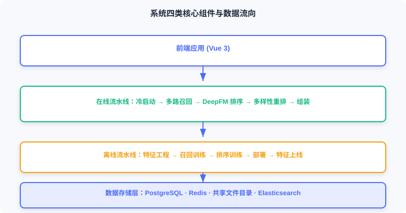
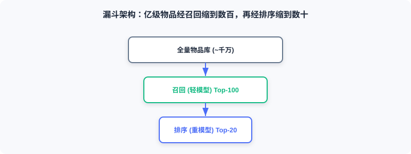

  📖
  ⏱️ ~22 min read
  🎯 Intermediate

# System Architecture Design

> 📝 **Before You Continue:** Finish [11.1](./project-intro.md) first — the technology choices and the offline/online differences. This section turns those choices into components and data flows, building the top-level mental model of the system.

A production recommender is multiple subsystems working in concert. This section covers the overall design, the core components, and how data moves between them. It is the "map" for all the implementation chapters that follow.

After reading this chapter, you will be able to:

- Describe the responsibility boundary and decoupling between the **offline system** (production) and the **online system** (serving)
- Point out the four component groups in the overall architecture diagram: the data storage layer, the offline pipeline, the online pipeline, and the frontend
- Explain the offline data flow (CSV → features/models → shared directory + Redis) and the online data flow (request → retrieval → ranking → re-ranking → assembly)
- Articulate the four key design decisions: the funnel architecture, multi-route retrieval fusion, cold-start handling, and separating feature storage from computation
- Work through 4 tiered practice problems

---

## 11.2.0 The Offline and Online Systems

An industrial recommendation architecture splits into two parts: the **offline system** and the **online system**.

The **offline system** is responsible for "production": processing the full historical data, training models, and computing item embeddings and similarity matrices. Compute time is plentiful (hours or even days); it optimizes for model quality rather than response speed, and outputs model files, embedding indexes, feature dictionaries, and the like.

The **online system** is responsible for "serving": receiving real-time requests, invoking models, assembling recommendation results, and returning them. Response time is limited (sub-second); it must balance quality against latency, and it depends on the models and features the offline side produces.

The offline system runs on a schedule (daily/weekly) and writes its outputs to shared storage; the online system loads from that shared storage. The two are **decoupled through the storage layer**: offline can afford more complex algorithms and larger data volumes; online focuses on low-latency serving.

The interactive demo below gives you an intuitive feel for how data and models flow between offline "production" and online "consumption": starting from raw rating data, through feature engineering, training, and embedding precomputation, landing in the storage layer, then being loaded by the online service for real-time inference. Click "Next" to watch how each step's outputs get handed off.

<iframe src="../viz/part11-offline-online.html?embed&vizId=part11-offline-online" style="width:100%; height:520px; border:none; display:block;" loading="lazy"></iframe>

Note step five, "storage-layer hand-off": the `active.json` version pointer and the item embeddings written out by the offline side are exactly the input to the online loading stage — this decoupling is what lets offline retrain at leisure while online serves in milliseconds.

---

## 11.2.1 Overall Architecture and Core Components

The system consists of four core component groups, expanded one by one below.

### Data Storage Layer

- **PostgreSQL (business database)**: stores the user table (gender/age/occupation), the movie table (title/genres/year/poster), and the ratings table (rating + timestamp).
- **Redis (feature cache)**: holds the real-time features needed for online inference — user profiles `user:{id}:profile`, behavior sequences `user:{id}:history`, and the item embedding index.
- **Shared file directory**: stores model files (user_model, ranking_model), the item embedding matrix (item_embeddings.npy), and feature encoding dictionaries (vocab_dict.pkl).
- **Elasticsearch (search engine)**: builds inverted indexes over movie titles, genres, and actors to power search.

### Offline Pipeline

Executes in order: feature engineering → retrieval model training (YoutubeDNN) → ranking model training (DeepFM) → model deployment → feature ingestion. See [11.3](./offline-pipeline.md).

### Online Pipeline

Every request passes through: cold-start detection → multi-route retrieval → precise ranking → diversity re-ranking → result assembly. See [11.4](./online-pipeline.md).

### Frontend Application

Built on Vue 3, with four core pages — home, movie detail, search, and personal center ([11.5](./frontend.md)).

---

## 11.2.2 Offline Data Flow

The offline pipeline turns raw rating data into models and features the online side can use:

1. **Feature engineering**: extract training features (user/item/behavior sequences) from the raw ratings.
2. **Retrieval model training**: train the YoutubeDNN two-tower to learn the user/item embedding mapping.
3. **Ranking model training**: train DeepFM to learn the click probability of user-item pairs.
4. **Model deployment**: write the model files to the shared directory for online loading.
5. **Feature ingestion**: write user profiles, behavior sequences, and item information to Redis.

The correspondence between offline outputs and online needs is the key to understanding the whole system — offline "figures out how to compute it," online "fetches it fast and uses it."

---

## 11.2.3 Online Data Flow

The online pipeline handles every user request; take "opening the homepage" as an example:

1. **Cold-start detection**: decide whether the user is new (fewer historical behaviors than a threshold); new users go through cold start, everyone else through the normal flow.
2. **Multi-route retrieval**: run YoutubeDNN vector retrieval, item-similarity retrieval, and preferred-genre retrieval in parallel.
3. **Precise ranking**: DeepFM estimates the CTR of each candidate and sorts by score.
4. **Diversity re-ranking**: scattering strategies to avoid consecutive movies of the same genre or year.
5. **Result assembly**: query the database to fill in titles, posters, and so on, and assemble the frontend response.

The target end-to-end latency is under **200 milliseconds**.

---

## 11.2.4 Key Design Decisions

### Separating Retrieval and Ranking (the Funnel Architecture)

In theory you could train one model to score the entire catalog directly, but that is computationally infeasible: with a catalog of 100,000 movies, running the ranking model over the full catalog on every request would take 100 seconds even at 1 ms per inference.

Hence the **funnel architecture**: the retrieval stage uses a light model to quickly filter down to a few hundred candidates; the ranking stage uses a complex model to score precisely those few hundred.

### Multi-Route Retrieval and Fusion (Snake Merge)

Any single retrieval strategy has blind spots: vector retrieval can miss relevance the model never captured; collaborative filtering covers new or niche movies poorly; popular recommendations lack personalization. Fusing multiple strategies lets them cover one another's weaknesses. This project uses **Snake Merge**: candidates are drawn round-robin from each route, guaranteeing that every route sends representatives into ranking.

### Cold-Start Handling

New users lack behavior, so collaborative filtering and vector retrieval fail. This project designs a dedicated cold-start flow: (1) detect via an interaction-count threshold; (2) if the user set preferred genres, prioritize quality movies of those genres; (3) otherwise fall back to popular items or UCB exploration; (4) transition to the normal flow as behavior accumulates.

### Separating Feature Storage from Computation

Online inference is latency-sensitive. If every request queried historical behavior from PostgreSQL, the database would become the bottleneck. So high-frequency features are precomputed and written to Redis: user profiles are written at registration/update time; behavior sequences are updated after every rating; item embeddings are written in offline batches. Redis read latency is typically <1 ms — one to two orders of magnitude faster than a database.

> **Analysis:** The four decisions all point to one principle — **put the heavy work offline, the fast work online, and the hot data in memory**. The funnel solves compute, fusion solves coverage, cold start solves zero samples, and storage separation solves latency.

---

## ⚠️ Common Mistakes in 11.2

| # | Mistake | Example | Why It's Wrong | Fix |
|---|---------|---------|---------------|-----|
| 1 | Scoring the full catalog with one model | "Just rank the whole catalog with one model" | 100k candidates × inference = hundreds of seconds; unservable | Funnel: retrieval narrows the candidates, ranking scores them precisely |
| 2 | Offline/online feature mismatch | Offline uses a new encoder, online the old one | Train-serve skew; performance collapses | Share the same vocab_dict/encoders |
| 3 | Querying the database for features on every request | Reading PG history in real time | The database becomes the latency bottleneck | Pre-write high-frequency features to Redis |
| 4 | Single-route retrieval | Using only vector retrieval | Insufficient coverage; niche/new movies get missed | Multi-route retrieval + Snake Merge fusion |
| 5 | Mixing cold start into the normal flow | Treating new users the same as everyone | Poor experience for new users; recommendations break | Dedicated cold-start detection and a three-tier strategy |

---

## Chapter Summary

### 📌 Key Takeaways

| Concept | Key Points | Why It Matters |
|---------|-----------|----------------|
| Offline/online decoupling | Offline produces, online serves; the storage layer bridges them | The engineering balance of quality and latency |
| Four component groups | PG/Redis/shared dir/ES + offline/online/frontend | The physical layout of the system |
| Offline data flow | CSV → features → training → deployment + ingestion | The training-time view |
| Online data flow | Request → retrieval → ranking → re-ranking → assembly | The serving-time view (<200 ms) |
| Four design decisions | Funnel / fusion / cold start / storage separation | The foundation of engineering feasibility |

### ❓ FAQ

**Q1: The offline side runs on a schedule while the online side serves in real time — don't models go stale?**
> A: They do; that's the norm in industry. This project uses a version pointer (active.json) for transparent hot updates (see Section 11.3): after offline retraining, flipping the pointer is all it takes — no downtime.

**Q2: Why are item embeddings computed offline but user embeddings online?**
> A: The item catalog is relatively static and large — compute it once offline and index it. The user is only known at request time, so their embedding must be computed online. Building the library offline + querying it online is exactly what makes the two-tower scale (see Section 2.3).

**Q3: How is Snake Merge different from simply merging by score?**
> A: Score-based merging lets one route (e.g., vector retrieval) dominate the list; Snake Merge draws round-robin so that every route sends representatives into ranking, improving diversity and coverage.

### 🔗 Connections to Later Chapters

- **11.1**'s technology choices land here as components and data flows.
- **11.3** goes deep into every step of the offline pipeline's implementation.
- **11.4** goes deep into every step of the online pipeline's implementation.
- **2.3 (two-tower)** and **3.x (DeepFM)** are the algorithmic basis of the retrieval and ranking models.
- **4.2 (diversity re-ranking)** explains the theoretical motivation for the scattering strategies in the re-ranking stage.

---

## Practice Problems

Work through all problems in order — they get progressively harder. Each has a complete solution you can reveal after trying it yourself.

---

**Problem 11.2.1 — Draw the Data Flow** 🟢 Easy

In one sentence: which component produces the offline-trained `item_embeddings.npy`, which component consumes it, and at which online stage is it used?

💡 Solution (click to reveal)

**Answer:** The offline pipeline's "model deployment" writes it to the shared directory; the online pipeline's retrieval service (`RecallResourceManager`) loads it; it is used at the vector-search stage of YoutubeDNN / item-similarity retrieval.

**Key points:**
- A classic case of offline production and online consumption.
- It embodies "decoupling through the storage layer."

---

**Problem 11.2.2 — The Funnel's Compute Bill** 🟢 Easy

A catalog of 50,000 movies; retrieval uses a light model (0.1 ms per candidate) to shortlist 200; ranking uses a heavy model (1 ms per candidate) to score those 200. How long would full-catalog ranking take? How long does the funnel take?

💡 Solution (click to reveal)

**Answer:** Full-catalog ranking = 50,000 × 1 ms = 50 seconds. Funnel = retrieval 50,000 × 0.1 ms = 5 s + ranking 200 × 1 ms = 0.2 s ≈ 5.2 s. And retrieval over a prebuilt index is far faster than 5 s, so the funnel's advantage is even bigger in practice.

**Key points:**
- The funnel turns "heavy model over the full catalog" into "light model over the full catalog + heavy model over a subset."
- Real retrieval uses vector indexes and hardly scans the full catalog (see Section 2.3.4).

---

**Problem 11.2.3 — Why Features Live in Redis** 🟡 Medium

A product manager argues: "Just query user features straight from PostgreSQL — save yourself the trouble of maintaining Redis." Point out the risks, and quantify why Redis is the better fit.

💡 Solution (click to reveal)

**Answer:** Every recommendation request reads the user profile + behavior sequence. Querying PG (typically several to a dozen-plus ms per read), stacked on top of retrieval/ranking/re-ranking, easily blows the 200 ms budget; and PG becomes a bottleneck under high concurrency. Redis in-memory reads are <1 ms — one to two orders of magnitude faster than PG — and its List/Hash types naturally express history sequences and profiles. The cost is maintaining one more copy of the data and its consistency, but the latency win far outweighs it.

**Key points:**
- Online features are "high-frequency, low-latency, structurally simple" → an in-memory store fits naturally.
- PG suits durable business data, not hot-path feature reads.

---

**🏆 Challenge: Propose One Improvement to the Architecture** 🔴 Hard

Based on this architecture, propose one change that would noticeably improve recommendation quality or stability in a production environment (e.g., real-time feature updates, model A/B testing, online learning). State the problem it solves and which layer it touches (within 150 words).

💡 Hint

Options: (1) a real-time feature pipeline — update the Redis behavior sequence near-real-time after each rating (instead of only in offline batches) to improve freshness; touches offline "feature ingestion" + an online write-back. (2) Model A/B — extend `active.json` to multi-version traffic splitting; touches online resource loading. (3) Upgrade vector search to FAISS — replace brute-force inner product once the catalog exceeds a million items; touches the retrieval service. Arguing any one of these is enough.

