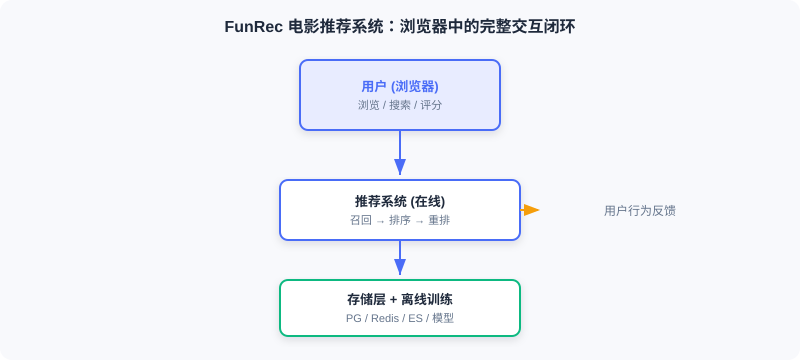

  📖
  ⏱️ ~18 min read
  🎯 Intermediate

# Project Introduction and Goals

> 📝 **Before You Continue:** Finish the three-stage pipeline overview in [1.1](./project-intro.md) first. This chapter integrates the previously scattered **retrieval, ranking, and re-ranking** modules into a runnable system — the focus is not on new algorithms, but on making them work together.

Many learners share a very real frustration: they can follow the models in papers and even get the code running, but when asked "how would you deploy a recommender in a real setting?" they have no idea where to start. The gap comes from the distance between **offline experimentation and online serving** — papers answer "is the model good?" but not "how does the system run?"

After reading this chapter, you will be able to:

- Describe the six fundamental differences between offline evaluation and online deployment
- State this project's four goals: functionally complete, technically realistic, algorithms applied, architecture clear
- List the backend and frontend technology stacks, and explain why FastAPI + Vue + PostgreSQL + Redis + Elasticsearch
- Outline the five-stage learning path from system architecture to deployment
- Work through 4 tiered practice problems to consolidate your picture of the whole project

---

## 11.1.0 Project Background: From "Good Model" to "Working System"

The preceding chapters introduced the core modules of a recommender — retrieval, ranking, and re-ranking. They are the building blocks, but how to assemble them into a complete system is something papers don't teach. The real questions you face are:

- When a user opens the app, how does the system return recommendations within **100 milliseconds**?
- A user has just rated a movie — how does that behavior **immediately affect** the next recommendation?
- How are models deployed? Where do features live? How do retrieval and ranking **cooperate**?
- A brand-new user with no history opens the app for the first time — what should the system **recommend**?

No single paper answers these questions; you have to think at the **system level**. This chapter walks you through building a complete movie recommender from scratch: users browse, search, and rate in the browser, backed by a full engineering chain of offline training + online inference + containerized deployment.

> 💡 **Key Insight:** The hard part of engineering practice is not any single algorithm — it is turning discrete modules into a **system that runs in concert**. Papers give you the parts; this chapter gives you the assembly drawing.

### 🧠 Mental Model: LEGO Parts vs. a Finished Ship

> Reading the algorithm chapters is like collecting LEGO parts — each piece is exquisitely made. But users don't want parts; they want a ship that actually floats and sails. This Part is the process of assembling the parts into a ship — and keeping it afloat for real.

---

## 11.1.1 Offline vs. Online

Many readers meet recommender systems through competitions or papers — settings that focus on **offline evaluation**; this chapter's project focuses on **end-to-end deployment** — putting a usable system in front of real users. The differences are significant:

| Dimension | Offline Experiments | Online Systems |
|------|----------|----------|
| Evaluation | Offline metrics (AUC, recall) | Real users actually interacting |
| Data flow | Static datasets | Real-time user behavior |
| Latency requirement | None (batch processing) | Millisecond-level response |
| Cold start | Usually ignored | **Must be handled** |
| Infrastructure | Local Python scripts | Databases, caches, search engines, container orchestration |
| Final output | Prediction result files | An accessible web application |

The offline system produces at leisure: it processes the full historical data, trains models, and computes embeddings, outputting model files and embedding indexes. The online system serves in real time: it receives requests, invokes models, and assembles results, returning within a few hundred milliseconds. The two are decoupled through the **storage layer** (Redis, shared files).

> **Analysis:** This decoupling is the pivotal engineering trade-off — offline can chase quality with more complex algorithms and larger data volumes; online only loads the artifacts and focuses on low-latency serving. Understand this boundary, and you understand half of industrial recommender systems.

---

## 11.1.2 Technology Choices and Dataset

**Dataset**: we choose **MovieLens-1M** — one of the most classic benchmarks in recommendation, with about 1 million ratings, nearly 4,000 movies, and more than 6,000 users. The scale is just right: large enough to exercise the complete architecture, small enough not to blow up your compute budget. We also enrich it with posters, actors, directors, and other metadata from IMDB for a richer display.

**Backend stack**

- **FastAPI**: a modern Python web framework, natively async, with auto-generated API docs
- **PostgreSQL**: the relational store for core business data — users, movies, ratings
- **Redis**: the in-memory store caching user profiles and real-time behavior sequences
- **Elasticsearch**: the search engine powering movie search
- **Shared file directory**: stores the trained models and item embeddings

**Frontend stack**

- **Vue.js 3**: a progressive JS framework for building the reactive UI
- **Tailwind CSS**: a CSS framework for rapid UI implementation

**Models and algorithms**

- **Retrieval**: YoutubeDNN two-tower, item-similarity retrieval, user-preferred-genre retrieval
- **Ranking**: **DeepFM** (FM second-order crossings + DNN high-order nonlinearity)
- **Re-ranking**: diversity strategies that scatter by genre and by era
- **Cold start / exploration**: **UCB (Upper Confidence Bound)** balancing exploration and exploitation

**Infrastructure**

- **Docker Compose**: container orchestration to start all services with one command
- **uv**: a Python package manager for fast dependency installation

---

## 11.1.3 Learning Path

This chapter proceeds from macro to micro, and from offline to online:

1. **System architecture design** ([11.2](./project-architecture.md)): a top-level view of the components, the offline/online boundary, and how data flows.
2. **Offline pipeline** ([11.3](./offline-pipeline.md)): starting from raw data, complete feature engineering, model training, evaluation, and deployment.
3. **Online pipeline** ([11.4](./online-pipeline.md)): build the real-time inference service, implementing cold start, multi-route retrieval, ranking, and re-ranking end to end.
4. **Frontend and interaction** ([11.5](./frontend.md)): design the UI and implement core features such as search, recommendations, and ratings.
5. **Deployment and operations** ([11.6](./deployment.md)): deploy with Docker Compose, and discuss monitoring, logging, and performance tuning.

Every part ships with complete code. You can read and build along, or get the project running first and dig into the details afterwards.

> 📊 **Data Point:** All runnable code for this project is in the `web_project/` directory of the `datawhalechina/fun-rec` repository; the dataset is the preprocessed `funrec-movielens-1m`.

---

## ⚠️ Common Mistakes in 11.1

| # | Mistake | Example | Why It's Wrong | Fix |
|---|---------|---------|---------------|-----|
| 1 | Treating offline metrics as launch criteria | "High AUC means it's ready to serve" | Offline has no latency constraint; online must return within a few hundred milliseconds | Distinguish the six dimensions separating offline evaluation from online serving |
| 2 | Ignoring cold start | Assuming every user has history | New users have no behavior; collaborative filtering and vector retrieval fail | Design a dedicated cold-start flow (see Section 11.4) |
| 3 | Over-engineering the stack | Spinning up a K8s cluster for a small project | More operational complexity, slower delivery | One Docker Compose file is enough |
| 4 | Skipping the architecture and diving into code | Writing services before drawing the data flow | Blurry module boundaries, tangled feature hand-offs | Read Section 11.2 first to build the architectural mental model |

---

## Chapter Summary

### 📌 Key Takeaways

| Concept | Key Points | Why It Matters |
|---------|-----------|----------------|
| The offline/online gap | Six-dimension differences: evaluation, data, latency, cold start, and more | Papers don't teach it, but engineering must answer it |
| System goals | Functionally complete / technically realistic / algorithms applied / architecture clear | The yardstick for whether a project feels "industrial" |
| Technology stack | FastAPI + Vue + PG + Redis + ES + Compose | Close to industry, reproducible with one command |
| Learning path | Architecture → offline → online → frontend → deployment | Macro to micro, offline to online |

### ❓ FAQ

**Q1: Does this project use generative models, or traditional discriminative ones?**
> A: The mainline here is a "discriminative three-stage funnel" (YoutubeDNN retrieval + DeepFM ranking + diversity re-ranking) — the classic industrial architecture. It serves as the **engineering baseline** for the generative recommendation concepts in the later chapters: understanding it is what lets you appreciate what the generative architectures of Chapters 8–10 aim to replace.

**Q2: Why not just use one large model to generate recommendations end to end?**
> A: At this project's scale and latency budget, the funnel architecture is more efficient, controllable, and interpretable. End-to-end generative architectures (see Section 8.2) suit larger scale and more complex needs, but their engineering complexity rises steeply. The two are an evolution, not a replacement.

**Q3: Is MovieLens-1M big enough?**
> A: Enough for teaching and demonstrating the architecture. It runs the full pipeline on a single machine yet contains realistic sparse interactions. Production would use bigger catalogs, but the module boundaries stay the same.

### 🔗 Connections to Later Chapters

- **1.1 (three-stage pipeline)** is the theoretical source of this project's architecture — the funnel structure lands directly here.
- **2.3 (two-tower / YoutubeDNN)** and **3.x (DeepFM ranking)** provide the algorithmic basis for this project's retrieval and ranking models.
- **11.2** immediately unfolds the system architecture, turning this section's technology choices into components and data flows.
- **8.2 (end-to-end generation)** shows the "generative alternative" to this project's architecture, as an advanced contrast.

---

## Practice Problems

Work through all problems in order — they get progressively harder. Each has a complete solution you can reveal after trying it yourself.

---

**Problem 11.1.1 — Offline or Online?** 🟢 Easy

Decide whether each description below belongs to the **offline system** or the **online system**, and justify your answer:
- (i) Every night, recompute all movie embeddings in a batch job and write them to the shared directory.
- (ii) A user opens the homepage and receives a personalized recommendation list within 200 ms.

💡 Solution (click to reveal)

**Answer:** (i) Offline system — batch processing, no latency constraint, produces embeddings for the online side to consume. (ii) Online system — real-time request, sub-second latency, serves real users.

**Key points:**
- Offline optimizes for quality, online for latency; the storage layer decouples them.
- Memorize the six-dimension difference table and you can judge quickly.

---

**Problem 11.1.2 — Matching the Technology Stack** 🟢 Easy

Match each requirement to a component of this project: (a) storing user rating records; (b) caching a user's real-time behavior sequence; (c) fuzzy search over movie titles; (d) starting five services with one command.

💡 Solution (click to reveal)

**Answer:** (a) PostgreSQL; (b) Redis; (c) Elasticsearch; (d) Docker Compose.

**Key points:**
- Relational data goes to PG, low-latency features to Redis, full-text search to ES, orchestration to Compose.
- Each component solves one well-defined constraint.

---

**Problem 11.1.3 — Why Cold Start Gets Its Own Path** 🟡 Medium

A product manager says: "Our retrieval model is accurate — there's no need to handle cold start separately; vector retrieval will recommend just fine." Point out the problem with this claim, and describe how this project deals with it.

💡 Solution (click to reveal)

**Answer:** Vector retrieval encodes the user vector from historical behavior; a new user has none, so the user vector cannot be built meaningfully and retrieval degrades or fails outright. This project sets up a dedicated cold-start flow: a three-tier strategy of UCB exploration + preference genres set by the user + popular fallback, transitioning to the normal pipeline once behavior accumulates.

**Key points:**
- Cold start is a structural failure caused by "no behavior" — a better retrieval model cannot cure it.
- Offline evaluation usually ignores cold start, but online must handle it.

---

**🏆 Challenge: Design a Minimal Runnable System** 🔴 Hard

If you had to build a movie recommender that "recommends and deploys" with the fewest components, list the core components you would keep (paring down from PG/Redis/ES/FastAPI/Vue/Compose), and justify your choices (within 150 words).

💡 Hint

Minimal set: PostgreSQL (stores data and profiles), FastAPI (retrieval + ranking service), Vue (presentation), Docker Compose (orchestration). Redis and ES can be deferred in the minimal version — features can be read straight from PG (at a latency cost), and search can be replaced by PG fuzzy matching (at a retrieval-quality cost). The essence is closing the loop: request → retrieval → ranking → response.

