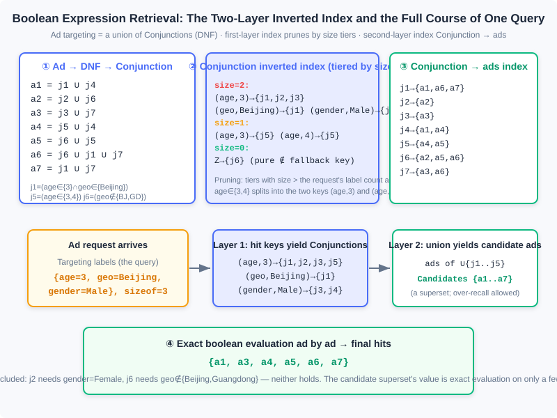
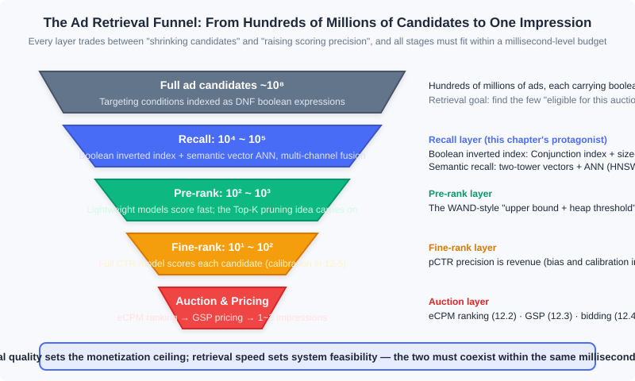

<div style="display: flex; gap: 12px; margin-bottom: 24px; flex-wrap: wrap; align-items: center;">
  <span style="background: #f0f4ff; color: #4A6CF7; padding: 4px 12px; border-radius: 20px; font-size: 0.85em; font-weight: 600; border: 1px solid rgba(74,108,247,0.2);">📖</span>
  <span style="background: #fdf2f8; color: #be185d; padding: 4px 12px; border-radius: 20px; font-size: 0.85em; border: 1px solid rgba(190,24,93,0.2);">⏱️ ~50 min read</span>
  <span style="background: #fef2f2; color: #dc2626; padding: 4px 12px; border-radius: 20px; font-size: 0.85em; font-weight: 600; border: 1px solid rgba(100,100,100,0.15);">🎯 Advanced</span>
</div>

# Ad Retrieval and Semantic Recall

> 📝 **Before You Continue:** This chapter requires reading 12.1 (The Advertising Panorama and Ecosystem) first — where auction advertising sits in the ecosystem — and 12.2 (Billing Models and Core Metrics) — the definition of eCPM, because the retrieval covered here is precisely "the stage before eCPM ranking": without candidates, there is nothing to rank. 12.3 (Auction Mechanisms) helps you understand the downstream endpoint of retrieval; the traffic forecasting in 12.7.2 uses a "reverse index", which is dual to the inverted index in this chapter — rereading it after this chapter will be especially rewarding.

12.2 and 12.3 covered everything that happens "after the candidate ads are on the table": compute eCPM, rank, price by GSP. But where do the candidates on the table come from? In a market with huge numbers of small and mid-size advertisers, every ad request faces **hundreds of millions** of ad candidates — each carrying its own set of targeting conditions — and the system must decide within a few milliseconds "which ads are eligible to participate in this auction". This is the problem **ad retrieval** solves: from all ads, find the few that may take part in this auction. It does not attempt to look at every ad — evaluating targeting expressions one by one over hundreds of millions of candidates would blow any millisecond-level budget instantly — instead it relies on index structures and pruning ideas so that the vast majority of ads are "simply never seen".

This chapter also reaches the contemporary frontier of retrieval technology: when targeting evolves from "boolean combinations of labels" to "semantic vector representations", the retrieval problem changes from "boolean expression matching" to "approximate nearest neighbor search (ANN)", and the toolbox switches to vector indexes. Interestingly, both families of techniques coexist in real systems today — **multi-channel recall** is precisely their ensemble.

After reading this chapter, you will be able to:

- Explain the two essential differences between ad retrieval and search-engine retrieval: boolean-expression documents and extremely long queries
- Decompose ad targeting conditions into the three-level structure DNF → Conjunction → Assignment, and describe how the two-layer inverted index and size-based tiered pruning work
- Describe how the WAND algorithm achieves Top-K pruning during retrieval using "upper bounds + a heap threshold"
- Explain how DSSM/two-tower models turn retrieval into nearest neighbor search in a vector space, and the intuitions behind the three families of ANN schemes: LSH, vector quantization, and graph indexes
- See the full retrieval funnel: recall → pre-ranking → fine-ranking → auction, and complete 5 tiered practice problems

---

## 12.9.0 Why Retrieval Is Special

Start with a numerical comparison. A search engine faces a document corpus of tens of billions of web pages, with queries of 1–4 keywords; an ad system faces an ad corpus that is also at the hundreds-of-millions level, but each request leaves **only a few milliseconds for retrieval** — because the same millisecond budget must also accommodate CTR estimation, ranking, pricing, logging, and a series of other stages. What is more troublesome is that both the "documents" and the "queries" of ad retrieval look nothing like the search engine's versions; the book points out two essential differences:

**Difference one: an ad document is not a bag of words, it is a boolean expression.** Under the audience-targeting selling model, an ad's targeting conditions look like "(age ∈ {25–35} AND geo ∈ {Beijing}) OR (geo ∉ {Beijing, Guangdong})" — a **boolean expression** connected by AND/OR/NOT, not a set of keywords. A search engine's inverted index answers "which documents contain these words"; ad retrieval must answer "which ads' targeting conditions are satisfied by this set of labels". The latter's evaluation structure is far more complex, and it leaves room for targeted optimization.

**Difference two: the query can be extremely long.** A search engine's query comes from user input and is naturally short; an ad retrieval query, however, may consist of hundreds of labels — in contextual targeting scenarios, the keywords extracted from a page's content alone number in the tens, plus the user's interest labels. Imagine typing 100 keywords into a search box at once: combining with AND, almost no document contains all of them; combining with OR, a flood of poorly relevant candidates comes back. Both extremes are unusable, which motivates the relevance retrieval technique at the end of 12.9.3.

### 🧠 Mental Model: Screening Resumes for a Mass Hiring Drive

> Think of ad retrieval as a large-scale hiring process. The full ad corpus is the resume pool: every resume states hard requirements — "must know Python and have 5 years of experience, or: hold a PhD and not be in Beijing" — a boolean expression. The applicants (ad requests) arrive carrying their own labels. The first resume-screening pass must never read each resume carefully; instead, use an index to quickly locate "the few resumes whose conditions might be satisfied" (boolean retrieval). For particularly vaguely described positions (extremely long queries), estimate a score by "degree of match" and first eliminate the clearly hopeless ones (WAND pruning). There is also a hiring approach that writes no hard requirements at all: turn both the job description and the resumes into vectors, and recommend whichever "feel similar" (semantic recall). Only after these three screening rounds does the real interview begin (eCPM ranking and the auction).

These two differences mean ad retrieval cannot copy the search engine's solution; it must develop its own technical system on the shared foundation of the inverted index. Below, we first spend minimal space reviewing retrieval's downstream — the pricing algorithms — to clarify "who retrieval serves", then enter the three core techniques: query expansion (unique to search ads), boolean expression retrieval, and semantic recall (the general foundations).

---

## 12.9.1 A Pricing Review: Whom Retrieval Serves

The complete decision chain of auction advertising is: **retrieve candidates → estimate each candidate's eCPM → rank by eCPM → price the winners**. The last three steps were covered thoroughly in 12.2 (the definition and decomposition of eCPM) and 12.3 (GSP pricing and the market reserve price); here a single sentence pins them in place: for CPC bidding, eCPM decomposes as below, ranking proceeds in descending eCPM, and pricing charges the winner the next ad's eCPM divided by its own click-through rate (GSP), floored by the market reserve price (MRP):

$$r(a, u, c) = \mu(a, u, c) \cdot \nu(a, u)$$

where the click-through rate $\mu$ is a function of ad, user, and context, and the click value $\nu$ in the CPC case is simply the advertiser's bid and needs no estimation (in the CPS case the click value must also be estimated; see 12.2). When multiple billing models coexist, each computes its own eCPM and they are ranked together: a CPM ad's eCPM is the bid itself, CPC is the estimated click-through rate times the bid, and CPS is the click-through rate times the estimated click value.

For this chapter, the meaning of this formula chain is to draw the boundary: **pricing is downstream of retrieval**. Retrieval determines "which ads get onto the field", while pricing and ranking determine "who wins". If too few tickets to the field are issued, no matter how refined the auction is, nobody bids and monetization suffers; if too many are issued, the compute and relevance of the ranking stage are dragged down. The entire goal of retrieval technology is to issue, within a few milliseconds, exactly that batch of tickets — "neither too many nor too few, all with genuine winning potential".

---

## 12.9.2 Search Ads: Query Expansion and Ad Placement

Search advertising is the earliest and most important product form of auction advertising, and its retrieval has a distinctive trait: **extremely strong context, limited user signals**. The user's query is the entire context for the decision, and the role of user labels is greatly restricted — search ad retrieval generally ignores the user $u$, and offline audience targeting can essentially be omitted. But the query itself is extremely fine-grained, so how to expand a short query into a set of keywords eligible for bidding becomes the core technique unique to search ads.

**Query expansion** benefits both sides of the market: the demand side (advertisers) gains more traffic through it, and the supply side (the platform) monetizes more traffic and intensifies competition through it. It is mainly used for broad matching; the book gives three main approaches:

1. **Recommendation-based methods.** Treat the queries within one user session as a set of activities with the same goal, and run collaborative filtering on the "session × query" interaction-strength matrix — when a user searches a term, the corresponding matrix cell records an interaction value. This matrix is extremely sparse, and the recommendation algorithm's task (from memory-based non-parametric methods to parameterized methods via matrix dimensionality reduction) is to predictively fill unknown cells using known ones; after smoothing, comparing the similarity of the vectors corresponding to two keywords becomes far more robust. A detail worth savoring: **in the recommendation problem, unobserved interaction cells are "unknown", whereas in a document topic model, words absent from a document are "zero"** — two seemingly similar problems make completely different semantic assumptions about missing values.
2. **Topic-model-based methods.** Instead of search logs, use topic models trained on general documents: each word corresponds to a topic vector, and expansion is done by the similarity of topic vectors. This captures **semantic** relevance, not **user-intent** relevance, so the effect is somewhat worse; it suits as a supplement when search behavior data is insufficient.
3. **Historical-performance-based methods.** Directly mine the ad's historical eCPM data for "which related queries monetize well": if historical data shows certain keywords yield higher eCPM for certain advertisers, record these query groups, and later when another advertiser picks one of those terms, the well-performing queries are automatically expanded. Its results often coincide with the first two methods, but because it **directly uses the optimization objective (eCPM) to guide expansion**, it often drives revenue best and is an extremely important complement.

Query expansion has a clear boundary of benefit: **over-generalizing search queries harms relevance significantly** — this is exactly why search ads do not introduce short-term user labels at the retrieval stage; short-term signals fit better in the ranking stage, weighting the results users are more inclined to choose.

**Ad placement** is another decision in search ads with room for personalization: deciding how many ads the North zone (above the main results) and the East zone (right column) of a search results page each carry. The constraint is the system's **upper bound $C$ on the average number of North-zone ads** over a period (user experience), and the objective is overall revenue, formalized as:

$$\max \sum_i \big(r(N_1, u_i, c_i) + \cdots + r(N_{n_i}, u_i, c_i)\big) \quad \mathrm{s.t.} \quad \sum_i n_i \le C$$

where $n_i$ is the number of North-zone ads in the $i$-th impression, and $N_s$, $E_s$ denote the $s$-th position of the North and East zones respectively — note that $r$ now carries a position parameter, while the ranking stage simply treats everything as $N_1$ (the top position). The clever part of this problem is personalization: users differ greatly in their tolerance for ads (even in North America, a market with relatively well-educated users, at least thirty to forty percent of users cannot fully distinguish search results from ads), so one can use the ratio of that user's historical average click-through rate on North-zone ads to the average across all users, $\mu(u_i)/\mu$, to adjust the revenue term, significantly raising overall revenue under the "same average ad count" constraint. The metrics governing North-zone admission — MRP, relevance, quality score — all implicitly influence this problem's solution. The objective is not differentiable in form and has few tunable parameters, so engineering practice solves it with direct search methods such as the downhill simplex method.

> **Modern note** North/East zones are layout concepts from the PC search era. After mobile search became fully feed-based, "how many ads in the North zone" evolved into the decision of "how to mix ad density and native styles" — the framework of constrained optimization + personalized revenue adjustment is unchanged; what changed is the form of the decision variables.

---

## 12.9.3 Boolean Expression Retrieval: Two-Layer Indexes and WAND Pruning

Now we reach the core of this chapter. Under the audience-targeting selling model, an ad document is a **Disjunctive Normal Form (DNF)** of targeting conditions — a union of several conjunctions. Understanding the algorithm takes only three concepts, top-down:

| Concept | Meaning | Example |
|------|------|------|
| **DNF** | An ad's complete targeting conditions: a union of conjunctions | $a_1 = j_1 \cup j_4$ |
| **Conjunction** | An intersection of assignment sets; if it is hit, that branch holds | $j_1 = (\mathrm{age} \in \{3\} \cap \mathrm{geo} \in \{\text{Beijing}\})$ |
| **Assignment** | A minimal constraint on one label: belonging or not belonging to some value set | $\mathrm{age} \in \{3\}$, $\mathrm{geo} \notin \{\text{Guangdong}\}$ |

The whole retrieval algorithm rests on **two key properties**. First: when a request's labels satisfy some Conjunction, they necessarily satisfy every ad containing that Conjunction — so we only need to build an inverted index over Conjunctions, plus one auxiliary "Conjunction → ads" index layer, rather than evaluating each ad's full DNF. Second: let $\mathrm{sizeof}(query)$ be the number of targeting labels a request carries and $\mathrm{sizeof}(\mathrm{Conjunction})$ the number of assignments containing "∈" within it; when $\mathrm{sizeof}(query) < \mathrm{sizeof}(\mathrm{Conjunction})$, that Conjunction is **necessarily unsatisfied** — the request cannot even gather the number of labels it demands. This property tiers the index by size, letting queries skip whole tiers; it is the most powerful pruning.



The figure fully reconstructs the book's classic example: 7 ads $a_1$–$a_7$ decompose into 7 Conjunctions ($j_1$–$j_7$); the first index layer splits assignments like $\mathrm{age} \in \{3,4\}$ **into multiple keys** ($( \mathrm{age},3 )$, $( \mathrm{age},4 )$); the $\notin$ operator does not enter keys and lives only on the concrete elements of posting lists; pure-$\notin$ Conjunctions of size=0 hang on a special key $Z$, guaranteeing every assignment set appears in at least one posting list. When a request arrives: keys are looked up tier by tier by size to obtain the candidate Conjunction set, the second index layer takes the union to produce a **candidate ad superset**, and finally exact boolean evaluation is done only over this superset, ad by ad. The candidate superset is allowed to "over-recall" — the clearly unsatisfied $a_2$ is recalled too — the cost is merely one exact evaluation on a few ads, in exchange for the guarantee that the retrieval stage never misses anything.

> **Analysis:** The complexity accounting of the two-layer index is clear. Suppose a request carries $k$ labels and the average posting list length of hit keys is $L$; the candidate set is roughly $O(kL)$, far smaller than the total ad count $|A|$; size tiering prunes entire tiers where "the request lacks labels", and in real engineering usually most tiers can be skipped. The cost is index size: each Conjunction is split by its assignments into keys — space traded for an order-of-magnitude drop in query time, the most classic space-time trade in retrieval systems.

### Relevance Retrieval and WAND

The boolean index solves "targeting-condition matching", but the second problem from the opening remains: in contextual targeting, a request may carry dozens or hundreds of keywords. Boolean logic then faces a dilemma — AND matches nothing, OR recalls heaps of junk. The fix is to change the objective: at the retrieval stage, stop asking "does the word appear" and ask instead "is the **similarity** between query and document high enough" — this is **relevance retrieval**.

The approach is to introduce an evaluation function at the retrieval stage and use its result to decide which candidates to return. The function has two requirements: **soundness** (approximating the evaluation function used for final ranking) and **efficiency** (it must be computable quickly at retrieval, otherwise there is no difference from exactly scoring every candidate). Research shows: when the evaluation function is **linear** (with labels/keywords as variables) and all weights are positive, such a fast algorithm can be constructed. Let the linear evaluation function be:

$$\mathrm{score}(a, c) = \sum_{t \in F(a) \cap F(c)} \alpha_t v_t(a)$$

where $F(a)$ and $F(c)$ are the sets of nonzero features in the ad document and the context respectively, $\alpha_t$ is the query-side weight of feature $t$ (e.g., TF-IDF, constant within one query), and $v_t(a)$ is feature $t$'s contribution on ad $a$. The cosine similarity of VSM fails the linearity requirement due to its normalization denominator, but with normalization removed it can serve as an approximate pre-evaluation at the retrieval stage.

The key to acceleration is **two upper bounds**: first, $u_t$, the upper bound of keyword $t$'s contribution across all documents (precomputed at index time); second, summing the $u_t$ of several query keywords yields $U$, an upper bound on any document's score for that query. Combined with a **min-heap** maintaining the current Top-$K$ results (the heap top holds the $K$-th score, i.e., the pruning threshold), we get the **WAND (weight AND) algorithm** proposed by Broder et al. — a highly practical fast retrieval scheme for contextual targeting ads and content recommendation products. Each iteration has two steps:

1. Sort the keywords' posting lists in ascending order of their current minimum document ID;
2. Visit the keywords in turn, accumulating $u_t$ into $U$: if $U$ has not exceeded the heap-top threshold by the time all lists are scanned, the current document cannot enter the Top-$K$ even by upper-bound estimate — **skip it directly**; only if at some point $U$ exceeds the heap top and the first and last keywords' posting lists point to the same document is that document **exactly scored**, entering the heap if its score beats the heap top.

> **Analysis:** WAND's power comes from the positive feedback of "exclude with upper bounds + raise the bar with the heap": the better the result set, the higher the heap-top threshold, and the fewer documents the upper bound lets through. It never does full exact scoring; it exactly scores only documents "with a chance of entering the Top-$K$", and in engineering practice it can skip the vast majority of candidates. Its applicability boundary is also clear: the evaluation function must be linear with non-negative weights — fortunately ranking models have long favored generalized linear models, so this framework covers more than it appears. For nonlinear deep ranking models, the same "rough upper bound + exact scoring" divide-and-conquer idea continues in the pre-ranking layer (see 12.9.5).

---

## 12.9.4 Semantic Recall and Approximate Nearest Neighbor Search

Boolean retrieval and WAND solve "matching at the label level", but they share a blind spot: when a concept is **worded differently** in the query and the ad — the user searches "laptop cooling" while an ad says "silent computer fan" — keyword matching fails. Topic models (such as LDA) have some generalization ability, but unsupervised training struggles to address specific business problems in a targeted way. The real turning point came from word embeddings: **supervised, end-to-end learning of task-relevant semantic representations from raw data**, dramatically improving the expressiveness and accuracy of semantics — this is the watershed where ad retrieval technology took its contemporary form.

### DSSM: Using Clicks as the Teacher

In advertising, search, and recommendation, the readily available weak supervision signal is the **click**: given context $c$ (the query in search, mainly content in contextual targeting), if $p(h=1 \mid a_1, c) > p(h=1 \mid a_2, c)$ ($a_1$ was clicked and $a_2$ was not), then $a_1$ is deemed more relevant to $c$. The **DSSM (Deep Semantic Similarity Model)** is a deep semantic model trained on exactly this signal; both words in its name carry meaning: **semantic** — map $c$ and $a$ from their respective raw spaces into a shared hidden semantic space, where relevance is measured; **deep** — this mapping is learned by a multi-layer neural network. Its structure has three steps:

1. The input layer embeds the words of $c$ and $a$, processing them into a fixed-length vector $x$ using BoW (summed word bags, ignoring order, lowest complexity) or CNN/RNN (when word order and local features must be captured);
2. Through multi-layer nonlinear transformations, project into the semantic space to obtain the semantic vectors $y_c$ and $y_a$; relevance is measured by cosine similarity (multiplied by a tuning factor $\gamma$ controlling the dynamic range);
3. Model information retrieval as multi-class classification: the positive example $a^{+}$ is the clicked document, negatives are randomly sampled unclicked documents; maximize the posterior probability of clicking $a^{+}$ given $c$ (softmax form); there is also a version simplifying the objective to **pairwise ranking** — take one positive-negative pair and maximize the difference of their relevance scores.

After training, every query and document has a semantic vector. Retrieving the most relevant documents becomes finding nearest neighbors in a vector space.

### The Prototype of the Two-Tower Model: Vectorizing the User

In the recommendation setting, DSSM's idea with different inputs is the prototype of the **two-tower model** (the book uses YouTube personalized recommendation as the example; it applies equally to audience-targeted ads). The difference is in the input layer: DSSM's input is text, while here the input is the **user's historical behavior** — represent each behavior such as searches and ad clicks as a dense semantic vector from its sparse features, average the variable-length behavior sequence to get the embedding portion, concatenate profile features like gender, age, and region into a wider fixed-length vector, reduce dimensionality layer by layer, and output a user vector $v_u$ of the same dimension as the ad vector, trained with the softmax multi-class loss. Two engineering details have far-reaching consequences:

- **Negative samples must not be only "impressed but not clicked".** Real online unclicked data is often somewhat correlated with the query; using it alone as negatives teaches the model the wrong lesson that "relevance does not matter", collapsing recall quality. YouTube used candidate sampling to sample negatives for each positive, fixing the per-user sample count to keep the distribution from being skewed by high-frequency users.
- **Build the vector index offline, query the index online.** When retrieval runs online, computing distances between the user vector and every ad vector one by one is impossible — which brings up the engineering problem of nearest neighbor search.

### ANN: From LSH to Graph Indexes

First, why brute force fails: on a dataset with 200-dimensional semantic vectors and 1 million candidate documents, a full scan computing distances takes tens of milliseconds — completely unacceptable in high-concurrency online advertising. Hence **Approximate Nearest Neighbor (ANN)**: prune the candidates, accept a little recall loss, and gain millisecond-level retrieval speed. The book presents three canonical families, all built on "divide and conquer" — cut the big space into small regions and search exactly only within a few of them:

**1. Hashing (LSH).** Locality-sensitive hashing's intuition fits in one sentence: **points closer in the original space are more likely to collide into the same bucket after hashing**. Take random projection for cosine distance as an example: generate a random hyperplane and take the sign of the projection $h(x) = \mathrm{sign}(x \cdot p)$ as the hash value; when two vectors form an angle $\theta$, the same-bucket probability is:

$$p(h(x_1) = h(x_2)) = 1 - \frac{\theta}{\pi}$$

The smaller the angle, the higher the same-bucket probability — exactly satisfying the definition of locality sensitivity. A single hyperplane is too coarse; practice uses $m$ hyperplanes combined with an AND operation, concatenating an $m$-bit signature as the bucket number. When recall falls short there are two paths: **LSH forest** (space for recall — take the union of $n$ independent signature groups, memory grows $n$-fold) and **multi-probe** (time for recall — flip $d$ bits of the signature to form new signatures for second-round queries; at $d \ge 2$ complexity rises sharply and precision is hard to control).

**2. Vector quantization (VQ).** Quantize the whole vector into one of $K$ discrete codewords, dividing and conquering via "compression". Classic K-means is the simplest vector quantization: clustering produces $K$ centroids, and queries find the nearest centroid. Two practical refinements: **product quantization PQ** — split the vector into $m$ equal segments and run K-means on each, balancing memory and precision in high dimensions (Facebook's open-source faiss library provides an efficient implementation); **hierarchical K-means tree HKM** — borrowing from KD trees, run $K=2$ clustering at each node and partition recursively; queries walk from root to leaf, dropping complexity from $O(n)$ to $O(\log n)$, with recall smoothly widened by "also checking sibling leaves".

**3. Graph-based algorithms (NSW).** Tree structures fix the search path and only go top-down; graphs are far more flexible. The **Navigable Small World (NSW)** exploits the property of small-world networks: a few long-range connections make paths between most nodes very short. Build the index by inserting nodes one by one and connecting each to its current near neighbors (connections formed by early insertions naturally become long-range links); at query time, start from any node (multiple entries in parallel) and greedily move toward neighbors closer to the query until the Top-$K$ converges.

> **💡 Modern note: what the engineering mainstream looks like in 2026**
> Viewed on a timeline, the book's three families are precisely the evolution of index technology; in today's industrial practice: **LSH has largely exited the mainstream**, but its intuition "near points collide more easily" remains the conceptual origin of all ANN; **the graph index HNSW** (the hierarchical version of NSW — sparse upper layers for fast navigation, dense base layer for precision) has become the default choice in most scenarios thanks to high recall + high concurrency; **IVF-PQ** (first coarse-cluster into buckets with K-means (IVF), then compress within buckets with product quantization (PQ)) rivals HNSW in large-scale, memory-constrained scenarios, and faiss provides both. On the recall side, things evolved into **multi-channel recall**: semantic vector recall, collaborative/behavioral recall, popularity fallback, and other channels run in parallel each taking their Top-K, merged and deduplicated before ranking — the era of a single index carrying the whole world is over. And DSSM/the YouTube model evolved into today's standard **two-tower** training recipe: the user tower and item tower independently produce vectors, in-batch negatives serve as each other's negatives, and online/offline are deployed decoupled.

> **Analysis:** The trade-offs among the three ANN families condense to: LSH is the simplest to implement with controllable memory, but its recall ceiling is low; quantization methods (PQ/HKM) are the most memory-frugal and suit enormous candidate pools, but suffer quantization precision loss; graph methods (NSW/HNSW) deliver the best recall and query latency, at the cost of larger index memory and expensive graph construction. The shared prerequisite is the quality of two-tower-style representation learning — **if the vectors themselves are bad, no index can save them**; this also explains why the competition in semantic recall ultimately returned to the design of samples and loss functions.

---

## 12.9.5 Closing the Loop: The Retrieval Funnel and the Full System

Placing this chapter's technologies back into the system panorama yields a **retrieval funnel**: hundreds of millions of candidates pass through the four layers of recall, pre-ranking, fine-ranking, and auction, narrowing step by step until only 1–3 ads are actually shown.



Three details in this figure deserve a stop. **First, every layer is a trade between "shrinking candidates" and "raising scoring precision"**: the recall layer uses index structures (boolean inverted indexes, ANN vector indexes) to go from hundreds of millions to tens of thousands, at the cost of extremely coarse scoring (only "does it match" or "do the vectors look alike"); pre-ranking scores tens of thousands of candidates with lightweight models, engineering the WAND-style "rough upper bound + Top-K retention" idea; only fine-ranking applies the full CTR model to hundreds of candidates (its precision and calibration are covered in 12.5); finally the auction layer ranks by eCPM and prices by GSP. **Second, upstream can never be compensated by downstream precision** — an ad missed by the recall layer is invisible no matter how accurate fine-ranking is, so engineering prefers to over-recall (the "candidate superset" philosophy of the boolean index in the figure) and never lightly narrows the recall surface. **Third, multi-channel recall is the norm**: boolean targeting recall and semantic vector recall each produce one candidate stream in parallel, merged and deduplicated before flowing uniformly downstream — the two technologies of 12.9.3 and 12.9.4 are not substitutes but two intake pipes of the same funnel.

Compare this with recommender systems (the main line of the first half of this book): this funnel is nearly isomorphic to "recall → pre-ranking → fine-ranking → re-ranking" — ad systems and recommender systems share all the engineering wisdom at the retrieval layer, differing only at the funnel's end: recommendation optimizes user value, while advertising must additionally pass through a layer of **bidding and mechanism design** (the smart bidding of 12.4 decides how much advertisers are willing to pay for which candidates; the GSP of 12.3 decides how much is actually charged). Retrieval supplies the admission tickets for all of it.

---

## ⚠️ Common Mistakes in 12.9

| # | Mistake | Example | Why It's Wrong | Fix |
|---|---------|---------|---------------|-----|
| 1 | Evaluating the boolean expression ad by ad | Iterating over hundreds of millions of ads on request arrival, judging each DNF one by one | The retrieval budget is only a few milliseconds; full evaluation necessarily times out — the two-layer index exists precisely for this | Build an inverted index over Conjunctions + a Conj→AD auxiliary index, and evaluate exactly only over the candidate superset |
| 2 | Ignoring size tier pruning, or counting $\notin$ into size | A request carrying only 2 labels queries all tiers with size=2 and above; using $\mathrm{geo} \notin \{\text{Guangdong}\}$ as an index key | When $\mathrm{sizeof}(query) < \mathrm{sizeof}(\mathrm{Conjunction})$ it can never be satisfied, so the whole tier can be skipped; $\notin$ does not enter keys and lives only on posting-list elements | size = the number of assignments containing "∈"; build the index tiered by size and prune tier by tier at query time |
| 3 | Moving a nonlinear fine-ranking function directly into the retrieval stage for pruning | Using a deep CTR model's scores as WAND upper bounds at retrieval | WAND's fast exclusion relies on "linear + non-negative weights" for the upper bounds to accumulate; nonlinear functions admit no accumulable $u_t$ | Use linear or generalized linear approximations at retrieval/pre-ranking; leave deep models to fine-ranking |
| 4 | After launching semantic recall, brute-force cosine over the whole corpus | Taking the dot product of the user vector with 1 million ad vectors per request | A full scan at 200 dimensions × millions takes tens of milliseconds, unacceptable under high concurrency | Deploy an ANN index (HNSW/IVF-PQ), accepting approximation in exchange for millisecond latency |
| 5 | Treating LSH/HKM as the contemporary mainstream | A new system picks LSH forest outright | LSH has a low recall ceiling and HKM has fixed search paths; engineering has replaced them with graph indexes and IVF-PQ | Modern choices favor HNSW/IVF-PQ; keep LSH for its "near points collide easily" intuition |
| 6 | Query expansion guided only by semantic similarity | A topic model expanding "laptop" to "laptop bags", ignoring monetization differences | Semantic relevance is not intent relevance, let alone high eCPM; over-generalization also harms search ad relevance | Use all three routes: collaborative filtering + topic models as fallback + historical eCPM performance data leading |

---

## Chapter Summary

### 📌 Key Takeaways

| Concept | Key Points | Why It Matters |
|---------|-----------|----------------|
| What makes ad retrieval special | Documents are DNF boolean expressions, not bags of words; queries may consist of hundreds of labels | Determines that ad retrieval cannot copy search-engine solutions and needs dedicated indexes and pruning |
| Boolean expression retrieval | Three-level decomposition DNF → Conjunction → Assignment; two-layer inverted index + size tier pruning; candidate superset + exact evaluation | The bedrock of millisecond retrieval over hundreds of millions of candidates, and one of the most core general technologies of auction advertising |
| WAND | Linear evaluation function + keyword upper bounds $u_t$ + min-heap threshold, exactly scoring only candidates that might enter the Top-K | Practical fast retrieval for extremely long queries (contextual targeting); the "rough upper bound + threshold positive feedback" idea carries into pre-ranking |
| Query expansion | Three routes combined: collaborative filtering (session × query matrix), topic models (semantic supplement), historical eCPM (directly aimed at revenue) | The traffic and revenue lever of search ads; over-generalization harming relevance is a hard boundary |
| Semantic recall | DSSM/two-tower: clicks as weak supervision, end-to-end semantic vectors, retrieval becomes nearest neighbor search | Resolves the generalization blind spot of keyword matching; the foundational form of contemporary recall technology |
| ANN evolution | LSH (intuitive origin) → vector quantization PQ/HKM → graph indexes NSW/HNSW; modern mainstream HNSW/IVF-PQ + multi-channel recall fusion | The engineering foundation of vector retrieval; vector quality matters more fundamentally than index choice |

### ❓ FAQ

**Q1: Boolean retrieval or semantic recall — which do modern systems actually use?**
> Both, and in parallel. An advertiser's targeting conditions must be satisfied exactly (that is the contractual promise), so boolean inverted indexes are irreplaceable; semantic recall covers the "similar intent" traffic boolean logic cannot reach. Each produces one candidate stream, merged and deduplicated before entering ranking — i.e., multi-channel recall. Debating "which replaces which" is a pseudo-problem; the engineering difficulty lies in quotas and merging strategies for the multiple candidate streams.

**Q2: How big is the practical impact of WAND's restriction to non-negative-weight linear functions?**
> Smaller than intuition suggests. Ranking models have long been dominated by generalized linear models (features × weights followed by a nonlinear link), and generalized linear scores can still be decomposed into accumulable linear terms, so the WAND framework applies directly. Even with deep models, linear/lightweight approximations can do Top-K screening at the pre-ranking layer — the divide-and-conquer idea does not depend on the specific model form.

**Q3: What single principle suffices for ANN selection?**
> Vector quality before index choice. The gap between HNSW and IVF-PQ is at the level of engineering constants, while the sample and loss design of two-tower training (negative sampling, in-batch negatives, feature coverage) determines the ceiling of recall quality. A practical starting point for index selection: choose HNSW when memory is plentiful, IVF-PQ when candidates exceed hundreds of millions and memory is constrained, and leave the rest to benchmarks.

### 🔗 Connections to Other Chapters

- **12.2** (Billing Models and Core Metrics): retrieval's downstream endpoint is eCPM ranking, and the eCPM decomposition (pCTR × click value) directly defines "which candidates are eligible for admission"
- **12.3** (Auction Mechanisms): GSP pricing and the market reserve price act on the last layer of the retrieval funnel; retrieval quality determines how fierce the auction is
- **12.4** (Smart Bidding): the bid at the funnel's end decides what advertisers are willing to pay for; budget spend state in turn tightens upstream retrieval quotas
- **12.5** (Bias and Calibration): the calibration quality of fine-ranking pCTR affects eCPM ranking, and thereby the quota decision of "how much retrieval should recall"
- **12.7** (Online Allocation): traffic forecasting's "reverse index" and this chapter's ad retrieval inverted index are duals of each other — documents and queries swap roles, and one indexing technology serves two problems

---

## Practice Problems

Work through all problems in order — they get progressively harder. Each has a complete solution you can reveal after trying it yourself.

---

**Problem 12.9.1 — DNF Decomposition and Hit Evaluation** 🟢 Easy

An ad's targeting conditions are: $a = (\mathrm{age} \in \{3\} \cap \mathrm{geo} \in \{\text{Beijing}\}) \cup (\mathrm{geo} \in \{\text{Guangdong}\} \cap \mathrm{gender} \in \{\text{Male}\})$. Decompose it into a union of Conjunctions, write out each Conjunction's size (the number of assignments containing "∈"), and determine whether the following two requests hit this ad: (1) $\{\mathrm{age}{=}3,\ \mathrm{geo}{=}\text{Beijing},\ \mathrm{gender}{=}\text{Male}\}$; (2) $\{\mathrm{age}{=}4,\ \mathrm{geo}{=}\text{Beijing}\}$.

**Sample Input:** Request (1) $\{\mathrm{age}{=}3, \mathrm{geo}{=}\text{Beijing}, \mathrm{gender}{=}\text{Male}\}$; request (2) $\{\mathrm{age}{=}4, \mathrm{geo}{=}\text{Beijing}\}$
**Sample Output:** Decomposition $a = j_1 \cup j_2$, both Conjunctions have size 2; request (1) hits, request (2) does not
<details>
<summary>💡 Solution (click to reveal)</summary>
**Approach:** Split by "a segment joined by ∩ is one Conjunction, segments joined by ∪ are different Conjunctions", then check the request labels assignment by assignment.

- Decomposition: $j_1 = (\mathrm{age} \in \{3\} \cap \mathrm{geo} \in \{\text{Beijing}\})$, $j_2 = (\mathrm{geo} \in \{\text{Guangdong}\} \cap \mathrm{gender} \in \{\text{Male}\})$. Each contains 2 ∈ assignments, so both have size 2.
- Request (1): $j_1$ needs $\mathrm{age}{=}3$ ✓ and $\mathrm{geo}{=}\text{Beijing}$ ✓, satisfied → hit (in a DNF, one satisfied Conjunction suffices).
- Request (2): $j_1$ needs $\mathrm{age}{=}3$ but the request has $\mathrm{age}{=}4$ ✗; $j_2$ needs $\mathrm{geo}{=}\text{Guangdong}$ but the request has $\mathrm{geo}{=}\text{Beijing}$ ✗ → no hit.
- Verify size pruning along the way: request (2) carries only 2 labels, so the size=2 tier is still queryable ($2 \le 2$); if the ad added one more ∈ assignment making size 3, the entire Conjunction could be excluded without any evaluation.

**Key points:**
- DNF hit condition: at least one Conjunction's assignments are all satisfied
- size counts assignments containing "∈"; $\notin$ is neither counted nor entered into index keys
</details>

---

**Problem 12.9.2 — Simulating the Two-Layer Index Query** 🟡 Medium

Using the 7 ads ($a_1$–$a_7$) and their Conjunction decompositions ($j_1$–$j_7$, where $j_5 = (\mathrm{age} \in \{3,4\})$ and $j_6 = (\mathrm{geo} \notin \{\text{Beijing},\text{Guangdong}\})$) from the figure in 12.9.3. The request is $\{\mathrm{age}{=}3,\ \mathrm{geo}{=}\text{Beijing},\ \mathrm{gender}{=}\text{Male}\}$, size=3. Write out: (1) the candidate Conjunction set after querying all hit keys; (2) the candidate ad superset after taking the union through the second index layer; (3) the final hit list after exact evaluation, stating which ad is excluded and why.

**Sample Input:** Request labels $\{\mathrm{age}{=}3, \mathrm{geo}{=}\text{Beijing}, \mathrm{gender}{=}\text{Male}\}$
**Sample Output:** Candidate Conjunctions $\{j_1, j_2, j_3, j_4, j_5\}$; candidate ads all 7 of $\{a_1, ..., a_7\}$; final hits $\{a_1, a_3, a_4, a_5, a_6, a_7\}$, with $a_2$ excluded
<details>
<summary>💡 Solution (click to reveal)</summary>
**Approach:** Query keys tier by tier → take the union at the second layer → exact evaluation, matching the figure's flow.

- **First-layer key lookup** (all tiers with size ≤ 3 are queryable): size=2 tier, $(\mathrm{age},3) \to \{j_1, j_2, j_3\}$, $(\mathrm{geo},\text{Beijing}) \to \{j_1\}$, $(\mathrm{gender},\text{Male}) \to \{j_3, j_4\}$; size=1 tier, $(\mathrm{age},3) \to \{j_5\}$. Candidate Conjunctions $= \{j_1, j_2, j_3, j_4, j_5\}$. $j_6$ (size=0) sits only under the special key $Z$ and needs exact evaluation.
- **Second-layer union**: $j_1 \to \{a_1, a_6, a_7\}$, $j_2 \to \{a_2\}$, $j_3 \to \{a_3\}$, $j_4 \to \{a_1, a_4\}$, $j_5 \to \{a_4, a_5\}$; the union is $\{a_1, ..., a_7\}$ — the candidate superset covers all ads.
- **Exact evaluation**: $a_1$ ($j_1$ ✓), $a_3$ ($j_3$: age=3 ✓, gender=Male ✓, geo=Beijing ∉{Guangdong} ✓), $a_4$ ($j_5$: age ∈ {3,4} ✓), $a_5$ ($j_5$ ✓), $a_6$ ($j_1$ ✓), $a_7$ ($j_1$ ✓). $a_2$ is excluded: $j_2$ needs gender=Female ✗, and $j_6$ needs geo ∉ {Beijing,Guangdong} but geo=Beijing ✗.

**Key points:**
- The size=1 $j_5$ is queried too — size pruning only skips tiers "with size greater than the label count", never small sizes
- The candidate superset may contain ads that ultimately do not hit (such as $a_2$); exact evaluation happens only on the superset — this is precisely the source of efficiency
</details>

---

**Problem 12.9.3 — Walking Through WAND Pruning** 🟡 Medium

A contextual targeting query contains 3 keywords, whose posting lists currently head at document IDs: $t_1 \to \mathrm{doc}\ 5$, $t_2 \to \mathrm{doc}\ 5$, $t_3 \to \mathrm{doc}\ 9$. The keywords' contribution upper bounds are $u_1 = 2$, $u_2 = 3$, $u_3 = 4$. The current min-heap is already full with $K$ results, and the heap-top score (the pruning threshold) is $\theta = 6$. Walk through the two steps of this WAND iteration, determine whether doc 5 gets exactly scored, and state the system's next action.

**Sample Input:** Posting-list heads $\{t_1{:}5,\ t_2{:}5,\ t_3{:}9\}$; upper bounds $\{2, 3, 4\}$; threshold $\theta = 6$
**Sample Output:** The pivot stops at $t_3$ (accumulated upper bound $2+3+4 = 9 > 6$); the list heads of $t_1, t_2$ (doc 5) and the pivot list head (doc 9) disagree → doc 5 is not scored; advance some earlier list to doc 9 and start the next round
<details>
<summary>💡 Solution (click to reveal)</summary>
**Approach:** Step one sorts lists by head docID ascending; step two accumulates upper bounds to find the pivot, then compares the first and last list heads.

- After sorting, the order is $t_1(5), t_2(5), t_3(9)$. Accumulating upper bounds: $U = u_1 = 2 < 6$; $U = 2+3 = 5 < 6$; $U = 5+4 = 9 > 6$ → the pivot is $t_3$.
- Pivot check: the head docIDs of $t_1$ and $t_3$ are 5 and 9, **not aligned** → the current document (doc 5), even with full upper bounds, only sits on the two lists $t_1, t_2$, so its true score upper bound is $u_1 + u_2 = 5 < 6$ and it cannot enter the heap → **doc 5 is pruned and not exactly scored**.
- Next step: pick one of the earlier lists (say $t_2$) and skipto doc 9, returning to step 1; now $t_2, t_3$ heads align and the accumulation is $3+4 = 7 > 6$; if $t_1$'s head also reaches 9, doc 9 deserves exact scoring.

**Key points:**
- What accumulates is the "upper bound", never the true score — if the upper bound falls short, never do exact scoring; this is the entire source of WAND's compute savings
- The heap-top threshold rises as the result set improves, making pruning ever harsher: the positive feedback is the deeper reason for WAND's efficiency
</details>

---

**Problem 12.9.4 — The Recall Accounting of Random-Projection LSH** 🔴 Hard

Use random projection for cosine LSH. The angle between two vectors is $\theta = 60°$. (1) With a single hyperplane, what is the probability the two vectors land in the same bucket? (2) With $m = 8$ hyperplanes forming an 8-bit signature (AND operation), what does the same-bucket probability become? (3) To boost recall, switch to LSH forest: $n = 10$ independent signature groups take the union; what is the recall probability of "at least one group collides counts as a neighbor"? (4) With multi-probe instead, how many new signatures must a second-round query generate at $d = 1$ and at $d = 2$? Use this to explain the cost difference between the two recall-boosting schemes.

**Sample Input:** $\theta = 60°$, $m = 8$, $n = 10$
**Sample Output:** (1) $2/3 \approx 0.667$; (2) $\approx 0.039$; (3) $\approx 0.328$; (4) 8 at $d{=}1$, 28 at $d{=}2$
<details>
<summary>💡 Solution (click to reveal)</summary>
**Approach:** Substitute layer by layer into $p = 1 - \theta/\pi$, the signature probability $p^m$, the union recall $1 - (1 - p^m)^n$, and the binomial $\binom{m}{d}$.

- (1) $p = 1 - \frac{\pi/3}{\pi} = \frac{2}{3} \approx 0.667$.
- (2) All 8 signature bits must match to share a bucket: $p^8 = (2/3)^8 = 256/6561 \approx 0.039$. The AND operation makes buckets tiny and queries extremely fast, but a single signature's recall collapses.
- (3) At least one of $n$ signature groups collides: $1 - (1 - 0.039)^{10} \approx 1 - 0.672 = 0.328$. Recall rises from 3.9% to 32.8%, at the cost of 10× index memory.
- (4) The number of new signatures flipping $d$ bits is $\binom{m}{d}$: at $d=1$, $\binom{8}{1} = 8$; at $d=2$, $\binom{8}{2} = 28$. Multi-probe adds no memory but launches multiple second-round retrievals per query; at $d \ge 2$ the query count balloons quickly and the precision-recall trade-off is hard to control smoothly.

**Key points:**
- All three of LSH's recall-boosting means fundamentally trade something else for recall: forest trades memory, multi-probe trades query time, larger $m$ trades bucket precision
- The numbers expose LSH's limits — 90%+ recall would require astronomically many signature groups, which is one reason graph indexes replaced it
</details>

---

**Problem 12.9.5 — Implementing the Two-Layer Boolean Inverted Index** 🏆 Challenge

Implement the book example's full retrieval in Python: given the 7 Conjunctions ($j_1$–$j_7$) and the decomposition into 7 ads ($a_1$–$a_7$), implement `build_index()` (a size-tiered Conjunction inverted index + a Conj→AD auxiliary index, including the size=0 special key Z) and `retrieve(query)` (size pruning + key lookup + exact evaluation), and verify the output with four requests.

**Sample Input:** Requests $\{\mathrm{age}{:}3, \mathrm{geo}{:}\text{Beijing}, \mathrm{gender}{:}\text{Male}\}$, plus $\{\mathrm{age}{:}4, \mathrm{geo}{:}\text{Beijing}\}$, $\{\mathrm{age}{:}3, \mathrm{geo}{:}\text{Shanghai}, \mathrm{gender}{:}\text{Female}\}$, $\{\mathrm{gender}{:}\text{Male}, \mathrm{geo}{:}\text{Guangdong}\}$
**Sample Output:** `['a1','a3','a4','a5','a6','a7']`; `['a4','a5']`; `['a2','a4','a5','a6']`; `['a1','a4']`
<details>
<summary>💡 Solution (click to reveal)</summary>
**Approach:** Model each assignment as an (attribute, value set, belong) triple; size counts only ∈ assignments; $age \in \{3,4\}$ splits into two index keys; pure-∉ types hang on the special key Z and go through exact evaluation.

```python
# Each assignment: (attribute, value set, belong); belong=True means ∈, False means ∉
CONJUNCTIONS = {
    "j1": [("age", {3}, True), ("geo", {"Beijing"}, True)],
    "j2": [("age", {3}, True), ("gender", {"Female"}, True)],
    "j3": [("age", {3}, True), ("gender", {"Male"}, True), ("geo", {"Guangdong"}, False)],
    "j4": [("gender", {"Male"}, True), ("geo", {"Guangdong"}, True)],
    "j5": [("age", {3, 4}, True)],                       # ← KEY LINE: one ∈ assignment, size=1
    "j6": [("geo", {"Beijing", "Guangdong"}, False)],    # ← KEY LINE: pure ∉ type, size=0
    "j7": [("gender", {"Female"}, True), ("geo", {"Guangdong"}, True)],
}
ADS = {
    "a1": ["j1", "j4"], "a2": ["j2", "j6"], "a3": ["j3", "j7"],
    "a4": ["j5", "j4"], "a5": ["j6", "j5"], "a6": ["j6", "j1", "j7"],
    "a7": ["j1", "j7"],
}

def build_index():
    by_size, conj2ad = {}, {}
    for c, assigns in CONJUNCTIONS.items():
        k = sum(1 for _, _, b in assigns if b)           # size = number of ∈ assignments
        for attr, vals, b in assigns:
            if b:
                for v in vals:                           # age∈{3,4} splits into two keys
                    by_size.setdefault(k, {}).setdefault((attr, v), set()).add(c)
        if k == 0:                                       # pure ∉ types hang on the special key Z
            by_size.setdefault(0, {}).setdefault("Z", set()).add(c)
        for ad, cs in ADS.items():
            if c in cs:
                conj2ad.setdefault(c, []).append(ad)
    return by_size, conj2ad

def holds(assigns, query):
    for attr, vals, b in assigns:
        q = query.get(attr)
        if b and q not in vals:
            return False
        if not b and q in vals:                          # q not in the set means ∉ holds (including missing)
            return False
    return True

def retrieve(query, by_size, conj2ad):
    conjs = set()
    for k, posting in by_size.items():
        if k > len(query):                               # ← KEY LINE: size pruning
            continue
        for key, cs in posting.items():
            if not isinstance(key, tuple):               # skip the special key Z
                continue
            attr, v = key
            if query.get(attr) == v:
                conjs |= cs
    for c in by_size.get(0, {}).get("Z", set()):         # size=0 goes through exact evaluation
        if holds(CONJUNCTIONS[c], query):
            conjs.add(c)
    return sorted({ad for c in conjs
                   if holds(CONJUNCTIONS[c], query)
                   for ad in conj2ad[c]})

idx = build_index()
print(retrieve({"age": 3, "geo": "Beijing", "gender": "Male"}, *idx))
# ['a1', 'a3', 'a4', 'a5', 'a6', 'a7']
print(retrieve({"age": 4, "geo": "Beijing"}, *idx))
# ['a4', 'a5']
print(retrieve({"age": 3, "geo": "Shanghai", "gender": "Female"}, *idx))
# ['a2', 'a4', 'a5', 'a6']
print(retrieve({"gender": "Male", "geo": "Guangdong"}, *idx))
# ['a1', 'a4']
```

Note the third request: $j_6$ (geo ∉ {Beijing,Guangdong}, satisfied by geo=Shanghai) enters the candidates via exact evaluation under the Z key, dragging in the $j_6$ branches of $a_2$ and $a_6$ — this is exactly why the size=0 tier cannot rely on key lookup and must be evaluated exactly. The fourth request verifies the $\notin$ counterexample: $j_3$ is excluded by exact evaluation because geo=Guangdong ∈ {Guangdong}, even though both its $(\mathrm{age},3)$ and $(\mathrm{gender},\text{Male})$ keys were hit (the request carries no age label; j3 entered the candidates via the gender key but was still blocked by the ∉ condition).
**Key points:**
- Size pruning sits at `k > len(query)`: when the request lacks labels, entire tiers are skipped
- $\notin$ exists only on posting-list elements (simplified here into the exact-evaluation stage) and never enters index keys
- Candidate superset → exact evaluation is the retrieval philosophy of "over-recall allowed, under-recall forbidden"
</details>
