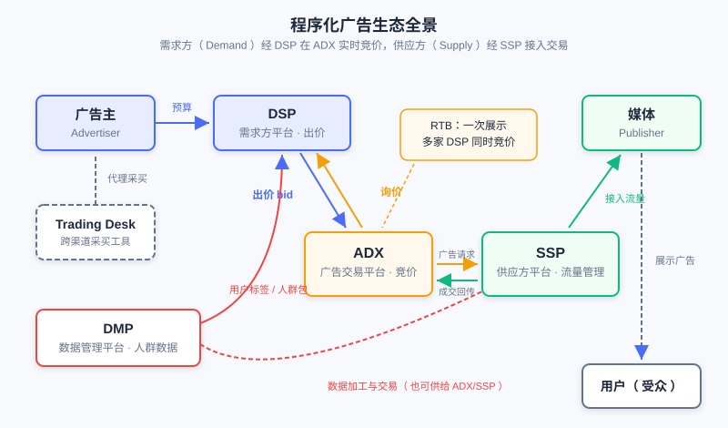

  📖
  ⏱️ ~45 min read
  🎯 Intermediate

# The Computational Advertising Panorama and Ecosystem

> 📝 **Before You Continue:** Please read first [1.1](./../part1-introduction/recommender-system-basics.md) "What Is a Recommender System" — this chapter approaches advertising from the perspective of a recommender system engineer. The retrieval, ranking, and CTR models you already know all have counterparts in advertising, but with an added layer of economic constraints that recommender systems do not have.

You already know how a recommender system picks the most suitable content for a user out of a massive item pool: retrieval narrows the candidate set, ranking estimates preference, and re-ranking balances the experience. Now change the question — what happens to the system when "the recommended item" is no longer the platform's own content, but an ad paid for by an advertiser?

The answer goes far beyond "swap items for ads". Advertising introduces a third stakeholder (the advertiser) and brings in **auctions**, a mechanism that does not exist in recommender systems; the way ads are traded has evolved all the way from offline direct contracts to millisecond-scale real-time bidding; and ad targeting technology shares its roots with retrieval technology yet is not identical to it. This chapter gives you a bird's-eye view of the **Computational Advertising** panorama: what it is, its fundamental problem, how its ecosystem operates, and how its technology progressed step by step toward programmatic trading. This content is the map for the chapters that follow (CTR estimation, auction mechanisms, mechanism design).

After reading this chapter, you will be able to:

- State the three elements of the advertising definition and the six stages of the ad effectiveness model, and distinguish brand advertising from direct-response advertising
- State the fundamental problem of computational advertising (maximizing ROI over the $User \times Context \times Ad$ triple match), and explain the three essential differences between advertising and recommender systems
- Name the four factors of the advertising system value formula, and what problem each generation of the 1.0 → 3.0 delivery model evolution solved
- Describe the respective responsibilities of ADX / DSP / SSP / DMP / Trading Desk in the programmatic ecosystem, and the two-phase RTB flow
- Give examples of the three stages of targeting technology and the main thread of ad format evolution, and explain why feed ads are a positive example of balancing effectiveness and user experience
- Complete 5 graded practice problems, testing your understanding of the advertising ecosystem panorama

---

## 12.1.0 What Is Advertising: Definition, Classification, and the Effectiveness Model

Let's start with the definition. Advertising is a **non-personal**, usually paid, organized, comprehensive, and persuasive communication of information about products (goods, services, and ideas), conducted by an **identified Sponsor** through various **media (Publishers)** toward an **Audience**.

Three elements in this somewhat convoluted definition deserve your careful attention. The **sponsor** means advertising has an explicitly identified paying party — fundamentally different from recommender systems, where "the platform itself decides what to recommend": the advertiser is an independent player with its own interests. The **medium** is the carrier of the ad; from traditional media to internet products, the medium holds the user's attention. The **audience** is whom the message reaches — also the very users a recommender system keeps modeling. And the phrase "non-personal" hides a key point: the **essence of advertising is achieving user contact at low cost** — without relying on face-to-face personal selling, it uses replicable, scalable media to deliver product information to potential consumers. This is precisely advertising's cost advantage over personal selling.

### Brand Advertising vs. Direct Response

By delivery objective, advertising falls into two major categories. **Brand Awareness** advertising focuses on long-term influence, aiming to make the audience remember the brand and build recognition — typical examples include large-scale campaigns for cars and fast-moving consumer goods; **Direct Response** advertising pursues short-term conversion actions, seeking measurable immediate outcomes such as user clicks, sign-ups, and orders. The two are measured completely differently — brand advertising looks at exposure and awareness, while direct response looks at click-through rate and conversion rate. As you will see, the computational techniques discussed in later chapters (auctions, CTR estimation) mainly revolve around direct-response advertising, but the value of brand advertising — "an impression is itself a user contact" — should not be underestimated.

### The Ad Effectiveness Model: From Exposure to Decision

For an ad to take effect, it must travel through a funnel. The **ad effectiveness model** divides this process into six stages, grouped into three major phases:

- **Selection phase (being seen)**: **Exposure** — determined naturally by the page the ad slot sits on; **Attention** — users will only notice an ad if it does not interrupt their normal behavior, gives a reason for the recommendation, and matches their interests or needs.
- **Interpretation phase (being understood)**: **Comprehension** — the ad's content must fall within the range of interests the user can understand, and the comprehension threshold must not be too high; **Acceptance** — the user's degree of approval of the ad and the ad slot determines whether the message is taken in as an attitude.
- **Attitude phase (being remembered and acting)**: **Retention** — the artistry of the ad produces memory effects; **Decision** — the final purchase action falls within a price-sensitive, acceptable range.

This funnel should look familiar — it is a fine-grained version of the "impression → click → conversion" funnel in recommender systems. But note one difference: in the recommendation funnel, a user "clicking" essentially completes the system's goal, whereas the bottom of the advertising funnel is "purchase" — what the advertiser is really paying for is the user contact that runs through the entire funnel.

### 🧠 Mental Model: An Ad Is a "Recommendation Slot Bought with Money"

> Think of an ad in a feed as "a recommendation slot that money can't otherwise buy — bought away by an advertiser". The system's task is still matching (which ad suits this user), but the item pool for matching is entered by payment, and every impression directly generates real revenue. Once you understand this, you understand why every technical decision in an advertising system carries one more constraint than in a recommender system: the constraint of money.

> **Analysis:** The channel spectrum of online advertising — display ads, SEM (search engine marketing), navigation, paid product listing (Zhitongche), rebate sites — shows conversion rates rising step by step, yet the display ads at the front of the spectrum attract more potential customers and raise the conversion rates of downstream channels. You should not abandon display ads just because their click-through rate is low: an impression is itself a valuable user contact. This reminds us that evaluating an ad channel requires looking at the synergy of the entire conversion path, not the conversion rate at a single point.

---

## 12.1.1 The Fundamental Problem of Computational Advertising: Triple Matching and ROI

The core of a recommender system is the "user × item" match; computational advertising extends this match to a triple. **The computational problem in online advertising is an optimization problem about matching $User$, $Context$, and $Ad$, with the goal of maximizing ROI (Return on Investment)**:

$$\max \; \text{ROI}(User, Context, Ad)$$

Here $Context$ is a relatively secondary dimension in recommender systems (the scenario), yet it carries decisive weight in advertising — the best ad for the same user on a search page seeing "running shoes" is completely different from what they see on a news page; the context itself carries strong intent signals. And how ROI is decomposed directly determines the market structure: treating spend as fixed while optimizing the return, where the return consists of the **click-through rate** and the **click value** (whose product is the **eCPM**, the expected revenue per thousand impressions). Then, according to "who dynamically decides which term", markets divide into three types:

- **CPM market** (pay per impression): eCPM is fixed; the decisions (and risks) of both click-through rate and click value are handed entirely to the advertiser;
- **CPC market** (pay per click): click value is judged by the advertiser (through bidding), while the click-through rate is dynamically estimated by the platform (which understands traffic quality better, e.g., Google);
- **CPA/CPS market** (pay per action/sale): both terms are dynamic, equivalent to the platform making all decisions and bearing the risk — Taobao's advertising platform is built on this basis, because its advertisers (sellers) follow roughly the same service process.

### Three Essential Differences from Recommender Systems

As a reader with a recommender system background, you should pay particular attention to three differences between advertising and recommendation:

1. **Homogeneous vs. non-homogeneous matching**: Recommendation is homogeneous matching — candidate items all compete in the same "content pool", scored by a unified standard; advertising can be non-homogeneous — different advertisers have different delivery goals (brand exposure, clicks, conversions) and different bids, so matching must consider "content fit" and "commercial return" simultaneously, and cannot be reduced to a single relevance score.
2. **Endpoint vs. downstream**: Recommendation can perform Downstream optimization — after a user clicks an item, there is still room for continuous optimization such as dwell time, add-to-cart, and repeat purchases; advertising is an endpoint — once a conversion completes, the mission of that delivery is finished, and the optimization objective converges on the current impression.
3. **Interest diversity vs. return rate**: Recommendation must satisfy users' diverse interests, where exploration and diversity are themselves valuable; advertising pursues the return rate while holding the bottom line of safety and quality — a high-return but vulgar ad does long-term damage to the medium.

> 💡 **Key Insight:** A recommender system optimizes the relatively single objective of "user satisfaction" (experience is the value); an advertising system must strike a balance among the interests of **three parties: users, advertisers, and the medium (platform)**. All the advertising mechanism designs you will learn later (auctions, billing, allocation) are, in essence, answering the question "how to balance the interests of three parties".

### The Advertising System Value Formula

From a system perspective, the ultimate goal of internet advertising system development is value maximization. The value of an advertising system can be decomposed into the product of four factors:

$$\text{Advertising System Value} = \text{Conversion Efficiency} \times \text{Pricing Mechanism} \times \text{Resource Volume} \times \text{Delivery Efficiency}$$

These four factors are the master framework for understanding the entire evolution of advertising technology: **conversion efficiency** is improved by ad formats and targeting technology (12.1.4, 12.1.5); the **pricing mechanism** uses auction models to let price approach value through the market (developed in 12.2, 12.3); **resource volume** depends on the user base and usage time, but blindly adding ad slots is drinking poison to quench thirst — user value and advertising interests must be balanced; **delivery efficiency** comes from the programmatic evolution of the trading chain (12.1.2, 12.1.3). The rest of this chapter is a factor-by-factor expansion of this formula.

A few common misconceptions are worth clarifying up front: "more precise ads bring more value to the market" does not necessarily hold; the interests of media and advertisers are correlated yet in tension — neither zero-sum nor aligned; "precision targeting + big data can significantly boost revenue" is likewise not guaranteed — data sources with overly low coverage are not dispensable, and there is a trade-off between audience reach and precision.

---

## 12.1.2 The Evolution of Delivery Models: From Direct Contracts to Programmatic Trading

With the value formula as our master framework, let's first look at the evolution of the "delivery efficiency" factor. How do advertisers and media strike deals? Three generations of delivery models provide the answer.

### 1.0: Advertiser ↔ Media Direct Contracts

The most primitive model is advertisers signing ad contracts directly with media. For an advertiser placing ads across multiple media, this means negotiating, contracting, and reconciling separately with each one — extremely inefficient. The market spontaneously evolved intermediaries such as ad resellers and ad agencies to improve trading efficiency, but overall it remained an inefficient ad trading model: coarse transaction granularity (sold by day, by placement), opaque information, and high bargaining costs.

### 2.0: Ad Networks

The emergence of the **Ad Network** began integrating the supply and demand sides: it aggregates remnant traffic from multiple media, provides advertisers with richer supply-side resources, and offers audience tags to help advertisers formulate targeting rules. Ad networks have two key characteristics: first, **they sell audiences, not ad slots** — they downplay the notion of ad placements, packaging traffic from different media for sale by audience tags; second, in pricing, **CPC (pay per click) is the most suitable billing method** — traffic quality at the network level is uneven, and per-click billing leaves the judgment of "whether an exposure is effective" to the system, so advertisers only pay for clicks.

However, the Ad Network is a **closed system**, and its integrating power remains limited: on one hand, media are reluctant to connect premium inventory into ad networks, fearing that low-quality ads would damage the site's user experience; on the other hand, supply-side giants build their own ad networks to consolidate their scattered supply-side resources (e.g., Tencent's Guangdiantong). Advertisers also need to "clearly describe" their delivery requirements to the ad network — customized audience segmentation is not supported — and this is exactly the problem the next-generation model set out to solve.

### 3.0: Programmatic Trading (DSP-ADX-SSP-DMP)

The third-generation model pushes the integration of supply and demand to the entire web. Advertisers access supply-side resources across the whole web through a **DSP (Demand-Side Platform)**, transactions are completed via real-time bidding on an **ADX (Ad Exchange)**, and the media side's traffic is managed by an **SSP (Supply-Side Platform)**. Under this model, a DSP can even help advertisers formulate the most suitable targeting rules and complete automated trading at the **finest granularity (a single impression)** — delivery is refined from "buying out a slot for a month" to "bidding once for this single impression".

The figure shows the complete ecosystem of the 3.0 model: the demand side (advertisers / Trading Desk / DSP), the trading hub (ADX), the supply side (SSP / media), and the data side (DMP), each in its place. Note the role of the DMP — it turns data itself into a tradable asset, supplying ammunition for the DSP's precise bidding.

> **Analysis:** The evolutionary logic of the three generations is consistent: transaction granularity gets finer and finer (month → day → impression), participants get more and more specialized (media → ad networks → the DSP/ADX/SSP division of labor), and data flows get more and more open (closed networks → network-wide bidding). But each generation, while solving the previous generation's problems, introduces new costs — the costs of 3.0 are latency and privacy (detailed in 12.1.3).

---

## 12.1.3 The Programmatic Ecosystem and RTB: The Journey of One Impression

Now let's go inside the 3.0 ecosystem, look at each role's responsibilities, and see how a real-time bid completes within roughly 100 milliseconds.

### Division of Roles in the Ecosystem

- **ADX (Ad Exchange)**: the trading hub, connecting ads with (context, users) via **Real-Time Bidding (RTB)**, charging advertisers based on auctions at the **impression** granularity. Representatives: RightMedia, AdECN, Google AdX, OpenX.
- **DSP (Demand-Side Platform)**: demand-side technology for the trading market, providing customized audience segmentation, cross-media traffic procurement, and RTB bidding supported by ROI estimation. A DSP must also solve two core algorithmic problems: **Bid Landscape Prediction** — forecasting traffic to decide procurement strategy, because the traffic a DSP receives is a function of its bids; and **click value estimation** — training data is sparse and strongly dependent on the advertiser type; the principle is to trade larger bias for smaller variance and to fully exploit the hierarchical structure of advertiser types. Representatives: InviteMedia (functional), MediaMath (optimization-oriented).
- **SSP (Supply-Side Platform)**: provides media-side audience segmentation and selling capabilities, flexibly connecting to multiple monetization channels; its core function is **yield optimization (Yield Optimizer)** — uniformly optimizing Premium Sales, Network, and RTB traffic to maximize the medium's interests, mainly by estimating eCPM and allocating traffic across ad slots and time. Representatives: AdMeld, Rubicon, Pubmatic.
- **DMP (Data Management Platform)**: provides websites with data processing and external trading capabilities, processing cross-media user tags for sale on the trading market; its key characteristics are **customized audience segmentation + a unified external data interface**. Representatives: BlueKai, AudienceScience.
- **Trading Desk**: a demand-side tool allowing advertisers to buy ads across Ad Networks; its key characteristics are connecting different media and ad networks (Universal Marketplace) and ROI optimization for non-RTB campaigns, often incubated by agencies. A typical example is EfficientFrontier (portfolio optimization, acquired by Adobe).

### The Two-Phase RTB Flow

RTB operates in two phases. The first phase is **Cookie Mapping (user identity matching)**: initiated by the DSP, which selectively loads an iframe on the demand-side website to build a lookup table of "media Cookie ↔ DSP user ID"; the mapping table is stored on the Demand side. This is the precondition for bidding — when the ADX broadcasts a bid request, it carries the media-side Cookie, and only by looking up the mapping table can the DSP recognize "which of my users this is". The second phase is the **Ad Call (ad request and auction)**: the user visits a medium, triggering an ad request; the ADX broadcasts the bid request to each DSP, the DSPs estimate and return bids, and the highest bidder wins the impression.

As shown in the figure, from the user visiting the page to the ad rendering, the chain passes through the SSP wrapping the request, the ADX broadcasting the bid request, multiple DSPs bidding in parallel, auction settlement, and returning the ad — seven steps in total. This chain carries two costs that cannot be ignored: **latency** — compared with returning an ad directly, there is one extra Round Trip, and the bidding chain must be kept within a budget of roughly 100ms, otherwise the user perceives a blank screen; **privacy** — the bid request carries user identifiers and page information broadcast to multiple DSPs, creating a risk of browsing-data leakage. In addition, when the number of DSPs is large, the ADX's serving and bandwidth costs are also engineering problems that must be optimized.

> **Analysis:** RTB trades "auctioning every single impression" for ultimate transaction granularity, at the cost of paying a full-chain communication cost for every impression. This explains why the programmatic ecosystem later evolved non-fully-competitive trading methods such as Preferred Deals — not all traffic is worth paying RTB's communication cost.

### OpenRTB: The Industry Protocol of Bidding Communication

In the seven-step chain above, the ADX and every DSP cooperate without knowing each other — thanks to **OpenRTB**, the real-time bidding communication specification by the IAB. It standardizes the two message types of the chain: the **Bid Request** (ADX → DSP inquiry, carrying the impression opportunity's description: slot size and position, page/app context, user identifiers, floor price, device info, etc.) and the **Bid Response** (DSP → ADX bid, carrying the price, creative references, and tracking-pixel URLs). Two engineering constraints shape the protocol. First, serialization is JSON — within the ~100ms latency budget, serialization and transmission are both overhead. Second, **bids are decoupled from creatives** — the response carries only creative IDs or URLs, and the creative is rendered dynamically at the ADX/SSP side per the slot's dimensions; this shrinks the response body and also enables media-side native rendering. The Chinese market, for historical reasons, mostly runs proprietary protocols of similar structure whose field semantics map closely onto OpenRTB — learn OpenRTB's field design (which information is exposed to bidders and which is withheld), and you understand the bidding protocol's trade-off between "information sufficiency" and "privacy and cost."

### The Trading Method Spectrum

Traffic trading in the programmatic era is not limited to RTB; it is a spectrum from "coarsest" to "finest":

| Trading Method | Trading Form | Characteristics |
|---------|---------|------|
| **Premium Sale** | Guaranteed Delivery (via Ad Server) | Contract guarantees impression volume with make-goods if unmet; CPT settlement; volume over quality |
| **Preferred Deal** | One-on-one negotiation | Advertisers pick traffic first at an agreed price, with no open auction |
| **Network Optimization** | Connect to an Ad Network | The medium hands traffic to the network for wholesale monetization; portfolio optimization |
| **RTB (Real-Time Bidding)** | Open auction on the ADX | Single-impression granularity; multiple DSPs bid simultaneously; highest bidder wins |

From top to bottom, transaction granularity gets finer, certainty decreases, and price discovery gets more complete. **Guaranteed Delivery** is contract-based — a guaranteed impression volume unmet requires make-goods, settlement uses CPM, and delivery decisions are made server-side; its algorithmic foundation is the **Online Allocation** problem under click-through rate prediction and traffic forecasting; **RTB** hands pricing entirely over to the market. What the SSP's yield optimizer does is exactly choose, among these methods, the channel with the highest monetization value for each piece of traffic.

---

## 12.1.4 The Three Stages of Targeting: From Rules to Systems

Let's return to the "conversion efficiency" factor of the value formula. **Targeting** is the professional term for "the match between audience and ad"; its core goal is finding an ad's target audience within the broad population. The development of targeting technology roughly divides into three stages.

### Stage One: Rule-Based Targeting

Advertisers set rules based on product attributes such as time, geographic location, and channel to perform "targeting" (strictly speaking, this is only filtering). This was standard in the era of CPT and impression-volume ads: the advertiser circumscribes "morning rush hours + tier-1 cities + sports channel", and the system matches traffic by the rules. Its granularity depends on the medium's degree of productization and is almost unrelated to the individual user.

### Stage Two: Data-Based Targeting

Advertisers formulate targeting rules based on **user data** such as personal attributes and behavior records, including: **demographic targeting** (age, gender), **contextual targeting** (judging the scenario from page content; its engineering implementation is a Near-line context system — an online Cache storing URL → feature tables, with misses triggering crawlers and feature extraction), **behavioral targeting** (based on user behavior logs), and search keyword targeting. Data targeting refined the granularity from the "product slot" to the "individual user" — the technical precondition for ad networks to "sell audiences".

Behind behavioral targeting lies a spectrum of behavior strength; important raw behaviors ordered by information strength include: Transaction, Pre-transaction (e.g., browsing), paid search clicks, ad clicks, search clicks, shares, page views, and ad views. Two patterns are worth remembering: **behaviors closer to demand (conversion) contribute more to conversion; more active behaviors are more effective**. A user's active search carries a far stronger intent signal than passively viewing an ad.

### Stage Three: System-Based Targeting

Advertisers no longer define explicit rules; the **system** analyzes the advertiser's existing target audience and then finds suitable audiences among the supply side's users. This is targeting's leap from "human-defined rules" to "machine learning", and also the area of deepest convergence with recommender system technology:

- **Retargeting**: the advertiser provides audience information (e.g., visitors collected by embedding Cookies on the advertiser's site), and the system finds these "old customers" within supply-side traffic. The core factor determining retargeting effectiveness is the **overlap** between the advertiser's provided audience and the supply-side audience — though as open ad systems mature, advertisers can recover nearly all of these people across the whole web via a DSP. Retargeting has two important extensions:
  - **Personalized Retargeting**: the vertical extension of retargeting — after recovering old users, push **item-granularity** personalized ads to each user: recommend the items in their cart, remove already-purchased ones, or recommend related new arrivals. For the advertiser, this amounts to an **Offsite Recommendation Engine** — putting the on-site recommendation showcase into the media's ad slots. You will recognize this as a direct reuse of the recommender system's ranking technology in the advertising context.
  - **Search Retargeting**: the horizontal extension of retargeting — analyze the advertiser's traffic originating from search engines, and target users who searched specific keywords to the advertiser's site. Strictly speaking, it is closer to look-alike recommendation than to retargeting.
- **Look-alike**: the advertiser provides a **seed audience**, and the DSP finds potential new users similar to the seeds within the supply-side audience by behavioral similarity. It can be viewed as extended retargeting with advertiser-customized labels. Two practical points: at the same reach level, look-alike performs better than generic tag targeting; and one should use non-Demand-side data as much as possible, to avoid "reselling" users between competitors. The inherent problem with look-alike is that "similar" is a black-box concept that is hard to define and quantify clearly.

### Valuable Data Sources

The effectiveness of system targeting depends on data quality. Five types of valuable data sources, by usage:

1. **User identification**: the foundation of all targeting other than contextual and geographic; requires long-term accumulation, and can be improved by binding multiple third-party IDs;
2. **User behavior**: behavior data recognized as effective across the industry; biases from trending web topics must be removed when using it;
3. **Advertiser data**: Cookie embedding on the advertiser's site can be used for Retargeting, and connecting the advertiser's seed audience enables Look-alike;
4. **User attributes and precise geolocation**: hard for non-media ad networks to obtain on their own, requiring third-party data integration;
5. **Social networks**: friend relationships provide opportunities for smoothing user interests and attributes — friends' interests are high-quality signals for predicting a user's interests.

> **Analysis:** The three-stage evolution of targeting is highly isomorphic to the technological evolution of recommender systems: rule-based targeting corresponds to early handcrafted rule-based recommendations, data-based targeting corresponds to tag taxonomies and content understanding, and system-based targeting (personalized retargeting, look-alike) is directly a retrieval + ranking machine learning problem. The differences: ad targeting has an extra external signal source in "advertiser data", and the positive-sample sparsity problem look-alike faces is more extreme than in recommender systems.

---

## 12.1.5 The Evolution of Ad Formats: From Selling Slots to Selling Attention

The other half of the "conversion efficiency" factor is **ad format**. The evolution of ad formats is likewise a clear main thread; the table below organizes the complete evolutionary spectrum (based on the comparison table in the source material):

| Format | Audience-Side Form | Targeting Method | Billing Method | What It Improved |
|------|-----------|---------|---------|---------|
| CPT ads | Unrestricted | Simple targeting: time slot, geography | CPT, billed by display time | — |
| Impression-volume ads | Unrestricted | Simple targeting: time slot, geography | CPM, billed by impressions | Billing by impressions; advertising begins evolving toward "effectiveness-oriented" |
| Search ads | Search results page: result list / other page positions | Intermediate targeting: keywords | Auction price × clicks | Keywords provide a better targeting method |
| Social network ads | Unrestricted | Simple targeting: time slot, geography | Unrestricted | Users stay longer on social networks, suitable for sustained exposure |
| Precisely targeted ads | Unrestricted | Advanced targeting: user information, channel targeting | Auction price × clicks | From "quantity" to "quality" |
| Contextual ads | Unrestricted | Advanced targeting: page content, behavior information, user information | Auction price × clicks | No longer relying on a single keyword; analyzing page content provides more targeting information |
| Feed ads | Usually within the reading feed, similar to the content users consume | Advanced targeting | Auction price × clicks | Begins attempting to blend content and ads: boosting ad exposure while reducing the harm to user experience |
| General auction ads | Unrestricted | Advanced targeting | Auction price × clicks | Can use multiple information sources for complex targeting; integrates multiple media and multiple ad formats |
| Native embedded ads | Blended into product content / services | Advanced targeting | Auction price × click | Deeper fusion of ads and content |
| Programmatic trading ads | Unrestricted | Advanced targeting | Real-time bid price × click | Real-time bidding, further improving ad effectiveness and conversion efficiency |

As shown in the figure, this ladder is driven by two forces together: **format evolution** (content and ads merging, with feed and native formats reducing the harm to experience) and **mechanism evolution** (from selling slots to selling audiences, CPT/CPM to RTB real-time bidding). The two lines converge at the top at "programmatic trading + nativeness".

### Feed Ads: A Positive Example of Balancing Effectiveness and Experience

Along this evolutionary line, **Feed Ads / Native Ads** deserve special emphasis. A good ad format can balance advertising effectiveness and user experience, and feed ads are a positive example. Their form closely resembles the content users consume, mixed into the reading feed — made possible only by technological progress. Its "balancing" logic shows on both ends: for advertisers, the feed's native form improves attention and acceptance (corresponding to the selection and interpretation phases of the effectiveness model), and exposure is not actively blocked by users; for users, the ad does not interrupt the reading rhythm or cause a jarring experience. This echoes the value formula's warning about the "resource volume" factor — total ad resources are proportional to user usage, and only by protecting user experience can the denominator of usage time keep growing.

> 💡 **Key Insight:** The essence of ad format evolution is "ads getting ever closer to content, and trading getting ever closer to the impression". The former solves the user-acceptance problem (the first half of the effectiveness funnel), while the latter solves the pricing-precision problem (the pricing mechanism factor in the value formula). Feed ads happen to stand at the intersection of the two lines — they are both a product of format fusion and the primary carrier of precise targeting and programmatic bidding.

> **Analysis:** Ad formats are relatively mature (banners, video, text links), and are usually not a concern for the advertising system — the first-order factor in ad effectiveness is the design of the ad creative. But "scientific marketing" is changing this: advertising systems are beginning to help advertisers optimize marketing strategy. For algorithm engineers, the more reliable levers remain targeting technology (audience-ad matching) and pricing mechanisms, i.e., this chapter's 12.1.4 and the upcoming 12.2/12.3.

---

## ⚠️ Common Mistakes in 12.1

| # | Mistake | Example | Why It's Wrong | Fix |
|---|---------|---------|---------------|-----|
| 1 | Treating ads as "recommendations with a price" | "Ad ranking is just CTR ranking plus a bid" | Advertising involves a three-party game of interests (users/advertisers/media), and bids make matching non-homogeneous | Use the eCPM lens to unify click-through rate and click value, balancing all three parties |
| 2 | Believing "more precise is more valuable" or "precision + big data necessarily boosts revenue" | Blindly pursuing targeting with an extremely narrow audience | Data sources with low audience coverage are also valuable; there is a trade-off between reach and precision | Evaluate targeting value by looking at both reach and quality |
| 3 | Confusing Ad Networks with the ADX | "An Ad Network is just a small Ad Exchange" | Ad networks are closed systems that sell audiences with CPC pricing; the ADX is open real-time auctioning, bidding per impression | Remember the boundary: 2.0 closed networks vs. 3.0 open trading |
| 4 | Ignoring Cookie Mapping's foundational status | "The DSP can identify the user as soon as it receives a bid request" | The ADX's bid request carries the media Cookie; the DSP must first look up the mapping table to map it to its own user ID | Understand Cookie Mapping as step 0 of RTB |
| 5 | Thinking RTB is only the multi-bidder auction step | "RTB is just the ADX collecting bids and taking the highest" | RTB includes two phases, Cookie Mapping and Ad Call, plus two costs: latency (a ~100ms budget) and privacy | Use the seven-step sequence diagram to understand the full chain |
| 6 | Equating personalized retargeting with "winning back old customers" | "Retargeting is just re-serving ads to people who visited" | Personalized retargeting must push item-granularity ads, remove already-purchased items, and recommend related new arrivals — essentially an offsite recommendation engine | View it as a reuse of the recommender system's ranking technology on ad slots |

---

## Chapter Summary

### 📌 Key Takeaways

| Concept | Key Points | Why It Matters |
|---------|-----------|----------------|
| Definition of advertising | The three elements — sponsor / medium / audience; essence is low-cost user contact | The cost advantage of "non-personal" communication is the foundation of the advertising business model |
| Effectiveness model | Exposure→Attention→Comprehension→Acceptance→Retention→Decision, grouped into three phases | The framework for ad effectiveness evaluation and format design; parallels the recommendation funnel but finer |
| Fundamental problem | $User \times Context \times Ad$ matching to maximize ROI | Context is a first-class citizen, and matching is non-homogeneous due to bids |
| Differences from recommendation | Homogeneous vs. non-homogeneous, endpoint vs. downstream, interest diversity vs. return rate | The cognitive anchorpoint for engineers moving from recommendation to advertising |
| Value formula | Conversion efficiency × pricing mechanism × resource volume × delivery efficiency | The master framework for understanding advertising technology evolution |
| Delivery models 1.0–3.0 | Direct contracts → Ad Networks (sell audiences, CPC) → programmatic trading (DSP-ADX-SSP-DMP) | Each generation solves the previous one's problems while introducing new costs (closedness/latency/privacy) |
| RTB | Two phases — Cookie Mapping + Ad Call; seven-step sequence; ~100ms budget | The core mechanism and engineering constraints of programmatic trading |
| Trading method spectrum | Premium Sale (guaranteed delivery) → Preferred Deal → Network Optimization → RTB | Different traffic matches different transaction granularity; the SSP's yield optimization does the routing |
| Three stages of targeting | Rule-based → data-based → system-based (Retargeting/Look-alike) | Personalized retargeting = offsite recommendation engine, directly sharing roots with recommendation technology |
| Feed ads | Content and ads fused; a positive example of balancing effectiveness and user experience | The convergence point of format evolution and mechanism evolution |

### ❓ FAQ

**Q1: Who bears the risk of click-through rate estimation in CPC and CPA markets, respectively?**
> A: In the CPC market, click value is declared by the advertiser through bidding, while the click-through rate is dynamically estimated by the platform — the risk lies mainly in the platform's estimation ability; in the CPA/CPS market, both the click-through rate and click value are dynamic, all decisions rest with the platform, and the conversion risk falls entirely on the platform — which is why only markets whose advertisers have highly uniform conversion processes (e.g., Taobao) are suitable for building on CPA/CPS.

**Q2: Why can't Ad Networks easily support customized audience segmentation, while DSPs can?**
> A: The Ad Network is a closed system, where advertisers can only "clearly describe" their needs using the network's preset tags; the DSP has customized audience segmentation capabilities, can connect advertiser data (seed audiences, Cookie embedding), and bid on network-wide traffic by the advertiser's own audience definition — this is exactly the core driving force of the move from 2.0 to 3.0.

**Q3: What is the relationship of search retargeting to personalized retargeting and look-alike, respectively?**
> A: Personalized retargeting is the vertical extension of retargeting, doing item-granularity personalized delivery to already-reached users (an offsite recommendation engine); search retargeting is the horizontal extension, directing users who have searched related keywords to the advertiser's site — strictly speaking it targets unreached users, so its nature is closer to look-alike.

### 🔗 Connections to Later Chapters

- **12.2** (CTR estimation) expands on the "dynamic click-through rate estimation" that recurs throughout this chapter — ad ranking needs accurate absolute CTR values, not merely a relative ordering, which is exactly the value of the regression task.
- **12.3** (auctions and mechanism design) picks up the trading method spectrum: GSP/VCG pricing, position auctions, and the mechanism details of eCPM ranking.
- **2.x** (retrieval) — ItemCF / vector retrieval is isomorphic to this chapter's targeting technology: retargeting and look-alike are essentially "retrieval with an audience as the query".
- **3.x** (ranking models) — CTR models (e.g., DeepFM, DIN) directly serve advertising's eCPM ranking; for industrial practice, see Alimama's DIN / DIEN and Meituan's search ad ranking in the further reading.
- **8.3** (end-to-end generative advertising) shows the frontier form of unifying auction mechanisms with generative models, which can be viewed as this chapter's programmatic ecosystem projected onto the model layer.

---

## Practice Problems

Work through all problems in order — they get progressively harder. Each has a complete solution you can reveal after trying it yourself.

---

**Problem 12.1.1 — Advertising Definition and Classification** 🟢 Easy

Judge whether each of the following 4 statements is true or false, with a one-sentence justification each: (a) "Non-personal" in the advertising definition means ads do not need a sponsor; (b) the typical metric of brand advertising is short-term conversion rate; (c) "Attention" in the effectiveness model belongs to the selection phase; (d) display ads have a low click-through rate and should therefore be abandoned.

💡 Solution (click to reveal)

**Approach:** Check each statement against the definition and model in 12.1.0.

- (a) **False**. The three elements of advertising are sponsor, medium, and audience; "non-personal" emphasizes not relying on face-to-face personal selling and achieving low-cost user contact — the sponsor remains an essential element.
- (b) **False**. Brand Awareness advertising focuses on long-term influence and building recognition; pursuing short-term conversion actions is the hallmark of Direct Response advertising.
- (c) **True**. The selection phase contains Exposure and Attention (being seen); the interpretation phase contains Comprehension and Acceptance; the attitude phase contains Retention and Decision.
- (d) **False**. Although the display-ad end of the online advertising channel spectrum has low conversion rates, it attracts more potential customers and raises the conversion rates of downstream channels (SEM, paid product listing, etc.) — an impression is itself a valuable user contact.

**Key points:**
- None of the three elements can be omitted; "non-personal" is the source of the cost advantage.
- Funnel evaluation must look at the synergy of the whole chain, not just single-point metrics.

---

**Problem 12.1.2 — Risk Allocation in CPM/CPC/CPA** 🟢 Easy

An ad platform is deciding which pricing market to adopt. Advertisers want to "pay only for final sales"; the platform is confident in its CTR estimation ability but unsure about the differences in conversion processes across advertisers. Answer: (a) In a CPA/CPS market, who makes the decisions on click-through rate and click value, respectively? (b) Why could Taobao's advertising platform adopt CPA/CPS as its foundation? (c) Which market should the platform choose in this case?

💡 Solution (click to reveal)

**Approach:** Use "who dynamically decides which term" to analyze risk attribution.

- (a) In a CPA/CPS market, both the click-through rate and click value are dynamic, equivalent to the platform making all decisions, with the risk falling on the platform.
- (b) Taobao's advertisers (sellers) follow roughly the same service process, so the platform has a consistent grasp of different advertisers' conversion chains, keeping the risk controllable.
- (c) The platform is confident in CTR estimation but unsure about advertiser conversion differences; the CPC market is exactly "click value judged by the advertiser (bidding), click-through rate dynamically estimated by the platform" — each side dynamically decides the term it knows best, so choose CPC.

**Key points:**
- CPM: decisions and risk all on the advertiser; CPC: each side handles one; CPA/CPS: decisions and risk all on the platform.
- The choice of pricing mechanism is essentially a match between risk and informational advantage.

---

**Problem 12.1.3 — The RTB Chain and Its Latency Cost** 🟡 Medium

Arrange the 7 steps of one RTB impression in the order they occur (using numbers ①–⑦): ① the DSP estimates eCPM and bids; ② the user visits a media page, triggering an ad request; ③ the ADX broadcasts the bid request to each DSP; ④ the SSP wraps the traffic information and initiates the ad request; ⑤ auction settlement — the highest bidder wins the impression; ⑥ the winning ad is returned; ⑦ the ad is rendered and shown to the user. Also answer: why is RTB said to carry "two costs"?

💡 Solution (click to reveal)

**Approach:** Check against the RTB sequence diagram (the Ad Call phase).

Correct order: ② → ④ → ③ → ① → ⑤ → ⑥ → ⑦.

The two costs:
- **Latency**: compared with returning an ad directly, RTB adds one Round Trip (the bid-request/bid round trip between the ADX and DSPs); the entire chain must be kept within a budget of roughly 100ms, otherwise the user perceives a blank screen.
- **Privacy**: the bid request carries user identifiers and page information broadcast to multiple DSPs, creating a risk of browsing-data leakage.

Also, don't forget the precondition: all of this rests on Cookie Mapping (initiated by the DSP, loading an iframe on the demand-side website, with the mapping table stored on the Demand side) — without the identity lookup, the DSP cannot identify the user even when it receives a bid request.

**Key points:**
- Cookie Mapping is step 0; the Ad Call is the bidding flow for every impression.
- Transaction granularity (single impression) versus communication cost is RTB's inherent trade-off.

---

**Problem 12.1.4 — Choosing a Targeting Solution** 🔴 Hard

A cross-border e-commerce company hires you as a delivery consultant. Its three requirements and the available targeting technologies are below; pick the most suitable technology for each and justify the choice: (a) "Users who added items to cart last month but didn't order — I want to separately push the items in their carts and similar new arrivals"; (b) "We have a list of 50,000 high-value existing customers, and want to find more people like them"; (c) "Limited budget — I only want to target people who recently searched 'overseas baby formula' on search engines".

💡 Solution (click to reveal)

**Approach:** Match the technology by targeting object (already-reached users / seed expansion / search behavior).

- (a) **Personalized retargeting** (the vertical extension of retargeting). The targets are users already reached on the advertiser's own site (identified via Cookie embedding); push item-granularity ads: cart-item reminders, removing already-purchased items, recommending similar new arrivals — essentially putting the on-site recommendation showcase into media ad slots (an offsite recommendation engine).
- (b) **Look-alike**. Take the 50,000 existing customers as the seed audience; the DSP finds potential new users among the supply-side audience by behavioral similarity; at the same reach level, it performs better than generic tag targeting. Note: use non-Demand-side data as much as possible to avoid reselling users between competitors; also, "similar" is a black box, so effectiveness needs experimental validation.
- (c) **Search retargeting**. Analyze the advertiser's traffic originating from search engines, and direct users who searched specific keywords to the advertiser's site; strictly speaking it targets unreached users, so its nature is closer to look-alike — but with search terms as the signal, intent strength is high and budget efficiency is good.

**Key points:**
- The first question in choosing a targeting technology: is the target audience "already reached" or "not yet reached"?
- Behavior strength spectrum: the closer to demand and the more active a behavior, the greater its contribution to conversion — search clicks beat ad clicks, which beat page views.

---

**🏆 Challenge: Planning a Trading Method Mix for a New Ad Product**

You are in charge of ad monetization for a news app with tens of millions of daily active users. The product has three ad slot types — homepage splash, in-feed mixed placement, and article bottom — and the advertiser mix is 60% brand advertisers + 40% performance advertisers. Write about 180 words explaining how you would assign trading methods across the "Premium Sale (guaranteed delivery) / Preferred Deal / Network Optimization / RTB" spectrum for the three slot types, and what to watch in the feed slot's format design.

💡 Hint

A reference allocation: the splash slot has high exposure volume and strong exclusivity, suiting brand advertisers for Premium Sale (guaranteed delivery, CPT/CPM settlement, volume over quality, requiring traffic forecasting and online allocation to fulfill the contracted volume); the feed has the largest traffic but dispersed per-impression value, suiting connection to RTB open auction for full price discovery (while reserving Preferred Deal for top advertisers with strong bargaining power to pick premium traffic first); the article-bottom long-tail traffic has low unit value — just connect it to an Ad Network for network optimization, saving RTB's communication cost. In format, the feed should make ads resemble the content forms users consume (image-and-text cards mixed in) without interrupting the reading rhythm — feed ads are exactly "a positive example of balancing ad effectiveness and user experience"; protecting user experience protects the long-term denominator of "usage time → resource volume". Core logic: different ad slots have different traffic characteristics, and the SSP's yield optimization should pick the highest-eCPM monetization channel on the spectrum for each piece of traffic.

