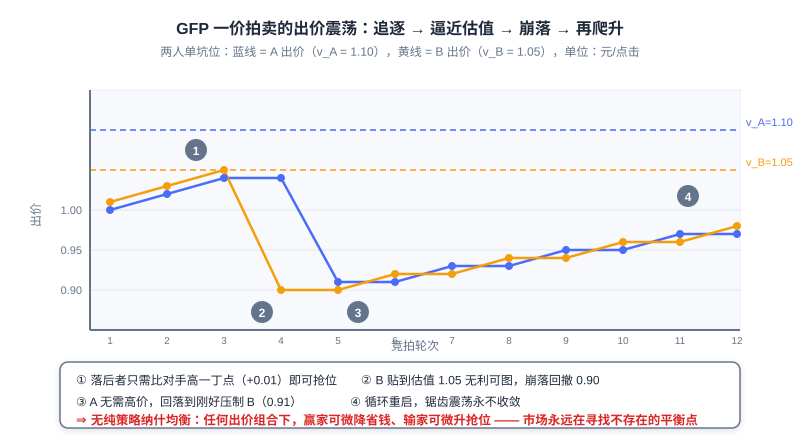
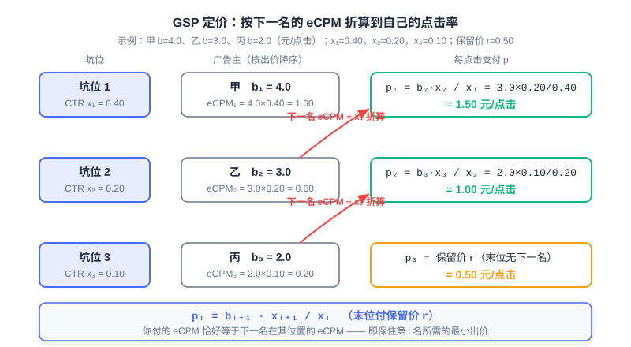

  📖
  ⏱️ ~50 min read
  🎯 Advanced

# Auction Mechanisms: From First-Price to Second-Price

> 📝 **Before You Continue:** This chapter requires reading 12.2 (eCPM and Billing Models) first — all ranking and payment formulas are built on the eCPM convention. The **IC/IR** concepts introduced here are used extensively in [8.3](../part8-e2e/e2e-advertising.md) (End-to-End Generative Advertising, EGA); the two chapters are best read side by side.

How much is each of those ad slots at the very top of the search results page worth? There is no "correct answer" to this question — it depends on how an auction is designed. Advertising system value = ad conversion efficiency × pricing mechanism × ad inventory volume × delivery efficiency, and the pricing mechanism is the most "institutional" of the four pillars: it optimizes no model, yet it determines how all participants behave. Economics tells us that "prices fluctuate around value," and a good **auction mechanism** should let the price approach its value without limit.

The road there was anything but smooth. When Overture pioneered paid search in 1998 with a first-price auction, advertisers fell into a never-ending bidding chase; only after Google introduced the second-price idea in 2002 did the market stabilize; then around 2019, the leading programmatic exchanges collectively moved back to first-price. First-price → second-price → back to first-price — every step of this cycle embodies the deep logic of mechanism design.

After reading this chapter, you will be able to:

- Describe the allocation and pricing of multi-slot advertising with the **position auction** model, writing down the expected value $u_{is} = v_i \cdot x_s$ and the eCPM ranking rule
- Explain why the **generalized first-price (GFP)** has no stable pure-strategy Nash equilibrium, and work through the oscillating cycle of two bidders step by step
- Prove that truthful bidding is a dominant strategy in the single-slot **second-price auction (Vickrey auction)**, and give the formal definitions of **incentive compatibility (IC)** and **individual rationality (IR)**
- Compute by hand the payments and utilities of the **generalized second price (GSP)** and **VCG** with multiple slots, and articulate their differences in truth-telling and revenue levels
- Verify "what happens when you misreport" with an interactive simulator, and complete 5 tiered practice problems

---

## 12.3.0 The Position Auction Model: Turning "Selling Ads" into a Math Problem

We first establish a framework that uniformly describes all auction scenarios. Suppose the page has $S$ ad slots and $N$ advertisers competing; advertiser $i$ has a **true valuation** $v_i$ for "one click" (this is private information the platform cannot see) and submits a **bid** $b_i$ to the platform (on a CPC basis, i.e., claiming how much they are willing to pay per click). Slots differ naturally in quality: the further forward a slot, the more likely it is to be clicked. We capture this with **position CTRs** $x_1 > x_2 > \cdots > x_S$, where $x_s$ is the click-through rate of slot $s$.

The expected value for advertiser $i$ to obtain slot $s$ is then:

$$u_{is} = v_i \cdot x_s$$

One click is worth $v_i$ yuan, and slot $s$ generates a click with probability $x_s$; multiplying the two gives the expected value of this impression to the advertiser. This model is called the **position auction**: multiple advertisers compete for multiple ordered slots, and the only difference between slots is their click-through rates. For display advertising (CPM billing) there is a single slot, $s=1$, and the model degenerates to a single-slot auction; search ads' feed slots and e-commerce recommendation slots are all cases with $S>1$.

What does the platform see? The platform cannot see $v_i$; it can only compute the expected revenue of each pairing from the declared bids, i.e., the unified convention introduced in 12.2:

$$\text{eCPM}_{is} = b_i \cdot x_s$$

Ranking advertisers from high to low by bid and assigning them in order to slots with high-to-low click-through rates maximizes total eCPM (a direct corollary of the rearrangement inequality). So no matter which pricing mechanism is adopted, the **allocation rule** is almost always "rank by bid (times quality score)" — what truly sets the mechanisms apart is the **pricing rule**: how much the winner actually pays.

### 🧠 Mental Model: Assigning Seats and Charging Tuition

> Think of ad slots as ordered seats in a classroom: the front rows see clearly (high CTR), the back rows don't (low CTR). Every student (advertiser) has a private floor price for what a front-row seat is worth ($v_i$), but can lie when signing up (bidding $b_i$). The teacher (platform) assigns seats by sign-up price, then collects tuition. The key is how the tuition is set: charge "the price you yourself declared," and students will frantically probe the floor; charge "just enough to beat the person behind you," and reporting the true floor price never hurts. This entire chapter is the rigorous formalization of that one sentence of intuition.

Any auction mechanism can be split into two halves: the **allocation rule** decides "who wins which slot," and the **pricing rule** decides "how much they pay." The allocation rule determines market efficiency (whether good ads get good positions), while the pricing rule determines market honesty (whether advertisers are willing to report their true valuations). In the next three sections, we will see how the same allocation rule combined with three different pricing rules — first-price, second-price, and externality pricing — leads to radically different market shapes.

> **Analysis:** The position auction model has two simplifying assumptions: slot CTR depends only on position (real systems also multiply by the ad's own quality score, i.e., ranking by $b_i \cdot q_i \cdot x_s$); and advertiser valuations are constant within one auction. Even so, it suffices to reveal every point of divergence in mechanism design — the separation of allocation and pricing, the trade-off between incentives and stability. All subsequent industrial complexity is addition built around this skeleton.

---

## 12.3.1 The Failure of First-Price GFP: Why "Paying Your Own Bid" Doesn't Work

The most intuitive pricing rule is the **first-price auction**: the highest bidder wins and pays their own bid. Generalized to multiple slots this becomes the **generalized first-price (GFP)**: slots are allocated by ranking bids, and everyone pays their own bid. Overture used this mechanism to create paid search in 1998, and within a few years it plunged the entire market into chronic oscillation.

Where is the problem? Under first-price, your payment is completely tied to your declaration — bid higher and you pay more, bid lower and you save money. Suppose a single slot and two advertisers A and B with valuations $v_A = 1.10$ and $v_B = 1.05$ (yuan/click) respectively. The bidding dynamics across rounds unfold as follows:

| Round | A's bid | B's bid | Leader | Leader's utility that round (yuan/click) |
|---|---|---|---|---|
| 1 | 1.00 | **1.01** | B | 0.04 |
| 2 | 1.02 | **1.03** | B | 0.02 |
| 3 | 1.04 | **1.05** | B | 0.00 (bid reaches valuation, no profit left) |
| 4 | 1.04 | **0.90** (collapse and retreat) | A | 0.06 |
| 5 | **0.91** (cut to just enough to stay ahead) | 0.90 | A | 0.19 |
| 6 | 0.91 | **0.92** | B | 0.13 |
| 7 | **0.93** | 0.92 | A | 0.17 |
| … | Slow climb, collapsing again after approaching 1.05 | | | |

Note two details in every round: the trailing bidder only ever needs to top the rival by **a hair** (0.01) to steal the slot; and the moment the leader notices the rival retreat, they slash their bid to just above the rival (1.04 → 0.91). The price traces a sawtooth cycle: climb — approach valuation — collapse — climb again, never converging.

This chase has no end point, and we can show why rigorously. A **pure-strategy Nash equilibrium** requires a bid profile in which no player can gain by unilaterally changing its own bid. Examine any profile $(b_A, b_B)$ with $b_A > b_B$: whenever the gap between the two exceeds the minimum bid increment, winner A can drop to $b_B + \varepsilon$, still win, and pocket real money — deviation pays; and whenever B's valuation exceeds A's current bid, B can raise by $\varepsilon$ to seize the slot back — deviation pays here as well. The two adjustment rules chase each other, and a profile where "neither side wants to move" never exists. This is exactly the conclusion from Liu Peng's notes: first-price auctions easily lead to a "**Nash non-equilibrium**" with constantly fluctuating prices.

In the figure, the blue line is A's bid and the yellow line is B's bid, with dashed lines marking their valuation ceilings. The bids can be seen chasing each other upward, collapsing once they touch the valuations, then climbing again — the market forever searching for an equilibrium point that does not exist.

The market-level consequences are systemic. Platform revenue swings violently with the bid sawtooth and becomes unpredictable; advertisers must watch rivals and adjust bids 24/7, driving operating costs sky-high (this even spawned dedicated automated bidding agents back then); worse, bids no longer convey any real information — the $b_i$ you observe is merely the outcome of the rival's last round of probing, with no relation whatsoever to their true valuation $v_i$. The failure of GFP tells us: **a mechanism is not a neutral container — the pricing rule itself shapes participant behavior**.

> **Analysis:** GFP's lesson is a classic in the history of mechanism design: allocation efficiency is fine (higher bidders get higher positions); only the incentive structure is broken. It also explains why "letting advertisers optimize their own bids" fails under first-price — bidding is an iteration of best-response functions, not a parameter that can be statically optimized. The direction of the fix is therefore clear: decouple "payment" from "declaration" so that lying becomes unprofitable.

---

## 12.3.2 The Second-Price Auction and Incentive Compatibility: Making Truth-Telling the Optimal Strategy

The fix was proposed by the economist William Vickrey in 1961 (for which he received the 1996 Nobel Prize in Economics). The **second-price auction**, also called the **Vickrey auction**: the highest bidder wins, but pays the **second-highest bid**. With a single slot, the winner pays "someone else's price," not "the price they themselves declared."

Why is this change so pivotal? We prove that under second-price, truthful bidding $b_i = v_i$ is a **dominant strategy** — no matter how others bid, telling the truth is no worse than any lie. Let your valuation be $v$ and the highest bid of the other advertisers be $B$; consider both directions of deviation:

- **Under-bidding** $b < v$: your payment never depended on your own bid in the first place (if you win, you pay $B$), so bidding lower only changes those outcomes where $b < B < v$ — cases where telling the truth would have won with utility $v - B > 0$, now thrown away for nothing. Your winning surface shrinks, your payments don't change — **it can only get worse**.
- **Over-bidding** $b > v$: the extra wins are exactly those cases where $v < B < b$ — you win, but must pay $B > v$, so utility is $v - B < 0$, worse than not winning (utility 0). In the cases you could already win, payments stay the same — **this can only get worse too**.

Both directions are blocked: bidding exactly your valuation simultaneously avoids both errors — "throwing away winnable cases" and "winning at a loss." Payment is decoupled from declaration, so the declaration can afford to expose the truth — this is the source of all the second-price auction's magic.

### 🧠 Mental Model: The Shrewd Paddle Agent

> The second-price auction is equivalent to entrusting an absolutely shrewd agent to raise the paddle on site for you: you tell them your floor price $v$, and they only ever raise the price to "just enough to beat the highest bid in the room." You don't need to guess your opponents or leave a profit margin — report the true floor price, and the agent automatically saves you to the limit. The sealed-bid second-price auction merely turns this agent into an institution.

This property has a formal name, and it is one of two core concepts running through this chapter and 8.3. **Incentive compatibility (IC)**: truthful reporting of one's valuation is a dominant strategy. Formally, for any misreport $b_i$:

$$u_i(v_i;\, v_i, \boldsymbol{b}_{-i}) \;\geq\; u_i(v_i;\, b_i, \boldsymbol{b}_{-i})$$

**Individual rationality (IR)**: participating in the auction never leaves a rational participant worse off, i.e., payment does not exceed the declared value $p_i \leq b_i$, and utility is non-negative. IC guarantees "telling the truth doesn't hurt"; IR guarantees "participating doesn't hurt" — together they give the market a stable population of honest participants.

> 💡 **Key Insight:** The EGA of [8.3](../part8-e2e/e2e-advertising.md) quantifies IC as **ex-post regret** (the most one could gain by misreporting; IC $\Leftrightarrow$ regret = 0) and writes it into the loss function; what the Sigmoid payment rate guarantees is precisely IR. The definitions in this chapter are the economic origin of that end-to-end machinery — mechanism design is shifting from a "post-processing rule" to a "differentiable model constraint."

> **Analysis:** The strict IC of the second-price holds only with a single slot. Once there are multiple slots, "pay the second-highest bid" cannot be directly generalized — different slots have different CTRs, payments must be converted across positions, and this generalization (the GSP of the next section) precisely loses the dominant-strategy property. The single slot is mechanism design's laboratory; multiple slots are the industrial battlefield.

---

## 12.3.3 Generalized Second Price GSP: The Engineering Compromise for Multiple Slots

How can the second-price idea be generalized to multiple slots? The **generalized second price (GSP)** gives the answer the industry has used for twenty years: slots are still allocated by ranking bids (eCPM), but the $i$-th advertiser **pays "the next bidder's eCPM converted to their own click-through rate."** Under CPC billing, the per-click payment of rank $i$ (slot CTR $x_i$, next bidder's bid $b_{i+1}$, next slot CTR $x_{i+1}$) is:

$$p_i = \frac{b_{i+1} \cdot x_{i+1}}{x_i}$$

The last rank has no "next bidder's slot" to reference, and pays the **minimum reserve price** $r$. There are three layers of intuition. First: by seizing slot $i$, you push the next bidder down to slot $i+1$; the "impression opportunity loss" you cause, measured in eCPM, is $b_{i+1} \cdot x_{i+1}$, and dividing by $x_i$ converts it into your per-click price. Second: $p_i \cdot x_i = b_{i+1} \cdot x_{i+1}$ — the eCPM you pay exactly equals the next bidder's eCPM at their position, i.e., **the minimum eCPM needed to keep rank $i$**. Third: your payment depends only on the next bidder's bid, half-decoupled from your own declaration — this is precisely the residue of the second-price idea.

Here is a complete numerical example. Three slots $x_1 = 0.40,\ x_2 = 0.20,\ x_3 = 0.10$, reserve price $r = 0.50$; three advertisers A, B, and C with valuations $4, 3, 2$ respectively (assume truthful bidding for now to compare mechanisms, $b = v$). Ranked by bid: A $\to$ slot 1, B $\to$ slot 2, C $\to$ slot 3. Payments and utilities can be computed one by one:

| Slot | CTR | Advertiser | Bid | Payment $p_i$ (yuan/click) | eCPM payment | Utility $(v_i - p_i) \cdot x_s$ |
|---|---|---|---|---|---|---|
| 1 | 0.40 | A | 4.0 | $3.0 \times 0.20 / 0.40 = \mathbf{1.50}$ | 0.60 | $(4-1.5)\times 0.40 = 1.00$ |
| 2 | 0.20 | B | 3.0 | $2.0 \times 0.10 / 0.20 = \mathbf{1.00}$ | 0.20 | $(3-1.0)\times 0.20 = 0.40$ |
| 3 | 0.10 | C | 2.0 | Reserve price $r = \mathbf{0.50}$ | 0.05 | $(2-0.5)\times 0.10 = 0.15$ |

A bids 4 yuan but pays only 1.5 yuan — the 2.5 yuan saved is exactly the second-price mechanism's reward for "daring to tell the truth."

But GSP has a flaw we must face honestly: **it is not strictly truth-telling**. Liu Peng's notes say it verbatim: GSP's "market as a whole is not truth-telling, and compared with VCG it charges advertisers more." Use a two-slot counterexample to see that "telling the truth need not be optimal." Let $x_1 = 0.40,\ x_2 = 0.30$, reserve price $r = 0.20$; A has $v = 4$ and B has $v = 3$, both bidding truthfully. A takes slot 1, pays $p = 3 \times 0.30 / 0.40 = 2.25$, with utility $(4 - 2.25) \times 0.40 = 0.70$. But if A drops the bid to 2.0 (voluntarily falling to slot 2), A pays only the reserve price 0.20, and utility becomes $(4 - 0.20) \times 0.30 = 1.14 > 0.70$ — **telling the truth is not the optimal strategy**. Under GSP the optimal bid depends on rivals' bids; no dominant strategy exists; when the CTR gap between slots is small and the next bidder's bid is high, deliberately moving down a rank can actually be more profitable.

So why didn't GSP collapse like GFP? Because it still has order at the game-theoretic level. GSP admits a **symmetric Nash equilibrium (SNE)**, and this equilibrium is **envy-free**: in equilibrium, no advertiser wants to swap positions with an adjacent one — if you pushed up to the position above, you would have to pay that position's price, and your utility would not improve. Envy-free means no one is motivated to grab someone else's position, and the market stays stable. It is also in the equilibrium sense that GSP's revenue gap versus VCG emerges: GSP's equilibrium bids are systematically higher than true valuations, VCG settlements sit at the lower bound of the equilibrium revenue range, so under most equilibria GSP **charges advertisers more**.

> **Analysis:** GSP's victory is the victory of an engineering compromise. Computationally, each settlement requires only the next bidder's bid and two slots' CTRs — no global information whatsoever — placing no strain on millisecond-level bidding services; semantically, "your price is determined by the person behind you" is something advertisers understand instantly. Trading a theoretical property (strict IC) for engineering properties (simple, robust, interpretable) — this bargain proved worthwhile over twenty years of industrial practice — until the multi-intermediary chains of the programmatic era broke the balance (see 12.3.5).

---

## 12.3.4 The VCG Mechanism: Pricing "Externalities"

If GSP is the engineering compromise, the **VCG mechanism (Vickrey-Clarke-Groves mechanism)** is the theoretical optimum. Its pricing philosophy can be stated in one sentence: **each advertiser's charge equals the externality damage it imposes on all other participants** — "how much more the others could have earned had you not been present." Being assigned slot $s$ means you pushed everyone below you down by one position (or even off the list); the sum of the value each of them loses thereby is the total bill you should pay:

$$P_i \;=\; \underbrace{\sum_{j \neq i} u_j^{\text{w/o } i}}_{\text{others' total welfare without you}} \;-\; \underbrace{\sum_{j \neq i} u_j^{\text{w/ } i}}_{\text{others' total welfare with you}}$$

The per-click payment is then converted by the slot CTR: $p_i = P_i / x_{s(i)}$ (in real systems, further take the maximum with the reserve price).

### 🧠 Mental Model: Land Compensation

> A plot of land is auctioned among multiple applicants; VCG's rule is: the winner does not pay their own bid, but instead **compensates all losing applicants for the total value they lose as a result**. The social cost of your occupying this land is others' opportunity cost of losing it — pay for the opportunity cost, not for "winning."

First verify a key degenerate case: with a single slot, VCG is exactly the second-price. When you are present, the others' welfare is 0; when you are absent, the second-place bidder gets the only slot, with welfare $v_2 \cdot x_1$. The externality is $P = v_2 \cdot x_1$, and converted to a per-click payment $p = v_2 \cdot x_1 / x_1 = v_2$ — precisely the second-highest bid. **The second-price auction is the single-slot special case of VCG**.

Now work a complete two-slot example. Advertisers A, B, and C have valuations $v = 4, 3, 2$, bidding truthfully; slots $x_1 = 0.40,\ x_2 = 0.20$ (C misses the list). The allocation is still A $\to$ slot 1, B $\to$ slot 2. Compute the externalities one by one:

**A (slot 1)**: without A, B moves up to slot 1 ($3 \times 0.40 = 1.2$) and C moves up to slot 2 ($2 \times 0.20 = 0.4$), so others' total welfare is $1.6$; with A, B is at slot 2 ($0.6$) and C misses the list ($0$), totaling $0.6$. The externality is $P_{\text{A}} = 1.6 - 0.6 = 1.00$, the per-click payment is $1.00 / 0.40 = 2.50$, and utility is $(4 - 2.5) \times 0.40 = 0.60$.

**B (slot 2)**: without B, C gets slot 2 ($2 \times 0.20 = 0.4$) while A stays put ($1.6$), totaling $2.0$; with B, C misses the list, totaling $1.6$. The externality is $P_{\text{B}} = 2.0 - 1.6 = 0.40$, the per-click payment is $0.40 / 0.20 = 2.00$, and utility is $(3 - 2) \times 0.20 = 0.20$.

**C (misses the list)**: without C the others are unchanged, so the externality is 0, payment is 0, utility is 0.

Note why B's bill is computed this way: the harm is not to A (A gets slot 1 regardless) but to C, who was pushed off the list — VCG accounts precisely for "each person's displacement," whereas GSP only converts the next bidder's bid; this is the entire gap between them.

VCG's most tantalizing property is: **the market as a whole is truth-telling** (Liu Peng's notes, verbatim) — truthful bidding is a dominant strategy, and this holds for any number of slots. The key to the proof is an elegant rewriting. Expanding the utility:

$$u_i \;=\; v_i \cdot x_{s(i)} - P_i \;=\; \underbrace{\left[\, v_i \cdot x_{s(i)} + \sum_{j \neq i} u_j^{\text{w/ } i} \right]}_{\text{true total social welfare}} \;-\; \underbrace{\sum_{j \neq i} u_j^{\text{w/o } i}}_{\text{a constant independent of your declaration}}$$

The second term is a constant — "the others' welfare without you" does not depend at all on how you declare. So maximizing personal utility is equivalent to maximizing the first term, i.e., **the true total social welfare**. The mechanism chooses the allocation that maximizes "declared welfare" according to your declaration; when you declare truthfully, the mechanism happens to select the allocation with the maximum true welfare — your self-interest and society's common good are mathematically aligned. Misreporting only induces the mechanism to pick an allocation that "you think is good but actually isn't."

> **Analysis:** VCG's industrial situation is "full marks in theory, difficult to land." Computationally, every winner requires a "global re-run without them," and the server-side cost per ad request is on the order of $O(N \cdot S \log N)$ — expensive on a millisecond-level bidding path. Informationally, the externality computation requires the complete payoff structures of all participants, which multi-level-intermediary programmatic markets simply cannot collect. Cognitively, "what you pay is the damage you cause others" is too counter-intuitive for advertisers — bills are hard to explain and hard for sales to pitch. Hence the industry long favored GSP, with Meta (Facebook) being one of the few mainstream platforms to persist with VCG at scale.

---

## 12.3.5 GSP vs VCG Comparison and the "Return to First-Price"

Place the three mechanisms side by side and the differences are plain:

| Dimension | GFP (generalized first-price) | GSP (generalized second price) | VCG |
|------|----------------|----------------|-----|
| Truth-telling | No, misreporting is profitable | No, not strictly IC (but a symmetric Nash equilibrium exists) | Yes, dominant-strategy IC |
| Revenue level | Payment = own bid, violent fluctuation | Higher than VCG under most equilibria | Priced by externality, lower under equal allocation |
| Implementation complexity | Lowest (ranking is settlement) | Low: only the next bid and two slots' CTRs | High: one "re-run without them" per winner |
| Equilibrium stability | No pure-strategy Nash equilibrium, oscillation | Symmetric NE, envy-free, stable | Dominant-strategy equilibrium, strongest stability |
| Industrial adoption | Early paid search, now obsolete | Long-standing mainstream in search/display ads | A few platforms (Meta, etc.) |

Beyond the static comparison, it is worth running the experiment yourself. The interactive simulator below has three advertisers; you can modify each one's bid and valuation, and observe allocation, payment, and utility $(v_i - p_i) \cdot x_s$ under the three mechanisms GFP, GSP, and VCG; you can also step through what happens after "lowering a bid" or "raising a bid," verifying that under second-price/VCG truthful bidding maximizes utility.

<iframe src="../viz/part12-auction.html?embed&vizId=part12-auction" style="width:100%; height:520px; border:none; display:block;" loading="lazy"></iframe>

It is recommended to follow the simulator's default script: B lowers its bid (profitable under GFP, harmful under the second-price family), B raises its bid (utility unchanged under GSP — the manifestation of envy-freeness; harmful under VCG), C raises its bid (a losing move under all three mechanisms, and under GSP it even drags down the innocent A and B). After finishing, you will have muscle memory for "pricing rules shape behavior."

> 📌 **Note on Industry Practice** (the following is public industry information as of the time of writing; the timeline follows industry reports):

The story should have ended here, but programmatic trading rewrote the ending. With the spread of **header bidding** and programmatic open auctions, a single impression is resold through multi-level chains of SSP → ADX → DSP, with each level possibly taking a cut — the second-price auction's "second-highest price" became opaque after multi-level resale: a DSP wins the auction yet cannot figure out whose "second price" it ultimately paid. So around 2019, leading ADXs including Google moved wholesale to **first-price auctions**: you pay what you bid, and the bill is crystal clear.

The cost of the return to first-price is that truth-telling is no longer guaranteed by the mechanism — the bid directly equals the payment, over-bidding means over-paying, and the mechanism's honesty constraint disappeared. The gap is filled by algorithms: **bid shading** became the DSP's core competency — using historical bidding data to estimate "the probability distribution of winning traffic at bid $b$," performing expected-value optimization between bid and win rate, and pressing the bid down toward "the lowest price that still wins." History completed an ironic full circle: first-price was replaced by second-price for its instability, and second-price was taken back by first-price for its opacity — only this time, the "first-price" comes with statistically-learning-driven smart bidding rather than the naked game-playing of the GFP era.

> **Analysis:** The deep pattern of mechanism choice comes into view here: a mechanism's theoretical properties (IC, stability, revenue) have never been the only decision dimension — one must also consider the information structure (who can see what), the chain complexity (how many intermediary levels), and participants' cognitive costs (whether the bill can be understood). GFP died of incentives, VCG is trapped by complexity, GSP won on balance, and the return to first-price relies on algorithms taking over incentives — each rotation was the least-bad choice under the constraints of its time.

---

## 12.3.6 Convergence with Recommender Systems

Looking back across this chapter, auctioning is the great watershed between advertising and recommendation. Recommender systems are one-sided optimization: content cannot lie about its own value, and the system only needs to align with user interests; advertising is a three-way game — users want experience, advertisers want ROI, the platform wants revenue — and advertisers' valuations are private information. Only with private information is lying possible, and only when lying is possible is mechanism design needed — the first lesson for recommendation engineers moving into advertising is often to make up this chapter's game-theoretic perspective.

But the two technical routes are converging. The first direction is **smart bidding**: products like OCPC let advertisers report only a target conversion cost, the platform bids on their behalf and converts the bid into the ranking model — the bid is no longer a post-processing multiplier on the ranking score, but enters the model as a feature and calibration term, and the eCPM constraint is embedded into ranking itself. The second direction is more radical: the **EGA** of [8.3](../part8-e2e/e2e-advertising.md) embeds token-level bidding into the generation process — allocation uses bids to guide generation probability, payment uses an independent network to learn an IC-compliant payment function, and ex-post regret is written into Lagrangian optimization as a constraint. The second-price auction's core idea of "decoupling payment from declaration" is reborn in generative models in the form of "decoupling allocation from payment."

The role of mechanism design has therefore undergone a fundamental migration: from a **post-processing rule** (running an auction settlement after ranking completes) to an **end-to-end constraint** (writing IC/IR into the loss function, turning the payment function into a learnable network). This trend is good news for recommendation engineers — the ranking modeling skills you honed in 3.x remain the foundation, while this chapter's mechanism design vocabulary (IC, IR, externality, equilibrium) is becoming the entry threshold for ad algorithms. Only by understanding auctions can you understand the economic skeleton of advertising systems.

---

## ⚠️ Common Mistakes in 12.3

| # | Mistake | Example | Why It's Wrong | Fix |
|---|---------|---------|---------------|-----|
| 1 | Assuming GSP is strictly incentive compatible | "GSP is second-price, so everyone tells the truth" | The second-price dominant-strategy property holds only for a single slot; after cross-slot conversion, truthful bidding need not be optimal | Distinguish "single-slot second-price (strictly IC)" from "GSP (not strictly IC, stabilized by SNE)" |
| 2 | Computing VCG's externality as one's own lost profit | "I pay however much less I'd earn without me" | VCG charges the damage you cause **to others**, not your own opportunity cost | Always compute with "the difference in others' total welfare," independent of your own valuation |
| 3 | Believing first-price is naturally truth-telling | "You pay your own bid, so misreporting is pointless" | Under first-price, bid and payment are tied; shading down saves money and raising grabs slots — both are profitable | Under first-price, truth-telling is filled in by bid shading strategy, not guaranteed by the mechanism |
| 4 | Not converting GSP payments across slots by CTR | "Rank 1 just pays rank 2's bid of 3 yuan" | Different slots have different CTRs; copying directly miscalculates the eCPM convention | Return to the eCPM convention: $p_i = b_{i+1} x_{i+1} / x_i$ |
| 5 | Confusing the reserve price with the second-highest bid | "With only one bidder, they pay the second price" | With no competition there is no "second price"; the last rank or sole winner pays the reserve price | Last rank pays $\max(\text{next-bidder converted price},\ r)$; with no next bidder, pays $r$ |

---

## Chapter Summary

### 📌 Key Takeaways

| Concept | Key Points | Why It Matters |
|---------|-----------|----------------|
| Position auction | $u_{is} = v_i \cdot x_s$, allocate by eCPM ranking | The unified framework for multi-slot ad pricing |
| Allocation + pricing dichotomy | The allocation rule sets efficiency; the pricing rule sets honesty | The key to reading any auction mechanism |
| GFP (first-price) | Payment = own bid | No pure-strategy NE, market oscillation, obsolete |
| Second-price / Vickrey | Winner pays the second-highest bid | Single-slot strict IC: truthful bidding is a dominant strategy |
| GSP | $p_i = b_{i+1} x_{i+1} / x_i$, last rank pays the reserve price | Industrial mainstream; SNE-stable, envy-free, but not truth-telling |
| VCG | Payment = externality damage to others | Truth-telling overall; high computational and cognitive costs, rare in practice |
| Return to first-price | After Header Bidding, ADXs went first-price, bid shading filled the gap | Mechanism properties can be reallocated by algorithms and market structure |

### ❓ FAQ

**Q1: Where do GSP and single-slot second-price differ?**
> A: With a single slot there is no position-conversion issue for the "next bidder," and GSP degenerates to second-price. With multiple slots, payments must be converted across positions by CTR ($p_i = b_{i+1} x_{i+1} / x_i$), and this generalization loses strict IC — the second-price dominant-strategy property cannot survive across slots; GSP's stability rests on the symmetric Nash equilibrium rather than a dominant strategy.

**Q2: Since VCG has better theoretical properties, why doesn't industry buy in?**
> A: Three reasons: computationally complex (one global re-run per winner, unbearable on the bidding path), requires global information (multi-level intermediary markets cannot collect all participants' payoff structures), and hard for advertisers to understand (paying for "others' losses" makes bills costly to explain). A mechanism's adoption depends not only on theory but also on engineering cost and cognitive cost — GSP sits exactly at the compromise point.

**Q3: After the return to first-price, how does a DSP avoid overpaying?**
> A: The mechanism no longer "pays only the second price" for you; the DSP must do its own bid shading: use historical bidding data to estimate "the probability of winning traffic at bid $b$," perform expected-value optimization between win rate and payment, and press the bid toward the lowest winning point. Bidding strategy turns from "report the true valuation" into a statistical learning problem — which is exactly why it became the DSP's core competency.

### 🔗 Connections to Other Chapters

- **12.2** (eCPM and billing models) — all payment formulas in this chapter use eCPM as the unified convention; GSP's "convert by the next bidder's eCPM" is built directly on 12.2's CPC/CPM conversion.
- **8.3** (end-to-end generative advertising, EGA) — the IC/IR definitions of this chapter are quantified in EGA as ex-post regret and written into the loss function; EGA's "decoupling allocation from payment" is exactly the end-to-end rebirth of the second-price idea of "decoupling payment from declaration."
- **3.x** (precise preference prediction) — pCTR estimation pursues absolute accuracy rather than relative ranking, because it directly enters eCPM ranking and GSP's converted pricing; a slight estimation bias miscalculates the price.
- **5.3** (evolution of the generative paradigm) — the overall thread of end-to-end generative approaches is the backdrop for understanding the "mechanisms embedded in models" trend of 12.3.6.

---

## Practice Problems

Work through all problems in order — they get progressively harder. Each has a complete solution you can reveal after trying it yourself.

---

**Problem 12.3.1 — Position Auction and eCPM Ranking** 🟢 Easy

Advertiser A has valuation $v_A = 5$ and bid $b_A = 2.0$; advertiser B has valuation $v_B = 3$ and bid $b_B = 2.5$ (both CPC). Slot CTRs are $x_1 = 0.40$ and $x_2 = 0.10$.
(a) Under the platform's ranking rule, which slot does each advertiser get?
(b) What is each advertiser's expected value $u_{is}$ for the slot they obtain?
(c) If this is display advertising (single slot), who wins? Verify with eCPM.

💡 Solution (click to reveal)

**Approach:** Rank by eCPM; the higher bidder gets the higher-CTR slot.

- (a) $b_B = 2.5 > b_A = 2.0$, so B $\to$ slot 1 and A $\to$ slot 2.
- (b) $u_{B,1} = 3 \times 0.40 = 1.20$; $u_{A,2} = 5 \times 0.10 = 0.50$.
- (c) With a single slot, B wins. eCPM verification: $\text{eCPM}_B = 2.5 \times 0.40 = 1.00 > \text{eCPM}_A = 2.0 \times 0.40 = 0.80$.

**Key points:**
- Allocation follows declared bids, not valuations — valuations are private information, invisible to the platform.
- Expected value is computed with valuations (advertiser's perspective), ranking with bids (platform's perspective); the two must not be mixed.

---

**Problem 12.3.2 — Complete GSP Three-Slot Payment Computation** 🟢 Easy

Three advertisers bid $b_1 = 5.0,\ b_2 = 3.0,\ b_3 = 1.0$ with valuations $v_1 = 6,\ v_2 = 4,\ v_3 = 2$; slot CTRs $x = (0.40, 0.20, 0.10)$, reserve price $r = 0.30$. Find each advertiser's per-click payment, eCPM payment, and utility.

💡 Solution (click to reveal)

**Approach:** Apply $p_i = b_{i+1} x_{i+1} / x_i$ rank by rank; the last rank pays the reserve price.

| Slot | Advertiser | Payment (yuan/click) | eCPM payment | Utility $(v_i - p_i) x_i$ |
|---|---|---|---|---|
| 1 | 1 | $3.0 \times 0.20 / 0.40 = 1.50$ | 0.60 | $(6 - 1.5) \times 0.40 = 1.80$ |
| 2 | 2 | $1.0 \times 0.10 / 0.20 = 0.50$ | 0.10 | $(4 - 0.5) \times 0.20 = 0.70$ |
| 3 | 3 | $r = 0.30$ | 0.03 | $(2 - 0.3) \times 0.10 = 0.17$ |

**Key points:**
- Rank 1 bids 5 yuan but pays only 1.5 yuan — decoupling of payment from declaration is the hallmark of the second-price family.
- The last rank has no "next-bidder conversion" and settles directly at the reserve price.

---

**Problem 12.3.3 — VCG Two-Slot Externality Computation** 🟡 Medium

Advertisers A, B, and C have valuations $v = (5, 3, 1)$, bidding truthfully; two slots $x_1 = 0.40,\ x_2 = 0.20$.
(a) Compute A's and B's VCG per-click payments and utilities (C misses the list and pays 0).
(b) Verify: if there is only one slot, A's per-click payment is exactly the second-highest bid.

💡 Solution (click to reveal)

**Approach:** For each winner, compute "others' welfare without them − others' welfare with them."

- (a) **A (slot 1)**: without A, B $\to$ slot 1 ($3 \times 0.4 = 1.2$) and C $\to$ slot 2 ($1 \times 0.2 = 0.2$), totaling $1.4$; with A, B $\to$ slot 2 ($0.6$) and C misses the list ($0$), totaling $0.6$. $P_{\text{A}} = 0.8$, per-click payment $0.8 / 0.4 = 2.0$, utility $(5 - 2) \times 0.4 = 1.2$.
  **B (slot 2)**: without B, C $\to$ slot 2 ($0.2$) and A stays put ($2.0$), totaling $2.2$; with B, the total is $2.0$. $P_{\text{B}} = 0.2$, per-click payment $0.2 / 0.2 = 1.0$, utility $(3 - 1) \times 0.2 = 0.4$.
- (b) With a single slot, A's externality $= $ the welfare B could have obtained, $v_2 x_1 = 1.2$; the per-click payment $= 1.2 / 0.4 = 3.0 = v_2$, i.e., the second-highest bid. VCG degenerates to second-price with a single slot.

**Key points:**
- B's harm falls on C, who was pushed off the list, not on A — externalities are accounted precisely by "each person's displacement."
- The utility rewriting $u_i = \text{true total welfare} - \text{constant}$ is the proof skeleton of VCG truth-telling.

---

**Problem 12.3.4 — A Constructive Verification That GSP Is Not Strictly IC** 🔴 Hard

Continue with the counterexample setting of 12.3.3: two slots $x_1 = 0.40,\ x_2 = 0.30$, reserve price $r = 0.20$; A has $v = 4$ and B has $v = 3$.
(a) When both bid truthfully, what is A's utility?
(b) What is A's utility if A bids 2.0 instead? What does this show?
(c) If B actually bids only 1.0, which is better for A — bidding 2.0 or 4.0? Use this to explain why GSP has no dominant strategy.

💡 Solution (click to reveal)

**Approach:** Compute utilities case by case, examining "how the same strategy performs under different rivals' bids."

- (a) A takes slot 1, $p = 3 \times 0.30 / 0.40 = 2.25$, utility $(4 - 2.25) \times 0.40 = 0.70$.
- (b) A falls to slot 2, pays the reserve price $0.20$, utility $(4 - 0.20) \times 0.30 = 1.14 > 0.70$. Telling the truth is not optimal — GSP is not strictly IC.
- (c) When B bids 1.0: A bidding 2.0 takes slot 1 ($p = 1.0 \times 0.3/0.4 = 0.75$), utility $(4 - 0.75) \times 0.4 = 1.30$; if A dropped to slot 2, it would only get $1.14 < 1.30$. The same strategy "drop to 2.0" is better in (b) but worse in (c) — the optimal bid depends on rivals' bids, and no strategy is optimal against all possible rival bids; that is, there is no dominant strategy.

**Key points:**
- An operational criterion for non-strict IC: one can construct a set of rivals' bids under which truthful bidding is not optimal.
- The game-theoretic essence of GSP: advertisers make rival-dependent trade-offs between "fighting for a higher slot and paying more" and "retreating to a lower slot and paying less"; the equilibrium is characterized by the SNE.

---

**🏆 Problem 12.3.5 — Proof: Deviating from the Valuation in a Single-Slot Second-Price Auction Yields No Utility Gain**

Consider a single-slot second-price auction. Your valuation is $v > 0$, the highest bid of the other advertisers is $B \geq 0$, and your bid is $b \geq 0$. Utility: if you win, $u = v - B$; if you lose, $u = 0$. Prove that for any $b$ and any $B$: $u(v; b, B) \leq u(v; v, B)$, and that the conclusion is "no utility gain" rather than "strictly better."

💡 Solution (click to reveal)

**Approach:** Split into two cases by deviation direction, comparing the position of $b$ versus $v$ relative to $B$ on the win/loss boundary.

Denote the utility from bidding $b$ as $u(b)$ and from the truthful bid $v$ as $u(v)$. Note that the payment is always $B$ (independent of $b$); utility differences come only from changes in winning or losing.

**Case one, $b < v$ (under-bidding).** $u(b)$ and $u(v)$ differ only on the interval $b < B < v$: within this interval, $b < B$, so the under-bidder loses, $u(b) = 0$; whereas $v > B$, so the truthful bidder wins, $u(v) = v - B > 0$. On the remaining intervals ($B \leq b$ or $B \geq v$), both win or lose identically and pay identically, so the utilities are equal. Hence $u(b) \leq u(v)$.

**Case two, $b > v$ (over-bidding).** The differing interval is $v < B < b$: the over-bidder wins but pays $B > v$, so $u(b) = v - B < 0$; the truthful bidder loses, $u(v) = 0$. On the remaining intervals, the utilities are equal. Hence $u(b) \leq u(v)$.

Combining both cases: for all $b, B$, $u(v; b, B) \leq u(v; v, B)$, i.e., $b = v$ is a weakly dominant strategy. Note that when $B = v$, any $b > B$ yields the same utility as the truth (both $v - B = 0$), and when $B > v$, any $b \leq B$ likewise does not lose — so truth-telling is "no worse than any misreport," not "strictly better than every misreport."

**Key points:**
- Proof skeleton: payment decoupled from declaration $\Rightarrow$ utility differences arise only on the win/loss boundary $\Rightarrow$ each deviation direction loses on one interval.
- This is exactly the zero ex-post regret special case in 8.3: $\max_b [u(v; b, B) - u(v; v, B)] = 0$ holds for every $B$.

