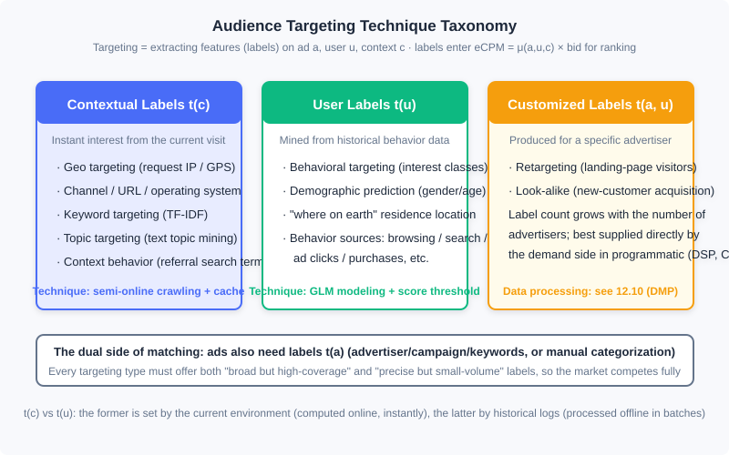
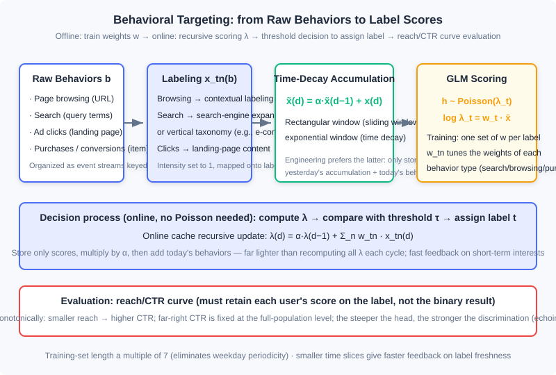

<div style="display: flex; gap: 12px; margin-bottom: 24px; flex-wrap: wrap; align-items: center;">
  <span style="background: #f0f4ff; color: #4A6CF7; padding: 4px 12px; border-radius: 20px; font-size: 0.85em; font-weight: 600; border: 1px solid rgba(74,108,247,0.2);">📖</span>
  <span style="background: #fdf2f8; color: #be185d; padding: 4px 12px; border-radius: 20px; font-size: 0.85em; border: 1px solid rgba(190,24,93,0.2);">⏱️ ~45 min read</span>
  <span style="background: #fef2f2; color: #dc2626; padding: 4px 12px; border-radius: 20px; font-size: 0.85em; font-weight: 600; border: 1px solid rgba(100,100,100,0.15);">🎯 Advanced</span>
</div>

# Audience Targeting

> 📝 **Before You Continue:** This chapter requires reading 12.1 (The Advertising Panorama and Ecosystem) first — where targeting labels sit in the eCPM ranking system; and 12.2 (Billing Models and Core Metrics) — how the eCPM yardstick consumes features on $u$ and $c$. The AUC and calibration concepts from 12.5 (Bias and Calibration) will reappear in the evaluation section of 12.8.3; the "inverted index" idea from 12.7.2 returns in dual form in the engineering solution for contextual targeting.

In 12.4 we let the platform bid on the advertiser's behalf; in 12.7 we let the system allocate traffic against contracts — but both problems assume one thing: you already know "what kind of person is standing in front of this impression." The technology that answers this question is **Audience Targeting**: the process of extracting meaningful features (collectively called **labels** in industry) along the three dimensions of ad $a$, user $u$, and context $c$. Once the context is also treated as "the user's instant interest," audience targeting becomes the core driving force of display advertising, and the key reason computational advertising became the canonical big-data application — without targeting, ads can only be sold coarsely by ad slot; with targeting, the same traffic can be sold at different prices by "person."

This chapter unfolds along the route "taxonomy → context → topic models → behavior → demographics": first establish the technical divide among the three label types $t(c)$, $t(u)$, $t(a,u)$; then look at the lightest-weight contextual targeting (the semi-online crawler is a superb specimen for understanding the weak-consistency needs of ad systems); then enter the chapter's core — the full pipeline of behavioral targeting: modeling, feature generation, decision-making, and evaluation; and close with a section on demographic attribute prediction. Topic models (LSA/PLSI/LDA/word2vec) are handled under the principle "make the intuition clear, annotate the evolution."

After reading this chapter, you will be able to:

- Classify targeting techniques by computational framework into $t(u)$, $t(c)$, and $t(a,u)$, and explain why the dual metrics of "effectiveness × scale" are the prerequisite for a fully competitive market
- Design the semi-online crawling system for contextual targeting, and explain why it is far lighter than a search-engine crawler
- State in one sentence the evolutionary logic across the three generations of topic models — LSA, PLSI, LDA — and the engineering design of word2vec
- Fully implement the feature generation (time-decay accumulation), scoring decision ($\lambda$ threshold), and reach/CTR evaluation of behavioral targeting
- Judge under what data conditions demographic prediction is worth doing, and complete 5 tiered practice problems

---

## 12.8.0 The Taxonomy of Targeting: t(c), t(u), and t(a,u)

Recall the ranking arithmetic of 12.2: $ \mathrm{eCPM} = \mu(a, u, c) \times \mathrm{bid}_a $, where $\mu$ is the click-rate estimate. Targeting techniques answer precisely where the inputs of $\mu$ come from — the process of extracting features along the three dimensions $(a, u, c)$, and its output is the labels. By computational framework, these labels fall into three classes:

- **User labels $t(u)$**: labels assigned on the basis of a user's historical behavior data. Demographic targeting and behavioral targeting (interest targeting) belong to this class.
- **Contextual labels $t(c)$**: instant labels derived from the user's current visit. Geo targeting, channel targeting, and contextual targeting belong to this class.
- **Customized labels $t(a,u)$**: also a kind of user label, with the difference that it is produced for a specific advertiser and must be processed from the advertiser's attributes or data. Retargeting and Look-alike belong to this class. The number of customized labels is no longer a constant but may grow proportionally with the number of advertisers, so they are naturally suited to being supplied directly by the demand side in programmatic trading — this thread unfolds in 12.10 (Data Management Platforms) and DSP technology.

There is also an easily overlooked dual side: each ad $a$ itself must be labeled $t(a)$ so it can match against $t(u)$ and $t(c)$. Two common approaches: directly use the campaign-hierarchy information — advertiser, campaign, ad group, keywords — as labels, or classify manually.



The implementation schemes of the three label classes differ greatly: $t(c)$ is computed on the fly at ad request time (online), $t(u)$ is processed offline in batches from historical logs (offline), and $t(a,u)$ depends on data supplied by the advertiser — which is why this chapter focuses only on the first two.

For any targeting technique, you must attend to both **effectiveness** and **scale**: you need labels with high coverage but limited precision, as well as highly precise labels of relatively small volume. This is not an engineering compromise but market design — only when the label spectrum spans both ends of effectiveness and scale can advertisers with different budgets and goals each find their match, and only then does auction advertising have the basis for full competition.

### 🧠 Mental Model: Three Index Cards in a Library

> Think of an ad system as a library. $t(c)$ is "which page this book is open to right now" — you walk in holding a recipe book, and the librarian immediately hands you a cooking magazine: instant but shallow. $t(u)$ is "this reader's borrowing record over the past year" — an offline-compiled reading profile: deep but takes waiting. $t(a,u)$ is "the exact readers a publisher named" — the demand side brings its own list, and the library only handles the matching. Each kind of index covers one slice of information; together they answer, at the instant of every request, "which book to hand to whom."

---

## 12.8.1 Contextual Targeting: Lightweight Processing of Instant Interests

Within $t(c)$-type targeting, one batch can be obtained by simple computation on ad request parameters: geography (IP/GPS), channel, URL, operating system, and so on. What truly needs discussion is the second kind — labeling pages by the content features of the context page (keywords, topics, categories). The labeling methods fall into five lines of thought:

1. **Rule-based categorization**: assign pages to channels or topic categories by domain (e.g., anything under `auto.*.com` goes to "Automotive") — simple and direct;
2. **Keyword extraction**: extending search-engine keyword matching to media pages; this is the foundational method of contextual targeting;
3. **Anchor-text keywords from in-links**: requires a whole-web crawler, beyond the scope of a typical ad system;
4. **Referral search terms from traffic sources**: analyze which search terms brought users to the page; requires page-visit logs and is technically closer to behavioral targeting;
5. **Topic model mapping**: map page content onto a set of topics in a semantic space, with the goal of generalizing advertiser demand and improving market liquidity — this is the subject of 12.8.2.

Keyword extraction is the base technology. The generic information-retrieval approach is to pick the words with the highest TF-IDF in the page; a more effective variant is **demand-side driven**: obtain a commercially valuable keyword list and IDF from advertiser-related descriptions, then compute TF-IDF together with the page's word frequencies. When rich ad information is available (e.g., when running search text ads, or when holding advertisers' SEM keyword lists), the latter approach is often more accurate — because it filters for words of "high commercial value" rather than words that are "statistically significant."

### Semi-Online Crawling: The Textbook Case of Weak-Consistency Needs in Ad Systems

A page's labels cannot be analyzed in real time within the few milliseconds of an ad request. So should we pre-crawl the entire web like a search engine? No — page information is the main body of service for a search engine, but merely an icing-on-the-cake supplement for an ad system. Hence one can design a **semi-online crawling system**: do no offline crawling at all; crawl as soon as an actual demand arises during online serving.

The workflow uses a cache (e.g., Redis) to store the labels for each URL:

1. An ad request arrives and the URL hits the cache → return the labels directly;
2. On a miss → to avoid blocking the request, **return an empty label set at that moment** while adding the URL to a background crawl queue; within seconds to minutes the page is crawled, labeled, and written into the cache;
3. Set a cache TTL (time to live); when page content updates, the labels expire automatically and are re-crawled.

The cleverness of this scheme lies in two points: cache hit rate is extremely high — only URLs with recent real ad requests get crawled, so crawler resources are never wasted on pages that may never be needed; and coverage is high too — a page gets labels soon after its first ad request. The price paid is that a small number of requests receive empty labels, and this is exactly acceptable: a missing label on one impression is not fatal; an ad system only needs most decisions to be optimal, and a few suboptimal or even random decisions can be tolerated. This **weak-consistency** business requirement is the key insight for designing efficient, low-cost ad systems — we already saw the same idea in 12.7's frequency cache (hashed keys + weak consistency).

> **Analysis:** The complexity of the semi-online scheme is not in the algorithm but in the system: the cache read path requires millisecond-level response, the crawl queue requires second-level throughput, and the two are decoupled precisely by "allowing a temporarily empty return." Compare with a search-engine crawler: whole-web crawling, full indexing, strongly consistent updates — orders of magnitude more expensive. The online retrieval of targeting labels forms a dual with 12.7.2's traffic forecasting — there, documents are $(u,c)$ label combinations and queries are ad targeting conditions; here, documents are URL labels and queries are ad requests; both lean on inverted indexes to hold query latency down.

> 🔮 **2026 Status Note:** Page keyword and topic labeling today is generally done by embeddings and LLMs — run page content through a vector model or a large model and it outputs structured labels directly, beating the old manual vocabulary + TF-IDF scheme in both effectiveness and maintenance cost. But the skeleton of "semi-online cache + TTL + allowing empty returns" has not changed at all: modern systems likewise write inference results into this cache layer, reused per URL. The labeling method changed; the system shape did not.

---

## 12.8.2 Text Topic Mining: From LSA to word2vec

The granularity of contextual targeting can be as fine as keywords or as coarse as page types; in between, a page can be mapped onto a set of summarizing topics (e.g., mapping a programming blog onto "IT & Tech"). Treating the page as a document, this is the research problem of **text topic models**. Topic models come in two broad classes: supervised — a topic set is predefined and documents are mapped onto it; and unsupervised — no predefined set; topics and the mapping are learned automatically. The use case decides the choice: for feature extraction purely for ad-effectiveness optimization, either works; if used as a label system sold to advertisers, supervised should be preferred — advertisers need predefined, interpretable labels, not a pile of statistically defined "clusters."

The evolution of the three unsupervised generations deserves to be strung together with intuition. Let the vocabulary size be $M$ and the document set $\{d_1, \dots, d_N\}$ be represented in bag-of-words (BoW) form as matrix $X$ ($x_{nm}$ is the word frequency or TF-IDF value of word $w_m$ in document $d_n$); the goal is to obtain, for each document, its strength over $T$ topics.

**LSA: the geometric view.** Take the singular value decomposition of $X$, keep the largest $T$ singular values, and zero out the rest:

$$X \approx (\alpha_1 \cdots \alpha_T)\, \mathrm{diag}(s_1, \dots, s_T)\, (\beta_1 \cdots \beta_T)^{\mathsf T}$$

It removes the influence of most non-dominant factors, yielding a smoothed description of the semantic space. The flaw is that the two transformation matrices do not guarantee non-negative entries — intuitively implying "when a document has a certain topic, the expected frequency of some words is negative," which conflicts with intuition.

**PLSI: the probabilistic view.** Restate the same idea as a document generation process: first choose a topic $z$ for document $d_n$ according to a distribution, then generate words from the topic according to $p(w_m \mid z)$. This is **Probabilistic Latent Semantic Indexing (PLSI)** — a probabilistic LSA; the two conditional distributions correspond to LSA's two transformation matrices, but all entries are positive, which is more sensible intuitively. It is also a special case of exponential-family mixture distributions, so the EM algorithm and its MapReduce/MPI iterative solutions apply directly; whereas distributing SVD requires specialized tricks. Hence, in massive-data settings PLSI has a practical advantage over LSA.

**LDA: the Bayesian view.** Add a conjugate Dirichlet prior to PLSI's topic distribution $w$, turning parameters into random variables — this is **Latent Dirichlet Allocation (LDA)**. The value of the Bayesian framework is effective smoothing when data is noisy or documents are short; solving uses variational approximation or the more commonly used Gibbs sampling, the latter also being easier to implement in a distributed fashion.

**word2vec: the starting point of representation learning.** After topic models, **word embedding** maps word-level semantics into dense real-valued vectors: the vocabulary dimension is reduced to a $K$-dimensional feature space, similar words sit near each other, and word representations thus gain generalization power. word2vec is often mistaken for a deep learning model, but it is very shallow — even the hidden layers are dispensed with. Take "CBOW + Huffman tree" as the example: the input layer uses the continuous bag of words (CBOW) — similar to n-gram, but predicting the current word from context-window words; the context word vectors are averaged and directly connected to the output layer. If the output layer did softmax over the whole vocabulary, the computational cost would be the unaffordable $O(|V|)$; word2vec's special design encodes the vocabulary into a Huffman tree, and the target word undergoes binary softmax (logistic regression) level by level along the tree path, reducing complexity to $O(\log |V|)$. This is precisely the engineering reason it trains efficiently on a single machine and spread rapidly after open-sourcing in 2013.

Word embeddings have semantic additivity, and the semantics of phrases, sentences, and articles can also be embedded; moreover, being based on nonlinear transformation and partially accounting for context structure, they have gradually replaced LDA in short-text scenarios. But it shares the same problem as unsupervised LDA: learning only from word co-occurrence in an unsupervised way, it cannot learn semantics tailored to a specific task, and on particular tasks its effectiveness is not far from topic models — what truly brought the leap was later training task-related word representations in a supervised manner.

> 🔮 **2026 Status Note:** To be candid, **topic-model labeling has been marginalized in industry today**. The mainstream route for modern label production is embedding-based labeling: word2vec (unsupervised co-occurrence) → two-tower / graph embeddings (supervised task alignment, see Part 3 on retrieval) → LLM labeling (zero-shot output of structured label systems). So why keep this section? Two reasons. First, word2vec is the historical origin of the embedding idea — the paradigm of "learning dense representations from co-occurrence data with an unsupervised objective" was established here, and understanding it is understanding all subsequent representation learning. Second, LDA's "document–topic–word" three-level generative assumption remains the mental template for interpretable label systems. Learn them to inherit the intuition, not to replicate them in production.

> **Analysis:** The engineering profiles of the four techniques: LSA depends on SVD, is hard to distribute, and suits small-scale offline analysis; PLSI uses EM and is naturally distributable — it was once the mainstay of massive-document labeling; LDA adds a prior for more robustness, and Gibbs sampling parallelizes easily; word2vec trains large vocabularies on a single machine and is the only one of the four still active in today's systems in "variant forms" — its descendants (item2vec, two-tower, graph embeddings) are everywhere in advertising and recommendation. If your scenario is "labeling pages with sellable tags," the correct 2026 answer is supervised classification or LLM labeling, not any unsupervised model in this section.

---

## 12.8.3 Behavioral Targeting: From Historical Behavior to Label Scores

Now we enter the core of $t(u)$ — **Behavioral Targeting (BT)**: mapping a user onto some targeting label based on the user's various online behaviors over a period of time. It is one of the most important computational problems for data utilization and monetization in online advertising, and we walk the whole path in four steps: modeling, feature generation, decision-making, and evaluation.

### The Modeling Problem: Describing Clicks with a Poisson Distribution

The goal of behavioral targeting is to find the populations whose eCPM is relatively high on a certain class of ads. If we assume the click value on that class of ads is approximately uniform, the problem reduces to finding **the populations with higher click-through rates** — so the modeling object becomes "the number of clicks by a certain user on a certain class of ads." Clicks are a discretely arriving random variable, and the most natural probabilistic description is the Poisson distribution:

$$p(h) = \frac{\lambda_t^h \mathrm{e}^{-\lambda_t}}{h!}$$

where $h$ is the number of clicks by a user on ads of a targeting category (clicks per unit of effective impressions; comparing raw clicks per unit time is meaningless), $t$ is the audience label, and $\lambda_t$ is the parameter controlling how frequently clicks arrive. What a behavioral targeting model must do is connect user behavior with $\lambda_t$. Linking them with a linear model (log link), we get:

$$\log \lambda_t = \sum_{n=1}^{N} w_{tn}\, x_{tn}(b)$$

where $n$ enumerates behavior types (search, page browsing, purchase, etc.), the raw behavior $b$ is first mapped into features by the **feature selection function** $x_{tn}(b)$, and $w_t = (w_{t1}, \dots, w_{tN})^{\mathsf T}$ are the parameters to be optimized for label $t$. Substituting into the Poisson distribution yields the overall model of behavioral targeting.

This is the highly typical engineering pattern of **Generalized Linear Model (GLM)** modeling: faced with a multi-variate regression problem, first choose an exponential-family distribution that matches the target value's characteristics to describe it, then use a linear model to link the independent variables with the distribution's parameters — enjoying the linear model's simple updates and strong interpretability while remaining highly adaptable to the type of the target variable (the CTR estimation of 12.2 and the bidding model of 12.4 are variants of the same idea).

Two special remarks. First, $w$ may depend on the label $t$ — train a different linear function for each label: per-category modeling is more accurate, but categories with insufficient data suffer large estimation bias; in that case the raw behaviors may also pass through a label-independent selection function, since the class's essential characteristics are already reflected in the model parameters. Second, this method applies to **label systems with clear demand-side meaning** — only if the ad $a$ also carries these labels can we model from click behavior on ads.

### Feature Generation: Labeling and Time Decay

Feature generation has two parts: determining the feature selection function $x_{tn}(b)$, and organizing the training set. With large sample volumes, processing efficiency is the main engineering consideration.

The most common feature selection function maps raw behaviors over a period onto a fixed label system while accumulating each behavior's intensity on the corresponding label: page-browsing behaviors use contextual targeting methods to convert URLs into labels with intensity set to 1; search behaviors map queries to labels with intensity set to 1. The practical role of $w_{tn}$ in the model is to tune the relative importance of different behavior types (search, browsing, ad clicks, purchases). The labeling of each behavior type is the most critical link in the whole computational pipeline:

| Behavior type | Labeling method |
|---------|-----------|
| Content-related behaviors such as page browsing and sharing | Map onto the label system with a supervised text topic model, or extract content keywords directly |
| Ad-campaign-related behaviors such as ad clicks | Convert to analysis of the landing-page content; text-link creatives can use their title/description directly as content; image creatives require manual annotation — laborious and hard to validate, done only when necessary |
| Query-related behaviors such as search and search clicks | Queries carry little information, so lean on search engines: either send the query to a general search engine and use the returned results for content expansion, or use a vertical media's label system — e.g., in e-commerce, send the query into the Taobao search engine and take the returned product categories as labels; if the categories are scattered, treat it as unlabeled |
| Demand-side behaviors such as conversions and pre-conversions | Often correspond to a single item; map labels via the item's category information; on-site search is handled as ordinary search behavior |

The second part is behavior accumulation. Behaviors too far in the past contribute little to current interests, and engineering offers two ways to confine accumulation to a window of time. **The sliding window method**: set a window length $D$ and sum all behavior intensities belonging to $t$ within the window; the window shape is rectangular. **The time decay method**: no window length; set a decay factor $\alpha$ and recursively derive today's accumulated features from last time slice's accumulated features plus this slice's behavior intensity (the window shape is exponential):

$$\tilde{x}_{tn}(d) = \alpha\, \tilde{x}_{tn}(d-1) + x_{tn}(d)$$

The two methods differ nothing in essence (both window shapes are controlled by a single parameter), but engineering recommends the time decay method: it only needs to store the previous slice's accumulated features and the current slice's behavior intensity, with low space and time complexity. In actual modeling, accumulated features $\tilde{x}$ are always used in place of single-slice features $x$.

For training-set organization, to eliminate the weekday periodicity the number of training days is a multiple of 7; each user's features accumulated up to the previous slice, $\tilde{x}_t(d)$, together with this slice's number of ad clicks on that label, $h_t(d)$, forms one training sample. The smaller the time slice, the faster the feedback on label freshness, but the sample count is proportional to the training-set length and inversely proportional to the slice length, so the total can be enormous. An efficient sample-generation algorithm has complexity about $O(n)$: in preprocessing, arrange each user's per-slice $x_{tn}$ and $h_t$ into an event stream ordered by time, then slide forward over the event stream, successively producing each slice's accumulated features and training samples. This is exactly why computational advertising architectures organize "user behaviors keyed by user identifier" — the way data is organized determines whether training can run at all.

### The Decision Process: One Recursive Formula Rules Them All

The output of training is each label's weights $w_{tn}$; at decision time the Poisson distribution is not needed — just compute the linear function value $\lambda$, compare it with a predetermined threshold, and decide whether the user is assigned the label. When feature accumulation uses the time decay method, the score can also be obtained recursively:

$$\lambda(d) = \alpha\, \lambda(d-1) + \sum_{n} w_{tn}\, x_{tn}(d)$$

This formula reveals the key point of online implementation: in the cache storing each user's label scores, each new cycle only needs to multiply the old score by the decay factor $\alpha$ and add the weighted sum of the raw behaviors collected this cycle — far lighter than recomputing all $\lambda$ and refreshing the entire cache every cycle. When fast feedback to a user's short-term behavior is needed, this recursive computation is very effective.



### Evaluation: the reach/CTR Curve

A behavioral targeting model can control the size of a label's population by adjusting the threshold on $\lambda$: lower the threshold and the population grows, generally at the cost of precision — so evaluation must factor in "volume." The industry standard is the **reach/CTR curve** for semi-quantitative evaluation: reach is the population size the label touches, and the curve formed by reach and that population's CTR is an important basis for judging whether the targeting is sound and how well it performs.

Reading the curve has three key points. First, the curve should be roughly monotonically decreasing — small populations are more precise (higher CTR), and CTR declines as the population grows; if a non-decreasing trend appears or the head is low (a smaller scale actually lowers CTR), something is wrong with data quality or the targeting model — check the pipeline or judge whether the data simply cannot support the label. Second, the CTR at the far right of the curve (reach = 100%, all users) is fixed and cannot be improved by better data or models. Third, the steeper the curve, the stronger the targeting model's discriminative power; in practice the threshold is often set high to preserve effectiveness, so focus on the head of the curve.

This language is fully isomorphic with 12.5: the steepness of the curve's head is **discriminative power** (the ranking ability measured by AUC), while the full-population CTR is a model-independent benchmark point. Engineering-wise, generating the curve requires only one pass over the data — hence the offline pipeline must retain each user's **score value** on each label, not the final binary labeling result; with scores in hand, bucket by score, accumulate reach and clicks bucket by bucket, and one scan suffices.

> **Analysis:** Behavioral targeting's time complexity concentrates in two places: offline training-sample generation $O(n)$ (one pass over the event stream) and online decision $O(1)$ (recursive cache updates). In space, the time decay method only stores the previous slice's state — one of the earliest practices of the "online learning" idea in a labeling system. Its limitation is equally obvious: training each label independently leaves long-tail labels data-starved with large estimation bias — exactly the problem modern methods (unified user representation vectors + sequence models) set out to solve.

> 🔮 **2026 Status Note:** Modern industry's "behavioral targeting" mostly no longer trains an independent GLM per label; instead, user behavior sequences are encoded into a unified user representation vector (U2I two-tower on the recall side, DIN/SIM-style sequence models on the ranking side, see Part 3 / Part 4) consumed by downstream tasks; label systems are relegated to part of feature engineering or output directly by LLMs. But the framework of GLM + time decay + threshold labeling remains the prototype for understanding all user-interest modeling, and it still serves in label-selling products (DMP audience packages).

---

## 12.8.4 Demographic Prediction: When Behavior Leaks Identity

**Demographic attributes** such as age, gender, education level, and income level are strictly not interests but fixed characteristics of the user. Apart from real-name social networks, obtaining demographics at scale is difficult, so we still need data-driven models that predict them automatically from behavior. The intuition is easy to grasp: users who frequently visit military or automotive sites are predominantly male; users who browse entertainment gossip are predominantly female.

Taking gender as the example, this is a classic binary classification problem: the input is the user's raw behavior $b$ (or extracted features), the output is $\{M, F\}$, and it can be solved with a maximum a posteriori framework or models such as SVM and AdaBoost. Two key problems in modeling matter more than model choice:

- **Rejection threshold**: for users whose behaviors are insufficient or unrepresentative, the model must output "unknown" rather than force a result — a misassigned label pollutes the entire targeting system;
- **Training-set acquisition**: algorithmic improvements often matter less than "a more accurate, larger training set." Large-scale annotation usually relies on social networks — for example, matching ad-system user identities to Weibo users and obtaining annotations from Weibo's public attributes.

Attributes beyond gender are not accurately predicted by simple classification models. Take age: with labels set to 5 age brackets, misclassifying the first bracket into the second clearly costs differently than misclassifying into the third; simple multi-class classification ignores this **ordered misclassification cost**, and education level and income are similar. Overall, predicting non-gender attributes from behavior is a hard task; unless there is a strongly correlated data source and sufficiently many accurate training samples, forcing it is not recommended.

> 🔮 **2026 Status Note:** Today's mainstream demographic labels no longer rely on questionnaires or third-party data packages, but on "click feedback + model estimation": users' clicks and conversions on ads serve as weak supervision signals, combined with compliant data from real-name scenarios (social login, real-name payment) to train estimation models — coverage and precision far exceed the old schemes. Meanwhile, privacy compliance (regulations on personal information protection) imposes far stricter constraints than the 2010s on the collection and trading of "identity data" like demographics — the identity infrastructure and compliance boundaries discussed in 12.6's open/closed loops are precisely today's extension of this thread.

One last cross-link: extracting this chapter's data collection and targeting capabilities into a dedicated product yields the **Data Management Platform (DMP)** — it connects first-party, second-party, and third-party data, performs flexible audience segmentation by targeting labels, and then sells the labels to buyers (such as DSPs) via user identity matching and data transfer. Its technical architecture is simply the productization of this chapter's capabilities; for product and technical details see 12.10.

---

## ⚠️ Common Mistakes in 12.8

| # | Mistake | Example | Why It's Wrong | Fix |
|---|---------|---------|---------------|-----|
| 1 | Imitating search engines with full offline crawling | Pre-crawling the entire web, labeling and indexing every page | Page labels are only supplementary information for ads; full crawling costs orders of magnitude more, and the vast majority of pages never receive an ad request | Semi-online crawling: request-driven + cache + TTL, allowing temporarily empty labels |
| 2 | Building a sellable label system directly from unsupervised topic models | Running LDA and selling the 50 emerged "clusters" to advertisers as labels | Unsupervised clusters are not interpretable or controllable; advertisers can neither understand nor buy them; sellable labels must be predefined and interpretable | Use supervised classification for sellable labels; unsupervised results serve only as internal features for effectiveness optimization |
| 3 | Training behavioral targeting models on single-slice features | Using only "viewed an automotive page today = 1" as a feature | Single-day behavior is noisy and highly periodic, discarding the temporal accumulation structure of interests | Replace single-slice $x$ with sliding-window or time-decay accumulated features $\tilde{x}$; prefer time decay |
| 4 | Recomputing all users' label scores online every cycle | A scheduled job refreshing the entire λ cache | The user × label combination space is astronomically large; full recomputation is slow and expensive | Use the recursion $\lambda(d) = \alpha\lambda(d-1) + \sum_n w_{tn} x_{tn}(d)$ to update in place on the cache |
| 5 | Evaluating a label with a single population-size CTR point | "At reach 5% the CTR is 0.9% — very accurate label" | A single point cannot separate discriminative power from population-size effects, nor reveal non-monotonic modeling problems | Retain scores to generate the full reach/CTR curve; check monotonicity and head slope |
| 6 | Demographic prediction without rejection, forcing low-confidence results | Even users with only 3 behaviors get labeled "female, 25–30" | Misassigned identity data pollutes all downstream targeting and frequency control, and such errors are hard to catch with click-type metrics | Set a rejection threshold and output "unknown" when behaviors are insufficient; prioritize expanding the accurate training set over swapping models |

---

## Chapter Summary

### 📌 Key Takeaways

| Concept | Key Points | Why It Matters |
|---------|-----------|----------------|
| Targeting taxonomy | $t(u)$ user labels / $t(c)$ contextual labels / $t(a,u)$ customized labels; the ad side also needs $t(a)$ for matching; dual metrics of effectiveness × scale | The three classes' computational frameworks (offline mining / online instant / demand-side supply) differ completely, determining the division of system architecture |
| Contextual targeting | Keywords (TF-IDF, demand-side driven IDF is better) + topics; semi-online crawling: request-driven, cache + TTL, allowing empty returns | The textbook case of advertising's weak-consistency needs, in the same idea family as 12.7's frequency cache and traffic-forecasting inverted index |
| Topic model evolution | LSA (SVD, allows negatives) → PLSI (probabilistic + EM, distributable) → LDA (Bayesian smoothing); word2vec uses a Huffman tree to reduce softmax to $O(\log\|V\|)$ — the origin of the embedding idea | Topic-model labeling is now marginalized, but the "generative intuition" and the embedding paradigm grew out of this section |
| Behavioral targeting | Poisson GLM: $h \sim \mathrm{Poisson}(\lambda_t)$, $\log\lambda_t = w_t \cdot \tilde{x}$; time-decay accumulation $\tilde{x}(d) = \alpha\tilde{x}(d-1) + x(d)$; online recursive updates of $\lambda$; reach/CTR curve evaluation | The most important computational problem of data monetization in online advertising, the prototype framework of all user-interest modeling |
| Demographic prediction | Gender can be binary classification; a rejection threshold is mandatory; training-set quality beats the model; non-gender attributes involve ordered misclassification costs and are hard to predict | The modern approach replaces questionnaires with click feedback + model estimation, under strong privacy-compliance constraints |

### ❓ FAQ

**Q1: Why does behavioral targeting use a Poisson distribution instead of doing binary classification directly like CTR estimation?**
> The two address different problems. CTR estimation answers "the probability that this impression gets clicked" — a single impression, a Bernoulli event; behavioral targeting answers "how large is this user's clicks per unit of effective impressions on a class of ads" — clicks are counts arriving discretely over time, and the Poisson distribution is the natural description of counts. In the 12.5 sense the two are two sides of the same coin: swap the exponential-family distribution within the GLM framework and you switch from one task to the other.

**Q2: Is there any difference in effectiveness between the time decay method and the sliding window method, and why does engineering always recommend the former?**
> They differ only in the filter window shape over raw behaviors (rectangular vs exponential); modeling effectiveness has no essential difference. The difference is all in engineering: the sliding window must store all behaviors within window length $D$, while time decay only needs the previous slice's accumulated value and the current behavior — space $O(D) \to O(1)$ — and the score $\lambda$ can be updated in place online with the same recursion. That is why it wins decisively.

**Q3: Topic models are obsolete — why does this section still spend space on LSA/PLSI/LDA?**
> Three reasons. First, word2vec is the origin of the embedding idea, and embeddings are the direct ancestor of all representation learning today (two-tower, graph embeddings, LLM labeling) — you cannot explain the evolution without explaining the origin. Second, the "document–topic–word" generative assumption is the mental template for interpretable label systems, and the design of supervised labeling schemes still benefits from it. Third, the conclusion "unsupervised learning cannot produce sellable labels" is itself derived from the limitations of these three models — knowing why they died tells you what to route around.

### 🔗 Connections to Other Chapters

- **12.2** (Billing Models and Core Metrics): targeting labels are the source of the inputs to $\mu$ in the eCPM arithmetic $\mu(a,u,c) \times \mathrm{bid}$; this chapter produces the features, 12.2 defines how they are consumed
- **12.5** (Bias and Calibration): the head slope of behavioral targeting's reach/CTR curve corresponds to discriminative power (AUC), and once scores are thresholded into the arithmetic they must pass calibration; the Poisson GLM and the CTR model belong to the same exponential-family GLM family
- **12.7** (Online Allocation and Traffic Management): traffic forecasting's inverted index and contextual label retrieval are duals of each other; the frequency cache's weak-consistency design is isomorphic to semi-online crawling
- **12.10** (Data Management Platforms): the DMP is the productized standalone form of this chapter's data-collection and label-production capabilities; audience labels enter programmatic trading through it
- **12.3** (Auction Mechanisms): the two ends of the label spectrum — effectiveness × scale — are the prerequisite for full competition and effective price discovery in auction markets

---

## Practice Problems

Work through all problems in order — they get progressively harder. Each has a complete solution you can reveal after trying it yourself.

---

**Problem 12.8.1 — Computing Time-Decay Accumulated Features** 🟢 Easy

A user's daily behavior intensity on the "Automotive" label is: 4 days ago $x(d-3) = 1$, 3 days ago $x(d-2) = 0$, the day before yesterday $x(d-1) = 2$, today $x(d) = 1$. With decay factor $\alpha = 0.6$, recurse step by step starting from 4 days ago (initial accumulation 0), and compute today's accumulated feature $\tilde{x}(d)$.

**Sample Input:** Behavior sequence $\{1, 0, 2, 1\}$ (oldest to newest); $\alpha = 0.6$
**Sample Output:** $\tilde{x}(d) = 2.416 \approx 2.42$
<details>
<summary>💡 Solution (click to reveal)</summary>
**Approach:** Apply $\tilde{x}(d) = \alpha\, \tilde{x}(d-1) + x(d)$ day by day.

- $d-3$: $\tilde{x} = 0.6 \times 0 + 1 = 1$
- $d-2$: $\tilde{x} = 0.6 \times 1 + 0 = 0.6$
- $d-1$: $\tilde{x} = 0.6 \times 0.6 + 2 = 2.36$
- $d$: $\tilde{x} = 0.6 \times 2.36 + 1 = 2.416$

```python
def decay(events, alpha):
    f = 0.0
    for x in events:
        f = alpha * f + x          # ← KEY LINE: recursive accumulation
    return f

print(decay([1.0, 0.0, 2.0, 1.0], 0.6))  # 2.416
```
**Key points:**
- Note the intermediate values: 3 days ago it was only 0.6, then pushed up almost entirely by the day-before-yesterday's 2 — the exponential window responds to recent behavior far faster than the rectangular window's uniform averaging
- The whole process stores only a single scalar — exactly what the time decay method's $O(1)$ space means
</details>

---

**Problem 12.8.2 — Demand-Side-Driven Keyword Selection** 🟡 Medium

A page has 100 words in total, of which "smartphone" appears 5 times and "camshaft" appears 3 times. The document collection has $N = 10^6$ documents; "smartphone" appears in $10^5$ documents, while "camshaft" appears in only 100 documents. Using $\mathrm{TF\text{-}IDF} = \mathrm{TF} \times \ln(N / \mathrm{df})$, decide which word contextual targeting should pick as the page's label.

**Sample Input:** Page word count 100; $\{$smartphone: 5 occurrences, df $10^5\}$, $\{$camshaft: 3 occurrences, df 100$\}$; $N = 10^6$
**Sample Output:** TF-IDF (smartphone) $\approx 0.115$, TF-IDF (camshaft) $\approx 0.276$; pick "camshaft"
<details>
<summary>💡 Solution (click to reveal)</summary>
**Approach:** Compute each word's TF and IDF separately, then multiply and compare.

- "Smartphone": $\mathrm{TF} = 5/100 = 0.05$, $\mathrm{IDF} = \ln(10^6/10^5) = \ln 10 \approx 2.303$, TF-IDF $\approx 0.115$
- "Camshaft": $\mathrm{TF} = 3/100 = 0.03$, $\mathrm{IDF} = \ln(10^6/100) = \ln 10^4 \approx 9.210$, TF-IDF $\approx 0.276$

"Smartphone" has a higher word frequency but appears almost everywhere, so it has little discriminative power; "camshaft" has a slightly lower frequency but is highly sparse, making it the label that better represents the page's content. If we further layer on the demand-side-driven idea — "automotive parts" terms in the advertiser's keyword list carry high commercial value — the advantage of "camshaft" grows further.
**Key points:**
- IDF is the measure of discriminative power: however high a common word's TF, it should not become a targeting label
- The demand-side-driven variant differs in the IDF's source: replacing the generic-corpus IDF with the advertiser keyword list's IDF yields words that naturally carry commercial value
</details>

---

**Problem 12.8.3 — Generating a reach/CTR Curve and Diagnosing It** 🟡 Medium

Test data for a "Mother & Baby" label is divided into 5 buckets by score from high to low (impressions, clicks per bucket): $(200, 6), (300, 6), (500, 7), (1000, 8), (3000, 9)$. Compute the cumulative reach and CTR bucket by bucket starting from the head, verify the curve's monotonicity, and answer: what determines the CTR at reach = 100%? Is this label's modeling healthy?

**Sample Input:** 5 buckets $(200,6), (300,6), (500,7), (1000,8), (3000,9)$
**Sample Output:** Cumulative reach $\{4\%, 10\%, 20\%, 40\%, 100\%\}$, CTR $\{3.0\%, 2.4\%, 1.9\%, 1.35\%, 0.72\%\}$; monotonically decreasing, modeling is healthy
<details>
<summary>💡 Solution (click to reveal)</summary>
**Approach:** Accumulate impressions and clicks from the highest-score bucket downward, computing cumulative CTR.

- Totals: impressions $200+300+500+1000+3000 = 5000$, clicks $6+6+7+8+9 = 36$
- reach 4%: $6/200 = 3.0\%$; reach 10%: $12/500 = 2.4\%$; reach 20%: $19/1000 = 1.9\%$; reach 40%: $27/2000 = 1.35\%$; reach 100%: $36/5000 = 0.72\%$

```python
bins = [(200,6),(300,6),(500,7),(1000,8),(3000,9)]
total = sum(r for r,_ in bins)
acc_r = acc_c = 0
for r, c in bins:
    acc_r += r; acc_c += c
    print(acc_r/total, acc_c/acc_r)   # ← KEY LINE: accumulate bucket by bucket
```

The CTR at reach = 100% (0.72%) is the CTR of all users, determined by the data itself and independent of model quality — it is the curve's fixed anchor. The curve is strictly monotonically decreasing, meaning users with higher scores do click more, so the targeting model is healthy; if any cumulative point's CTR rebounds upward, go back and check the scores or the data quality.
**Key points:**
- The head slope of the curve (3.0% → 2.4%) reflects discriminative power: setting the threshold at the head exchanges the smallest population for the highest CTR
- Generating the curve only requires one sorted pass over the data — the premise is that the offline pipeline retained scores, not binary labeling results
</details>

---

**Problem 12.8.4 — Implementing Behavioral Targeting's Feature Generation and Scoring Decision** 🔴 Hard

Implement two functions: `bt_features(events, alpha)` generates day-by-day accumulated features per $\tilde{x}(d) = \alpha \tilde{x}(d-1) + x(d)$ (events is a behavior-intensity matrix arranged by day, 3 features × 5 days); `score(w, feat)` computes $\lambda = \sum_n w_n \tilde{x}_n$. Using the table below ($\alpha = 0.5$, $w = [0.8, 0.2, 0.5]$, threshold $\tau = 1.5$), determine whether this user ultimately gets the label, and point out the anomaly in the score sequence.

| Day | $x_1$ (automotive browsing) | $x_2$ (automotive search) | $x_3$ (mother & baby browsing) |
|----|----|----|----|
| 1 | 1 | 0 | 0 |
| 2 | 1 | 1 | 0 |
| 3 | 0 | 1 | 2 |
| 4 | 1 | 0 | 1 |
| 5 | 0 | 0 | 1 |

**Sample Input:** events as in the table above; $\alpha = 0.5$; $w = [0.8, 0.2, 0.5]$; $\tau = 1.5$
**Sample Output:** Final-day accumulated features $\tilde{x} = [0.6875,\ 0.375,\ 2.0]$; $\lambda = 1.625 \ge 1.5$, label assigned; the $\lambda$ sequence $\{0.8, 1.4, 1.9, 2.25, 1.625\}$ falls back on day 5
<details>
<summary>💡 Solution (click to reveal)</summary>
**Approach:** First recurse the 3-dimensional accumulated features day by day, then take the weighted sum of the final-day features.

```python
def bt_features(events, alpha):
    cur = [0.0] * len(events[0])
    feats = []
    for e in events:
        cur = [alpha * cur[d] + e[d] for d in range(len(e))]  # ← KEY LINE: recursive accumulation
        feats.append(cur[:])
    return feats

def score(w, feat):
    return sum(w[d] * feat[d] for d in range(len(w)))

events = [[1,0,0],[1,1,0],[0,1,2],[1,0,1],[0,0,1]]
feats = bt_features(events, 0.5)
lams = [round(score([0.8, 0.2, 0.5], f), 4) for f in feats]
print(feats[-1])  # [0.6875, 0.375, 2.0]
print(lams)       # [0.8, 1.4, 1.9, 2.25, 1.625]
print(score([0.8, 0.2, 0.5], feats[-1]))  # 1.625
```

Final-day accumulated features (for $x_1$: $1 \to 1.5 \to 0.75 \to 1.375 \to 0.6875$): $\tilde{x} = [0.6875,\ 0.375,\ 2.0]$; $\lambda = 0.8 \times 0.6875 + 0.2 \times 0.375 + 0.5 \times 2.0 = 1.625 \ge 1.5$, so the label is assigned. The anomaly: on day 5, $\lambda$ falls from 2.25 to 1.625 — automotive behavior was zero that day, the exponential window lets the old interest decay quickly, and the new behavior concentrates on the lower-weighted mother & baby dimension. This precisely shows time decay's fast response to "interest drift": if the user's behavior shifts for several consecutive days, the label score falls back promptly, without waiting for a window to slide out.
**Key points:**
- Accumulated features must be generated by recursion; one pass over the event stream yields all training samples, complexity $O(n)$
- Online, only one $\lambda$ needs computing on the final-day features ($O(1)$), or the in-place cache update $\lambda(d) = \alpha\lambda(d-1) + \sum_n w_n x_n(d)$ can be applied directly
</details>

---

**Problem 12.8.5 — Designing a Label's Launch Evaluation and Diagnostic Plan** 🏆 Challenge

You are the label owner at an ad platform, and the "Home Renovation" behavioral targeting label is about to launch. Design the complete plan: (a) how to organize data at training time (behavior types, time slices, training-set length); (b) how to evaluate offline before launch whether the label is worth launching (give quantifiable launch criteria); (c) three months after launch you find the label population's CTR is near the full-population level — list at least 3 possible root causes with corresponding verification methods.

**Sample Input:** Click/impression logs, user behavior event streams, per-user label score details
**Sample Output:** Data organization plan + quantified launch criteria + a root cause × verification method table
<details>
<summary>💡 Solution (click to reveal)</summary>
**Approach:** Unfold in three stages: "training organization → offline evaluation → online diagnosis."

(a) Data organization: behavior types should cover browsing (labeling renovation-related URLs/channels), search (queries expanded via search engines or home & garden vertical categories), ad clicks (landing-page analysis), purchases (home & garden item categories); training-set length of 14 days (a multiple of 7, eliminating weekday periodicity); time slices per the label's freshness needs — renovation is a low-frequency interest with a long decision cycle, so daily slices + a larger $\alpha$ (slow decay, e.g., 0.9) for accumulated features are appropriate.

(b) Offline launch criteria (example, adjustable per business): the reach/CTR curve monotonically decreases in the reach ≤ 20% region, and head CTR ≥ 3× the full-population CTR; AUC ≥ 0.65; label population size ≥ the minimum sellable volume (e.g., 10 million), otherwise keep only the head. All three must hold simultaneously to launch — effectiveness, discriminative power, and scale are each indispensable.

(c) A population CTR ≈ full-population CTR means the label has lost discriminative power. Possible root causes:

| Root cause | Verification method | Remediation |
|------|---------|---------|
| Threshold set too low (reach maxed out) | Check the reach corresponding to the online threshold; re-plot the reach/CTR curve from retained scores and inspect the head | Raise the threshold; shrink the population to the curve's head |
| Feature failure (behavior source dried up or labeling errors) | Check whether the label's accumulated feature distribution has collapsed; spot-check URL/query labeling results | Fix the labeling pipeline (e.g., landing-page redesign broke parsing); add behavior sources |
| Interest mismatch (renovation behavior mostly occurs in low-click-propensity contexts) | Compare the ad placement/time-slot distribution of the label population vs non-population | If confirmed, the label may not suit CTR-style performance selling; pivot to brand contract scenarios (echoing 12.2's billing terms) |

**Key points:**
- The evaluation plan's premise is that the offline pipeline retained each user's score on each label — store only binary labeling results and no curve can be plotted afterwards
- "Label CTR near full population" is the standard failure signal of the reach/CTR framework; diagnose in order: check the threshold first (cheapest), then features, and only last suspect the modeling itself
</details>
