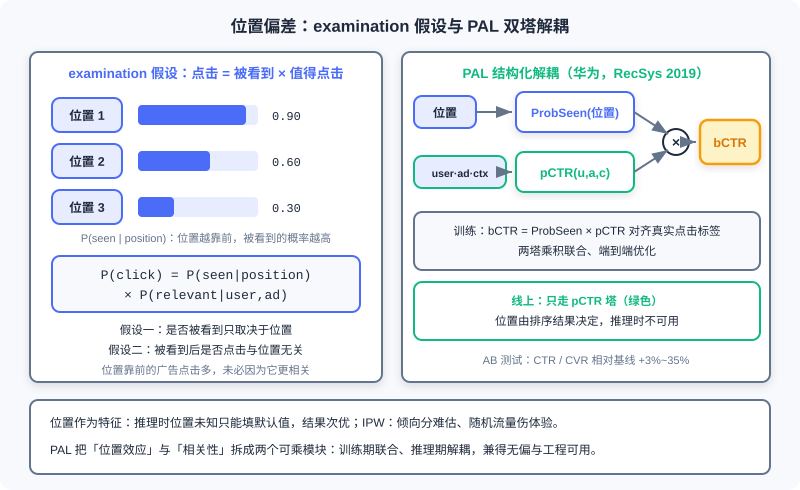
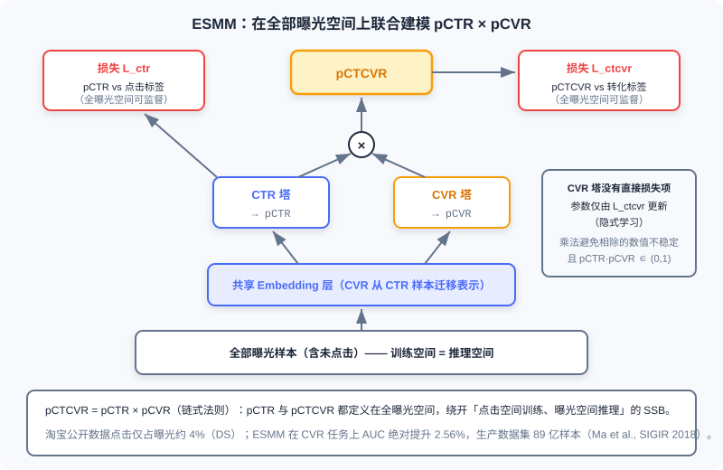
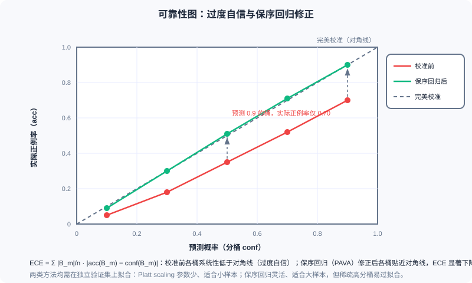

  📖
  ⏱️ ~50 min read
  🎯 Advanced

# Bias and Calibration in Ad Systems

> 📝 **Before You Continue:** This chapter requires reading 12.2 (Billing Models and Core Metrics — how predicted values enter the ranking arithmetic) and 12.4 (Smart Bidding — how the bidding stack consumes pCTR/pCVR predictions layer by layer) first. The chapter connects directly to the ranking models of Part 3: the same model architecture can serve merely as a "ranking key" in recommendation, but in advertising it must serve as a "probability" — this one-word difference gives rise to everything in this chapter.

Suppose you have trained a CTR model with AUC 0.80 — in a recommender system, that is a result to be proud of. Now move it, unchanged, into an ad system. What happens? Very likely a disaster: the model systematically overestimates every ad's true value by a factor of two, the relative order among candidates is perfectly preserved (AUC unchanged), yet every eCPM computation, every bid conversion, and every bill is wrong. Recommender systems penalize "wrong ordering"; ad systems additionally penalize "wrong numbers" — and the latter has almost no seat in the evaluation tables of model papers.

This chapter is the core of Part 12's measurement system, and its subject is one that plays out in industry every day with real money on the line: **Bias and Calibration**. Across the previous chapters, 12.2 established the ruler of eCPM, 12.3 designed the auction mechanisms, and 12.4 let the platform bid on advertisers' behalf — all of these mechanisms consume the model's predicted values. Whether the predictions themselves are accurate, where systematic bias comes from, and how to measure and correct it — that is the "measurement system" this chapter builds. Measurement is the foundation of mechanisms and bidding.

After reading this chapter, you will be able to:

- Distinguish **calibration** from **discrimination**, and explain why a high-AUC model can produce completely unusable eCPMs
- Decompose **position bias** with the examination hypothesis, and compare the applicability and costs of the three debiasing approaches: "position as a feature / IPW / PAL"
- Define **sample selection bias (SSB)** and data sparsity, write down ESMM's entire-space modeling objective and loss, and explain why the CVR tower is "implicitly learned"
- Describe how **winner's bias** and **delayed feedback** contaminate training and calibration labels, and why exploration traffic is the source of unbiased signals
- Calibrate on an independent validation set with Platt scaling and isotonic regression (PAVA), and assess calibration quality with reliability diagrams, ECE, and PCOC
- Complete 5 tiered practice problems, working through the full chain from computing ECE by hand to fitting PAVA

---

## 12.5.0 Why Ad Predictions Are Held to a Higher Standard Than Recommendations: From Relative Order to Absolute Values

The evaluation of the ranking stage in recommender systems is "forgiving." Ranking cares only about the relative order among candidates: square all the scores, take the logarithm, or multiply by any positive constant — the ranking result and AUC do not budge; AUC is **invariant to monotonic transformations of the scores**. Precisely because of this, recommendation models can adopt all kinds of "order-preserving but not value-preserving" architectures and losses (two-tower inner products, pairwise ranking losses, etc.) — as long as the order is right, the business metrics are right. Most of the ranking models you saw in Part 3 are built on this assumption that "relative order suffices."

Ad systems break this safe zone. Under conversion-optimized bidding (OCPC/CPA, see 12.4), the platform's ranking arithmetic is:

$$\text{eCPM} = 1000 \cdot \text{pCTR} \cdot \text{pCVR} \cdot \text{Bid}_{\text{CPA}}$$

The **absolute values** of pCTR and pCVR participate directly in the multiplication (a summary of this pattern in AdaCalib, Wei et al., SIGIR 2022). The smart bidding stack of 12.4 goes further: target conversion cost constraints, budget pacing, ROI optimizers — every layer performs arithmetic on these predictions. Each unit of bias in a prediction becomes a unit of error in the money — and "error" here is not a metaphor, but a discrepancy you can verify directly on the bill.

Worse, multiplication amplifies bias. If pCTR is overestimated by 10% and pCVR is overestimated by 10% — each seemingly "acceptable" on its own — the product is overestimated by 21% ($1.1 \times 1.1 = 1.21$). A bidding chain strung together from multiple models, each with decent AUC, can still end with outrageously large calibration bias at the end of the chain — this is the fate of the multi-score multiplication pattern: **excellence in discrimination cannot hide the distortion of calibration; it amplifies it layer by layer**.

This compels a strict distinction between two orthogonal concepts. **Discrimination**: whether the model can rank positives above negatives, measured by AUC-type metrics. **Calibration**: among the samples the model scores 0.7, is it really the case that about 70% are positive — can the absolute values of the predictions be trusted. Neither guarantees the other: the systematic study of Guo et al. (2017) found that modern deep models are generally **overconfident** — as discrimination improves, predictions drift systematically away from the true probabilities. A model with AUC 0.80 that doubles all estimates is the classic case of "perfect ranking, billing disaster."

The consequences of miscalibration propagate level by level along the bidding stack of 12.4: **wrong bids** (OCPC converts a distorted pCVR into a wrong bid) → **wrong ranking** (the eCPM ruler is distorted; good ads fall off the list while bad ads take their places) → **wrong billing** (GSP converts payments by a distorted pCTR, see 12.3) → **wrong budget forecasting** (pacing's spend-rate forecasts are all distorted). Alimama's engineering practice puts it bluntly: AUC measures only ranking quality and ignores the absolute magnitude of predictions; **absolute accuracy (size-accuracy)** is critical for precise bidding, auction stability, and mixed-delivery fairness — overestimation or underestimation both cause direct revenue loss to the platform or the advertisers.

### 🧠 Mental Model: Feeling the Forehead vs. the Thermometer

> Recommendation ranking is like feeling a patient's forehead with your hand: you only need to judge "warmer than usual" — a relative comparison suffices for the conclusion "should you rest." An ad system is like prescribing medicine to a patient: the dosage is computed from the **absolute number** of 38.5°C; overestimate by one degree and the dose doubles. The same "temperature sensing" — recommendation only needs to give an order, advertising must give a number. Everything in this chapter is the engineering of transforming a "forehead-feeling model" into a "thermometer."

> **Analysis:** To judge whether your scenario needs discrimination or calibration, look at whether the predicted values enter arithmetic: used only for ranking (recall, recommendation fine-ranking) → discrimination first; used for bidding, billing, budget control, ROI settlement (advertising, LTV modeling) → calibration is a first-class citizen. Industrial ad systems usually need both: first a discrimination-strong backbone model to preserve order, then an independent calibration module on top to preserve fidelity — which is exactly the subject of 12.5.4.

---

## 12.5.1 Position Bias: Click = Seen × Worth Clicking

First consider the oldest and most stubborn of the biases. Ads at position 1 naturally have higher CTR than ads at position 5, and a considerable part of this has nothing to do with "whether the ad is good" and everything to do with "whether the position is good." The trouble is that training data comes from logs of "rankings produced by the current policy": good positions were given to ads the system considered good, so "position effects" and "ad quality" are entangled in the logs, and the model credits the position dividend to the ad itself. This is **position bias**.

The mainstream approach formalizes it as the **examination hypothesis** (also called the browsing hypothesis):

$$P(\text{click}) = P(\text{seen} \mid \text{position}) \cdot P(\text{relevant} \mid \text{user, ad})$$

In one sentence: **click = seen × worth clicking**. It carries two implicit assumptions: whether an item is seen depends only on position; whether it is clicked after being seen is independent of position. The former abstracts "visibility of the impression" as a function of position; the latter leaves "the user's interest judgment" to the ad itself — every debiasing scheme revolves around how to pull these two apart.

**Option 1: position as a feature.** The most widely used practice in industry: feed the position number to the model as a feature and let the data learn it. The problem arises at inference time — position is precisely the **output** of ranking, not an input; when scoring, the ad has not yet been assigned a position, so only a default value can be filled in (e.g., "first place" or "the average position"). Different defaults yield different results, and the effect is suboptimal (an analysis of this dilemma in Guo et al., RecSys 2019). Its advantage is that the implementation cost is nearly zero, and many systems "know it is suboptimal and still use it."

**Option 2: inverse propensity weighting.** **Inverse propensity weighting (IPW)** weights samples at different positions by the reciprocal of the propensity score: samples at later positions, which naturally have low propensity, get high weights; after weighting, a "virtual distribution with no positional preference" is restored. Elegant in theory, the difficulty lies in estimating the **propensity score** — estimating it accurately requires running randomized display traffic (randomly placing ads into positions), and random traffic hurts user experience and revenue. Academic research is abundant; industrial adoption is extremely cautious.

**Option 3: PAL structural decoupling.** The **PAL (position-bias-aware learning)** proposed by Huawei (Guo et al., RecSys 2019) directly splits the model into two multiplicative modules following the examination hypothesis:

$$\text{bCTR} = \text{ProbSeen}(\text{position}) \times \text{pCTR}(\text{user, ad, context})$$

During training the two towers are optimized **jointly**: the product bCTR computes the loss against the real click label and updates end to end; online only the pCTR tower is used — position information stops at training time, and the ProbSeen tower serves only the decomposition role. The pCTR tower thus learns "the probability of ad quality with position effects stripped away." Huawei's A/B tests showed CTR and CVR lifts of **+3%~35%** relative to baseline.

The left figure is the examination hypothesis: position determines the probability of "being seen," and only after being seen does "worth clicking" come into play; the right figure is PAL's two-tower architecture — during training ProbSeen and pCTR multiply to align with the click label, while online only the pCTR tower runs, with position determined by the ranking outcome and not usable as an input.

| Approach | Idea | Strengths | Costs / Risks |
|------|------|------|------------|
| Position as a feature | Position enters the model, learned from data | Simplest to implement, most widespread in industry | Position unknown at inference, default-value dilemma, suboptimal |
| IPW | Weight samples by the reciprocal of propensity scores | Clear theoretical unbiasedness | Propensity scores hard to estimate; random traffic hurts experience |
| PAL | ProbSeen × pCTR two-tower decoupling | Joint training, online only the pCTR tower runs | Depends on the examination hypothesis holding |

Finally, a finer-grained class of modeling. The **cascade model** abandons the assumption of "independent positions": users browse from front to back in order, stop upon clicking, and there is at most one click per session; the probability that a position gets examined depends on the content displayed at positions before it — if an earlier position was clicked away, requests for later positions are never issued at all. The examination hypothesis can be viewed as the "positions independent, content-independent" simplification of the cascade model; cascade modeling is closer to real browsing behavior on search pages, at the cost of greater complexity in model and data processing.

> **Analysis:** If left untreated, position bias directly contaminates calibration: what the model learns is "the conditional click probability carrying a positional prior," while online bidding needs "the probability of ad quality free of positional conditions." The gap between the two is the systematic shift on the calibration curve. Keep this foreshadowing in mind — the conclusion of 12.5.4, "debias first, then calibrate," originates exactly here.

---

## 12.5.2 Sample Selection Bias and ESMM: Training Space ≠ Inference Space

The second bias hides in the training pipeline of CVR models. Traditional CVR models are trained on **click samples** — conversion labels can only be produced after a click, naturally. But at inference time? In the eCPM formula, pCVR hangs on **every impression**; the model must score all impressions. Thus **the training space (click space) becomes a proper subset of the inference space (impression space)**, and the two distributions disagree — this is **sample selection bias (SSB)**: you learn patterns in a subspace filtered by the event "the user clicked," yet must extrapolate those patterns to the entire space.

Along with SSB comes **data sparsity (DS)**. Clicks are low-probability events to begin with: in Taobao's public dataset, click samples account for only **about 4%** of all impressions; conversions build on clicks, sparse upon sparse. CVR models have one to three orders of magnitude fewer training samples than CTR models, and direct training easily overfits. SSB skews what the model learns; DS makes the learning unstable — ESMM is the design that takes on both brothers at once.

The starting point of the **ESMM (Entire Space Multi-Task Model)** (Ma et al., Alibaba, SIGIR 2018) is the chain rule of the behavioral sequence:

$$\text{pCTCVR} = \text{pCTR} \times \text{pCVR}$$

The key observation: pCTR (impression → click) and pCTCVR (impression → conversion) are both defined on the **entire impression space**, and the click and conversion labels can be supervised on every impression (clicked or not, converted or not). So two "computable-for-everyone" quantities are used to "clamp out" the pCVR that can only be defined on the click subspace — training happens directly in the inference space, and SSB disappears structurally.

At the bottom is a shared embedding over all impression samples, which branches upward into the CTR tower and the CVR tower, whose outputs multiply into pCTCVR; both losses (L_ctr against the click label and L_ctcvr against the conversion label) are computed on the entire impression space — training space and inference space coincide, and SSB is bypassed.

Three details of the architecture are worth chewing on. **First, the two towers share the embedding**: the CVR tower transfers feature representations from the massive CTR samples, and the sparsity problem DS benefits directly. **Second, multiplication instead of division**: if one explicitly divided as $\text{pCVR} = \text{pCTCVR} / \text{pCTR}$, the numerics would blow up when pCTR is small (clicks are inherently low-probability), and the quotient is not guaranteed to fall in $[0,1]$; the multiplicative form naturally avoids both pitfalls. **Third, the loss structure**:

$$\mathcal{L} = \sum_{i \in \mathcal{D}} l_{\text{ctr}}\left(y_i, \hat{y}_i\right) + \sum_{i \in \mathcal{D}} l_{\text{ctcvr}}\left(z_i, \hat{y}_i \cdot \hat{c}_i\right)$$

where $\mathcal{D}$ is the entire impression space, $y_i$ is the click label, $z_i$ is the conversion label, and $\hat{y}_i$, $\hat{c}_i$ are pCTR and pCVR respectively. Note that the loss contains **no direct supervision term for CVR** — pCVR is an intermediate variable, **implicitly learned**: the CVR tower's parameters are updated only by the gradients of $l_{\text{ctcvr}}$ backpropagated through the product, while the CTR tower and the shared embedding are updated by both terms.

How well does it work? On public datasets, the CVR task's AUC improved **absolutely by 2.56%** — consider that in industry, a 0.1% improvement in CTR/CVR models is already considered significant; 2.56% is a rare magnitude; the production dataset scale reached **8.9 billion samples**. Rarer still is the robustness: as the training set shrinks (sampling rate decreases), ESMM's performance remains stable, outperforming oversampling and UNBIAS baselines — the shared embedding's transfer makes it more valuable the sparser the data.

### 🧠 Mental Model: Written Test First, Then the Interview

> "The interview pass rate" can only be observed among the population filtered by the written test, but when hiring you want to assign "the probability of final employment" to **all applicants**. ESMM's approach: separately compute the written-test pass rate (computable for all applicants) and the "written test + interview" combined pass rate (computable for all applicants); the interview pass rate is implicitly derived as the relationship between the two. Two fully supervisable quantities piece together the unobservable intermediate quantity — this is the entire intuition of entire-space modeling.

> **Analysis:** ESMM's prerequisite is a **clear sequential dependency** between tasks (the impression → click → conversion funnel), so that the chain rule holds; for parallel tasks (e.g., "like" and "favorite"), the product decomposition loses its meaning, and other multi-task architectures should be used instead. Note also: ESMM solves the bias of the "label space" (which samples can obtain labels) and does not handle "position-induced click bias" (12.5.1) — in production systems the two biases often stack, requiring PAL and ESMM in combination.

---

## 12.5.3 Winner's Bias and Delayed Feedback: Two Ways the Labels Themselves Get Contaminated

The third bias is more hidden: it lies not in the sample space but in **the generative process of the labels**. The logs of an auction system record only winners — only ads that win the auction get displayed and get the chance to generate clicks and conversions; the losers' "what if it had been shown to me" is never observed. This is **winner's bias**, the concrete form of selection bias in auction scenarios: the labels used for training and calibration naturally come from the allocation "the system considered optimal" — a biased ledger. The deeper the model learns on this ledger, the larger the bias snowballs — the more the system gives traffic only to ads it likes, the blinder it becomes to the true quality of the other ads.

The way out requires **exploration traffic**: deliberately letting some "ads that would have lost" win occasionally, to generate unbiased feedback signals for the losers. This gives the E&E framework of 12.2.4 yet another identity: exploration is not only for estimating long-tail CTR accurately, but for supplying **unbiased labels** to the entire learning system — an auction system without exploration traffic is training its own inputs with its own outputs; the loop tightens ever further, and the field of view narrows ever more.

The fourth bias concerns time. Conversions often occur hours or even days after the click, yet the system cannot wait — this is **delayed feedback**. The core discipline for coping: calibration must specify an explicit **label window** — for example "clicks observed at 1 day, conversions at 7 days" — and take data strictly by the window's convention. Too short a window, and the labels are not yet mature (late-flowing-back conversions are missed), so calibrating on them necessarily underestimates systematically; too long a window, and data timeliness cannot keep up with distribution drift. **Calibrating before the labels have matured is like measuring things with a ruler that is still deforming** — the calibration curve learns not the true base rate, but a "truncated base rate."

> **Analysis:** These two biases differ in essence from 12.5.1 and 12.5.2: position bias and SSB are problems of the "sample space" (which samples enter training), while winner's bias and delayed feedback are problems of "label generation" (what labels the samples entering training receive). The calibration module is powerless here — it can only faithfully reflect "whatever distribution it is given, that is the distribution it calibrates to." Hence the conclusion of 12.5.4: "debias first, then calibrate" — the order cannot be reversed.

---

## 12.5.4 Calibration Methods and Industrial Practice: A Post-processing Thermostat for Predictions

Now the engineering main course of this chapter. **Calibration** wants this equation:

$$\Pr(Y{=}1 \mid f(x)=p) = p$$

That is, among the samples the model scores $p$, almost exactly $100p\%$ are positive — "say 70% and it really is 70%." First take stock of where the bias comes from. **First, deep models are generally overconfident** (Guo et al., 2017); the stronger the discrimination, the less honest the model need be. **Second, negative sampling shifts the base rate**: when negatives are downsampled at training time (the positive proportion is artificially raised), the model's output reflects **the training distribution's base rate**, not the true online base rate, and deploying it directly necessarily overestimates. **Third, distribution drift**: traffic mix, ad inventory, and user behavior keep changing, and combined with training-serving skew, the ruler measured yesterday is no longer accurate today.

How is calibration quality measured? The **reliability diagram**: bucket the predicted probabilities, with the bucket's mean prediction on the horizontal axis and the bucket's actual positive rate on the vertical axis; points falling on the diagonal mean perfect calibration. The numerical version is the **expected calibration error (ECE)**:

$$\text{ECE} = \sum_{m} \frac{|B_m|}{n}\, \left| \text{acc}(B_m) - \text{conf}(B_m) \right|$$

where $B_m$ is the $m$-th bucket, $\text{acc}$ is the actual positive rate within the bucket, and $\text{conf}$ is the mean prediction within the bucket. One pitfall to watch for when reading reliability diagrams: sparse high-score buckets (e.g., the 0.9–1.0 range) have very few samples and very high noise; a single point off the diagonal is not necessarily distortion — when reading the plot, overlay the per-bucket sample counts.

The red curve is a typical overconfident model: the bucket predicting 0.9 has an actual positive rate of only 0.70, and all buckets sit systematically below the diagonal; after isotonic regression calibration (the green curve), the buckets hug the diagonal and ECE drops markedly.

Two classic post-processing calibration methods, each fitting a different data scale. **Platt scaling**: fit a logistic transform $\hat{p} = \sigma(a \cdot f(x) + b)$ to the raw scores; it has only two parameters and suits small samples where the distortion is a smooth monotonic compression. **Isotonic regression**: fit a free-form monotone step function, solved by **PAVA (Pool Adjacent Violators Algorithm)** — after sorting by prediction, whenever adjacent buckets violate monotonicity, merge and average them, repeatedly merging until the sequence is monotone. It is more flexible and suits large samples, but in sparse regions (extremely high/low score buckets) it easily overfits noise. The shared discipline of both: **after the model is frozen, fit on an independent validation set** — fitting the calibration curve on the training set amounts to letting the curve memorize the training noise and the training base rate, which is biased.

How does industry deploy this? Three landmark cases.

- **Google** (McMahan et al., KDD'13, "Ad Click Prediction: a View from the Trenches"): CTR calibration uses **isotonic regression** — at massive data scale, the flexibility of a step function beats a two-parameter logistic.
- **Facebook** (He et al., ADKDD'14, "Practical Lessons from Predicting Clicks on Ads at Facebook"): instead of isotonic regression, **prior correction** under negative sampling — if negatives are downsampled by ratio $w$, use a closed-form formula to restore the output to the true base rate: $\hat{p}' = \dfrac{\hat{p}}{\hat{p} + (1-\hat{p})/w}$, zero cost, no fitting required.
- **Alimama**: the calibration module is **decoupled** from the prediction/ranking modules — plug-and-play, able to respond to distribution drift independently and quickly; the algorithms evolved along one path — **SIR** (smoothed isotonic regression: bucketing + isotonic + linear scaling) → **Bayes-SIR** (Bayesian priors to solve cold start and sparsity) → **RTW-BSIR** (real-time fluctuation correction, to fight distribution drift) → **PCCEM** (using short-term post-click signals to predict long-term conversions, confronting delayed feedback head-on), deployed online since 2018.

Evaluating calibration cannot stop at one global number. Industrial metric suites usually include: **PCOC** (the ratio of predicted CTR to posterior CTR, the closer to 1 the better), **Cal-N** (a bias measure aggregating multi-cluster PCOC), and **GC-N** (a dimension-weighted calibration metric). ECE looks at the overall shape, PCOC at the overall ratio, Cal-N/GC-N at slices — because **global calibration can mask sliced distortion**: an overall PCOC = 1 may hide one half of the traffic overestimated and the other half underestimated, canceling each other out. AdaCalib (Wei et al., SIGIR 2022) pushes calibration exactly to field-level granularity: a learned family of isotonic functions plus adaptive guidance from posterior statistics, so that every feature slice is calibrated individually.

Finally, the operations perspective — calibration's biggest difference from an ordinary "model module." Calibration **is not a one-off project**: traffic mix and user behavior keep changing, requiring **hourly/daily high-frequency refitting** on recent held-out logs — independent of the much slower cadence of full-model retraining. Online guardrails are needed: continuously monitor the **observed-vs-predicted ratio** (actual CTR ÷ predicted CTR), alerting and triggering refits when the deviation from 1 exceeds a threshold. And **calibrate per segment** (fitting separately by traffic slice, ad industry, device, etc.) to counter the "global masking slices" problem above. Repeat once more this chapter's most important operational discipline: **debias first, then calibrate** — what hurts calibration most is precisely position bias and selection bias; when the labels and samples themselves are biased, the calibration module will only faithfully calibrate the model to that "biased world."

> **Analysis:** The engineering charm of the calibration module lies in being "small and fast": it does not touch the backbone model and only corrects the "score → probability" mapping, so it can be refit at high frequency, gray-released independently, and rolled out segment by segment. This is the same philosophy as the "dynamic features vs online learning" discussion of 12.2.4 — pull the fast-changing part out of the slow-changing part, and let each iterate at its own tempo. Mechanisms (12.3) and bidding (12.4) evolve quarterly, backbone models daily, calibration hourly: a mature ad system is an ensemble of many different metronomes.

---

## 12.5.5 Measurement Is the Foundation of Mechanisms and Bidding

Place this chapter's lessons back into the panorama of Part 12, and you will see a self-reinforcing error loop: **calibration error → distorted eCPM arithmetic → misaligned auction ranking and unfair billing (12.3's GSP payments convert by a distorted pCTR) → unstable pacing spend-rate forecasts (12.4) → chaotic budget consumption rhythm → in turn changing the traffic's exploration ratio and impression distribution → reshaping the label distribution**. The error comes full circle and begins feeding its own source — this is why bias governance cannot be "one module's business": it is a circular chain, and any link's miscalibration propagates around the loop and amplifies, ultimately returning to the starting point to contaminate the training data itself.

So we can give Part 12 a multiplicative summary: **ad system = mechanism design (12.3) × bidding strategy (12.4) × measurement system (this chapter)**. Mechanisms decide "how the rules are set," bidding decides "how predictions are spent," and measurement decides "whether the predictions themselves are accurate." All the elegance of the former two — GSP's envy-free equilibrium, VCG's externality pricing, OCPC's cost constraints — is built on the assumption that "predicted value ≈ true probability." Measurement is the foundation: if the foundation sways an inch, the economics edifice above shakes a foot. In the ecosystem panorama of 12.1, the platform promises advertisers "we help you spend more efficiently"; the last mile of fulfilling that promise is precisely this invisible measurement system.

Yet this multiplication still leaves out one more fundamental variable: **how much conversion data the platform can observe at all**. No matter how precise the measurement system is, if conversions happen outside the platform's domain and the labels are incomplete, all that precision is moot. This axis — open-loop versus closed-loop — is where [12.6](open-closed-loop.md) closes out the entire Part 12.

The last perspective is reserved for the convergence of recommendation and advertising. Recommender systems are being "ad-ified": traffic allocation, guaranteed-delivery contracts, diversity constraints — the language of mechanism design is entering recommendation ranking; ad systems are also being "recommendation-ified": mechanism constraints are being written into models for end-to-end learning — the EGA of [8.3](../part8-e2e/e2e-advertising.md) is the attempt to turn "allocation and payment into differentiable networks." But however the two routes converge, they share the same foundation: representation learning (Part 3) + the science of measurement (this chapter). For engineers, understanding "under what conditions a model's score is a probability" is the last lesson in moving from recommendation engineer to ad algorithm engineer — and the prerequisite for the machine's judgments to be entrusted with real money.

---

## ⚠️ Common Mistakes in 12.5

| # | Mistake | Example | Why It's Wrong | Fix |
|---|---------|---------|---------------|-----|
| 1 | Assuming a high AUC means the predictions are good enough | "The model has AUC 0.80, plug it straight into the bidding stack" | AUC measures only relative order and is invariant to monotonic transformations of scores; eCPM/bidding/billing consume absolute values, and systematic overestimation miscalculates the money all the same | Monitor calibration metrics such as PCOC/ECE alongside, and pass predictions through a calibration module before they enter arithmetic |
| 2 | Treating calibration as part of training rather than independent post-processing | "Add a sigmoid to the model's last layer and call it calibrated" | Calibration corrects the "score → probability" mapping and needs high-frequency refitting on an independent validation set; co-training with the backbone contaminates both and cannot keep up with drift | Freeze the backbone, fit the calibration curve on a held-out set, deploy and update independently |
| 3 | Fitting the calibration curve on the training set | "After training converges, run isotonic regression on the training set" | The calibration curve memorizes the training noise and the training base rate, and systematically distorts the moment the online distribution shifts | The calibration curve must be fit on an independent validation set (recent held-out logs) |
| 4 | Ignoring base-rate drift from negative sampling | "Downsample negatives 10× for training, deploy the model output directly" | The training distribution's positive proportion is artificially raised; the output reflects the training base rate, not the online base rate | Closed-form restoration with Facebook-style prior correction, or recalibration on the true distribution after negative sampling |
| 5 | Still feeding position into the pCTR tower when PAL goes live | "Keep the position feature, always fill in rank 1 online" | Position is an output of ranking, not an input; filling in a default makes the model carry the offline positional prior, biasing predictions | PAL inference runs only the pCTR tower; position information stops at the training-time decomposition |
| 6 | Calibrating before the label window has matured | "7-day conversion window, refit calibration on day 3 after launch" | Late conversions have not yet flowed back, labels are systematically low, and the calibration curve learns a truncated, wrong base rate | Fix the label-window convention, and admit only data whose window has matured into the calibration fitting set |

---

## Chapter Summary

### 📌 Key Takeaways

| Concept | Key Points | Why It Matters |
|---------|-----------|----------------|
| Calibration ≠ discrimination | Discrimination = relative order (AUC, invariant to monotonic transforms); calibration = trustworthy absolute values ($\Pr(Y{=}1\mid f{=}p)=p$); the two are orthogonal | A high-AUC model can be badly calibrated; advertising's arithmetic consumes absolute values |
| Bias amplification | $\text{eCPM} = 1000 \cdot \text{pCTR} \cdot \text{pCVR} \cdot \text{Bid}$: multiplying multiple scores amplifies each model's calibration bias | Each model's AUC can be decent while the end of the chain is still severely distorted |
| Position bias | examination hypothesis $P(\text{click}) = P(\text{seen}\mid\text{pos}) \cdot P(\text{relevant}\mid u,a)$; three approaches: position as a feature / IPW / PAL | PAL (Guo et al., RecSys 2019): ProbSeen × pCTR joint training, online only the pCTR tower runs, A/B +3%~35% |
| SSB and ESMM | click-space training ≠ impression-space inference; ESMM models the entire space with pCTCVR = pCTR × pCVR, two towers sharing the embedding | Solves SSB and DS simultaneously (clicks are only ~4% of impressions); CVR has no direct loss term, implicitly learned; CVR AUC absolutely +2.56% |
| Winner's bias and delayed feedback | logs record only winners; late conversions require a fixed label window (1-day clicks / 7-day conversions) | Exploration traffic supplies unbiased labels; calibrating on immature labels is necessarily biased |
| Calibration methods | Platt scaling (small samples) vs isotonic regression PAVA (large samples, overfits in sparse regions); both require an independent validation set | Google uses isotonic regression, Facebook uses negative-sampling prior correction, Alimama SIR→Bayes-SIR→RTW-BSIR→PCCEM (deployed since 2018) |
| Calibration operations | hourly/daily high-frequency refitting; observed-vs-predicted guardrails; per-segment calibration (PCOC/Cal-N/GC-N) | Debias first, then calibrate — position bias and selection bias hurt calibration most |

### ❓ FAQ

**Q1: Which matters more in the end, AUC or calibration?**
> A: It depends on what the predictions are used for. When they serve only ranking (recall, recommendation fine-ranking), discrimination comes first — multiplying all scores by a constant is harmless; the moment they enter arithmetic (bidding, billing, budget control), calibration is the line between life and death. The standard posture of industrial ad systems is "a discrimination-strong backbone + independent high-frequency post-hoc calibration" — both, each iterating at its own tempo.

**Q2: ESMM's loss has no CVR term — can the CVR tower really learn anything?**
> A: Yes. $l_{\text{ctcvr}}$ measures the discrepancy between $z_i$ and $\hat{y}_i \cdot \hat{c}_i$; the partial derivative with respect to $\hat{c}_i$ (pCVR) is nonzero, and gradients backpropagate through the product to the CVR tower — that is what "implicit learning" means. The cost is that the CVR tower's signal is less clean than direct supervision; the payoff is that it trains on the entire impression space by construction, bypassing SSB; combined with the shared embedding transferring representations from CTR samples, the sparsity problem DS is relieved as well.

**Q3: After negative sampling, why can't you trust the model output directly? And how do you fix it?**
> A: Downsampling negatives artificially raises the training distribution's positive proportion, and the model learns probabilities under the "training base rate." Two fixes: the closed-form prior correction $\hat{p}' = \hat{p}/(\hat{p} + (1-\hat{p})/w)$ (Facebook ADKDD'14, $w$ being the negative retention ratio, zero cost); or recalibration on a validation set from the true distribution. The former is fast, the latter stable; industry often runs both in parallel as cross-checks.

### 🔗 Connections to Other Chapters

- **12.2** (billing models and core metrics) — the scale of the eCPM ruler is determined by pCTR; the "regression over ranking" foreshadowing planted in 12.2.4 unfolds in this chapter into a complete calibration methodology.
- **12.3** (auction mechanisms) — GSP payment converts by the next bidder's eCPM divided by one's own pCTR, so calibration distortion leads directly to unfair billing; all of the mechanism's theoretical properties assume the predictions are trustworthy.
- **12.4** (smart bidding) — the bidding stack consumes pCTR/pCVR layer by layer, the main battlefield of this chapter's "error propagation chain"; calibration guardrails are the precondition for pacing stability.
- **3.x** (ranking models) — same model architectures, but the ad scenario imposes additional requirements on absolute-value calibration; this chapter can be read as Part 3's "probabilistic completion."
- **8.3** (EGA) — after mechanisms go end-to-end, calibration remains the translation layer from model scores to economic quantities; generative advertising equally cannot escape the measurement discipline that "scores must be probabilities."

---

## Practice Problems

Work through all problems in order — they get progressively harder. Each has a complete solution you can reveal after trying it yourself.

---

**Problem 12.5.1 — Diagnosing Systematic Underestimation with PCOC** 🟢 Easy

On an ad segment, the model's predicted mean pCTR is 0.020; 1 million impressions actually produced 26,000 clicks. In the same auction there is a competing CPM-billed ad with a bid of 45 yuan.
(a) Compute PCOC (predicted CTR ÷ posterior CTR), and determine the direction and magnitude of the bias.
(b) A CPC ad with bid 2.0 yuan has a true CTR proportionally consistent with the model's prediction. What is its fate in this auction? What should it have been?

💡 Solution (click to reveal)

**Approach:** PCOC = predicted mean ÷ posterior mean; then compute eCPMs with the predicted and true pCTR respectively to compare auction outcomes.

- (a) Posterior CTR = 26,000 / 1,000,000 = 0.026. PCOC = 0.020 / 0.026 ≈ **0.77**; the model systematically **underestimates by about 23%**.
- (b) The CPC ad's true eCPM = $0.026 \times 2.0 \times 1000 = 52$ yuan; the model's predicted eCPM = $0.020 \times 2.0 \times 1000 = 40$ yuan $< 45$, so it **loses** the auction. But by the true value 52 > 45, it **should have won** — the underestimation cost the platform an impression with higher expected revenue.

**Key points:**
- The direction of PCOC's deviation from 1 directly indicates over- or underestimation; it is the most common online calibration guardrail metric.
- Calibration bias changes not just "the number reported" but auction outcomes and platform revenue — this is the first link of the consequence chain in 12.5.0.

---

**Problem 12.5.2 — Examination Decomposition and Debiased Ranking** 🟡 Medium

The probabilities of being seen at positions 1 and 2 are $P(\text{seen}) = 0.90$ and $0.60$ respectively. The logs show: ad A's observed CTR at position 1 is 4.5%, ad B's at position 2 is 2.4%.
(a) Compute the two ads' $P(\text{relevant} \mid \text{user, ad})$ under the examination hypothesis.
(b) If you rank directly by observed CTR, by how many times is A's advantage overestimated? What does this mean for bid conversion?

💡 Solution (click to reveal)

**Approach:** Observed CTR = $P(\text{seen}) \times P(\text{relevant})$; dividing recovers the debiased relevance.

- (a) A: $4.5\% / 0.90 = 5\%$; B: $2.4\% / 0.60 = 4\%$.
- (b) Observed order: A/B = $4.5/2.4 = 1.875$ times; the debiased true quality ratio = $5/4 = 1.25$ times. Ranking directly by observed CTR overestimates A's advantage by about $1.875/1.25 = 1.5$ times — the position dividend is booked as ad quality. In bid conversion (eCPM = pCTR × bid × 1000), this is equivalent to systematically overestimating high-position ads and underestimating low-position ones; every revenue forecast after swapping slots is distorted.

**Key points:**
- The examination decomposition is the minimal tool for a "debiased A/B comparison": dividing by position propensity restores comparable quality.
- Position bias hurts not only ranking but all arithmetic that takes pCTR as an input — exactly why 12.5.4 says "debias first, then calibrate."

---

**Problem 12.5.3 — ESMM's Multiplicative Structure and the Source of Its Gradients** 🟡 Medium

For an impression sample in ESMM, the model outputs: pCTR $= 0.02$, pCTCVR $= 0.001$.
(a) What is this sample's pCVR?
(b) Why doesn't ESMM model it as direct division $\text{pCVR} = \text{pCTCVR} / \text{pCTR}$, instead insisting on the multiplicative structure?
(c) The loss $\mathcal{L} = \sum l_{\text{ctr}} + \sum l_{\text{ctcvr}}$ contains no direct supervision term for CVR. Explain where the CVR tower parameters' gradients come from, and spell out the exact meaning of "implicit learning."

💡 Solution (click to reveal)

**Approach:** Chain rule + partial derivatives of the product.

- (a) $\text{pCVR} = \text{pCTCVR} / \text{pCTR} = 0.001 / 0.02 = 0.05$ (here as an after-the-fact conversion, not a modeling approach).
- (b) Division has two pitfalls: when pCTR is small (clicks are inherently low-probability, e.g., 0.001), the quotient explodes numerically and can exceed 1, violating the probability range; the multiplicative form guarantees $\text{pCTR} \cdot \text{pCVR} \in (0,1)$ and numerical stability.
- (c) $l_{\text{ctcvr}}$ measures the discrepancy between the conversion label $z$ and $\hat{y} \cdot \hat{c}$. For the CVR tower parameters $\theta_{\text{cvr}}$, the gradient $\partial l_{\text{ctcvr}} / \partial \theta_{\text{cvr}} = (\partial l_{\text{ctcvr}} / \partial \hat{y}\hat{c}) \cdot \hat{y} \cdot \partial \hat{c} / \partial \theta_{\text{cvr}}$ backpropagates through the product — **the CVR tower is updated only by $l_{\text{ctcvr}}$**; the CTR tower and the shared embedding are updated by both terms. "Implicit learning" means pCVR has no label or loss of its own, existing only as an intermediate variable driven by the product's residual.

**Key points:**
- The multiplicative structure achieves three things at once: entire-space training (bypassing SSB), numerical stability, and a legal value range.
- Even when the CTR tower already predicts clicks well, the CVR tower still receives gradients — the residual between the conversion label and $\hat{y}\hat{c}$ is its learning signal.

---

**Problem 12.5.4 — Facebook's Negative-Sampling Prior Correction** 🔴 Hard

To speed up training, negatives are downsampled with retention ratio $w = 0.1$ (1 of every 10 negatives kept). A certain ad's model output online is $\hat{p} = 0.05$ (on the training-distribution convention).
(a) Starting from "downsampling changes the positive proportion," derive the prior correction formula $\hat{p}' = \hat{p} / (\hat{p} + (1-\hat{p})/w)$, and compute the corrected probability.
(b) Without correction, in which direction does the estimate err, and by roughly how many times?
(c) Besides the closed-form correction, what other equivalent approaches exist? What are their respective conditions of applicability?

💡 Solution (click to reveal)

**Approach:** Write out the relation between the positive proportion in the downsampled training distribution and the true proportion, then invert.

- (a) Let the true positive probability be $q$. In the downsampled training distribution: positive mass $q$, negative mass $w(1-q)$, so $\hat{p} = \dfrac{q}{q + w(1-q)}$. Invert for $q$: $\hat{p}'(q + w(1-q)) = q \Rightarrow \hat{p}w = q(1 - \hat{p} + \hat{p}w) \Rightarrow q = \dfrac{\hat{p}w}{1 - \hat{p}(1-w)}$, which after algebraic manipulation equals exactly $\dfrac{\hat{p}}{\hat{p} + (1-\hat{p})/w}$. Substituting $\hat{p} = 0.05, w = 0.1$: $q = 0.05 / (0.05 + 0.95/0.1) = 0.05 / 9.55 \approx \mathbf{0.00524}$.
- (b) Without correction it overestimates: $0.05$ vs the true $0.00524$, an overestimate of about **9.5 times** (the odds are amplified by about $1/w = 10$ times; the larger the probability, the larger the absolute difference amplified). Bidding, eCPM, and budget consumption are all computed at an inflated magnitude of roughly 10 times.
- (c) Equivalent approaches: recalibration on a **validation set from the true distribution** (Platt scaling or isotonic regression), which naturally restores the base rate during fitting — suitable when the distribution is complex and the distortion is not a single base-rate shift; the closed-form prior correction wins on zero cost and interpretability, suitable for "pure base-rate drift." Industry runs both in parallel, cross-checking each other.

**Key points:**
- The derivation of the correction formula always starts by writing out "the composition of the training distribution," then inverting for the true distribution.
- This is the quantitative version of Common Mistake #4: negative sampling is no free lunch — the output must be converted back to the online convention.

---

**🏆 Problem 12.5.5 — Computing ECE by Hand and PAVA Isotonic Calibration**

Given 8 samples (sorted by predicted value):

| Predicted value | 0.1 | 0.2 | 0.3 | 0.4 | 0.6 | 0.7 | 0.8 | 0.9 |
|---|---|---|---|---|---|---|---|---|
| True label | 0 | 0 | 0 | 0 | 1 | 1 | 0 | 1 |

(a) Compute ECE with two buckets $[0, 0.5)$ and $[0.5, 1]$.
(b) Run the PAVA algorithm on all 8 points to fit the isotonic calibration, writing out each merge step and the final calibrated output for each prediction.
(c) Recompute the two-bucket ECE with the calibrated values.
(d) Point out the engineering flaw of "fitting and evaluating on the same data" above, and the risk of PAVA outputting extreme steps such as 0 and 1.

💡 Solution (click to reveal)

**Approach:** ECE weights buckets by size; PAVA repeatedly merges adjacent blocks that violate monotonicity after sorting by prediction.

**(a)** Bucket 1 $[0,0.5)$: conf $= (0.1+0.2+0.3+0.4)/4 = 0.25$, acc $= 0/4 = 0$, $|\text{diff}| = 0.25$. Bucket 2 $[0.5,1]$: conf $= (0.6+0.7+0.8+0.9)/4 = 0.75$, acc $= 3/4 = 0.75$, $|\text{diff}| = 0$.

$$\text{ECE} = \frac{4}{8} \times 0.25 + \frac{4}{8} \times 0 = 0.125$$

**(b)** Initial block-mean sequence (sorted by prediction): $0,\ 0,\ 0,\ 0,\ 1,\ 1,\ 0,\ 1$. Check monotonicity: positions 6→7 show a $1 \to 0$ violation. Merge blocks $\{(0.6,1),(0.7,1),(0.8,0)\}$ with mean $2/3$. New sequence: $0,\ 0,\ 0,\ 0,\ 2/3,\ 2/3,\ 2/3,\ 1$, now monotone; PAVA terminates. Calibrated outputs:

| Original prediction | 0.1 | 0.2 | 0.3 | 0.4 | 0.6 | 0.7 | 0.8 | 0.9 |
|---|---|---|---|---|---|---|---|---|
| Calibrated value | 0 | 0 | 0 | 0 | 2/3 | 2/3 | 2/3 | 1 |

**(c)** Bucket 1: conf $= 0$, acc $= 0$, diff $= 0$. Bucket 2: conf $= (2/3 \times 3 + 1)/4 = 0.75$, acc $= 0.75$, diff $= 0$. $\text{ECE} = 0$ — after calibration, a perfect fit.

**(d)** Two flaws. First, **data leakage**: the calibration curve is fit and evaluated on the same data, so ECE = 0 partly reflects overfitting — in engineering you must fit on an independent validation set and evaluate on a different batch of data. Second, **extreme steps in sparse regions**: PAVA produces hard boundaries like 0 and 1, which are extremely unstable in sample-sparse high/low-score regions (here each bucket has only 4 samples); Alimama's use of smoothing (SIR) and Bayesian priors (Bayes-SIR) is precisely to mitigate this, and small-sample scenarios can also fall back to Platt scaling with fewer parameters.

**Key points:**
- The essence of PAVA: repeatedly merge "adjacent violators" by averaging until the mean sequence is monotone — it is the optimal solution of isotonic regression.
- ECE depends on the bucketing scheme; in engineering, look simultaneously at reliability diagrams (with sample counts overlaid), PCOC, and sliced metrics to avoid being misled by a single number.

