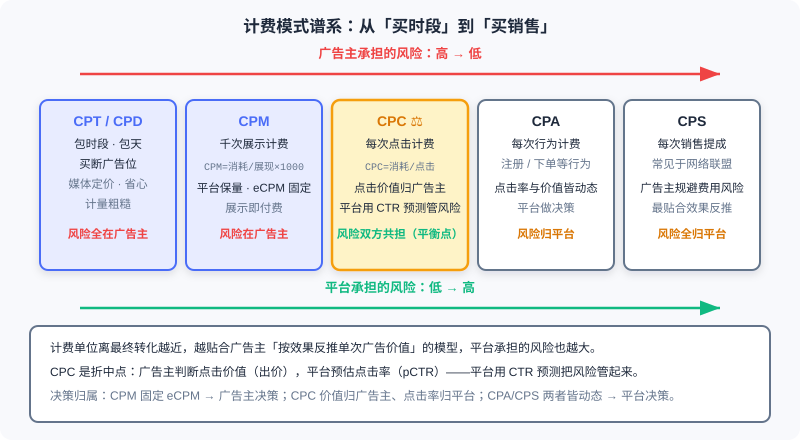
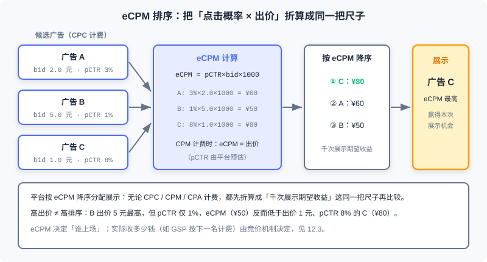
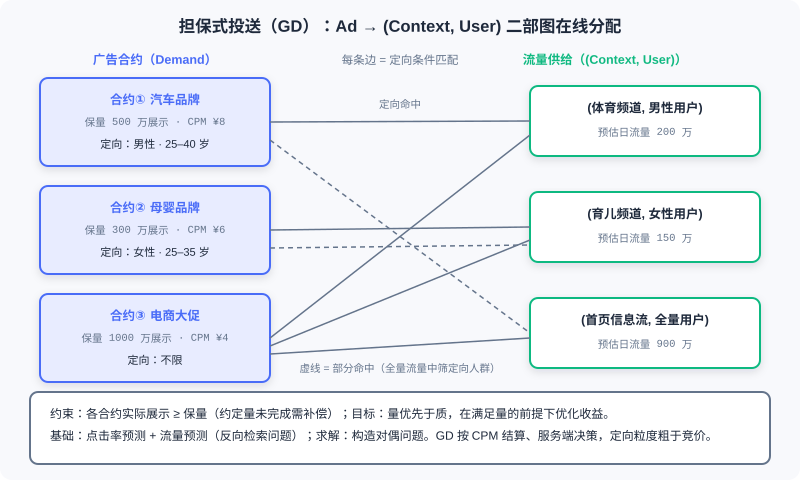

  📖
  ⏱️ ~40 min read
  🎯 Intermediate

# Billing Models and Core Metrics

> 📝 **Before You Continue:** Please read 12.1 (the advertising ecosystem panorama) first, to understand the division of roles among advertisers, media, and platforms along the transaction chain. The CTR modeling in 12.2.4 of this chapter carries the same lineage as the ranking models of Part 3 — if you have already read the CTR models in 3.x, you can treat this chapter as their "economic restatement" in the advertising setting.

You type "running shoes" into a search box, and the first result on the page is an ad — why does it deserve that spot? How much does the platform expect to earn from that single impression? Behind these questions lies no mystical algorithmic black box; the answer is written in two things: the **Billing Model**, which determines who pays at which step, and **Metrics**, which determine the yardstick the system uses to compare candidate ads.

Recommender systems optimize a fuzzy blend of user experience and business goals, whereas advertising systems have had "money" written into their objective function from day one. The billing model acts as a **constitution**: it stipulates how risk is allocated between advertisers and media, and every downstream component — retrieval, ranking, traffic forecasting, exploration strategies — must operate within its frame. Change the billing model, and the shape of the entire tech stack changes with it.

This chapter starts from the clash between the value models of advertisers and media, walks the billing spectrum from CPT to CPS, builds the ranking logic with eCPM as the unified measure, and then dives into the engineering details of guaranteed-contract online allocation and click-through rate estimation. All of this is the foundation for the auction mechanisms of 12.3 — you must first understand "how the bill is computed" before you can understand "how the price is set".

After reading this chapter, you will be able to:

- List the billing formulas, key decision-makers, and risk allocation of each billing model: CPT/CPD, CPM, CPC, and CPA/CPS
- Characterize ad performance with the three metrics CTR, CVR, and ROI, and carry out cross-billing-model ranking computations with $\text{eCPM}=\text{pCTR}\times\text{bid}\times 1000$
- Explain the divide between brand advertising and direct response advertising in billing and transaction modes
- Describe the bipartite-graph structure of **Guaranteed Delivery (GD)** and **Online Allocation**, and the ideas behind solving them
- Explain why CTR estimation is a regression problem rather than a ranking problem, along with cold-start back-off and E&E as coping strategies
- Complete 5 graded practice problems, working through the computational chain from metric conversion to GSP payments

---

## 12.2.0 Why the Billing Model Is the "Constitution" of an Advertising System

Every commercial product must answer the question "how do we collect money", but what makes online advertising special is this: **the choice of billing unit is, in essence, an allocation of the risk created by outcome uncertainty**. From impression to click to conversion, each step forward carries more uncertainty; charging at a given step amounts to pushing all risk downstream of that step onto one party. That is why the billing model is the constitution of an advertising system — it precedes every algorithm and defines the rules of the game.

Start from the **Advertiser**'s side. The core of the advertiser's value model is to **derive the value of a single ad backward from its final outcome**. Suppose the marketing cost of selling one car is 2,000 yuan and the conversion rate from ad impression to completed purchase is 0.1%; then the value of one ad impression is $2000 \times 0.1\% = 2$ yuan — no matter how golden the media considers its homepage banner, the scale in the advertiser's mind recognizes only this number. Real-world computations are more involved, but the principle stands: work backward from the money. By this logic, **Cost Per Action (CPA)** or even **Cost Per Sales (CPS)** pricing is the closest fit to the advertiser's value model.

Now stand on the side of the **media / Supply Side**. What the media cares about is not how many cars the advertiser can sell, but **how much revenue each unit of ad inventory can generate** — what the homepage banner is worth today, and whether it will still be worth that tomorrow. This naturally gives rise to "sell-the-resource" pricing models such as **Cost Per Time (CPT)** and **Cost Per Mille (CPM)**: treat the ad slot as a shop front awaiting tenants, with direct measurement and stable income.

Clearly, the two sides perceive "ad inventory usage" differently, so a game is inevitable — one misconception to guard against is that media interests and advertiser interests are locked in a **correlated game**, not aligned. The eventual outcome of this game is that ad measurement evolved into two major categories. **Direct Response advertising**: the supply side computes ad volume from ad performance; this model originally served advertiser interests — early on it could indeed hurt the supply side, because when ad creatives were poor, click-through rates stayed low even with heavy exposure allocation. As technology advanced, however, this problem was overcome: by analyzing data such as ad click-through rates, the system automatically lowers the delivery share of these "low-profit" ads or demands higher bids from advertisers. **Brand Awareness advertising**: billed by impressions, which is more straightforward for the supply side and better suited to ad demand with no direct conversion goal (such as new-product awareness).

### 🧠 Mental Model: Three Ways to Collect Rent from a Shop Front

> Think of the media as a landlord. CPT is "leasing the whole building": the tenant pays fixed rent; whether business thrives or dies is no business of the landlord's, and all risk sits with the tenant. CPC is "charging per store visitor": the landlord must attract foot traffic likely to walk in, while the tenant pays for every person who enters. CPS is the "pure-commission clerk": a cut only when something sells, nothing when it doesn't — all risk falls on the platform doing the hawking. Every move along the billing-model spectrum is, in essence, a redistribution of risk between landlord and tenant.

> **Analysis:** The choice of billing model is not a purely technical decision; it depends on both parties' data capabilities and their control over the conversion funnel. CPA/CPS-style settlement only becomes truly viable when the platform has sufficient control over the full "impression-to-purchase" funnel and the advertisers (sellers) share roughly the same service workflow — Taobao's advertising platform, for example. The less controllable the funnel, the more the billing unit must shrink back toward the impression end.

---

## 12.2.1 The Billing Spectrum: From Buying Time to Buying Sales

With "risk allocation" as the key, we can arrange the mainstream billing models along a spectrum: from buying out time, to paying per impression, per click, per action, per sale. The closer the billing unit sits to the final conversion, the better it fits the advertiser's value model — and the more risk the platform takes on.

**Cost Per Time (CPT)** and **Cost Per Day (CPD)** sit at the far left of the spectrum. Many websites in China still sell ad slots on a fixed "X yuan per month" basis; Alimama's weekly-billed ads and portal sites' monthly banner deals belong to this category. It is crude — who saw the impression, whether anyone looked at all, is unknown, so the client's interests cannot be guaranteed — but it is also hassle-free and brings the website stable income, which is why it is common in **contracted brand advertising**, occupying the core banner modules of major websites. Compared with CPS, CPD places modest demands on the foundations of a partnership and makes deals easy to strike; its weakness is that, over long-term cooperation, it is less real-time and effective than CPS.

**Cost Per Mille (CPM)** takes the first step toward performance:

$$\text{CPM}=\frac{\text{Spend}}{\text{Impressions}}\times 1000$$

where "Spend" is what the advertiser pays to run the ad. CPM means cost per thousand impressions: charging by exposure volume started advertising's evolution toward "performance orientation", and it is also a common billing method in RTB (Real-Time Bidding) systems. **Cost Per Click (CPC)** goes one step further:

$$\text{CPC}=\frac{\text{Spend}}{\text{Clicks}}$$

Keyword advertising and other performance-based formats generally adopt this pricing model; it is likewise the mainstream billing method in RTB. **Cost Per Action (CPA)** charges according to the actions each visitor takes on the ad, where "action" has a specific definition — completing a transaction, acquiring a registered user, and so on. **Cost Per Sales (CPS)** converts the ad placement fee into a commission on actual product sales: to hedge against ad-spend risk, the advertiser pays a commission on the actual sales generated after the click, commonly seen in the billing of small websites inside affiliate networks.

**dCPM (dynamic CPM)** deserves a separate word. It is the settlement system widely adopted by DSPs (Demand-Side Platforms): unlike the fixed CPM spoken of in the market (called flat CPM accordingly), dCPM was born on RTB technology and means that **the bid for every single impression varies**. Each bid is computed in real time from the performance of the advertiser's campaign (usually CPS), yielding the price most favorable to the advertiser and thus protecting the advertiser's interests; and because settlement with the media is still per impression, the media's revenue is also secured. In one sentence: settle with the media by impressions, optimize for the advertiser by performance — dCPM is precisely an engineering resolution of the two-sided game we described in 12.2.0.

As shown, the left end of the spectrum presses risk onto the advertiser's shoulders, the right end onto the platform's, with CPC balancing in between. More precisely, risk allocation can be labeled by "who makes the key decision": **in a CPM market the eCPM is fixed, which amounts to handing all decisions (and risk) to the advertiser** — the platform guarantees impressions, but whether they bring clicks and conversions afterwards is none of its business. **The CPC market is the compromise**: the value of a click is judged by the advertiser (expressed in the bid), while the click-through rate is dynamically estimated by the platform, which knows the traffic better (Google, for example) — the platform uses CTR prediction to manage the share of risk it carries. **In CPA/CPS markets both are dynamic, which amounts to the platform making the decisions and bearing the risk**; Taobao's advertising platform adopts this kind of settlement precisely because its advertisers (sellers) share roughly identical service workflows and the platform's grip on the conversion funnel is strong enough.

| Billing Model | Billing Unit | Who Makes the Key Decision | Risk Allocation | Typical Scenarios |
|---------|---------|------------|---------|---------|
| CPT/CPD | Time slot / day | Media sets price, advertiser buys out | Advertiser | Brand takeovers, core banners |
| CPM | Per thousand impressions | Platform guarantees volume, eCPM fixed | Advertiser | RTB display bidding, GD contracts |
| CPC | Per click | Advertiser sets click value, platform estimates CTR | Shared by both (compromise) | Keyword ads, ad networks |
| CPA | Per action | Platform | Platform | Ecosystems with standardized service workflows (e.g., Taobao) |
| CPS | Per sale | Platform | Platform | Affiliate networks, rebate sites |

> 💡 **Key Insight:** Economics has a saying, "price fluctuates around value", and a good pricing mechanism should let price approach value as closely as possible. But advertisers and supply sides are naturally misaligned in how they perceive "value", so static pricing never closes the deal — and the market's answer is to let the market price itself. Auctioning is the pricing method both sides can currently accept; its core questions are how to get more demand-side participants into the auction and how to offer finer-grained bidding — exactly the subject of 12.3.

---

## 12.2.2 The Core Metric System: eCPM as the Unified Measure

The billing model sets the rules; a set of metrics is still needed to measure "how well the rules are being executed". Three foundational performance metrics form the common language of advertising data analysis.

**Click-Through Rate (CTR)** measures the average number of user clicks an ad receives across multiple impressions:

$$\text{CTR} = \frac{\text{Clicks}}{\text{Impressions}}$$

**Conversion Rate (CVR)** measures the relationship between user clicks and final orders:

$$\text{CVR} = \frac{\text{Orders}}{\text{Clicks}}$$

**Return On Investment (ROI)** measures the relationship between the order value generated by the advertiser's ad spend and the spend itself:

$$\text{ROI} = \frac{\text{Order Value}}{\text{Spend}}$$

These three metrics stack on one another: CTR is the platform's "supply-side metric" — it determines traffic quality; CVR connects clicks to conversions, characterizing the quality of demand; and ROI is what the advertiser ultimately votes with — advertisers whose ROI stays below 1 (or the industry-acceptable threshold) vote with their feet and pull their budgets.

Here is the problem: when a CPC-billed ad and a CPM-billed ad compete in the same auction, how does the platform compare them? The answer is **eCPM (effective CPM)** — the expected revenue per thousand impressions, which converts every billing model onto the same ruler:

- **Under CPC billing**: $\text{eCPM} = \text{pCTR} \times \text{bid} \times 1000$. Here pCTR is the platform's estimate of the click-through rate for this impression, and bid is the advertiser's per-click price; multiplying the two gives the "expected revenue per impression", and multiplying by 1000 converts it to a per-thousand-impression basis.
- **Under CPM billing**: $\text{eCPM} = \text{bid}$. A thousand impressions cost exactly that much, so the expected revenue is the bid itself.

The platform's ranking logic then falls out naturally: **for each impression opportunity, convert all candidate ads to eCPM and sort them in descending eCPM order**, allocating slots in turn. Consider a numerical example: Ad A bids 2.0 yuan with pCTR 3%, Ad B bids 5.0 yuan with pCTR 1%, and Ad C bids 1.0 yuan with pCTR 8%. Their eCPMs are $3\%\times2.0\times1000=60$ yuan, $1\%\times5.0\times1000=50$ yuan, and $8\%\times1.0\times1000=80$ yuan respectively. B, the highest bidder, lands at the bottom — its click probability is too low, so winning this impression would not pay off for the platform; C wins in the end.

As shown, eCPM is the "common currency" of the ad market: wherever a candidate comes from, it must first be exchanged into eCPM before it can compete on the same stage. This also explains why 12.2.0 called the billing model a constitution — the shape of the eCPM formula is entirely determined by the billing model, and whether pCTR is accurate (12.2.4) directly determines whether this ruler measures true.

### 🧠 Mental Model: The Airport Currency Exchange

> Imagine a duty-free shop that accepts dollars, euros, and yen at once. The cashier does not compare the three currencies directly; everything is first converted into dollars at the exchange rate before being priced. eCPM is the exchange counter of ad trading: CPC's "dollars", CPM's "euros", and CPA's "yen" are all converted into "expected revenue per thousand impressions". Get the exchange rate (pCTR, bid) wrong and the price tag is distorted — which is exactly the weight the next section's CTR estimation carries.

Finally, the two advertising forms from 12.2.0 converge here: **brand advertising is billed by impressions and traded through contracts** (CPT/CPD/CPM, focused on long-term impact), while **direct response advertising is billed by outcomes and traded through auctions** (CPC/CPA/CPS, chasing short-term conversion actions). The two diverge in delivery timing, creative formats, and system modules — but once they enter the same ad slot, the platform still rules on both with the same eCPM ruler.

---

## 12.2.3 Guaranteed Contracts and Online Allocation: Volume First, Quality Second

Auctions are the star of modern advertising, but before them, guaranteed contracts ruled the first decade of Internet advertising and still hold the high-end brand budgets today. Understanding them is a necessary step toward understanding the evolution of the whole advertising system.

**Guaranteed Delivery (GD)** is the core mechanism of contract advertising. Its essentials can be summarized as: a **contract-based ad mechanism where the agreed impression volume must be compensated if unmet**; a "volume before quality" approach — secure the volume first, optimize later; **CPM settlement**; and delivery decided **server-side** (rather than in real time at auction). GD's audience targeting rests on two prediction technologies: **click-through rate prediction** and **traffic forecasting** — the former estimates "how an impression performs on a given audience", the latter estimates "how much of a given type of traffic the future holds"; together they underwrite the promise of "whether the contracted volume can be fulfilled within the term".

The technical core of contract advertising is the **Online Allocation** problem: modeling the matching of ads to traffic as a **bipartite-graph optimization of Ad → (Context, User)**. One side of the graph holds ad contracts carrying targeting conditions; the other holds the stream of traffic supply jointly characterized by (context, user); each time an impression arrives, the system must complete the allocation under the constraint of "fulfilling every advertiser's contracted volume". The objective function can be adjusted as needed (say, maximizing total revenue or total clicks), and the classic solution is **to construct and solve the dual problem** — turning each contract's volume constraint into a dual variable (a shadow price), so that online allocation decisions are made on the net gain of "revenue minus shadow price".

As shown, contract ① (an automotive brand, targeting males 25–40) can match traffic from (sports channel, male users), and can also filter its target audience out of (homepage feed, all users); contract ③ has no targeting restriction, so it connects to every supply node. On top of the supply volumes given by traffic forecasting, the allocation algorithm must pick for each piece of traffic a contract that "both fulfills the volume guarantee and maximizes value".

**Traffic forecasting** is itself an interesting problem: it can be viewed as an **inverted retrieval problem**, where the ad $a$ is the query and the $(u,c)$ space is what gets retrieved. The difficulty lies in the sheer size of the joint $(u,c)$ space, which forces $u$ and $c$ to be handled separately — the exact flip side of the forward direction, "retrieving ads with user requests".

> **Analysis:** The division of labor between online allocation and auctions (12.3) can be understood as follows: contracts sell coarse targeting granularity (by audience packages and channels), auctions sell fine granularity (down to a single impression, a single bid); contracts sell certainty (guaranteed volume, compensation), auctions sell uncertainty (highest bidder wins). GD's weaknesses are that its audience targeting categories lack fine detail, and in contract sales brand advertisers impose **exclusivity requirements** on exposure (e.g., competitor exclusion), which further tightens the freedom of allocation. When both traffic supply and demand in a market are dense enough, coarse-grained contracts gradually give way to fine-grained auctions — this is the economic driver behind advertising's shift from impression-volume contracts to RTB.

---

## 12.2.4 Click-Through Rate Prediction: Ranking Models Take On a New Mission

12.2.2 planted the seed: under CPC billing, eCPM = pCTR × bid × 1000, so the accuracy of CTR estimation directly determines whether the ranking ruler measures true. Now we treat CTR estimation as a standalone modeling problem — it shares its origins with the ranking models you met in Part 3, yet meets a different fate.

The standard form of CTR prediction is the probability model $p(\text{click}\mid a, u, c)$: given ad $a$, user $u$, and context $c$, estimate the probability that the user clicks. You might think: isn't this just the Part 3 CTR model in a new setting? The model architecture can indeed be reused, but **the nature of the task changes — regression fits better than ranking**. A recommender's ranking model only needs the relative order among candidates to be correct (a high AUC suffices), while the actual ranking basis in advertising is eCPM: the CTR estimate gets **multiplied by the bid** before comparison. A model that systematically overestimates CTR pushes low-bid ads up to positions they don't deserve; systematic underestimation does the opposite. In other words, an advertising system needs **CTR absolute values that are as accurate as possible**, not merely correct relative ordering among candidates — this is the first principle distinguishing CTR modeling from recommendation ranking.

### New-Ad Cold Start: Hierarchical Back-off

A newly launched ad has no click statistics, so where does its pCTR come from? The answer is to **exploit the ad hierarchy**: **creative → solution → campaign → advertiser**. A new creative has no statistics, but its campaign might; if the campaign doesn't either, back off one more level to the advertiser, estimating from the historical CTRs and ad labels of the same advertiser's past ads. This **back-off** strategy mirrors how recommender systems handle new items: structural priors make up for missing statistics.

### Dynamic Nature: The Trade-off Between Dynamic Features and Online Learning

The distribution of the ad market shifts extremely fast — creative fatigue, seasonal swings, and breaking topics can render yesterday's trained model inaccurate today. There are two directions of response, each with its cost. **Dynamic features**: aggregate click-feedback statistics along label-combination dimensions and feed them to the model as features (i.e., multi-level click feedback); the hallmark is "fast-adjusting features" — the model stays fixed while the features change in real time. Its advantages are a scalable engineering architecture and strong back-off for new $(a,u,c)$ combinations; its drawbacks are heavy online feature storage and demanding update requirements. **Online learning**: let the model itself update in a streaming fashion on new data, "fast-adjusting the model", at the cost of engineering complexity in training and serving. Industrial systems often use both: dynamic features absorb short-period fluctuations, while online learning keeps pace with medium-to-long-term drift.

### Exploration and Exploitation: Accumulating Statistics for Long-Tail Combinations

However good the features and however new the model, one cold fact remains: the $(a, u, c)$ combination space is nearly infinite, the vast majority of combinations have never received an impression, and their CTR is beyond estimation. The task of the **Exploration & Exploitation (E&E)** framework is exactly this: create suitable impression opportunities for long-tail $(a,u,c)$ combinations to accumulate statistics, thereby estimating CTR more accurately and lifting overall ad revenue. Exploration is not charity — today's "waste" is an investment in tomorrow's more accurate estimates; but both the volume and the effectiveness of exploration must be strictly controlled, or it directly erodes current revenue. Three classic strategies:

- **ε-greedy**: explore randomly on an ε fraction of traffic, exploit the current best on the rest. The simplest to implement, and the least exploration-efficient.
- **UCB (Upper Confidence Bound)**: compute an upper confidence bound on the expected reward for every candidate and pick the arm with the highest UCB; the more often an arm is selected, the closer its UCB gets to the true expected reward — naturally balancing "try more of the untried" with "use more of the well-performing".
- **Contextual Bandit**: for each impression, make decisions on the arm's **feature vector** instead of the arm itself, achieving dimensionality reduction — no need to estimate separately for every specific ad; generalize in feature space instead, neatly echoing the hierarchical idea of back-off.

> **Analysis:** The suitability of the three E&E strategies in advertising: ε-greedy works as a fallback strategy or in the early cold-start stage; UCB pays off clearly when the candidate set is small, but with huge candidate counts both the bound computation and the storage become burdens; Contextual Bandit sidesteps candidate explosion through feature-based dimensionality reduction and is the mainstream form of exploration modules in modern ad systems. The shared principle: exploration traffic must be spent where it counts — prioritize the long-tail combinations whose accurate estimation would lift expected revenue the most.

At this point, the decision chain of an ad request is complete: candidate ads enter ranking through targeted retrieval, the pCTR model outputs click probabilities, they are multiplied by bids and converted into eCPM, sorted descending, and impressions allocated from the top down. But note — **eCPM ranking is only the entry ticket: it decides who takes the stage; what actually decides "how much the platform collects" is the auction mechanism**. The same eCPM winner, paying under the GSP (Generalized Second Price) mechanism, may pay a price far from its own bid. Who should pay how much, why truthful bidding may (or may not) be the optimal strategy, and how VCG prices via "externalities" — these questions belong to the territory of mechanism design, which we unfold in 12.3.

---

## ⚠️ Common Mistakes in 12.2

| # | Mistake | Example | Why It's Wrong | Fix |
|---|---------|---------|---------------|-----|
| 1 | Treating CTR estimation as a ranking problem | "A high AUC is all that matters; absolute values don't" | Ads rank by eCPM, where CTR gets multiplied by the bid; systematic over/underestimation changes both ranking and billing | Evaluate it as a regression/calibration problem; watch the deviation between predicted and true absolute values |
| 2 | Confusing eCPM with CPM | "eCPM is just cost per thousand impressions" | CPM is a billing model (a cost measure); eCPM is the **expected revenue** per thousand impressions (a revenue measure) and the unified measure for ranking | Remember e = expected/effective; eCPM serves the platform's ranking decisions |
| 3 | Assuming CPA/CPS is better for the platform | "Performance-based billing must mean the platform earns more" | Under CPA/CPS both CTR and value are dynamic; decisions and risk fall entirely on the platform, which bleeds money when the conversion funnel is uncontrollable | It only suits ecosystems with strong funnel control and standardized service workflows (e.g., Taobao) |
| 4 | Assuming more precise targeting always creates more market value | "Precise targeting + big data will surely boost revenue significantly" | Media and advertisers are in a correlated game; who captures the gains of precision depends on the billing and pricing mechanisms | Analyze each party's incentives from the angles of risk allocation and game theory |
| 5 | Ignoring the difference between dCPM and flat CPM | "Isn't dCPM just CPM?" | flat CPM fixes the per-thousand price; dCPM's bid for every impression changes in real time with campaign performance | Distinguish the two ledgers: "settling with media by impressions" vs. "optimizing for advertisers by performance" |
| 6 | Doing contract allocation with CTR prediction but no traffic forecasting | "An accurate model is enough to fulfill the volume guarantee" | GD's volume constraints rest on traffic forecasting; misestimate the supply and the guarantee inevitably collapses | Online allocation = CTR prediction + traffic forecasting; neither can be missing |

---

## Chapter Summary

### 📌 Key Takeaways

| Concept | Key Points | Why It Matters |
|---------|-----------|----------------|
| Billing model as constitution | The billing unit determines risk allocation: advertisers derive value backward from outcomes, media care about revenue per unit of inventory | Every ad algorithm operates under the rules of the game drawn by the billing model |
| The billing spectrum | CPT/CPD → CPM → CPC → CPA/CPS, risk shifting gradually from advertiser to platform | A platform that picks the wrong billing model takes the risk onto itself |
| Three core metrics | CTR = clicks/impressions, CVR = orders/clicks, ROI = order value/spend | The common language of advertising data analysis |
| eCPM | Under CPC = pCTR×bid×1000; under CPM = bid; rank descending by it | The unified measure across billing models, the ruler of ranking |
| GD and online allocation | Guaranteed volume with compensation for shortfall, volume before quality, CPM settlement; Ad→(Context,User) bipartite graph solved via duality | The technical core of contract advertising, the coarse-grained counterpart to fine-grained auctions |
| CTR estimation | Regression, not ranking (absolute accuracy required); cold start via creative→advertiser hierarchical back-off; dynamic features vs. online learning; E&E to accumulate long-tail statistics | The accuracy of eCPM ranking depends entirely on pCTR calibration |

### ❓ FAQ

**Q1: Under CPC billing, how does the platform manage the risk it bears?**
> A: The platform knows click-through rates better (Google, for example) and manages the uncertainty of "will this impression be clicked" through CTR estimation: lowering the delivery share of low-pCTR ads or demanding higher bids. This is exactly why CPC is called the compromise point of risk — the advertiser judges the click's value and bids, while the platform estimates the CTR and shoulders traffic quality.

**Q2: Why does eCPM equal the bid under CPM billing?**
> A: CPM billing charges per thousand impressions, so the advertiser's bid is itself "what I'm willing to pay per thousand impressions" — that is, the platform's expected revenue per thousand impressions, with no need to multiply by pCTR. It also means the eCPM in a CPM market is fixed, handing all decisions and risk to the advertiser.

**Q3: What is the essential difference between contract ads and auction ads?**
> A: Three points. Transaction mode: contracts are negotiated-ahead guaranteed sales, auctions are real-time trades. Billing: contracts settle on CPM impression volume, volume before quality; auctions bill by performance such as CPC/CPA. Targeting granularity: contracts sell coarse-grained audience packages/channels with brand exclusivity demands, while auctions can go as fine as a single impression. The denser the market's supply and demand, the more it favors fine-grained auctions.

### 🔗 Connections to Later Chapters

- The division of roles among advertisers, media, and platform in **12.1** (the advertising ecosystem panorama) is the premise of this chapter's risk-allocation analysis.
- **12.3** (auction mechanisms) picks up where this chapter ends: eCPM ranking decides who takes the stage, while GSP/VCG and other mechanisms decide how much is collected.
- The CTR model architectures of **3.x** (ranking models) are the basis of this chapter's pCTR modeling, but the advertising setting raises the bar for absolute-value calibration.
- **8.3** (end-to-end generative advertising) embeds the auction mechanism inside generative models, which can be seen as the unification of this chapter's eCPM ranking and 12.3's auction mechanisms under a frontier architecture.

---

## Practice Problems

Work through all problems in order — they get progressively harder. Each has a complete solution you can reveal after trying it yourself.

---

**Problem 12.2.1 — Metric Conversion** 🟢 Easy

An e-commerce advertiser spends 600 yuan in one day, gaining 150,000 impressions, 3,000 clicks, and 120 orders totaling 3,600 yuan. Compute CPM, CPC, CTR, CVR, and ROI.

**Sample Input:** `spend 600 yuan; impressions 150,000; clicks 3,000; orders 120; order value 3,600 yuan`
**Sample Output:** `CPM = 4 yuan, CPC = 0.2 yuan, CTR = 2%, CVR = 4%, ROI = 6`

💡 Solution (click to reveal)

**Approach:** Apply the formulas of the five metrics directly.

$$\text{CPM}=\frac{600}{150000}\times 1000 = 4 \text{ yuan} \quad \text{CPC}=\frac{600}{3000}=0.2 \text{ yuan}$$

$$\text{CTR}=\frac{3000}{150000}=2\% \quad \text{CVR}=\frac{120}{3000}=4\% \quad \text{ROI}=\frac{3600}{600}=6$$

**Key points:**
- CPM and CPC convert into each other via $\text{CPM} = \text{CTR}\times\text{CPC}\times 1000$; plugging in $2\%\times0.2\times1000=4$ verifies the consistency.
- ROI = 6 means every 1 yuan of ad spend brings 6 yuan of order value — the core basis on which advertisers renew their budgets.

---

**Problem 12.2.2 — eCPM Ranking** 🟡 Medium

A single request to an ad slot receives three CPC-billed candidates: Ad A bids 1.5 yuan with pCTR 2%; Ad B bids 6.0 yuan with pCTR 0.5%; Ad C bids 3.0 yuan with pCTR 1.2%. Compute each eCPM and give the display order. If a CPM-billed Ad D also bids 40 yuan directly (per thousand impressions), where should it rank?

💡 Solution (click to reveal)

**Approach:** Under CPC billing use $\text{eCPM}=\text{pCTR}\times\text{bid}\times1000$; under CPM billing the eCPM is the bid itself.

- A: $2\%\times1.5\times1000 = 30$ yuan
- B: $0.5\%\times6.0\times1000 = 30$ yuan
- C: $1.2\%\times3.0\times1000 = 36$ yuan
- D: CPM-billed, eCPM = 40 yuan

Sorted descending: **D (40) > C (36) > A (30) = B (30)**. A and B tie on eCPM; break the tie with secondary rules (e.g., quality score or bid).

**Key points:**
- eCPM lets ads from different billing models compete on the same stage: D needs no pCTR multiplication, because its expected revenue does not depend on clicks.
- B bids the highest (6 yuan) yet ties for last with the lowest bidder A — a high bid cannot rescue a low click-through rate.

---

**Problem 12.2.3 — The Calibration Problem of CTR Estimation** 🟡 Medium

Models A and B have exactly the same AUC on the same ad slot (identical relative order among candidates), but Model A systematically underestimates the pCTR of every ad by half (predicting 1% when the true CTR is 2%). In a CPC-billed environment with competing CPM ads, what impact does this have on ranking and platform revenue?

💡 Solution (click to reveal)

**Approach:** eCPM = pCTR × bid × 1000; underestimating pCTR by half is equivalent to halving every CPC ad's eCPM.

On ranking: the eCPMs of CPC ads shift down across the board; quality CPC ads that should beat high-eCPM CPM ads (e.g., a 40-yuan bid) may lose — for example, an ad with a true $\text{eCPM}=2\%\times3\times1000=60$ drops to 30 after underestimation and loses to the 40-yuan CPM ad. On revenue: the platform misses impressions with higher expected revenue, while the penalty on low-CTR ads is weakened in the same proportion, and traffic quality declines.

**Key points:**
- This is why "regression fits better than ranking": AUC measures relative order, while eCPM ranking needs the CTR absolute value to be accurate.
- The calibration requirement that ad systems place on CTR models is the key engineering constraint distinguishing them from recommendation ranking models.

---

**Problem 12.2.4 — UCB Exploration Strategy** 🔴 Hard

An E&E module uses UCB to manage exploration over two candidate ads. So far there have been $N=200$ total requests: Ad A has been selected 100 times with an average CTR of 0.10; Ad B has been selected 10 times with an average CTR of 0.08. Compute both UCBs by $\text{UCB}_i = \bar{r}_i + \sqrt{2\ln N / n_i}$ ($\ln 200 \approx 5.30$), decide which one to show next, and explain why the one with the lower average CTR can win.

💡 Solution (click to reveal)

**Approach:** Compute the confidence radius $\sqrt{2\ln N / n_i}$ for each, then add the mean.

- A: $\sqrt{2\times5.30/100} = \sqrt{0.106} \approx 0.326$, $\text{UCB}_{A} \approx 0.10 + 0.326 = 0.426$
- B: $\sqrt{2\times5.30/10} = \sqrt{1.06} \approx 1.030$, $\text{UCB}_{B} \approx 0.08 + 1.030 = 1.110$

The next impression goes to **Ad B**. B's average CTR is lower, but it has only been tried 10 times: the uncertainty of its estimate (the confidence radius) is huge, and its true CTR could be far above the current observation — creating impression opportunities for long-tail combinations to accumulate statistics is exactly E&E's core motivation. As B gets selected more often, its radius shrinks and its UCB gradually approaches the true expectation.

**Key points:**
- The UCB term = mean + uncertainty, naturally balancing exploration (large radius) and exploitation (high mean).
- The volume of exploration must be strictly controlled: giving most traffic to B here would hurt short-term revenue — E&E is an investment, not charity.

---

**🏆 Challenge: eCPM Ranking + GSP Payment**

A CPC-billed ad slot has three candidates: Ad A bids 3.0 yuan with pCTR 2%; Ad B bids 4.0 yuan with pCTR 1%; Ad C bids 2.0 yuan with pCTR 2.5%. (a) Compute the eCPMs and give the ranking. (b) Under the GSP (Generalized Second Price) mechanism, the winner pays by "converting the next-ranked ad's eCPM into its own billing basis", i.e., the paid CPC = next eCPM ÷ winner's pCTR ÷ 1000; find the winner's actual cost per click. (c) Verify that this price does not exceed the winner's bid (individual rationality), and state where GSP's full game-theoretic properties are developed in 12.3.

💡 Hint

(a) A: $2\%\times3\times1000=60$; B: $1\%\times4\times1000=40$; C: $2.5\%\times2\times1000=50$. Ranking: A > C > B.

(b) Winner A pays = next-ranked C's eCPM ÷ (A's pCTR × 1000) = $50 / 20 = 2.5$ yuan per click.

(c) $2.5 \le 3.0$ satisfies individual rationality — an advertiser never pays more than its own bid. Note the payment is jointly determined by the **next-ranked** ad's eCPM and the winner's **own** pCTR: this is exactly what "eCPM ranking decides who takes the stage, and the auction mechanism decides how much is collected" means. GSP is not truth-telling (unlike VCG); advertisers have incentives to shade their bids, and the full mechanism analysis (VCG, equilibrium properties of GSP) is covered in 12.3.

