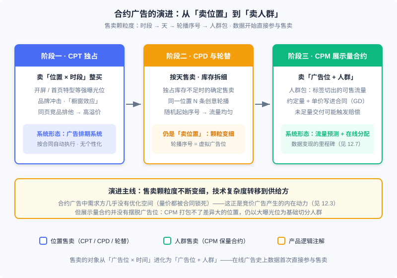
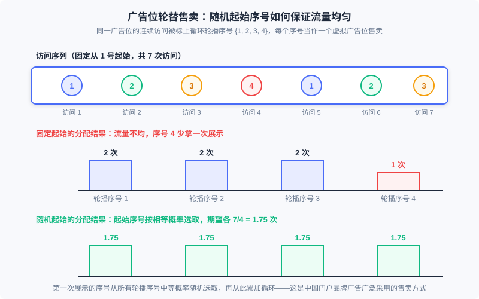

  📖
  ⏱️ ~45 min read
  🎯 Intermediate

# Contract Advertising: Product Forms and Selling Models

> 📝 **Before You Continue:** Read 12.1 (the ecosystem panorama) first — for where contract advertising sits in the ecosystem; and 12.7.0 (guaranteed-delivery advertising) — the scheduling system and blank-slot-prevention engineering details are covered there, and this chapter takes the product perspective without repeating them. 12.8 (audience targeting) covers "how labels are assigned"; this chapter covers "how labels are sold": the two chapters together complete the story of targeted selling.

At this point in Part 12 you have seen the full machinery of the auction marketplace: eCPM ranking, GSP pricing, and game-theoretic mechanisms (12.2–12.3). But online advertising was not born an auction marketplace. In the industry's early days, media and advertiser agencies were the primary market participants, and the commercial logic of offline advertising was transplanted online wholesale: agencies signed agreements with media guaranteeing that certain ad slots would be held for specified advertisers over certain periods, with fees settled as a lump-sum contract. This is **contract advertising** — "guaranteed-volume impression delivery," with both volume and price written into the contract rather than left to market clearing.

Understanding contract advertising is not nostalgia. First, it is the origin of the entire online-advertising product lineage — "slots existed before ads did": the earliest commodity was a handful of fixed positions on portal homepages. Second, it never went away: today's brand zones on top media, splash-screen contracts, and CPD scheduling still run on this logic, with 12.7's online allocation as the algorithmic foundation. Third — and most important — the difficulties contract advertising hit when it evolved into "audience selling" are precisely the internal driving force behind the emergence of auction advertising: understand them, and you will truly understand why the market mechanisms of 12.3 took the shape they did.

After reading this chapter, you will be able to:

- Distinguish the three selling forms of contract advertising (CPT exclusive, CPD/rotation, CPM impression-volume contracts) and the business scenarios each fits
- Explain the product logic of the evolution "from selling positions to selling audiences": how data began to participate directly in selling
- Explain why traffic forecasting must precede guaranteed-volume selling, and the "bucket-then-aggregate, then query" estimation idea
- Compare contract and auction markets along two dimension pairs: guaranteed-volume vs. guaranteed-price, scheduled vs. real-time
- Work through 4 layered practice problems

---

## 12.12.0 Why Start from Contract Advertising: Slots Before Ads

Wind the clock back to the internet's wild era. Traffic had not yet been characterized in any fine-grained way — who the user was, what they were viewing, what they wanted to buy, the system knew none of it. Only two things could be explicitly priced: **position** (which slot on the page) and **time** (which day, which time slot). So the earliest online ad trades copied offline contracts verbatim: an automaker took over a portal homepage banner for a month at a negotiated lump sum. This is the CPT slot contract, which demanded little technology — only a simple **ad scheduling system**.

As technology and business developed, the object of sale was progressively refined along a clear path: from buying "position × time slot" wholesale, to per-day selling and rotation splitting, to CPM impression-volume contracts of "position + audience." Every refinement step was driven by the same force — the finer you slice the traffic, the higher the total price it can fetch; and once the slicing reached "audiences," data participated directly in selling for the first time — a genuine milestone in the history of online advertising.

There is an easily missed thread in the figure: as the selling form evolved, **all the technical complexity was pushed onto the supply side (the media)**. In the CPT era, media only needed a scheduling system to execute contracts automatically; with impression-volume contracts, media had to forecast traffic, plan allocation, and decide in real time. The demand side (advertisers), by contrast, had almost no room for optimization in contract advertising — delivery requirements were handed to the supply side in the contract, and both volume and price were locked. It was precisely the demand side's desire for deeper performance optimization that gave birth to auction-based selling systems. This causal chain — "supply-side technical pressure → demand-side optimization demand → change of transaction form" — is the through-line of this chapter.

### 🧠 Mental Model: Two Ways to Sell Concert Tickets

> Think of ad traffic as tickets to a concert. **Contract advertising is wholesale distribution**: the organizer pre-sells a fixed number of tickets to channel distributors at agreed prices, promising "tickets guaranteed" — so the organizer must forecast how many tickets can be sold (traffic forecasting) and plan which stands go to which channel (online allocation). The risk of unsold tickets and the responsibility of fulfillment both rest with the organizer. **Auction advertising is box-office sales**: doors open, highest bidder wins; the organizer promises no one a ticket, and prices clear automatically by supply and demand. Wholesale means a worried organizer and carefree channels; box office means a carefree organizer and risk on the buyers. Neither mode is absolutely better — big brand clients want certainty and still choose "wholesale" today; long-tail advertisers want flexibility, so the market moved to "box office."

---

## 12.12.1 Selling Ad Slots: CPT, Rotation, and Scheduling

The **slot contract** is the earliest form of online ad selling: media and an advertiser agree that the advertiser's ads will be exclusively delivered on certain slots over a period, settled by **CPT** (Cost per Time, typically per day). Its weakness is obvious — no audience targeting, hence no deep performance optimization. But it retains real value in specific scenarios:

- **Brand impact on high-exposure slots.** Exclusive delivery on splash screens, portal homepage special slots, and similar high-exposure positions delivers effective brand impact; long-term exclusive occupation of banner positions creates a "showcase effect" that continuously builds brand value and conversion.
- **Competitor-exclusion premium.** Exclusive selling can bundle services such as same-page competitor exclusion, enabling premium monetization of traffic — a certainty the auction marketplace cannot offer.

Beyond exclusive selling there is an important variant: **rotation selling per slot**. When exclusive inventory is insufficient but an advertiser still needs deterministic display rules, the media can label a user's successive visits to the same slot with a cyclic set of **rotation sequence numbers** (e.g., $\{1, 2, 3, 4\}$) and sell the impressions sharing the same sequence number as a **virtual ad slot**. One subtle detail: for a given user, the first impression's sequence number must not be fixed at 1; it should be drawn uniformly at random from all rotation numbers, then incremented cyclically from there — only this way does each rotation receive equal traffic. This selling form was widely used in Chinese portal brand advertising.

> **Analysis:** The engineering cost of rotation is minimal: the server (or even a front-end script) only needs the counter of "how many times this user has seen this slot" and a modulo operation; the only state is the random starting number. Its limitation is exactly there — rotation splits traffic by "visit order," not by "audience," so all rotation creatives reach an identical audience structure. Showing different creatives to different people in the same slot requires the creative differentiation of audience targeting (12.8), not rotation itself.

The tool that executes CPT selling is the **ad scheduling system**: once the contract is signed, delivery runs automatically per the schedule. Representative products include DoubleClick's DFP, comparable products from Allyes in the Chinese market, and Baidu's free ad manager for small and mid-size sites. Scheduling systems are not personalized — creatives are inserted directly into pages per a predetermined schedule and accelerated via CDN, so the server side has almost no decision load; the only engineering point worth noting is mixed-delivery orchestration and the **blank-slot-prevention** fallback (rendering a fallback creative when a dynamic ad times out or errors, so a slot is never blank), detailed in 12.7.0 and not repeated here. As audience targeting and RTB spread, these scheduling products evolved: with dynamic allocation and RTB capabilities added, they approach the supply-side platform (SSP).

One intermediate form deserves note: as audience targeting matured, delivering a single advertiser's creatives across a slot no longer means delivering the same creative. An automaker may own compact, luxury, and SUV lines with very different buyer populations — serving each line's creative to its own audience works far better; and even when audiences cannot be distinguished, frequency capping can show one user a progressive sequence of creatives. Such "targeting-enhanced exclusive contracts" are, in implementation, no longer essentially different from non-exclusive selling — they are the prototype of later programmatic direct products.

---

## 12.12.2 From Selling Positions to Selling Audiences: The Rise of Targeted Selling

CPT's ceiling appeared quickly: one homepage banner can be sold to one exclusive buyer, or split into a few rotations. To refine the sellable granularity by another order of magnitude, a new slicing dimension was needed — **audiences**. The **impression-volume contract**, billed by CPM, thus arrived: the contract specifies a total number of impressions under some audience condition plus a unit price per impression, and the object of sale evolves from "slot" to "slot + audience." With data applied directly to selling, media achieved **data monetization** layered on top of traffic monetization for the first time; this is also the origin of the "guaranteed" in guaranteed delivery (GD) — what is guaranteed is the volume, and if delivery falls short, the media may owe compensation.

One easily confused boundary must be drawn here: billing by CPM does not equal contract advertising. CPM advertising also includes selling without a guaranteed volume (e.g., sales in ad exchanges); such **non-guaranteed CPM belongs to auction advertising**, with very different commercial logic. The criterion for "contract or not" is whether volume is guaranteed — not the billing unit.

How are audiences sliced, and how is the sliced inventory sold? This involves a **selling logic** distinct from labeling (the task of 12.8):

- **The sales catalog must be designed for the demand side.** When labels are the direct object of ad buying (audiences an advertiser can directly select), the taxonomy should be a structured hierarchy — upper-level labels are parents of lower ones, with audience coverage in a containment relation — Yahoo's guaranteed-delivery taxonomy (top-level categories like Finance / Travel / Autos / Entertainment) is typical. Conversely, if labels are only intermediate variables of the delivery system (e.g., inputs to CTR prediction), they should be mined purely for performance, with no hierarchy constraint. The former is the "sales catalog" this chapter cares about; the latter is the "labeling technology" of 12.8.
- **Geo is the most basic selling region.** Many advertisers' businesses are regional; geo targeting is the one selection mechanism every online ad system must support — simple to compute (a table lookup), limited in effect but indispensable, and the most common targeting clause in sales contracts.
- **Audience coverage and label count are different things.** Yahoo's guaranteed-delivery marketplace had thousands of behavioral labels, but only a hundred-odd ever produced a contract — huge numbers of precise labels simply cannot be sold under contract-volume constraints. When evaluating a sales catalog, label variety means little; **the audience size behind each label is what counts**: inventory whose population is too small can never meet the minimum guaranteed scale for contracts and can only flow to the auction market.
- **Demographics are the hard currency of brand contracts.** Age and gender labels may underperform in effect, but they can be audited (sampling plus surveys verifies the audience composition of a delivery), so they are accepted by advertisers in CPM-billed brand contracts far more than any other label type.

Audience slicing introduces a brand-new complexity absent from the slot-selling era: **audience packages overlap**. "Females 25–35," "female," "tier-1-city auto intenders" — these sellable goods share the same underlying traffic; when one contract's delivery region overlaps another's heavily, a single impression may satisfy multiple contracts. Who fulfills each one's promised volume? That is the online allocation problem — its mathematical form and solutions (bipartite graphs, dual pricing, HWM) are the subject of all of 12.7. This chapter only needs the product-side conclusion: **guaranteed-volume promises + audience overlap = the supply side must plan globally with algorithms** — a technical burden the slot-selling era never knew.

Impression-volume contracts also have an oft-ignored boundary: they make audiences the explicit object of sale, yet **never escape the slot as an object**. Under CPM one cannot bundle slots with wildly different impression effectiveness into a single sellable unit (otherwise no reasonable CPM exists); in practice, impression-volume contracts are always built on high-volume slots and then sliced by audience — video pre-roll and portal homepage slots are the canonical carriers. This also explains why contract catalogs are always "broad labels + big slots."

---

## 12.12.3 Traffic Forecasting for Impression Contracts: Count Before You Promise

The slot-selling era needed no forecasting — the slots just sat there; sell a day, deliver a day. Audience selling is entirely different: what is sold is "$d$ future impressions of some audience," and an audience is not deterministic inventory sitting on a shelf. So **traffic forecasting** becomes the prerequisite technology of guaranteed-volume selling: if traffic is badly underestimated, media dare not sell what they have and inventory goes undersold; if badly overestimated, signed contracts cannot be fulfilled by their deadlines and compensation is triggered. Both ends directly erode revenue — pre-sales guidance is thus the first product use of traffic forecasting.

The second use is on the delivery side: every online allocation algorithm depends on traffic-forecast outputs (the supply totals $s_i$ in 12.7's $\theta_a = d_a / \sum_{i} s_i$ are exactly the forecast's output). The third use is on the bidding side: advertisers want to estimate "how much traffic will I get at this bid" before bidding, to judge whether the bid is reasonable. General traffic forecasting can be formulated as estimating a function $t(u, b)$ — $u$ is the label combination, $b$ is the bid; impression-volume contracts have no bidding step, corresponding to the special case $b \to \infty$. Three uses, three slices of the same function — that is why it deserves to be a platform-level foundational service.

The core engineering difficulty: the space of label combinations is astronomically large, so pre-computing traffic for every combination is impossible. The viable idea is **bucket-then-aggregate, then assemble by query**: aggregate historical traffic by label combination into supply nodes and build an inverted index (the documents are label-combination traffic; the queries are ads' targeting conditions); at selling or allocation time, retrieve candidate nodes by query and sum to obtain the estimate. The concrete four steps and sampling tricks of this inverted-index scheme are fully laid out in 12.7.2 — what to take away here is its product meaning: **traffic forecasting is the process that turns "audiences" into standardized goods that can be priced and guaranteed**. Without it, every line of the contract catalog is a promissory note backed by nothing.

Alongside forecasting there is a proactive lever: **traffic shaping**. Rather than passively measuring traffic, actively influence it to help contracts close. The canonical scenario is portals: sub-channel traffic depends heavily on homepage links — when auto shows drive demand for the auto channel, the homepage should funnel more traffic there. The idea is widely used in practice, but doing it systematically and efficiently requires打通ing the supply-demand states of the user product and the ad product, improving monetization without hurting user experience; this thread connects closely to native advertising (the fusion of user and commercial products).

> **Analysis:** Traffic-forecast difficulty rises steeply as selling granularity refines: the richer the labels, the thinner each supply node's traffic, and the higher the variance of small-sample estimation. This explains why the contract catalog must stay "broad" — and sets up this chapter's final section: when the market demands granularity finer than the contract system can support, the transaction form itself must be replaced.

---

## 12.12.4 The Product Value and Modern Forms of Contract Advertising

Putting this chapter alongside 12.3, the product logic of the two markets compresses into two dimension pairs:

| Dimension | Contract advertising | Auction advertising |
|------|---------|---------|
| **Core promise** | Guaranteed volume: agreed audience + impressions; shortfalls may be compensated | Guaranteed price: no volume promise; prices clear via the market |
| **Decision point** | Scheduled: offline planning, online execution to plan | Real-time: every impression auctioned on the spot |
| **Price formation** | Negotiated and signed; manual media buying | Mechanism design (GSP etc.) prices automatically |
| **Supply-side burden** | Heavy: traffic forecasting + online allocation; fulfillment responsibility on media | Light: maintain auction rules only; no fulfillment backstop |
| **Demand-side room** | Small: volume and price locked; little optimization room | Large: bid, targeting, and creatives freely adjustable |
| **Client capacity** | Few: on the order of thousands of brand advertisers | Many: millions of active advertisers |

Contract advertising was never fully displaced by auctions, because **certainty itself is a commodity**. Brand advertisers want exclusivity, high-impact exposure, and auditable audience reach — contracts deliver these; auctions cannot. Today's brand product lines at top media remain this logic's continuation: exclusive brand-zone keywords, CPD splash scheduling, CPM guaranteed video pre-roll — the contracts still read "audience + volume + price." What changed is the execution layer: the algorithmic foundation upgraded from manual scheduling to 12.7's online allocation (traffic forecasting → compact allocation plan / HWM → stateless online execution), and catalog management migrated to hybrid forms like programmatic direct (PD).

Equally worth remembering is the boundary. Impression-volume contracts cannot operate when audience labels get very rich and precise: the more labels, the faster supply nodes proliferate and the faster each node's traffic shrinks; forecasting degrades, and guaranteed-volume promises become untenable. This product-level deadlock is precisely one of auction advertising's driving forces — auctions removed the volume constraint, made scheduling simple and transparent, and made fine-sliced traffic and massive advertiser counts possible. So this chapter's closing line is: **contract advertising defined "what to sell" (audience + volume); auction advertising solved "how to sell" (mechanism clearing)** — understand the former, and every design of the latter makes sense.

Finally, a knowledge map situating this chapter in Part 12's coordinate system:

| Topic | This chapter covers | Where it goes deeper |
|--------|---------|---------|
| Scheduling & blank-slot prevention | Product forms and selling motivation | 12.7.0 (CDN direct insertion, fallback creatives) |
| How targeting labels are assigned | Sales-catalog view: structured hierarchy, audience size | 12.8 (contextual/behavioral/demographic targeting technology) |
| How traffic forecasting works | Three uses and the motivation for "bucket-then-query" | 12.7.2 (inverted-index four steps, sampling) |
| How guaranteed volume is allocated | Where the overlap problem comes from | 12.7.1–12.7.5 (bipartite graphs, duality, HWM) |
| Why auctions arose | The contract deadlock as the auction's driving force | 12.3 (mechanism design), 12.2 (billing and metrics) |

---

## ⚠️ Common Mistakes in 12.12

| # | Mistake | Example | Why It's Wrong | Fix |
|---|---------|---------|---------------|-----|
| 1 | Treating all CPM advertising as contract advertising | "The ADX bills by CPM, so it's contract advertising" | Contract or not depends on volume guarantee: non-guaranteed CPM (exchange selling) is auction advertising with entirely different commercial logic | Judge by "is volume contracted and fulfillment responsibility borne," not by billing unit |
| 2 | Believing impression contracts escape the slot | Bundling slots with wildly different effectiveness into one CPM object | Reasonable CPMs differ enormously across slots; bundled pricing is meaningless; practice always builds on high-volume slots then slices by audience | Design catalogs as "broad labels + high-volume slots" |
| 3 | Starting rotation fixed at 1 | Every user's cycle starts at sequence number 1 | Traffic across rotations is systematically uneven; the number-4 contract is effectively under-delivered | Draw the first impression's starting number uniformly at random, then cycle |
| 4 | Preferring high pre-sales forecasts | Selling 950k against a 1M forecast | Overestimation triggers breach compensation; underestimation undersells inventory — both lose; guaranteed selling must treat forecasts as hard constraints | Sell a quantile of the forecast with a safety margin; overflow goes to auction channels |
| 5 | Marketing catalog capability by label count | "We have 5,000 behavioral labels for contract buying" | Under contract-volume constraints, labels with tiny audiences cannot be sold; only ~100 of Yahoo's thousands ever produced contracts | Evaluate labels by audience coverage and size; bundle small labels or push them to auctions |
| 6 | Assuming demand side has optimization room in contracts | Advising a brand client to "tune bids in real time for ROI" | Contract volume and price are locked in the agreement; the demand side has no knobs — which is exactly why auctions arose | Route demand-side optimization needs to auction products (12.3–12.4) |

---

## Chapter Summary

### 📌 Key Takeaways

| Concept | Key Points | Why It Matters |
|---------|-----------|----------------|
| Contract advertising | Delivery of contracted impression volume; volume and price in the contract; fulfillment on the supply side | The origin of the online-ad product lineage; still the answer to brands' certainty needs |
| Slot selling | CPT exclusive (brand impact / competitor exclusion) → CPD/rotation (random start keeps traffic even) → scheduling systems execute | Slots before ads; scheduling + blank-slot prevention remains the standard for slot fault tolerance |
| Audience-targeted selling | Data joins selling directly; structured label taxonomy as catalog; geo as the basic region; audience size beats label count | The key step to slicing traffic finer for higher prices; prerequisite for standardizing traffic |
| Traffic forecasting | Three uses: pre-sales / allocation / bid guidance; the $t(u, b)$ function, contracts being the $b \to \infty$ case; bucket-then-query | The prerequisite process of guaranteed selling; without it the catalog is empty promises |
| Contract vs. auction | Guaranteed volume vs. guaranteed price; scheduled vs. real-time; label refinement breaks contracts, fueling auctions | The product-history background that makes 12.3's mechanism design "motivated" |

### ❓ FAQ

**Q1: Contract advertising is "non-mainstream" — why devote a chapter to it?**
> Three reasons. First, it still serves brand advertisers' certainty needs; top media's brand contract lines run this logic daily. Second, it contributed online advertising's core technical foundations: audience targeting, traffic forecasting, and online allocation were all born under the pressure of guaranteed-volume selling. Third, it is the control group for understanding auctions — auction mechanisms solve problems the contract system could not; without knowing the problem, the solution's shape is opaque.

**Q2: Why does rotation need a random starting number instead of everyone starting at 1?**
> Rotation slices a visit sequence into several virtual streams by cyclic number. If everyone starts at 1, number 1 always covers the opening screens of each session (highest attention) while number 4 only covers long-session tails — both the volume and quality of each stream are systematically uneven, and the number-4 buyer is effectively under-delivered. A uniformly random starting number gives each rotation equal expected traffic.

**Q3: Why not bundle all slots and sell by CPM like an exchange?**
> Because CPM contracts fix the unit price in advance, while impression effectiveness differs enormously across slots — bundled pricing is meaningless. Exchanges can bill CPM widely precisely because they guarantee no volume and auction each impression individually with real-time market clearing — the common root of both "guaranteed contracts stuck on high-volume slots" and "non-guaranteed CPM belongs to auctions."

### 🔗 Connections

- **12.1** (ecosystem panorama): this chapter gives contract advertising's origin position and the "slots before ads" evolution thread
- **12.7** (online allocation & traffic management): this chapter only covers the product motivation; bipartite modeling, the forecasting inverted-index steps, duality, and HWM are all in 12.7
- **12.8** (targeting technology): this chapter views labels from the catalog side (hierarchy, audience size); labeling technology (contextual/behavioral/demographic) is in 12.8
- **12.3** (auction mechanisms): the contract system's deadlock under label refinement is the origin force of auctions; how mechanism design took over, see 12.3
- **12.2** (billing models & metrics): CPM/CPT billing conventions and the eCPM definition are the measurement basis of this chapter's discussion

---

## Practice Problems

Work through all problems in order — they get progressively harder. Each has a complete solution you can reveal after trying it yourself.

---

**Problem 12.12.1 — Traffic Evenness of Rotation Selling** 🟢 Easy

A slot is sold with 4 rotating creatives; a user visits the slot 7 times in one day. (1) With a fixed start at number 1, how many impressions does each number get? (2) With the first impression's starting number drawn uniformly at random, what is the expected number of impressions per number?

**Sample Input:** rotations $N = 4$; visits $T = 7$
**Sample Output:** fixed start $\{2, 2, 2, 1\}$; random start expectation $1.75$ each

💡 Solution (click to reveal)

**Approach:** For the fixed start, expand the cycle and count; for the random start, use symmetry for expectations.

- Fixed start: the visit sequence numbers are $1, 2, 3, 4, 1, 2, 3$ — numbers 1/2/3 get 2 each, number 4 only 1: the smallest is 50% below the largest, so the number-4 buyer is systematically under-delivered.
- Random start: the starting number is uniform on $\{1, 2, 3, 4\}$; by symmetry each number's expected impressions equal $T/N = 7/4 = 1.75$.
- General conclusion: when $T$ is not divisible by $N$, fixed allocation is necessarily uneven; random start converts systematic bias into zero-mean random fluctuation.

**Key points:**
- Rotation evenness comes from randomizing the starting number, not from visit-count divisibility
- Random start also protects the "quality" of each stream: no rotation monopolizes the high-attention opening of sessions

---

**Problem 12.12.2 — Selling Feasibility with Nested Audiences** 🟡 Medium

A media homepage banner has 1000k daily impressions: female 600k (of which females 25–40 are 250k, other females 350k), male 400k. Three contracts are booked: A = female, 300k; B = females 25–40, 250k; C = all users, 300k. (1) Total demand 850k < total supply 1000k — can we conclude all three contracts can be fulfilled? (2) Give a feasible allocation and state the key ordering principle.

**Sample Input:** supply: females 25–40 250k, other females 350k, male 400k; demand: A 300k, B 250k, C 300k
**Sample Output:** total supply is not sufficient evidence; feasible allocation $B \leftarrow 250$, $A \leftarrow 300$, $C \leftarrow 300$, 150k remaining

💡 Solution (click to reveal)

**Approach:** Check supply-demand per audience segment; note that $B$'s audience is a subset of $A$'s (nesting), so allocation order determines success.

- (1) No. Enough total does not mean enough structure: if $A$ takes 300k females first (e.g., all 250k of females 25–40 plus 50k others), $B$'s candidate pool drops to 0 and its 250k promise fails — the product-language version of "contracts seizing supply nodes" from 12.7.
- (2) Allocate narrowest-first: $B$ takes all 250k of females 25–40; $A$ takes 300k from the remaining 350k other females; $C$ takes 300k from the rest (50k other females + 400k male = 450k). All three fulfill, 150k remains for auction or fallback.
- Principle: nested (subset) audience packages must satisfy the narrowest contract first, or wide contracts drain the narrow ones' candidate pools. 12.7's HWM prioritizes by $\theta$ — essentially automating this intuition.

**Key points:**
- Guaranteed-volume feasibility is a structural question, not a totals question; allocation order at overlaps is decisive
- Catalog review should explicitly check nesting and overlap among audience packages and prioritize narrow audiences in planning

---

**Problem 12.12.3 — The Revenue Cost of Forecast Bias** 🔴 Hard

A media sells a 950k-impression audience contract at CPM ¥10. Actual traffic reaches only 800k; the shortfall is compensated at 20% of contract price. Baseline: with an accurate forecast, selling a 780k contract delivers fully, and the remaining 20k sells entirely in the auction channel at CPM ¥6. Compute both plans' net revenue and the difference.

**Sample Input:** contract 950k @ ¥10/CPM; actual 800k; compensation 20%; baseline: 780k @ ¥10/CPM + 20k @ ¥6/CPM
**Sample Output:** overestimated plan nets ¥7,700; baseline ¥7,920; difference ¥220

💡 Solution (click to reveal)

**Approach:** CPM prices bill per thousand impressions — convert "k impressions" into "thousands" before multiplying by unit price; compute gross revenue and penalty per plan.

- Overestimated plan: billed on actual delivery, gross $= 800 \times 10 = 8{,}000$; shortfall $950 - 800 = 150$k, compensation $150 \times 10 \times 0.2 = 300$; net $8{,}000 - 300 = 7{,}700$.
- Baseline: $780 \times 10 = 7{,}800$ with no compensation; remaining $20 \times 6 = 120$; total $7{,}920$.
- Difference $7{,}920 - 7{,}700 = 220$. The extra volume from overestimation not only failed to become revenue but consumed compensation and opportunity cost — the quantitative version of "severe overestimation directly hurts revenue" from 12.12.3.

**Key points:**
- CPM billing is based on actual delivery; the gap between signed and delivered volume is the risk exposure
- Forecast-bias costs are asymmetric: overestimation pays penalties, underestimation wastes inventory; sell a forecast quantile with margin

---

**Problem 12.12.4 — Designing a Contract Sales Catalog** 🏆 Challenge

You lead contract-ad sales at a media with 1000k daily impressions; contract selling requires each single label to reach at least 50k/day. Candidate labels' daily coverage: female 600k; females 25–40 250k; auto interest 80k; maternal-infant interest 40k; tier-1 cities (Beijing/Shanghai/Guangzhou) 220k; "tier-1 ∩ auto ∩ Android" 11k. (1) Select labels that can enter the contract catalog. (2) For rejected labels, say where they should flow, and explain the underlying logic of "contract advertising failing under label refinement." (3) Point out two nesting relations in the catalog and the planning precautions.

**Sample Input:** coverage: female 600k, females 25–40 250k, auto 80k, maternal-infant 40k, tier-1 220k, triple-intersection 11k; minimum 50k
**Sample Output:** 4 labels enter the catalog: female, females 25–40, auto interest, tier-1 cities; maternal-infant and the triple-intersection are rejected

💡 Solution (click to reveal)

**Approach:** Hard-filter by minimum volume, then double-check by audience structure and allocation feasibility.

- (1) Labels with daily coverage ≥ 50k: female (600k), females 25–40 (250k), auto interest (80k), tier-1 cities (220k) — 4 labels enter.
- (2) Maternal-infant (40k) and the triple intersection (11k) fall below the minimum. Where they go: bundle into a broader parent label, or push to the auction market for performance monetization. The logic: the finer the labels, the faster supply nodes proliferate and the faster each node's traffic shrinks; when traffic is too small to forecast reliably, guarantees are untenable — so contract catalogs must stay broad, and refined long-tail labels naturally belong to auctions. This is why only ~100 of Yahoo GD's thousands of labels ever produced contracts.
- (3) Nesting one: females 25–40 ⊂ female. Nesting two: auto ∩ tier-1 is a subset of both auto and tier-1 (pairwise overlap). In planning, allocate narrow audiences first (cf. Problem 12.12.2) and run joint feasibility checks on contracts sharing candidate pools so wide contracts don't drain narrow ones.

**Key points:**
- The catalog's admission line is audience size, not label count; the taxonomy should be a structured hierarchy for advertiser comprehension and selection
- Catalog design = coverage filtering + nesting/overlap structure checking; both steps are required
- The proper home of long-tail labels is the auction market — a division of labor, not a defect

