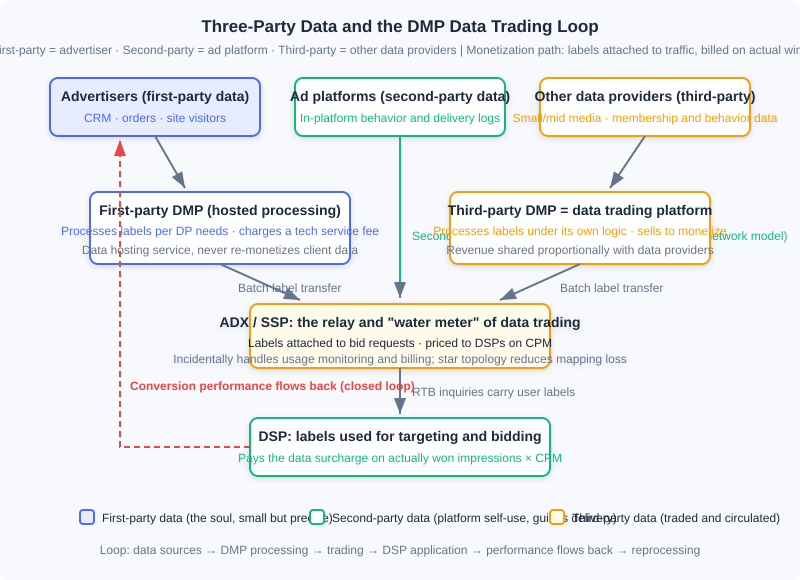
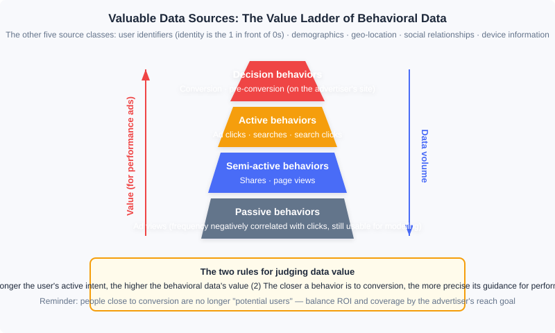

  📖
  ⏱️ ~45 min read
  🎯 Intermediate

# Data Processing and Trading

> 📝 **Before You Continue:** This chapter requires reading 12.2 (Billing Models and Core Metrics) first — data surcharges are settled on a CPM basis, and the eCPM frame of reference must be established beforehand; as well as 12.3 (Auction Mechanisms) — the RTB inquiry flow is the vehicle that data trading "hitches a ride" on. 12.4 (Smart Bidding) will show you where the labels ultimately flow: targeting and bidding features. 12.6 (Open-Loop and Closed-Loop Advertising) has already covered the identity-signal side — ATT/SKAN/Privacy Sandbox — while this chapter handles only the data compliance and trading side; the two are two sides of the same coin.

Precise targeting and aggressive bidding both rest on one premise: "you understand this user better than anyone else does." The **user labels** we have used repeatedly in earlier chapters — interests, intent, audience attributes — do not appear out of thin air: they come from the collection and processing of behavioral data, and in the programmatic trading market they are themselves a commodity that can be priced, bought, and sold. This chapter pulls the camera back from "how to serve ads" to "where does advertising's fuel come from": which data is genuinely valuable? Who turns raw logs into labels? How are labels priced and delivered? And — when you collect and trade user data, where are the legal and security boundaries?

The data industry originally existed to serve advertising, but today it has grown into a relatively independent industry. Understanding this chapter is not just understanding a supporting link of advertising — it is understanding the general craft of "how personalized systems turn behavior into assets."

After reading this chapter, you will be able to:

- Distinguish first-party, second-party, and third-party data, and judge the ownership and use of any given data item in advertising trading
- Rank various types of user behavioral data on the value ladder, and explain the logic behind two value rules
- Compare the responsibilities, business models, and product cases of first-party DMPs and third-party DMPs
- Describe the data trading mechanism relayed through the ADX: CPM pricing, delivery based on actual won impressions, and the economic problem of "data prices shifting into traffic prices"
- Master the basic principles of privacy protection, the ideas of quasi-identifiers and K-anonymity, identify data security risks on both the supply and demand sides of programmatic trading, and complete 5 tiered practice problems

---

## 12.10.0 Three-Party Data: The Fuel of Targeting and Bidding

Every decision an ad system makes — which candidates to retrieve, how high to estimate the click rate, how much to bid — is essentially "trading data for judgment." The auction mechanisms of 12.3 gave traffic a market price, and what makes the same traffic carry a different price in the eyes of different DSPs is precisely the data each of them holds. So the collection, processing, and trading of data is just as important as the ad-serving technology itself.

User data used in advertising falls into three classes by source. **First-party data** comes from the advertiser: their own CRM, order records, and website visitor behavior. **Second-party data** comes from the advertising platform: behavioral data generated by users on the media or platform and held by the platform itself. **Third-party data** comes from data providers that do not directly participate in ad trading — small and mid-sized media, membership systems, and various data companies. Under the ad network model, second-party data was the main guide for delivery; in the era of real-time bidding (12.3), the game changed: first-party data could be activated, and the third-party processing and trading of data developed along with it.

The three classes of data are not equal in standing. First-party data is generally small in volume, yet it is the **soul** of all data — it relates directly to your business, has the clearest semantics, and sits closest to conversion. Building on first-party data and making good use of second-party and third-party data is the most important methodology of the RTB era. The ecosystem diagram below is this chapter's roadmap: data departs from the three source classes, is processed by DMPs into labels, is traded through the ADX and attached to every bid request, ultimately becomes ammunition for targeting and bidding in the DSP, and delivery outcomes flow back as new data — closing the loop.

### 🧠 Mental Model: The Oil Refinery

> Picture the data ecosystem as the petroleum industry. Raw behavioral logs are crude oil — buried underground, unable to drive anything directly; the DMP is the refinery — fractionating crude into gasoline and diesel (standardized user labels); the ADX is the gas station and fuel meter — selling refined fuel by the liter (labels attached to traffic on a CPM basis); the DSP is the engine — burning fuel to produce power (targeting and bidding); and the exhaust emitted at the end (conversion data) is recovered and refined again — the loop's feedstock never runs out. Remember one contrast: your own oilfield (first-party data) has modest output, but the best quality and ownership; the wholesale market (third-party data) is abundant and cheap, but of uneven quality.

---

## 12.10.1 Valuable Data Sources

Data is the core of the precision advertising market, but not all data is worth collecting and processing. Which data directly contributes to the advertising business? We go through each class and provide a framework for judging value.

**User identifiers.** Determining which behaviors come from the same user is the most easily underestimated problem. A stable user identity is like the 1 in front of a string of 0s: no matter how much behavioral data you can obtain, if you cannot link it to the person in the delivery system, the data is useless. The foundational solution of the browser era was the cookie — although multiple browsers, expiration, and users actively clearing them all break long-term consistency, recent behavior is what matters most in advertising anyway, so cookies remained a widely adopted industry solution; if the domain operating the ads also provides permanent identity services such as email or social networking, expired cookies can be recovered through the permanent identity. Mobile diverged: iOS uses the advertising-specific identifier IDFA, similar in nature to a cookie; Android has no dedicated ad ID, so device identifiers such as the Android ID or IMEI are generally used. A high-quality user identifier is itself a valuable asset that can be exchanged and sold in the marketplace — we will pick this thread up again in the modern notes of 12.10.2.

**User behavior.** The industry broadly agrees that the online behaviors worth collecting at scale, with a clear effect on targeting, include: conversions, pre-conversions, search ad clicks, display ad clicks, search clicks, searches, shares, page views, ad views, and so on. By their effectiveness for performance advertising, they fall into four tiers:

- **Decision behaviors**: conversions and pre-conversions — both happen on the advertiser's own site. In e-commerce, a conversion corresponds to the final order, while a pre-conversion covers the preparatory actions before ordering: searching, browsing, comparing prices, adding to cart, and so on. These behaviors point most clearly at intent, carry the highest value, and are also the hardest for supply-side or ad platforms to obtain; using them for retargeting or personalized retargeting is the most direct exploitation. The volume is not large, but they cannot be ignored.
- **Active behaviors**: ad clicks, searches, search clicks — produced actively by the user under explicit intent, rich in information. Ad clicks are too few in number to serve as the main source of targeting; **search is the most important active behavior obtainable at scale**, and deserves special mining.
- **Semi-active behaviors**: shares, page views — arising from content consumption with weaker purpose; they capture the domain of interest but with limited content precision. Their guidance value is limited, yet their volume is the largest of all behavior classes.
- **Passive behaviors**: ad views — strictly speaking not a behavioral basis for targeting, but their frequency is negatively correlated with clicks on ads of the corresponding category, so they remain usable in behavioral targeting models.

There are two basic rules for judging value. First, **as the user's active intent rises, the value of the behavioral data increases**. Second, **the closer a behavior is to conversion, the more precise its guidance for performance advertising**. But there is one easily overlooked caveat here: the fundamental purpose of advertising is to "reach **potential** users at low cost." Behaviors close to conversion are more precise because that population already stands at the final stage of the decision — in other words, they are less and less "potential users." Targeting solely by conversion ROI collapses coverage to the very bottom of the funnel. The right approach is to balance effectiveness and coverage according to the advertiser's audience-reach goals.

**Demographic attributes.** Commonly used targeting labels, but limited in source: generally only services that can be bound to real-name identities can obtain them directly. Predicting demographic attributes from behavioral data is a common practice, but accuracy is limited and labeled calibration data is still needed for training. Certain special signals can actually yield accurate judgments — for example, the voice signals recorded by voice services can distinguish male from female fairly reliably.

**Geographic location.** Its usefulness changes drastically with precision. IP mapping only reaches city level, which is already valuable for many campaigns; in mobile environments GPS or cellular positioning can reach a few hundred meters of accuracy, capturing users' offline store-visit interests and making precise location targeting possible for local advertisers such as restaurants.

**Social relationships.** Social connections imply the reasonable inference of "similar interests," which can be used for **smoothing user interests**: when a user's behavioral data is insufficient for precise targeting, one can borrow the behaviors and interests of the user's social-network friends — a person whose Weibo friends mostly love football probably loves football too. Such smoothing applies only to long-term stable interests, not to short-term purchase interests; hence strong-tie social networks have an advantage over weak-tie ones.

**Device information.** Mobile devices can supply far richer data than PCs: the installed app list, device model, gyroscope readings, even status information such as battery level — all very helpful for identifying usage contexts. Deep processing of device information has particular significance for mobile advertising.

> **Analysis:** There is no single universal "ranking" across the six data classes, because value depends on the use: in performance campaigns, decision behaviors overwhelm everything; brand-awareness campaigns should precisely avoid the conversion-adjacent population, and the large volume of semi-active behaviors becomes the friend of coverage. The truly universal judgment framework is those two rules (active intent, distance from conversion) plus one reverse reminder (too close to conversion means no longer a potential user). Before collecting and processing, run the data through this framework once: whose goal does this data serve?

---

## 12.10.2 The Data Management Platform (DMP)

Given raw data, who refines it into usable audience labels? Products that organize and process data into directly usable information and support monetization are collectively called **Data Management Platforms (DMPs)**. In the market, DMPs come in two settings — first-party and third-party: the technical steps are basically the same, but the product direction and business model differ greatly.

First, a technical detail left over from 12.10.0: **cookie mapping**. When the advertising business domain differs from the domain holding the permanent identity, and with the latter's consent, mapping technology can align user identities across the two — this is the infrastructure of data integration and trading, and the star topology of data trading described later is optimized precisely around it.

**First-party DMP: data hosting and processing service.** For advertisers or media without technical accumulation, building a dedicated team for data processing is not worthwhile, so products specializing in this business emerged. They have two core functions: one is providing audience targeting capabilities for websites (media or advertiser sites), processing both general-purpose labels and custom audiences according to the website's own label taxonomy; the other is letting advertisers conveniently connect their data with ad purchasing channels. The value of the latter can be understood this way: an advertiser doing external retargeting needs to notify ad platforms of its user set — if every platform installed tracking code on the site, first the pages would grow ever heavier, and second visitor accumulation would take weeks at a time, making retargeting inefficient. Having the DMP uniformly handle user accumulation and segmentation, then pass segments to ad platforms through data interfaces, solves both problems at once.

The first-party DMP collects and processes data according to the needs of the data provider (DP), charging the DP a service fee. It is a **data hosting and processing service that does not aim to monetize the data itself**: it must never treat client data as its own property for secondary monetization, nor mix data across different DPs — this is the bottom line of this product's business model. Its clients are mostly mid-to-large media and advertisers; capable advertisers can also build their own DMP.

**Third-party DMP: the data trading platform.** Its main product function is aggregating online user behavioral data from various sources, processing it into valuable user labels, and monetizing by selling the labels, with revenue shared proportionally back to the data providers. It often also carries the processing capabilities of a first-party DMP, but the key difference is that a data trading platform **builds its label taxonomy and processes data according to its own logic, not the media's needs** — hence it offers its product from the third-party data standpoint and is called a third-party DMP. Its DPs are mainly small and mid-sized media and data owners — players with plenty of data for whom standalone monetization is not worthwhile.

> **Analysis:** The two DMP business models side by side. First-party DMP: sells a "service" — clients pay hosting and processing fees, data ownership stays with the client, and the product emphasizes flexible integration and custom labels. Third-party DMP: sells "data" — processes under its own label taxonomy and sells to DSPs, sharing revenue with DPs; the product emphasizes label coverage and category operations. The former follows a to-B service logic — stable profits but a low ceiling; the latter follows a commodity-circulation logic — large upside but full responsibility for data quality and compliance. This divide determines the trajectory of all the product cases that follow.

**Product cases.** The international market once had three representatives. **BlueKai** was the archetypal third-party DMP: it built its Data Exchange database in 2008, on one side having small and mid-sized websites contribute traffic and membership data, and on the other processing it and selling it to advertisers; it insisted on not providing media bidding/purchasing services in order to stay neutral and integrate with multiple DSPs — this "independent DMP" route was highly successful for a time, with over 300 million active users and 80% of the top 20 ad networks and portals using its data; in 2014 it was acquired by Oracle for 400 million dollars. Its label taxonomy was open-ended: Intent (recent search terms indicating demand, over 1.6 billion users), B2B (from Bizo), Past Purchase (Addthis, Alliant), Geo/Demo (blending multiple sources such as Bizo, Datalogix, and Expedia), Interest/Lifestyle, and more, continuously expanded by source and market demand — fine-grained categories like "people interested in P&G shampoo" or "people planning a trip to Japan" were highly meaningful to performance advertisers and sold at a premium. **AudienceScience** represented another path: it proposed the concept of audience targeting earliest, mainly providing first-party DMP services (e.g., processing finance and sports user labels for The New York Times), while also running its own performance ad network for monetization — it did not sell labels directly; instead it shared the revenue created by labels with the media that provided the data, because "after deducting revenue shares, the profit margin of data processing alone was too small, and running one's own ad network offered larger arbitrage." It shut down in May 2017, which also reflected that standalone data services had rather limited scale and profitability. **TalkingData** was the representative in the Chinese market: it entered through an app analytics tool, accumulated massive independent-device data, and then launched its marketing cloud, MarketingCloud, with features including user ID mapping and management (linking the same user across ID systems such as CRM, offline stores, online browsing, and official accounts), an open third-party label library (over 800 fine-grained dimensions), geofenced target audiences, and marketing process monitoring and management — its business model was closer to a first-party DMP, making it a pioneer of the "data-driven marketing automation" direction.

> 💡 **Modern Notes (2026):** The cases above read like a documentary from "the pre-smartphone era." Third-party cookies have been blocked in Safari (ITP) and Firefox, and Chrome has moved to a user-choice model — **cookie mapping as industry infrastructure has in fact ended**, and the identity-signal degradation described in 12.6 is precisely its final act. The replacement is a new suite of first-party data infrastructure: the **CDP (Customer Data Platform)** unifies data from a brand's own touchpoints (website, app, mini-program, CRM) into persistent customer profiles, replacing most scenarios of the old first-party DMP; cross-domain identity relies on **Unified ID 2.0 (UID2)** — an open identity framework led by The Trade Desk, rooted in hashed email addresses/phone numbers — and on the **first-party IDs** of giants like Amazon built on their own account systems. The former independent DMPs (BlueKai, LiveRamp, etc.) were either absorbed through M&A or transformed into identity and data collaboration service providers. The business-model lessons in the old book have not aged: **data capability is concentrating in the hands of whoever holds the logged-in state, and neutral third-party data is being squeezed out by compliance and technology alike.**

---

## 12.10.3 The Basic Process of Data Trading

The labels are processed — how to sell them? **Data trading is generally completed with the ADX or SSP as the intermediary**: the DMP's various user labels are delivered to the ADX in batch transmission and sold to DSPs as the ADX's auxiliary product. Labels are generally priced on a CPM basis: if a DSP chooses to buy a certain label, then during ad inquiries the ADX passes that request's user labels to the DSP along with the request, and the final charge is the **DSP's actually won impressions × the CPM price** as the data surcharge.

Conducting data trading piggybacked on ad trading is far more sensible than direct DMP-to-DSP trading, for four reasons:

1. **Transmission cost**. Data volumes can be huge, and the transmission cost of direct connections is non-negligible; attaching user labels to ad requests brings almost no additional serving overhead — total transmission cost reduces to the single hop from DMP to ADX.
2. **Star topology**. Every DSP and data provider only needs to do cookie mapping with the ADX, and the ADX's user reach far exceeds that of any single DSP or DMP — minimizing the data loss caused by mapping.
3. **Partial trading**. A DSP rarely needs all of a DMP's data; by transmitting data within the trading process, the DSP can freely limit the scope it needs — a DSP serving only Shanghai, once it selects the Shanghai region, will only receive Shanghai data.
4. **Natural billing**. The ADX happens to stand between buyer and seller, incidentally completing data-usage monitoring and billing — it is already the party counting the money.

### 🧠 Mental Model: Tap Water and the Water Meter

> Data trading is like water supply. DMP-to-DSP direct trading is like every household digging its own well and laying its own pipes — N pipelines, each requiring settlement, costs exploding; trading through the ADX is like a water utility laying one unified pipe network (batch transmission + star mapping), with the meter installed at the ADX (each won impression × CPM), paying by usage. Even better is "partial trading": you can order only Shanghai's water (limit the label scope) without buying the entire reservoir. But tap water and mineral water differ in one fundamental way: **the same data can be resold to many buyers, and everyone is drinking from the same aquifer** — which is exactly the trouble discussed below.

The uniqueness of data as an information commodity lies in two points: it can be **resold** (like software in this respect); but unlike software, all users of the same data face the **same pool of users**, so a game-theoretic relationship exists among them. From this arise two deep problems.

First, **reselling data causes data prices to shift into traffic prices**. Consider an example: a DMP knows a certain user is a golf enthusiast and sells this information to one DSP — that DSP uses it to earn high returns and can naturally afford a high data procurement price. But if the DMP sells it to multiple DSPs, when these DSPs target the same user they will inevitably bid up the traffic cost against each other, diluting the returns gained from this data and indirectly depressing the data's monetization price. The more it is sold, the more each copy's value is diluted by bidding — profit shifts from "data dividend" to "traffic price." Second, under resale **data cannot be sold by auction**. The online advertising market owes its large gains in customer count and monetization precisely to the auction model (12.3), so we naturally hope data can be auctioned too. The direction is **limited-quantity selling**: each piece of information should be offered to only a limited few buyers within a given time window, which is the only way an auction model could develop while protecting data providers' interests. But exactly how many buyers to limit, and how to design the auction mechanism, remain open questions.

> **Analysis:** The design essence of this mechanism is "hitching a ride": embedding the trading of a new commodity (labels) into an already mature market (RTB), reusing its transmission channels, identity mapping, billing, and monitoring facilities, at near-zero marginal cost. Compared with the inquiry flow of 12.3, data trading adds not a single extra round trip. The limitation comes from the same place: data value is unverifiable before delivery (only an A/B test tells whether the label is worth it), so pricing can only be a one-size-fits-all CPM; add the dilution effect of resale, and the market ultimately moved toward the compliant form described in the next section.

> 💡 **Modern Notes (2026):** Trading plaintext audience segments has shrunk dramatically in mature markets, and the mainstream compliant form is the **Data Clean Room**: advertisers import their first-party data and platforms import behavioral data into a controlled environment, where matching, overlap analysis, and effectiveness measurement are done under the premise that **neither side can see the other's raw records** — only aggregated reports are output (often with differential-privacy noise added), never raw audience segments. Google Ads Data Hub, Amazon Marketing Cloud, Meta's advanced analytics tools, and neutral offerings such as LiveRamp all belong to this form. The differential privacy and GDPR/PIPL compliance requirements of 12.10.4 are precisely the technical foundation of the clean room; together with UID2, it forms the new paradigm of data collaboration in the 2020s — **data usable but not visible**.

---

## 12.10.4 Privacy Protection and Data Security

Advertising is a typical personalized system: targeting depends on user behavioral data, and the trading market is busy buying and selling that data. So two classes of security problems must be considered together — **user privacy** (whether personal information leaks), and **the commercial data security of data owners** (whether an advertiser's key data gets exploited by the platform or competitors).

**The real difficulty of privacy is subtler than "bulk leakage."** Beyond mass leaks of user records, the bigger challenge is **privacy prying aimed at acquaintances**: the pryer already holds some background information about the target and uses it to dig out more privacy. Such attacks may combine human and machine effort and are insensitive to cost, hence the most damaging — there was a real case of someone pinpointing another person's home address on social media by analyzing posts and photos.

Against this background, the industry converged on several consensus principles of privacy protection:

1. **Strictly avoid using personally identifiable information (PII)** — ID numbers, phone numbers, email addresses, home addresses, and the like, which can conveniently locate a specific person, must be protected unconditionally and strictly. The prevailing understanding at the time was that user identifiers such as cookies and IMEIs do not conveniently identify a person and are not PII (an understanding that needs revision under today's legal environment — see the modern notes).
2. **Users have the right to stop being tracked**. Behaviorally targeted ads should give a clear notice (such as the AdChoices mark in the top-right corner of the creative), and users can use an **Opt-Out** action to notify the system to stop recording and using their behavioral data — handing the decision of whether to accept personalized advertising to the user.
3. **User behavioral data should not be retained long-term**. Long retention adds little targeting value while magnifying leak risk; expired data with no direct business relevance should no longer be stored.
4. **Strict permission assignment and minimal data access**. Sampled, anonymized data subsets for debugging; raw data accessible in production only through special keys; even developers, and management, should have no data access rights.

**Quasi-identifiers: is removing PII enough?** Take this record: "age 36; works in a certain office building in Shanghai; male; test engineer; hobby badminton; monthly salary 15,000 yuan" — name and phone number are hidden, but his friend can still identify him at a glance via the combination of "age + workplace + job title + hobby," and thereby read the privacy of "monthly salary." Such information — **individually unidentifying but capable of locating a person in combination** — is called a **quasi-identifier**. The countermeasure is **generalization**: generalize "36 years old" to "30–40 years old," "a certain building" to "Shanghai" — if, after generalization, every group of quasi-identifier instances in the dataset has K records identical to it, **K-anonymity** is achieved. With K chosen reasonably, leakage risk drops significantly.

**Sparse behavioral data: K-anonymity cannot save personalized systems.** A personalized system's description of a user includes a large amount of behavioral data, and behavioral data is extremely sparse — the behaviors of any two users are almost never identical, so K-anonymity has no foothold. The risk has real precedents: the famous Netflix Prize recommendation competition released a dataset from which PII had been removed and K-anonymity applied, but viewing histories and ratings were left untouched — researchers found that by simply matching these sparse behavioral data against public data such as IMDb, users could be re-identified with fairly high accuracy; earlier, users had already been identified from others' viewing records (including some films on homosexual themes). This line of research greatly raised industry awareness of privacy and spurred the study of **differential privacy**: modifying the dataset to a certain degree so as to minimize leakage risk with as little loss of query accuracy as possible (Apple claimed to have integrated the technique in iOS 10). Frankly, the risk of sparse behavioral data still has no mature solution to this day — it is the sword of Damocles hanging over the large-scale use of behavioral data, and data trading and disclosure must treat it with reverence.

**Data security in programmatic trading.** RTB brings the data of both the supply and demand sides together in a single transaction, and this double-edged sword cuts on both sides.

**Supply-side data security**: the ADX broadcasts every impression's URL and cookie to the bidding DSPs, so in theory a DSP could surveil a media's user behavior at scale — a malicious DSP bids an extremely low price on all requests, aiming not to win traffic but to collect user behavior on the media. Fortunately the actual harm is controllable: due to bandwidth limits, the ADX performs inquiry optimization (sending inquiries only to the DSPs most likely to win), so a data-collecting DSP would ideally be shut out of most inquiries.

**Demand-side data security**: the more serious side. After custom labels were introduced into RTB, the advertiser's first-party data is also exposed in the trading process. Imagine two English-education advertisers both doing retargeting through a DSP: each one's visitor set is the advertiser's most commercially valuable private data, yet the DSP, ADX, and media may all obtain them during the RTB process. If the DSP wants to create a more intense bidding environment, it can merge the two advertisers' visitor sets, tag them with a vague label like "English-education audience," and attract both sides to bid — **in effect trafficking in visitor sets between competitors**, and in a very covert way. The fiercer the bidding, the more profit that originally belonged to the advertisers shifts to other links of the market. This issue determines whether advertisers dare to procure via RTB with confidence, and the market's current attention and solutions are both inadequate — when using first-party data with powerful ad platforms, advertisers must be especially vigilant about data security (the modern countermeasure is exactly the clean room in the 12.10.3 notes: visitor matching completed in an environment where neither side sees the other's records).

**GDPR: the legislative benchmark of privacy protection.** In April 2016 the European Parliament passed the General Data Protection Regulation (GDPR), effective May 2018, binding any organization that collects, transmits, retains, or processes personal information of EU member-state residents. Three key points. First, it explicitly lists sensitive data — racial or ethnic origin, political opinions, religious/philosophical beliefs, trade-union membership, health/sex life/sexual orientation, genetic data, and biometric data (the last two being reasonable extensions for the new era). Second, processing must rest on **explicit consent**, and consent language must state clearly what information is collected and how it is stored and used — vague clauses are no longer allowed. Third, it grants users four rights — the **right of data access** (to learn how a company uses one's data), the **right to be forgotten** (to demand deletion of collected data), the **right to restriction of processing** (to forbid use in marketing or disclosure to third parties), and the **right to data portability** (to take one's personal data along when leaving a platform).

> 💡 **Modern Notes (2026):** The precise upper bound of GDPR penalties is "the higher of 20 million euros or 4% of global annual turnover" — that is the actual teeth of "the strictest in history," far more deterrent than a vague "tens of millions of euros." The book's original criticisms of GDPR (execution standards left vague, enterprises themselves unable to explain how data is used in the deep learning era, retrofit costs favoring oligopolies) remain worth debating, but history has delivered its verdict: legislation worldwide followed GDPR, and China's Personal Information Protection Law (**PIPL**) took effect in November 2021, establishing principles such as informed consent, minimal necessity, and withdrawable consent, and likewise distinguishing sensitive personal information; cookie-type identifiers have been brought into the scope of personal information across multiple jurisdictions — the 8.4-era belief that "cookies are not PII" is now history. As for how the **signal-side** privacy infrastructure — ATT/SKAN/Privacy Sandbox — adapts in delivery, 12.6 covered it in detail and this chapter does not repeat it; one-sentence cross-link: **12.6 covers "how to advertise after signals weaken," this chapter covers "how data is governed in trading and compliance."**

---

## 12.10.5 Closing: The Data Monetization Loop

Fit this chapter's parts back into one picture (recall the ecosystem diagram of 12.10.0):

**Data sources → DMP processing → trading → DSP application → performance flowing back.**

- **Data sources**: first-party (advertisers, the soul), second-party (ad platforms), third-party (other data providers), ranked by "active intent × distance from conversion";
- **DMP processing**: first-party DMPs do hosting and custom processing for a service fee; third-party DMPs process labels under their own logic and sell to monetize, sharing revenue with data sources — the modern form evolved into the identity infrastructure of CDP + UID2/first-party IDs;
- **Trading**: labels are ingested into the ADX in bulk, attached to bid requests and priced on CPM, delivered on the DSP's actually won impressions — the modern form evolved into the clean room's "usable but not visible" collaboration;
- **DSP application**: labels enter targeting and bidding (12.3's auctions, 12.4's smart bidding), with the purchase scope limited on demand;
- **Performance flowing back**: conversion data flows back to the data-source side, becoming the feedstock of the next round of processing — 12.6's closed-loop measurement is the modern incarnation of this return flow.

A few engineering and business judgments worth taking away: the value of data lies not in quantity but in its match with the business goal — performance advertising wants decision behaviors, brand reach wants coverage; the market design of data trading is far from complete — price dilution from resale and the absence of an auction mechanism are textbook-grade open problems; and privacy and data security are not a compliance cost but the pressure-bearing wall of this fuel system — the Netflix re-identification and visitor-set trafficking cases remind us that any crack in that wall costs the entire ecosystem its trust.

---

## ⚠️ Common Mistakes in 12.10

| # | Mistake | Example | Why It's Wrong | Fix |
|---|---------|---------|----------------|-----|
| 1 | Targeting only with behaviors close to conversion | Using only purchasers/cart-adders as the lookalike seed | That population is already at the end of the decision funnel and is no longer "potential users"; coverage collapses, violating the fundamental purpose of "reaching potential users at low cost" | Balance ROI and coverage by the advertiser's reach goal: performance campaigns weight decision behaviors, brand campaigns turn to the volume of semi-active behaviors for coverage |
| 2 | Treating the first-party DMP as a data monetizer | The DMP privately selling client audience segments to other buyers, or mixing data across clients to build new labels | A first-party DMP is a data hosting and processing service; secondary monetization of client data destroys the business model and trust outright | Write data ownership into contracts; monetization appears only in the third-party DMP model, and must share revenue with data providers |
| 3 | Believing that removing PII eliminates privacy risk | Publishing de-identified behavioral details externally | Quasi-identifier combinations can locate individuals; sparse behavioral data is nearly impossible to K-anonymize (the Netflix re-identification case) | Generalize quasi-identifiers and aggregate before output; route detail data through a clean room, outputting only aggregated results with differential privacy added |
| 4 | Billing the data surcharge on inquiries rather than wins | The DSP charged for every labeled request received | Data trading's delivery basis is "actually won impressions × CPM"; billing on inquiries makes the DSP pay for traffic it never bought | Reconcile against the ADX's win logs; the scope limits of partial trading (region/category) must also be checked into the billing |
| 5 | Ignoring demand-side data security | Opening retargeting audience segments directly to DSP custom labels with no isolation clauses | The DSP/ADX may merge visitor sets and resell them to competitors, engineering bidding that inflates traffic costs and shifting profit to the market | Sign data-use restriction clauses; do visitor matching in a clean room; monitor abnormal drift in win rate and traffic cost |
| 6 | Copying cookie-era solutions into 2026 | Designing label distribution that depends on third-party cookie mapping, or claiming cookies are not personal information | Third-party cookies are dead in Safari/Firefox and Chrome has moved to user choice; multiple jurisdictions have brought identifiers into the scope of personal information | First-party data goes through CDP + UID2/first-party IDs; cross-party collaboration goes through clean rooms; compliance follows the GDPR/PIPL standard |

---

## Chapter Summary

### 📌 Key Takeaways

| Concept | Key Points | Why It Matters |
|---------|-----------|----------------|
| Three-party data | First-party = advertisers (the soul), second-party = ad platforms, third-party = other data providers; RTB-era methodology: build on first-party data and use second- and third-party data well | The source of all targeting and bidding differences, and the basis for judging data asset ownership |
| Data value ranking | Decision > active > semi-active > passive; two rules: stronger active intent means higher value, closer to conversion means more precise guidance; reverse reminder: proximity to conversion means losing "potential" status | The investment judgment framework before collecting and processing data |
| Two DMP models | First-party DMP: hosting and processing for a service fee, never secondary monetization; third-party DMP (data trading platform): process and sell under its own logic, sharing revenue with DPs; modern evolution: CDP + UID2/first-party IDs | Understanding the genealogy of data-product business models and 2026 first-party data infrastructure |
| Data trading mechanism | Relay through the ADX: bulk label transfer, attached to inquiry requests, surcharge billed as actually won impressions × CPM; four benefits: transmission cost, star mapping, partial trading, natural billing; open problems: resale shifts price into traffic, auction model unexplored | The standard form of label circulation in programmatic markets and its economic limitations |
| Privacy protection | Four principles (avoid PII / Opt-Out / no long-term retention / minimal access); quasi-identifiers and K-anonymity; no mature solution for sparse behavioral data (Netflix case); differential privacy | The safety bottom line of data use in personalized systems, and the technical root of the clean room |
| Trading data security | Supply side: malicious low-bid DSPs surveilling, mitigated by inquiry optimization; demand side: visitor sets merged and resold, profit shifting to the market — more critical than the supply side | Determines whether advertisers dare to plug first-party data into programmatic trading |
| GDPR / PIPL | GDPR: sensitive data list, explicit consent, four rights (access / erasure / restriction / portability), penalty cap max(€20M, 4% of global revenue); PIPL effective 2021 | The two great foundations of global data compliance, unavoidable for multi-jurisdiction businesses |

### ❓ FAQ

**Q1: Is the era of the third-party DMP completely over?**
> Trading of plaintext audience segments has indeed shrunk, but the need to "aggregate data from many sources and process it into commercially usable labels" has not disappeared — it changed form: from independent DMPs to platform-internal data markets (rooted in the platform's own identity system), clean room data collaboration, and audience solutions built on open identities like UID2. The old model died from collapsing identity infrastructure and compliance pressure; what was learned — label taxonomy design, data quality operations, revenue-sharing mechanisms — is all reusable in the new forms.

**Q2: What does "data prices shifting into traffic prices" mean for the data buyer?**
> It means the dividend of "buying data" automatically dilutes with competition: when multiple DSPs hold the same label and bid on the same traffic, the data advantage converts into a higher win price, and profit shifts from the data side to the traffic side. The buyer's countermeasure is to use data on "cross combinations others don't have" (the more exclusive the better), and to keep validating the data's marginal contribution with incremental experiments, rather than paying for mere possession.

**Q3: Should an advertiser build its own DMP/CDP or use an external service?**
> Depends on data scale and team. With large data volumes, an engineering team, and data as core competitiveness (large retail, finance), building your own gives the best control; otherwise use an external first-party DMP/CDP service, but hold two bottom lines: the contract must state data ownership and use restrictions, and the provider must never be allowed to mix your data with other clients' or monetize it a second time. Either way, high-value audience collaboration such as visitor matching should always go through a clean room.

### 🔗 Connections to Other Chapters

- **12.1** (Panorama and Ecosystem): this chapter's data loop is embedded in the full advertising ecosystem — the supply-side answer to "where do targeting and bidding come from"
- **12.2** (Billing Models and Core Metrics): the CPM basis of the data surcharge and the eCPM definitions rest entirely on 12.2
- **12.3 / 12.4** (Auction Mechanisms / Smart Bidding): after labels are traded through the ADX, they ultimately enter these two chapters' decision engines as targeting conditions and bidding features
- **12.6** (Open-Loop and Closed-Loop Advertising): the signal-side ATT/SKAN/Privacy Sandbox is covered there, while this chapter handles the data compliance and trading side; the performance-return loop is modernized in 12.6's closed-loop measurement
- **12.7** (Online Allocation): traffic forecasting aggregates traffic by label combinations — the quality of the label taxonomy directly determines forecasting and allocation accuracy

---

## Practice Problems

Work through all problems in order — they get progressively harder. Each has a complete solution you can reveal after trying it yourself.

---

**Problem 12.10.1 — Ranking Behavioral Data by Value Tier** 🟢 Easy

Classify the following online behaviors into the four tiers "decision / active / semi-active / passive," and identify which one is "the most important active behavior obtainable at scale":

`e-commerce order`, `add to cart`, `ad click`, `share`, `page view`, `search`, `search click`, `ad view`, `price comparison before ordering`

**Sample Input:** the 9 behaviors above
**Sample Output:** Decision: {e-commerce order, add to cart, price comparison before ordering}; Active: {ad click, search, search click}; Semi-active: {share, page view}; Passive: {ad view}; largest-volume active behavior: search

💡 Solution (click to reveal)

**Approach:** Decision behaviors = conversion + pre-conversion, all occurring on the advertiser's site; active behaviors = clicks and searches under explicit intent; semi-active behaviors = weak-purpose content consumption; passive behaviors = the ad exposure itself.

- The e-commerce order is a conversion; adding to cart and comparing prices before ordering are typical pre-conversions — all three are decision behaviors.
- Ad clicks, searches, and search clicks are all active behaviors; among them ad clicks are too few in volume, and only search is "the most important active behavior obtainable at scale."
- Shares and page views are semi-active behaviors; ad views are passive behaviors — their frequency is negatively correlated with clicks on similar ads, and they remain usable for modeling.

**Key points:**
- Pre-conversions (price comparison, cart addition) belong to decision behaviors — they occur on the advertiser's site with clear intent
- The judgment criteria are "strength of active intent × distance from conversion," not data volume

---

**Problem 12.10.2 — Computing the Data Trading Surcharge** 🟢 Easy

A DSP buys the "parent-and-baby audience" label from an ADX at a CPM price of ¥2.50. This month all impressions it won that carried this label total 120,000 (all matching the label's definition).

(a) What is this month's data surcharge?
(b) If these impressions bring 480 conversions, what is the data cost per conversion?
(c) Next month the DSP serves only Shanghai; under the "partial trading" rule it receives only 90,000 won impressions matching the label. What does the surcharge become? Which of the four benefits of data trading does this illustrate?

**Sample Input:** label CPM ¥2.50; won impressions {120000, 90000}; conversions 480
**Sample Output:** (a) ¥300 (b) ¥0.625/conversion (c) ¥225; partial trading

💡 Solution (click to reveal)

**Approach:** Delivery basis = actually won impressions × CPM price.

- (a) $120000 / 1000 = 120$ mille, $120 \times 2.50 = 300$, surcharge ¥300.
- (b) $300 / 480 = 0.625$, data cost per conversion ¥0.625. This number feeds directly into ROI accounting: purchasing pays off only when the incremental conversion value the label brings exceeds ¥0.625 per conversion.
- (c) $90000 / 1000 = 90$, $90 \times 2.50 = 225$, surcharge ¥225. The DSP bought data for the single region of Shanghai and is billed only on wins within that scope — precisely the benefit of "partial trading": the DSP freely limits the data scope it needs and pays nothing for data it cannot use.

**Key points:**
- The billing base is "actually won impressions," not the number of inquiry requests (contrast Common Mistakes #4)
- Partial trading plus win-based billing together form the data trade's protection for the buyer

---

**Problem 12.10.3 — Three-Party Data Ownership and DMP Selection** 🟡 Medium

Determine the ownership class (first-/second-/third-party) of the data in each of the three scenarios below, and for each scenario pick the most suitable data product route (A: first-party DMP/CDP self-built or hosted; B: connect to a third-party DMP/data trading platform; C: a combination of both), with reasons.

1. The New York Times: owns massive first-party users and online data, but its core business is neither advertising nor data processing.
2. A small online clothing shop: has its own user search and purchase behavior, but the data volume is too small to be worth analyzing and monetizing on its own.
3. A large e-commerce platform: holds massive in-platform behavior, and also needs external retargeting and off-site user acquisition.

**Sample Input:** descriptions of the three scenarios
**Sample Output:** 1 → second-party data + route A (the AudienceScience model); 2 → third-party data + route B (the BlueKai model); 3 → first-/second-party data + route C (the TalkingData MarketingCloud model)

💡 Solution (click to reveal)

**Approach:** First determine ownership by "who holds the data and who directly participates in the trading," then choose the route by "data scale × whether standalone processing is worthwhile."

1. The data is generated on the media's own site and held directly by the media — for an ad platform it is second-party data. The NYT does not want to run its own data processing → host it with a first-party DMP (like AudienceScience processing its finance and sports user labels), with the labels flowing back for its own BI and content operations → route A.
2. The small shop's behavioral data is its own first-hand data, but in the market it appears as "a data provider that does not directly participate in ad trading," i.e., third-party data. Volume too small to justify standalone processing → hand the data to a data trading platform for aggregation and processing, and take a share of sales (BlueKai specialized in aggregating exactly this kind of small and mid-sized site data) → route B.
3. In-platform behavior is second-party data; CRM/orders are first-party data. The scale justifies self-building, while external data is still needed to cover off-site scenarios → combine both: self-build first-party data infrastructure (the modern form being a CDP), and connect to external labels and identity solutions as needed → route C.

**Key points:**
- First-/second-/third-party are defined "relative to one's position in the ad trade"; the same data has different ownership for different parties
- The core variable of the selection is data scale: small volume → host or sell; large volume → operate yourself

---

**Problem 12.10.4 — Quasi-Identifier Generalization and K-Anonymity** 🔴 Hard

An employee dataset contains 5 records (quasi-identifiers = age, city; sensitive attribute = monthly salary):

| # | Age | City | Monthly Salary |
|---|------|------|------|
| 1 | 36 | Shanghai | 15,000 |
| 2 | 38 | Shanghai | 17,000 |
| 3 | 52 | Beijing | 25,000 |
| 4 | 54 | Beijing | 22,000 |
| 5 | 33 | Beijing | 14,000 |

The goal is to publish the dataset satisfying K-anonymity (K = 2). (a) Generalizing only age into 10-year buckets ([30,40), [50,60)), is K-anonymity satisfied? Give the equivalence classes. (b) Give a minimal additional generalization that satisfies K = 2, and verify it. (c) If you prefer not to generalize further, what alternative operation remains?

**Sample Input:** the table above; K = 2
**Sample Output:** (a) Not satisfied; equivalence classes {[30,40)·Shanghai]={1,2}, [50,60)·Beijing]={3,4}, [30,40)·Beijing]={5}}, the last of size 1 < 2; (b) after generalizing city to "first-tier city," equivalence class sizes {3, 2}, K = 2 ✓; (c) suppress (delete) record 5

💡 Solution (click to reveal)

**Approach:** K-anonymity requires that after generalization every quasi-identifier equivalence class contain at least K records; try generalization levels in turn and find the minimal change satisfying the constraint.

- (a) After age binning: records 1, 2 → ([30,40), Shanghai); records 3, 4 → ([50,60), Beijing); record 5 → ([30,40), Beijing). The first two classes have size 2, but ([30,40), Beijing) has only 1 record — K-anonymity is violated, and record 5's salary (14,000) can still be pinned on him by anyone who knows him.
- (b) Generalize city to "first-tier city": the equivalence classes become ([30,40), first-tier) = {1, 2, 5} (size 3) and ([50,60), first-tier) = {3, 4} (size 2). Both classes ≥ 2, so the dataset satisfies K = 2. ✔
- (c) The alternative is **suppression**: delete record 5 outright, leaving two equivalence classes of 2 records each, satisfying K = 2 — at the cost of losing one record's information. Generalization preserves the data but reduces precision; suppression preserves precision but discards data. In engineering, weigh which segment of data the business is more sensitive about.

**Key points:**
- The risk of quasi-identifiers comes from **combination**: attributes with no identifying power individually can uniquely identify a person once crossed
- K-anonymity's equivalence-class sizes must be verified at the "final generalization granularity" — being satisfied midway does not count
- A real-world reminder (contrast the main text): behavioral data is extremely sparse — any two users barely overlap — so K-anonymity simply cannot get started on the behavioral details of personalized systems; this is exactly why the clean room + differential privacy take over

---

**Problem 12.10.5 — Detecting and Defending Against Visitor-Set Trafficking** 🏆 Challenge

You run performance campaigns for an education brand and do retargeting through a DSP. Over the past month you observe: average CPC on retargeting traffic rose about 40%, win rate declined, and an "English-education audience" label you never bid for and never authorized for export now appears on the traffic you win. Design a diagnosis + defense plan: list at least 3 hypotheses to investigate (distinguishing market factors from data security factors), a verification method for each, and — if a data security hypothesis holds — defense measures (at least 3).

**Sample Input:** CPC drift +40%, win rate decline, appearance of an unfamiliar competitor label
**Sample Output:** a table of hypothesis × verification method × defense measures

💡 Solution (click to reveal)

**Approach:** Rule out normal market factors first, then verify data security factors — do not accuse competitors the moment prices rise.

| Hypothesis | Verification method | Conclusion path |
|------|---------|---------|
| Industry-wide bidding is heating up (market factor) | Pull the same-period industry CPM/CPC index and compare against the cost of your unlabeled ordinary traffic: if the whole market rose in sync, it is a market factor | Market-wide rise → adjust budgets and bidding strategy; unrelated to data security |
| A competitor added budget (market factor) | Monitor changes in competitors' creative delivery density and time coverage in ad library tools | Competitor scaling up → normal competition; optimize your own bidding and frequency control |
| Visitor sets merged and resold by the DSP/ADX (data security) | Check whether an audience label highly overlapping with your own retargeting audience (e.g., "English-education audience") appears outside your contract's authorization scope; sample-compare the overlap between your own audience segment and non-owned traffic; observe whether the price rise concentrates on traffic hit by these labels | High overlap and the rise concentrated on that label → strongly suspect trafficking |

Defense measures if the data security hypothesis holds:

1. **Contract layer**: sign data-use restriction clauses with the DSP/ADX, stipulating that first-party audience segments may be used only for this advertiser's own delivery, with secondary processing and resale prohibited, plus agreed audit rights.
2. **Technical layer**: move visitor matching to a clean room — audience segments enter the controlled environment in encrypted/hashed form, only match results are output, and the platform side cannot see the raw records, cutting off the operational path of "merging visitor sets and minting new labels" at the root.
3. **Monitoring layer**: build sentinel metrics for first-party data leakage — per-label drift of win rate and CPC, periodic sampling of overlap between your retargeting audience and commercially sold labels, premium monitoring on traffic hit by unfamiliar labels — triggering review on any anomaly.
4. **Strategic layer**: prioritize auditable, clean-room-capable channels for high-value scenarios such as retargeting; for powerful platforms' custom label features, default to minimal openness.

**Key points:**
- The main-text conclusion: demand-side data security is more critical than the supply side — it determines whether advertisers dare to plug first-party data into programmatic trading
- The diagnosis must first bisect "market factors" vs "data security factors"; the evidence is "whether the price rise concentrates on traffic hit by overlapping labels"
- The defense's main line echoes the modern notes of 12.10.3: the clean room makes data "usable but not visible" — the structural solution to the trafficking problem

