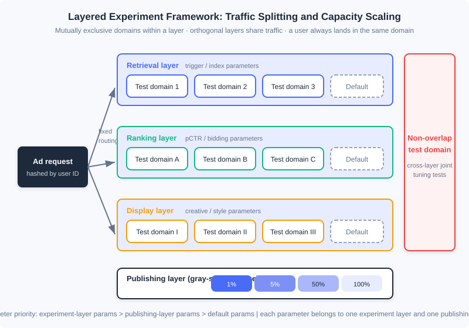
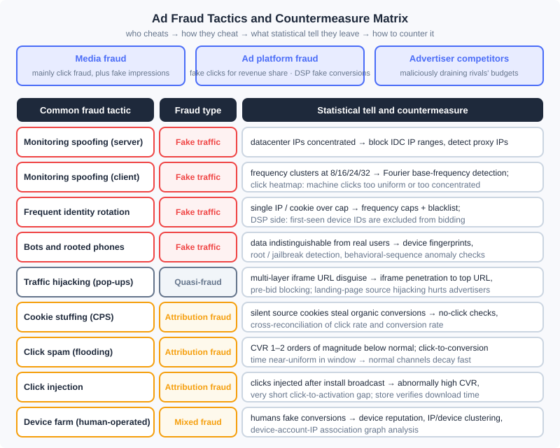

<div style="display: flex; gap: 12px; margin-bottom: 24px; flex-wrap: wrap; align-items: center;">
  <span style="background: #f0f4ff; color: #4A6CF7; padding: 4px 12px; border-radius: 20px; font-size: 0.85em; font-weight: 600; border: 1px solid rgba(74,108,247,0.2);">📖</span>
  <span style="background: #fdf2f8; color: #be185d; padding: 4px 12px; border-radius: 20px; font-size: 0.85em; border: 1px solid rgba(190,24,93,0.2);">⏱️ ~50 min read</span>
  <span style="background: #fef2f2; color: #dc2626; padding: 4px 12px; border-radius: 20px; font-size: 0.85em; font-weight: 600; border: 1px solid rgba(100,100,100,0.15);">🎯 Advanced</span>
</div>

# Experiment Framework and Anti-Fraud: The Two Bottom Lines of an Ad System

> 📝 **Before You Continue:** This chapter closes out Part 12 and assumes you have read 12.1 (The Advertising Panorama and Ecosystem) — the product-selection practice in this chapter loops back to that ecosystem map as a whole; as well as 12.5 (Bias and Calibration) and 12.6 (Open-Loop and Closed-Loop Advertising) — the conclusions of both chapters rest on "experiments you can trust," and this chapter explains why. 12.2 (Billing Models and Core Metrics) helps you see what anti-fraud is actually protecting: the billing metrics themselves.

From 12.1 to 12.7 we assembled the "engine" of the ad system: auction mechanisms, smart bidding, online allocation, calibration, and attribution. But before you dare to press the accelerator on an engine, two more things are needed. The first is **trustworthy measurement**: once you change the ranking model or adjust the bidding strategy, offline evaluation and simulation can never reflect the true interactions among online modules — you must have an experimentation framework that carves out a portion of real traffic for validation, and it must accommodate as many concurrent experiments as possible, or the pace of product evolution gets throttled by the traffic itself. The second is **authentic traffic**: in the advertising market, media, platforms, and advertisers' rivals all have motives to manufacture fake traffic or hijack attribution, and every form of billing (12.2) and optimization (12.4, 12.6) built on impressions, clicks, and conversions gets polluted by fraudulent traffic — anti-fraud is the counterfeit-detection module of this money-printing machine.

This chapter is also the closing piece of the material corresponding to Chapter 17 of *Computational Advertising*: we finish the route "creative optimization → experimentation framework → ad monitoring and ad safety → fraud and anti-fraud → product technology selection in practice," and finally gather the whole of Part 12 into a three-party selection checklist.

After reading this chapter, you will be able to:

- Explain the essential difference between creative optimization and audience targeting, and describe how programmatic creative and click heatmaps work
- Design a layered experimentation framework: explain mutual exclusion within a layer, orthogonality across layers, user-based traffic splitting, and gray release via the publishing layer, and calibrate the framework itself with AA tests
- Describe how third-party ad monitoring works and the key technologies of ad safety (brand safety, viewability, anti-hijacking)
- Classify ad fraud along the three dimensions of actor, principle, and method, and match each fraud tactic with its statistical tell and countermeasure
- Complete product-selection decisions from the three perspectives of media, advertiser, and data provider, and work through 5 tiered practice problems

---

## 12.11.0 Once the Mechanism Runs: Two Bottom Lines

First, position this chapter. Every optimization technique in an ad system — retrieval, ranking, bidding, allocation — is essentially answering one question: "how do we make advertising perform better." But in real production environments, two questions come before "performing better": **"do I know I'm performing better?" (measurement)** and **"is what I'm measuring real?" (authenticity)**.

The first question gives rise to the **experimentation framework**. Changes to strategies, algorithms, and architecture can hardly be fully reflected online through offline evaluation and simulation — the position bias and competition effects covered in 12.5, and the coupling between mechanisms and bidding covered in 12.3, all mean that "testing a new module well in isolation" does not equal "the whole system is better with it in place." The only way to adjudicate is to divert a fraction of real traffic and run an experiment. Splitting traffic itself is not hard; the difficulty is that there are usually many candidate treatments to test at once: how to accommodate more tests within one framework is the key engineering problem for improving the evolutionary efficiency of an ad system.

The second question gives rise to **anti-fraud**. Advertising is a three-way business among advertisers, media, and platforms, and every party (even rivals outside these three) has a motive to manufacture fake traffic or to use technical means to fool ad monitoring and attribution. Because this is a dynamic game of "one foot of defense, ten feet of offense," anti-fraud has no fixed, unchanging techniques or algorithms, but there are principles and foundational methods to follow. Alongside it come **ad monitoring** — the demand side commissions an independent third party to perform verification measurement of impressions and conversions — and the **ad safety** technologies that grew out of it.

### 🧠 Mental Model: The Money Printer, the Quality Inspector, and the Counterfeit Detector

> Think of the ad system as a money printer: the auction and allocation machinery assembled in 12.3–12.7 is the powertrain, and the eCPM and billing metrics defined in 12.2 are the denomination spec of the banknotes. The experimentation framework is the quality inspector — any component upgrade (new model, new strategy) must first be validated on a small batch of "trial banknotes" to confirm nothing was printed crooked before going to full production; the point of layered experiments is that the same sheet of paper can pass several quality gates at once, instead of every gate wasting a whole batch of paper. Anti-fraud is the counterfeit detector — there will always be people in the market printing fake notes (click flooding) and swapping real notes for fakes (hijacking, attribution fraud); no counterfeit detector is ever final, but statistical signatures (frequency distributions, click heatmaps, conversion rates) are the watermarks a counterfeit can never hide.

There is also a perspective that runs through the whole chapter: **monitoring, anti-fraud, and the experimentation framework share the same underlying assets — logs and statistical features**. The click heatmap is a creative-optimization tool in 12.11.1 and becomes an anti-fraud tool for detecting machine clicks in 12.11.4; frequency statistics are the basis of frequency capping in 12.7.2 and the probe that exposes client-side click flooding in anti-fraud. By the end of this chapter you will see that these two bottom lines use no mysterious technology — they simply apply the basic statistics of the earlier sections with a "forensic" flavor.

---

## 12.11.1 Programmatic Creative and Click Heatmaps

Creativity has an enormous impact on advertising performance, but one premise must be established first: **the effect of creative optimization must not be conflated with the effect of audience targeting**. When the creative changes, the appeal the ad expresses has changed, so click behavior is no longer fully comparable. The book's example is blunt: an insurance advertiser swaps a brand creative promoting the company's brand and strength for a form-based creative that asks users to fill out a car-insurance application — the latter's CTR will rise sharply, but the former serves long-term brand penetration and profit margin while the latter serves short-term conversion. The two appeals are fundamentally different, so comparing CTR directly is meaningless. Creative optimization as generally discussed therefore means **adjusting the creative to improve performance while keeping the basic appeal stable**.

Under this premise, the core principle of programmatic creative comes from Chapter 2's ad effectiveness model: **express the key reason this ad is being pushed to this user explicitly in the creative itself**. There are many possible reasons for the push, so it is impossible to pre-produce all creative assets; they can only be assembled automatically by a program at delivery time — by analogy with programmatic trading, this is called **programmatic creative**. Several classic forms:

- **Geo-based creative**: the same car ad dynamically appends the local dealer's phone number for audiences in Beijing and Shanghai respectively. Producing a separate asset per city is uneconomical; geo information should be assembled online at delivery time.
- **Search-retargeting creative**: the user's past search query is placed in the search box beneath the creative, explicitly signaling "I am exactly what you searched for," which more easily captures attention.
- **Personalized-retargeting creative**: the featured product is decided online and the creative is synthesized online — the complete form of programmatic creative.

Creative iteration needs tools, and the **click heatmap** is the most important one: it renders the click density of each position of the creative as a heatmap, helping optimizers spot problems intuitively. The book's case: changing the gaze direction of a person in the creative visibly shifts the user's click hotspots — guided by heatmaps, creative iteration can proceed semi-quantitatively and purposefully, rather than relying on a designer's gut feeling. Programmatic creative introduces an obstacle for heatmaps: once part of the creative is modified online, heatmaps superimposed on top of each other cannot reveal detail-level problems; but for optimizing **fixed elements** and evaluating the performance of a **dynamic module as a whole**, heatmaps remain very helpful.

> **Modern note (2026):** The video-ization and interactivity of creatives (rewarded video, HTML5 playable ads) have become industry standards, and the mainstream programmatic-creative pipeline has been upgraded further to "AI-generated creative + automated experiment selection": large models generate combinations of assets and copy in batches (asset × copy × landing page), and the delivery system uses multi-armed-bandit-style automatic experiments to weed out poor combinations online — the book's CrossInstall practice of "splitting traffic by request parameters to test bubble-row counts" is the plainest prototype of exactly this closed loop. Creative optimization and the experimentation framework of the next section converge here.

---

## 12.11.2 The Experimentation Framework: Layering, Orthogonality, and User-Based Splitting

Now we enter the first core block of this chapter. The key to designing an experiment system is to exploit the relative independence of system modules and **use a layered structure to expand experiment capacity**.

### Layered experiment architecture

A typical architecture places experiment parameters in different **experiment layers**: an ad system usually divides experiment layers by the three modules of **retrieval, ranking, and display**, and each layer can split its traffic into different test subsets (**domains**). There are four key properties:

1. **Mutual exclusion within a layer**: within the same layer, a user (domain) belongs to only one experiment, preventing parameters of the same module from interfering with each other;
2. **Orthogonality across layers**: experiments on different layers **share the same traffic** — the retrieval layer's experiment domains and the ranking layer's experiment domains are split independently, and each request lands in exactly one domain of every layer. This turns the number of concurrent experiments from "how many pieces the traffic can be split into" into "the sum of the split counts across all layers," multiplying experiment capacity;
3. **Non-overlapping test domain**: the system reserves a small block of traffic that does not participate in layering, dedicated to special experiments that require jointly adjusting parameters across layers (for example, the joint effect of changing both retrieval triggering logic and the ranking model);
4. **Publishing layer**: parameters that pass their experiments do not go straight to full traffic, but go through a dedicated publishing layer for **gray-scale release** (e.g. 1% → 5% → 50% → 100%).

The priority relation of parameters is: **experiment-layer parameters > publishing-layer parameters > default parameters**; and a given parameter can appear in only one experiment layer and one publishing layer. A framework that covers both traffic experiments and gray-scale release this way meets the vast majority of engineering needs.



In the diagram, every request enters through the hash entry on the left and deterministically lands in one domain of each layer; the domains of the three layers are independent of one another, so the same traffic is "photocopied" three times, simultaneously supporting three groups of experiments that do not interfere with each other.

### Split by user, not by impression

An easy pitfall: **random assignment per impression is inappropriate**. Multiple ad impressions are correlated (the same user makes consecutive requests), so per-impression randomization mixes the "people" of the treatment and control groups, and the higher-order and long-term effects of a strategy (for example, a new ranking changing users' behavior habits) cannot show up truthfully. The correct approach is **to divide by user**: each user's ad impression requests are deterministically sent to the same domain (decided by hashing the user ID), guaranteeing that one user's complete experience consistently belongs to a single experiment group.

### AA tests and offline/online metric consistency

A link the book touches on only briefly but that is indispensable in industry is the **AA test**: run two groups of traffic under exactly identical configurations to verify that the framework itself introduces no systematic bias. The core criterion of an AA test is "the difference between the two groups should fall within statistical noise" — if even an AA test yields a significant difference, the splitting is uneven, the log definitions are inconsistent, or position/time-related confounders exist, and every subsequent A/B conclusion is untrustworthy. This continues the thread of 12.5's calibration: calibration ensures "the absolute values the model outputs are trustworthy," while the AA test ensures "the measurement system itself is trustworthy"; together they make the absolute values of online metrics meaningful. In step with this, experiment metrics must maintain **offline/online consistency**: the objective used in offline training (e.g. calibrated pCTR) and the metrics observed in online experiments (actual CTR, eCPM, conversions) must be aligned in definition, otherwise experiments produce uninterpretable results like "up offline, down online."

> **Analysis:** The layered experimentation framework is not deep technology, yet it is notoriously the module whose engineering effort is most easily underestimated: it is tightly coupled with the delivery engine and every part of data processing, brings no direct revenue, and is the first thing cut when a product launches. But the two most important things when any product starts development are, first, defining a measurable objective function, and second, building a flexible and efficient experimentation framework — with these two in place, product iteration accelerates enormously. Looking back at Part 12: the mechanism design of 12.3, the bidding strategies of 12.4, the calibration schemes of 12.5 — every launch decision consumes experiment capacity; the capacity of the experimentation framework is the ceiling of the ad system's "evolution bandwidth."

---

## 12.11.3 Ad Monitoring and Ad Safety

The experimentation framework answers "did the change work"; this section answers another measurement question: "**do the numbers reconcile**." A defining feature that distinguishes online advertising from offline advertising is measurability, but the transaction involves multiple parties — media, ad platform, advertiser — and under every billing model other than CPC, the billing metric is invisible to at least one side. An independent, impartial **third party** is therefore needed to measure impressions or conversion performance: this is **ad monitoring**. The main demand for monitoring exists in CPT/CPM-billed contract advertising: auction advertising has no agreed price, the advertiser can adjust bids based on downstream performance, so monitoring is not a hard requirement. Performance monitoring mainly serves brand advertisers and generally takes about 1% of online brand campaign budgets.

### How third-party monitoring works

Monitoring code is code with client-side information-collection capability: when an impression occurs, it packs client information into a parameterized URL and sends it via HTTP request to the third party, telling it "**who, at what time, saw which advertiser's ad on which media**". What the industry calls "monitoring code" is really this monitoring URL itself; the URL parameters carry identifiers of all three parties — ad, media, and user (such as OS, device ID, IP, UA, timestamp). The third party parses the URL and forms a log, recording one impression. The macro pipeline is "impression/click tracking → third-party logs → reconciliation against media/platform data"; the protocol details (parameter specs, SDK collection fields) evolve with industry standards, and understanding the pipeline is enough.

The real difficulty is **verifying audience-targeted delivery**. A campaign requires 1000 mille impressions on male-user traffic — how do you confirm the result met target? The prevailing scheme is "sampling + payment": collect real user attributes on a small sample of the population, verify the attribute accuracy on that portion, and infer the overall delivery from it. The method is simple, but the sample's distribution can deviate substantially from the delivered population, so **bias correction** is the key; moreover only demographic-attribute delivery can be verified this way — interest tags have no ground truth for the same user, so monitoring adds little. The trend is to use platforms with more accurate and larger-scale demographic data as the benchmark (e.g. Nielsen partnering with Facebook to launch a monitoring service based on its demographic attributes).

### Ad safety: brand safety, viewability, and anti-hijacking

In complex programmatic trading, advertisers can hardly manage their delivery media explicitly anymore, yet a real need exists: **ads must not appear on media carrying certain content** (a car advertiser does not want to appear next to car-crash news or vulgar websites). The service that guarantees this need is called **ad safety**, with two key technologies:

- **Advertising verification**: the point is not metering but **preventing** inappropriate impressions from happening — when page content is found to violate brand-safety requirements, stop serving the advertiser's creative and switch to a brand-neutral creative. The engineering core is **iframe penetration**: in the trading process, media may disguise URLs with multiple layers of iframes and pass off inferior traffic as premium (wrapping a small site's traffic in a high-premium domain shell), so the page's top-level URL must be judged in real time at serving. With accumulated historical experience, a **pre-bid** scheme can be adopted: simply refuse to participate in transactions for URLs or ad slots already known to be unsafe, saving serving cost.
- **Viewability verification**: brand advertisers care about how exposed their impressions actually are — a second-screen ad slot delivers far weaker exposure than the first screen. The technical approach is to determine whether the browser actually **rendered** the ad creative; unrendered impressions do not count as viewable. When the book was written, viewability verification could be done for over 95% of in-browser traffic, while in-app mobile ads had no good solution at the time. **Modern note (2026):** Viewability has since been unified by standards such as MRC (e.g. the dual-threshold "viewable impression" definition on area and duration) and has become one of the default settlement metrics for brand buying.
- **Anti-hijacking**: traffic hijacking (forcibly placing ads where one has no right to serve, tampering with creatives or even landing pages) is the gray zone ad safety must face; we defer it to 12.11.4 together with fraud.

**Attribution de-duplication**: when billing by CPA/CPS/ROI, conversions happen off the media, so a third party is needed to match conversions to impressions/clicks — that is, **ad performance attribution**. The spectrum of attribution models, attribution windows, and privacy-era solutions like ATT/SKAN were covered systematically in 12.6 and are not repeated here; you only need one connection to this chapter: **attribution rules (such as "downloads within N days after a click are credited to the click channel") are exactly the attack surface of attribution fraud** — the next section expands on this immediately.

---

## 12.11.4 Fraud and Anti-Fraud

The second core block of this chapter. For anti-fraud to know itself and know the enemy, it must first answer three questions: **who cheats, why they cheat, and how they cheat**.

### Three categories of fraud actors

An ad campaign is a three-way interaction among advertiser, media, and user, and fraud comes mainly from three kinds of actors:

1. **Media fraud**: ad networks and media are mostly billed by click, so **click fraud** is the most common; fake impressions also occur to meet CPM order volumes.
2. **Ad platform fraud**: ad networks or exchanges have a motive to fabricate fake clicks to earn a larger revenue share; demand-side products such as DSPs may mix in low-quality traffic and manufacture fake clicks and **fake conversions** to satisfy advertisers' performance reviews.
3. **Advertiser-competitor fraud**: using technical means to massively drain a rival advertiser's budget, achieving the abnormal competitive goal of suppressing its advertising performance.

### Classification along three dimensions

- **By principle**: **fake-traffic fraud** (NHT, non-human traffic) — the impressions, clicks, or conversions themselves are fabricated; this is the mainstream of CPM/CPC ad fraud; **attribution fraud** — crediting traffic from other channels or organic traffic to oneself; because fabricating conversions is expensive, CPA/CPS advertising mostly takes this route.
- **By method**: **machine fraud** scales easily but leaves obvious statistical fingerprints (AI and deep learning are making machine fraud more human-like, raising the difficulty of anti-fraud accordingly); **human-operated fraud** is popular in CPA/CPS advertising — when total conversions are controllable, real human operations come closer to genuine performance.
- **By stage**: impression fraud, click fraud, conversion fraud — corresponding to the three metering points of 12.2's billing metrics.

### Common fraud tactics and the countermeasure matrix



The figure above condenses the book's 17.4 list of tactics; here we expand on the ones with the strongest "forensic" flavor:

- **Spoofing the monitoring code (server-side / client-side)**: simply sending requests to the monitoring URL can fabricate impressions. The server-side version is simple and direct, but the IP and cookie distributions look unnatural — blocking IDC datacenter IPs resolves most of it, forcing fraudsters to acquire large numbers of proxy IPs. The client-side version (web JS repeatedly requesting the monitoring code) is hard to catch from user-distribution flaws, but it leaves a **frequency fingerprint**: a site's user frequencies cluster heavily at 8, 16, 24, 32 — every user's browsing was inflated by 7 extra requests; to discover such patterns automatically, apply a **Fourier transform** to the user-frequency distribution curve and look for a **fundamental frequency**. Click flooding also gives itself away on the **click heatmap**: natural clicks correlate with the creative's key regions and have a natural shape, while machine clicks are either too uniform or too concentrated.
- **Frequently rotating user identities**: heavy impressions and clicks from a single IP/cookie are the easiest to remove (set a sensible frequency cap, blacklist over-the-limit identities), so fraudsters must rotate IPs and cookies constantly. The DSP-side countermeasure is blunt but effective: **a cookie or device ID seen for the first time simply does not participate in bidding**.
- **Bot machines and rooted phones**: machines infected with trojans and remotely controllable (bots), and phones with root access, can all perform browsing, clicking, and downloading in the background that is indistinguishable from real data — statistically hard to tell apart. Countering them requires device-environment and behavioral-sequence features, not traffic statistics.
- **Traffic hijacking**: a "quasi-fraud" only the operators of underlying network services such as DNS and CDNs can commit; tactics include channel pop-ups, creative replacement, search-result redirection, and landing-page source hijacking. The first three harm the media's interests (the traffic itself is real); the fourth (directly appending channel parameters when the user visits the advertiser's landing page) is outright fraud and harms the advertiser. This is exactly what the iframe penetration and top-level URL checks of 12.11.3 defend against.
- **Cookie stuffing**: attribution fraud specific to CPS affiliate advertising — via hidden iframes and similar means, a source cookie is silently planted without the user clicking, so the user's subsequent organic purchase "becomes" that channel's performance; like click injection, it belongs to "turning organic outcomes into promoted outcomes."
- **Click spam / click flooding and click injection**: the two most rampant kinds of **attribution fraud** in mobile download advertising. Click spam exploits the loose ends of user-ID-collision attribution (the attribution-window rules of 12.6): fabricate clicks for a large number of users, and their subsequent organic downloads get attributed to the channel — and because it hijacks organic downloads, downstream performance even looks better than an ordinary channel. It is not hard to detect statistically; there are two smoking guns: first, if all users are marked as clicked, CVR comes out **one to two orders of magnitude lower** than normal; second, the click-to-conversion time distribution is **near-uniform across the attribution window**, whereas genuine conversions **decay rapidly** over time. Click injection exploits Android's install broadcast: as soon as app A is installed, the system broadcast lets the fraudulent app B's SDK immediately fire a make-up click, snatching attribution for the activation a few seconds later — the signature is an abnormally high CVR and an extremely short click-to-activation gap; if the app store and the attribution provider cooperate to verify download times, this route is almost certain to be caught. **Device farms** are the modern human-powered form of attribution fraud: real people with real devices mass-produce "browse — click — convert" sequences, and every dimension of the data looks genuine; only device clustering and association networks can identify them.

> **Modern note (2026):** The mainstream of anti-fraud has shifted from "rule blacklists" to **machine-learning fleet-wide anomaly detection + device reputation-score systems** (such as MIPS-style device integrity/reputation scores), and mobile anti-fraud frameworks like MMAF, Adjust, and AppsFlyer have made recognizing patterns such as click flooding, click injection, and device farms a mature capability. But the underlying logic is exactly the same as the book's: **fraud can disguise a single record; it cannot disguise all statistical distributions at once**.

### The three-tier countermeasure system

Organizing the tactics above into a methodology, an anti-fraud system has three tiers:

1. **Anomaly detection**: set thresholds and models over statistical features such as frequency distributions, click-position distributions (heatmaps), CVR, and click-to-conversion time distributions to identify deviations from natural traffic. This is the highest-ROI tier.
2. **Device fingerprinting and identity graphs**: track the same fraud source across IPs and cookies, and build device-level blacklists and reputation scores for bots, rooted phones, and device farms.
3. **Graph analysis**: connect devices, IPs, accounts, and payment accounts into a graph; fraud rings show highly clustered structures on the graph (batches of devices sharing IP ranges, batches of accounts sharing payout paths), and the disguise of any single record fails in the face of the association network.

In engineering form, the anti-fraud decision model needs **two versions**: an online real-time version that filters for billing and other real-time feedback modules; and an offline fine-grained version that processes the full ad logs daily and produces the final confirmed financial-settlement data. Anti-fraud features and models are among the most closely guarded modules of an ad system — the secrecy itself is part of the contest (mirrored by the fraudsters' countermeasure of **IP masking**: blocking the IP ranges of oversight personnel so violation scenarios are hard to reproduce and review).

---

## 12.11.5 Closing: Product Technology Selection in Practice

The final section of the entire book returns to the ecosystem map of 12.1. From the perspective of monetizing advertising and quasi-advertising, three kinds of assets on the internet can be turned into money: **data, traffic, and brand attributes** — the latter two belong exclusively to media, while the first may come from media or from third-party data owners. Each of the three roles faces one core question; the selection checklists follow.

### Media: how to monetize better with the right ad products

Media monetization must balance **short-term revenue and long-term brand value**: insisting on high-quality advertising supports a brand premium, but small and mid-sized media can often only watch the immediate per-unit-traffic monetization capability (RPM). Decision checklist (in priority order):

1. **Native first**: for content feeds, lists, and other native-friendly formats, consider paid native content first; with sufficient traffic you can run your own native ad platform (especially when on-site search traffic is large), otherwise partner with a native platform or an industry search advertiser.
2. **Brand contracts**: with brand attributes, sell strong-exposure slots via CPT slot contracts and generic banner slots via CPM impression contracts (selling targeted audience labels) — brand premiums usually bring higher RPM. Note that contract sell-through will not be too high, and when you later take on auction advertising you must guard against damaging the brand price system.
3. **Auction off the remaining traffic**: vertical commercial media (autos, real estate, e-commerce) fit industry-vertical ad networks; general or non-commercial vertical media can use horizontal ad networks — with high-quality or high-volume traffic you can build your own, otherwise selling to a large ad network is more convenient.
4. **Programmatic trading**: with quality requirements on advertisers, go private (PMP/PDB, controlling DSP admission); with no special requirements, go open exchange; SSP is converging with ADX.
5. **Data support**: with CPM targeted contracts, a self-operated ADN, or private trading, you need audience-label capability — with ample data and a team you can build your own audience-targeting platform, otherwise adopt a third-party DMP directly.

### Advertisers: which platforms and data to choose for efficient marketing

The first fork is **brand or direct response**:

- **Direct response**: without first-party data, search advertising is the high-ROI first choice (keyword bidding is complex; small and mid-sized advertisers often hand it to SEM agencies), vertical industry gateways (app stores, co-distribution, group buying and other major traffic sources of the industry) are a top choice, and display ad networks serve as an auxiliary channel to amplify reach; with first-party data and technical capability, add a **performance DSP**: retargeting for existing customers, look-alike prospecting for new customers, and large online service providers can integrate deeply with a DSP for personalized retargeting.
- **Brand campaigns**: for periodic flagship events (such as "Double Eleven"), choose CPT on strong-exposure slots; for general brand campaigns, choose CPM targeted contracts combined with audience strategy; for strategies media labels cannot express, use a **brand DSP** (CPM billing + service fee) to buy on the exchange by your own audience segmentation.
- **Build-vs-buy threshold**: large and mid-sized advertisers should invest when SEM optimization tooling is substantial (large e-commerce companies' SEM is often an important internal product) and customized-label delivery volume is large (self-built DSP); otherwise not.

### Data providers: how to turn data into money

Before monetizing data, do a **value assessment**: `number of users × average user value`, where average user value is determined by RPM (the value density of the data) and the number of impressions through which a single user is effectively reached by ads (which requires expanding media contact). Monetization paths:

1. **Contract processing (light participation)**: if the data volume is too small to justify processing it yourself, entrust a DMP to process it, and sell labels through a data trading platform during transactions — the simple, easy route for small and mid-sized providers.
2. **Operating your own ad product (deep participation)**: successfully running an ad product is never just building a system; it requires technology, product, and business model to come together. The choice depends on data coverage: when **data concentrates in vertical industries with limited coverage but high value** (autos, healthcare), SSP/ADN/ADX are all unsuitable — the right plan is to build a **DSP** that bids only on traffic your data can cover; when **data spans industries and covers many people**, you can operate an **ad network** to monetize.

This three-party checklist is the "operations manual" that the 12.1 ecosystem map puts into each role's hands: media holds traffic and brand attributes to bargain upstream, advertisers bring budgets and first-party data to buy performance downstream, and data providers sell the information asymmetry between the two. With this, Part 12 has traveled from the panorama through billing, mechanisms, bidding, calibration, attribution, and allocation, and finally lands back on the panorama — every cell of the map of ad systems is now territory you have walked.

---

## ⚠️ Common Mistakes in 12.11

| # | Mistake | Example | Why It's Wrong | Fix |
|---|---------|---------|---------------|-----|
| 1 | Splitting experiment traffic randomly per impression | Each ad request independently and randomly decides treatment vs control | The same user's impressions are highly correlated; per-impression randomization splits "people" across two groups, and the long-term, higher-order effects of a strategy cannot show up | Hash by user ID into a fixed domain: all of one user's requests forever belong to the same domain |
| 2 | Expecting one experiment framework to hold unlimited experiments, or running A/B without AA first | All experiments crammed into one layer with mutually exclusive splits, exhausting traffic early; never validating the framework itself before launching a new strategy | Single-layer mutually exclusive capacity = number of traffic pieces, which cannot scale; a significant AA difference means the splitting or metric definitions are biased, and every subsequent A/B conclusion is untrustworthy | Layer by module (orthogonal across layers) + reserve a non-overlapping domain + gray release via the publishing layer; run AA tests regularly to validate the framework |
| 3 | Conflating the effect of creative optimization with that of audience targeting | Swapping a brand creative for a form creative makes CTR soar, credited to "targeting tuned well" | A changed creative means a changed appeal, so click behavior is no longer comparable; the CTR rise may be nothing but the appeal switch | Keep the basic appeal stable when evaluating creative optimization, or explicitly separate the objectives of brand vs response appeals |
| 4 | Doing anti-fraud only offline, or relying on a single rule blacklist | Running rule-based IP-blacklist filtering once a day offline, with no online billing filter | Fake traffic flows into billing and optimization data in real time; by the time the offline batch finishes the loss has happened; a single rule fails against identity rotation, bots, and so on | Dual models — online real-time (billing filtering) + offline fine-grained (financial settlement) — stacked with statistical anomaly detection, device fingerprinting, and graph analysis |
| 5 | Metering without removing fraud, or ignoring that attribution rules can be exploited in reverse | A third party reconciles directly against raw tracking counts; setting the attribution window as long as possible | All impression/click metering must rest on fraud-filtered data, otherwise the reconciliation itself is wrong; a loose attribution window is a bonus paid to click flooding | Pass anti-fraud filtering before metering; set attribution windows per the industry's conversion cycle, and monitor CVR and click-to-conversion time distributions for anomalies |
| 6 | Treating traffic hijacking as ordinary click flooding, or confusing whom it harms | Handling channel pop-ups and landing-page source hijacking as the same problem | Channel pop-ups, creative replacement, and search redirection harm the media (the traffic itself is real); landing-page source hijacking harms the advertiser — the responsible parties and countermeasures differ completely | First classify by "who is harmed": media side relies on iframe penetration and pre-bid blocking; advertiser side relies on source-parameter validation and channel reconciliation |

---

## Chapter Summary

### 📌 Key Takeaways

| Concept | Key Points | Why It Matters |
|---------|-----------|----------------|
| Programmatic creative | Assemble the key reason for the push into the creative online (geo / search term / product); click heatmaps guide semi-quantitative iteration | Creative optimization must be evaluated separately from audience targeting; by 2026 it has evolved into AI-generated creative + automated experiment loops |
| Layered experimentation framework | Mutual exclusion within layers, orthogonal layers sharing traffic, a non-overlapping domain for joint tuning, gray release via the publishing layer; split by user; AA tests calibrate the framework | Experiment capacity = the ceiling of the system's evolution bandwidth; every strategy launch in 12.3–12.7 consumes it |
| Ad monitoring | A third party meters via the monitoring URL "who saw which ad on which media when"; targeted delivery verified via sampling + bias correction | The factual basis for CPM/CPT contract settlement, serving brand advertisers (about 1% of budgets) |
| Ad safety | Advertising verification (iframe penetration, pre-bid) protects brand safety; viewability verification (render checks) protects exposure quality | Prevents harmful impressions from happening, rather than merely metering them afterward |
| Fraud and anti-fraud | Three actor categories × two principles (fake traffic / attribution fraud); countermeasures = statistical anomaly detection + device fingerprinting + graph analysis, with online/offline dual models | Protects the billing metrics of 12.2 and the attribution metrics of 12.6 from pollution; a dynamic game with no final answer |
| Selection practice | Decision checklists for three assets (data / traffic / brand attributes) × three roles (media / advertiser / data provider) | The landing point of all of Part 12: the operations manual the ecosystem map puts in each role's hands |

### ❓ FAQ

**Q1: The experimentation framework brings no direct revenue — is it worth investing in for small and mid-sized teams?**
> A minimal viable version is not expensive: one layer of random domains + user-ID-hash splitting + one AA validation flow — about an engineer-week of work. The truly expensive engineering lies in multi-module layering and parameter-conflict management, which can be added as the business grows. Look at the cost from the other side: without an experimentation framework, tuning one multiplier for the bidding strategies of 12.4 or swapping in a new calibration scheme from 12.5 leaves success entirely to guesswork — the price of one wrong decision often exceeds the cost of building the framework.

**Q2: Attribution keeps getting restricted in the privacy era (ATT/SKAN, see 12.6) — has attribution fraud disappeared?**
> The attack surface changed; the fraud did not. Tactics that depend on system broadcasts and precise ID collisions, such as click injection, have indeed been squeezed, but fraud has moved to harder-to-detect forms: device farms mass-operated by real humans, and increment laundering through MMM/incrementality measurement loopholes (SKAN's aggregate reporting has the same problem of post-hoc conversions faked after installs). The center of gravity of anti-fraud has accordingly shifted from "is this single record real" to "fleet-wide distributions and group correlations" — which is exactly why ML anomaly detection and device reputation scores have become mainstream in the modern note.

**Q3: The click heatmap serves both creative optimization and anti-fraud — how can one tool serve both ends?**
> In essence it is two readings of the same data (the click-position distribution). Creative optimization asks "where do clicks concentrate, do they land on the key information areas" — a **local** diagnosis; anti-fraud asks "does the distribution shape look like natural clicks" — a **fleet-wide** statistical test — because machine-generated distributions are either too uniform or too concentrated and thus distinguishable from natural shapes. In engineering, anti-fraud uses distribution tests over full traffic, while creative optimization uses the aggregated heatmap of a single creative — different granularity, same underlying principle.

### 🔗 Connections to Other Chapters

This chapter closes Part 12, so the connections become a look back at the whole part:

- **12.1** (Panorama and Ecosystem): the three-party selection checklist of 12.11.5 is the operations manual the ecosystem map puts in each role's hands (media / advertiser / data provider) — the three monetizable assets (data / traffic / brand attributes) map exactly to the three roles' resource endowments
- **12.2** (Billing Models and Core Metrics): what anti-fraud protects is the billing metrics themselves — CPM's impression count, CPC's click count, CPA's conversion count; every metering point corresponds to a fraud category (impression / click / conversion fraud)
- **12.3 and 12.4** (Auction Mechanisms, Smart Bidding): every iteration of mechanisms and bidding consumes experiment capacity; the capacity of the layered experimentation framework is the evolution bandwidth of both directions
- **12.5** (Bias and Calibration): calibration keeps the model's output values trustworthy, AA tests keep the measurement system itself trustworthy — only together do online metrics mean anything
- **12.6** (Open-Loop and Closed-Loop Advertising): attribution rules are the attack surface of attribution fraud (click flooding / click injection / cookie stuffing); ATT/SKAN tightening attribution also changed the shape of fraud
- **12.7** (Online Allocation): completion-rate monitoring for volume-guarantee contracts and traffic-forecast-bias diagnosis likewise rely on this chapter's experiment and monitoring loop

---

## Practice Problems

Work through all problems in order — they get progressively harder. Each has a complete solution you can reveal after trying it yourself.

---

**Problem 12.11.1 — Exposing client-side click flooding from the frequency distribution** 🟢 Easy

A website runs a display campaign. Third-party monitoring shows: 10,000 unique users that day, 80,000 monitored impressions in total, and a user frequency distribution abnormally clustered at 8, 16, 24, and 32. Assume the site's genuine per-user browsing is 1 page view per day, and the fraud code requests the monitoring URL 7 extra times on every page view. Compute: genuine impressions, fraudulent impressions, and the share of fraud in total impressions; and explain how a Fourier transform can discover this pattern automatically.

**Sample Input:** Unique users $10{,}000$; monitored impressions $80{,}000$; 1 genuine page view per user; 7 extra requests per view
**Sample Output:** Genuine impressions $10{,}000$; fraudulent impressions $70{,}000$; fraud share $87.5\%$
<details>
<summary>💡 Solution (click to reveal)</summary>
**Approach:** Every genuine page view produces $1 + 7 = 8$ monitoring requests, so observed frequencies are multiples of 8 — exactly why frequencies cluster at 8/16/24/32.

- Genuine impressions = unique users × genuine views = $10{,}000 \times 1 = 10{,}000$.
- Sanity check: $10{,}000 \times 8 = 80{,}000$, matching the monitored total.
- Fraudulent impressions = $80{,}000 - 10{,}000 = 70{,}000$; share $70{,}000 / 80{,}000 = 87.5\%$.

How to use the Fourier transform: treat the "frequency → number of users" distribution curve as a signal. Genuine user behavior produces a smoothly decaying frequency distribution, while "7 fixed extra requests per view" produces equally spaced spikes at frequencies 8, 16, 24, 32 — take the Fourier transform of the distribution curve and the **fundamental frequency corresponds to a 1/8 period** (i.e. 7 inflated requests + 1 genuine view); the reciprocal of the spike spacing directly exposes how many repeat requests the fraud code fires each time.
**Key points:**
- The "regularity" of fraud code inevitably leaves a periodic fingerprint in statistical distributions — this is the starting point of all statistical anomaly detection
- Genuine traffic is smooth; fraudulent traffic has a rhythm — testing distribution shapes is far cheaper than auditing records one by one
</details>

---

**Problem 12.11.2 — Calibrating the experimentation framework with an AA test** 🟡 Medium

An experiment platform splits traffic by user-ID hash into two domains for an AA test: domain 1 and domain 2 each see 100,000 impressions; domain 1 produces 200 clicks (CTR = 0.200%) and domain 2 produces 212 clicks (CTR = 0.212%). Using a two-proportion z-test, determine whether the difference between the two groups is significant at $\alpha = 0.05$ (two-tailed, critical value $|z| > 1.96$). Does this result mean the framework can be safely used for A/B tests?

**Sample Input:** $n_1 = n_2 = 100{,}000$; $c_1 = 200$, $c_2 = 212$
**Sample Output:** $z \approx 0.59 < 1.96$, difference not significant, AA passes
<details>
<summary>💡 Solution (click to reveal)</summary>
**Approach:** Two-proportion z-test with the pooled proportion estimating the variance.

```python
import math
n, c1, c2 = 100000, 200, 212
p1, p2 = c1/n, c2/n
pp = (c1 + c2) / (2*n)                      # ← KEY LINE: pooled proportion
se = math.sqrt(pp*(1-pp)*(1/n + 1/n))
z = (p2 - p1) / se
print(z)   # 0.592
```

- Pooled CTR $p = 412 / 200{,}000 = 0.00206$.
- Standard error $SE = \sqrt{0.00206 \times 0.99794 \times (2/100{,}000)} \approx 0.000203$.
- $z = (0.00212 - 0.00200) / 0.000203 \approx 0.59$.

$|z| = 0.59 < 1.96$: the difference between the two groups falls within statistical noise, so the AA test passes — the split is even and log definitions agree, and the framework can be safely used for A/B tests. Note the use of the counterexample: if an AA test does produce a significant difference, first check whether the splitting hash is skewed, whether metric definitions agree, and whether time-of-day confounders exist — **do not launch any A/B before fixing the framework**.
**Key points:**
- The AA test is the framework's "self-check": it should detect nothing; if it does, the problem is the framework
- At a sample size of 100,000, a CTR difference of about ±0.028 percentage points is within noise — do not mistake noise for signal
</details>

---

**Problem 12.11.3 — Capacity scaling of layered experiments** 🟡 Medium

An ad system plans a layered experimentation framework with three layers — retrieval, ranking, display — plus a 10% reserve of traffic for the non-overlapping test domain. The business requires every experiment domain to hold no less than 5% of traffic (to guarantee test power). Compute: how many experiments can run concurrently in the single-layer case (no layering, all experiments in mutually exclusive splits)? After layering? By what factor does capacity grow? Also state: where should an experiment that "simultaneously changes retrieval triggering logic and the ranking model" run?

**Sample Input:** Three layers; non-overlapping domain reserves 10%; each experiment domain ≥ 5%
**Sample Output:** 18 experiments single-layer; 54 layered; 3× growth; the joint-tuning experiment goes to the non-overlapping test domain
<details>
<summary>💡 Solution (click to reveal)</summary>
**Approach:** Usable traffic budget = $100\% - 10\% = 90\%$; each experiment needs at least 5%.

- Single-layer scheme (all experiments split the same traffic exclusively): $\lfloor 90 / 5 \rfloor = 18$ experiments.
- Layered scheme: each layer independently splits the same traffic, 18 experiments per layer, so $18 \times 3 = 54$ experiments run concurrently across the three layers.
- Capacity grows $54 / 18 = 3$ times — exactly the number of layers. The essence of cross-layer orthogonality is that **the same traffic is reused by different layers**, so experiment capacity grows linearly with the number of layers.

The experiment "simultaneously changing retrieval triggering logic and the ranking model" involves jointly adjusting parameters of two layers: placing it in an experiment layer would couple its parameters with the other experiments of both layers, making the conclusion unattributable; the correct home is the **non-overlapping test domain** — it does not participate in layering, owns its traffic exclusively, and exists precisely for such cross-layer experiments.
**Key points:**
- Mutual exclusion within a layer keeps same-module parameters from fighting; orthogonality across layers keeps traffic from being consumed twice
- The non-overlapping domain is "paying for a special experimental capability": the reserve must be small (on the order of 10%) but it must exist
</details>

---

**Problem 12.11.4 — Detecting click flooding in a mobile channel** 🔴 Hard

You are an advertiser running app-download campaigns. A third-party attribution platform reports last week's data for two channels (attribution window: 7 days):

| Channel | Clicks | Conversions (activations) | CVR | Click→conversion time distribution (day0 to day6) |
|---|---|---|---|---|
| Channel X | 1,000,000 | 500 | ? | 10% / 15% / 12% / 11% / 11% / 11% / 10% |
| Channel Y | 200,000 | 6,000 | ? | 60% / 20% / 8% / 5% / 3% / 2% / 2% |

Compute the click-to-activation CVR of both channels; combining the industry experience that "normal channel CVR is about 3%" with the two channels' time distributions, decide which channel is committing click flooding, and give at least two pieces of evidence.

**Sample Input:** See table above
**Sample Output:** Channel X CVR = 0.05% (about 60× below normal), time distribution near-uniform → verdict: click flooding
<details>
<summary>💡 Solution (click to reveal)</summary>
**Approach:** Click flooding fabricates clicks for a large number of users and waits for their organic downloads to be attributed to itself, so its statistical signature must be "huge clicks, scarce conversions, uniform time distribution."

- Channel X: $\mathrm{CVR} = 500 / 1{,}000{,}000 = 0.05\%$, about $3\% / 0.05\% = 60$ times below a normal channel (close to two orders of magnitude).
- Channel Y: $\mathrm{CVR} = 6{,}000 / 200{,}000 = 3\%$, consistent with normal experience.

Evidence one (CVR): channel X is about 60× low — every user was marked as clicked, so the denominator is inflated. Evidence two (time distribution): channel X's conversions are **near-uniformly distributed** across the 7-day attribution window (10%–15%), the shape of "waiting for organic downloads"; channel Y shows **rapid decay** (60% → 20% → …), matching the genuine behavior chain of "click → download decision." Conclusion: channel X is committing click flooding; it should be clawed back or dropped, and the attribution platform should be notified to add monitoring.
**Key points:**
- The two smoking guns of click flooding: CVR 1–2 orders of magnitude low + a uniform click-to-conversion time distribution (genuine conversions decay fast over time)
- It hijacks organic downloads, so "downstream performance looks decent" is precisely not evidence that channel X is innocent
</details>

---

**Problem 12.11.5 — Designing a monetization and protection plan for a vertical media** 🏆 Challenge

You are the technical lead of a vertical media in the automotive industry (800K daily UV; users are high-value people with recent car-buying intent). Provide: (1) a monetization path designed per the 12.11.5 selection checklist (product forms, trading methods, data support), with the rationale for each step; (2) which fraud tactics this media most needs to guard against (given its industry and traffic characteristics); (3) if a new lead-form optimization strategy is to be launched, how to validate it with the experimentation framework — write out the layer choice, the splitting method, and the validation process.

**Sample Input:** Media profile (vertical industry, high-value audience, 800K daily UV)
**Sample Output:** Monetization checklist + fraud-defense priorities + experiment plan
<details>
<summary>💡 Solution (click to reveal)</summary>
**Approach:** Walk the media column of the three-party selection checklist, then screen the fraud surface with the actor × tactic matrix, and finally apply the layered-experiment template.

**(1) Monetization path:**
- Autos are a typical vertical commercial industry with clear user intent → an industry-vertical ad network plus contracts with automotive brand advertisers are the mainstay; strong-exposure slots like the homepage go to CPT special-form contracts, generic slots to targeted CPM impression contracts (selling the "recent car-buying intent" audience label — this requires behavioral modeling of purchase intent, or plugging in a third-party DMP).
- High-value vertical traffic should not be fed straight into undifferentiated open exchange → the programmatic portion goes private (PMP), controlling DSP admission to avoid conflict with brand selling.
- Rationale: a vertical media's core assets are "clear-intent, high-value traffic + industry brand attributes"; the highest-RPM monetization is selling them to industry advertisers willing to pay a premium, not wholesaling to a horizontal network.

**(2) Fraud-defense priorities:**
- Automotive leads (CPL/CPA-style reviews) are high-value → conversion-side **attribution fraud** and human-operated fraud (device-farm-style lead-form flooding) are the primary threats; defense relies on lead-quality checks (call-back verification of submitted phone numbers, behavioral-sequence completeness) and conversion-rate reconciliation.
- High-RPM traffic also attracts **traffic hijacking** and **client-side click flooding**: defense relies on iframe penetration to verify your own ad slots and on monitoring whether your frequency distribution develops a periodic fingerprint.
- As a media you must also guard against "being hijacked" and "being impersonated": monitor whether your own domains appear in anomalous ad-trading logs.

**(3) Experiment plan:**
- The new strategy is "lead-form optimization," acting on the **display stage** → place it in the **display layer**; hash by user ID to route 5% of traffic into the experiment domain, with the rest as control.
- Process: run AA for 1–2 days first to confirm the framework is unbiased → A/B on core metrics (lead submission rate, form completion rate) and guardrail metrics (page bounce rate, downstream store-visit rate, guarding against simpler forms degrading lead quality) → once significant and guardrails intact, gray release via the publishing layer (1% → 5% → 50% → 100%).
- Key point: lead quality is this industry's "performance metric"; the experiment metrics must include quality guardrails, or you will optimize a fake win of "easy forms full of watery leads."
**Key points:**
- The selection through-line for a vertical media: high-value traffic → sell in controlled volume at a premium (contracts + private trading), not by bulk
- Deploy fraud defenses around "the metering point that is most valuable to you": for a vertical media, leads are the most valuable, so human-operated fraud and attribution fraud come first
- Before launching any strategy, a passing AA test is the precondition for a valid A/B conclusion
</details>
