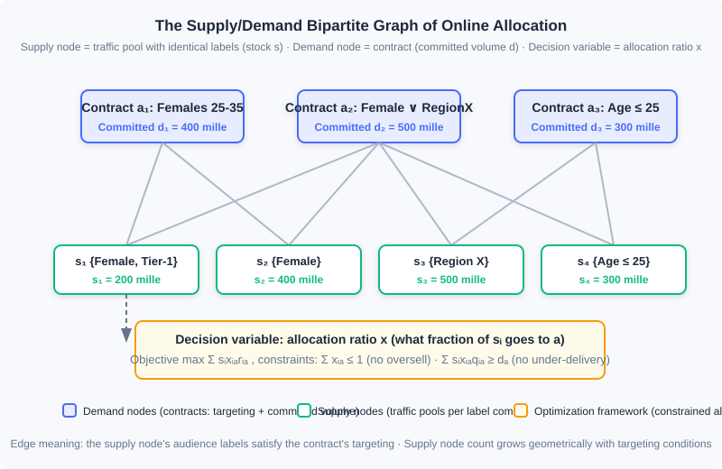
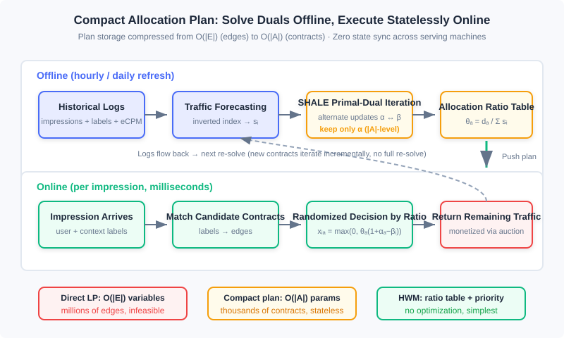

<div style="display: flex; gap: 12px; margin-bottom: 24px; flex-wrap: wrap; align-items: center;">
  <span style="background: #f0f4ff; color: #4A6CF7; padding: 4px 12px; border-radius: 20px; font-size: 0.85em; font-weight: 600; border: 1px solid rgba(74,108,247,0.2);">📖</span>
  <span style="background: #f0fdf4; color: #16a34a; padding: 4px 12px; border-radius: 20px; font-size: 0.85em; border: 1px solid rgba(22,163,74,0.2);">⏱️ ~55 min read</span>
  <span style="background: #fef2f2; color: #dc2626; padding: 4px 12px; border-radius: 20px; font-size: 0.85em; font-weight: 600; border: 1px solid rgba(100,100,100,0.15);">🎯 Advanced</span>
</div>

# Online Allocation and Traffic Management

> 📝 **Before You Continue:** This chapter requires reading 12.1 (The Advertising Panorama and Ecosystem) first — where contract advertising sits in the ecosystem and how "guaranteed volume" deals came to be; as well as 12.4 (Smart Bidding and Budget Control) — the pacing multiplier and this chapter's dual variables are the same idea projected into two different markets. 12.3 (Auction Mechanisms) gives you the contrast group for this chapter: auction markets clear by price, contract markets clear by algorithm.

What 12.4 solved was the constraint of "money": with a limited budget, how do you spend it slowly and accurately? This chapter handles its twin sibling — the constraint of "volume": brand advertisers sign contracts like "females aged 25–35, 1 million impressions over the next two weeks," and the platform must decide in real time, as traffic arrives, who gets every single impression, ultimately neither overselling (supply is finite) nor under-delivering (contracts are guaranteed). This is the **Online Allocation** problem. It was born in Guaranteed Delivery (GD) contract advertising systems that look somewhat "old-fashioned," but the framework it produced — a supply/demand bipartite graph + constrained optimization + dual-variable pricing — still powers the delivery engines of brand contract advertising today, and the mindset it trains (writing constraints into the optimization objective, explaining traffic value through dual prices) is precisely the theoretical origin of the smart bidding system in 12.4.

This chapter unfolds along the route "problem → model → supporting techniques → solving → execution": first we write the volume-guarantee problem as constrained optimization on a bipartite graph, then add the two foundations of traffic forecasting and frequency capping, then see how engineering moves from an unsolvable direct linear program to a compact dual-based plan (SHALE), and finally land on the practical heuristic HWM and its online execution logic.

After reading this chapter, you will be able to:

- Formulate "guaranteed volume + optimized revenue" as a constrained optimization problem on a supply/demand bipartite graph, writing out the demand constraints, supply constraints, and objective function
- Describe the inverted-index scheme for traffic forecasting, and explain why it is "the dual problem of ad retrieval"
- Explain how frequency capping breaks the per-impression decomposability assumption, and the trade-offs between client-side and server-side implementations
- Explain why the direct linear program is unsolvable in large-scale contract systems, and how the compact allocation plan recovers $|E|$-level allocation rates from $|A|$-level dual variables
- Implement the full HWM pipeline — offline planning and online serving — and complete 5 tiered practice problems

---

## 12.7.0 Guaranteed Delivery: A Decision System with Constraints

Start by distinguishing two ways of selling. **Auction advertising** (all of 12.3) is like a securities market: every impression is auctioned on the spot to the highest bidder, and traffic clears through prices. **Contract advertising** is like booking out a venue in advance: the advertiser and the media agree on the targeting audience, the time window, and the number of impressions, with both price and volume written into the contract. The earliest form of contract was the CPT ad, selling ad slots by schedule; such **scheduling systems** are not personalized — creatives are inserted directly into media pages according to a predetermined schedule, served with CDN acceleration, and the server side bears almost no decision pressure. The only engineering detail worth noting is the scheduling of mixed delivery: scheduled ads are delivered directly through the CDN front end, while dynamic ads go through server-side decisions; if the server times out or errs, the page must render the **house ads** (fallback creatives) hosted on the CDN, guaranteeing that an ad slot is never blank. This "front-end fallback" idea remains the standard answer for ad-slot fault tolerance today.

The real complexity appears in **impression contracts**: billed by CPM, sold by audience. Now the server must decide in real time which contract every impression goes to, and must guarantee that every contract accumulates its committed volume by the deadline — such a system is called a **Guaranteed Delivery (GD) system**. As long as all contracts are satisfied, revenue is a constant (both volume and price are locked in), so the optimization objective shifts from "maximize revenue" to "allocate the traffic as well as possible subject to meeting every contract's volume." This shift turns an unconstrained ranking problem into a **constrained optimization problem**, and that is the starting point of every technique in this chapter.

### 🧠 Mental Model: A Restaurant with Banquet Bookings

> Think of an ad system as a restaurant. Auction advertising is walk-in diners: the doors open every night, whoever bids highest gets the best table, and revenue floats with the market. Contract advertising is banquet bookings: a guest books, one month in advance, "Friday 8 pm, private room upstairs, 10 tables." Bookings come with two iron rules — every table must get all its courses (contract volumes must be met), and no table can seat two parties at once (traffic cannot be oversold). What makes the booking business hard? How many diners will actually show up Friday night (traffic) — you can only guess from the past few months of foot traffic (historical logs); and after guessing, you must decide ahead of time "when 100 walk-ins arrive, which tables go to the booked guests first" (the allocation plan). Online allocation turns this whole "book ahead + dispatch on the night" procedure into mathematics.

The overall architecture of a GD system is not complicated: the online delivery engine receives ad requests triggered by users, matches serviceable contracts using user labels and context labels, and then the **online allocation module** decides who gets this impression; impression and click logs flow into the data highway, where one branch organizes contract execution plans offline (the allocation algorithm's parameters) while another streams through anti-fraud and billing. The next two sections cover the two supporting techniques (traffic forecasting, frequency capping) before we enter the allocation algorithms proper.

---

## 12.7.1 The Bipartite Graph: Writing Volume Guarantees as Constrained Optimization

Online allocation has two intrinsic difficulties: optimizing effectiveness under volume constraints, and deciding in real time for every impression. Optimizing both at once directly is very hard, so engineering practice simplifies the problem into a **bipartite graph** matching problem: on one side are **supply nodes** $i \in I$, each representing a block of traffic inventory whose labels are all identical, with total volume $s_i$; on the other side are **demand nodes** $a \in A$, each representing one ad contract, with committed volume $d_a$. If a supply node's audience labels can satisfy a contract's targeting requirements, connect the two with an edge; the set of all edges is $E$, and the set of supply nodes adjacent to contract $a$ is $\Gamma(a)$.



Each contract in the figure carries its own targeting conditions and committed volume, while supply nodes aggregate traffic by label combination. Note that this structure makes an important approximation: for all impressions between the same supply node and the same demand node, revenue is no longer distinguished (the revenue $r_{ia}$ depends only on the node pair, not on the $a, u, c$ combination of each impression). This is not entirely accurate, but it is a reasonable simplification for studying online allocation algorithms; moreover, the number of supply nodes grows geometrically with targeting-condition combinations, and this approximation keeps the problem size manageable.

On this bipartite graph, an allocation plan is a set of **allocation ratios**: $x_{ia}$ denotes what fraction of supply node $i$'s traffic is allocated to contract $a$. The overall revenue function is assumed additive and separable:

$$F(s, x) = \sum_{i \in I} s_i \sum_{a \in \Gamma(i)} x_{ia} r_{ia}$$

There are two groups of constraints. The first is the **demand constraint** — the revenue (or volume) allocated to contract $a$ must reach at least its committed value $d_a$:

$$\sum_{i \in \Gamma(a)} s_i \, x_{ia} \, q_{ia} \ge d_a$$

where $q_{ia}$ is the per-unit-traffic penalty (or revenue coefficient) connecting supply node $i$ to demand node $a$. In real products, demand constraints come in two common flavors: one is upper bounds such as budgets or service costs; the other is lower bounds on contract volume — for the latter, $q_{ia}$ takes a negative value and the constraint expresses a lower bound on the revenue term. The second group is the **supply constraint** — the amount allocated out of each supply node cannot exceed its total traffic:

$$\sum_{a \in \Gamma(i)} x_{ia} \le 1$$

Adding $x_{ia} \ge 0$ to keep allocations non-negative yields the general optimization framework of online allocation. This framework serves more than GD: the theoretical analysis of 12.7.4 and the budget bidding of 12.4 both run on it.

Two canonical instances are worth remembering. **The GD problem**: a contract market sold on a CPM basis, where revenue is a constant once all contracts are satisfied, so the objective becomes maximizing overall allocated revenue while guaranteeing each contract receives no less than its committed volume — in essence, "satisfy all contracts, better." **The AdWords problem** (also called bidding with budget constraints): in a CPC auction environment, given each advertiser's budget $B_a$, maximize the market's total revenue — here the demand constraint becomes "each advertiser's spend does not exceed its budget." The dual variables of the AdWords problem are exactly "the marginal value of traffic to a budget," the theoretical prototype of the budget pacing multiplier in 12.4.2; in self-serve advertising, advertisers often set a small budget at first and top it up once spent, so budgets are not necessarily hard constraints in practice — but the framework value of this way of thinking for all kinds of volume-constrained optimization problems is worth absorbing.

---

## 12.7.2 Two Foundations: Traffic Forecasting and Frequency Capping

For the allocation algorithm to "compute the plan offline in advance and execute it online as prescribed," you must have a clear picture of future traffic. **Traffic forecasting** answers this question: given a set of audience label combinations and an eCPM threshold, estimate the volume of impressions in some future period that satisfy these labels and whose market price falls below the threshold. The eCPM threshold mainly serves auction scenarios (how much traffic can be won at a given bid level); for impression contracts, simply set the threshold to a large constant.

The main engineering challenge: the space of possible label combinations is astronomically large, so you cannot pre-compute the traffic for every combination. The workable idea is to turn traffic forecasting into an **inverted index** problem — in ordinary ad retrieval, the index's "documents" are ads and the queries are the labels on an impression; traffic forecasting is exactly the dual: documents are the $(u, c)$ label combinations of each impression, and queries are the audience conditions set by ads. Four concrete steps:

1. **Prepare the documents**: aggregate historical traffic by all labels on $(u, c)$ into supply nodes, recording total traffic $s_i$ and the eCPM histogram $\mathrm{hist}_i$ of that traffic;
2. **Build the index**: build an inverted index for each supply node, with keywords being all of its labels, and a forward table recording $s_i$ and $\mathrm{hist}_i$;
3. **Query**: for the input ad $a$, use its targeting conditions as the query and retrieve all supply nodes that satisfy them;
4. **Estimate traffic**: iterate over each supply node, compute the ad's $\mathrm{eCPM} = \mu(a, u_i, c_i) \cdot \mathrm{bid}_a$ on that node, and use the histogram to convert this into the approximate traffic the ad can win at bid $\mathrm{bid}_a$.

When logs grow too large, insert a sampling layer between steps 1 and 2 — traffic forecasting tolerates error, and controlling the index size matters more than being exact. This scheme is still used today for traffic estimation in contract selling and for ADX inquiry optimization; the modern twist is that deep models and time-series methods are now used for fine-grained traffic-curve estimation, but "aggregation by label combination + inverted index" remains the skeleton that holds up query response times in engineering.

The second foundation is **frequency capping**: controlling the number of impressions for the combination $(a, u)$ within a time period. The motivation comes from an empirical pattern — as a user sees the same creative more often, click-through rate declines monotonically (traditional advertising's "three-exposure theory" held that three exposures work best; in the online environment the effectiveness curve declines monotonically with frequency, never peaking at the third exposure). When buying on a CPM basis, advertisers often demand a cap on how often one creative can be shown to a single user, to improve cost-effectiveness; this is especially salient for high-exposure products such as video.

From a computational standpoint, frequency is the single biggest factor breaking the "impressions are independent, revenue is separable" assumption — and the entire framework of 12.7.1 is built on separability. Once frequency is introduced into the system as a controllable targeting condition, the problem cannot be fully solved but is greatly alleviated; in CPC auction advertising, frequency is instead fed in as one of the CTR prediction features, implicitly controlling the loss from repeated impressions.

There are two implementation routes: client-side and server-side. **The client-side scheme** records a user's frequency for a creative in the browser cookie (or local storage of a mobile SDK) and passes it to the serving machine at decision time: simple, cheap to serve, and a great choice in mobile scenarios where the SDK controls delivery; its drawback is that cookies become heavy when tracking frequencies across many advertisers, hurting response time. **The server-side scheme** runs a dedicated frequency cache in the backend: on request arrival it looks up the candidates' frequencies and updates them after actual delivery — which requires the cache to sustain both high-concurrency reads and high-concurrency writes. Fortunately, the scale of frequency storage has a natural ceiling (the total number of frequency variables within one period cannot exceed the number of impressions in that period), and the business tolerates inexact frequency capping for a tiny fraction of conflicting combinations — hashing keys with MD5 or the like suffices, and it incidentally satisfies the weak-consistency design principle of the serving process. That is why general-purpose NoSQL is actually a poor fit, and the industry universally builds lightweight in-memory key-value caches, sized small enough to sit in the local memory of the ad serving machines themselves. Cross-media frequency capping (merging frequency counts for the same user across different media) depends on unified identity resolution — a thread already developed in 12.6's open/closed loops and identity infrastructure.

---

## 12.7.3 Solving: From the Direct Linear Program to the Compact Allocation Plan

Now we enter the allocation algorithms proper. Suppose the contracts for the coming period are known and the traffic distribution is approximately stationary within each period — then we can first fit future traffic $s_i$ from historical data, converting the online problem into an offline one, and solve the optimization framework of 12.7.1 directly. This is the basic starting point of almost all practical engineering methods.

**Route one: solve directly.** When the objective function is linear or quadratic, this is a standard linear program (LP) or quadratic program (QP), solvable with off-the-shelf optimization tools. It suits small-scale scenarios with few targeting labels and few contracts. But in a large contract advertising system, the number of supply nodes grows geometrically with targeting conditions, demand nodes can reach into the thousands, and the number of edges $|E|$ exceeds the million level — the number of variables is proportional to $|E|$, and classical algorithms (interior-point methods are polynomial in $n$, simplex roughly $O(n^{1.5} \sim n^2)$) simply cannot solve at an hourly refresh cadence; worse, the solution parameters themselves are $|E|$-level, and having online serving machines load and query such a huge plan table is extremely unwieldy.

**Route two: duality and the compact allocation plan.** The breakthrough comes from the dual view. Every constraint of an LP has a dual variable: the dual variable of the demand constraint is written $\alpha_a$ (contract-level, on the order of the number of contracts — hundreds to thousands), and the dual variable of the supply constraint is written $\beta_i$ (supply-level, on the order of hundreds of thousands to tens of millions). Intuitively, $\beta_i$ is "the intrinsic value of one unit of node $i$'s traffic," and $\alpha_a$ is "how scarce contract $a$ is." Since $|A| \ll |E|$, can we keep only the contract-level dual variables and recover the full allocation rates online? The answer is yes: the KKT conditions of the dual problem give an analytic relation that recovers $\beta$ and $x$ from $\alpha$. Define each demand node's **demand-supply ratio**:

$$\theta_a = \frac{d_a}{\sum_{i \in \Gamma(a)} s_i}$$

It measures how tight contract $a$'s eligible traffic is relative to its own demand. Given $\beta$, the supply side and the allocation rates can be recovered by the following relation (one step once $\theta$ and $\alpha$ are known):

$$x_{ia} = \max\!\big(0,\; \theta_a \,(1 + \alpha_a - \beta_i)\big)$$

Because the plan's storage is proportional to the number of contracts $|A|$ rather than the number of edges $|E|$, this is called a **compact allocation plan**. It has a second key property — **statelessness**: the allocation policy depends only on the pre-computed $\{\alpha_a\}$ (and the ratios derived from it), not on delivery history, so multiple ad serving machines need no communication whatsoever for state synchronization, and both the system's robustness and its scalability benefit. This is one spirit with the pacing multiplier's "one scalar controls the whole" taste in 12.4.2: the dual variables of constrained optimization are a natural tool for compressing complex constraints into low-dimensional control signals.

**SHALE: primal-dual iteration.** One cost remains in the compact plan: solving the dual problem itself on large-scale historical data is still expensive. The SHALE algorithm turns this step into primal-dual iteration: alternately execute "fix $\alpha$, solve $\beta$" and "fix $\beta$, solve $\alpha$," each round improving the dual solution until convergence. The iterative method not only saves offline computation time but also better supports **incremental solving** — when a new contract is inserted, just keep iterating from the current solution; no full re-solve is needed.



> **Analysis:** The trade-offs among the three routes fit in one table. Direct LP: best solution quality, but $O(|E|)$ variables, infeasible solve time, and a huge plan table; compact plan: $O(|A|)$ storage, stateless, incremental — at the cost of solving one dual problem offline; HWM (next section): does not even solve the dual, pure heuristic, simplest in engineering, near-optimal in effect. The common denominator — all three compress "online decision-making" into "compute parameters offline + look up parameters online." Under the fundamental difficulty of "making real-time decisions with incomplete information," this is the only realistic system shape.

---

## 12.7.4 Limiting Performance: Dual Updates and the $1 - 1/e$ Upper Bound

If traffic forecasting is not exploited, where does the efficiency ceiling of online allocation lie? This extreme case offers limited direct help to practical systems, but it reveals what "a clever allocation policy" looks like, and its conclusion leads straight to the theory of modern budget bidding. The yardstick is the **competitive ratio**: if an online policy achieves a factor of $\epsilon$ ($\epsilon \in [0,1]$) of the offline globally optimal objective in the worst case, it is called $\epsilon$-competitive.

Treat each impression as a supply node with $s_i = 1$, and the Lagrangian dual of the optimization framework yields a skeleton for an online algorithm: maintain a dual variable $\beta_a$ for each contract (approximately "how much volume this contract still lacks, and whether what it lacks is good traffic or bad traffic"); when an impression arrives, allocate it to the contract maximizing $r_{ia} - \beta_a$ (deliver only if the revenue exceeds the opportunity cost, otherwise return it to other monetization channels); then update $\beta_a$ by some rule. Different update rules yield different algorithms: **greedy** ($\beta_a$ = the lowest weight among the top $d_a$ highest-weight impressions allocated so far), **average weighting** (the arithmetic mean of the top $d_a$), **exponential weighting** (exponentially weighted over the top $d_a$, with more recent weights counting more) — limiting performance improves in that order, and exponential weighting is proven to be $(1 - 1/e)$-competitive, which is the best upper bound any online allocation algorithm can theoretically achieve.

The value of this theory today lies not in memorizing the conclusion but in two ideas. First, $\beta_a$ means exactly **the opportunity cost of traffic**: before an impression is delivered to a contract, ask "what is this traffic worth elsewhere" — the pacing multiplier of 12.4.2 and bid scaling under oCPC budget constraints are, at bottom, online estimates of this dual price. Second, the Free Disposal assumption (over-delivering brings neither loss nor gain) matches the reality of most ad contracts, and it makes "under-delivery can be made up, over-delivery need not be compensated" a tolerance the algorithm can rely on.

---

## 12.7.5 HWM: The Heuristic That Survived in Engineering

The theoretical approaches still require solving the dual offline, which remains complex. Can we skip solving the optimization problem entirely and pin down the plan using only "each contract's tightness + one allocation ratio"? The **High Water Mark (HWM) algorithm** is exactly such a heuristic: mathematically not fully rigorous, but it retains the compact, stateless properties, performs quite well in practice, and — being simple to implement — became the scheme genuinely running inside contract advertising systems.

HWM's offline planning has two steps. Step one, compute each contract's tightness $\theta_a = d_a / \sum_{i \in \Gamma(a)} s_i$ (the same demand-supply ratio as in the compact plan) and determine allocation priority in descending order of $\theta$ — the harder a contract is to satisfy, the earlier it is allocated. Step two, process contracts in priority order: contract $a$ first looks at the remaining total traffic across all its candidate supply nodes; if insufficient, all of it goes to $a$ ($\mathrm{rate}_a = 1$); otherwise $a$ receives the fraction it needs, $\mathrm{rate}_a = d_a / \sum_{i \in \Gamma(a)} s_i^{\text{remain}}$, and each candidate node's remaining traffic is scaled down by $(1 - \mathrm{rate}_a)$.

At online serving time, for each impression: sort the candidate contracts satisfying the targeting conditions by priority and accumulate their allocation ratios; if the cumulative ratio exceeds 1, use which contract's cumulative interval the random number falls into to decide who gets the impression (probability cooperating with priority); if the sum of all candidates' allocation ratios is below 1, then with probability $1 - \sum \mathrm{rate}_a$ the impression is handed back to the server and passed to other traffic monetization channels (such as auction advertising).

The following Python code implements both functions of HWM — offline planning and online decision-making — and can be run directly to verify:

```python
import random

def hwm_plan(supplies: dict, demands: dict, links: dict) -> tuple[dict, dict]:
    """Offline planning. supplies: {supply node: traffic}; demands: {contract: committed volume};
    links: {contract: [candidate supply nodes]}. Returns (priority order, allocation ratios)."""
    theta = {a: d / sum(supplies[i] for i in links[a]) for a, d in demands.items()}
    orders = dict(sorted(theta.items(), key=lambda kv: -kv[1]))  # scarcer contracts go first
    remains = dict(supplies)
    rates = {}
    for a in orders:
        total = sum(remains[i] for i in links[a])
        rate = 1.0 if total < demands[a] else demands[a] / total   # ← KEY LINE: demand / remaining supply
        rates[a] = rate
        for i in links[a]:
            remains[i] *= (1 - rate)                               # ← KEY LINE: scale down candidate nodes' remains
    return orders, rates

def hwm_serve(candidates: list, orders: dict, rates: dict) -> str | None:
    """Online decision. Returns the selected contract id, or None to hand back to other channels."""
    cands = sorted(candidates, key=lambda a: -orders[a])           # sort by priority
    r, acc = random.random(), 0.0
    for a in cands:
        acc += rates[a]
        if r < acc:                                                # ← KEY LINE: random number lands in cumulative interval
            return a
    return None

supplies = {"s1": 300, "s2": 500, "s3": 200}
demands  = {"a_men": 250, "a_geo": 300, "a_all": 200}
links    = {"a_men": ["s1"], "a_geo": ["s2"], "a_all": ["s1", "s2", "s3"]}
orders, rates = hwm_plan(supplies, demands, links)
print(rates)   # {'a_men': 0.83, 'a_geo': 0.6, 'a_all': 0.3} order-of-magnitude illustration
print(hwm_serve(["a_all", "a_geo"], orders, rates))
```

The interactive simulator below runs the whole pipeline in front of you: click "Generate traffic forecast" to see how each contract scales down the supply nodes' remaining traffic layer by layer according to priority, then "Serve impressions" one batch at a time, watching the random-interval draws and the contracts' completion progress; raise any contract's committed volume and you will see its $\theta$ rise, its priority move forward, and the entire allocation ratio table reshuffle.

<iframe src="../viz/part12-allocation.html?embed&vizId=part12-allocation" style="width:100%; height:560px; border:none; display:block;" loading="lazy"></iframe>

In the simulator, every impression's decision depends only on the pre-computed priorities and allocation ratios — no state across requests. This is exactly what 12.7.3's "weak state + low coupling across machines" looks like in engineering.

> **Analysis:** HWM's time complexity: offline planning is $O(|A|\log|A| + |E|)$ (sorting + one scale-down per edge), online decision is $O(k\log k)$ ($k$ is the number of candidates, dominated by sorting). It gives up the dual variables' fine-grained characterization of traffic value in exchange for the engineering simplicity of "deployable with one dict"; in markets where contract structures are relatively stable and traffic forecasting is accurate enough, this approximation pays off. Conversely, when contracts are strongly coupled and targeting labels overlap heavily, HWM's greedy order lets earlier-allocated contracts crowd out later ones' premium traffic — there, dual pricing of SHALE-like plans remains irreplaceable.

---

## ⚠️ Common Mistakes in 12.7

| # | Mistake | Example | Why It's Wrong | Fix |
|---|---------|---------|---------------|-----|
| 1 | Treating online allocation as "solving for the global optimum per impression" | Solving the constrained optimization on the spot as each impression arrives | Allocation happens at a moment of incomplete information; solving on the spot is neither feasible nor optimal; the correct shape is offline planning + online execution | Solve for parameters offline on historical traffic; online, do only table lookups and randomized decisions |
| 2 | Forgetting the supply constraint or the non-negativity constraint | Writing only the demand constraint and getting a plan with $x_{ia} > 1$ | One supply node's traffic goes to multiple contracts; ratios summing above 1 is overselling; negative ratios have no physical meaning | Always check $\sum_a x_{ia} \le 1$ and $x_{ia} \ge 0$ — the $\max(0, \cdot)$ in the recovery formula exists precisely for this |
| 3 | Underestimating the combinatorial explosion of supply nodes | Building supply nodes as the Cartesian product "gender × age × geo," doubling node count with each added label dimension | Supply node count grows geometrically with targeting conditions; direct LP variables are proportional to edges, and millions of edges are unsolvable | Use a compact allocation plan storing only $O(|A|)$-level parameters, or HWM's ratio table |
| 4 | Keeping the independence-of-impressions assumption under frequency capping | A user already at frequency 5 still participates in allocation by base pCTR | Frequency breaks revenue separability; the marginal return of repeated impressions decays sharply, and guaranteed contracts get filled with low-quality impressions | Hard-control frequency as a targeting condition, or in auction scenarios feed it as a CTR feature for implicit loss control |
| 5 | Treating AdWords budgets as hard constraints and HWM as the optimal algorithm | Freezing delivery once the budget is spent; claiming HWM outputs the global optimum | In self-serve advertising, advertisers often top up after exhausting budgets — budgets are soft constraints; HWM is mathematically not rigorous, just a well-performing heuristic | Confirm whether budget constraints are hard or soft per business rules; when HWM output conflicts with the dual plan, first suspect the traffic forecast and the degree of contract coupling |

---

## Chapter Summary

### 📌 Key Takeaways

| Concept | Key Points | Why It Matters |
|---------|-----------|----------------|
| Online allocation | Optimizing effectiveness under volume constraints: bipartite graph + demand/supply constraints + separable revenue function; offline planning + online execution | The unifying framework for every "volume-constrained" problem in advertising, shared by GD and budget bidding |
| Traffic forecasting | The inverted-index scheme: documents = traffic aggregated by label combination, queries = ad targeting conditions; eCPM histogram converts to winnable traffic | The foundation of allocation algorithms, and the supporting technique for contract selling and inquiry optimization |
| Frequency capping | CTR declines monotonically with frequency; client-side cookie/SDK vs server-side in-memory cache; hashed keys + weak consistency | The main factor breaking per-impression separability, and the most common hard requirement brand advertisers raise |
| Compact allocation plan | Store only contract-level dual variables $\alpha$, recover $\beta$ and $x_{ia} = \max(0, \theta_a(1+\alpha_a-\beta_i))$ via KKT relations; SHALE solves by primal-dual iteration and supports incremental contracts | Compresses an $O(|E|)$-level plan to $O(|A|)$-level, stateless, zero synchronization across machines |
| HWM | Rank contracts by $\theta_a = d_a/\sum s_i$, scale down supply remains layer by layer to set allocation ratios; online randomized decisions by cumulative ratio | The simplest practical scheme in engineering — weak state, easy to deploy, genuinely running in contract markets |

### ❓ FAQ

**Q1: Contract advertising looks like an "outdated" format — how much of this technology is still in use today?**
> More than you would think. In China's brand advertising market, contract selling still holds a substantial share, and the GD/scheduling engines of top media run online allocation every day; PD (Programmatic Direct) in programmatic trading likewise carries volume guarantees. More importantly, this "constrained optimization + dual pricing" framework is the theoretical bedrock of performance-oriented ad technologies such as budget bidding (12.4) and ADX inquiry optimization — learning it is not retro, it is groundwork.

**Q2: If the compact plan keeps only $\alpha$, won't the supply constraints be violated?**
> No — the recovery relation $x_{ia} = \max(0, \theta_a(1+\alpha_a-\beta_i))$ is derived from the KKT conditions, and $\beta_i$ takes exactly the value that makes the supply constraint tight (when that supply node's traffic is fully used). In engineering, if forecast errors cause actual over-delivery, the Free Disposal assumption also guarantees the over-delivered part brings no extra loss.

**Q3: Which should you choose — HWM or the compact plan?**
> Look at the contract structure and your solve-cost budget. When contracts are numerous, strongly coupled, and labels overlap heavily, HWM's greedy order loses noticeably and it is worth running SHALE offline; when contracts are sparse and traffic is stable, HWM's results differ little from the optimization-based plan, at an order of magnitude lower deployment cost. A common hybrid in practice: core guaranteed contracts go through the optimization plan, long-tail contracts go through HWM.

### 🔗 Connections to Other Chapters

- **12.1** (Panorama and Ecosystem): the market boundary between contract and auction advertising is the business context from which this chapter's problem arises
- **12.4** (Smart Bidding and Budget Control): the pacing multiplier and the AdWords dual variables are the same constrained-optimization framework projected onto the auction side; budget constraint = mirror image of the demand constraint
- **12.6** (Open-Loop and Closed-Loop Advertising): the identity infrastructure that cross-media frequency capping depends on, mutually cause and effect with identity degradation on the open web
- **12.2** (Billing Models and Core Metrics): the eCPM threshold and histogram of traffic forecasting rest entirely on 12.2's eCPM definitions

---

## Practice Problems

Work through all problems in order — they get progressively harder. Each has a complete solution you can reveal after trying it yourself.

---

**Problem 12.7.1 — Computing HWM Allocation Ratios** 🟢 Easy

Supply nodes: $s_{A} = 400$ (female users), $s_{B} = 600$ (Region X users), $s_{C} = 300$ (satisfying both female and Region X). Contracts: $d_1 = 300$ (female), $d_2 = 450$ (Region X), $d_3 = 200$ (female AND Region X). Determine the priority in descending order of $\theta$, and give each contract's allocation ratio.

**Sample Input:** Supply $\{A{:}400, B{:}600, C{:}300\}$; Demand $\{1{:}300, 2{:}450, 3{:}200\}$
**Sample Output:** Priority $3 \to 2 \to 1$; ratios $\{3{:} 0.667,\ 2{:} 0.643,\ 1{:} 0.689\}$ (within numerical tolerance)
<details>
<summary>💡 Solution (click to reveal)</summary>
**Approach:** First compute each contract's total candidate supply, then $\theta = d / \text{supply}$; sort in descending order and allocate one by one, scaling down remains.

- Eligible sets: $\Gamma(1) = \{A, C\}$ total supply 700; $\Gamma(2) = \{B, C\}$ total supply 900; $\Gamma(3) = \{C\}$ total supply 300.
- $\theta_1 = 300/700 \approx 0.43$, $\theta_2 = 450/900 = 0.50$, $\theta_3 = 200/300 \approx 0.67$. Priority: $3 \to 2 \to 1$.
- Allocate contract 3: candidate remains $C = 300 \ge 200$, $\mathrm{rate}_3 = 200/300 = 0.667$; $C$'s remain scales to $300 \times (1-0.667) = 100$.
- Allocate contract 2: candidate remains $B + C = 600 + 100 = 700 \ge 450$, $\mathrm{rate}_2 = 450/700 \approx 0.643$; $B$ keeps $600 \times 0.357 \approx 214$, $C$ keeps $100 \times 0.357 \approx 36$.
- Allocate contract 1: candidate remains $A + C = 400 + 36 = 436 \ge 300$, $\mathrm{rate}_1 = 300/436 \approx 0.689$.

Compare with the naive proportional allocation without scale-down ($\mathrm{rate}_1 = 300/700 = 0.43$, $\mathrm{rate}_2 = 450/900 = 0.50$, $\mathrm{rate}_3 = 200/300 = 0.67$ — the three ratios on $C$ already sum above 1, which oversells): HWM's scale-down process is precisely the key to avoiding overselling — **contracts allocated earlier genuinely eat into later contracts' candidate remains**.
**Key points:**
- $\theta$ measures tightness "relative to all candidate supply," and scaling down candidate remains is a separate, later stage
- The scale-down happens on every candidate supply node, not only on the contract's own volume
</details>

---

**Problem 12.7.2 — Recovering Allocation Rates from the Dual Relation** 🟡 Medium

A market has two supply nodes ($s_1 = 100, s_2 = 100$) and two contracts ($d_1 = 60, d_2 = 80$); contract 1 can use only node 1, contract 2 can use both. Traffic forecasts are unbiased. Suppose solving the dual yields $\alpha_1 = 0.2, \alpha_2 = 0$, with $\beta_1 = 0.3, \beta_2 = -0.1$. Use the compact plan's recovery formula to compute the allocation rates $x_{ia}$, and verify the supply and demand constraints.

**Sample Input:** $\alpha = \{0.2, 0\}$, $\beta = \{0.3, -0.1\}$
**Sample Output:** $x_{11} = 0.54$, $x_{12} = 0$, $x_{22} = 0.44$
<details>
<summary>💡 Solution (click to reveal)</summary>
**Approach:** First compute $\theta_a$, then substitute into $x_{ia} = \max(0, \theta_a (1 + \alpha_a - \beta_i))$.

- $\theta_1 = 60/100 = 0.6$; $\theta_2 = 80/200 = 0.4$.
- $x_{11} = \max(0, 0.6 \times (1 + 0.2 - 0.3)) = 0.6 \times 0.9 = 0.54$.
- $x_{21} = \max(0, \cdot)$ — but there is no edge between contract 1 and node 2, so $x_{21} = 0$.
- $x_{12} = 0$ (no edge); $x_{22} = \max(0, 0.4 \times (1 + 0 - (-0.1))) = 0.4 \times 1.1 = 0.44$.

Verifying constraints: node 1 allocates $0.54 \le 1$ ✓; node 2 allocates $0.44 \le 1$ ✓. On the demand side: contract 1 receives $100 \times 0.54 = 54 < 60$, contract 2 receives $100 \times 0.44 = 44 < 80$ — the demand constraints are not tight, meaning the given $(\alpha, \beta)$ is not the optimal dual solution of this problem (the optimum should have $\alpha > 0$ for constrained contracts and tight demand constraints). The point of this problem: **the recovery formula is pure mechanical operation, but the dual solution fed in must genuinely come from an optimization solve** — making up a pair of numbers by hand violates the constraints.
**Key points:**
- In the recovery formula $x_{ia} = \max(0, \theta_a(1+\alpha_a-\beta_i))$, take 0 directly where there is no edge
- Verifying a solution's validity requires checking the supply constraints, the demand constraints, and dual feasibility — all three, no exceptions
</details>

---

**Problem 12.7.3 — Implementing One Round of SHALE's Primal-Dual Iteration** 🔴 Hard

Write a toy version of SHALE: given supplies, demands, and links, implement the two alternating update functions `get_beta_from_alpha(alpha)` and `get_alpha_from_beta(beta)`, iterate $N = 50$ times starting from $\alpha = \mathbf{0}$. Verify with Problem 12.7.2's market data: after convergence, the demand constraints should be tight (allocated volume ≈ committed volume).

**Sample Input:** $s = \{100, 100\}$, $d = \{60, 80\}$, $\Gamma(1) = \{1\}$, $\Gamma(2) = \{1, 2\}$
**Sample Output:** After convergence $x_{11} = 0.6$, $x_{12} = 0.4$, $x_{22} = 0.4$; the two contracts receive 60 and 80 respectively — exactly sufficient
<details>
<summary>💡 Solution (click to reveal)</summary>
**Approach:** The core of primal-dual iteration is alternating two analytic updates (same form as 12.7.3's compact plan): with $\alpha$ fixed, each supply node solves for $\beta_i$; with $\beta$ fixed, each contract solves for $\alpha_a$; loop until convergence.

```python
def get_theta(s, d, links_a):
    # demand-supply ratio: theta[a] = d_a / sum(candidate supply traffic)
    return [d[a] / sum(s[i] for i in links_a[a]) for a in range(len(d))]

def beta_from_alpha(alpha, s, d, links_i, theta):
    """Update beta_i (dual of the supply constraints) with alpha fixed."""
    beta = []
    for i in range(len(s)):
        t = sum(theta[a] for a in links_i[i])          # sum of theta over contracts this node can serve
        if abs(t) < 1e-20:
            beta.append(0.0); continue
        tmp1 = t + sum(theta[a] * alpha[a] for a in links_i[i]) - 1
        beta.append(max(0.0, tmp1 / t))                # ← KEY LINE: KKT analytic form
    return beta

def alpha_from_beta(beta, s, d, links_a, theta):
    """Update alpha_a (dual of the demand constraints) with beta fixed."""
    alpha = []
    for a in range(len(d)):
        t = theta[a] * sum(s[i] for i in links_a[a])
        if abs(t) < 1e-20:
            alpha.append(0.0); continue
        tmp1 = d[a] + theta[a] * sum(s[i] * beta[i] for i in links_a[a]) - t
        alpha.append(tmp1 / t)                         # ← KEY LINE: make the demand constraint tight
    return alpha

def shale(s, d, links_a, links_i, N=50):
    theta = get_theta(s, d, links_a)
    alpha = [0.0] * len(d)
    for _ in range(N):                                 # ← KEY LINE: alternate iteration
        beta = beta_from_alpha(alpha, s, d, links_i, theta)
        alpha = alpha_from_beta(beta, s, d, links_a, theta)
    x = {(i, a): max(0.0, theta[a] * (1 + alpha[a] - beta[i]))
         for i in range(len(s)) for a in links_i[i]}
    return alpha, beta, x

s = [100.0, 100.0]; d = [60.0, 80.0]
links_a = [[0], [0, 1]]   # candidate supplies per contract
links_i = [[0, 1], [1]]   # contracts each supply node can serve
alpha, beta, x = shale(s, d, links_a, links_i)
# x = {(0,0): 0.6, (0,1): 0.4, (1,1): 0.4}, alpha = beta = [0, 0]
```

**Key points:**
- SHALE's essence is **alternately updating the dual variables**: $\alpha$ corresponds to contract scarcity, $\beta$ to the supply-side opportunity cost
- In this example, starting from $\alpha = \mathbf{0}$ the iteration reaches the fixed point in one round, with the demand constraints exactly tight — the constrained contract has a large $\theta$, and the recovery formula automatically lifts its ratio to sufficiency
- Convergence signals: constrained contracts get $\alpha_a > 0$, slack ones $\alpha_a = 0$; production implementations must also handle sampling and numerical stability
</details>

---

**Problem 12.7.4 — Quantifying the Supply-Node Combinatorial Explosion** 🔴 Hard

A publisher's targeting dimensions are: gender 3 values, age 7 buckets, region 30 values, interest 20 categories, platform 3 types. If supply nodes are split by the full label Cartesian product, estimate the number of supply nodes; then assume each contract covers on average 1% of supply nodes and there are 5000 contracts — estimate the number of bipartite-graph edges and the variable scale of the direct LP, and explain which claim of 12.7.3 this explains.

**Sample Input:** Dimension sizes $\{3, 7, 30, 20, 3\}$; coverage 1%; contracts 5000
**Sample Output:** Supply nodes $3.78 \times 10^6$; edges $\approx 1.89 \times 10^8$; LP variables of the same order
<details>
<summary>💡 Solution (click to reveal)</summary>
**Approach:** The Cartesian product is $3 \times 7 \times 30 \times 20 \times 3 = 37800$ — and that is only all five dimensions enabled; real systems allow single-dimension and combined targeting, so the label-combination space balloons on the order of $2^{d}$ (each dimension chosen or not), and counting by the subset structure of $2^5$, the node count reaches the order of $3.78 \times 10^6$.

- Edges: $|E| \approx |I| \times 1\% \times |A| = 3.78 \times 10^6 \times 0.01 \times 5000 = 1.89 \times 10^8$.
- Direct LP variables are proportional to $|E|$: about $1.9 \times 10^8$ variables — interior-point methods are infeasible at this scale with hourly refreshes, and the plan table itself does not fit in a serving machine's memory.

This explains the claim of 12.7.3: **the root of the direct solve's infeasibility in large contract systems is the combinatorial explosion of supply nodes with targeting conditions** — which is why the plan must be compressed to a contract-level compact allocation plan ($O(|A|)$ = 5000 parameters) or an HWM ratio table.
**Key points:**
- The supply node count is a "number of combinations," not a "number of labels" — growth is exponential
- The compact plan's parameter count grows only linearly with the number of contracts, which is the core reason it works in engineering
</details>

---

**Problem 12.7.5 — Designing an Online Monitoring System for an Allocation Plan** 🏆 Challenge

You are the owner of a publisher's GD system. Two weeks after launching an HWM allocation plan, operations reports that "some contracts' completion rates dropped to 85%." Design a diagnostic process: list at least 4 possible root causes (from traffic forecasting, the allocation algorithm, frequency capping, and the upstream link respectively), state the observable metric and verification method for each root cause, and give the remediation actions.

**Sample Input:** Weekly contract completion report + impression/click logs + contract targeting configuration
**Sample Output:** A table of root cause × metric × verification method × remediation action
<details>
<summary>💡 Solution (click to reveal)</summary>
**Approach:** Troubleshoot along the data flow: forecasting → planning → execution → external.

| Possible root cause | Observable metric | Verification method | Remediation action |
|---------|-----------|---------|---------|
| Traffic forecast bias (forecast overestimates) | Day-by-day comparison of forecast vs actual traffic; drift in the $\theta$ distribution | Re-run planning with last week's actual traffic and check whether simulated completion recovers offline | Adopt more conservative quantile forecasts (P50→P30); shorten the planning refresh cycle to daily |
| Frequency capping too tight | Share of impressions filtered by frequency constraints; size of contracts' candidate pools | Gray-release experiment disabling frequency capping, comparing completion rates | Separate brand-exposure contracts (keep hard capping) from performance contracts (switch to soft control via CTR features) |
| Contract coupling crowding (HWM greedy-order loss) | Overlap between unmet contracts' $\theta$ and their high-$\theta$ neighbors | Re-solve the same market offline with SHALE and compare the completion-rate gap | Migrate highly coupled markets to the compact allocation plan; or reshape contract selling to reduce label overlap |
| Upstream link truncation | Request arrivals vs publisher-side exposures; timeout rate | Reconcile publisher-side tracking pixels against serving-machine logs | Restore house-ad fallback logic, fix timeout configurations, and reduce per-machine load if necessary |

**Key points:**
- A completion-rate drop must first be bisected into "the forecast was wrong" vs "the execution was wrong" — the former shows up in forecast-actual reconciliation, the latter in per-contract allocated volume vs planned volume
- Every remediation action should first be validated by replaying historical traffic in the offline simulator, then gray-released
</details>
