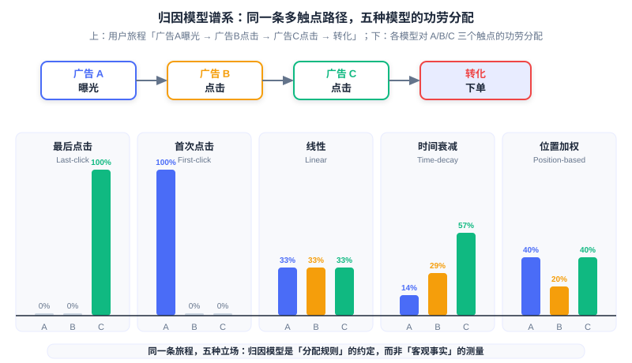
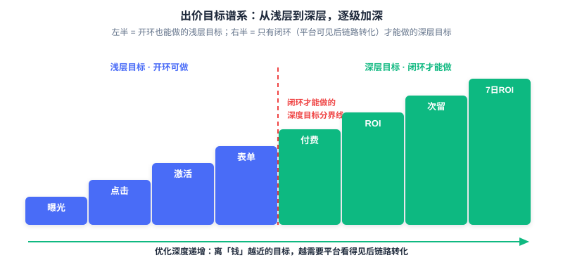

  📖
  ⏱️ ~45 min read
  🎯 Advanced

# Open-Loop and Closed-Loop Advertising

> 📝 **Before You Continue:** This chapter requires reading 12.4 (Smart Bidding and Budget Control) first — the oCPM and deep conversion bidding formulas are the foundation for "what closed-loop can do"; as well as 12.5 (Estimation Bias and Calibration) — attribution and delayed feedback are the prerequisite for "why open-loop is hard." This chapter closes out all of Part 12 from the perspective of **data observability**.

The previous five chapters covered four facets of one thing: how to deliver (12.1), how to bill (12.2), how to price (12.3), how to bid (12.4), and how to measure (12.5). But all of these elaborate mechanisms rest on one unstated assumption — **how much conversion data the platform can observe**. Consider the same oCPM bid formula: $\text{eCPM} = 1000 \cdot \text{pCTR} \cdot \text{pCVR} \cdot \text{Bid}_{\text{CPA}}$. In a Douyin store, the user places the order and pays entirely under the platform's nose, and the pCVR model has a flood of conversion labels to learn from every day; yet the moment an advertiser runs an "App download" campaign, the user jumps out of Douyin and taps the download button in the App Store, and Douyin cannot see at all whether that "conversion" actually happened. The same formula: in the first scenario pCVR is real, observed data; in the second scenario pCVR is half guesswork and half waiting.

This chapter discusses the line that splits the advertising world in two: **whether the conversion behavior happens inside the domain the platform can observe**. Inside the domain is **closed-loop advertising (Closed-loop Advertising)**; outside the domain is **open-loop advertising (Open-loop Advertising)**. You will see how this line decides how deep a platform can optimize, how high a price it can quote, and how large a promise it can keep — and how the privacy wave keeps pushing this line toward "the platform's own closed loop."

After reading this chapter, you will be able to:

- Use the criterion "whether the conversion is inside the platform's observable domain" to classify any advertising scenario as closed-loop or open-loop, and explain that what it affects is not the ad format but the data link
- Explain why closed-loop lets the platform train deep pCVR models, do deep conversion bidding (payment/ROI/next-day retention/7-day ROI), and how the "the more you bid, the more accurate" positive loop pushes eCPM higher
- Describe the complete open-loop attribution flow (clickid issuance → postback → ip+ua fallback) and the allocation rules of six attribution models, and explain why MMPs can counter double counting
- Explain how ATT, SKAdNetwork, and Android Privacy Sandbox collapse deterministic attribution, and the hybrid attribution strategies in open-loop scenarios
- Use one comparison table to tie together the full differences between closed-loop and open-loop across bidding goals, data availability, delayed feedback, model training, and attribution certainty, and complete 5 tiered practice problems

---

## 12.6.0 The Second Axis of Advertising: Data Observability

In 12.1's ecosystem panorama, we cut advertising three ways by the "evolution of delivery models": direct sales, ad networks, and programmatic trading. That was an axis about **transaction structure**. Now we introduce a second axis, orthogonal to transaction structure: **data observability (Data Observability)** — whether the conversion the advertiser wants happens inside the platform's line of sight or outside it. Only when the two axes are put together do you get a complete map of advertising: you must know how traffic is bought (12.1), and also how conversions are seen (this chapter).

The two ends of this axis have industry-standard names. **Closed-loop advertising (Closed-loop Advertising)**, also called the **inner loop**: the entire chain of impression, click, order, and payment happens inside the platform's own ecosystem, and no data ever leaves the platform. Typical forms are the e-commerce closed loops of Douyin Store and Kuaishou Store, or the on-platform purchase inside Facebook Shops — the user sees the ad in the feed, taps in, lands directly on the product page, and orders and pays entirely inside the app. **Open-loop advertising (Open-loop Advertising)**, also called the **outer loop**: the conversion happens outside the platform; the user sets out from the ad click, jumps out of the platform to download from the App Store, to register on a brand's official site, or to purchase in an offline store. The platform's line of sight breaks here — it can confirm "the user clicked the ad," but cannot confirm "whether the user actually downloaded or bought."

There is one understanding that must be nailed down first: **open-loop vs closed-loop is not a difference of ad format, but a difference of whether the data link is closed**. Native ads, feed ads, and other "formats" do not naturally belong to either end — the same feed ad, when promoting a "Douyin Store product," is closed-loop; when promoting "an App download of some mobile game," is open-loop. There is only one criterion: when the user completes the conversion, can the platform observe it directly? The power of this criterion is that it is a binary switch: when the link is closed, every layer of conversion further down the funnel (order, payment, repeat purchase, next-day retention) is training data for the platform; when the link is broken, the platform is left with only "click" as the single relatively reliable signal, and everything beyond it depends on whether the advertiser is willing and able to post back.

In the left closed-loop chain, all four steps are enclosed in the "platform domain" box, conversion data flows back immediately along solid arrows, and both the model and the bidding get complete labels. In the right open-loop chain, "impression→click" is still inside the platform, but the "conversion" step jumps out of the box, pointing to the App Store, the brand's official site, or an offline store — between the platform and the conversion there is only a dashed line that requires the advertiser's postback, and that line can break at any moment.

### 🧠 Mental Model: Who Holds the Ledger

> Closed-loop advertising is like running the cash register in your own store: every transaction is recorded in your own ledger — what sold today, who bought it, and what they bought next — just flip the ledger to find out. Open-loop advertising is like settling the bill in someone else's store: you can only watch the customer walk in (the click); whether they bought anything inside, and how much, you have to rely on the shop owner texting you afterward (the postback). Whoever holds the ledger decides how smartly you can restock the next day.

This section establishes the criterion for this chapter. The next four sections unfold along the two ends of this axis. 12.6.1 explains why closed-loop is "the better end"; 12.6.2 and 12.6.3 cover the two classic headaches of the open-loop end — attribution and privacy; 12.6.4 lays the technical differences of the two ends into one panoramic table; 12.6.5 returns to the overall closing of Part 12.

---

## 12.6.1 Why Closed-Loop Changes Everything

The value of closed-loop is not in "looking good," but in the one thing all the mechanisms of the previous five chapters crave most: **complete conversion labels**. Recall the conclusion of 12.4 — the essence of oCPM is the platform trading predictive power for pricing power, and the precondition for the platform daring to accept conversion bidding is that pCVR estimation is accurate enough. And for pCVR to be accurate, there must be conversion labels to learn from. In the closed-loop scenario, this precondition holds naturally: every step of impression, click, order, and payment happens inside the platform's domain, and the platform can directly observe "after this user clicked the ad, did they actually pay." Only then can it train a true deep pCVR model, and only then does it dare to promise **deep conversion bidding** — payment-per-order bidding, payment ROI bidding, activation–next-day-retention dual bidding, and 7-day ROI bidding, these back-funnel objectives.

This layer of difference splits bidding goals into two worlds. In open-loop scenarios, the platform can only do **shallow-funnel goals**: click, activation, form submission, registration — because it cannot see the conversions any further down. In closed-loop scenarios, the platform can do **deep-funnel goals**: payment, ROI, next-day retention, 7-day ROI — because these behaviors happen inside its domain. The oCPM two-phase practice of 12.4.1 (first CPC cold start to accumulate conversions, then switch to conversion bidding) gains a new reading here: the "conversion data" that cold start must accumulate is something a closed-loop platform can obtain through its own full-link observation, while an open-loop platform can only wait for the advertiser's sparse postbacks to slowly pile up.

Deeper still, closed-loop triggers a **positive loop**. The platform trains a deep model on the complete behavior of paying users; the more accurate the model, the better it can distribute ads to people "more likely to pay"; the better the delivery, the more budget the advertiser is willing to add; the platform gains more conversion data; the model improves further — the "the more you bid, the more accurate" flywheel starts spinning. The endpoint of this flywheel is the deepest end of 12.2's risk-attribution lineage: the platform even dares to manage bids on behalf of the advertiser toward "payment," the objective closest to money, taking almost all conversion risk onto itself. The source material's Toutiao/Douyin industry account states this value plainly: a model trained on paying users, once stabilized, delivers excellent results in broad targeting and higher front-end bids, with **eCPM generally about 20% higher (industry figures)** — the advertiser buys higher-quality traffic, and the platform's per-thousand-impression revenue is higher too; this is a structure that benefits both sides.

This explains the underlying logic of advertising growth for the super apps (Douyin, Kuaishou, Taobao). They are not satisfied with being "traffic transit stations," but work hard to move transactions into their own ecosystems — building stores, running livestream commerce, doing local services — because every extra segment of the conversion link they enclose is one more piece of training data no one else can get. When a platform simultaneously holds "massive traffic" and "complete conversion observation," its advertising system can do deep optimization that other platforms cannot — and this constitutes a nearly insurmountable moat. 12.1's ecosystem evolution was about "who can buy traffic"; this chapter adds "who can see conversions" — and the latter is the scarcer resource in modern advertising competition.

### 🧠 Mental Model: The Compounding of "The More You Bid, the More Accurate"

> Closed-loop advertising is like a business with compound interest: the first batch of conversion data is the principal, the model is the interest rate, and every round of delivery uses "principal + interest" to earn the next, larger batch of conversion data. Open-loop advertising is like a business settled per transaction, with no access to the ledger — when each delivery round ends, all you can be sure of is "how many clicks there were"; you cannot even save up the principal, let alone compound it. Data observability is the true source of compounding in this industry.

> **Analysis:** The "about 20% eCPM premium" of closed-loop must be read within its framing: it is a third-party industry-report restatement of the Toutiao/Douyin figure, reflecting the overall gain from "deep models + full-link data," and it fluctuates across industries and categories. Treat it as trend evidence rather than a universal constant. Also note: closed-loop's deep conversion bidding is not without a threshold — deep back-funnel events (such as payment) are sparse and have higher latency and need data accumulation; this is also why platforms such as Kuaishou require allow-listing for "payment ROI bidding and 7-day ROI bidding" products (the comparison table in 12.6.4 will return to this point).

---

## 12.6.2 The Attribution Problem of Open-Loop

Now turn the lens to the open-loop end. The conversion happens outside the domain and the platform cannot see it, so the question standing between the advertiser and the platform is: **which ad deserves credit for this conversion?** This is **attribution (Attribution)** — in the advertising behavior chain, identifying which ad, which channel, brought about the "key behavior." In closed-loop scenarios this problem barely exists (the conversion happens inside the platform, and the link is unique); in open-loop scenarios it becomes a problem that must be solved with infrastructure.

The premise of attribution is that the platform can receive the message that "the conversion actually happened," and that message depends on the advertiser's **postback**. The complete flow has three steps. First, **ad-touchpoint tracking**: when the user clicks or sees the ad, the media issues **clickid**, ad id, ip, ua, and other parameters through the tracking link, stamping this impression or click with a unique mark. Second, **conversion postback**: when the user completes a conversion such as activation, registration, or order, the advertiser's app or website posts the device ID, clickid, and timestamp back to the media platform via SDK/API — "this is the user I wanted." Third, **fallback attribution**: when a device ID is unavailable, fall back to fuzzy matching with ip+ua, and precision drops accordingly. The postback is not only for "settling accounts" but also the basis for the platform's look-alike audience discovery and scaling decisions: the media must know which traffic actually works before it knows where to add budget.

After getting "who converted at which step," one must still decide "how to split the credit" — this is the **attribution model (Attribution Model)**. Note its essence: attribution is not the measurement of objective fact, but a convention of **allocation rules**. For the same user journey, switch the model and the conclusion can be diametrically opposite. The common attribution-model spectrum is shown in the following table:

| Model | Credit allocation rule | Applicable scenario |
|------|-------------|---------|
| Last-click | 100% to the last touchpoint before conversion | Simple and direct; mobile default |
| First-click | 100% to the first touchpoint | Measures top-of-funnel discovery/awareness |
| Linear | Split evenly across all touchpoints | Treats every interaction as equally valuable |
| Time-decay | Touchpoints closer to conversion get more | Short-cycle intent-driven |
| Position-based | More to the first and last touchpoints, less to the middle (U-shaped) | Balances discovery and closing |
| Data-driven | Algorithm assigns credit automatically from observed contributions | High volume, multi-channel |

The same journey of "Ad A impression → Ad B click → Ad C click → conversion order" yields five answers under five models: last-click gives all credit to C, first-click gives all to A, linear splits three ways, time-decay decreases with "distance from conversion," and position-based raises the ends (A, C) and flattens the middle (B). This is not about who is right or wrong, but a stance on "which step you believe is worth more" — the interactive simulator below lets you switch models by hand and step through how the same journey's conclusion flips.

<iframe src="../viz/part12-attribution.html?embed&vizId=part12-attribution" style="width:100%; height:520px; border:none; display:block;" loading="lazy"></iframe>

Follow the script in order: first see the three-touchpoint journey in the "Setup" step, then switch in turn through last-click, first-click, linear, time-decay, and position-based, watching how the credit allocation in the horizontal bar chart is "reshuffled" by the same journey. The final summary step tells you why "attribution is an allocation rule, not objective fact."

Attribution also has a question of "who does the counting." **Self-attribution**: the platform or media completes the attribution itself and claims "this install was brought by me" — Apple Search Ads and some leading platforms take this approach. **Non-self-attribution**: the advertiser matches users to media information itself and completes attribution independently. The problem is that if every ad network "claims its own win," then when multiple networks run in parallel, the sum of the install counts each network reports far exceeds the true install count — **often reaching 200% to 300% of the true install volume**. So a neutral third-party arbiter enters the stage: the **Mobile Measurement Partner (MMP)**, such as AppsFlyer, Adjust, Branch, Singular, and Kochava. The MMP stands between the advertiser and the various ad networks, deciding with a unified standard which conversion each one should be credited for, and pressing down the "every vendor praises its own melons" double counting.

### 🧠 Mental Model: Judge vs Litigant

> The attribution model is the rule of "how to adjudicate" (last-click = trust only the final blow; linear = everyone gets a share), while the MMP is the institutional arrangement of "who plays judge." Letting an ad network attribute its own conversions is like letting the litigant write its own verdict — each one believes itself to be the key contributor to the conversion, so the sum naturally exceeds 100%. The value of the MMP is to move the adjudication right from the litigant's hands to a neutral third party.

> **Analysis:** The choice of attribution model is fundamentally a business assumption, not an optimum that can be "computed out": last-click suits scenarios with a short decision chain and instant click-to-buy; first-click suits categories with heavy brand exposure and long decision cycles; data-driven attribution is the "smartest," but it needs a large amount of observable conversion data to learn credible contributions — which is exactly what is hardest to satisfy in open-loop, and especially privacy-restricted open-loop, scenarios. So when choosing an attribution model, ask first "how long is my conversion chain, and is my data enough," and only then "which model is more accurate."

---

## 12.6.3 The Privacy Wave Makes Open-Loop Harder

The foundation of open-loop attribution is one thing: **device-level deterministic identifiers**. The platform relies on advertising identifiers such as IDFA and GAID to bind the "ad click" and the "later conversion" to the same user. This foundation began to collapse around 2021. The first piece to fall was Apple's **ATT (App Tracking Transparency)**: since iOS 14.5, an app must show a prompt and obtain user authorization to access IDFA. The result: the vast majority of users refuse — **the opt-in rate is only about 25%** — and device-level identifiers collapse across a wide area. The "unique user ID" that deterministic attribution lives on is gone, and the measurement precision of open-loop scenarios falls accordingly.

The replacement Apple then offered is **SKAdNetwork (SKAN)**: a privacy-preserving attribution framework in which Apple itself verifies installs and posts conversion data back in an aggregated and delayed manner. Its design is everywhere "anti-deterministic": the data is **aggregated** rather than user-level; the postback carries a **random timer delay**; granularity is limited; and there is **crowd anonymity (Crowd Anonymity)** — when install volume is too small, less information is returned, preventing any single user from being reverse-identified. Conversions are reported through **conversion value**, with the app recording user interaction via `updateConversionValue`. **SKAN 4.0** further structures the postback: it introduces coarse and fine conversion values, and sets **three postback windows (roughly 0–2 days, 3–7 days, 8–35 days)**, allowing multiple postbacks as the conversion progresses; the hierarchical **source identifier** uses a 4-digit layered encoding (first 2 digits campaign, 3rd digit position, 4th digit placement), returning more digits as the crowd anonymity level rises. Note: SKAN is not an equivalent replacement for IDFA; it is a brand-new contract of "trading determinism for privacy."

The Android side is walking the same road. **Android Privacy Sandbox** (2024+) is Google's cookieless attribution solution: the **Attribution Reporting API** provides event-level and aggregated attribution reports, with aggregated reports carrying **differential privacy** noise; the Topics API is for interest-based advertising. The three platforms converge on the same destination: they all erase "who you are" from the attribution signal, leaving only noise-added "a group of people did something."

The practical consequence of this privacy wave is: **open-loop deterministic attribution has collapsed entirely, and one can only settle for a "mix-and-match" fallback**. On iOS, advertisers and MMPs must now mix three layers of signals: SKAN's aggregated postback (private but blurry and delayed) + the deterministic data from the few opt-in users who authorized (precise but small-sample) + the modeling estimates trained on these two (filling in the blur into a usable prediction). Accepting more noise means accepting that "where every penny is spent" degrades from precise bookkeeping to an estimate with error. It is exactly this "seeing more and more blurrily" situation that pushes the whole industry in two directions: those who can close the loop desperately pull conversions back into their own domain (closing the loop); those who cannot turn to a first-party data strategy — no longer relying on cross-app tracking, but operating the lawful, compliant data relationship that an enterprise has directly with its users.

### 🧠 Mental Model: Frosted Glass

> Attribution in the IDFA era was like clear glass: who clicked the ad and who installed the app were seen crystal clear. After ATT, frosted glass was installed: you can only see that "someone came in," not who. SKAN adds a layer of venetian blinds on top of the glass: every so often, Apple cracks open a slit and shows you a blurry, noise-added, late result. What advertisers and MMPs can do is piece back "what actually happened" through these three layers of obstruction — the closer the reconstruction, the closer to the determinism of the past.

> **Analysis:** The privacy wave's blow to open-loop is structural, not a one-off policy friction: ATT cuts away the "unique identifier," SKAN cuts away "timeliness and granularity," and Privacy Sandbox cuts away "noise-free event-level postback." Stacked together, these three mean open-loop measurement precision has a ceiling locked in by institutions — something no better algorithm can fully make up. This is also why this chapter elevates "data observability" to a fourth pillar alongside mechanisms, bidding, and measurement: when the measurement signal itself is institutionally weakened, whoever can rebuild observation with first-party data holds the initiative for the next decade.

---

## 12.6.4 The Full Technical Difference Between Closed-Loop and Open-Loop

Gather the differences of the previous three sections into one table, and the divide between closed-loop and open-loop is no longer an abstract concept but a string of technical differences that can be checked item by item.

| Dimension | Closed-loop advertising (inner-loop) | Open-loop advertising (outer-loop) |
|------|------------------|------------------|
| Bidding goal | Deep: payment/ROI/next-day retention/7-day ROI | Shallow: click/activation/form/registration |
| Data availability | Full link inside the platform domain, directly observed | Conversion outside the domain, depends on advertiser postback |
| Delayed-feedback severity | Low: instant platform visibility, controllable label window | High: postback delay + SKAN random delay, labels arrive late |
| Model training | Directly trains deep pCVR / pDeepCVR | Relies on sparse postback labels, mostly shallow models |
| Attribution certainty | Deterministic: device-level, unique link | Probabilistic/aggregated: SKAN crowd anonymity, ip+ua fallback |

This table is not an isolated checklist; it collects, one by one, the foreshadowing planted in earlier chapters. The **bidding goal** column corresponds to the oCPM deep conversion bidding of 12.4.1 — only closed-loop qualifies to do back-funnel objectives such as "payment/ROI," while open-loop can only stop at "activation/form." The **delayed-feedback severity** column corresponds to the delayed feedback and label window of 12.5.3: in closed-loop, conversions are instantly visible and the label window is easy to set; in open-loop, conversions must wait for both the advertiser's postback and SKAN's random delay, so the time for labels to mature is stretched and uncontrollable — the risk of "calibrating before labels mature" is multiplied in open-loop. The **model training** and **attribution certainty** columns correspond to the sample-selection bias of 12.5.2 and the winner bias of 12.5.3: the conversion labels an open-loop model can get are sparse and biased, and the crack between the training space and the inference space is far wider than in closed-loop.

The left half of the ladder holds the shallow goals that open-loop can also do — impression, click, activation, form, registration — where the platform needs only to observe front-funnel behavior to bid; crossing the "deep goals only closed-loop can do" dividing line are payment, ROI, next-day retention, and 7-day ROI, deep objectives that require seeing back-funnel conversions. The ladder climbs step by step, corresponding to the platform's observation requirement on conversion data deepening step by step — this is the visual expression of "data observability decides optimization depth."

Here is an engineering detail that is easy to overlook: the threshold for deep goals is not just "being able to observe," but "whether the observation is dense enough." Back-funnel events such as payment and next-day retention are naturally sparse and high-latency, and oCPX-type products usually require cumulative conversion counts to reach a threshold before deep goals can be enabled — this is also the recurrence of 12.4.1's two-phase cold-start thinking on back-funnel objectives. Closed-loop only makes "accumulating enough data" feasible and fast; it cannot make sparse events dense.

---

## 12.6.5 The Final Closing of Part 12: Closed-Loop Is Not the Goal, Observability Is

Returning to the sentence at the beginning of this chapter, we can now say it in full. The reason closed-loop advertising "changes everything" is not that the word "closed-loop" itself has magic, but that it means **observability (Observability)**: whoever can get more complete conversion data can optimize more deeply. Closed-loop is only one way to achieve observability — pulling conversions into one's own domain. In open-loop scenarios, advertisers can also partially rebuild this observability with high-quality postbacks, the neutral arbitration of MMPs, and a first-party data strategy. So do not chase "closed-loop" as the goal; what you should chase is the thing behind it: **the completeness of the data link**.

Thus we can write down the final multiplicative summary for all of Part 12, adding the last term onto the 12.5 version:

$$\text{Advertising system} = \text{Mechanism design (12.3)} \times \text{Bidding strategy (12.4)} \times \text{Measurement system (12.5)} \times \text{Data observability (this chapter)}$$

Mechanism decides "how the rules are set," bidding decides "how the prediction is spent," measurement decides "whether the prediction is accurate," and data observability decides "whether the prediction has anything to learn from." All the ingenuity of the first three rests on one deeper premise — how many real conversion samples the platform holds. 12.1's ecosystem panorama explained "how traffic flows," 8.3's EGA explained "how the mechanism is learned into the model," and this chapter adds the base they both depend on: without observable conversions, EGM, oCPM, and ESMM are all just doing arithmetic on an incomplete ledger.

The final trend judgment lands on three parallel migrations. First, **super-app closed-loop-ization**: Douyin, Kuaishou, and Taobao pull transactions, livestreaming, and local services into their ecosystems, digging the dual moat of "traffic + observation" ever deeper. Second, the **semi-closed-loop** compromise: the advertiser does not post back everything, only some events (e.g., posting back "activation" but not "payment"), and the platform gets an incomplete label set for partial optimization — this is the gray zone between open-loop and closed-loop, and also the true state of most App download ads today. Third, **privacy policy pushes the first-party data strategy**: as cross-app tracking is institutionally tightened, enterprises and platforms both turn to operating the data relationship they have directly with users. The three migrations point to the same conclusion: **the decisive battleground of future advertising competition is shifting from "who can buy traffic" to "who can see conversions"** — and once you see this line, you have read the last page of Part 12.

---

## ⚠️ Common Mistakes in 12.6

| # | Mistake | Example | Why It's Wrong | Fix |
|---|---------|---------|---------------|-----|
| 1 | Thinking open-loop/closed-loop is an ad format rather than a data link | "Native ads are closed-loop ads" | The same feed native ad: promoting an on-platform store is closed-loop, promoting an App download is open-loop; the only criterion is "whether the conversion is inside the platform's observable domain" | Use the switch of "where the conversion happens" to judge, not the ad format |
| 2 | Treating attribution as objective fact rather than an allocation rule | "Data-driven attribution computed the true credit" | The attribution model is a convention of "how to split credit"; switch the model and the same journey yields a diametrically different conclusion — there is no single "truth" | Choose the attribution model as a business assumption; ask about chain length and data volume first, then choose the allocation rule |
| 3 | Ignoring postback pollution and attribution fraud | "Trust whatever the advertiser posts back" | Under self-attribution, double counting across networks can reach 200%–300% of the true volume; the postback itself can be faked and polluted | Bring in an MMP for neutral arbitration, unify the standard, and verify postback authenticity |
| 4 | Thinking SKAN is an equivalent replacement for IDFA | "Plug in SKAN and the original attribution precision returns" | SKAN is an aggregated, randomly delayed, crowd-anonymized privacy framework that trades determinism for privacy; both granularity and timeliness cannot go back | Understand SKAN's three postback windows and crowd anonymity, and rebuild with the three layers of "SKAN + authorized determinism + modeling" |
| 5 | Applying closed-loop deep bidding directly to open-loop scenarios | "App download ads directly enable payment ROI bidding" | Payment is outside the domain; the platform cannot see it and cannot receive enough postbacks, so pDeepCVR has nothing to train on | Open-loop should first use shallow goals (activation/form); deep goals require continuous advertiser postback + a data-accumulation threshold |

---

## Chapter Summary

### 📌 Key Takeaways

| Concept | Key Points | Why It Matters |
|---------|-----------|----------------|
| Data observability | Open-loop vs closed-loop = whether conversion happens inside the platform's observable domain; a data-link difference, not an ad-format difference | The second axis of the advertising world; decides how deep the platform can optimize |
| The value of closed-loop | Directly observe conversions → deep pCVR models → deep conversion bidding (payment/ROI/next-day retention/7-day ROI) → the "the more you bid, the more accurate" flywheel | Industry figures show eCPM generally about 20% higher; the underlying logic of the super-app moat |
| Open-loop attribution | clickid issuance → conversion postback → ip+ua fallback; six attribution models are allocation rules, not objective facts | The same journey yields completely different conclusions under different models; choose the model by asking about chain and data first |
| The value of MMP | Neutral third-party arbitration, countering self-attribution double counting | With multiple networks in parallel, reported install counts often reach 200%–300% of the true volume |
| The privacy wave | ATT (opt-in ~25%) → SKAN (aggregated/random delay/crowd anonymity, SKAN 4.0 three postbacks 0-2/3-7/8-35 days) → Privacy Sandbox | Deterministic attribution collapses; can only mix SKAN + authorized determinism + modeling estimates |
| Part 12 closing | Advertising system = Mechanism (12.3) × Bidding (12.4) × Measurement (12.5) × Data observability (this chapter) | The decisive battleground shifts from "who can buy traffic" to "who can see conversions" |

### ❓ FAQ

**Q1: Is closed-loop advertising necessarily better than open-loop advertising?**
> A: For the platform, closed-loop usually has higher data completeness and optimization depth, but it has a cost: when the advertiser pulls conversions into the platform, it also hands the transaction data and customer relationships to the platform, and its private-domain control declines. For the advertiser, open-loop preserves freedom and first-party data, at the cost of lower measurement precision and no deep optimization. So "closed-loop vs open-loop" is not an absolute good-vs-bad, but a trade-off between data sovereignty and optimization depth — semi-closed-loop (posting back only some events) is exactly the compromise point on this trade-off line.

**Q2: Which attribution model is best? Is data-driven attribution always optimal?**
> A: Data-driven attribution does best reflect true contribution when "data is sufficient," but it needs a large amount of observable conversion samples to learn — under open-loop and privacy-restricted scenarios it is often under-fed. Short decision chain, instant click-to-buy → choose last-click; heavy brand exposure, long cycle → choose first-click or position-based; short-lived intent → choose time-decay. There is no universally best, only the most suitable match for "chain length + data volume."

**Q3: What do SKAN's three postback windows mean? How should advertisers use them?**
> A: SKAN 4.0 splits the postback into three windows of roughly 0–2 days, 3–7 days, and 8–35 days, meaning conversion data does not arrive all at once but flows back in batches with random delay as the conversion progresses. The right posture for advertisers is not "wait for one complete report," but to combine the three layers of signals — SKAN's aggregated postback, opt-in users' deterministic data, and the modeling estimates trained on both — accepting "blurry but compliant" measurement rather than pursuing the precision of the IDFA era.

### 🔗 Connections to Other Chapters

- **12.1** (Computational advertising panorama and ecosystem) — this chapter introduces "data observability," the second axis orthogonal to "transaction structure"; 12.1 covers how traffic flows, this chapter covers how conversions are seen, and the two form the complete advertising map.
- **12.4** (Smart bidding and budget control) — closed-loop can do the deepest layer of the bidding stack (oCPM/deep conversion bidding) precisely because it supplies the training-data premise for pCVR in the 12.4.1 formula; the two-phase cold start recurs on deep objectives.
- **12.5** (Estimation bias and calibration) — open-loop's delayed feedback (postback + SKAN random delay) amplifies 12.5.3's late-label problem; open-loop's sparse postback labels also deepen the 12.5.2 training/inference-space crack.
- **8.3** (End-to-end generative advertising, EGA) — EGA learns allocation and payment end to end into the model, but it still cannot escape the base of "whether there are conversion labels to learn"; without observable conversions, EGA learns only arithmetic on an incomplete ledger.
- **Part 3** (Ranking and estimation models) — the pCVR/pDeepCVR model structures share the same origin, but their "can they be trained" is decided by this chapter's data observability; before a recommendation model enters the advertising scene, first ask whether the data link is closed.

---

## Practice Problems

Work through all problems in order — they get progressively harder. Each has a complete solution you can reveal after trying it yourself.

---

**Problem 12.6.1 — Classify Closed-Loop or Open-Loop** 🟢 Easy

Classify each of the following scenarios as closed-loop, open-loop, or semi-closed-loop advertising, and state your reasoning (look at "whether the conversion happens inside the platform's observable domain," not the ad format):
(a) A Douyin feed ad for a Douyin Store product, where the user clicks and places the order and pays on-platform.
(b) The same Douyin feed ad, but the landing directs the user to download a mobile game from the App Store.
(c) The game advertiser only posts back the "activation" event, not the "payment" event.
(d) A brand ad in the Facebook feed, where clicking jumps to the brand's official website to complete registration.

💡 Solution (click to reveal)

**Approach:** Judge item by item using the switch of "where the conversion happens + how much the platform can see."

- (a) **Closed-loop**: order and payment both happen on Douyin (Douyin Store), and the platform directly observes the full-link conversion.
- (b) **Open-loop**: the conversion (download) happens in the App Store, outside the platform domain; Douyin cannot see the download event.
- (c) **Semi-closed-loop**: the conversion is still outside the domain, but the advertiser posts back some events (activation), and the platform gets an incomplete label set for partial optimization — the gray zone between open-loop and closed-loop.
- (d) **Open-loop**: the conversion (registration) happens on the brand's official website; Facebook can only confirm the click, and the registration event requires the advertiser's postback or MMP attribution.

**Key points:**
- There is only one criterion: whether the conversion is inside the platform's observable domain — independent of the ad format (feed, native).
- Semi-closed-loop = outside-domain conversion + partial postback, the norm for today's App download ads.

---

**Problem 12.6.2 — Hand-Computing Attribution Model Allocation** 🟡 Medium

A user journey contains three touchpoints in time order: Ad A impression (day 0) → Ad B click (day 1) → Ad C click (day 3) → conversion order on day 4.
(a) Using the **last-click** and **first-click** models separately, write out the credit allocation for A, B, and C.
(b) Using the **linear** model, write out the allocation.
(c) Using **position-based** (U-shaped: first and last 40% each, middle split evenly), write out the allocation.

💡 Solution (click to reveal)

**Approach:** Map each model's allocation rule onto the three touchpoints one by one.

- (a) Last-click: the last touchpoint before conversion is **C**, so A = 0%, B = 0%, **C = 100%**. First-click: the first touchpoint is **A**, so **A = 100%**, B = 0%, C = 0%.
- (b) Linear: split three ways, **A = B = C = 33.3%**.
- (c) Position-based (U-shaped): first touchpoint A = 40%, last touchpoint C = 40%, middle B = 20%, summing to 100%.

**Key points:**
- The same journey yields three answers under three models: C is the "closer," A is the "awareness builder," and B is the "bystander" — the attribution stance decides the answer.
- Last-click and first-click are "all-or-nothing" extreme rules; linear and position-based are "smooth allocation" rules.

---

**Problem 12.6.3 — Time-Decay Attribution Weights** 🟡 Medium

Same journey as 12.6.2 (A impression day 0 → B click day 1 → C click day 3 → conversion day 4). The time-decay model allocates by "the closer to conversion, the larger the weight"; suppose each step back halves the weight: C's base weight is 1, B's is 1/2, A's is 1/4.
(a) Compute the normalized credit percentages for A, B, and C.
(b) Compared with the linear model, explain why time-decay is more reasonable in a "short-cycle intent-driven" scenario.
(c) If B and C are two clicks on the same day (B day 3, C day 3), how should the time-decay weights be adjusted? What limitation does this expose in the model?

💡 Solution (click to reveal)

**Approach:** Assign weights by the rule, then normalize to percentages; then discuss time information and the model's limitation.

- (a) Weight sum $= 1 + \frac12 + \frac14 = 1.75$. Normalized: C $= 1/1.75 \approx \mathbf{57.1\%}$, B $= 0.5/1.75 \approx \mathbf{28.6\%}$, A $= 0.25/1.75 \approx \mathbf{14.3\%}$.
- (b) The linear model ignores time, treating "the day-0 impression" and "the day-3 click, one day before conversion" equally. Under short-cycle intent-driven (e.g., "want to buy soon"), the touchpoint near the conversion is the real final push; time-decay tilts credit toward C, better matching the intuition of "closer is more critical."
- (c) If B and C are the same day, they are "equidistant from conversion," and their weights should be equal: C = B = 1, A = 1/2 (if still "halving per step back"). This exposes time-decay's limitation: it is fundamentally "decay by touchpoint order," not "decay by real time interval" — it uses only ordinal information, not the quantified time difference. A more refined implementation should assign weights directly by time difference (e.g., exponential decay $w = \lambda^{T-t}$).

**Key points:**
- Attribution weights are normalized: first assign relative weights, then divide by the sum.
- Time-decay uses "order" rather than "time difference," which is its simplification; when real time information is needed, switch to exponential time decay.

---

**Problem 12.6.4 — Quantifying SKAN Attribution Collapse** 🔴 Hard

An iOS mobile-game advertiser delivers 10,000 installs. Before ATT, deterministic attribution (IDFA) could cover all installs; after ATT, opt-in is only about 25%, and SKAN's aggregated postback covers the rest, but SKAN postbacks are affected by crowd anonymity and random delay, with only about 60% of installs attributable to a specific campaign promptly and reliably by SKAN.
(a) Compute the three parts of installs: deterministic coverage, SKAN coverage, and "completely unattributable."
(b) Explain the measurement method corresponding to each of the three parts (authorized determinism / aggregated postback / modeling estimates), and the role modeling estimates play.
(c) Why is "SKAN not an equivalent replacement for IDFA"? Explain along the two dimensions of timeliness and granularity.

💡 Solution (click to reveal)

**Approach:** Split the three parts by ratio, then map each part to the three-layer hybrid attribution strategy.

- (a) Deterministic coverage = $10000 \times 25\% = \mathbf{2500}$ installs (opt-in users, with IDFA). SKAN coverage = 60% of the remaining 7500, i.e., $7500 \times 60\% = \mathbf{4500}$ installs. Unattributable = $10000 - 2500 - 4500 = \mathbf{3000}$ installs (about 30% of installs lost entirely in the noise).
- (b) The 2500 installs use **authorized deterministic data** (most precise, small sample); the 4500 use **SKAN aggregated postback** (blurry, delayed, crowd-anonymized); the 3000 have no direct signal and can only rely on **modeling estimates** — train a model on the known samples of the first two, and extrapolate "what those 3000 roughly consist of." The value of modeling estimates is exactly to fill the "completely invisible" gap with the patterns of the observable portion.
- (c) Timeliness: SKAN postbacks carry a random timer delay and arrive in batches across three windows (0–2/3–7/8–35 days); the conversion signal takes days to weeks to fully return, far from IDFA's near-real-time. Granularity: SKAN is aggregated, not user-level, with crowd anonymity; when install volume is low there is even less information, and it can never locate "which specific user, which specific ad" at the IDFA-level determinism. So it is a new contract of "trading determinism for privacy," not an equivalent replacement.

**Key points:**
- After the privacy wave, no single signal is enough; the three-layer mix (SKAN + authorized determinism + modeling) is the standard posture.
- Modeling estimates fill a "structural gap," not a nice-to-have — about 30% of installs depend on it to be "pieced back" into view.

---

**🏆 Problem 12.6.5 — Designing a Closed-Loop Deep Conversion Bidding Plan**

You are an algorithm engineer at a super-app advertising platform that has built a complete e-commerce closed loop (on-platform impression→click→order→payment, fully observable). Design a deep conversion bidding plan for an "on-platform store product promotion" advertiser, with the following requirements:
(a) Specify the bidding-goal choice: pick one from "payment-per-order bidding / payment ROI bidding / activation–next-day-retention dual bidding / 7-day ROI bidding," and explain the reasoning and the advertiser profile it suits.
(b) Write out the core formula for deep bidding (extending 12.4's oCPM to a deep objective), and explain the relationship between pDeepCVR and ordinary pCVR.
(c) Give the cold-start and data-accumulation transition plan, and how the "cumulative conversion count threshold" is set.
(d) Discuss this plan's advantages over an "open-loop App download ad" along three dimensions: data, bidding depth, and delayed feedback.

💡 Solution (click to reveal)

**Approach:** Extend 12.4's oCPM bidding stack to closed-loop back-funnel objectives, then constrain the plan with 12.5's delayed feedback and cold-start discipline.

**(a) Choice**: If the advertiser is a merchant oriented toward "long-term payment/LTV," choose **payment ROI bidding** or **7-day ROI bidding** — it directly takes "payment amount per yuan of ad spend" as the optimization target, aligning with the advertiser's ultimate business value. If the advertiser wants both new-customer volume and retention quality, choose **activation–next-day-retention dual bidding** (the platform jointly estimates pCTR, pCVR, and pDeepCVR, balancing shallow cost and deep retention). This problem develops "payment ROI bidding" as the example.

**(b) Core formula**: Deep bidding is the back-funnel extension of the 12.4.1 oCPM formula — substitute the entire "click → payment" deep conversion probability:

$$\text{eCPM} = 1000 \cdot \text{pCTR} \cdot \text{pDeepCVR} \cdot \text{Value}_{\text{per-conversion}}$$

where $\text{pDeepCVR}$ is the deep conversion probability of "click → payment," and $\text{Value}_{\text{per-conversion}}$ is the target value per payment declared by the advertiser (under a payment-ROI goal, the value anchor converted from "target ROI × payment amount"). Its relationship to ordinary pCVR: ordinary pCVR is "click → order," pDeepCVR is "click → payment" or "click → next-day retention" — the latter sits deeper in the conversion funnel, with sparser samples and higher latency, but closer to "money." The value of closed-loop is exactly that the platform can directly observe the deep label "payment," allowing pDeepCVR to be trained directly.

**(c) Cold start and threshold**: Payment events are sparse and high-latency; a new ad has no deep conversion statistics, and pDeepCVR has no confidence in it at all. The transition plan follows the two phases of 12.4.1: first deliver with a shallow goal (such as order bidding or CPC) to accumulate payment samples; once the cumulative payment-conversion count crosses the threshold (e.g., 30–50 payment conversions, set by the platform's confidence policy), switch to payment ROI bidding. The point of the threshold is to guarantee that the pDeepCVR model has a minimum usable statistical confidence for this batch of ads — switching too early is like the platform betting blind on the back funnel.

**(d) Advantages over open-loop**: **Data** — closed-loop directly observes payment, while open-loop depends on advertiser postback, which is sparse under privacy restrictions; **bidding depth** — closed-loop can do back-funnel objectives such as payment/ROI/next-day retention/7-day ROI, while open-loop can only stop at activation/form; **delayed feedback** — closed-loop payment is instantly visible with a controllable label window, while open-loop must wait for postback + SKAN random delay, stretching the label-maturity time and making it uncontrollable. The three together are exactly why the 12.6.1 "the more you bid, the more accurate" flywheel can spin.

**Key points:**
- Deep bidding = the oCPM bidding stack extended to back-funnel objectives (payment/ROI/retention), and the core is whether the platform can directly observe pDeepCVR's labels.
- Closed-loop does not "unlock deep goals for free"; it only makes "accumulating enough deep data" feasible; sparse events still require cold start and threshold constraints.

