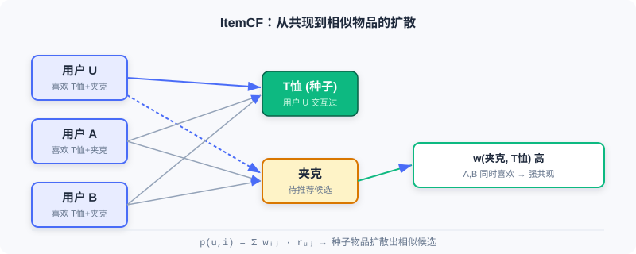
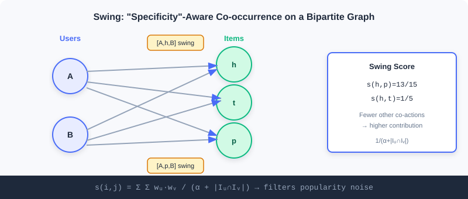
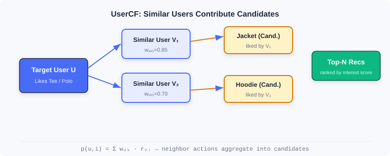
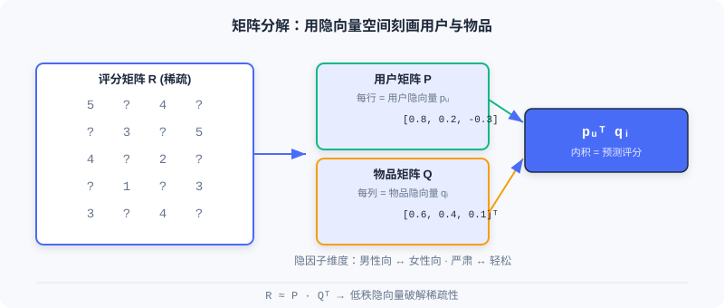

  📖
  ⏱️ ~35 min read
  🎯 Intermediate

# Collaborative Filtering

> 📝 **Before You Continue:** Please read first the discussion of "retrieval as the starting point of the three-stage funnel" in [Part 1, Section 1.1](./../part1-introduction/recommender-system-basics.md), and the "retrieval: from billions to thousands" thread in [1.2](./../part1-introduction/book-overview.md). This chapter covers the most classic family of methods in the retrieval layer.

When you open a shopping app, how does the system decide "what else you might like"? The most naive yet most powerful intuition comes from **Collaborative Filtering (CF)**: inferring individual preferences from the collective behavior of "people" and "items" — people who like the same things tend to have similar tastes; items liked by the same group of people tend to be similar in nature.

The idea of collaborative filtering is nearly as old as recommender systems themselves, but it goes far beyond "finding similar things". From neighborhood-based ItemCF / UserCF, to Swing built for industrial robustness, to matrix factorization mapping users and items into latent vectors, this chapter walks you through the evolution from **statistical co-occurrence** to **vector representation**.

After reading this chapter, you will be able to:

- Compute item and user similarity with **cosine similarity / Pearson correlation**, and articulate the difference between the two
- Explain how **Swing** filters random noise through bipartite-graph substructures, and how **Surprise** mines complementary items
- Describe the trade-offs between **UserCF and ItemCF** regarding user cold start and explainability
- Describe how **matrix factorization (FunkSVD / BiasSVD)** alleviates data sparsity with low-rank latent vectors
- Complete 5 graded practice problems, consolidating the full path from co-occurrence to vectorization

---

## 2.1.0 Two Perspectives on Collaborative Filtering

Collaborative filtering can be split along two directions: **item-based (ItemCF)** asks "what else is similar to the items you liked"; **user-based (UserCF)** asks "what else do people similar to you like". The former fits industrial scenarios better (item sets are stable and can be precomputed offline), while the latter feels more natural in scenarios with strong social flavor.

Whichever perspective you take, the core revolves around one concept — **co-occurrence**: two items interacted with by the same set of users, or two users interacting with the same set of items. The more frequent the co-occurrence, the higher the similarity. As we will see in the next three sections, all CF methods are just different answers to "how to define and exploit co-occurrence".

---

## 2.1.1 ItemCF: Item-Similarity-Based Collaborative Filtering

The core idea of ItemCF is that user interests are coherent: people who like an item tend to be interested in similar items. When recommending to a user, the system first identifies the **items the user interacted with recently** (seed items), then finds the most similar candidates for each seed, and finally aggregates the scores.

### Computing Item Similarity

Most real-world scenarios have only implicit feedback (clicks, purchases), no ratings. ItemCF quantifies item similarity with **cosine similarity**:

$$w_{ij} = \frac{\boldsymbol{C}[i][j]}{\sqrt{|\mathcal{N}(i)| \cdot |\mathcal{N}(j)|}}$$

where $|\mathcal{N}(i)|$ is the total number of users who interacted with item $i$, and $\boldsymbol{C}[i][j]$ is the co-occurrence count of the two items (the number of users who interacted with both). The denominator normalizes the co-occurrence count, **preventing popular items from dominating by sheer interaction volume** — exactly the biggest trap of naive co-occurrence.

### Recommending Candidate Items

Given the similarity matrix, the online flow has three steps: ① take a few hundred items the user recently interacted with as seeds; ② find the Top-10 similar items for each seed, quickly generating a large pool of candidates; ③ compute the user's interest score for candidate item $i$:

$$p(u, i) = \sum_{j \in \mathcal{N}(u)} w_{ij} \cdot r_{uj}$$

$\mathcal{N}(u)$ is the set of items the user interacted with, and $r_{uj}$ is the user's interest strength on item $j$ (set to 1, or weighted by interaction time/type). Finally, rank all candidates by score and take the Top-N.

### 🧠 Mental Model: A Borrower's Reading List

> Think of items as "books" and users as "borrowers". ItemCF's logic: if Alice borrowed *The Three-Body Problem* and *Ball Lightning*, and Bob also borrowed *The Three-Body Problem*, then the system guesses Bob will probably like *Ball Lightning* too — because these two books are always borrowed by the same crowd. The point is not the content of the books, but "who reads them".

### Computational Efficiency Optimizations

Brute-force computation of all item-pair similarities is $O(|\mathcal{I}|^2 \cdot |\mathcal{U}|)$, but the vast majority of item pairs share no common users, so their similarity is necessarily 0. A **user–item inverted index** speeds this up dramatically: maintain an interaction list per user, and when traversing, pair up items within each list, accumulate the co-occurrence matrix $\boldsymbol{C}[i][j]$, then divide by the normalization terms. The optimized complexity is roughly $O(R \cdot \bar{m})$ ($R$ is the total number of interactions, $\bar{m}$ the average number of items per user), far below brute force in sparse settings.

### Similarity for Rating Data (Pearson Correlation)

When the system has explicit ratings (e.g., 5 stars), the **Pearson correlation coefficient** is more robust than cosine, because centering removes differences in rating distributions across items:

$$w_{ij} = \frac{\sum_{u \in \mathcal{U}_{ij}}(r_{ui} - \bar{r}_i)(r_{uj} - \bar{r}_j)}{\sqrt{\sum_{u \in \mathcal{U}_{ij}}(r_{ui} - \bar{r}_i)^2}\sqrt{\sum_{u \in \mathcal{U}_{ij}}(r_{uj} - \bar{r}_j)^2}}$$

Based on this, one can predict a user's rating for an unseen item:

$$\hat{r}_{u,j} = \bar{r}_{j} + \frac{\sum_{k \in \mathcal{S}_j} w_{jk}\,\left( r_{u,k} - \bar{r}_{k} \right)}{\sum_{k \in \mathcal{S}_j} w_{jk}}$$

In large-scale systems, for computational and sparsity reasons, most still use cosine similarity supplemented with weighted normalization.

> **Analysis:** ItemCF can precompute the full item similarity matrix offline; online it only needs to fetch the Top-N similar items of the seed items, with very low latency and strong explainability. But it is powerless against **item cold start** (new items have no co-occurrence), and its similarity is fixed, hard to fuse with contextual features. It suits scenarios with stable item sets and dense interactions.

---

## 2.1.2 Swing: Similarity Optimization for Industrial Scenarios

ItemCF is naive and effective, but industrial deployment exposes clear problems: popular items dominate results due to high co-occurrence; noise such as random misclicks is treated equally. Swing offers an elegant answer — **analyze substructures of the user–item bipartite graph to filter noise**.

Its core insight: **if multiple users bought the same pair of items despite sharing few other co-purchases, then the association between that pair is more trustworthy.** In other words, the more "specific" the co-purchase behavior, the greater its contribution to similarity.

### Computing Item Similarity

Let $U_i$ and $U_j$ be the sets of users who interacted with items $i$ and $j$. For each pair of common users $(u, v)$, if they share few other co-purchases (smaller $|I_u \cap I_v|$), then their joint choice of this item pair is more specific and should contribute a higher score:

$$s(i, j) = \sum_{u \in U_i \cap U_j} \sum_{v \in U_i \cap U_j} \frac{1}{\alpha + |I_u \cap I_v|}$$

$\alpha$ is a smoothing coefficient preventing tiny denominators from causing numerical instability. To reduce the excessive influence of active users, a user weight $w_u = 1/\sqrt{|I_u|}$ is introduced:

$$s(i, j) = \sum_{u \in U_i \cap U_j} \sum_{v \in U_i \cap U_j} w_u \cdot w_v \cdot \frac{1}{\alpha + |I_u \cap I_v|}$$

As shown, users A and B have 4 swing subgraphs $[A,h,B]$, $[A,t,B]$, $[A,r,B]$, $[A,p,B]$. If $\alpha=1$ and A and B have 4 other shared behaviors, the user pair $[A,B]$ contributes $1/5$; h and p additionally share t and r, contributing two extra $1/3$ terms, so finally $s(h,p)=13/15$, higher than $s(h,t)=1/5$. **Combinations with few but "exclusive" co-occurrences score higher** — this is exactly how Swing filters popular-item noise.

### Surprise: Complementary Item Recommendation

Swing scores already capture associations, but handling complementary items (buying a phone case after a phone) remains hard — complementary relations are directional and time-ordered. The Surprise algorithm measures complementary relevance at three levels: **category, item, and cluster**:

- **Category level**: compute conditional probabilities between categories with a user-category matrix, $\theta_{i,j} = N(c_{i,j})/N(c_j)$, and adaptively truncate the long tail using the maximum relative drop.
- **Item level**: consider purchase order and time interval — the closer in time, the stronger the complementarity:

$$s_{1}(i, j) = \frac{\sum_{u \in U_i \cap U_j} \frac{1}{1 + |t_{ui} - t_{uj}|}}{\lVert U_i \rVert \times \lVert U_j \rVert}$$

- **Cluster level**: run label propagation on a graph of billions of items (edge weights are Swing scores) to cluster and alleviate sparsity, then combine linearly:

$$s(i, j) = \omega \cdot s_{1}(i, j) + (1 - \omega) \cdot s_{2}(i, j)$$

> **Analysis:** Swing significantly improves robustness while preserving ItemCF's efficiency, making it an evergreen of industrial I2I retrieval; the cost is building and traversing the bipartite graph, with higher computation than naive ItemCF. Surprise goes further for complementary scenarios, but introduces multi-level hyperparameters and clustering steps, raising engineering complexity.

---

## 2.1.3 UserCF: User-Similarity-Based Collaborative Filtering

Mirror to ItemCF, UserCF assumes: **users with similar historical behavior will have similar future preferences**. It first finds the "neighbors" most similar to the target user, then predicts the target user's interests from the neighbors' behavior.

### Computing User Similarity

Given users $u$ and $v$ with item sets $N(u)$ and $N(v)$, three common measures:

- **Jaccard coefficient** (implicit feedback only):

$$w_{uv} = \frac{|N(u) \cap N(v)|}{|N(u) \cup N(v)|}$$

- **Cosine similarity** (accounting for activity differences):

$$w_{uv} = \frac{|N(u) \cap N(v)|}{\sqrt{|N(u)|\cdot|N(v)|}}$$

- **Pearson correlation** (with ratings; centering removes rating-habit differences):

$$w_{uv} = \frac{\sum_{i \in I}(r_{ui} - \bar{r}_u)(r_{vi} - \bar{r}_v)}{\sqrt{\sum_{i \in I}(r_{ui} - \bar{r}_u)^2}\sqrt{\sum_{i \in I}(r_{vi} - \bar{r}_v)^2}}$$

### Recommending Candidate Items

Select the $K$ users with the highest similarity as the neighbor set $\mathcal{S}_u$. A simple weighted average predicts ratings:

$$\hat{r}_{u,p} = \frac{\sum_{v \in S_u} w_{uv} \, r_{v,p}}{\sum_{v \in S_u} w_{uv}}$$

The bias-aware version further removes personal habits:

$$\hat{r}_{u,p} = \bar{r}_{u} + \frac{\sum_{v \in S_u} w_{uv} \, (r_{v,p} - \bar{r}_{v})}{\sum_{v \in S_u} w_{uv}}$$

At serving time, find the $K$ most similar users for the target user, collect their interacted items as candidates, compute interest scores $p(u, i) = \sum_{v \in S_u \cap N(i)} w_{uv} \cdot r_{vi}$, rank, and take the Top-N. The optimized complexity is roughly $O(R \cdot \bar{n})$, far below $O(|U|^2)$.

> **Analysis:** UserCF excels in scenarios where user interests converge, such as "trending news" or "breaking events", and naturally supports social recommendation through "discovering similar people". But when users vastly outnumber items, computation and storage costs are high, and **user cold start** is hard (new users have no behavior). In industry, ItemCF is more common, because its item set is stable and can be fully precomputed offline.

---

## 2.1.4 Matrix Factorization: From Similarity to Vector Representation

Both UserCF and ItemCF face a fundamental challenge: **data sparsity**. Real interaction matrices are extremely sparse, leaving too few common ratings to compute reliable similarities. Matrix factorization takes a different route — instead of explicitly computing similarities, it learns **latent vector representations** for users and items, letting distances in the vector space naturally reflect preferences. This marks CF's shift from statistical methods to machine learning methods.

### The Dawn of the Latent Vector Era

Matrix factorization rests on two assumptions: the **low-rank assumption** — the seemingly complex rating matrix is actually governed by a few latent factors (such as "male-oriented vs. female-oriented", "serious vs. light"); and the **latent vector assumption** — every user/item can be represented by a vector encoding these factors.

### FunkSVD: The Basic Model

FunkSVD factorizes the rating matrix into a user feature matrix and an item feature matrix. User $u$ is represented by a $K$-dimensional vector $p_u$, item $i$ by $q_i$, and the predicted rating is their inner product:

$$\hat{r}_{ui} = p_u^T q_i = \sum_{k=1}^{K} p_{u,k} \cdot q_{i,k}$$

The optimization objective makes predictions approximate true ratings (over known ratings only):

$$\min_{P,Q} \frac{1}{2} \sum_{(u,i)\in \mathcal{K}} \left( r_{ui} - p_u^T q_i \right)^2$$

Update with gradient descent, where the error is $e_{ui} = r_{ui} - p_u^T q_i$:

$$p_{u,k} \leftarrow p_{u,k} + \eta \cdot e_{ui} \cdot q_{i,k}, \quad q_{i,k} \leftarrow q_{i,k} + \eta \cdot e_{ui} \cdot p_{u,k}$$

In practice, add L2 regularization against overfitting: $\min \frac{1}{2}\sum(\dots)^2 + \lambda(\lVert p_u\rVert^2 + \lVert q_i\rVert^2)$.

### 🧠 Mental Model: Taste Axes

> Plot every user and every movie on a 2D chart: the horizontal axis is "male-oriented ↔ female-oriented", the vertical axis "serious ↔ light". Users who like *The Princess Diaries* and the movie itself both land in the "female-oriented, light" corner, so the inner product is naturally large. Even if two users have never watched the same movie, as long as they are close on the latent factors, they can recommend for each other — this is the key to how vector representation overcomes sparsity.

### BiasSVD: The Improved Model

The basic model ignores a fact: some people are naturally generous raters ("pushovers"), others strict; some movies universally rate high due to star casts. BiasSVD introduces bias terms:

$$\hat{r}_{ui} = \mu + b_u + b_i + p_u^T q_i$$

$\mu$ is the global average rating, $b_u$ the user bias, $b_i$ the item bias. The optimization objective updates the biases as well:

$$\min_{P,Q,b_u,b_i} \frac{1}{2} \sum_{(u,i)\in \mathcal{K}} \left( r_{ui} - \mu - b_u - b_i - p_u^T q_i \right)^2 + \lambda(\lVert p_u\rVert^2 + \lVert q_i\rVert^2 + b_u^2 + b_i^2)$$

$$b_u \leftarrow b_u + \eta(e_{ui} - \lambda b_u), \quad b_i \leftarrow b_i + \eta(e_{ui} - \lambda b_i)$$

> **Analysis:** Matrix factorization handles sparse data naturally (two users can be linked through latent factors without any shared rating), and inner-product retrieval is efficient. But it remains a linear model, hard to fuse with side information or complex feature crossings. This leads directly to the two-tower and deep models of later chapters.

---

## ⚠️ Common Mistakes in 2.1

| # | Mistake | Example | Why It's Wrong | Fix |
|---|---------|---------|---------------|-----|
| 1 | Using raw co-occurrence counts as similarity | Popular items appear "highly similar" to everything | No normalization in the denominator; popular items dominate by volume | Normalize with cosine similarity dividing by $\sqrt{|N(i)||N(j)|}$ |
| 2 | Using ItemCF / UserCF interchangeably | Forcing UserCF in a user-cold-start scenario | New users have no history, so UserCF can't find neighbors | For user cold start use ItemCF; for item cold start use attribute/vector methods |
| 3 | Using Pearson as cosine | Forcing Pearson in an implicit-feedback setting | Without ratings there is no mean to center on | Use cosine for implicit feedback; Pearson only when ratings exist |
| 4 | Ignoring MF's sparsity precondition | Believing MF always computes accurate similarities | With extremely few interactions, latent vectors are poorly learned | For sparse data, combine side info (see EGES in Section 2.2) or two-tower models |
| 5 | Assuming CF can incorporate context | "Add time/location features into ItemCF" | Neighborhood methods have no feature-crossing channel | Representation learning (MF/two-tower) is needed to fuse features |

---

## Chapter Summary

### 📌 Key Takeaways

| Concept | Key Points | Why It Matters |
|---------|-----------|----------------|
| ItemCF | $w_{ij}=C[i][j]/\sqrt{|N(i)||N(j)|}$, expand candidates from seed items | A key industrial I2I retrieval channel, precomputable offline |
| Swing | Bipartite-graph specific co-occurrence + user weights | Filters popular-item noise, improves similarity robustness |
| UserCF | Aggregate neighbor behavior by user similarity | Great for trending/social scenarios, but user cold start is hard |
| Matrix Factorization | $\hat{r}_{ui}=p_u^Tq_i$, low-rank latent vectors | Overcomes sparsity, pioneering vectorization |
| BiasSVD | Adds $\mu+b_u+b_i$ bias terms | Separates systematic biases, notably improving accuracy |

### ❓ FAQ

**Q1: When should I use ItemCF vs. UserCF?**
> A: Use ItemCF when the item set is stable and you need to explain "why this similar item is recommended" (the industrial mainstream); use UserCF when user interests strongly converge (e.g., breaking news) or for social "similar people" recommendation. In user cold-start scenarios, ItemCF is more robust.

**Q2: What exactly is the difference between cosine similarity and Pearson correlation?**
> A: Cosine only looks at the angle between interaction vectors and is affected by absolute item popularity; Pearson first centers (subtracts respective means), removing rating-habit differences between "pushovers vs. strict graders" and focusing on relative trends. Prefer Pearson with rating data; use cosine for implicit feedback.

**Q3: Why does matrix factorization handle sparse data better than ItemCF?**
> A: ItemCF needs two items to share interacting users before similarity can be computed; matrix factorization, through a shared latent-factor space, lets two users with no common ratings recommend for each other via close latent vectors, generalizing to unseen combinations.

### 🔗 Connections to Later Chapters

- **2.2 (Vector Retrieval I2I)** ports sequence modeling (Word2Vec) into similarity learning, and uses item attention to solve MF's difficulty in fusing side info.
- **2.3 (Two-Tower Model)** upgrades MF's inner-product idea to deep-network encoding, enabling efficient U2I retrieval.
- **2.4 (Sequential Retrieval)** further captures temporal interest dynamics ignored by ItemCF/MF.
- **3.x (Ranking)** later applies complex deep models to finely rank the thousands of candidates retrieved in this chapter.

---

## Practice Problems

Work through all problems in order — they get progressively harder. Each has a complete solution you can reveal after trying it yourself.

---

**Problem 2.1.1 — Similarity Normalization** 🟢 Easy

User A has interacted with 100 items, user B with 10 items, and they share 5 common items. Compute the Jaccard coefficient, and explain what would go wrong if you instead used "raw co-occurrence count = 5" as the similarity.

💡 Solution (click to reveal)

**Approach:** Jaccard divides the intersection by the union.

$$|N(A)\cap N(B)| = 5,\quad |N(A)\cup N(B)| = 100+10-5 = 105$$

$$w_{AB} = \frac{5}{105} \approx 0.0476$$

**Key points:**
- Using the raw co-occurrence count 5 as similarity, anyone sharing 5 items with A would be judged "equally similar", ignoring the fact that A is extremely active (100 items).
- Normalization (Jaccard/cosine) lets the "relative overlap ratio" rather than the "absolute co-occurrence count" determine similarity, preventing active users/popular items from dominating.

---

**Problem 2.1.2 — ItemCF Scoring** 🟢 Easy

User $u$ has interacted with items $\{j_1, j_2\}$, with interest strengths $r_{uj_1}=1$ and $r_{uj_2}=0.5$. Item $i$ has similarity $0.8$ with $j_1$ and $0.3$ with $j_2$. Compute the user's interest score $p(u,i)$ for candidate item $i$.

💡 Solution (click to reveal)

**Approach:** Apply the ItemCF interest formula $p(u,i)=\sum_{j\in\mathcal{N}(u)} w_{ij}\cdot r_{uj}$.

$$p(u,i) = w_{i,j_1}\cdot r_{uj_1} + w_{i,j_2}\cdot r_{uj_2} = 0.8\times 1 + 0.3\times 0.5 = 0.8 + 0.15 = 0.95$$

**Key points:**
- The score accumulates linearly with similarity and interest strength; more seeds and higher similarities yield higher candidate scores.
- This is exactly the core of ItemCF: "take seeds → expand by similarity → aggregate scores".

---

**Problem 2.1.3 — The Specificity Intuition of Swing** 🟡 Medium

Consider two item pairs $(h,p)$ and $(h,t)$. Users A and B both interacted with both pairs, and A and B's other shared behavior counts are 4 (for h,p) and 2 (for h,t). Let $\alpha=1$. Suppose $(h,p)$ has only this single pair of common users, while $(h,t)$ additionally receives a contribution of the same structure from another common user pair C and D. Compare $s(h,p)$ and $s(h,t)$, and explain what Swing is trying to filter.

💡 Solution (click to reveal)

**Approach:** Per the Swing formula, each common user pair contributes $1/(\alpha+|I_u\cap I_v|)$.

- $s(h,p)$: only the A, B pair, $1/(1+4)=0.2$.
- $s(h,t)$: A, B contribute $1/(1+2)\approx0.333$; C, D (also $|I\cap I|=2$) contribute another $0.333$; total $\approx0.667$.

Wait — here $(h,t)$ is actually higher? Note: Swing's "specificity" means **this user pair shares few other behaviors**. If A and B overlap only on h and t (few other shared behaviors), while on h and p they also share more items (many shared behaviors = 4), then the h, p association is "not exclusive enough". In the problem, the shared behavior count of h,t (2) is smaller than that of h,p (4), so the per-pair contribution of h,t is larger — meaning the co-occurrence of h and t is more specific and more trustworthy.

**Key points:**
- Swing penalizes generic users who "buy everything together" via $|I_u\cap I_v|$, and boosts "exclusive co-occurrences".
- What it filters is spurious strong associations caused by random misclicks or generic popular items.

---

**Problem 2.1.4 — FunkSVD Gradient Update** 🔴 Hard

Given a known rating $r_{ui}=4$, current $p_u=[0.5, 0.2]^T$, $q_i=[1.0, 0.5]^T$, $\eta=0.1$, no regularization. Compute by hand $p_u$ and $q_i$ after one gradient descent step (keep 3 decimal places).

💡 Solution (click to reveal)

**Approach:** First compute the prediction and the error.

$$\hat{r}_{ui}=p_u^Tq_i = 0.5\times1.0 + 0.2\times0.5 = 0.5+0.1 = 0.6$$

$$e_{ui}=r_{ui}-\hat{r}_{ui}=4-0.6=3.4$$

Update rules: $p_{u,k}\leftarrow p_{u,k}+\eta e_{ui} q_{i,k}$, $q_{i,k}\leftarrow q_{i,k}+\eta e_{ui} p_{u,k}$.

- $p_{u,1}=0.5+0.1\times3.4\times1.0=0.5+0.34=0.840$
- $p_{u,2}=0.2+0.1\times3.4\times0.5=0.2+0.17=0.370$
- $q_{i,1}=1.0+0.1\times3.4\times0.5=1.0+0.17=1.170$
- $q_{i,2}=0.5+0.1\times3.4\times0.2=0.5+0.068=0.568$

**Key points:**
- The error is positive (prediction too low), so parameters shift upward overall, increasing the inner product toward 4.
- Each dimension's update is proportional to "the counterpart vector's component", reflecting the symmetry of the inner product.

---

**🏆 Challenge: Design a Retrieval Combination**

A short-video platform adds tens of millions of items daily, with an enormous long tail. Write about 150 words explaining how you would **combine** this chapter's ItemCF, Swing, and matrix factorization as multi-channel retrieval (what each channel is responsible for, how they complement each other), and identify which channel should backstop long-tail new items and why.

💡 Hint

ItemCF/Swing handles "behavior-similarity expansion", with Swing suppressing popular-item noise, making it better at mining long-tail associations; matrix factorization handles "latent-vector generalization" to cover sparse users. New items have no co-occurrence, so the CF channels will inevitably miss them — the backstop should be a vector channel that can fuse side info (think EGES in 2.2) or a two-tower model. Note this chapter's MF itself also struggles with brand-new items and needs external attributes.

