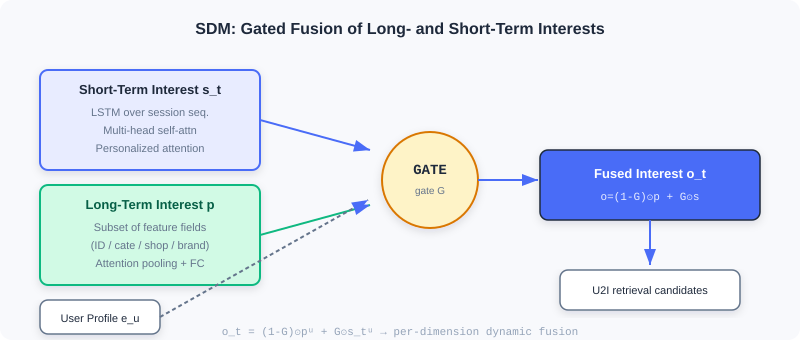

  📖
  ⏱️ ~35 min read
  🎯 Advanced

# Sequential Retrieval

> 📝 **Before You Continue:** Please first read the two-tower model in [2.3](./two-tower.md). The MIND / SDM models in this chapter still do U2I retrieval, but user representation is upgraded from "single vector" to "multiple vectors / long-short fusion" — recovering the **breadth of interests and temporal dynamics** that two towers lose.

The two-tower model in [2.3](./two-tower.md) compresses a user into one vector. But this has two hidden dangers: user interests are **diverse** (you read programming books and buy running shoes), and they **evolve dynamically** (this session predicts your next need far better than last month's history). Summarizing "everything about a person" in one vector is like summarizing a person with a one-line label — not enough.

Sequential retrieval attacks exactly these two points. MIND uses **multiple interest vectors** (multi-interest capsules) to speak for different interests separately; SDM explicitly separates **long- and short-term interests** and fuses them dynamically with gating. With the interactive demo, you'll see clearly the advantage of "multi-vector retrieval" over single-vector retrieval.

After reading this chapter, you will be able to:

- Describe how **MIND**'s dynamic routing (B2I) soft-clusters behaviors into multiple interest capsules
- Explain the roles of the **squash function** and **label-aware attention** in MIND
- Explain how **SDM** models the short term with LSTM + multi-head attention and the long term with feature-dimension attention, fusing them with gating
- Understand the "multiple interest vectors retrieve separately, then merge" flow through the interactive demo
- Complete 5 graded practice problems, consolidating sequential retrieval

---

## 2.4.0 Why a Single Vector Isn't Enough: Breadth and Temporality of Interests

Imagine your shopping history: programming books today, running shoes yesterday, coffee beans last week. With a single vector, these heterogeneous interests cancel each other out, averaging into a "neither-fish-nor-fowl" blob. Worse, the immediate intent in a short session (you just searched "running shoes") gets drowned out by long-term preferences.

The two themes of sequential retrieval: **breadth** (MIND: multiple vectors) and **temporality** (SDM: long-short separation). Let's break them down one by one.

---

## 2.4.1 MIND: Capturing Diverse User Interests with Multiple Vectors

MIND (Multi-Interest Network with Dynamic Routing) borrows **capsule networks**' dynamic routing: soft-cluster historical behaviors by interest type, generating a dedicated interest vector per type. The core components are the **multi-interest extraction layer** and the **label-aware attention layer**.

### Multi-Interest Extraction (B2I Dynamic Routing)

Historical behaviors are treated as "behavior capsules" and multiple interests as "interest capsules"; dynamic routing groups related behaviors onto the corresponding interest dimension. MIND makes three modifications to the original dynamic routing:

1. **Shared transformation matrix** $S\in\mathbb{R}^{d\times d}$: all interest vectors live in the same representation space, easing subsequent similarity computation. Routing connection strength is $b_{ij} = u_j^T S e_i$ ($e_i$ behavior vector, $u_j$ interest capsule).
2. **Random initialization** of routing coefficients $b_{ij}$: prevents all interest capsules from converging to the same state (similar to K-Means random centroid initialization).
3. **Adaptive interest count** $K_u' = \max(1, \min(K, \log_2(|\mathcal{I}_u|)))$: users with few behaviors get fewer interest vectors, saving compute; active users get richer ones.

### The Four Routing Iteration Steps

1. **Compute routing weights**: Softmax over $b_{ij}$ gives the soft assignment of behavior $i$ to interest $j$:

$$w_{ij} = \frac{\exp{b_{ij}}}{\sum_{k=1}^{K_u'} \exp{b_{ik}}}$$

2. **Aggregate behaviors**: weight all behavior vectors (transformed by the shared matrix $S$) and sum, yielding a preliminary interest vector:

$$\boldsymbol{z}_j = \sum_{i\in \mathcal{I}_u} w_{ij} \boldsymbol{S} \boldsymbol{e}_i$$

3. **Nonlinear squashing (squash)**: compress the magnitude to $[0,1)$ while keeping direction; magnitude is interpreted as the probability the interest exists, and direction encodes its attributes:

$$\boldsymbol{u}_j = \text{squash}(\boldsymbol{z}_j) = \frac{\lVert \boldsymbol{z}_j \rVert ^ 2}{1 + \lVert \boldsymbol{z}_j \rVert ^ 2} \frac{\boldsymbol{z}_j}{\lVert \boldsymbol{z}_j \rVert}$$

4. **Update routing coefficients**: update by the consistency (dot product) between the new capsule and behaviors:

$$b_{ij} \leftarrow b_{ij} + \boldsymbol{u}_j^T \boldsymbol{S} \boldsymbol{e}_i$$

The four steps repeat about 3 times, outputting the interest capsule set $\{u_j\}$.

### 🧠 Mental Model: Spokespersons for Each Interest

> Think of MIND as assigning a "spokesperson" to each of a person's interests. Programming-related behaviors cluster to one spokesperson, sports to another, food to yet another. At retrieval time, each spokesperson goes to the item corpus to find candidates of "the kind they're responsible for", then all spokespersons' finds are merged — far better coverage than a single "averaged personality".

### Label-Aware Attention

During training there is a "correct answer" (the item the user actually clicked next); use the target item's vector as the query to pick the most relevant of the multiple interests:

$$v_u = V_u \cdot \text{Softmax}(\text{pow}(V_u^T e_i, p))$$

$V_u$ is the interest capsule matrix, $e_i$ the target item vector, and $p$ controls concentration: $p\to0$ treats all interests equally; increasing $p$ sharpens the focus; $p\to\infty$ degenerates into hard attention (pick only the most similar). Training uses Sampled Softmax to maximize similarity to the positive.

> **Analysis:** MIND naturally expresses diverse interests with multiple vectors, with better retrieval coverage than a single vector; but there is no explicit temporal distinction among interests (capsules are parallel), and more heads bring redundant retrieval. This leads directly to SDM's explicit modeling of "temporality".

---

## 2.4.2 SDM: Fusing Long- and Short-Term Interests to Capture Dynamic Change

The core of SDM (Sequential Deep Matching) is to model the **short-term immediate interest** and the **long-term stable preference** separately, then fuse them intelligently.

### Capturing Short-Term Interest (Three-Layer Structure)

1. **LSTM** processes the current session sequence, learning temporal dependencies; its gating suppresses random misclicks:
$$\boldsymbol{h}_t^u = \boldsymbol{o}_t^u \tanh(\boldsymbol{c}_t^u),\quad \boldsymbol{X}^u=[\boldsymbol{h}_1^u,\ldots,\boldsymbol{h}_t^u]$$
2. **Multi-head self-attention** captures multiple interests within the sequence:
$$\text{head}_i^u = \text{Attention}(W_i^Q X^u, W_i^K X^u, W_i^V X^u)$$
$$\hat{X}^u = \text{MultiHead}(X^u) = W^O \text{concat}(\text{head}_1^u,\ldots,\text{head}_h^u)$$
3. **Personalized attention** uses the user profile $e_u$ as the query to weight the multi-head output:
$$\alpha_k = \frac{\exp(\hat{h}_k^{uT} e_u)}{\sum_{k=1}^t \exp(\hat{h}_k^{uT} e_u)},\quad \boldsymbol{s}_t^u = \sum_{k=1}^t \alpha_k \hat{h}_k^u$$

### Capturing Long-Term Interest (Feature-Dimension Aggregation)

Long-term behaviors are split into subsets by feature: item ID, leaf category, first-level category, shop, brand $\mathcal{L}^u=\{\mathcal{L}_f^u\mid f\in\mathcal{F}\}$. For each subset, attend with the user profile:

$$\alpha_k = \frac{\exp(g_k^{uT} e_u)}{\sum_k \exp(g_k^{uT} e_u)},\quad \boldsymbol{z}_f^u = \sum_k \alpha_k g_k^u$$

Concatenate the per-dimension representations and pass through a fully connected layer to get the long-term interest:

$$\boldsymbol{z}^u = \text{concat}(\{\boldsymbol{z}_f^u\}),\quad \boldsymbol{p}^u = \tanh(W^p \boldsymbol{z}^u + \boldsymbol{b})$$

### Fusing Long- and Short-Term Interest (Gating)

The gating network takes the user profile, short-term $\boldsymbol{s}_t^u$, and long-term $\boldsymbol{p}^u$, and outputs a 0~1 gating vector deciding per dimension the long/short contribution:

$$\boldsymbol{G}_t^u = \text{sigmoid}(W^1 e_u + W^2 \boldsymbol{s}_t^u + W^3 \boldsymbol{p}^u + \boldsymbol{b})$$

$$\boldsymbol{o}_t^u = (1-\boldsymbol{G}_t^u)\odot \boldsymbol{p}^u + \boldsymbol{G}_t^u \odot \boldsymbol{s}_t^u$$

### 🧠 Mental Model: Long-Term Taste vs. Current Mood

> Think of long-term interest as "your consistent taste" (loves sci-fi, prefers budget) and short-term interest as "your mood right now" (urgently buying running shoes). The gate is like a bartender: for different dimensions, pour more of the long term here, more of the short term there — neither a plain average nor one dominating the other, but **per-dimension dynamic blending**.

> **Analysis:** SDM explicitly separates and fuses long/short term, modeling temporal dynamics more strongly than MIND; the cost is structural complexity (LSTM + multi-head + multi-feature-dimension attention + gating), with higher training and serving costs. Together with MIND it forms the two complementary routes of sequential retrieval: breadth vs. temporality.

---

## 2.4.3 Interactive Demo: Multi-Interest Vector Retrieval

The interactive demo below shows the MIND-style flow of "multiple interest vectors retrieve separately, then merge": the user's historical behaviors are clustered by dynamic routing into several interest capsules; each capsule retrieves its own Top-K from the item corpus; finally results are merged and deduplicated into retrieval candidates. Click "Next" to watch routing assign behaviors to different interests.

<iframe src="../viz/part2-sequence-mind.html?embed&vizId=part2-sequence-mind" style="width:100%; height:520px; border:none; display:block;" loading="lazy"></iframe>

Note: a single-vector two-tower does one retrieval and easily averages away heterogeneous interests; multiple interest capsules each retrieve separately and merge, covering the "programming", "sports", and "food" threads simultaneously — exactly the key to MIND retrieving diverse long-tail content.

> 📊 **Data Point:** On the funrec benchmark, MIND achieves hit_rate@10≈0.0058 and SDM≈0.0555. SDM is significantly higher, partly because its explicit long-short fusion better matches the dataset's session pattern; both demonstrate the diversity gains of sequential retrieval over single vectors.

---

## ⚠️ Common Mistakes in 2.4

| # | Mistake | Example | Why It's Wrong | Fix |
|---|---------|---------|---------------|-----|
| 1 | Treating MIND capsules as independent models | "Each capsule trains separately" | Routing is shared and iterative, trained end-to-end jointly | Understand the soft-clustering nature of dynamic routing |
| 2 | Ignoring the meaning of squash magnitude | Assuming direction is arbitrary | Magnitude = probability the interest exists | Constrain to [0,1) with squash |
| 3 | Naively concatenating long/short in SDM | "Concatenate and pass through a layer" | Loses information, hard to extract relevant parts | Use per-dimension dynamic gated fusion |
| 4 | Confusing MIND with multi-vector DSSM | "MIND is just several two-towers" | Routing soft-clusters, training uses label-aware attention | Distinguish "static multi-tower" from "dynamic routing" |
| 5 | Hard-coding the interest count K | Every user gets K=4 | Wastes compute on users with few behaviors | Use the adaptive $K_u'$ |

---

## Chapter Summary

### 📌 Key Takeaways

| Concept | Key Points | Why It Matters |
|---------|-----------|----------------|
| MIND multi-interest | B2I dynamic routing + squash + label-aware | Multiple vectors express diverse interests, covering the long tail |
| SDM long-short fusion | LSTM+multi-head (short) / feature attention (long) / gating | Explicitly models interest temporal dynamics |
| Adaptive K | $K_u'=\max(1,\min(K,\log_2|\mathcal{I}_u|))$ | Allocates compute on demand |
| Multi-vector retrieval | Each capsule retrieves separately, then merge | Complements single-vector two-tower |

### ❓ FAQ

**Q1: What is the most fundamental difference between MIND and two-tower?**
> A: Two-tower gives each user one vector (single-vector retrieval); MIND gives each user multiple interest vectors (retrieve separately per vector, then merge). The former easily averages away heterogeneous interests; the latter covers multiple interest threads simultaneously.

**Q2: Why does the squash function compress magnitude to [0,1)?**
> A: The capsule network convention is "magnitude = probability the interest exists, direction = the interest's attributes". Compressing to [0,1) lets the model express "how strong this interest is" via length, preventing unbounded vector growth and numerical instability.

**Q3: Is SDM's gate the same thing as LSTM's gates?**
> A: Same spirit (both use sigmoid gating) but different roles: LSTM gates control "information flow within the sequence"; SDM's gate controls "the per-dimension fusion ratio between long- and short-term interests".

### 🔗 Connections to Later Chapters

- **2.5 (Streaming Index)** solves "diverse/long-tail interests" from another angle — preserving full history with cluster statistics, complementary to multi-vector retrieval.
- **3.x (Ranking)** sequence modeling (DIN/DIEN) on the ranking side further activates history with attention, echoing this chapter's retrieval.
- **2.3 (Two-Tower)** is the "single-vector baseline" of sequential retrieval; understanding it is prerequisite to appreciating multi-vector gains.

---

## Practice Problems

Work through all problems in order — they get progressively harder. Each has a complete solution you can reveal after trying it yourself.

---

**Problem 2.4.1 — Adaptive Interest Count** 🟢 Easy

A user has $|\mathcal{I}_u|=32$ historical behaviors, with maximum interest count $K=4$. Following MIND's adaptive formula $K_u'=\max(1,\min(K,\log_2|\mathcal{I}_u|))$, compute this user's actual interest vector count. Another user has only 3 behaviors — what is their $K_u'$?

💡 Solution (click to reveal)

**Approach:** Substitute component by component.

User 1: $\log_2 32 = 5$, $\min(4,5)=4$, $\max(1,4)=4$ → $K_u'=4$.

User 2: $\log_2 3\approx1.58$, $\min(4,1.58)=1.58$; implementations usually floor → effectively 1 (or 2, depending on floor/round). The formula's lower bound guarantees at least 1.

**Key points:**
- Active users cap at K; users with few behaviors automatically get fewer interests.
- Adaptivity avoids wasting multiple heads on sparse users.

---

**Problem 2.4.2 — squash Magnitude** 🟢 Easy

Given vector $\boldsymbol{z}=[3,4]$ (magnitude 5). Use the squash formula to compute $\boldsymbol{u}=\text{squash}(\boldsymbol{z})$, give the magnitude and direction, and explain what the magnitude means.

💡 Solution (click to reveal)

**Approach:** Apply squash.

$$\lVert z\rVert=5,\quad \frac{\lVert z\rVert^2}{1+\lVert z\rVert^2}=\frac{25}{26}\approx0.962$$

$$\boldsymbol{u}=0.962 \cdot \frac{[3,4]}{5} = 0.962\cdot[0.6,0.8]=[0.577,0.769]$$

Magnitude ≈0.962, direction same as $[3,4]$ (i.e., $[0.6,0.8]$).

**Key points:**
- Magnitude is compressed to [0,1); here 0.962 means "this interest exists with high probability".
- Direction preserves the original attribute encoding; only the length is nonlinearly compressed.

---

**Problem 2.4.3 — Gated Fusion** 🟡 Medium

SDM gating: $\boldsymbol{o}_t=(1-G)\odot \boldsymbol{p}^u + G\odot \boldsymbol{s}_t^u$. Suppose a dimension has gate value $G=0.8$, long-term value $p=0.2$, and short-term value $s=0.9$. Compute the fused result for this dimension and interpret it.

💡 Solution (click to reveal)

**Approach:** Substitute.

$$o = (1-0.8)\times0.2 + 0.8\times0.9 = 0.2\times0.2 + 0.72 = 0.04 + 0.72 = 0.76$$

**Answer:** The fused dimension is 0.76, close to the short-term value 0.9. Since $G=0.8$ leans short-term, on this dimension "current mood" matters more than "consistent taste" (e.g., the dimension corresponds to immediate category intent).

**Key points:**
- Gating is per-dimension; different dimensions can lean long or short.
- The ratio is decided jointly by the user profile + long/short vectors, not globally fixed.

---

**Problem 2.4.4 — Label-Aware Attention** 🔴 Hard

MIND label-aware attention: $v_u = V_u\cdot\text{Softmax}(\text{pow}(V_u^T e_i, p))$. Suppose a user's three interest capsules have similarities with the target item $[0.9, 0.3, 0.1]$. For $p=1$ and $p=10$, compute the Softmax weights (formula $\text{softmax}(x)_j=e^{x_j}/\sum e^{x_k}$), and explain how $p$ focuses attention.

💡 Solution (click to reveal)

**Approach:** First compute $s^p$.

p=1: $s=[0.9,0.3,0.1]$, $e^s=[2.46,1.35,1.105]$, sum=4.915 → $w=[0.500,0.275,0.225]$.

p=10: $s^{10}=[0.9^{10},0.3^{10},0.1^{10}]=[0.3487, 5.9e-6, 1e-10]$; after exponentiation the sum ≈ $e^{0.3487}=1.417$ → $w\approx[0.99998, 0.00002, \approx0]$.

**Answer:** At p=1, all three interests participate (weights 0.5/0.275/0.225); at p=10, attention is almost entirely on the most similar interest (0.99998). Larger p sharpens the focus; $p\to\infty$ degenerates into hard selection.

**Key points:**
- pow amplifies differences, making the Softmax "sharper".
- A large p during training speeds convergence (explicitly choosing the most relevant interest).

---

**🏆 Challenge: Designing a Combined Retrieval Setup**

A content platform needs both "coverage of the user's diverse interests" and "tracking the current session intent". In about 150 words, explain how to **combine** MIND (multi-interest) and SDM (long-short term) as a two-channel sequential retrieval setup: what each channel is responsible for, how results are merged and deduplicated, and which channel better fits recommending "content the user has never shown interest in but wants right now".

💡 Hint

MIND's multi-interest capsules handle "breadth coverage" (programming/sports/food each retrieve separately); SDM's post-gating fused single vector handles "precision on current intent". Merge the two channels' Top-K, deduplicate by item, then truncate by similarity/diversity. SDM's short-term interest better fits "wants right now" immediate content, especially emerging in-session intent; MIND is better at awakening long-term diverse interests that were averaged away.

