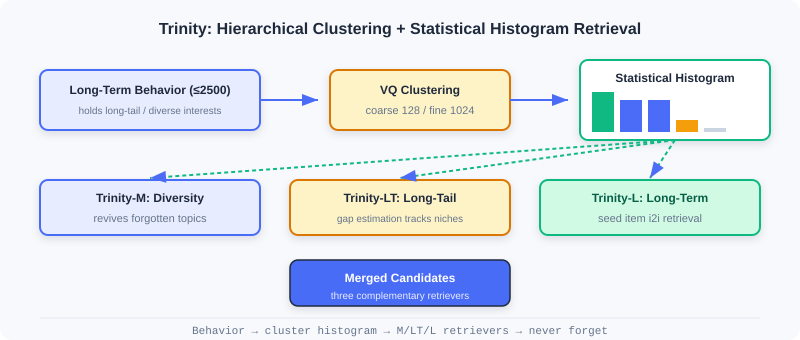
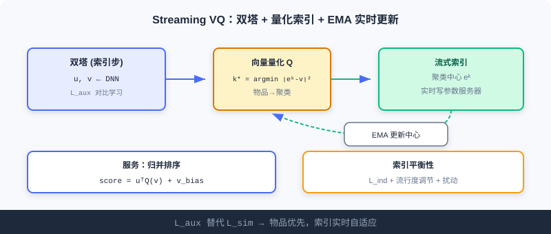

  📖
  ⏱️ ~30 min read
  🎯 Intermediate

# Streaming Index Retrieval

> 📝 **Before You Continue:** It is recommended that you first read the two-tower model in [2.3](./two-tower.md) and multi-interest in [2.4](./sequence-recall.md). This chapter steps outside the "compress history into vectors inside the model" paradigm, instead using the **index structure** itself to preserve full interests and update in real time.

The previous four sections all answer "how to encode users/items into better vectors". But there is an overlooked problem: **models learning online tend to fit recent samples, gradually forgetting long-term, long-tail interests**; meanwhile, traditional vector indexes require periodic rebuilds and cannot keep up with fast-moving content platforms.

Trinity and Streaming VQ in this chapter break through at the **index level**: the former uses cluster statistics to "explicitly preserve" full historical interests in histograms, never forgetting; the latter makes the vector quantization index **update in real time as a stream**, with no interrupted rebuilds. They represent the advancement of retrieval engineering from "compression inside the model" to "organization outside the index".

After reading this chapter, you will be able to:

- Explain Trinity's **interest amnesia** problem and its hierarchical clustering (VQ) solution
- Describe how the three histogram-based retrievers (diverse / long-tail / long-term) complement each other
- Explain how **Streaming VQ** replaces $L_{sim}$ with $L_{aux}$ to achieve a repairable, adaptive index
- Analyze the engineering value of index balance and the merge-sort serving strategy
- Complete 5 graded practice problems, consolidating streaming indexes

---

## 2.5.0 From Model Compression to Index Organization

The retrievers of previous chapters all **compress** user history into fixed-capacity vectors (single vector, multiple vectors, long-short fusion). Once capacity is fixed, old or rare interests can get "squeezed out" during training. Trinity proposes the opposite: **don't compress inside the model — explicitly preserve in the index** — aggregating historical behaviors into cluster histograms, where each cluster is an interest thread that is never forgotten.

---

## 2.5.1 Trinity: Full-Interest Retrieval via Cluster Statistics

Trinity transfers "search-style interest modeling" to the retrieval stage, handling billions of candidates with a clustering-based statistical framework.

### The Interest Amnesia Problem

Online learning frameworks tend to fit recent samples. When training samples for some interest topic become sparse, the model's memory of that topic fades — Trinity calls this **Interest Amnesia**. Long-term behavior reveals the full picture of diverse interests (short-term is dominated by popular content); the diverse interests truly worth attention are **long-tail topics** not yet sufficiently pushed; and judging whether a user is truly interested in the long tail requires going back to long-term behavior to confirm. The three are interdependent.

### Building the Clustering System

The training stage uses **vector quantization (VQ)** to learn item cluster assignments. Maintain two levels of learnable cluster centroids: coarse primary clusters $\{\boldsymbol{e}_j^1\}_{j=1}^J$ ($J=128$) and fine-grained secondary clusters $\{\boldsymbol{e}_k^2\}_{k=1}^K$ ($K=1024$). Each item is assigned by nearest neighbor:

$$\hat{j} = \arg\min_j \lVert \boldsymbol{e}^1_j - \boldsymbol{x}\rVert^2,\quad \hat{k} = \arg\min_k \lVert \boldsymbol{e}^2_k - \boldsymbol{x}\rVert^2$$

The training loss jointly optimizes user–item and user–cluster matching:

$$L = \sum_p \sum_{\boldsymbol{A}\in\{\boldsymbol{x},\boldsymbol{e}^1_{\hat{j}},\boldsymbol{e}^2_{\hat{k}}\}} y_p\log\sigma(\boldsymbol{b}_p^T\boldsymbol{A}_p) + (1-y_p)\log(1-\sigma(\boldsymbol{b}_p^T\boldsymbol{A}_p))$$

Cluster centroids are updated with **exponential moving average (EMA)** (weighted average of member item embeddings), smoothly adapting to distribution shifts. Because long-term behavior sequences are used simultaneously, recent and early items are treated equally — **temporally unbiased**, never over-favoring recent samples.

### 🧠 Mental Model: Ballot Boxes for Interests

> Think of each cluster as a ballot box, and the user's historical behaviors as votes cast into the corresponding boxes. As long as the user once acted on that kind of content, the count in the box is non-zero — it can never be "forgotten". Trinity merely counts the votes per box and decides which interests to awaken by vote count. Compressing into a single model vector is like crumpling all the votes into one ball, drowning out the rare ones.

### Histogram-Based Interest Retrieval

A behavior sequence of arbitrary length (up to 2500) is converted into a fixed-dimension statistical histogram: read each item's cluster ID, count behaviors per cluster, and obtain the primary cluster histogram $\boldsymbol{h}^1$ and secondary $\boldsymbol{h}^2$. Sorted by descending count, the interest distribution is clear at a glance. For example, sorted counts $[50,20,20,4,2,0,0,0]$ correspond to clusters $[10,33,100,91,62,21,5,83]$: cluster 10 is the dominant interest, 33/100 are diverse interests, 91/62 are exploratory interests.

Trinity accordingly designs three complementary retrievers:

1. **Diverse interest retrieval (Trinity-M)**: pick clusters with significant counts that may be ignored by the mainstream, at most one secondary cluster per primary cluster for dispersion — awakening "forgotten" topics.
2. **Long-tail interest retrieval (Trinity-LT)**: track cluster appearance intervals with streaming frequency estimation, $B[\mathcal{H}(c_k)]\leftarrow(1-\alpha)B[\mathcal{H}(c_k)]+\alpha(t-A[\mathcal{H}(c_k)])$; large intervals = long-tail topics; boost pushes when the user has significant counts in these long-tail clusters.
3. **Long-term interest retrieval (Trinity-L)**: use a lightweight two-tower to pick seed items from long-term behavior, then perform I2I retrieval based on Trinity embedding similarity.

### Comparison with Multi-Vector Methods

Multi-vector methods like MIND also capture diverse interests, but have flaws: different heads may redundantly retrieve popular content (efficiency drops as heads grow), semantics are unclear and hard to control, and extending to long-tail/long-term is hard. Trinity assigns items **exclusively** to clusters, so adding interest topics costs only linear overhead; each cluster has clear semantics (education/travel/tech), and the histogram **never forgets** — as long as relevant behavior exists in history, the corresponding count is non-zero.

> **Analysis:** Trinity explicitly preserves full interests with statistical histograms, curing interest amnesia, with interpretable semantics and easy control; the cost is maintaining two-level cluster centroids with EMA updates, making index construction more complex than a single-vector two-tower. It represents the "organization outside the index" route.

---

## 2.5.2 Streaming VQ: A Streaming Index Updated in Real Time

Trinity solved interest amnesia, but the **timeliness of the index structure** remains: traditional vector indexes need periodic rebuilds, during which the mapping is frozen. On fast-paced platforms, new content pours in and trends churn — a frozen index can't keep up. Streaming VQ proposes a **streaming-updated vector quantization index** — items are assigned to clusters in real time, and centroids continuously adapt to the distribution.

### The Core Mechanism of the Streaming Index

The training framework has two steps: the **index step** and the **ranking step**. The index step uses a two-tower to produce user/item embeddings, first optimized with an auxiliary task (in-batch contrastive learning) so that item vectors learn semantics independently of clustering:

$$L_{aux} = \sum_o -\log \frac{\exp(\boldsymbol{u}_o^T \boldsymbol{v}_o)}{\sum_r \exp(\boldsymbol{u}_o^T \boldsymbol{v}_r)}$$

Item embeddings are quantized to clusters by nearest neighbor:

$$k^*_o = \arg\min_k \lVert \boldsymbol{e}^k - \boldsymbol{v}_o\rVert^2,\quad \boldsymbol{e}_o = Q(\boldsymbol{v}_o)$$

The quantization centroids also participate in user–cluster matching optimization:

$$L_{ind} = \sum_o -\log \frac{\exp(\boldsymbol{u}_o^T \boldsymbol{e}_o)}{\sum_r \exp(\boldsymbol{u}_o^T \boldsymbol{e}_r)}$$

The item-to-cluster mapping is written to the parameter server in real time, centroids update via EMA, and the entire index updates live with training — no interrupted rebuilds.

### Index Repairability

Streaming updates bring degradation risk (no periodic rebuild to "reset"). The original VQ-VAE constrains distance with $L_{sim}=\sum_o\lVert\boldsymbol{v}_o-\boldsymbol{e}_o\rVert^2$, but in recommendation, data drift means cluster assignments should change dynamically — $L_{sim}$ actually gets in the way. Streaming VQ **replaces $L_{sim}$ with $L_{aux}$**: item embeddings update independently first, then $L_{ind}$ adjusts centroids to the new distribution — the "items first" principle keeps clusters adapting continuously instead of locking items into outdated clusters.

### Index Balance

Retrieval wants popular items spread evenly across clusters, so selecting a few clusters quickly narrows candidates. Streaming VQ promotes balance through multiple mechanisms:

- In $L_{ind}$'s softmax, popular items dominate samples; if they crowd into a few head clusters, centroids must represent many semantically diverse items with blurry representations and high loss; spreading across more clusters makes each centroid more consistent with lower loss — **the optimization itself favors balance**.
- EMA introduces popularity adjustment: $\boldsymbol{w}_k^{t+1}=\alpha\boldsymbol{w}_k^t+(1-\alpha)(\delta^t)^\beta\boldsymbol{v}_j^t$; niche items have larger gaps $\delta^t$, gaining larger weights when $\beta>0$, so centroids aren't dominated by popular items.
- Quantization introduces a perturbation $k^*_o=\arg\min_k \lVert\boldsymbol{e}^k-\boldsymbol{v}_o\rVert^2\cdot r,\; r=\min(\frac{c_k}{\sum c_{k'}/K}\cdot s,1)$; clusters with sample counts below $1/s$ of the mean get $r<1$, appearing "closer" and attracting items to join.

### The Merge-Sort Serving Strategy

At serving time, the item embedding is decomposed into a personalization part and a popularity part:

$$\text{score} = \boldsymbol{u}^T\cdot Q(\boldsymbol{v}_{emb}) + v_{bias}$$

$v_{bias}$ is a global popularity bias, while $Q(\boldsymbol{v}_{emb})$ carries the personalized matching. Clusters stay "grouped by semantics" without being skewed by popularity, and within each cluster $v_{bias}$ provides the initial ranking. Use **max-heap K-way merge sort**: first rank at the cluster level by $\boldsymbol{u}^T Q(\boldsymbol{v}_{emb})$, then rank within each cluster by $v_{bias}$, guaranteeing every cluster a chance to contribute candidates.

> **Analysis:** Streaming VQ keeps the index adapting to distributions in real time, repairable and balanced, with merge sort at serving time guaranteeing candidate diversity; the cost is real-time mapping writes to the parameter server + EMA maintenance, a heavier engineering pipeline than a static index. It complements Trinity: Trinity handles "interests never forgotten", Streaming VQ handles "the index never goes stale".

---

## ⚠️ Common Mistakes in 2.5

| # | Mistake | Example | Why It's Wrong | Fix |
|---|---------|---------|---------------|-----|
| 1 | Assuming two-tower can remember the long tail | "A two-tower single vector covers all interests" | Fixed-capacity compression squeezes out the long tail | Explicitly preserve with histograms (Trinity) |
| 2 | Constraining VQ with L_sim | Adding a similarity loss to Streaming VQ | Blocks dynamic changes of cluster assignments | Replace L_sim with L_aux |
| 3 | Ignoring temporal unbiasedness | Training Trinity with only recent behavior | Reproduces interest amnesia | Train with long-term sequences simultaneously |
| 4 | Popular items piling into head clusters | Not intervening on index balance | Blurry centroid representations, poor matching | Rely on L_ind + popularity adjustment |
| 5 | Confusing Trinity with MIND | "Both are multi-interest, so they're the same" | The former is index statistics; the latter is model multi-vectors | Distinguish the index route from the model route |

---

## Chapter Summary

### 📌 Key Takeaways

| Concept | Key Points | Why It Matters |
|---------|-----------|----------------|
| Interest amnesia | Online learning forgets sparse long-tail interests | Motivates organization outside the index |
| Trinity histogram | Behaviors → cluster-count histogram → three retrievers | Explicitly preserves full interests, never forgets |
| Streaming VQ | L_aux replaces L_sim + real-time EMA updates | Index adapts in real time, repairable |
| Merge sort | score=uᵀQ(v)+v_bias, K-way merge | Guarantees candidate diversity and balance |

### ❓ FAQ

**Q1: Trinity and MIND both address "diverse interests" — what is the fundamental difference?**
> A: MIND is **inside the model** with multiple interest vectors (online learning easily forgets sparse interests); Trinity is **outside the index** with statistical histograms explicitly preserving per-cluster counts — naturally never forgetting, with interpretable semantics and easy control.

**Q2: Why does Streaming VQ use L_aux instead of L_sim?**
> A: L_sim locks items into old assignments "close to current centroids", blocking clusters from changing dynamically as data drifts; L_aux lets item vectors update independently first, then L_ind adjusts centroids — achieving "items-first" adaptation.

**Q3: What does merge sort do at serving time?**
> A: It splits the score into "cluster-level personalization + within-cluster popularity", using K-way merge to give every cluster a chance to contribute candidates, preventing popular clusters from monopolizing and guaranteeing retrieval diversity.

### 🔗 Connections to Later Chapters

- **2.4 (Sequential Retrieval)** is the "multi-vector inside the model" route, complementary to this chapter's "statistics outside the index"; the two can be combined.
- **2.3 (Two-Tower)** the index step of Streaming VQ is exactly two-tower + quantization, carrying forward its vector outputs.
- **Part 3 (Ranking)** the candidates retrieved in this chapter proceed to the ranking stage for fine ranking.

---

## Practice Problems

Work through all problems in order — they get progressively harder. Each has a complete solution you can reveal after trying it yourself.

---

**Problem 2.5.1 — Reading the Histogram** 🟢 Easy

Trinity converts a user's behavior sequence into a primary cluster histogram with descending counts $[50,20,20,4,2,0,0,0]$, corresponding to cluster indices $[10,33,100,91,62,21,5,83]$. Identify which clusters correspond to the dominant interest, diverse interests, and exploratory interests.

💡 Solution (click to reveal)

**Approach:** Stratify by count.

- Dominant interest: highest count (50) → cluster **10**.
- Diverse interests: next highest, needing awakening (20,20) → clusters **33, 100**.
- Exploratory interests: lower counts (4,2) → clusters **91, 62**.
- The rest (21,5,83) have zero counts and can be ignored.

**Key points:**
- After descending sort, high counts = backbone, mid counts = diverse, low counts = exploratory.
- A non-zero count means that interest has not been forgotten.

---

**Problem 2.5.2 — Quantization Assignment** 🟢 Easy

Streaming VQ quantization formula: $k^*_o=\arg\min_k\lVert\boldsymbol{e}^k-\boldsymbol{v}_o\rVert^2$. Given item $o$ with vector $\boldsymbol{v}_o=[1,0]$ and three cluster centroids $\boldsymbol{e}^1=[0,0]$, $\boldsymbol{e}^2=[1,1]$, $\boldsymbol{e}^3=[1,0]$. Find $k^*_o$.

💡 Solution (click to reveal)

**Approach:** Compute squared distances to each centroid.

- $\lVert e^1-v_o\rVert^2 = \lVert[-1,0]\rVert^2 = 1$
- $\lVert e^2-v_o\rVert^2 = \lVert[0,1]\rVert^2 = 1$
- $\lVert e^3-v_o\rVert^2 = \lVert[0,0]\rVert^2 = 0$

The minimum is 0 → $k^*_o = 3$.

**Key points:**
- Quantization = nearest-neighbor assignment; items go to the closest centroid.
- In streaming updates, this mapping is written to the parameter server in real time.

---

**Problem 2.5.3 — The Interest Amnesia Intuition** 🟡 Medium

A user's long-term behavior contains lots of "classical music", but the last 3 months include only popular "variety shows". An online-learning model gradually forgets the classical music interest. Explain: (a) why a two-tower single vector forgets; (b) why a Trinity histogram does not.

💡 Solution (click to reveal)

**Approach:** Compare how the two representations retain information.

**(a) Two-tower single vector:** The model fits recent samples online; gradients related to classical music are sparse, and its latent vector components get gradually overwritten/averaged by continuous gradients from recent popular samples; fixed capacity squeezes out rare interests — interest amnesia.

**(b) Trinity histogram:** The historical behavior counts for the classical-music clusters were long since written into the histogram, and training uses long-term sequences (temporally unbiased). As long as the behavior exists in history, the count is non-zero and will still be awakened at retrieval time — it doesn't depend on the model "remembering" it.

**Key points:**
- Single vector = information compressed into capacity; the rare gets overwritten.
- Histogram = information externalized as counts, permanently preserved.

---

**Problem 2.5.4 — Merge-Sort Decomposition** 🔴 Hard

Streaming VQ serving score: $\text{score}=\boldsymbol{u}^T Q(\boldsymbol{v}_{emb})+v_{bias}$. Given the inner product of the user vector with an item's quantized vector as 0.6, and the item's popularity bias $v_{bias}=0.3$, compute the total score. Also explain: if two items have inner products 0.6 and 0.4 but $v_{bias}$ values 0.1 and 0.5, how does merge sort use these two terms at the "cluster level" and "within cluster" respectively.

💡 Solution (click to reveal)

**Approach:** Substitute and explain the two-level ranking.

Total score $=0.6+0.3=0.9$.

Two items: A (inner product 0.6, bias 0.1) → 0.7; B (inner product 0.4, bias 0.5) → 0.9.

**Answer:** Merge sort first ranks at the **cluster level** by the personalization term $\boldsymbol{u}^T Q(v)$ (selecting clusters that best match the user's personalization), then ranks **within each cluster** by $v_{bias}$. This way clusters stay "grouped by semantics" (not skewed by popularity bias), while within clusters the global popularity provides the initial ranking. B, weak in personalization but high in popularity, ranks high within its cluster; A, strong in personalization, wins in another cluster-level ranking — every cluster gets a chance to contribute, guaranteeing diversity.

**Key points:**
- The decomposition decouples "semantic grouping" from "popularity".
- K-way merge guarantees candidates cover multiple clusters in balance.

---

**🏆 Challenge: Combining Streaming Index Retrieval**

A short-video platform's trends churn every minute, with an enormous long tail and drifting user interests. In about 150 words, explain how to **combine** Trinity (histogram multi-retriever) and Streaming VQ (real-time quantization index) to build retrieval: what each compensates for, how the index is maintained in real time, and why this beats a pure two-tower for this scenario.

💡 Hint

Trinity's three histogram retrievers explicitly preserve diverse/long-tail/long-term interests, curing two-tower forgetting; Streaming VQ uses L_aux+EMA to let the cluster index adapt to trend churn in real time, repairable and balanced. Item mappings are written to the parameter server in real time; two-tower-produced vectors enter the index via quantization. Better than a pure two-tower because: the long tail isn't drowned, trends don't go stale, and the index follows distribution drift without periodic rebuilds.

