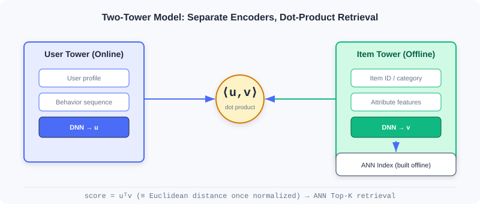
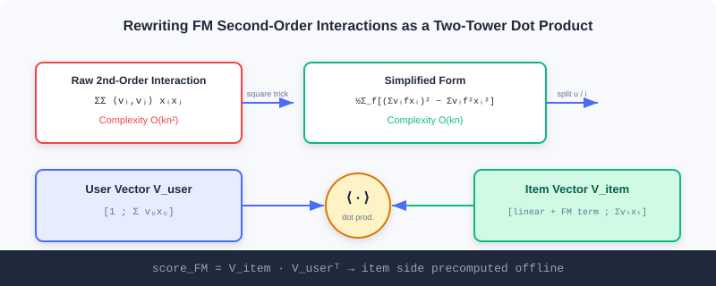

  📖
  ⏱️ ~35 min read
  🎯 Advanced

# Two-Tower Model (U2I)

> 📝 **Before You Continue:** Please first read matrix factorization in [2.1](./collaborative-filtering.md) and Item2Vec in [2.2](./vector-recall-i2i.md). This chapter upgrades the "inner product" idea from item–item to **user–item**, encoding both sides with deep networks — the backbone of industrial U2I retrieval.

The item vectors you learned in the previous three sections (Item2Vec / EGES) perform **I2I** retrieval — first a seed item, then similar items. But online retrieval often starts not from an "item" but from a "user": given a user, pull out what they might like directly from a corpus of hundreds of millions of items. This requires a **user representation** and an **item representation** encoded separately in the same space, then retrieved by inner product — this is the **two-tower model**.

Its engineering charm lies in "divide and conquer": the item tower can be **precomputed offline** and stored in an approximate nearest-neighbor index (ANN), while the user tower computes **in real time**; online, only a single vector search is needed. From FM's mathematical prototype, to DSSM's deep encoding, to YouTubeDNN's "predict the next watch" — this chapter walks you through the two-tower evolution, with an interactive demo to build intuition for the retrieval process.

After reading this chapter, you will be able to:

- Derive the simplification of the **FM second-order interaction term** from $O(kn^2)$ to $O(kn)$, and show how it reorganizes into a two-tower inner product
- Explain the role of **DSSM**'s extreme multi-class training, vector normalization, and the temperature coefficient
- Describe **YouTubeDNN**'s "asymmetric two-tower" and "temporal split" engineering tricks
- Understand the two-tower retrieval flow of "offline index building / online user query" through the interactive demo
- Complete 5 graded practice problems, consolidating two-tower representation and retrieval

---

## 2.3.0 Why Two Towers: From I2I to U2I

I2I retrieval depends on "the user has interacted with some item" as a seed. But in many scenarios, the user just registered, or we want to recommend before they **take any action**. U2I directly uses the user themselves (profile + behavior) as the query, retrieving candidates from the full corpus:

The two-tower's core convention: **the two towers barely interact during training, meeting only at the final inner product**. This buys a precious engineering property — item vectors can be computed offline once and indexed, user vectors computed online on the fly, with retrieval cost kept minimal.

---

## 2.3.1 FM (Factorization Machines): The Prototype of Two-Tower Models

FM was born before deep learning, yet anticipated the two-tower in spirit. It elegantly decomposes complex user–item interactions into the inner product of two low-dimensional vectors. The full expression:

$$\hat{y}(\boldsymbol{x}) = w_0 + \sum_{i=1}^{n} w_i x_i + \sum_{i=1}^{n}\sum_{j=i+1}^{n}\langle\boldsymbol{v}_i, \boldsymbol{v}_j\rangle x_i x_j$$

Each feature $i$ corresponds to a $k$-dimensional latent vector $\boldsymbol{v}_i$, with interactions modeled through the inner product $\langle\boldsymbol{v}_i,\boldsymbol{v}_j\rangle=\sum_{f=1}^k v_{i,f}v_{j,f}$.

### Computational Complexity Simplification

The originally $O(n^2)$ second-order term can be rewritten as:

$$\sum_{i=1}^{n}\sum_{j=i+1}^{n}\langle\boldsymbol{v}_i, \boldsymbol{v}_j\rangle x_i x_j = \frac{1}{2}\sum_{f=1}^{k}\left(\left(\sum_{i=1}^{n}v_{i,f}x_i\right)^2 - \sum_{i=1}^{n}v_{i,f}^2 x_i^2\right)$$

Complexity drops from $O(kn^2)$ to $O(kn)$, letting FM handle large-scale sparse data.

### 🧠 Mental Model: Latent Vectors as Building Blocks

> Think of each feature as a block hiding a small pointer (its latent vector). Whether two features "get along" doesn't depend on the blocks themselves, only on whether their pointers point in the same direction (big inner product = compatible). FM's elegance: instead of exhaustively trying all pairs, it computes all pairings at once via "sum of squares minus square of sums".

### Decomposition into a Two-Tower Structure

In retrieval scenarios, features fall into two groups: user side $U$ and item side $I$. When recommending different items to the same user, **interaction scores among user features are identical across all candidates and can be ignored during ranking**. Keep only: intra-item interactions + user–item interactions. After rearrangement:

$$\text{score}_{FM} = \sum_{t\in I} w_t x_t + \frac{1}{2}\sum_{f=1}^{k}\left(\left(\sum_{t\in I}v_{t,f}x_t\right)^2 - \sum_{t\in I}v_{t,f}^2x_t^2\right) + \sum_{f=1}^{k}\left(\sum_{u\in U}v_{u,f}x_u\sum_{t\in I}v_{t,f}x_t\right)$$

Look at the last term — it is exactly the inner product of two vectors $\sum_{u\in U}v_u x_u$ and $\sum_{t\in I}v_t x_t$. Hence:

$$\text{score}_{FM} = V_{item}\cdot V_{user}^T$$

- User vector: $V_{user} = [1; \sum_{u\in U} v_u x_u]$
- Item vector: $V_{item} = [\sum_t w_t x_t + \frac{1}{2}\sum_f((\sum_t v_{t,f}x_t)^2 - \sum_t v_{t,f}^2x_t^2); \sum_t v_t x_t]$

> **Analysis:** FM uses linear algebra to turn feature crossings into a two-tower inner product, with item vectors precomputable offline — the theoretical prototype of the two-tower idea. But it is a **linear** model with limited expressiveness for complex nonlinear user–item relations — exactly why DSSM took over with deep networks.

---

## 2.3.2 DSSM: Deep Structured Semantic Model

DSSM replaces FM's linear transforms with **deep neural networks**, mapping users and items into a shared semantic space where similarity is measured by vector distance.

### The Two-Tower Architecture in Recommendation

DSSM consists of two independent DNN towers: the user tower processes user features (behavior, demographics) and outputs a user embedding; the item tower processes item features (ID, category, attributes) and outputs an item embedding. The embedding dimensions of the two towers must match. Compared to FM's linear combination, DSSM lets each side perform complex nonlinear transforms within its own tower, with **the two towers interacting only at the final inner product**. Item vectors are precomputed offline, user vectors computed in real time, and retrieval is completed via ANN.

### The Multi-Class Training Paradigm

DSSM treats retrieval as extreme multi-class classification: all items in the corpus are classes, and the goal is to maximize the predicted probability of the user's positive sample:

$$P(y|x,\theta) = \frac{e^{s(x,y)}}{\sum_{j\in M}e^{s(x,y_j)}}$$

$M$ is the entire corpus. Since the corpus is huge, negative sampling approximates it in practice.

### Key Details of Two-Tower Models

**Vector normalization**: L2-normalize both embeddings, $u\leftarrow u/\|u\|_2,\; v\leftarrow v/\|v\|_2$. The raw dot product doesn't satisfy the triangle inequality, causing inconsistent "distances". After normalization, the dot product is equivalent to Euclidean distance:

$$\|u-v\| = \sqrt{2-2\langle u,v\rangle}$$

The key is **train/serve consistency** — what training optimizes (normalized dot product) and what online ANN uses (Euclidean distance) are essentially equivalent, avoiding train-serving mismatch.

**Temperature coefficient**: divide the normalized inner product by $\tau$:

$$s(u,v) = \frac{\langle u,v\rangle}{\tau}$$

$\tau<1$ amplifies similarity differences (more "confident"); $\tau>1$ smooths the distribution (more conservative). It essentially scales the logits, reshaping the Softmax output.

> **Analysis:** DSSM's expressiveness comes from deep nonlinearity, and its engineering advantage from "offline item tower + online user tower". Normalization and temperature are the two must-tune knobs before launch — the former guarantees retrieval consistency, the latter controls retrieval "concentration". The cost is that the two-tower's "late interaction" loses some fine-grained feature-crossing signal.

---

## 2.3.3 YouTubeDNN: From Matching to Predicting the User's Next Action

YouTubeDNN is a milestone in two-tower evolution. It keeps the two-tower structure but introduces a key shift: defining retrieval as "**predicting the user's next watched video**", analogous to next-token prediction in NLP.

### The Asymmetric Two-Tower Architecture

The user tower integrates multi-modal signals such as watch history, search history, and demographics; video IDs are embedded and aggregated by average pooling, with an **Example Age** feature introduced to model content freshness. The item tower is comparatively simple — essentially one huge embedding matrix, one learnable vector per video, avoiding complex item feature engineering. The objective is extreme multi-class classification:

$$P(w_t=i|U,C) = \frac{e^{v_i\cdot u}}{\sum_{j\in V}e^{v_j\cdot u}}$$

Since the video corpus is huge, Sampled Softmax enables efficient training.

### Key Engineering Tricks

- **Asymmetric temporal split**: instead of random validation, use "roll-over" — the prediction target only sees history **before** it, avoiding future leakage (matching real recommendation, where episodes are watched in order).
- **Negative sampling strategy**: importance sampling, computing only thousands of negatives each time, speeding training up by over 100x.
- **Per-user sample balancing**: generate a fixed number of training samples per user, preventing highly active users from dominating learning — critical for long-tail user performance.

> **Analysis:** YouTubeDNN established the "scalable, production-ready" two-tower paradigm: train with a complex multi-class objective + rich user features; at serving time precompute item vectors, compute user vectors in real time, and pair with ANN retrieval. The asymmetric design keeps the item tower lean (easy offline indexing) while the user tower scales flexibly — a balance still widely borrowed today.

---

## 2.3.4 Interactive Demo: The Two-Tower Retrieval Process

The interactive demo below lets you feel the core flow of two-tower retrieval: the item tower encodes all items into a vector index **offline**; online, a user arrives, the user tower encodes their vector **in real time**, and nearest-neighbor search pulls the most similar Top-K candidates from the index. Click "Next" to observe each step.

<iframe src="../viz/part2-two-tower.html?embed&vizId=part2-two-tower" style="width:100%; height:640px; border:none; border-radius:12px; display:block;" loading="lazy"></iframe>

Note the third step, "retrieve": it doesn't traverse the full corpus scoring every item, but uses ANN to locate directly in the neighbor space — this is the fundamental reason a two-tower can serve a corpus of hundreds of millions at millisecond latency. Normalization makes the inner product equivalent to Euclidean distance, and the temperature coefficient controls how concentrated retrieval is.

> 📊 **Data Point:** On the funrec benchmark, FM retrieval achieves hit_rate@10≈0.047, DSSM≈0.016, YouTubeDNN≈0.013. The numeric differences mainly come from dataset and feature configuration, not model quality — DSSM/YouTubeDNN usually win with richer features and larger scale.

---

## ⚠️ Common Mistakes in 2.3

| # | Mistake | Example | Why It's Wrong | Fix |
|---|---------|---------|---------------|-----|
| 1 | Early interaction between towers | Concatenating user/item features early | Destroys the "items precomputable offline" property | Interaction happens only at the final inner product |
| 2 | Forgetting vector normalization | ANN retrieval on raw dot products | Dot product is not a metric; train-retrieve inconsistency | L2-normalize both sides |
| 3 | Careless temperature setting | Leaving τ=1 untuned | Retrieval concentration out of control, head over-clustering | Tune τ per business to shape the distribution |
| 4 | Treating FM as a deep model | "FM can fit any nonlinearity" | FM is linear with fixed crossing order | For nonlinearity, use DSSM |
| 5 | Random splits for YouTubeDNN | Validation set containing future behavior | Future leakage, inflated offline metrics | Use temporal roll-over splits |

---

## Chapter Summary

### 📌 Key Takeaways

| Concept | Key Points | Why It Matters |
|---------|-----------|----------------|
| FM, the two-tower prototype | Second-order interactions rearranged as $V_{item}\cdot V_{user}^T$ | Theoretical starting point; items precomputable offline |
| DSSM | Deep two-tower + extreme multi-class + normalization/temperature | The industrial U2I backbone: expressive + efficient retrieval |
| YouTubeDNN | Predict next watch + asymmetric towers + temporal split | A scalable, production-ready paradigm |
| Train-retrieve consistency | Normalized dot product ≡ Euclidean distance | Avoids online/offline mismatch |

### ❓ FAQ

**Q1: Why is the two-tower's "late interaction" actually an advantage?**
> A: Because item vectors can be fully computed offline and indexed; online, only the user vector plus one ANN search is needed. If towers interacted early (e.g., feature crossing), item vectors would depend on the specific user and become impossible to precompute, losing scalability.

**Q2: What are the effects of increasing vs. decreasing the temperature τ?**
> A: τ<1 amplifies similarity differences — the model is more "confident" and retrieval more concentrated (prone to head clustering); τ>1 smooths the distribution, more conservative, with more dispersed candidates. It's the knob balancing precision and diversity.

**Q3: Both FM and DSSM use inner products — what's the difference?**
> A: FM's vectors come from linear combinations + fixed latent vectors (a linear model); DSSM's vectors come from nonlinear transforms of deep networks (more expressive), and it explicitly handles normalization and sampled training.

### 🔗 Connections to Later Chapters

- **2.4 (Sequential Retrieval)** upgrades user representation from "single vector" to "multiple vectors / long-short fusion", fixing the single two-tower vector's loss of temporal order.
- **2.5 (Streaming Index)** takes the item vectors produced by two-tower models and organizes them into a streaming index that updates in real time.
- **3.x (Ranking)** the ranking side can use more complex "early interaction" models (such as feature crossing), complementing the two-tower's late interaction.

---

## Practice Problems

Work through all problems in order — they get progressively harder. Each has a complete solution you can reveal after trying it yourself.

---

**Problem 2.3.1 — FM Complexity Simplification** 🟢 Easy

FM's second-order interaction term in its original form requires pairing $n$ features two by two, with complexity $O(kn^2)$. Write the simplified form, and explain why it only needs $O(kn)$.

💡 Solution (click to reveal)

**Approach:** Recall the expansion of the squared term.

$$\sum_{i<j}\langle v_i,v_j\rangle x_i x_j = \frac{1}{2}\sum_{f=1}^{k}\left(\left(\sum_i v_{i,f}x_i\right)^2 - \sum_i v_{i,f}^2 x_i^2\right)$$

**Answer:** For each latent dimension $f$, the right side only needs one pass over the features $i$ for the sum and the sum of squares, then subtraction: $k$ dimensions × $n$ features → $O(kn)$ instead of $O(kn^2)$.

**Key points:**
- The key trick is turning "sum of pairwise products" into "square of the sum minus sum of the squares".
- This is exactly why FM scales to large sparse data.

---

**Problem 2.3.2 — Two-Tower Inner Product Reorganization** 🟢 Easy

In FM retrieval, intra-user-feature interactions are identical across candidates and can be ignored. The final score is written $\text{score}_{FM}=V_{item}\cdot V_{user}^T$. Given user vector $V_{user}=[1, 0.6, 0.2]^T$ and item vector $V_{item}=[0.4, 0.5, 0.3]^T$, compute the inner product (the matching score).

💡 Solution (click to reveal)

**Approach:** Multiply component-wise and sum.

$$\text{score} = 1\times0.4 + 0.6\times0.5 + 0.2\times0.3 = 0.4 + 0.3 + 0.06 = 0.76$$

**Key points:**
- The first term multiplies the constant 1 with the item vector's bias/linear part; the latter two terms are latent-vector interactions.
- The item vector is precomputed offline; online, only the user vector is computed plus one inner product.

---

**Problem 2.3.3 — Normalization and Distance** 🟡 Medium

Given unnormalized vectors $A=(10,0)$, $B=(0,10)$, $C=(11,0)$. First use the raw dot product as "similarity" to judge who is closer to A (bigger dot product = closer). Then L2-normalize all three and judge with Euclidean distance $\|u-v\|$. Explain why normalization is more reasonable.

💡 Solution (click to reveal)

**Approach:** Compute both ways.

Raw dot products: $A\cdot B=0$, $A\cdot C=110$. By "bigger = closer", C is closer. In this particular example that happens to agree with the geometry ($|B-A|=\sqrt{200}\approx14.1$, $|C-A|=1$), but the dot-product ranking is not reliable: it is distorted by vector magnitude — if C were replaced by a long vector like $(11,1)$, which is not that close to A in angle, the dot product would still be large and the ranking would break. The unnormalized dot product is not a true distance metric.

After normalization: $A'=(1,0), B'=(0,1), C'=(1,0)$. Euclidean distances: $\|A'-B'\|=\sqrt{2}\approx1.41$, $\|A'-C'\|=0$. Now C is closer (identical directions) and B farthest — matching intuition ($A,C$ parallel, $B$ orthogonal).

**Key points:**
- The dot product is distorted by vector magnitude; it is not a true metric.
- After normalization, dot product ⇔ Euclidean distance; training (dot product) and ANN retrieval (Euclidean) are consistent.

---

**Problem 2.3.4 — Temperature Effects** 🔴 Hard

DSSM uses Sampled Softmax approximating $P(y|x)\propto e^{\langle u,v\rangle/\tau}$. Given a user whose inner products with three items are $s_1=2.0, s_2=1.0, s_3=0.0$. Compute the Softmax probabilities for $\tau=0.5$ and $\tau=2.0$ (formula $p_i=e^{s_i/\tau}/\sum e^{s_j/\tau}$), and explain how τ affects retrieval concentration.

💡 Solution (click to reveal)

**Approach:** Substitute each case.

τ=0.5: $s/\tau = [4, 2, 0]$, $e^{s/\tau}=[54.6, 7.39, 1]$, sum=63.0 → $p=[0.866, 0.117, 0.016]$.

τ=2.0: $s/\tau = [1, 0.5, 0]$, $e=[2.718, 1.649, 1]$, sum=5.367 → $p=[0.506, 0.307, 0.186]$.

**Answer:** At τ=0.5, probability concentrates heavily on item 1 (0.866) — retrieval is very concentrated; at τ=2.0, the distribution flattens (0.506/0.307/0.186) — candidates disperse. Smaller τ is more "confident/concentrated"; larger τ more "conservative/dispersed".

**Key points:**
- τ scales the logits, reshaping the Softmax.
- Industry uses τ to balance "precise hits" against "diversity coverage".

---

**🏆 Challenge: Design a Two-Tower Retrieval Pipeline**

An e-commerce platform needs U2I retrieval with a 500-million-item corpus and peak 100K QPS. In about 150 words, explain: why two-tower over ItemCF; the division of labor between offline item-tower indexing cadence and real-time user-tower computation; and which link must use ANN, and why.

💡 Hint

Two-tower fits because "users without seed items can still be retrieved", item indexes can be built offline, and online only requires the user vector + ANN search — naturally suited to high QPS and large corpora; offline indexing can recompute item vectors into the ANN index in daily/hourly batches, while the user tower computes on request. ANN is indispensable — computing inner products against 500 million items one by one is infeasible; nearest-neighbor search is needed to return Top-K at millisecond latency. Temperature and normalization must be configured to keep retrieval consistent.

