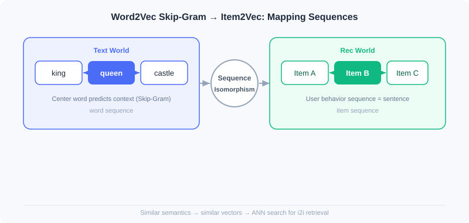

  📖
  ⏱️ ~30 min read
  🎯 Intermediate

# Vector Retrieval (I2I)

> 📝 **Before You Continue:** It is recommended that you first read ItemCF and matrix factorization in [2.1](./collaborative-filtering.md). This chapter is a natural extension of the "treat items as vectors" idea — the difference is that similarity is no longer derived from co-occurrence statistics, but determined by dense vectors learned through **sequence modeling**.

Collaborative filtering in [2.1](./collaborative-filtering.md) defines similarity by "who interacted with what together". But if an item has barely been interacted with (cold-start new product), co-occurrence statistics fail. More fundamentally: co-occurrence only tells you "related", without encoding items as semantic vectors, making it hard to further fuse attributes or perform nearest-neighbor search.

The protagonist of this chapter is the **sequence modeling idea of Word2Vec**. It rests on a simple yet profound assumption: **words appearing in similar contexts have similar meanings**. When we replace "sentence" with "a user's behavior sequence" and "word" with "item", the same machinery learns item representations where "semantically close means vectorially close", usable for I2I retrieval. From the most direct Item2Vec transfer, to attribute-fusing EGES, to Airbnb writing business objectives into the sequence — you will see how this line of work inches ever closer to industrial reality.

After reading this chapter, you will be able to:

- Explain the core formula of **Word2Vec Skip-Gram**, and why **negative sampling** is indispensable
- Describe how **Item2Vec** applies the "user behavior sequence = sentence" mapping to I2I vector retrieval
- Explain how **EGES**'s item-specific attention solves cold start and sparsity
- Analyze how **Airbnb**'s global context and same-market negative sampling bake "booking conversion" into training
- Complete 5 graded practice problems, consolidating sequence-modeling retrieval

---

## 2.2.0 From Words to Items: A Structural Analogy

Word2Vec's success rests on "co-occurrence reflects semantics". In natural language, a sentence consists of words whose co-occurrence reflects semantics; in recommendation, a user's interaction history can be viewed as a "sentence", with items as the "words". This is Item2Vec's entire starting point — **structural isomorphism, ready for transfer**.

| Text World | Recommendation World |
|----------|----------|
| Word | Item |
| Sentence | User interaction sequence |
| Word co-occurrence | Items interacted with by the same user |

In the next four sections, you will see how this seemingly naive mapping supports an entire family of I2I vector retrieval methods.

---

## 2.2.1 Word2Vec: The Theoretical Foundation of Sequence Modeling

> 📎 This section covers only the intuition of Skip-Gram and its transfer to recommendation. For the **CBOW architecture, structural details of the center-word/context-word two-way weight matrices $\mathbf{W}$/$\mathbf{W}^c$, the exact form of negative sampling, and word-vector analogy properties**, see **[Appendix: Word2Vec Deep Dive](../appendix/word2vec.md)**.

Word2Vec includes two architectures: **Skip-Gram** (predicting context from the center word) and **CBOW** (predicting the center word from context). Skip-Gram performs better in recommendation and is more widely adopted.

### The Skip-Gram Model

Given the center word $w_t$ at position $t$ of a sequence, the model maximizes the occurrence probability of all context words within its window (size $m$):

$$P(w_{t+j} | w_t) = \frac{e^{v_{w_{t+j}}^T v_{w_t}}}{\sum_{k=1}^{|V|} e^{v_{w_k}^T v_{w_t}}}$$

$v_{w_i}$ is the vector of word $w_i$, and $|V|$ is the vocabulary size. Softmax ensures probabilities sum to 1, and the inner product in the numerator measures the similarity between the center word and the context word.

### 🧠 Mental Model: The Guess-the-Neighbor Game

> Imagine playing "I say a word, you guess what's likely next to it". Hearing "king", you'd probably guess "queen" or "castle". Skip-Gram makes the model play this game: it doesn't ask "do these two words co-occur", but "given the center word, what words are most likely around it" — through repeated guessing, the model is forced to place semantically similar words at nearby positions in the vector space.

### Negative Sampling Optimization

Computing the Softmax denominator directly requires traversing the entire vocabulary, which is prohibitively expensive. Negative sampling turns the multi-class problem into multiple binary-class problems:

$$\log \sigma(v_{w_{t+j}}^T v_{w_t}) + \sum_{i=1}^{n_{\mathrm{neg}}} \mathbb{E}_{w_i \sim P_n(w)} \log \sigma(-v_{w_i}^T v_{w_t})$$

where $\sigma(x)=1/(1+e^{-x})$ and $n_{\mathrm{neg}}$ is the number of negative samples. The intuition: **raise** similarity for real word pairs, **lower** similarity for randomly sampled negative word pairs. This paradigm is exactly the technical cornerstone of subsequent recommender model training.

> **Analysis:** Skip-Gram + negative sampling is efficient and scalable, the theoretical prototype for direct transfer to recommendation; but it works on "words", so user behavior sequences must be correctly mapped into training corpora before it applies to recommendation.

---

## 2.2.2 Item2Vec: The Most Direct Transfer

Item2Vec's core insight is exactly the "structural isomorphism" from the previous section: treat user interaction history as a "sentence" and items as "words".

### Model Implementation

Item2Vec directly adopts Word2Vec's Skip-Gram, but simplifies sequence construction — each user's interaction history is treated as a **set** rather than a sequence, **ignoring temporal weighting** (the window still depends on positions $i+j$ after sorting by time; it just no longer assigns different weights to different positions). The objective function stays the same:

$$\mathcal{L} = \sum_{s \in \mathcal{S}} \sum_{l_{i} \in s} \sum_{-m \leq j \leq m, j \neq 0} \log P(l_{i+j} | l_{i})$$

where $l_i$ is an item, $m$ is the window size, and $P(l_{i+j}|l_i)$ takes the same Softmax form as Word2Vec. After training, each item gets a dense vector, enabling nearest-neighbor search for I2I retrieval.

> **Analysis:** Item2Vec is extremely easy to implement (a few gensim calls), validating the feasibility of sequence modeling in recommendation; but it treats history as an unordered set, losing temporal order, and is powerless against **new-item cold start** — no interactions, no vector. These two points are exactly EGES's motivation.

---

## 2.2.3 EGES: Enhancing Sequences with Attribute Information

Item2Vec treats interaction history as an unordered set and cannot handle cold start. EGES (Enhanced Graph Embedding with Side information) addresses both with two innovations: **session-level graphs** better reflect behavior patterns, and **fusing side information** solves sparsity and cold start.

### Building the Item Relation Graph

EGES splits sessions by a "one-hour time window", building **directed edges** only between consecutive behaviors within the window, with edge weights as transition frequencies. Compared to treating the whole history as one sequence, this more accurately captures continuous interest transitions within specific periods. **Weighted random walks** on the graph generate training sequences, with transition probabilities determined by edge weights:

$$P(v_j|v_i) = \begin{cases} \frac{M_{ij}}{\sum_{j=1}^{|N_+(v_i)|}M_{ij}} & \text{if } v_j \in N_+(v_i) \\ 0 & \text{if } e_{ij} \notin E \end{cases}$$

### Fusing Side Information

Pure behavior sequences learn poorly for sparse items. GES first aggregates the item ID vector and attribute vectors with a simple average:

$$H_v=\frac{1}{n+1} \sum_{s=0}^n{W_v^s}$$

$W_v^s$ is the vector of the $s$-th attribute, and $W_v^0$ is the item ID vector. But averaging assumes all attributes are equally important, which clearly doesn't hold (phones hinge on brand, daily necessities on price).

**EGES's core innovation** is item-specific attention — learning a set of weights per item to emphasize the more important attributes:

$$H_v = \frac{\sum_{j=0}^n e^{a_v^j} W_v^j}{\sum_{j=0}^n e^{a_v^j}}$$

$a_v^j$ is a learnable weight. For **cold-start new items** with no behavior sequence and no trained $a_v^j$, EGES degrades to mean pooling over attribute vectors, directly obtaining a meaningful representation so the item can be included in I2I retrieval.

Training uses Word2Vec-style negative sampling, with the loss:

$$L(v,u,y) = -[y\log(\sigma(H_v^TZ_u)) + (1-y)\log(1-\sigma(H_v^TZ_u))]$$

> **Analysis:** EGES significantly alleviates sparsity and cold start with side information, outperforming traditional methods on billion-scale data; the cost is maintaining an attention parameter matrix of $|V|\times(n+1)$, raising engineering and storage costs. It represents the "balancing behavior and content" school of industrial I2I retrieval.

---

## 2.2.4 Airbnb: Baking Business Objectives into the Sequence

As a short-term rental platform, Airbnb has non-standard listings, bookings sparser than clicks, critical geography, and a stronger need to drive **final booking conversion** rather than mere similarity. It redefined the "sequence".

### Business-Oriented Sequence Construction

- **Session segmentation**: a new session starts when the gap between user clicks exceeds 30 minutes, more accurately capturing coherent intent within a specific search context.
- **Differentiated behavior weights**: the final booking carries a much stronger preference signal than a plain click, and should receive higher weight in training.

### The Global Context Mechanism

Traditional Skip-Gram only looks at local context within the sliding window. Airbnb forms positive pairs between **the user's finally booked listing $l_b$** and every browsed listing in the sequence, no matter how far apart:

$$\underset{\theta}{\arg\max} \sum_{(l,c) \in \mathcal{D}_p} \log \frac{1}{1 + e^{-v_c^T v_l}} + \sum_{(l,c) \in \mathcal{D}_n} \log \frac{1}{1 + e^{v_c^T v_l}} + \log \frac{1}{1 + e^{-v_{l_b}^T v_l}}$$

The first two terms are standard Skip-Gram (positive/negative samples); the third term $\log\frac{1}{1+e^{-v_{l_b}^T v_l}}$ is the innovation — the booked listing provides an extra learning signal for every listing in the sequence, letting the model capture "what kinds of listing combinations ultimately lead to a booking".

### Market-Aware Negative Sampling

Users typically only book within the same market (city/region). If negative samples come from other regions, the model easily learns the easy "geographic location" feature while ignoring differences between the listings themselves. Airbnb draws some negative samples from the **same market**:

$$\sum_{(l, l_m^-) \in \mathcal{D_m}} \log \frac{1}{1 + e^{v_{l_m^-}^T v_l}}$$

This forces the model to learn fine-grained differences between listings within the same region, improving discrimination.

> **Analysis:** Airbnb writes "business conversion" and "geographic constraints" directly into the training objective, a model example of "business-objective-driven sequence construction"; but it is highly domain-customized (session thresholds and market partitions need business-specific tuning), less general than EGES.

---

## ⚠️ Common Mistakes in 2.2

| # | Mistake | Example | Why It's Wrong | Fix |
|---|---------|---------|---------------|-----|
| 1 | Treating Item2Vec as an ordered sequence | Strictly sorting training data by timestamp | The Item2Vec paper treats history as an unordered set, losing temporal order | If order matters, use EGES/Airbnb/sequential retrieval (2.4) |
| 2 | Putting cold-start items directly into Item2Vec | New products have no vectors and can't be retrieved | No behavior means no co-occurrence, no learned vector | Use EGES's side-info mean pooling |
| 3 | Ignoring negative sampling | Computing full-vocabulary Softmax directly | Vocabulary/item corpus too large, computationally infeasible | Negative sampling approximation is mandatory |
| 4 | Applying Airbnb to non-geographic scenarios | Forcing market-based negative sampling on general e-commerce | Without geographic constraints it introduces noise instead | Business customization needs matching domain signals |
| 5 | Averaging attribute aggregation | Using simple averaging à la GES | Assumes all attributes are equally important, which doesn't hold | Use item-specific attention weighting |

---

## Chapter Summary

### 📌 Key Takeaways

| Concept | Key Points | Why It Matters |
|---------|-----------|----------------|
| Word2Vec Skip-Gram | $P(w_{t+j}\|w_t)$ + negative sampling | The theoretical cornerstone of sequence modeling, directly transferable to recommendation |
| Item2Vec | User sequence = sentence, item = word | Validates the feasibility of I2I vector retrieval |
| EGES | Item-specific attention $H_v=\sum e^{a^j}W^j/\sum e^{a^j}$ | Fuses side info to solve cold start/sparsity |
| Airbnb | Global context + market-aware negative sampling | Writes booking conversion/geography into the objective |

### ❓ FAQ

**Q1: What is the essential difference between Item2Vec and Word2Vec?**
> A: The architecture and objective function are identical; the only difference is the corpus — Item2Vec treats user interaction history as "sentences" and item IDs as "words", and by default treats history as an unordered set (losing temporal order). Word2Vec processes real text sequences.

**Q2: Are EGES's attention weights the same thing as Transformer attention?**
> A: Not exactly. EGES's attention is a weighted aggregation across multiple attribute sources of the same item (static, per-item), used to obtain a single item vector; Transformer attention is dynamic interaction between tokens within a sequence. Both are called attention, but they operate at different levels.

**Q3: Why does Airbnb add global context instead of relying only on the sliding window?**
> A: The sliding window only sees local neighbors, missing the strongest positive signal — the final booking (which may be far from the browsed listings). Global context pairs the booked listing with every browsed listing, reinforcing the learning of "what combination leads to conversion".

### 🔗 Connections to Later Chapters

- **2.3 (Two-Tower Model)** uses deep networks to encode user/item vectors, upgrading I2I's "item vectors" to "user-item joint vectors" for U2I retrieval.
- **2.4 (Sequential Retrieval)** explicitly models temporal order (LSTM/capsules), fixing Item2Vec's loss of order.
- **2.5 (Streaming Index)** organizes massive vector indexes with clustering and streaming VQ, carrying forward the item vectors learned in this chapter.

---

## Practice Problems

Work through all problems in order — they get progressively harder. Each has a complete solution you can reveal after trying it yourself.

---

**Problem 2.2.1 — Negative Sampling Intuition** 🟢 Easy

The Softmax denominator of Skip-Gram requires traversing the entire vocabulary $|V|$. In recommendation, the item corpus can reach hundreds of millions. In one sentence, explain what problem negative sampling solves, and what form of task it converts the original objective into.

💡 Solution (click to reveal)

**Approach:** Recall that negative sampling turns "multi-class classification" into "multiple binary classifications".

**Answer:** Negative sampling converts "normalized Softmax over the full item corpus" into "binary classification on real pairs as positives + binary classification on a few randomly sampled negatives", avoiding a full-corpus traversal. That is, the multi-class problem becomes $k$ binary classifications (raise positive pairs, lower negative pairs).

**Key points:**
- The original objective contains $\sum_{k=1}^{|V|}e^{v_k^T v_{w_t}}$, which is uncomputable.
- Negative sampling approximates with only $k$ sampled negatives, reducing complexity from $O(|V|)$ to $O(k)$.

---

**Problem 2.2.2 — The Item2Vec Mapping** 🟢 Easy

Map the following text-world concepts to the recommendation world: (a) word (b) sentence (c) word co-occurrence. Also explain how Item2Vec is used for I2I retrieval after training.

💡 Solution (click to reveal)

**Approach:** Directly apply this chapter's mapping table.

- (a) word → **item**
- (b) sentence → **user interaction sequence**
- (c) word co-occurrence → **items interacted with by the same user**

**Retrieval usage:** After training, every item has a dense vector; take the nearest neighbors of a target item's vector (e.g., via ANN) to get the similar-item set as I2I candidates.

**Key points:**
- Structural isomorphism is Item2Vec's entire premise.
- Retrieval = nearest-neighbor search; no explicit co-occurrence matrix is needed.

---

**Problem 2.2.3 — EGES Attention** 🟡 Medium

EGES gives item $v$ a total of $n+1$ vectors ($n$ attributes plus ID), with attention weights $a_v^j$. Write the formula for the final vector $H_v$, and explain: if a phone's "brand" weight is far higher than its "price" weight, what would mean pooling (GES) lose?

💡 Solution (click to reveal)

**Approach:** Write the weighted aggregation formula and compare with averaging.

$$H_v = \frac{\sum_{j=0}^n e^{a_v^j} W_v^j}{\sum_{j=0}^n e^{a_v^j}}$$

**Answer:** Mean pooling (GES) weights all attributes equally: $H_v=\frac{1}{n+1}\sum_{s=0}^n W_v^s$. If "brand" actually matters far more than "price" for phones, equal-weight averaging dilutes the key brand signal into a pile of weakly relevant attributes, yielding a more "mediocre" vector with reduced discrimination. EGES lets important attributes dominate via $e^{a^j}$ weighting, giving a sharper representation.

**Key points:**
- Attention is per-item; different items get different weight distributions.
- Equal-weight averaging assumes "attributes are equally important", which usually doesn't hold.

---

**Problem 2.2.4 — Airbnb Global Context** 🔴 Hard

In the third term of Airbnb's objective, $\log\frac{1}{1+e^{-v_{l_b}^T v_l}}$, $l_b$ is the booked listing and $l$ is some browsed listing in the sequence. Explain: when $v_{l_b}^T v_l$ is large (semantically close), how does this term's contribution to the loss change? How does this help the model learn "combinations that lead to bookings"?

💡 Solution (click to reveal)

**Approach:** Analyze the behavior of sigmoid and the log term.

$\sigma(x)=1/(1+e^{-x})$: when $x=v_{l_b}^Tv_l$ is large, $\sigma(x)\to1$ and $\log\sigma(x)\to0$ (loss near 0, already learned); when $x$ is small/negative, $\sigma(x)\to0$ and $\log\sigma(x)\to-\infty$ (strong penalty). So the third term **maximizes** $v_{l_b}^T v_l$, i.e., pulls the booked listing's and browsed listings' vectors together.

**Answer:** This term pulls every browsed listing's vector toward its booked listing. After training, browsed listings that frequently co-occur with a booked listing get pushed closer — the model thus learns the pattern "this kind of browsed combination ultimately leads to this kind of booking", and at retrieval time is more likely to surface listings that truly drive conversion.

**Key points:**
- Global context breaks the sliding window's local restriction.
- It is essentially giving the strongest positive signal — "booking" — a global weight.

---

**🏆 Challenge: Design a Cold-Start I2I Solution**

A platform adds 100,000 new products daily, 80% of which receive fewer than 5 interactions in their first week. Write about 150 words explaining how you would use this chapter's methods (any combination of Item2Vec / EGES / Airbnb) to build an I2I retrieval pipeline where new products can be retrieved despite minimal interactions, and identify what kind of data must be paired with it.

💡 Hint

New products have no behavior → Item2Vec is unusable; go the EGES route, using product attributes (category/brand/price/title vectors) with mean pooling to get cold-start vectors, then gradually refine them via random walks with "a few early interactions"; the platform must maintain a product side-info repository and a real-time behavior stream. See 2.5's streaming index for keeping vectors updated in real time.

