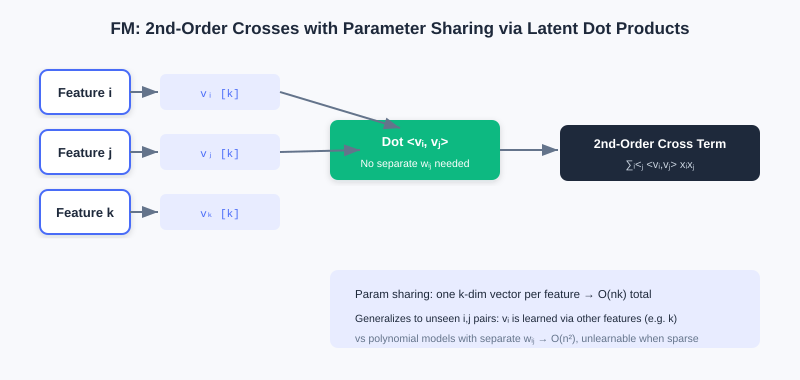
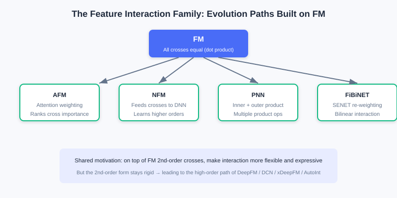
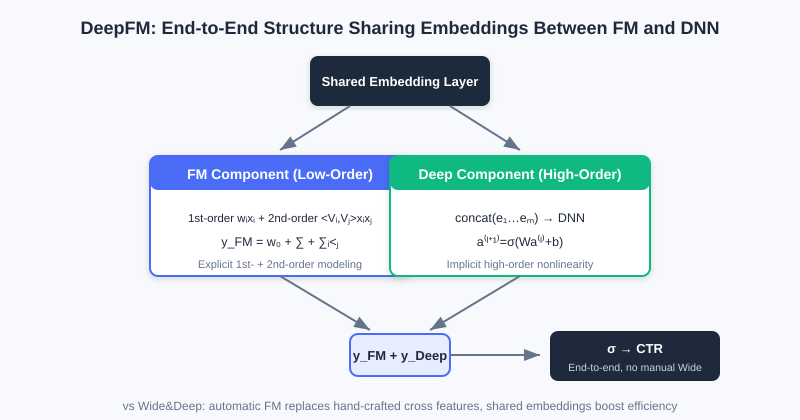
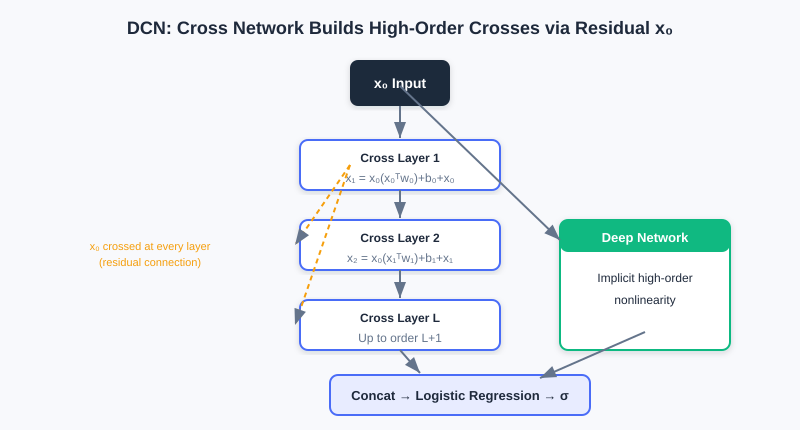
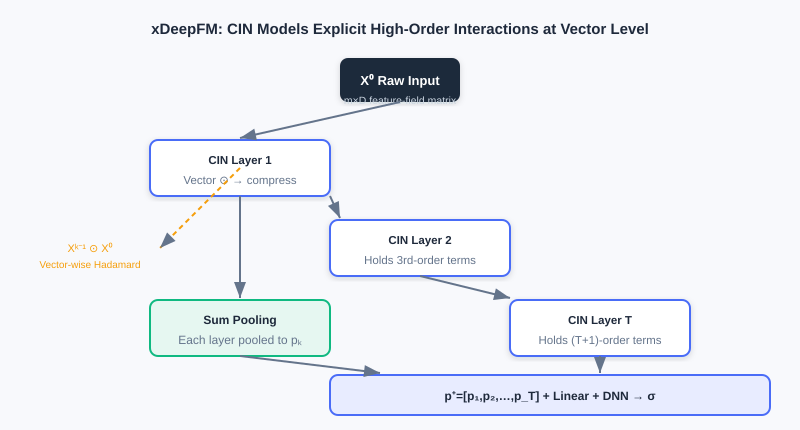

  📖
  ⏱️ ~55 min read
  🎯 Advanced

# Feature Crossing

> 📝 **Before You Continue:** Please read [3.1 Wide & Deep](./wide-and-deep.md) first. This chapter exists precisely to fix 3.1's shortcoming that "the Wide part needs manually designed cross features" — understanding Wide's limitation is what makes FM's motivation click.

The Wide part of [3.1](./wide-and-deep.md) uses **manual cross features** to memorize strong rules, but hand-designing features is laborious and can never be exhaustive. A natural follow-up question arises: **can the machine learn feature interactions by itself?** That is exactly the problem feature crossing solves.

The most direct idea is to automatically capture interactions between all feature pairs — but recommender systems routinely have thousands of features; learning one parameter per pair would explode the parameter count; and the data is highly sparse, so most combinations have no training samples at all. In this chapter we start from FM's elegant factorization, walk all the way to automatic high-order crossing in xDeepFM and AutoInt, and include an interactive demo so you can "see" how high-order combinations are built step by step.

After reading this chapter, you will be able to:

- Explain how **FM** uses inner products of latent vectors to cut $O(n^2)$ parameters down to $O(nk)$ and ease sparsity
- Distinguish the enhancements that **AFM / NFM / PNN / FiBiNET** each add on top of FM
- Explain how **DeepFM** replaces the manual Wide part with "shared Embedding" for an end-to-end model
- Compare the differing motivations of the three high-order crossings: **DCN (element-wise)** / **xDeepFM (vector-wise)** / **AutoInt (adaptive)**
- Work through 4 leveled practice problems, and use the interactive demo to understand how high-order combinations form

---

## 3.2.0 Motivation: From Manual to Automatic Crossing

The Wide part of Wide & Deep depends on experts hand-designing cross features, which has two pain points: (1) the combination space is too large for humans to enumerate; (2) newly appearing combinations have no ready-made feature. What we want is a mechanism that **automatically learns interactions between arbitrary feature pairs without parameter explosion**.

Recall FM from Part 2's retrieval: it factorizes users and items into vectors and uses inner products for efficient retrieval. At the ranking stage, FM shows a different face — its core idea of "learn one vector per feature, then capture interactions with vector inner products" solves exactly the pain points above. The same technique appears twice at different stages.

### 🧠 Mental Model: Give Every Feature a "Business Card"

> Think of **FM's latent vector** as a "business card" handed to each feature, listing its interests. Want to know whether features A and B click? Instead of keeping a separate ledger for every A×B pair, just take the inner product of the two cards — high compatibility, large inner product. Even better: even if A and B have never appeared together in one sample, as long as each of their cards is well learned through other features, you can still infer the effect of A×B. That is the power of parameter sharing.

---

## 3.2.1 FM: Factorization Machines (Second-Order Crossing)

To capture feature interactions, a straightforward idea adds all second-order combination terms of the features to a linear model (a polynomial model):

$$y = w_0 + \sum_{i=1}^n w_i x_i + \sum_{i=1}^{n-1}\sum_{j=i+1}^n w_{ij} x_i x_j$$

It has two fatal flaws: (1) the parameter count is $O(n^2)$, unaffordable with many features; (2) in sparse data, most crossing terms $x_i x_j$ never co-occur, so the corresponding weights $w_{ij}$ cannot be learned.

FM's essence is **parameter sharing**: factorize each interaction weight into the inner product of two low-dimensional latent vectors, $w_{ij} = \langle \boldsymbol{v}_i, \boldsymbol{v}_j \rangle$. Thus:

$$y = w_0 + \sum_{i=1}^n w_i x_i + \sum_{i=1}^{n-1}\sum_{j=i+1}^n \langle \boldsymbol{v}_i, \boldsymbol{v}_j \rangle x_i x_j$$

where $\boldsymbol{v}_i, \boldsymbol{v}_j$ are the $k$-dimensional embeddings of features $i, j$ ($k \ll n$). Instead of learning $O(n^2)$ independent $w_{ij}$'s, each feature now needs only one $k$-dimensional vector, bringing the total parameter count down to **$O(nk)$**. More crucially: even if $i$ and $j$ never co-occur, as long as each co-occurs and learns well with other features (e.g., $k$), $\boldsymbol{v}_i$ and $\boldsymbol{v}_j$ are still valid, so the model can generalize to predict the effect of $x_i \times x_j$. Moreover, via an algebraic transformation, the FM second-order term's computation drops from $O(kn^2)$ to linear **$O(kn)$**:

$$\sum_{i=1}^{n-1}\sum_{j=i+1}^n \langle\boldsymbol{v}_i,\boldsymbol{v}_j\rangle x_i x_j = \frac{1}{2}\left[\left(\sum_{i=1}^n x_i\boldsymbol{v}_i\right)^2 - \sum_{i=1}^n x_i^2\boldsymbol{v}_i^2\right]$$

Each feature learns one $k$-dimensional latent vector; the interaction of any two features is given by an inner product, with no per-pair weights — parameters drop from $O(n^2)$ to $O(nk)$.

> **Analysis:** FM uses parameter sharing to solve both "parameter explosion" and "hard to learn under sparsity" at once, making it a widely used second-order crossing baseline in industry. Its limitation: it only models **second-order** pairwise interactions; higher-order combinations still rely on an upper DNN to learn implicitly, and the interaction form is a fixed "inner product" that cannot differentiate the importance of different crossings.

---

## 3.2.2 FM Family Enhancements: AFM / NFM / PNN / FiBiNET

FM treats all crossings "equally," but in practice different crossings matter to different degrees. Researchers have made various enhancements on top of it:

- **AFM (Attention FM)** introduces attention, assigning each pair a weight $a_{ij}$ (Softmax normalized) so the model focuses on important interactions; the attention weights are visualizable and improve interpretability. Its interaction layer first computes the element-wise product $(v_i \odot v_j)x_i x_j$, then does attention pooling: $\hat{y}_{afm} = w_0 + \sum_i w_i x_i + \boldsymbol{p}^T\sum_{i<j} a_{ij}(v_i\odot v_j)x_i x_j$.
- **NFM (Neural FM)** feeds FM's second-order crossing result (in vector form) as "raw material" into a DNN to learn higher-order nonlinearity. The key is the **Bi-Interaction pooling layer**: $f_{BI} = \sum_{i<j} x_i v_i \odot x_j v_j$, also optimizable to $O(kn)$, then fed into an MLP. FM can be seen as the special case of NFM without hidden layers.
- **PNN (Product-based NN)** argues inner products / element-wise products each have limits, so its "product layer" uses **inner products (IPNN) and outer products (OPNN)** together to capture richer interactions, with matrix decomposition / superposition approximations reducing complexity from $O(N^2M)$ to $O(NM)$.
- **FiBiNET** first learns **feature importance** (borrowing SENET from vision: Squeeze → Excitation → Re-weight), then uses **bilinear interaction** $p_{ij}=v_i\cdot W \odot v_j$ to break the symmetric-interaction constraint, combining "important features" with "flexible interactions."

From "all crossings equally important" (FM) to "attention weighting" (AFM), "feeding a DNN" (NFM), "multiple product operations" (PNN), "re-weight first then bilinear" (FiBiNET) — the evolution always revolves around "more flexible, more expressive."

> 💡 **Key Insight:** These models all answer "how to do better on top of FM's second-order crossing" — some add attention (AFM), some attach deep networks (NFM), some change the product form (PNN), some select important features first (FiBiNET). But their second-order crossing form remains fairly fixed.

---

## 3.2.3 DeepFM: Unified Low-Order and High-Order Modeling

The Wide part of [3.1](./wide-and-deep.md) needs heavy manual feature engineering. DeepFM simply replaces Wide with **manual-free FM** and lets FM and Deep **share the same set of embeddings**. Two benefits follow: (1) low-order and high-order interactions are learned together; (2) the shared embedding makes training more efficient.

DeepFM consists of two **parallel** components, FM and DNN, with shared inputs:

- The **FM component** captures first- + second-order crossings: $y_{FM} = \langle w,x\rangle + \sum_{i<j}\langle V_i,V_j\rangle x_i x_j$.
- The **Deep component** concatenates all embeddings and feeds them to a DNN to learn high-order nonlinearity: $a^{(0)}=[e_1,\ldots,e_m]$, $a^{(l+1)}=\sigma(W^{(l)}a^{(l)}+b^{(l)})$.

The two logits are summed and passed through Sigmoid: $\hat{y}=\sigma(y_{FM}+y_{Deep})$.

FM and DNN share one set of embeddings: FM learns low-order (first + second), DNN learns high-order, and their sum gives the final prediction — manual Wide features eliminated entirely.

> **Analysis:** DeepFM's biggest improvement over Wide & Deep is **replacing the manual Wide part with automatically learned FM**, achieving a truly end-to-end model. Complexity mainly comes from the parallel FM + DNN, but the shared embedding avoids doubling parameters. Limitation: FM explicitly models only second order; higher orders still rely on the DNN implicitly, and the interaction form is fixed.

---

## 3.2.4 High-Order Crossing: DCN (Residual High-Order)

The FM family explicitly models second order; higher orders are mostly learned implicitly by the DNN, and we can't tell which order the DNN actually learned. DCN (Deep & Cross Network) replaces the Wide part with a **Cross Network**, where every layer crosses with the original input $\boldsymbol{x}_0$, thereby **explicitly** learning high-order interactions:

$$\boldsymbol{x}_{l+1} = \boldsymbol{x}_0 \boldsymbol{x}_l^T \boldsymbol{w}_l + \boldsymbol{b}_l + \boldsymbol{x}_l$$

This is a **residual structure**: layer $l$ adds a "cross with the original input" term on top of the previous layer's output. The deeper the network, the higher the crossing order — layer 1 contains second order, layer 2 contains third order, and so on — while the parameter count grows only **linearly** with the input dimension. The Cross Network runs in parallel with the Deep Network, and their concatenated outputs go through logistic regression:

$$\boldsymbol{p} = \sigma([\boldsymbol{x}_{L_1}^T, \boldsymbol{h}_{L_2}^T]\boldsymbol{w}_{\text{logits}})$$

Each layer $x_{l+1}=x_0(x_l^T w_l)+b_l+x_l$: the residual connection preserves the original information, continual crossing with $x_0$ raises the order with depth, and parameters grow only linearly.

> **Analysis:** DCN learns arbitrarily high-order crossings explicitly and controllably, with efficient (linear-in-dimension) parameters. But it is an **element-wise (bit-wise)** crossing — every element of an embedding interacts separately, tearing the vector apart instead of treating the embedding as a whole feature. That is exactly what xDeepFM corrects.

---

## 3.2.5 xDeepFM: Vector-Wise CIN Interactions

DCN crosses at the element level; xDeepFM proposes the **Compressed Interaction Network (CIN)** and switches to **vector-wise** interactions, which better match intuition. xDeepFM has three components: linear + DNN (implicit high-order) + CIN (explicit high-order vector-wise), merged at the end.

The core of CIN: the layer-$k$ output $\boldsymbol{X}_k$ is a weighted sum of all pairwise **Hadamard products** between the previous layer $\boldsymbol{X}_{k-1}$ and the original input $\boldsymbol{X}_0$:

$$\boldsymbol{X}_{h,*}^k = \sum_{i=1}^{H_{k-1}}\sum_{j=1}^m \boldsymbol{W}_{i,j}^{k,h}(\boldsymbol{X}_{i,*}^{k-1}\circ\boldsymbol{X}_{j,*}^0)$$

where $\circ$ is the vector-wise Hadamard product, preserving the $D$-dimensional vector structure. Layer $k$'s output contains **all $(k+1)$-order** vector-wise interactions. The feature maps of each layer are concatenated after Sum Pooling, then merged with the linear and DNN outputs through Sigmoid:

$$\hat{y}=\sigma(\boldsymbol{w}_{\text{linear}}^T\boldsymbol{a}+\boldsymbol{w}_{\text{dnn}}^T\boldsymbol{x}_{\text{dnn}}^k+\boldsymbol{w}_{\text{cin}}^T\boldsymbol{p}^+ + b)$$

Each CIN layer takes vector-wise Hadamard products of "previous layer's feature maps × original input," then compresses them with weights into new feature maps; stacked layer by layer, this yields vector-wise crossings from second order up to T+1 order.

> **Analysis:** xDeepFM combines "explicit vector-wise interactions" with "implicit element-wise interactions," gaining expressiveness and interpretable interactions (which layer corresponds to which order). The cost is the extra computation of the $H_{k-1}\times m$ weighted vector sums in CIN, so the number of feature maps must be set carefully.

---

## 3.2.6 AutoInt: Self-Attention Adaptive Interactions

Each DCN layer crosses with $x_0$ in a fixed way, and xDeepFM's CIN also interacts in a fixed manner. AutoInt changes the approach: **let the model decide which features interact and how strongly** — using the Transformer's self-attention to adaptively learn interactions of arbitrary order.

For features $m,k$, the relevance score of attention head $h$:

$$\alpha_{m,k}^{(h)} = \frac{\exp(\psi^{(h)}(\boldsymbol{e}_m,\boldsymbol{e}_k))}{\sum_{l=1}^M \exp(\psi^{(h)}(\boldsymbol{e}_m,\boldsymbol{e}_l))},\quad \psi^{(h)} = \langle W_Q^{(h)}\boldsymbol{e}_m, W_K^{(h)}\boldsymbol{e}_k\rangle$$

The scores weight and sum the Values to obtain the new representation $\tilde{e}_m^{(h)}$; multi-head outputs are concatenated with residual connections added. Stacked layers: the first layer contains second order, the second contains third order, and so on — the interaction pattern is **entirely determined dynamically by attention weights**. Finally, all layers' representations are concatenated and fed to logistic regression.

> 💡 **Key Insight:** The motivational differences among the three high-order crossings are clear at a glance — **DCN** crosses in a fixed residual way (element-wise), **xDeepFM** crosses in a fixed CIN way (vector-wise), and **AutoInt** crosses **adaptively** with attention. The first two hard-code the interaction pattern; AutoInt leaves "who interacts with whom, how strongly" to the data, which is more flexible and interpretable (inspect the attention matrices).

---

## 3.2.7 Interactive Demo: How High-Order Crossings Form Layer by Layer

The interactive demo below gives a hands-on feel for how combinations "second order → third order → higher" are constructed from base features step by step. Click "Next" to observe which new crossing combinations each layer adds.

<iframe src="../viz/part3-feature-crossing.html?embed&vizId=part3-feature-crossing" style="width:100%; height:520px; border:none; display:block;" loading="lazy"></iframe>

The demo uses 4 base features (e.g., gender, city, category, price tier) and shows layer by layer: layer 1 produces all second-order combinations, layer 2 crosses second-order ones with base features to get third order, and so on — exactly the intuition behind the explicit high-order crossings in DCN / CIN.

---

## ⚠️ Common Mistakes in 3.2

| # | Mistake | Example | Why It's Wrong | Fix |
|---|---------|---------|---------------|-----|
| 1 | Thinking FM learns an independent weight per feature pair | "FM has $O(n^2)$ crossing weights" | FM **shares** parameters via latent-vector inner products, only $O(nk)$ | Remember: $w_{ij}=\langle v_i,v_j\rangle$; parameters scale linearly in $n$ |
| 2 | Overlooking FM's significance for sparsity | "If features never co-occur, nothing can be learned" | Latent vectors are learned indirectly via co-occurrence with other features, enabling generalization | Parameter sharing is FM's core answer to sparsity |
| 3 | Treating DeepFM as identical to Wide & Deep | "DeepFM also needs manual cross features" | DeepFM **replaces** manual Wide with FM, end-to-end | Distinguish: Wide & Deep = manual crossing, DeepFM = automatic FM |
| 4 | Confusing DCN's and xDeepFM's crossing granularity | "Both are high-order crossing, no difference" | DCN is **element-wise**, xDeepFM is **vector-wise** | Check whether crossing happens on scalars or whole embedding vectors |
| 5 | Believing more high-order crossing is always better | "Stacking 10 Cross layers must be stronger" | Very high orders overfit, compute is expensive, and the business may not need it | Choose depth by data complexity and the validation set |

---

## Chapter Summary

### 📌 Key Takeaways

| Concept | Key Points | Why It Matters |
|---------|-----------|----------------|
| FM factorization | $w_{ij}=\langle v_i,v_j\rangle$, parameters $O(nk)$ | Automatic second-order crossing solves parameter explosion + sparsity |
| FM family | AFM attention / NFM attaches DNN / PNN multiple products / FiBiNET re-weighting | Enhancements on top of second-order crossing |
| DeepFM shared Embedding | FM (low-order) + DNN (high-order) share input | End-to-end replacement of manual Wide |
| DCN residual high-order | $x_{l+1}=x_0 x_l^T w_l+b_l+x_l$ (element-wise) | Explicit, controllable high-order crossing with linear parameters |
| xDeepFM CIN | Layer-by-layer compression of vector-wise Hadamard products | Vector-wise explicit high order, interpretable |
| AutoInt adaptive | Self-attention decides interactions and strength | Most flexible; interactions learned from data |

### ❓ FAQ

**Q1: Why not just let a DNN learn high-order crossings — why FM/DCN?**
> A: A DNN can learn high orders implicitly, but we don't know which order or which combinations it learned, and sparse combinations are hard to guarantee. FM/DCN/xDeepFM make crossings **explicit** — controllable, interpretable, and friendlier to sparsity.

**Q2: DCN or xDeepFM — which should I pick?**
> A: If feature interactions are better treated as "whole-vector" relations (e.g., semantic embeddings), xDeepFM's vector-wise form fits better; if simplicity and efficiency suffice and element-wise works, DCN is lighter. In practice, let the validation set and compute budget decide.

**Q3: Can AutoInt's attention weights be used as feature importance?**
> A: Yes. The attention matrices $\alpha^{(h)}$ directly show which feature pairs contribute to interactions — a major source of interpretability and one of AutoInt's advantages over DCN/xDeepFM.

### 🔗 Connections to Later Chapters

- **3.3 (Sequence Modeling)** steps out of the "static feature bag" and adds the time dimension; DIN's attention shares its roots with the attention in AFM/AutoInt.
- The shared-bottom structures (Shared-Bottom/MMoE) of **3.4 (Multi-Objective)** often use DeepFM-style models as the backbone.
- In **Part 2 retrieval**, FM is used for two-tower retrieval — two ends of the same technique as its ranking use in this chapter.

---

## Practice Problems

Work through all problems in order — they get progressively harder. Each has a complete solution you can reveal after trying it yourself.

---

**Problem 3.2.1 — FM Parameter Sharing** 🟢 Easy

A recommendation scenario has $n=1000$ features, and FM's latent vector dimension is $k=8$. Answer:

1. With the original polynomial model, roughly how many second-order crossing weights $w_{ij}$ are there?
2. With FM's latent-vector scheme, roughly how many parameters? How many orders of magnitude does that save?

💡 Solution (click to reveal)

**Approach:** Apply the order-of-magnitude formulas directly.

1. The polynomial model's second-order term has about $n^2/2 = 1000^2/2 = 5\times 10^5$ weights.
2. FM needs only one $k$-dimensional vector per feature: $n \times k = 1000 \times 8 = 8000$ parameters.

**Key points:**
- From $5\times 10^5$ down to $8\times 10^3$ — roughly **2 orders of magnitude** (a hundredfold).
- The gap widens as $n$ grows — the key to FM's industrial viability.

---

**Problem 3.2.2 — Identify the Crossing Type** 🟢 Easy

Match each description to the correct model among FM / DeepFM / DCN / xDeepFM / AutoInt:

- (a) Does residual crossing with the original input layer by layer, but tears apart every element of the embedding.
- (b) FM and DNN share one set of feature embeddings, learning low-order and high-order separately.
- (c) Uses multi-head self-attention to let the model decide which features should interact and how strongly.
- (d) Takes vector-wise Hadamard products of the previous layer's feature maps with the original input, then compresses.

💡 Solution (click to reveal)

**Approach:** Grasp each crossing's "granularity" and "whether it's adaptive."

- (a) **DCN** (element-wise / bit-wise residual crossing)
- (b) **DeepFM** (parallel FM + DNN with shared embeddings)
- (c) **AutoInt** (self-attention adaptive interaction)
- (d) **xDeepFM** (CIN vector-wise interaction)

**Key points:**
- Element-wise vs vector-wise: DCN vs xDeepFM.
- Adaptive vs fixed: AutoInt stands alone.

---

**Problem 3.2.3 — Motivation Follow-up** 🟡 Medium

Why can FM still give a reasonable prediction for the crossing $x_i\times x_j$ when features $i$ and $j$ have never co-occurred in the training set? Explain using parameter sharing.

💡 Solution (click to reveal)

**Approach:** Explain from the perspective of "indirect learning" of latent vectors.

In FM the interaction weight is $w_{ij}=\langle v_i, v_j\rangle$. Even if $i$ and $j$ never co-occur, $v_i$ can be learned well from $i$'s co-occurrence with other features (e.g., $k$), and $v_j$ likewise from $j$'s co-occurrence with $k$. As long as these latent vectors are sufficiently well learned, their inner product can infer the tendency of $i\times j$ — no direct samples of $i,j$ needed.

**Key points:**
- Parameter sharing lets "combinations never directly observed" still be estimated by generalization.
- This is FM's fundamental advantage over "independent weight per combination" in sparse settings.

---

**Problem 3.2.4 — Derive FM's Linear Complexity** 🔴 Hard

Starting from FM's second-order term $\sum_{i<j}\langle v_i,v_j\rangle x_i x_j$, prove it equals $\frac{1}{2}[(\sum_i x_i v_i)^2 - \sum_i x_i^2 v_i^2]$, so the computation cost is $O(kn)$. Also explain: when a feature $x_k=0$, how are its interactions with all other features naturally ignored?

💡 Solution (click to reveal)

**Approach:** Expand the square and cancel terms.

$(\sum_i x_i v_i)^2 = \sum_i x_i^2 v_i^2 + 2\sum_{i<j} x_i x_j \langle v_i,v_j\rangle$. Rearranging gives $\sum_{i<j} x_i x_j\langle v_i,v_j\rangle = \frac{1}{2}[(\sum_i x_i v_i)^2 - \sum_i x_i^2 v_i^2]$. Both terms only require $O(k)$ vector additions/squares over $n$ features followed by a sum — $O(kn)$ total instead of $O(kn^2)$.

When $x_k=0$, it contributes nothing to $\sum_i x_i v_i$ and $x_k^2 v_k^2=0$, so every interaction term involving $k$ vanishes automatically — no explicit skipping needed; sparse features are ignored with zero wasted computation.

**Key points:**
- The algebraic transformation is what makes FM usable for high-dimensional sparse data.
- Interactions auto-zero when $x_k=0$, a perfect fit for sparsity.

---

**🏆 Challenge: Design a Crossing Scheme**

A news app has 500 sparse features. It needs to capture second-order strong rules like "age × category," hopes the model automatically discovers patterns of third order and above, and requires an interpretable structure (being able to see which crossings matter). Pick **a combination of 2** from FM / AFM / DCN / xDeepFM / AutoInt and justify your choice (within 150 words).

💡 Hint

Second-order + interpretable weights → AFM (attention visualization); high-order + interpretable order → xDeepFM (each CIN layer corresponds to a fixed order) or AutoInt (attention matrices). DCN is element-wise and can't directly show crossing importance, so you can skip it. A combination like "AFM + xDeepFM" covers interpretable low-order and interpretable vector-wise high-order.

