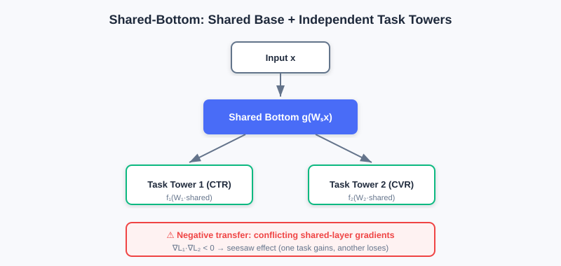
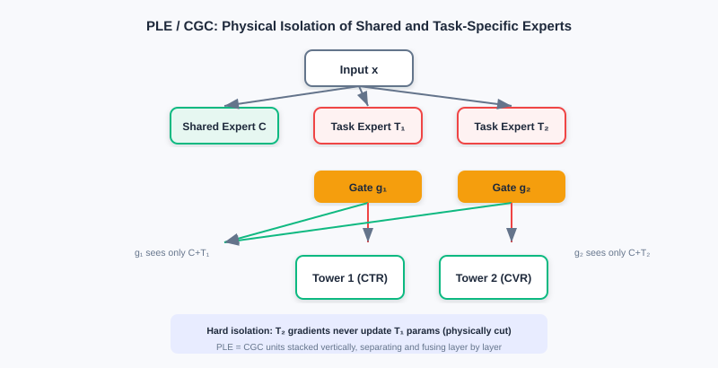
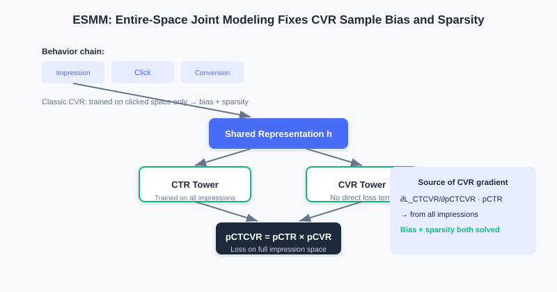

  📖
  ⏱️ ~50 min read
  🎯 Intermediate

# Multi-Objective Optimization

> 📝 **Before You Continue:** Recommended: finish [3.1 Wide & Deep](./wide-and-deep.md) first. The "shared bottom + task towers" structure of multi-objective models is exactly the extension and multi-tasking of the Wide & Deep idea.

The previous chapters all optimize a **single objective** (usually click-through rate). But real recommender systems almost always want everything at once: e-commerce must optimize click-through rate (CTR) and conversion rate (CVR) together; content platforms must balance consumption depth against ad exposure. Once multiple objectives share one model, trouble arrives — objectives can conflict, and hard sharing causes a "seesaw": improving one sacrifices the other.

In this chapter, following the main thread of "how to ease multi-task conflict," we go from the plainest **Shared-Bottom**, to **MMoE** (multi-gate), **PLE** (explicit expert separation), then extend to **ESMM / ESM2** for objectives with **dependencies**, and finally discuss how to **fuse and optimize** multiple losses. The core remains the same sentence: every structural improvement exists to solve some shortcoming of the previous method.

After reading this chapter, you will be able to:

- Explain the "negative transfer / seesaw" problem of **Shared-Bottom** and its mathematical origin (gradient conflict)
- Explain how **MMoE** achieves gradient isolation with "per-task dedicated gates" to ease conflicts
- Describe how **PLE (CGC)** explicitly separates shared experts from task experts, further rooting out negative transfer
- Use **ESMM**'s "entire-space modeling" to explain how it resolves CVR's sample selection bias and data sparsity
- Work through 4 leveled practice problems comparing multi-objective structures and loss-fusion strategies

---

## 3.4.0 Motivation: When There Is More Than One Objective

The biggest difference in multi-objective modeling is that objectives **fight** each other. For example, simultaneously optimizing "click-through rate" and "average order value" in e-commerce: cheap items lift clicks but depress order value; when content platforms balance "consumption depth" against "ad exposure," deep reading is often negatively correlated with ad clicks.

> 💡 **Key Insight:** When the gradients of tasks $i,j$ point in opposite directions ($\nabla L_i \cdot \nabla L_j < 0$), updates to shared-layer parameters fall into directional contradiction — this is **negative transfer**, often called the **seesaw problem**: improving one objective usually comes at the cost of the other. The design of multi-objective models is, in essence, "how to reduce this conflict."

### 🧠 Mental Model: Several Tenants in One Building

> Think of **Shared-Bottom** as a **building with a shared foundation**, where each tenant (task) builds its own tower on the same foundation. The foundation is cheap and efficient, but if one tenant wants to remodel, the whole building may crack — that's negative transfer. MMoE gives each tenant its **own elevator dispatching** (gates), so each uses different experts on demand; PLE goes further, giving each tenant **dedicated rooms** (task experts) + a common living room (shared experts) — physical separation, no interference.

---

## 3.4.1 Basic Structures: Shared-Bottom and MMoE

**Shared-Bottom** is the foundational multi-objective architecture: "shared foundation + independent towers." All tasks share the feature-transformation layers $g(\cdot)$, each with its own task tower $f_t$:

$$\hat{y}_t = f_t(W_t \cdot g(W_s \boldsymbol{x}))$$

It is parameter-efficient (the shared layers hold most parameters), has a regularization effect (prevents single-task overfitting), and transfers knowledge across related tasks. But its fatal flaw is **negative transfer**: when tasks fundamentally conflict, the shared layer's gradient is decided jointly by all tasks, and when directions contradict, optimization becomes a zero-sum game.

In Shared-Bottom, all tasks hard-share the bottom layers $g(\cdot)$ and each builds an independent tower $f_t$; when tasks conflict, the shared layer's gradient directions contradict, falling into a zero-sum game (negative transfer).

**MMoE (Multi-gate Mixture-of-Experts)** targets negative transfer by upgrading "one globally shared gate" to "a dedicated gate per task." Every expert $e_k=f_k(x)$ is shared by all tasks, but task $t$ has its own gate $g_t(x)=\text{softmax}(W_t x)$ to weight and fuse the experts:

$$\boldsymbol{h}_t = \sum_{k=1}^K g_{t,k}\cdot \boldsymbol{e}_k,\quad \hat{y}_t = f_t(\boldsymbol{h}_t)$$

When tasks $i,j$ conflict, the gates let them learn **different expert weight distributions** — some expert $e_m$ gets high weight in task $i$'s gate and low weight in task $j$'s, so $e_m$'s parameter updates are driven mainly by task $i$'s gradient with little influence from task $j$, achieving **gradient isolation**.

Left: Shared-Bottom hard-shares the bottom across all tasks — negative transfer under conflict. Right: MMoE gives each task a dedicated gate that picks experts on demand, easing conflicts.

> **Analysis:** MMoE eases conflicts among weakly related tasks at low cost via "multi-gate," keeping parameter efficiency high. Limitations: all experts remain **visible** to every task's gate — even if an expert is ignored by task $j$'s gate, gradients may still flow through it during backprop (a latent pathway), so under strong conflicts the shared representation can still be polluted; and the gate must assign weights over all experts, so the decision burden grows as experts multiply.

---

## 3.4.2 PLE: Explicit Expert Separation

MMoE's "soft isolation" doesn't root out negative transfer: the **interference pathway is not cut** (experts remain visible to all gates), and **expert roles are ambiguous** (one expert may carry both shared and task-specific information). PLE (Progressive Layered Extraction) uses the **CGC (Customized Gate Control)** structure to explicitly separate shared knowledge from task-specific knowledge through **hard structural constraints**.

CGC splits experts into two kinds:

- **Shared experts (C-Experts)**: learn only what all tasks have in common, producing outputs $\{c_1,\ldots,c_M\}$.
- **Task experts (T-Experts)**: dedicated to task $t$, learning only that task's specific patterns, producing $\{t_t^1,\ldots,t_t^{N_t}\}$.

The key constraint: task $t$'s gate $g_t$ has its input **restricted to** "shared experts + this task's dedicated experts" and **cannot access** other tasks' dedicated experts at all. Hence task $s$'s gradient never updates task $t$'s dedicated expert parameters — **physically cutting the interference pathway**. The fusion is:

$$\boldsymbol{h}_t = \sum_{k=1}^M g_{t,k}\cdot \boldsymbol{c}_k + \sum_{j=1}^{N_t} g_{t,M+j}\cdot \boldsymbol{t}_t^j$$

PLE **stacks** multiple CGC units vertically into a deep architecture, performing "explicit knowledge separation + fusion" layer by layer for progressive extraction.

In CGC, each task sees only "shared experts + its own dedicated experts"; other tasks' dedicated experts are physically separated. PLE stacks multiple CGC units vertically, deepening layer by layer.

> 💡 **Key Insight:** Shared-Bottom (hard sharing) → MMoE (soft isolation, multi-gate) → PLE (hard isolation, expert separation) is a clear storyline of "progressively stronger conflict mitigation." The cost: PLE has more parameters and a more complex structure, but in exchange for more stable multi-task learning.

---

## 3.4.3 Modeling Task Dependencies: ESMM and ESM2

The previous methods address "correlation conflicts" between tasks, but real tasks often have explicit **dependencies**. User behavior has a natural temporal chain: impression → click → conversion. A traditional CVR model trains only on clicked samples but must predict on all impressions online, causing two problems:

1. **Sample Selection Bias**: the training and serving sample distributions differ, hurting generalization.
2. **Data Sparsity**: converted samples = impressions × CTR × CVR (e.g., with CTR ≈ 2% and CVR ≈ 0.5%, conversions are one in ten thousand impressions) — extremely sparse.

**ESMM (Entire Space Multi-task Model)** rebuilds task relations with probabilistic-graph constraints. It trains a CTR tower and a CVR tower together, but **does not compute the Loss on CVR directly** — instead it computes the Loss on $pCTCVR = pCTR \times pCVR$ over the entire impression space:

$$\mathcal{L} = \mathcal{L}_{CTR} + \mathcal{L}_{CTCVR}$$

where $\mathcal{L}_{CTR}$ uses all impression samples (standard binary cross-entropy), and $\mathcal{L}_{CTCVR}$ is computed over the entire space with $pCTCVR=pCTR\cdot pCVR$. The **CVR tower's gradients thus also flow in the impression space**, completely resolving sample selection bias and sparsity — the CVR tower learns well by "indirectly" borrowing the CTR tower's full samples.

**ESM2** extends the idea to a longer chain (impression → click → cart DAction → purchase). It sets up four towers predicting $y_1$ (click | impression), $y_2$ (decision action | click), $y_3$ (purchase | decision action), $y_4$ (purchase | other actions), but computes only three entire-space losses ($\mathcal{L}_{ctr}$, $\mathcal{L}_{ctavr}$, $\mathcal{L}_{ctcvr}$), all optimized in the impression space. The final $pCTCVR = y_1(y_2\cdot y_3 + (1-y_2)\cdot y_4)$ merges the two purchase paths.

ESMM trains CTR and CVR towers together, computing the Loss with $pCTCVR=pCTR\times pCVR$ over the entire impression space so that CVR gradients also come from the full samples, resolving bias and sparsity.

> **Analysis:** ESMM/ESM2's "entire-space modeling" cleverly uses **product relations** to pull dependent objectives back into the same training space — the standard solution for task dependencies. Limitations: it assumes CTR and CVR share the bottom (which can be replaced with MMoE/PLE for a stronger base), and it relies on the business assumption that "the chain decomposes into a product of probabilities."

---

## 3.4.4 Multi-Objective Loss Fusion

Once the structure is fixed, jointly optimizing multiple losses is a discipline of its own. Naive weighting $\mathcal{L}_{total}=\sum_i w_i \mathcal{L}_i$ has three fundamental flaws: magnitude imbalance (CTR loss 0.1–0.5, CVR can reach 2.0+, and the big loss dominates), asynchronous convergence (sparse tasks are slow), and gradient conflict (task gradients cancel when the angle between them exceeds 90°). Three families of adaptive methods dominate:

- **Uncertainty Weight (UWL)**: dynamically re-weights by per-task (learnable) uncertainty $\sigma$: $\mathcal{L}=\frac{1}{2\sigma_1^2}\mathcal{L}_1+\frac{1}{\sigma_2^2}\mathcal{L}_2+\log\sigma_1+\log\sigma_2$. A large, uncertain loss gets its weight suppressed, preventing one task from dragging the model off course.
- **GradNorm**: introduces a gradient loss, dynamically re-weighting by "gradient magnitude $G_W^{(i)}$" and "relative training rate $r_i(t)$" so that each task's gradient magnitude and rate tend toward balance, preventing fast tasks from dominating while slow tasks underfit.
- **Pareto Optimization**: when gradient directions fundamentally conflict (improving A must hurt B), use KKT conditions to make the weights learnable variables, alternately updating parameters $\theta$ and weights $w_i$ (subject to $\sum w_i=1, w_i\ge c_i$), steering optimization toward the **Pareto frontier** (where no solution improves one task without hurting another).

> 💡 **Key Insight:** Loss fusion strategies are **orthogonal** to network structure — whether you use Shared-Bottom, MMoE, or PLE, you can wrap UWL / GradNorm / Pareto around the outside to balance multiple losses. Structure solves "representation conflict"; loss fusion solves "optimization conflict."

---

## ⚠️ Common Mistakes in 3.4

| # | Mistake | Example | Why It's Wrong | Fix |
|---|---------|---------|---------------|-----|
| 1 | Assuming a shared bottom is always beneficial | "Always use Shared-Bottom for multi-task — it's the cheapest" | Hard sharing under task conflict causes negative transfer (seesaw) | Switch conflicting tasks to MMoE / PLE |
| 2 | Confusing MMoE's and PLE's isolation levels | "MMoE already fully separates experts" | MMoE is soft isolation; experts remain visible to all gates | PLE uses CGC to physically separate task experts |
| 3 | Computing Loss directly on the CVR tower | "ESMM trains CVR just like MMoE" | That reintroduces sample selection bias and sparsity | ESMM computes over the entire space with $pCTR\times pCVR$ |
| 4 | Hand-fixing loss weights | "w_ctr=1, w_cvr=1 is fine" | Magnitudes / convergence speeds differ; the big loss dominates | Use UWL / GradNorm / Pareto adaptively |

---

## Chapter Summary

### 📌 Key Takeaways

| Concept | Key Points | Why It Matters |
|---------|-----------|----------------|
| Negative transfer / seesaw | $\nabla L_i\cdot\nabla L_j<0$ gradient conflict | The fundamental risk of hard sharing in multi-task learning |
| Shared-Bottom | Shared layers + task towers, parameter-efficient | Good for related tasks; negative transfer under conflict |
| MMoE multi-gate | Per-task dedicated gates pick experts; gradient isolation | Soft isolation eases conflicts |
| PLE / CGC | Shared experts + task experts physically separated | Hard isolation, rooting out interference pathways |
| ESMM entire space | $pCTCVR=pCTR\cdot pCVR$ | Resolves CVR bias + sparsity |
| Loss fusion | UWL / GradNorm / Pareto | Solves optimization-level conflicts |

### ❓ FAQ

**Q1: Should I use Shared-Bottom, MMoE, or PLE?**
> A: Highly related tasks → Shared-Bottom suffices and saves resources; weakly related, conflicting tasks → MMoE; strongly conflicting tasks or when stability is required → PLE. In essence: "the stronger the conflict, the harder the isolation."

**Q2: Must ESMM be used together with MMoE?**
> A: No. ESMM is the "entire-space probabilistic modeling" idea; the original paper's base can be a simple Shared-Bottom, which can also be replaced with MMoE/PLE for stronger bottom representations. The two are orthogonal.

**Q3: Which matters more, loss fusion or structure choice?**
> A: Both matter and they complement each other. Structure decides "whether representations can separate conflicts"; loss fusion decides "whether multiple losses can be optimized in balance." In practice, fix the structure first, then tune the loss-fusion strategy.

### 🔗 Connections to Later Chapters

- **3.5 (Multi-Scenario)** swaps "multi-task differences" for "multi-scenario distribution differences"; multi-tower / dynamic weights share ancestry with the MMoE idea.
- DIN and other models from **3.3 (Sequence Modeling)** often serve as the underlying backbone of multi-objective models.
- **Part 4 re-ranking** optimizes list-level experience on top of ranking (multi-objective scoring); multi-objective scores are the input to re-ranking.

---

## Practice Problems

Work through all problems in order — they get progressively harder. Each has a complete solution you can reveal after trying it yourself.

---

**Problem 3.4.1 — Spotting Negative Transfer** 🟢 Easy

A content app simultaneously optimizes "consumption depth (reading time)" and "ad exposure volume." Engineers find that after raising ad exposure, reading time drops noticeably. Is this negative transfer? Explain the mathematical cause.

💡 Solution (click to reveal)

**Approach:** Check for the seesaw signature of "improving one objective harms the other," and explain via gradient conflict.

Yes, it is negative transfer. The two objectives are negatively correlated, and the shared layer's gradients point in opposite directions: $\nabla L_{depth}\cdot\nabla L_{ads}<0$. Shared-Bottom's hard sharing makes the parameter update directions contradictory — optimizing one must hurt the other, falling into a zero-sum game.

**Key points:**
- Seesaw = hard-sharing conflict between negatively correlated objectives.
- Fix: switch to MMoE/PLE to isolate the conflicting pathways.

---

**Problem 3.4.2 — MMoE vs PLE** 🟢 Easy

Judge whether each statement is true or false, and correct it:

- (a) In MMoE each task has a dedicated gate, so there is no gradient interference between tasks anymore.
- (b) In PLE's CGC, task $t$'s gate can also see task $s$'s dedicated experts.

💡 Solution (click to reveal)

**Approach:** Grasp the "soft vs hard isolation" distinction.

- (a) **False**: MMoE is soft isolation — experts remain visible to all gates, and even if ignored, gradients may still flow through them during backprop (a latent pathway). Only PLE physically separates.
- (b) **False**: CGC hard-constrains task $t$'s gate **input to be only** "shared experts + its own dedicated experts"; it **cannot see** other tasks' dedicated experts at all, and task $s$'s gradient never updates task $t$'s dedicated experts.

**Key points:**
- MMoE = soft isolation; PLE/CGC = hard isolation.
- Isolation increases progressively: Shared-Bottom < MMoE < PLE.

---

**Problem 3.4.3 — ESMM's Motivation** 🟡 Medium

Why does the traditional CVR model run into problems when "trained on clicked samples, predicting on all impressions"? How does ESMM solve it with $pCTCVR=pCTR\times pCVR$?

💡 Solution (click to reveal)

**Approach:** Start from the two angles: mismatched sample spaces + sparsity.

A traditional CVR model trains only on clicked samples (CTR positives) but must predict on all impressions online — the training and serving distributions differ → **sample selection bias**, hurting generalization; and converted samples are extremely sparse (impressions × CTR × CVR), making learning hard.

ESMM trains the CTR and CVR towers together, but instead of computing a Loss on CVR directly, it computes $\mathcal{L}_{CTCVR}$ over the entire impression space with $pCTCVR=pCTR\times pCVR$. The CVR tower's gradient then flows through $pCTR$ from **all impression samples** — both bias and sparsity are resolved. CVR learns well by indirectly borrowing CTR's full data.

**Key points:**
- Root cause of the bias: training space (clicks) ≠ serving space (impressions).
- Fix: the product relation pulls CVR back into the entire space.

---

**Problem 3.4.4 — Proving Gradient Conflict in Negative Transfer** 🔴 Hard

Let shared parameters $\theta$ serve tasks 1 and 2, with loss changes approximated by $\Delta L_t \approx \nabla L_t \cdot \Delta\theta$. Suppose we apply unified gradient descent $\Delta\theta = -\eta(\nabla L_1 + \nabla L_2)$, and it is known that $\nabla L_1 \cdot \nabla L_2 < 0$ (angle greater than 90°). Prove: at least one task's loss must increase.

💡 Solution (click to reveal)

**Approach:** Substitute $\Delta\theta$ and inspect each task's loss change.

$\Delta L_1 \approx -\eta\nabla L_1\cdot(\nabla L_1+\nabla L_2) = -\eta(\|\nabla L_1\|^2 + \nabla L_1\cdot\nabla L_2)$. Since $\nabla L_1\cdot\nabla L_2<0$, the second term is positive and **cancels** part of the first term's decrease; if $|\nabla L_1\cdot\nabla L_2| > \|\nabla L_1\|^2$, then $\Delta L_1>0$ and task 1's loss rises. Symmetrically for task 2. Since the two gradients oppose each other, a unified update direction cannot decrease both simultaneously — one side must suffer. That is the mathematical essence of the seesaw / negative transfer.

**Key points:**
- Opposing gradients → the shared parameter update direction faces a dilemma.
- This explains why MMoE/PLE isolation, or Pareto optimization for non-deteriorating solutions, is needed.

---

**🏆 Challenge: Design a Multi-Objective Solution**

An e-commerce platform must optimize three objectives — CTR, CVR, and average order value — where CTR and CVR have a dependency (ESMM-style), and CVR and order value often conflict (seesaw). Combine suitable structures and justify your design (within 150 words), and specify the loss-fusion strategy.

💡 Hint

Use **PLE/CGC** at the bottom to isolate the CVR / order-value conflict (hard isolation); handle the CTR–CVR dependency with an **ESMM-style product** jointly in the entire space (the CTR/CVR towers can sit in a shared bottom). At the loss level, use **GradNorm or UWL** to adaptively balance the magnitudes and convergence speeds of the three losses.

